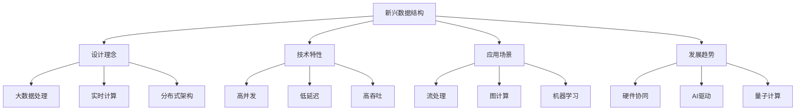

# 新兴数据结构

## 📖 核心概念

**新兴数据结构**是计算机科学前沿领域的重要研究方向，它们针对现代计算需求（如大数据、实时处理、分布式计算）而设计，具有传统数据结构无法比拟的性能优势和功能特性。这些结构代表了数据结构发展的未来方向。

### 🏗️ 新兴数据结构的组成要素



## 🔍 新兴数据结构分类

### 按应用领域分类

| 应用领域 | 数据结构 | 特点 | 优势 | 代表技术 |
|----------|----------|------|------|----------|
| **流处理** | 滑动窗口 | 实时计算 | 低延迟 | Apache Kafka |
| **图计算** | 图数据库 | 关系查询 | 高效遍历 | Neo4j |
| **机器学习** | 特征存储 | 向量计算 | 高维处理 | Faiss |
| **区块链** | 默克尔树 | 数据完整性 | 不可篡改 | Bitcoin |
| **量子计算** | 量子比特 | 并行计算 | 指数加速 | IBM Qiskit |

### 按技术特性分类

| 技术特性 | 数据结构 | 特点 | 优势 | 挑战 |
|----------|----------|------|------|------|
| **无锁** | Lock-free结构 | 高并发 | 无阻塞 | 实现复杂 |
| **持久化** | 持久化数据结构 | 版本控制 | 历史查询 | 空间开销 |
| **压缩** | 压缩数据结构 | 空间效率 | 内存友好 | 计算开销 |
| **近似** | 近似数据结构 | 概率保证 | 空间效率 | 精度损失 |

## 💻 流处理数据结构

### 滑动窗口实现

```cpp
template<typename T>
class SlidingWindow {
private:
    deque<T> window;
    size_t maxSize;
    chrono::milliseconds windowDuration;
    chrono::steady_clock::time_point windowStart;
    
public:
    SlidingWindow(size_t size, chrono::milliseconds duration) 
        : maxSize(size), windowDuration(duration) {
        windowStart = chrono::steady_clock::now();
    }
    
    // 添加元素
    void add(const T& element) {
        auto now = chrono::steady_clock::now();
        
        // 清理过期元素
        while (!window.empty() && 
               now - windowStart > windowDuration) {
            window.pop_front();
            windowStart += chrono::milliseconds(1);
        }
        
        // 添加新元素
        window.push_back(element);
        
        // 限制窗口大小
        while (window.size() > maxSize) {
            window.pop_front();
        }
    }
    
    // 获取窗口统计信息
    struct WindowStats {
        size_t count;
        T sum;
        T average;
        T min;
        T max;
    };
    
    WindowStats getStats() const {
        WindowStats stats;
        stats.count = window.size();
        
        if (window.empty()) {
            stats.sum = T{};
            stats.average = T{};
            stats.min = T{};
            stats.max = T{};
            return stats;
        }
        
        stats.sum = accumulate(window.begin(), window.end(), T{});
        stats.average = stats.sum / static_cast<T>(stats.count);
        stats.min = *min_element(window.begin(), window.end());
        stats.max = *max_element(window.begin(), window.end());
        
        return stats;
    }
    
    // 获取窗口大小
    size_t size() const {
        return window.size();
    }
    
    // 检查窗口是否为空
    bool empty() const {
        return window.empty();
    }
    
    // 清空窗口
    void clear() {
        window.clear();
        windowStart = chrono::steady_clock::now();
    }
};
```

### 时间窗口聚合器

```cpp
template<typename K, typename V>
class TimeWindowAggregator {
private:
    struct TimeBucket {
        chrono::steady_clock::time_point timestamp;
        unordered_map<K, V> data;
        
        TimeBucket(chrono::steady_clock::time_point ts) : timestamp(ts) {}
    };
    
    deque<TimeBucket> buckets;
    chrono::milliseconds bucketDuration;
    chrono::milliseconds windowDuration;
    
    // 清理过期桶
    void cleanupExpiredBuckets() {
        auto now = chrono::steady_clock::now();
        auto cutoff = now - windowDuration;
        
        while (!buckets.empty() && buckets.front().timestamp < cutoff) {
            buckets.pop_front();
        }
    }
    
    // 获取或创建当前时间桶
    TimeBucket& getCurrentBucket() {
        auto now = chrono::steady_clock::now();
        auto bucketTime = chrono::duration_cast<chrono::milliseconds>(
            now.time_since_epoch()) / bucketDuration * bucketDuration;
        auto bucketTimestamp = chrono::steady_clock::time_point(
            chrono::duration_cast<chrono::steady_clock::duration>(bucketTime));
        
        if (buckets.empty() || buckets.back().timestamp < bucketTimestamp) {
            buckets.emplace_back(bucketTimestamp);
        }
        
        return buckets.back();
    }
    
public:
    TimeWindowAggregator(chrono::milliseconds bucketDur, chrono::milliseconds windowDur)
        : bucketDuration(bucketDur), windowDuration(windowDur) {}
    
    // 添加数据
    void add(const K& key, const V& value) {
        cleanupExpiredBuckets();
        auto& bucket = getCurrentBucket();
        bucket.data[key] += value;
    }
    
    // 获取聚合结果
    unordered_map<K, V> getAggregatedData() const {
        unordered_map<K, V> result;
        
        for (const auto& bucket : buckets) {
            for (const auto& [key, value] : bucket.data) {
                result[key] += value;
            }
        }
        
        return result;
    }
    
    // 获取指定键的聚合值
    V getAggregatedValue(const K& key) const {
        V result = V{};
        
        for (const auto& bucket : buckets) {
            auto it = bucket.data.find(key);
            if (it != bucket.data.end()) {
                result += it->second;
            }
        }
        
        return result;
    }
    
    // 获取桶数量
    size_t getBucketCount() const {
        return buckets.size();
    }
    
    // 清空所有数据
    void clear() {
        buckets.clear();
    }
};
```

## 💻 图数据库结构

### 邻接表图存储

```cpp
template<typename VertexType, typename EdgeType>
class GraphDatabase {
private:
    struct Vertex {
        VertexType id;
        unordered_map<string, string> properties;
        unordered_map<string, vector<EdgeType>> outgoingEdges;
        unordered_map<string, vector<EdgeType>> incomingEdges;
        
        Vertex(VertexType id) : id(id) {}
    };
    
    struct Edge {
        EdgeType id;
        VertexType from;
        VertexType to;
        unordered_map<string, string> properties;
        
        Edge(EdgeType id, VertexType from, VertexType to) 
            : id(id), from(from), to(to) {}
    };
    
    unordered_map<VertexType, Vertex> vertices;
    unordered_map<EdgeType, Edge> edges;
    
public:
    // 添加顶点
    void addVertex(VertexType id, const unordered_map<string, string>& properties = {}) {
        vertices[id] = Vertex(id);
        vertices[id].properties = properties;
    }
    
    // 添加边
    void addEdge(EdgeType id, VertexType from, VertexType to, 
                const unordered_map<string, string>& properties = {}) {
        if (vertices.find(from) == vertices.end() || 
            vertices.find(to) == vertices.end()) {
            throw invalid_argument("Vertex not found");
        }
        
        edges[id] = Edge(id, from, to);
        edges[id].properties = properties;
        
        vertices[from].outgoingEdges[to].push_back(id);
        vertices[to].incomingEdges[from].push_back(id);
    }
    
    // 获取顶点的邻居
    vector<VertexType> getNeighbors(VertexType vertexId) const {
        vector<VertexType> neighbors;
        
        auto it = vertices.find(vertexId);
        if (it != vertices.end()) {
            for (const auto& [neighbor, edgeIds] : it->second.outgoingEdges) {
                neighbors.push_back(neighbor);
            }
        }
        
        return neighbors;
    }
    
    // 获取顶点的入边
    vector<EdgeType> getIncomingEdges(VertexType vertexId) const {
        vector<EdgeType> incomingEdges;
        
        auto it = vertices.find(vertexId);
        if (it != vertices.end()) {
            for (const auto& [from, edgeIds] : it->second.incomingEdges) {
                for (const auto& edgeId : edgeIds) {
                    incomingEdges.push_back(edgeId);
                }
            }
        }
        
        return incomingEdges;
    }
    
    // 获取顶点的出边
    vector<EdgeType> getOutgoingEdges(VertexType vertexId) const {
        vector<EdgeType> outgoingEdges;
        
        auto it = vertices.find(vertexId);
        if (it != vertices.end()) {
            for (const auto& [to, edgeIds] : it->second.outgoingEdges) {
                for (const auto& edgeId : edgeIds) {
                    outgoingEdges.push_back(edgeId);
                }
            }
        }
        
        return outgoingEdges;
    }
    
    // 深度优先搜索
    vector<VertexType> dfs(VertexType start, VertexType target) const {
        unordered_set<VertexType> visited;
        vector<VertexType> path;
        
        if (dfsHelper(start, target, visited, path)) {
            return path;
        }
        
        return {};
    }
    
private:
    bool dfsHelper(VertexType current, VertexType target, 
                  unordered_set<VertexType>& visited, 
                  vector<VertexType>& path) const {
        if (current == target) {
            path.push_back(current);
            return true;
        }
        
        visited.insert(current);
        path.push_back(current);
        
        auto neighbors = getNeighbors(current);
        for (const auto& neighbor : neighbors) {
            if (visited.find(neighbor) == visited.end()) {
                if (dfsHelper(neighbor, target, visited, path)) {
                    return true;
                }
            }
        }
        
        path.pop_back();
        return false;
    }
    
public:
    // 广度优先搜索
    vector<VertexType> bfs(VertexType start, VertexType target) const {
        queue<VertexType> q;
        unordered_set<VertexType> visited;
        unordered_map<VertexType, VertexType> parent;
        
        q.push(start);
        visited.insert(start);
        
        while (!q.empty()) {
            VertexType current = q.front();
            q.pop();
            
            if (current == target) {
                // 重构路径
                vector<VertexType> path;
                VertexType node = target;
                while (node != start) {
                    path.push_back(node);
                    node = parent[node];
                }
                path.push_back(start);
                reverse(path.begin(), path.end());
                return path;
            }
            
            auto neighbors = getNeighbors(current);
            for (const auto& neighbor : neighbors) {
                if (visited.find(neighbor) == visited.end()) {
                    visited.insert(neighbor);
                    parent[neighbor] = current;
                    q.push(neighbor);
                }
            }
        }
        
        return {};
    }
    
    // 获取图的统计信息
    struct GraphStats {
        size_t vertexCount;
        size_t edgeCount;
        double averageDegree;
        size_t maxDegree;
        size_t minDegree;
    };
    
    GraphStats getStats() const {
        GraphStats stats;
        stats.vertexCount = vertices.size();
        stats.edgeCount = edges.size();
        
        if (vertices.empty()) {
            stats.averageDegree = 0;
            stats.maxDegree = 0;
            stats.minDegree = 0;
            return stats;
        }
        
        size_t totalDegree = 0;
        stats.maxDegree = 0;
        stats.minDegree = numeric_limits<size_t>::max();
        
        for (const auto& [id, vertex] : vertices) {
            size_t degree = vertex.outgoingEdges.size();
            totalDegree += degree;
            stats.maxDegree = max(stats.maxDegree, degree);
            stats.minDegree = min(stats.minDegree, degree);
        }
        
        stats.averageDegree = static_cast<double>(totalDegree) / vertices.size();
        
        return stats;
    }
};
```

## 💻 机器学习数据结构

### 特征向量存储

```cpp
template<typename T>
class FeatureVectorStore {
private:
    struct FeatureVector {
        vector<T> features;
        string label;
        int id;
        
        FeatureVector(int id, const vector<T>& feat, const string& lbl) 
            : id(id), features(feat), label(lbl) {}
    };
    
    vector<FeatureVector> vectors;
    unordered_map<string, vector<int>> labelIndex;
    int nextId;
    
public:
    FeatureVectorStore() : nextId(0) {}
    
    // 添加特征向量
    int addVector(const vector<T>& features, const string& label) {
        int id = nextId++;
        vectors.emplace_back(id, features, label);
        labelIndex[label].push_back(id);
        return id;
    }
    
    // 获取向量
    const FeatureVector& getVector(int id) const {
        return vectors[id];
    }
    
    // 计算余弦相似度
    double cosineSimilarity(const vector<T>& v1, const vector<T>& v2) const {
        if (v1.size() != v2.size()) {
            throw invalid_argument("Vector dimensions must match");
        }
        
        T dotProduct = 0;
        T norm1 = 0;
        T norm2 = 0;
        
        for (size_t i = 0; i < v1.size(); i++) {
            dotProduct += v1[i] * v2[i];
            norm1 += v1[i] * v1[i];
            norm2 += v2[i] * v2[i];
        }
        
        if (norm1 == 0 || norm2 == 0) {
            return 0;
        }
        
        return dotProduct / (sqrt(norm1) * sqrt(norm2));
    }
    
    // 查找最相似的向量
    vector<pair<int, double>> findMostSimilar(const vector<T>& query, int k = 10) const {
        vector<pair<int, double>> similarities;
        
        for (const auto& vector : vectors) {
            double similarity = cosineSimilarity(query, vector.features);
            similarities.push_back({vector.id, similarity});
        }
        
        // 按相似度排序
        sort(similarities.begin(), similarities.end(), 
             [](const auto& a, const auto& b) {
                 return a.second > b.second;
             });
        
        // 返回前k个
        if (similarities.size() > k) {
            similarities.resize(k);
        }
        
        return similarities;
    }
    
    // 按标签查找向量
    vector<int> getVectorsByLabel(const string& label) const {
        auto it = labelIndex.find(label);
        if (it != labelIndex.end()) {
            return it->second;
        }
        return {};
    }
    
    // 获取所有标签
    vector<string> getAllLabels() const {
        vector<string> labels;
        for (const auto& [label, ids] : labelIndex) {
            labels.push_back(label);
        }
        return labels;
    }
    
    // 获取向量数量
    size_t size() const {
        return vectors.size();
    }
    
    // 清空存储
    void clear() {
        vectors.clear();
        labelIndex.clear();
        nextId = 0;
    }
};
```

### 近似最近邻搜索

```cpp
template<typename T>
class ApproximateNearestNeighbor {
private:
    struct HashFunction {
        vector<T> randomVector;
        T threshold;
        
        HashFunction(int dimension) : threshold(0) {
            randomVector.resize(dimension);
            for (int i = 0; i < dimension; i++) {
                randomVector[i] = static_cast<T>(rand()) / RAND_MAX;
            }
        }
        
        int hash(const vector<T>& vector) const {
            T dotProduct = 0;
            for (size_t i = 0; i < vector.size() && i < randomVector.size(); i++) {
                dotProduct += vector[i] * randomVector[i];
            }
            return dotProduct > threshold ? 1 : 0;
        }
    };
    
    vector<HashFunction> hashFunctions;
    unordered_map<string, vector<int>> hashTables;
    vector<vector<T>> vectors;
    int dimension;
    
    // 生成哈希码
    string generateHashCode(const vector<T>& vector) const {
        string hashCode;
        for (const auto& hashFunc : hashFunctions) {
            hashCode += to_string(hashFunc.hash(vector));
        }
        return hashCode;
    }
    
public:
    ApproximateNearestNeighbor(int dimension, int numHashFunctions = 10) 
        : dimension(dimension) {
        // 生成随机哈希函数
        for (int i = 0; i < numHashFunctions; i++) {
            hashFunctions.emplace_back(dimension);
        }
    }
    
    // 添加向量
    void addVector(const vector<T>& vector) {
        if (vector.size() != dimension) {
            throw invalid_argument("Vector dimension mismatch");
        }
        
        int vectorId = vectors.size();
        vectors.push_back(vector);
        
        string hashCode = generateHashCode(vector);
        hashTables[hashCode].push_back(vectorId);
    }
    
    // 搜索最近邻
    vector<int> search(const vector<T>& query, int k = 10) const {
        if (query.size() != dimension) {
            throw invalid_argument("Query dimension mismatch");
        }
        
        string queryHash = generateHashCode(query);
        
        // 在相同哈希桶中搜索
        auto it = hashTables.find(queryHash);
        if (it != hashTables.end()) {
            return it->second;
        }
        
        // 如果没找到，返回空结果
        return {};
    }
    
    // 搜索相似哈希码
    vector<int> searchSimilar(const vector<T>& query, int maxDistance = 1) const {
        if (query.size() != dimension) {
            throw invalid_argument("Query dimension mismatch");
        }
        
        string queryHash = generateHashCode(query);
        vector<int> candidates;
        
        // 生成相似哈希码
        for (int i = 0; i < queryHash.length(); i++) {
            string similarHash = queryHash;
            similarHash[i] = (similarHash[i] == '0') ? '1' : '0';
            
            auto it = hashTables.find(similarHash);
            if (it != hashTables.end()) {
                candidates.insert(candidates.end(), it->second.begin(), it->second.end());
            }
        }
        
        return candidates;
    }
    
    // 获取向量
    const vector<T>& getVector(int id) const {
        return vectors[id];
    }
    
    // 获取向量数量
    size_t size() const {
        return vectors.size();
    }
    
    // 清空存储
    void clear() {
        vectors.clear();
        hashTables.clear();
    }
};
```

## ⚡ 复杂度分析

### 时间复杂度

| 数据结构 | 操作 | 时间复杂度 | 空间复杂度 | 特点 |
|----------|------|------------|------------|------|
| **滑动窗口** | 添加 | O(1) | O(n) | 实时处理 |
| **时间窗口聚合** | 聚合 | O(1) | O(n) | 流式计算 |
| **图数据库** | 遍历 | O(V + E) | O(V + E) | 关系查询 |
| **特征向量存储** | 相似搜索 | O(n) | O(n) | 机器学习 |
| **近似最近邻** | 搜索 | O(1) | O(n) | 概率保证 |

### 性能特点

| 特点 | 滑动窗口 | 图数据库 | 特征存储 | 近似搜索 |
|------|----------|----------|----------|----------|
| **实时性** | 优秀 | 良好 | 良好 | 优秀 |
| **准确性** | 精确 | 精确 | 精确 | 近似 |
| **可扩展性** | 良好 | 优秀 | 良好 | 优秀 |
| **内存效率** | 良好 | 一般 | 一般 | 优秀 |

## 🎓 学习要点总结

### 核心理解

1. **设计理念**：理解新兴数据结构的设计思想
2. **技术特性**：掌握各种技术特性的实现方法
3. **应用场景**：了解不同应用场景的需求特点
4. **发展趋势**：把握数据结构发展的未来方向

### 实践要点

1. **技术选型**：根据需求选择合适的数据结构
2. **性能优化**：优化数据结构的性能表现
3. **系统集成**：将新兴数据结构集成到系统中
4. **持续学习**：跟踪技术发展趋势

### 应用思维

1. **问题分析**：分析现代计算需求的特点
2. **技术选择**：选择合适的新兴数据结构
3. **系统设计**：设计基于新兴数据结构的系统
4. **创新应用**：将新兴技术应用到实际场景

---

**相关链接：**
- [[06-应用实战/04-网络应用/01-分布式系统|分布式系统]] - 分布式数据结构基础
- [[06-应用实战/03-缓存系统/01-缓存策略|缓存策略]] - 高性能数据结构基础
- [[08-知识边疆/02-跨界融合/01-数据结构与AI|数据结构与AI]] - AI时代的数据结构
- [[08-知识边疆/03-学习资源/01-前沿技术资源|前沿技术资源]] - 学习资源推荐
