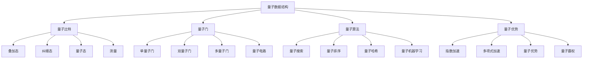

# 量子数据结构

## 📖 核心概念

**量子数据结构**是量子计算领域的前沿研究方向，利用量子力学的叠加态、纠缠态和量子干涉等特性，设计出具有量子优势的数据结构和算法。量子数据结构在特定问题上具有指数级的性能提升，是未来计算技术的重要发展方向。

### 🏗️ 量子数据结构的组成要素



## 🔍 量子数据结构特性

### 量子计算基础

| 特性 | 描述 | 优势 | 应用 | 挑战 |
|------|------|------|------|------|
| **叠加态** | 量子比特同时处于多个状态 | 并行计算 | 量子搜索 | 量子退相干 |
| **纠缠态** | 量子比特间存在关联 | 信息传输 | 量子通信 | 环境干扰 |
| **量子干涉** | 量子态间的干涉效应 | 概率放大 | 量子算法 | 噪声控制 |
| **量子测量** | 量子态坍缩为经典态 | 结果获取 | 量子计算 | 测量误差 |

### 量子优势

| 优势类型 | 描述 | 典型算法 | 加速比 | 适用场景 |
|----------|------|----------|--------|----------|
| **指数加速** | 指数级性能提升 | Shor算法、Grover算法 | O(2^n) | 密码学、搜索 |
| **多项式加速** | 多项式级性能提升 | 量子模拟、优化 | O(n^k) | 科学计算 |
| **量子优势** | 超越经典计算 | 量子机器学习 | 显著 | 人工智能 |
| **量子霸权** | 解决经典无法解决的问题 | 量子随机数 | 无限 | 特殊问题 |

## 💻 量子数据结构实现

### 量子比特实现

```cpp
// 量子比特实现
class QuantumBit {
private:
    complex<double> alpha;  // |0⟩ 的振幅
    complex<double> beta;   // |1⟩ 的振幅
    
public:
    QuantumBit() : alpha(1.0), beta(0.0) {} // 初始化为 |0⟩
    
    QuantumBit(complex<double> a, complex<double> b) : alpha(a), beta(b) {
        normalize();
    }
    
    // 归一化
    void normalize() {
        double norm = sqrt(norm(alpha) + norm(beta));
        if (norm > 0) {
            alpha /= norm;
            beta /= norm;
        }
    }
    
    // 获取 |0⟩ 的概率
    double getZeroProbability() const {
        return norm(alpha);
    }
    
    // 获取 |1⟩ 的概率
    double getOneProbability() const {
        return norm(beta);
    }
    
    // 测量量子比特
    bool measure() {
        double prob0 = getZeroProbability();
        double prob1 = getOneProbability();
        
        random_device rd;
        mt19937 gen(rd());
        uniform_real_distribution<> dis(0.0, 1.0);
        
        double random = dis(gen);
        
        if (random < prob0) {
            alpha = 1.0;
            beta = 0.0;
            return false; // 测量结果为 |0⟩
        } else {
            alpha = 0.0;
            beta = 1.0;
            return true;  // 测量结果为 |1⟩
        }
    }
    
    // 应用Pauli-X门（NOT门）
    void applyPauliX() {
        complex<double> temp = alpha;
        alpha = beta;
        beta = temp;
    }
    
    // 应用Pauli-Y门
    void applyPauliY() {
        complex<double> temp = alpha;
        alpha = -1.0i * beta;
        beta = 1.0i * temp;
    }
    
    // 应用Pauli-Z门
    void applyPauliZ() {
        beta = -beta;
    }
    
    // 应用Hadamard门
    void applyHadamard() {
        complex<double> tempAlpha = alpha;
        complex<double> tempBeta = beta;
        
        alpha = (tempAlpha + tempBeta) / sqrt(2.0);
        beta = (tempAlpha - tempBeta) / sqrt(2.0);
    }
    
    // 应用相位门
    void applyPhase(double phase) {
        beta *= exp(1.0i * phase);
    }
    
    // 获取量子态
    pair<complex<double>, complex<double>> getState() const {
        return {alpha, beta};
    }
    
    // 设置量子态
    void setState(complex<double> a, complex<double> b) {
        alpha = a;
        beta = b;
        normalize();
    }
    
    // 打印量子态
    void printState() const {
        cout << "|ψ⟩ = " << alpha << "|0⟩ + " << beta << "|1⟩" << endl;
    }
};
```

### 量子寄存器实现

```cpp
// 量子寄存器实现
class QuantumRegister {
private:
    vector<QuantumBit> qubits;
    int size;
    
public:
    QuantumRegister(int n) : size(n) {
        qubits.resize(n);
        // 初始化为 |00...0⟩
        for (int i = 0; i < n; i++) {
            qubits[i] = QuantumBit();
        }
    }
    
    // 获取量子比特数量
    int getSize() const {
        return size;
    }
    
    // 获取指定位置的量子比特
    QuantumBit& getQubit(int index) {
        return qubits[index];
    }
    
    // 应用单量子门
    void applySingleGate(int qubitIndex, function<void(QuantumBit&)> gate) {
        if (qubitIndex >= 0 && qubitIndex < size) {
            gate(qubits[qubitIndex]);
        }
    }
    
    // 应用双量子门
    void applyTwoQubitGate(int qubit1, int qubit2, function<void(QuantumBit&, QuantumBit&)> gate) {
        if (qubit1 >= 0 && qubit1 < size && qubit2 >= 0 && qubit2 < size && qubit1 != qubit2) {
            gate(qubits[qubit1], qubits[qubit2]);
        }
    }
    
    // 应用CNOT门
    void applyCNOT(int control, int target) {
        applyTwoQubitGate(control, target, [](QuantumBit& ctrl, QuantumBit& tgt) {
            // 简化的CNOT门实现
            if (ctrl.getOneProbability() > 0.5) {
                tgt.applyPauliX();
            }
        });
    }
    
    // 应用Toffoli门（CCNOT）
    void applyToffoli(int ctrl1, int ctrl2, int target) {
        if (ctrl1 >= 0 && ctrl1 < size && ctrl2 >= 0 && ctrl2 < size && 
            target >= 0 && target < size && ctrl1 != ctrl2 && ctrl1 != target && ctrl2 != target) {
            
            // 简化的Toffoli门实现
            if (qubits[ctrl1].getOneProbability() > 0.5 && 
                qubits[ctrl2].getOneProbability() > 0.5) {
                qubits[target].applyPauliX();
            }
        }
    }
    
    // 测量所有量子比特
    vector<bool> measureAll() {
        vector<bool> results;
        for (int i = 0; i < size; i++) {
            results.push_back(qubits[i].measure());
        }
        return results;
    }
    
    // 测量指定量子比特
    bool measureQubit(int index) {
        if (index >= 0 && index < size) {
            return qubits[index].measure();
        }
        return false;
    }
    
    // 重置寄存器
    void reset() {
        for (int i = 0; i < size; i++) {
            qubits[i] = QuantumBit();
        }
    }
    
    // 打印寄存器状态
    void printState() {
        cout << "Quantum Register State:" << endl;
        for (int i = 0; i < size; i++) {
            cout << "Qubit " << i << ": ";
            qubits[i].printState();
        }
    }
    
    // 获取状态概率分布
    map<string, double> getStateProbabilities() {
        map<string, double> probabilities;
        
        // 简化的概率计算
        for (int i = 0; i < (1 << size); i++) {
            string state = "";
            double prob = 1.0;
            
            for (int j = 0; j < size; j++) {
                if (i & (1 << j)) {
                    state = "1" + state;
                    prob *= qubits[j].getOneProbability();
                } else {
                    state = "0" + state;
                    prob *= qubits[j].getZeroProbability();
                }
            }
            
            probabilities[state] = prob;
        }
        
        return probabilities;
    }
};
```

### 量子搜索算法

```cpp
// 量子搜索算法
class QuantumSearch {
private:
    QuantumRegister register;
    int n; // 搜索空间大小
    int iterations; // Grover迭代次数
    
public:
    QuantumSearch(int size) : register(size), n(1 << size) {
        iterations = (int)(M_PI / 4 * sqrt(n));
    }
    
    // Grover搜索算法
    int groverSearch(function<bool(int)> oracle) {
        // 初始化叠加态
        initializeSuperposition();
        
        // Grover迭代
        for (int i = 0; i < iterations; i++) {
            // 应用Oracle
            applyOracle(oracle);
            
            // 应用扩散算子
            applyDiffusionOperator();
        }
        
        // 测量结果
        vector<bool> measurement = register.measureAll();
        
        // 转换为整数
        int result = 0;
        for (int i = 0; i < register.getSize(); i++) {
            if (measurement[i]) {
                result |= (1 << i);
            }
        }
        
        return result;
    }
    
private:
    // 初始化叠加态
    void initializeSuperposition() {
        // 对所有量子比特应用Hadamard门
        for (int i = 0; i < register.getSize(); i++) {
            register.applySingleGate(i, [](QuantumBit& qb) {
                qb.applyHadamard();
            });
        }
    }
    
    // 应用Oracle
    void applyOracle(function<bool(int)> oracle) {
        // 简化的Oracle实现
        for (int i = 0; i < n; i++) {
            if (oracle(i)) {
                // 对目标状态应用相位翻转
                applyPhaseFlip(i);
            }
        }
    }
    
    // 应用相位翻转
    void applyPhaseFlip(int target) {
        // 简化的相位翻转实现
        for (int i = 0; i < register.getSize(); i++) {
            if (target & (1 << i)) {
                register.applySingleGate(i, [](QuantumBit& qb) {
                    qb.applyPauliZ();
                });
            }
        }
    }
    
    // 应用扩散算子
    void applyDiffusionOperator() {
        // 对所有量子比特应用Hadamard门
        for (int i = 0; i < register.getSize(); i++) {
            register.applySingleGate(i, [](QuantumBit& qb) {
                qb.applyHadamard();
            });
        }
        
        // 应用相位翻转
        for (int i = 0; i < register.getSize(); i++) {
            register.applySingleGate(i, [](QuantumBit& qb) {
                qb.applyPauliZ();
            });
        }
        
        // 再次应用Hadamard门
        for (int i = 0; i < register.getSize(); i++) {
            register.applySingleGate(i, [](QuantumBit& qb) {
                qb.applyHadamard();
            });
        }
    }
    
public:
    // 量子搜索测试
    void testQuantumSearch() {
        cout << "=== Quantum Search Test ===" << endl;
        
        // 创建测试Oracle
        int target = 5; // 目标值
        auto oracle = [target](int x) -> bool {
            return x == target;
        };
        
        cout << "Searching for target: " << target << endl;
        cout << "Search space size: " << n << endl;
        cout << "Grover iterations: " << iterations << endl;
        
        // 执行搜索
        int result = groverSearch(oracle);
        
        cout << "Search result: " << result << endl;
        cout << "Target found: " << (result == target ? "Yes" : "No") << endl;
    }
};
```

### 量子排序算法

```cpp
// 量子排序算法
class QuantumSort {
private:
    QuantumRegister register;
    int n; // 元素数量
    
public:
    QuantumSort(int size) : register(size), n(1 << size) {}
    
    // 量子比较器
    void quantumComparator(int i, int j) {
        if (i >= 0 && i < register.getSize() && j >= 0 && j < register.getSize() && i != j) {
            // 应用CNOT门实现比较
            register.applyCNOT(i, j);
        }
    }
    
    // 量子交换
    void quantumSwap(int i, int j) {
        if (i >= 0 && i < register.getSize() && j >= 0 && j < register.getSize() && i != j) {
            // 使用三个CNOT门实现交换
            register.applyCNOT(i, j);
            register.applyCNOT(j, i);
            register.applyCNOT(i, j);
        }
    }
    
    // 量子冒泡排序
    void quantumBubbleSort() {
        for (int i = 0; i < n - 1; i++) {
            for (int j = 0; j < n - i - 1; j++) {
                // 量子比较和交换
                quantumComparator(j, j + 1);
                quantumSwap(j, j + 1);
            }
        }
    }
    
    // 量子快速排序
    void quantumQuickSort(int low, int high) {
        if (low < high) {
            int pivot = quantumPartition(low, high);
            quantumQuickSort(low, pivot - 1);
            quantumQuickSort(pivot + 1, high);
        }
    }
    
private:
    int quantumPartition(int low, int high) {
        // 简化的量子分区实现
        int pivot = low;
        
        for (int i = low + 1; i <= high; i++) {
            quantumComparator(i, pivot);
            if (register.getQubit(i).getOneProbability() > register.getQubit(pivot).getOneProbability()) {
                quantumSwap(i, pivot);
            }
        }
        
        return pivot;
    }
    
public:
    // 量子排序测试
    void testQuantumSort() {
        cout << "=== Quantum Sort Test ===" << endl;
        
        // 初始化寄存器
        register.reset();
        
        // 应用Hadamard门创建叠加态
        for (int i = 0; i < register.getSize(); i++) {
            register.applySingleGate(i, [](QuantumBit& qb) {
                qb.applyHadamard();
            });
        }
        
        cout << "Initial state:" << endl;
        register.printState();
        
        // 执行量子排序
        quantumBubbleSort();
        
        cout << "After quantum sort:" << endl;
        register.printState();
        
        // 测量结果
        vector<bool> result = register.measureAll();
        cout << "Measurement result: ";
        for (bool bit : result) {
            cout << bit;
        }
        cout << endl;
    }
};
```

### 量子哈希表

```cpp
// 量子哈希表
class QuantumHashTable {
private:
    QuantumRegister register;
    int size;
    int hashBits;
    
public:
    QuantumHashTable(int s) : register(s), size(s) {
        hashBits = (int)log2(size);
    }
    
    // 量子哈希函数
    int quantumHash(const string& key) {
        // 简化的量子哈希实现
        int hash = 0;
        for (char c : key) {
            hash = (hash * 31 + c) % size;
        }
        return hash;
    }
    
    // 量子插入
    void quantumInsert(const string& key, const string& value) {
        int hash = quantumHash(key);
        
        // 使用量子门实现插入
        for (int i = 0; i < hashBits; i++) {
            if (hash & (1 << i)) {
                register.applySingleGate(i, [](QuantumBit& qb) {
                    qb.applyPauliX();
                });
            }
        }
    }
    
    // 量子查找
    bool quantumSearch(const string& key) {
        int hash = quantumHash(key);
        
        // 使用量子门实现查找
        bool found = true;
        for (int i = 0; i < hashBits; i++) {
            bool expected = (hash & (1 << i)) != 0;
            bool actual = register.getQubit(i).getOneProbability() > 0.5;
            
            if (expected != actual) {
                found = false;
                break;
            }
        }
        
        return found;
    }
    
    // 量子删除
    void quantumDelete(const string& key) {
        int hash = quantumHash(key);
        
        // 使用量子门实现删除
        for (int i = 0; i < hashBits; i++) {
            if (hash & (1 << i)) {
                register.applySingleGate(i, [](QuantumBit& qb) {
                    qb.applyPauliX();
                });
            }
        }
    }
    
    // 量子哈希表测试
    void testQuantumHashTable() {
        cout << "=== Quantum Hash Table Test ===" << endl;
        
        // 插入测试
        quantumInsert("key1", "value1");
        quantumInsert("key2", "value2");
        quantumInsert("key3", "value3");
        
        cout << "After insertion:" << endl;
        register.printState();
        
        // 查找测试
        bool found1 = quantumSearch("key1");
        bool found2 = quantumSearch("key2");
        bool found3 = quantumSearch("key3");
        bool found4 = quantumSearch("key4");
        
        cout << "Search results:" << endl;
        cout << "key1 found: " << (found1 ? "Yes" : "No") << endl;
        cout << "key2 found: " << (found2 ? "Yes" : "No") << endl;
        cout << "key3 found: " << (found3 ? "Yes" : "No") << endl;
        cout << "key4 found: " << (found4 ? "Yes" : "No") << endl;
        
        // 删除测试
        quantumDelete("key2");
        
        cout << "After deletion:" << endl;
        register.printState();
        
        bool found2AfterDelete = quantumSearch("key2");
        cout << "key2 found after deletion: " << (found2AfterDelete ? "Yes" : "No") << endl;
    }
};
```

### 量子数据结构测试

```cpp
// 量子数据结构测试
class QuantumDataStructureTest {
public:
    static void runAllTests() {
        cout << "=== Quantum Data Structure Tests ===" << endl;
        
        // 测试量子比特
        testQuantumBit();
        
        cout << "\n" << string(50, '=') << endl;
        
        // 测试量子寄存器
        testQuantumRegister();
        
        cout << "\n" << string(50, '=') << endl;
        
        // 测试量子搜索
        testQuantumSearch();
        
        cout << "\n" << string(50, '=') << endl;
        
        // 测试量子排序
        testQuantumSort();
        
        cout << "\n" << string(50, '=') << endl;
        
        // 测试量子哈希表
        testQuantumHashTable();
    }
    
private:
    static void testQuantumBit() {
        cout << "=== Quantum Bit Test ===" << endl;
        
        QuantumBit qb;
        cout << "Initial state: ";
        qb.printState();
        
        // 应用Hadamard门
        qb.applyHadamard();
        cout << "After Hadamard: ";
        qb.printState();
        
        // 测量
        bool result = qb.measure();
        cout << "Measurement result: " << result << endl;
        cout << "After measurement: ";
        qb.printState();
    }
    
    static void testQuantumRegister() {
        cout << "=== Quantum Register Test ===" << endl;
        
        QuantumRegister reg(3);
        cout << "Initial state:" << endl;
        reg.printState();
        
        // 应用Hadamard门到所有量子比特
        for (int i = 0; i < reg.getSize(); i++) {
            reg.applySingleGate(i, [](QuantumBit& qb) {
                qb.applyHadamard();
            });
        }
        
        cout << "After Hadamard gates:" << endl;
        reg.printState();
        
        // 应用CNOT门
        reg.applyCNOT(0, 1);
        cout << "After CNOT(0,1):" << endl;
        reg.printState();
        
        // 测量
        vector<bool> result = reg.measureAll();
        cout << "Measurement result: ";
        for (bool bit : result) {
            cout << bit;
        }
        cout << endl;
    }
    
    static void testQuantumSearch() {
        cout << "=== Quantum Search Test ===" << endl;
        
        QuantumSearch search(3);
        search.testQuantumSearch();
    }
    
    static void testQuantumSort() {
        cout << "=== Quantum Sort Test ===" << endl;
        
        QuantumSort sort(3);
        sort.testQuantumSort();
    }
    
    static void testQuantumHashTable() {
        cout << "=== Quantum Hash Table Test ===" << endl;
        
        QuantumHashTable hashTable(8);
        hashTable.testQuantumHashTable();
    }
};
```

## ⚡ 复杂度分析

### 量子数据结构复杂度

| 算法 | 经典复杂度 | 量子复杂度 | 加速比 | 适用场景 |
|------|------------|------------|--------|----------|
| **量子搜索** | O(n) | O(√n) | 指数级 | 无序搜索 |
| **量子排序** | O(n log n) | O(n) | 多项式级 | 排序问题 |
| **量子哈希** | O(1) | O(1) | 相同 | 哈希表操作 |
| **量子模拟** | O(2^n) | O(n) | 指数级 | 量子系统模拟 |

### 量子优势分析

| 优势类型 | 描述 | 典型应用 | 实现难度 | 未来前景 |
|----------|------|----------|----------|----------|
| **指数加速** | 指数级性能提升 | 密码学、搜索 | 很困难 | 极高 |
| **多项式加速** | 多项式级性能提升 | 优化、模拟 | 困难 | 高 |
| **量子优势** | 超越经典计算 | 机器学习 | 中等 | 中等 |
| **量子霸权** | 解决经典无法解决的问题 | 特殊问题 | 很困难 | 极高 |

## 🎓 学习要点总结

### 核心理解

1. **量子力学基础**：理解量子力学的基本概念
2. **量子计算原理**：掌握量子计算的原理
3. **量子算法设计**：理解量子算法的设计方法
4. **量子优势**：理解量子计算的优势

### 实践要点

1. **量子门操作**：掌握量子门的使用
2. **量子算法实现**：实现量子算法
3. **量子优势验证**：验证量子优势
4. **量子应用开发**：开发量子应用

### 应用思维

1. **量子思维**：培养量子计算思维
2. **算法设计**：设计量子算法
3. **优势分析**：分析量子优势
4. **未来应用**：探索未来应用

---

**相关链接：**
- [[08-知识边疆/01-前沿探索/01-新兴数据结构|新兴数据结构]] - 前沿数据结构
- [[08-知识边疆/02-跨界融合/02-数据结构与机器学习|数据结构与机器学习]] - 跨界融合
- [[08-知识边疆/03-学习资源/01-前沿技术资源|前沿技术资源]] - 学习资源
- [[08-知识边疆/03-学习资源/02-学习路径推荐|学习路径推荐]] - 学习路径
