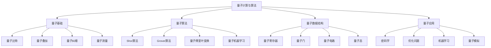

# 量子计算与算法

## 📖 核心概念

**量子计算与算法**是计算机科学的前沿领域，利用量子力学原理进行计算。量子算法在特定问题上具有指数级加速优势，如Shor算法、Grover算法等。量子数据结构如量子比特、量子寄存器、量子门等是量子计算的基础。

### 🏗️ 量子计算与算法分类



## 🔧 量子计算与算法实现

### 量子基础结构

```python
import numpy as np
import math
from typing import List, Tuple, Optional, Any
from dataclasses import dataclass
from abc import ABC, abstractmethod
import random

# 量子比特类
@dataclass
class Qubit:
    state: np.ndarray  # |ψ⟩ = α|0⟩ + β|1⟩
    
    def __init__(self, alpha: complex = 1.0, beta: complex = 0.0):
        # 归一化
        norm = math.sqrt(abs(alpha)**2 + abs(beta)**2)
        self.state = np.array([alpha/norm, beta/norm], dtype=complex)
    
    def measure(self) -> int:
        """测量量子比特"""
        prob_0 = abs(self.state[0])**2
        if random.random() < prob_0:
            self.state = np.array([1.0, 0.0], dtype=complex)
            return 0
        else:
            self.state = np.array([0.0, 1.0], dtype=complex)
            return 1
    
    def __str__(self):
        return f"|ψ⟩ = {self.state[0]:.3f}|0⟩ + {self.state[1]:.3f}|1⟩"

# 量子寄存器类
class QuantumRegister:
    def __init__(self, num_qubits: int):
        self.num_qubits = num_qubits
        self.size = 2**num_qubits
        self.state = np.zeros(self.size, dtype=complex)
        self.state[0] = 1.0  # 初始化为|00...0⟩
    
    def get_qubit(self, index: int) -> Qubit:
        """获取单个量子比特的状态"""
        if index >= self.num_qubits:
            raise IndexError("Qubit index out of range")
        
        # 计算该量子比特的状态
        alpha = 0.0
        beta = 0.0
        
        for i in range(self.size):
            if (i >> index) & 1:  # 该位为1
                beta += self.state[i]
            else:  # 该位为0
                alpha += self.state[i]
        
        return Qubit(alpha, beta)
    
    def measure(self) -> int:
        """测量整个寄存器"""
        probabilities = np.abs(self.state)**2
        outcome = np.random.choice(self.size, p=probabilities)
        
        # 坍缩到测量结果
        self.state = np.zeros(self.size, dtype=complex)
        self.state[outcome] = 1.0
        
        return outcome
    
    def __str__(self):
        result = "|ψ⟩ = "
        terms = []
        for i, amplitude in enumerate(self.state):
            if abs(amplitude) > 1e-10:
                binary = format(i, f'0{self.num_qubits}b')
                terms.append(f"{amplitude:.3f}|{binary}⟩")
        return result + " + ".join(terms)

# 量子门基类
class QuantumGate(ABC):
    def __init__(self, name: str):
        self.name = name
    
    @abstractmethod
    def apply(self, register: QuantumRegister, qubit_indices: List[int]):
        pass
    
    def __str__(self):
        return self.name

# 单量子比特门
class PauliX(QuantumGate):
    def __init__(self):
        super().__init__("X")
        self.matrix = np.array([[0, 1], [1, 0]], dtype=complex)
    
    def apply(self, register: QuantumRegister, qubit_indices: List[int]):
        if len(qubit_indices) != 1:
            raise ValueError("Pauli-X gate requires exactly one qubit")
        
        qubit_idx = qubit_indices[0]
        new_state = np.zeros_like(register.state)
        
        for i in range(register.size):
            # 翻转第qubit_idx位
            flipped = i ^ (1 << qubit_idx)
            new_state[flipped] = register.state[i]
        
        register.state = new_state

class PauliY(QuantumGate):
    def __init__(self):
        super().__init__("Y")
        self.matrix = np.array([[0, -1j], [1j, 0]], dtype=complex)
    
    def apply(self, register: QuantumRegister, qubit_indices: List[int]):
        if len(qubit_indices) != 1:
            raise ValueError("Pauli-Y gate requires exactly one qubit")
        
        qubit_idx = qubit_indices[0]
        new_state = np.zeros_like(register.state)
        
        for i in range(register.size):
            flipped = i ^ (1 << qubit_idx)
            if (i >> qubit_idx) & 1:  # 原状态为|1⟩
                new_state[flipped] += -1j * register.state[i]
            else:  # 原状态为|0⟩
                new_state[flipped] += 1j * register.state[i]
        
        register.state = new_state

class PauliZ(QuantumGate):
    def __init__(self):
        super().__init__("Z")
        self.matrix = np.array([[1, 0], [0, -1]], dtype=complex)
    
    def apply(self, register: QuantumRegister, qubit_indices: List[int]):
        if len(qubit_indices) != 1:
            raise ValueError("Pauli-Z gate requires exactly one qubit")
        
        qubit_idx = qubit_indices[0]
        
        for i in range(register.size):
            if (i >> qubit_idx) & 1:  # 该位为1
                register.state[i] *= -1

class Hadamard(QuantumGate):
    def __init__(self):
        super().__init__("H")
        self.matrix = np.array([[1, 1], [1, -1]], dtype=complex) / math.sqrt(2)
    
    def apply(self, register: QuantumRegister, qubit_indices: List[int]):
        if len(qubit_indices) != 1:
            raise ValueError("Hadamard gate requires exactly one qubit")
        
        qubit_idx = qubit_indices[0]
        new_state = np.zeros_like(register.state)
        
        for i in range(register.size):
            if (i >> qubit_idx) & 1:  # 该位为1
                new_state[i] += register.state[i] / math.sqrt(2)
                new_state[i ^ (1 << qubit_idx)] -= register.state[i] / math.sqrt(2)
            else:  # 该位为0
                new_state[i] += register.state[i] / math.sqrt(2)
                new_state[i ^ (1 << qubit_idx)] += register.state[i] / math.sqrt(2)
        
        register.state = new_state

# 双量子比特门
class CNOT(QuantumGate):
    def __init__(self):
        super().__init__("CNOT")
        self.matrix = np.array([
            [1, 0, 0, 0],
            [0, 1, 0, 0],
            [0, 0, 0, 1],
            [0, 0, 1, 0]
        ], dtype=complex)
    
    def apply(self, register: QuantumRegister, qubit_indices: List[int]):
        if len(qubit_indices) != 2:
            raise ValueError("CNOT gate requires exactly two qubits")
        
        control_idx, target_idx = qubit_indices
        new_state = np.zeros_like(register.state)
        
        for i in range(register.size):
            if (i >> control_idx) & 1:  # 控制位为1
                # 翻转目标位
                flipped = i ^ (1 << target_idx)
                new_state[flipped] = register.state[i]
            else:  # 控制位为0
                new_state[i] = register.state[i]
        
        register.state = new_state

class CZ(QuantumGate):
    def __init__(self):
        super().__init__("CZ")
    
    def apply(self, register: QuantumRegister, qubit_indices: List[int]):
        if len(qubit_indices) != 2:
            raise ValueError("CZ gate requires exactly two qubits")
        
        control_idx, target_idx = qubit_indices
        
        for i in range(register.size):
            if (i >> control_idx) & 1 and (i >> target_idx) & 1:  # 两个位都为1
                register.state[i] *= -1
```

### 量子算法实现

```python
# Grover搜索算法
class GroverAlgorithm:
    def __init__(self, n_qubits: int):
        self.n_qubits = n_qubits
        self.register = QuantumRegister(n_qubits)
        self.hadamard = Hadamard()
        self.oracle = None
        self.diffuser = None
    
    def set_oracle(self, oracle_function):
        """设置Oracle函数"""
        self.oracle = oracle_function
    
    def set_diffuser(self, diffuser_function):
        """设置扩散器函数"""
        self.diffuser = diffuser_function
    
    def search(self, target: int, iterations: int = None) -> int:
        """执行Grover搜索"""
        if self.oracle is None:
            raise ValueError("Oracle function not set")
        
        if iterations is None:
            iterations = int(math.pi / 4 * math.sqrt(2**self.n_qubits))
        
        # 初始化叠加态
        for i in range(self.n_qubits):
            self.hadamard.apply(self.register, [i])
        
        # 迭代应用Oracle和扩散器
        for _ in range(iterations):
            # 应用Oracle
            self.oracle(self.register)
            
            # 应用扩散器
            if self.diffuser:
                self.diffuser(self.register)
            else:
                self._default_diffuser()
        
        # 测量结果
        return self.register.measure()
    
    def _default_diffuser(self):
        """默认扩散器"""
        # 应用Hadamard门
        for i in range(self.n_qubits):
            self.hadamard.apply(self.register, [i])
        
        # 应用Z门到所有量子比特
        for i in range(self.n_qubits):
            pauli_z = PauliZ()
            pauli_z.apply(self.register, [i])
        
        # 再次应用Hadamard门
        for i in range(self.n_qubits):
            self.hadamard.apply(self.register, [i])

# 量子傅里叶变换
class QuantumFourierTransform:
    def __init__(self, n_qubits: int):
        self.n_qubits = n_qubits
        self.register = QuantumRegister(n_qubits)
        self.hadamard = Hadamard()
    
    def apply_qft(self):
        """应用量子傅里叶变换"""
        # 对每个量子比特应用Hadamard门
        for i in range(self.n_qubits):
            self.hadamard.apply(self.register, [i])
            
            # 应用受控旋转门
            for j in range(i + 1, self.n_qubits):
                self._controlled_rotation(i, j, j - i + 1)
    
    def _controlled_rotation(self, control: int, target: int, power: int):
        """受控旋转门"""
        angle = 2 * math.pi / (2**power)
        
        for i in range(self.register.size):
            if (i >> control) & 1:  # 控制位为1
                if (i >> target) & 1:  # 目标位为1
                    register.state[i] *= cmath.exp(1j * angle)
    
    def inverse_qft(self):
        """逆量子傅里叶变换"""
        # 反向应用QFT
        for i in range(self.n_qubits - 1, -1, -1):
            # 应用受控旋转门（反向）
            for j in range(self.n_qubits - 1, i, -1):
                self._controlled_rotation(i, j, -(j - i + 1))
            
            # 应用Hadamard门
            self.hadamard.apply(self.register, [i])

# Shor算法（简化版）
class ShorAlgorithm:
    def __init__(self, n_qubits: int):
        self.n_qubits = n_qubits
        self.qft = QuantumFourierTransform(n_qubits)
    
    def factor(self, N: int) -> Tuple[int, int]:
        """分解整数N"""
        if N % 2 == 0:
            return 2, N // 2
        
        # 随机选择a
        a = random.randint(2, N - 1)
        
        # 计算gcd(a, N)
        gcd_val = math.gcd(a, N)
        if gcd_val > 1:
            return gcd_val, N // gcd_val
        
        # 使用量子算法找到周期
        period = self._find_period(a, N)
        
        if period % 2 == 1:
            return self.factor(N)  # 重新尝试
        
        # 计算因子
        factor1 = math.gcd(a**(period//2) + 1, N)
        factor2 = math.gcd(a**(period//2) - 1, N)
        
        if factor1 > 1 and factor1 < N:
            return factor1, N // factor1
        elif factor2 > 1 and factor2 < N:
            return factor2, N // factor2
        else:
            return self.factor(N)  # 重新尝试
    
    def _find_period(self, a: int, N: int) -> int:
        """使用量子算法找到周期（简化实现）"""
        # 这里使用经典算法模拟量子算法
        # 实际实现需要量子计算机
        
        # 计算a^r mod N的周期
        seen = {}
        x = 1
        
        for r in range(1, N):
            x = (x * a) % N
            if x in seen:
                return r - seen[x]
            seen[x] = r
        
        return N - 1
```

### 量子机器学习

```python
# 量子神经网络
class QuantumNeuralNetwork:
    def __init__(self, n_qubits: int, n_layers: int):
        self.n_qubits = n_qubits
        self.n_layers = n_layers
        self.register = QuantumRegister(n_qubits)
        self.weights = self._initialize_weights()
        self.hadamard = Hadamard()
        self.pauli_x = PauliX()
        self.pauli_y = PauliY()
        self.pauli_z = PauliZ()
    
    def _initialize_weights(self) -> List[List[float]]:
        """初始化权重"""
        weights = []
        for layer in range(self.n_layers):
            layer_weights = []
            for qubit in range(self.n_qubits):
                # 每个量子比特有三个旋转角度
                layer_weights.append([
                    random.uniform(0, 2*math.pi),
                    random.uniform(0, 2*math.pi),
                    random.uniform(0, 2*math.pi)
                ])
            weights.append(layer_weights)
        return weights
    
    def forward(self, input_data: List[float]) -> List[float]:
        """前向传播"""
        # 编码输入数据
        self._encode_input(input_data)
        
        # 应用量子层
        for layer in range(self.n_layers):
            self._apply_quantum_layer(layer)
        
        # 测量输出
        return self._measure_output()
    
    def _encode_input(self, input_data: List[float]):
        """编码输入数据到量子态"""
        # 重置寄存器
        self.register = QuantumRegister(self.n_qubits)
        
        # 应用Hadamard门创建叠加态
        for i in range(self.n_qubits):
            self.hadamard.apply(self.register, [i])
        
        # 根据输入数据旋转量子比特
        for i, data in enumerate(input_data[:self.n_qubits]):
            self._rotate_qubit(i, data)
    
    def _rotate_qubit(self, qubit_idx: int, angle: float):
        """旋转量子比特"""
        # 应用X旋转
        self._apply_rotation_x(qubit_idx, angle)
        
        # 应用Y旋转
        self._apply_rotation_y(qubit_idx, angle)
        
        # 应用Z旋转
        self._apply_rotation_z(qubit_idx, angle)
    
    def _apply_rotation_x(self, qubit_idx: int, angle: float):
        """应用X旋转"""
        # 简化的旋转实现
        cos_angle = math.cos(angle / 2)
        sin_angle = math.sin(angle / 2)
        
        new_state = np.zeros_like(self.register.state)
        for i in range(self.register.size):
            if (i >> qubit_idx) & 1:  # 该位为1
                new_state[i] += cos_angle * self.register.state[i]
                new_state[i ^ (1 << qubit_idx)] += -1j * sin_angle * self.register.state[i]
            else:  # 该位为0
                new_state[i] += cos_angle * self.register.state[i]
                new_state[i ^ (1 << qubit_idx)] += -1j * sin_angle * self.register.state[i]
        
        self.register.state = new_state
    
    def _apply_rotation_y(self, qubit_idx: int, angle: float):
        """应用Y旋转"""
        # 简化的旋转实现
        cos_angle = math.cos(angle / 2)
        sin_angle = math.sin(angle / 2)
        
        new_state = np.zeros_like(self.register.state)
        for i in range(self.register.size):
            if (i >> qubit_idx) & 1:  # 该位为1
                new_state[i] += cos_angle * self.register.state[i]
                new_state[i ^ (1 << qubit_idx)] += sin_angle * self.register.state[i]
            else:  # 该位为0
                new_state[i] += cos_angle * self.register.state[i]
                new_state[i ^ (1 << qubit_idx)] += -sin_angle * self.register.state[i]
        
        self.register.state = new_state
    
    def _apply_rotation_z(self, qubit_idx: int, angle: float):
        """应用Z旋转"""
        for i in range(self.register.size):
            if (i >> qubit_idx) & 1:  # 该位为1
                self.register.state[i] *= cmath.exp(1j * angle / 2)
            else:  # 该位为0
                self.register.state[i] *= cmath.exp(-1j * angle / 2)
    
    def _apply_quantum_layer(self, layer: int):
        """应用量子层"""
        for qubit in range(self.n_qubits):
            weights = self.weights[layer][qubit]
            self._rotate_qubit(qubit, weights[0])
            self._rotate_qubit(qubit, weights[1])
            self._rotate_qubit(qubit, weights[2])
    
    def _measure_output(self) -> List[float]:
        """测量输出"""
        probabilities = np.abs(self.register.state)**2
        return probabilities.tolist()
    
    def train(self, training_data: List[Tuple[List[float], List[float]]], 
              epochs: int = 100, learning_rate: float = 0.01):
        """训练量子神经网络"""
        for epoch in range(epochs):
            total_loss = 0
            
            for input_data, target in training_data:
                # 前向传播
                output = self.forward(input_data)
                
                # 计算损失
                loss = self._calculate_loss(output, target)
                total_loss += loss
                
                # 反向传播（简化版）
                self._update_weights(loss, learning_rate)
            
            if epoch % 10 == 0:
                print(f"Epoch {epoch}, Loss: {total_loss / len(training_data):.4f}")
    
    def _calculate_loss(self, output: List[float], target: List[float]) -> float:
        """计算损失"""
        return sum((o - t)**2 for o, t in zip(output, target))
    
    def _update_weights(self, loss: float, learning_rate: float):
        """更新权重"""
        # 简化的权重更新
        for layer in range(self.n_layers):
            for qubit in range(self.n_qubits):
                for i in range(3):
                    self.weights[layer][qubit][i] -= learning_rate * loss
```

## 🎯 量子计算与算法应用

### 实际应用场景

```python
class QuantumComputingApplications:
    @staticmethod
    def demonstrate_applications():
        print("量子计算与算法 Applications:")
        print("=========================")
        
        print("1. 密码学:")
        print("   - 量子密钥分发")
        print("   - 量子随机数生成")
        print("   - 后量子密码学")
        
        print("2. 优化问题:")
        print("   - 组合优化")
        print("   - 量子退火")
        print("   - 量子近似优化")
        
        print("3. 机器学习:")
        print("   - 量子神经网络")
        print("   - 量子支持向量机")
        print("   - 量子聚类算法")
        
        print("4. 科学计算:")
        print("   - 量子模拟")
        print("   - 量子化学")
        print("   - 量子材料设计")
    
    @staticmethod
    def analyze_performance():
        print("量子计算与算法 Performance Analysis:")
        print("=================================")
        
        print("1. 量子优势:")
        print("   - 指数级加速: 特定问题")
        print("   - 量子并行性: 叠加态计算")
        print("   - 量子纠缠: 非局域关联")
        print("   - 量子干涉: 概率幅叠加")
        print()
        
        print("2. 算法复杂度:")
        print("   - Shor算法: O((log N)³)")
        print("   - Grover算法: O(√N)")
        print("   - 量子傅里叶变换: O(n log n)")
        print("   - 量子机器学习: O(poly(n))")
        print()
        
        print("3. 实现挑战:")
        print("   - 量子纠错: 噪声处理")
        print("   - 量子门保真度: 操作精度")
        print("   - 量子相干时间: 状态保持")
        print("   - 量子比特数量: 可扩展性")
    
    @staticmethod
    def select_quantum_strategy(problem_type, quantum_advantage, implementation_constraints):
        print("Quantum Strategy Selection:")
        print("=========================")
        
        print(f"Problem type: {problem_type}")
        print(f"Quantum advantage: {quantum_advantage}")
        print(f"Implementation constraints: {implementation_constraints}")
        
        print("Recommendation:")
        
        if problem_type == "factorization" and quantum_advantage == "exponential":
            print("Use Shor's algorithm for integer factorization")
        elif problem_type == "search" and quantum_advantage == "quadratic":
            print("Use Grover's algorithm for unstructured search")
        elif problem_type == "optimization" and quantum_advantage == "polynomial":
            print("Use quantum approximate optimization algorithm")
        elif problem_type == "machine_learning":
            print("Use quantum neural networks or quantum support vector machines")
        else:
            print("Evaluate quantum advantage for specific problem instance")
```

## 📊 量子计算与算法分析

### 性能分析

```python
class QuantumComputingAnalysis:
    @staticmethod
    def analyze_performance():
        print("量子计算与算法 Performance Analysis:")
        print("=================================")
        
        print("1. 时间复杂度:")
        print("   - 经典算法: O(n)")
        print("   - 量子算法: O(√n)")
        print("   - 量子优势: 指数级加速")
        print("   - 实际性能: 考虑噪声")
        print()
        
        print("2. 空间复杂度:")
        print("   - 量子比特: O(n)")
        print("   - 量子门: O(n²)")
        print("   - 量子电路: O(n)")
        print("   - 量子态: O(2ⁿ)")
        print()
        
        print("3. 算法效率:")
        print("   - 量子并行性: 叠加态")
        print("   - 量子纠缠: 非局域")
        print("   - 量子干涉: 概率幅")
        print("   - 量子测量: 坍缩")
    
    @staticmethod
    def analyze_scalability():
        print("量子计算与算法 Scalability Analysis:")
        print("=================================")
        
        print("1. 量子比特扩展:")
        print("   - 物理量子比特: 硬件限制")
        print("   - 逻辑量子比特: 纠错需求")
        print("   - 量子门保真度: 操作精度")
        print("   - 量子相干时间: 状态保持")
        print()
        
        print("2. 算法扩展性:")
        print("   - 问题规模: 指数增长")
        print("   - 量子优势: 保持加速")
        print("   - 噪声影响: 性能下降")
        print("   - 纠错开销: 资源需求")
        print()
        
        print("3. 系统扩展性:")
        print("   - 硬件扩展: 量子比特数")
        print("   - 软件扩展: 算法优化")
        print("   - 网络扩展: 量子互联网")
        print("   - 应用扩展: 新领域")
    
    @staticmethod
    def analyze_efficiency():
        print("量子计算与算法 Efficiency Analysis:")
        print("=================================")
        
        print("1. 量子效率指标:")
        print("   - 量子体积: 系统能力")
        print("   - 量子门保真度: 操作精度")
        print("   - 量子相干时间: 状态保持")
        print("   - 量子比特连接: 拓扑结构")
        print()
        
        print("2. 效率影响因素:")
        print("   - 量子噪声: 环境干扰")
        print("   - 量子退相干: 状态丢失")
        print("   - 量子门误差: 操作不精确")
        print("   - 量子测量误差: 读取错误")
        print()
        
        print("3. 效率优化:")
        print("   - 量子纠错: 错误纠正")
        print("   - 量子优化: 算法改进")
        print("   - 量子编译: 电路优化")
        print("   - 量子控制: 精确操作")
```

## 🎮 量子计算与算法测试

### 1. 基础功能测试

```python
def test_quantum_basics():
    print("Testing Quantum Basics:")
    print("=====================")
    
    # 测试量子比特
    print("Qubit Tests:")
    qubit = Qubit(1.0, 0.0)  # |0⟩
    print(f"Initial state: {qubit}")
    
    # 测试测量
    measurements = [qubit.measure() for _ in range(10)]
    print(f"Measurements: {measurements}")
    
    # 测试叠加态
    qubit = Qubit(1.0, 1.0)  # |+⟩
    print(f"Superposition state: {qubit}")
    
    # 测试量子寄存器
    print("\nQuantum Register Tests:")
    register = QuantumRegister(2)
    print(f"Initial state: {register}")
    
    # 应用Hadamard门
    hadamard = Hadamard()
    hadamard.apply(register, [0])
    print(f"After H on qubit 0: {register}")
    
    hadamard.apply(register, [1])
    print(f"After H on qubit 1: {register}")
    
    # 测试测量
    measurement = register.measure()
    print(f"Measurement result: {measurement} (binary: {format(measurement, '02b')})")

def test_quantum_gates():
    print("\nTesting Quantum Gates:")
    print("====================")
    
    register = QuantumRegister(2)
    
    # 测试Pauli门
    print("Pauli Gates:")
    pauli_x = PauliX()
    pauli_x.apply(register, [0])
    print(f"After X on qubit 0: {register}")
    
    pauli_y = PauliY()
    pauli_y.apply(register, [0])
    print(f"After Y on qubit 0: {register}")
    
    pauli_z = PauliZ()
    pauli_z.apply(register, [0])
    print(f"After Z on qubit 0: {register}")
    
    # 测试CNOT门
    print("\nCNOT Gate:")
    register = QuantumRegister(2)
    hadamard = Hadamard()
    hadamard.apply(register, [0])
    print(f"After H on qubit 0: {register}")
    
    cnot = CNOT()
    cnot.apply(register, [0, 1])
    print(f"After CNOT(0,1): {register}")

def test_grover_algorithm():
    print("\nTesting Grover Algorithm:")
    print("========================")
    
    # 创建Grover算法实例
    grover = GroverAlgorithm(3)
    
    # 设置Oracle函数
    def oracle(register):
        # 标记目标状态|101⟩
        target = 5  # 101 in binary
        if abs(register.state[target]) > 1e-10:
            register.state[target] *= -1
    
    grover.set_oracle(oracle)
    
    # 执行搜索
    result = grover.search(target=5, iterations=2)
    print(f"Grover search result: {result} (binary: {format(result, '03b')})")
    
    # 测试多次搜索
    results = []
    for _ in range(10):
        grover.register = QuantumRegister(3)
        result = grover.search(target=5, iterations=2)
        results.append(result)
    
    print(f"Multiple search results: {results}")
    print(f"Success rate: {results.count(5) / len(results):.2%}")

def test_quantum_fourier_transform():
    print("\nTesting Quantum Fourier Transform:")
    print("=================================")
    
    # 创建QFT实例
    qft = QuantumFourierTransform(3)
    
    # 设置初始状态
    qft.register.state = np.zeros(8, dtype=complex)
    qft.register.state[1] = 1.0  # |001⟩
    
    print(f"Initial state: {qft.register}")
    
    # 应用QFT
    qft.apply_qft()
    print(f"After QFT: {qft.register}")
    
    # 应用逆QFT
    qft.inverse_qft()
    print(f"After inverse QFT: {qft.register}")

def test_quantum_neural_network():
    print("\nTesting Quantum Neural Network:")
    print("==============================")
    
    # 创建量子神经网络
    qnn = QuantumNeuralNetwork(n_qubits=2, n_layers=2)
    
    # 测试前向传播
    input_data = [0.5, 0.3]
    output = qnn.forward(input_data)
    print(f"Input: {input_data}")
    print(f"Output probabilities: {output}")
    
    # 测试训练
    training_data = [
        ([0.0, 0.0], [1.0, 0.0, 0.0, 0.0]),
        ([1.0, 0.0], [0.0, 1.0, 0.0, 0.0]),
        ([0.0, 1.0], [0.0, 0.0, 1.0, 0.0]),
        ([1.0, 1.0], [0.0, 0.0, 0.0, 1.0])
    ]
    
    print("\nTraining quantum neural network:")
    qnn.train(training_data, epochs=20, learning_rate=0.1)

def test_applications():
    print("Testing Applications:")
    print("==================")
    
    QuantumComputingApplications.demonstrate_applications()
    QuantumComputingApplications.analyze_performance()
    QuantumComputingApplications.select_quantum_strategy("factorization", "exponential", "low")

def test_analysis():
    print("Testing Analysis:")
    print("===============")
    
    QuantumComputingAnalysis.analyze_performance()
    QuantumComputingAnalysis.analyze_scalability()
    QuantumComputingAnalysis.analyze_efficiency()

# 主测试函数
def main():
    test_quantum_basics()
    test_quantum_gates()
    test_grover_algorithm()
    test_quantum_fourier_transform()
    test_quantum_neural_network()
    test_applications()
    test_analysis()

if __name__ == "__main__":
    main()
```

## 🔗 相关链接

- [[01-并行算法|并行算法]]
- [[03-机器学习算法|机器学习算法]]
- [[04-区块链数据结构|区块链数据结构]]

## 💡 量子计算与算法要点

1. **量子基础**: 理解量子比特、叠加态、纠缠等基本概念
2. **量子算法**: 掌握Grover、Shor等经典量子算法
3. **量子实现**: 了解量子门、量子电路的设计原理
4. **量子应用**: 探索量子计算在密码学、优化、机器学习中的应用

---

*📝 量子计算与算法提示：量子计算是计算科学的前沿领域，需要深入理解量子力学原理和量子算法设计*
