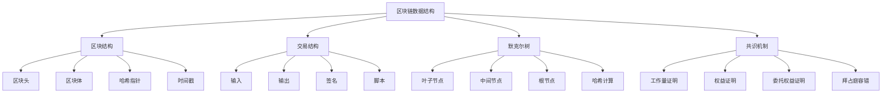

# 区块链数据结构

## 📖 核心概念

**区块链数据结构**是区块链技术的核心组成部分，通过链式结构、哈希指针、默克尔树等数据结构，实现数据的不可篡改性、可追溯性和分布式共识。区块链数据结构是现代分布式系统的重要创新。

### 🏗️ 区块链数据结构的组成要素



## 🔍 区块链数据结构分类

### 数据结构类型

| 结构类型 | 特点 | 优势 | 劣势 | 适用场景 |
|----------|------|------|------|----------|
| **比特币结构** | 简单链式 | 安全性高 | 扩展性差 | 数字货币 |
| **以太坊结构** | 状态树 | 功能丰富 | 复杂度高 | 智能合约 |
| **DAG结构** | 有向无环图 | 高并发 | 一致性难 | 物联网 |
| **混合结构** | 多种结构结合 | 功能全面 | 实现复杂 | 企业应用 |

## 💻 区块链数据结构实现

### 基础区块结构

```cpp
// 基础区块结构
class BlockchainDataStructure {
private:
    struct BlockHeader {
        string previousHash;
        string merkleRoot;
        uint64_t timestamp;
        uint32_t nonce;
        uint32_t difficulty;
        uint32_t version;
        
        BlockHeader() : timestamp(0), nonce(0), difficulty(1), version(1) {}
        
        string calculateHash() const {
            stringstream ss;
            ss << previousHash << merkleRoot << timestamp << nonce << difficulty << version;
            
            hash<string> hasher;
            return to_string(hasher(ss.str()));
        }
    };
    
    struct Transaction {
        string transactionId;
        vector<string> inputs;
        vector<string> outputs;
        string signature;
        uint64_t timestamp;
        
        Transaction() : timestamp(0) {}
        
        string calculateHash() const {
            stringstream ss;
            ss << transactionId;
            for (const string& input : inputs) {
                ss << input;
            }
            for (const string& output : outputs) {
                ss << output;
            }
            ss << timestamp;
            
            hash<string> hasher;
            return to_string(hasher(ss.str()));
        }
    };
    
    struct Block {
        BlockHeader header;
        vector<Transaction> transactions;
        string blockHash;
        uint64_t blockHeight;
        
        Block() : blockHeight(0) {}
        
        string calculateBlockHash() const {
            stringstream ss;
            ss << header.calculateHash();
            for (const Transaction& tx : transactions) {
                ss << tx.calculateHash();
            }
            
            hash<string> hasher;
            return to_string(hasher(ss.str()));
        }
        
        bool isValid() const {
            return blockHash == calculateBlockHash();
        }
    };
    
    vector<Block> blockchain;
    mutex blockchainMutex;
    
public:
    BlockchainDataStructure() {
        // 创建创世区块
        createGenesisBlock();
    }
    
    // 创建创世区块
    void createGenesisBlock() {
        Block genesisBlock;
        genesisBlock.header.previousHash = "0";
        genesisBlock.header.timestamp = chrono::duration_cast<chrono::seconds>(
            chrono::system_clock::now().time_since_epoch()).count();
        genesisBlock.header.merkleRoot = "0";
        genesisBlock.blockHeight = 0;
        genesisBlock.blockHash = genesisBlock.calculateBlockHash();
        
        blockchain.push_back(genesisBlock);
        cout << "Genesis block created: " << genesisBlock.blockHash << endl;
    }
    
    // 添加新区块
    bool addBlock(const vector<Transaction>& transactions) {
        if (transactions.empty()) {
            cout << "Cannot add empty block" << endl;
            return false;
        }
        
        Block newBlock;
        newBlock.transactions = transactions;
        newBlock.header.previousHash = blockchain.back().blockHash;
        newBlock.header.timestamp = chrono::duration_cast<chrono::seconds>(
            chrono::system_clock::now().time_since_epoch()).count();
        newBlock.header.merkleRoot = calculateMerkleRoot(transactions);
        newBlock.blockHeight = blockchain.size();
        
        // 工作量证明
        if (!mineBlock(newBlock)) {
            cout << "Failed to mine block" << endl;
            return false;
        }
        
        newBlock.blockHash = newBlock.calculateBlockHash();
        
        lock_guard<mutex> lock(blockchainMutex);
        blockchain.push_back(newBlock);
        
        cout << "Block added: " << newBlock.blockHash << " (height: " << newBlock.blockHeight << ")" << endl;
        return true;
    }
    
    // 工作量证明
    bool mineBlock(Block& block) {
        string target = string(block.header.difficulty, '0');
        string hash;
        
        for (uint32_t nonce = 0; nonce < UINT32_MAX; nonce++) {
            block.header.nonce = nonce;
            hash = block.calculateBlockHash();
            
            if (hash.substr(0, block.header.difficulty) == target) {
                cout << "Block mined with nonce: " << nonce << endl;
                return true;
            }
        }
        
        return false;
    }
    
    // 计算默克尔根
    string calculateMerkleRoot(const vector<Transaction>& transactions) {
        if (transactions.empty()) {
            return "0";
        }
        
        vector<string> hashes;
        for (const Transaction& tx : transactions) {
            hashes.push_back(tx.calculateHash());
        }
        
        while (hashes.size() > 1) {
            vector<string> nextLevel;
            
            for (size_t i = 0; i < hashes.size(); i += 2) {
                string left = hashes[i];
                string right = (i + 1 < hashes.size()) ? hashes[i + 1] : hashes[i];
                
                string combined = left + right;
                hash<string> hasher;
                nextLevel.push_back(to_string(hasher(combined)));
            }
            
            hashes = nextLevel;
        }
        
        return hashes[0];
    }
    
    // 验证区块链
    bool validateBlockchain() {
        lock_guard<mutex> lock(blockchainMutex);
        
        for (size_t i = 1; i < blockchain.size(); i++) {
            const Block& currentBlock = blockchain[i];
            const Block& previousBlock = blockchain[i - 1];
            
            // 验证区块哈希
            if (!currentBlock.isValid()) {
                cout << "Invalid block at height: " << currentBlock.blockHeight << endl;
                return false;
            }
            
            // 验证前一个区块的哈希
            if (currentBlock.header.previousHash != previousBlock.blockHash) {
                cout << "Invalid previous hash at height: " << currentBlock.blockHeight << endl;
                return false;
            }
            
            // 验证默克尔根
            string calculatedMerkleRoot = calculateMerkleRoot(currentBlock.transactions);
            if (currentBlock.header.merkleRoot != calculatedMerkleRoot) {
                cout << "Invalid merkle root at height: " << currentBlock.blockHeight << endl;
                return false;
            }
        }
        
        cout << "Blockchain validation successful" << endl;
        return true;
    }
    
    // 获取区块信息
    Block getBlock(uint64_t height) {
        lock_guard<mutex> lock(blockchainMutex);
        
        if (height < blockchain.size()) {
            return blockchain[height];
        }
        
        return Block();
    }
    
    // 获取最新区块
    Block getLatestBlock() {
        lock_guard<mutex> lock(blockchainMutex);
        
        if (!blockchain.empty()) {
            return blockchain.back();
        }
        
        return Block();
    }
    
    // 获取区块链统计信息
    struct BlockchainStatistics {
        uint64_t totalBlocks;
        uint64_t totalTransactions;
        string latestBlockHash;
        uint64_t latestBlockHeight;
        double averageBlockTime;
    };
    
    BlockchainStatistics getStatistics() {
        lock_guard<mutex> lock(blockchainMutex);
        
        BlockchainStatistics stats;
        stats.totalBlocks = blockchain.size();
        stats.totalTransactions = 0;
        stats.latestBlockHash = "";
        stats.latestBlockHeight = 0;
        stats.averageBlockTime = 0;
        
        if (!blockchain.empty()) {
            const Block& latestBlock = blockchain.back();
            stats.latestBlockHash = latestBlock.blockHash;
            stats.latestBlockHeight = latestBlock.blockHeight;
            
            for (const Block& block : blockchain) {
                stats.totalTransactions += block.transactions.size();
            }
            
            if (blockchain.size() > 1) {
                uint64_t totalTime = latestBlock.header.timestamp - blockchain[0].header.timestamp;
                stats.averageBlockTime = (double)totalTime / (blockchain.size() - 1);
            }
        }
        
        return stats;
    }
};
```

### 默克尔树实现

```cpp
// 默克尔树实现
class MerkleTree {
private:
    struct MerkleNode {
        string hash;
        MerkleNode* left;
        MerkleNode* right;
        MerkleNode* parent;
        
        MerkleNode(const string& h) : hash(h), left(nullptr), right(nullptr), parent(nullptr) {}
        
        ~MerkleNode() {
            delete left;
            delete right;
        }
    };
    
    MerkleNode* root;
    vector<MerkleNode*> leaves;
    
public:
    MerkleTree() : root(nullptr) {}
    
    ~MerkleTree() {
        delete root;
    }
    
    // 构建默克尔树
    void buildTree(const vector<string>& data) {
        if (data.empty()) {
            return;
        }
        
        // 创建叶子节点
        for (const string& item : data) {
            string hash = calculateHash(item);
            MerkleNode* leaf = new MerkleNode(hash);
            leaves.push_back(leaf);
        }
        
        // 构建树
        vector<MerkleNode*> currentLevel = leaves;
        
        while (currentLevel.size() > 1) {
            vector<MerkleNode*> nextLevel;
            
            for (size_t i = 0; i < currentLevel.size(); i += 2) {
                MerkleNode* left = currentLevel[i];
                MerkleNode* right = (i + 1 < currentLevel.size()) ? currentLevel[i + 1] : currentLevel[i];
                
                string combinedHash = left->hash + right->hash;
                string parentHash = calculateHash(combinedHash);
                
                MerkleNode* parent = new MerkleNode(parentHash);
                parent->left = left;
                parent->right = right;
                left->parent = parent;
                right->parent = parent;
                
                nextLevel.push_back(parent);
            }
            
            currentLevel = nextLevel;
        }
        
        root = currentLevel[0];
        cout << "Merkle tree built with " << data.size() << " leaves" << endl;
    }
    
    // 获取根哈希
    string getRootHash() const {
        return root ? root->hash : "";
    }
    
    // 验证数据
    bool verifyData(const string& data, const vector<string>& proof) {
        if (proof.empty()) {
            return false;
        }
        
        string hash = calculateHash(data);
        
        for (const string& proofHash : proof) {
            hash = calculateHash(hash + proofHash);
        }
        
        return hash == getRootHash();
    }
    
    // 生成证明
    vector<string> generateProof(const string& data) {
        vector<string> proof;
        
        // 找到数据对应的叶子节点
        MerkleNode* leaf = nullptr;
        for (MerkleNode* node : leaves) {
            if (node->hash == calculateHash(data)) {
                leaf = node;
                break;
            }
        }
        
        if (!leaf) {
            return proof;
        }
        
        // 向上遍历生成证明
        MerkleNode* current = leaf;
        while (current->parent) {
            MerkleNode* parent = current->parent;
            
            if (current == parent->left) {
                proof.push_back(parent->right->hash);
            } else {
                proof.push_back(parent->left->hash);
            }
            
            current = parent;
        }
        
        return proof;
    }
    
    // 更新数据
    bool updateData(const string& oldData, const string& newData) {
        // 找到要更新的叶子节点
        MerkleNode* leaf = nullptr;
        for (MerkleNode* node : leaves) {
            if (node->hash == calculateHash(oldData)) {
                leaf = node;
                break;
            }
        }
        
        if (!leaf) {
            return false;
        }
        
        // 更新叶子节点哈希
        leaf->hash = calculateHash(newData);
        
        // 向上更新父节点哈希
        MerkleNode* current = leaf;
        while (current->parent) {
            MerkleNode* parent = current->parent;
            string combinedHash = parent->left->hash + parent->right->hash;
            parent->hash = calculateHash(combinedHash);
            current = parent;
        }
        
        cout << "Data updated in Merkle tree" << endl;
        return true;
    }
    
private:
    // 计算哈希
    string calculateHash(const string& data) {
        hash<string> hasher;
        return to_string(hasher(data));
    }
    
public:
    // 获取树的高度
    int getHeight() const {
        if (!root) {
            return 0;
        }
        
        int height = 0;
        MerkleNode* current = root;
        while (current->left) {
            height++;
            current = current->left;
        }
        
        return height;
    }
    
    // 获取叶子节点数量
    size_t getLeafCount() const {
        return leaves.size();
    }
    
    // 打印树结构
    void printTree() {
        if (!root) {
            cout << "Empty Merkle tree" << endl;
            return;
        }
        
        cout << "Merkle tree structure:" << endl;
        printNode(root, 0);
    }
    
private:
    void printNode(MerkleNode* node, int level) {
        if (!node) {
            return;
        }
        
        for (int i = 0; i < level; i++) {
            cout << "  ";
        }
        
        cout << "Hash: " << node->hash.substr(0, 8) << "..." << endl;
        
        if (node->left) {
            printNode(node->left, level + 1);
        }
        if (node->right) {
            printNode(node->right, level + 1);
        }
    }
};
```

### 智能合约数据结构

```cpp
// 智能合约数据结构
class SmartContractDataStructure {
private:
    struct Contract {
        string contractAddress;
        string contractCode;
        map<string, string> state;
        uint64_t gasLimit;
        uint64_t gasUsed;
        bool isActive;
        
        Contract(const string& address, const string& code) 
            : contractAddress(address), contractCode(code), gasLimit(1000000), gasUsed(0), isActive(true) {}
        
        bool executeFunction(const string& functionName, const vector<string>& parameters) {
            if (!isActive) {
                return false;
            }
            
            // 模拟函数执行
            cout << "Executing function: " << functionName << " on contract: " << contractAddress << endl;
            
            // 更新状态
            state[functionName] = "executed";
            gasUsed += 1000;
            
            return true;
        }
    };
    
    struct Transaction {
        string from;
        string to;
        uint64_t value;
        string data;
        uint64_t gasLimit;
        uint64_t gasPrice;
        string signature;
        
        Transaction() : value(0), gasLimit(21000), gasPrice(1) {}
        
        bool isValid() const {
            return !from.empty() && !to.empty() && gasLimit > 0;
        }
    };
    
    map<string, Contract> contracts;
    vector<Transaction> transactions;
    mutex contractMutex;
    
public:
    SmartContractDataStructure() {}
    
    // 部署合约
    string deployContract(const string& contractCode) {
        string contractAddress = generateAddress();
        
        lock_guard<mutex> lock(contractMutex);
        contracts[contractAddress] = Contract(contractAddress, contractCode);
        
        cout << "Contract deployed at address: " << contractAddress << endl;
        return contractAddress;
    }
    
    // 调用合约函数
    bool callContract(const string& contractAddress, const string& functionName, 
                     const vector<string>& parameters) {
        lock_guard<mutex> lock(contractMutex);
        
        auto it = contracts.find(contractAddress);
        if (it == contracts.end()) {
            cout << "Contract not found: " << contractAddress << endl;
            return false;
        }
        
        return it->second.executeFunction(functionName, parameters);
    }
    
    // 获取合约状态
    string getContractState(const string& contractAddress, const string& key) {
        lock_guard<mutex> lock(contractMutex);
        
        auto it = contracts.find(contractAddress);
        if (it == contracts.end()) {
            return "";
        }
        
        auto stateIt = it->second.state.find(key);
        if (stateIt != it->second.state.end()) {
            return stateIt->second;
        }
        
        return "";
    }
    
    // 设置合约状态
    bool setContractState(const string& contractAddress, const string& key, const string& value) {
        lock_guard<mutex> lock(contractMutex);
        
        auto it = contracts.find(contractAddress);
        if (it == contracts.end()) {
            return false;
        }
        
        it->second.state[key] = value;
        cout << "Contract state updated: " << key << " = " << value << endl;
        return true;
    }
    
    // 执行交易
    bool executeTransaction(const Transaction& transaction) {
        if (!transaction.isValid()) {
            cout << "Invalid transaction" << endl;
            return false;
        }
        
        // 验证签名
        if (!verifySignature(transaction)) {
            cout << "Invalid transaction signature" << endl;
            return false;
        }
        
        // 执行交易
        if (transaction.to.empty()) {
            // 合约部署
            string contractAddress = deployContract(transaction.data);
            cout << "Contract deployed via transaction" << endl;
        } else {
            // 合约调用
            vector<string> parameters = parseTransactionData(transaction.data);
            callContract(transaction.to, "execute", parameters);
            cout << "Contract called via transaction" << endl;
        }
        
        transactions.push_back(transaction);
        return true;
    }
    
private:
    // 生成地址
    string generateAddress() {
        static int counter = 0;
        return "0x" + to_string(++counter);
    }
    
    // 验证签名
    bool verifySignature(const Transaction& transaction) {
        // 模拟签名验证
        return !transaction.signature.empty();
    }
    
    // 解析交易数据
    vector<string> parseTransactionData(const string& data) {
        vector<string> parameters;
        // 模拟数据解析
        parameters.push_back(data);
        return parameters;
    }
    
public:
    // 获取合约信息
    struct ContractInfo {
        string address;
        string code;
        map<string, string> state;
        uint64_t gasUsed;
        bool isActive;
    };
    
    ContractInfo getContractInfo(const string& contractAddress) {
        lock_guard<mutex> lock(contractMutex);
        
        auto it = contracts.find(contractAddress);
        if (it != contracts.end()) {
            ContractInfo info;
            info.address = it->second.contractAddress;
            info.code = it->second.contractCode;
            info.state = it->second.state;
            info.gasUsed = it->second.gasUsed;
            info.isActive = it->second.isActive;
            return info;
        }
        
        return ContractInfo();
    }
    
    // 获取统计信息
    struct SmartContractStatistics {
        int totalContracts;
        int activeContracts;
        int totalTransactions;
        uint64_t totalGasUsed;
    };
    
    SmartContractStatistics getStatistics() {
        lock_guard<mutex> lock(contractMutex);
        
        SmartContractStatistics stats;
        stats.totalContracts = contracts.size();
        stats.activeContracts = 0;
        stats.totalTransactions = transactions.size();
        stats.totalGasUsed = 0;
        
        for (const auto& [address, contract] : contracts) {
            if (contract.isActive) {
                stats.activeContracts++;
            }
            stats.totalGasUsed += contract.gasUsed;
        }
        
        return stats;
    }
};
```

### 区块链数据结构测试

```cpp
// 区块链数据结构测试
class BlockchainDataStructureTest {
public:
    static void runAllTests() {
        cout << "=== Blockchain Data Structure Tests ===" << endl;
        
        // 测试基础区块结构
        testBasicBlockStructure();
        
        cout << "\n" << string(50, '=') << endl;
        
        // 测试默克尔树
        testMerkleTree();
        
        cout << "\n" << string(50, '=') << endl;
        
        // 测试智能合约
        testSmartContract();
    }
    
private:
    static void testBasicBlockStructure() {
        cout << "=== Basic Block Structure Test ===" << endl;
        
        BlockchainDataStructure blockchain;
        
        // 创建交易
        vector<BlockchainDataStructure::Transaction> transactions;
        for (int i = 0; i < 5; i++) {
            BlockchainDataStructure::Transaction tx;
            tx.transactionId = "tx_" + to_string(i);
            tx.inputs.push_back("input_" + to_string(i));
            tx.outputs.push_back("output_" + to_string(i));
            tx.timestamp = chrono::duration_cast<chrono::seconds>(
                chrono::system_clock::now().time_since_epoch()).count();
            transactions.push_back(tx);
        }
        
        // 添加区块
        blockchain.addBlock(transactions);
        
        // 验证区块链
        bool isValid = blockchain.validateBlockchain();
        cout << "Blockchain validation: " << (isValid ? "Passed" : "Failed") << endl;
        
        // 获取统计信息
        auto stats = blockchain.getStatistics();
        cout << "\nBlockchain statistics:" << endl;
        cout << "Total blocks: " << stats.totalBlocks << endl;
        cout << "Total transactions: " << stats.totalTransactions << endl;
        cout << "Latest block height: " << stats.latestBlockHeight << endl;
        cout << "Average block time: " << stats.averageBlockTime << " seconds" << endl;
        
        cout << "Basic block structure test completed" << endl;
    }
    
    static void testMerkleTree() {
        cout << "=== Merkle Tree Test ===" << endl;
        
        MerkleTree merkleTree;
        
        // 构建默克尔树
        vector<string> data = {"data1", "data2", "data3", "data4", "data5"};
        merkleTree.buildTree(data);
        
        // 获取根哈希
        string rootHash = merkleTree.getRootHash();
        cout << "Merkle root hash: " << rootHash.substr(0, 16) << "..." << endl;
        
        // 生成证明
        vector<string> proof = merkleTree.generateProof("data1");
        cout << "Proof generated for data1: " << proof.size() << " hashes" << endl;
        
        // 验证数据
        bool isValid = merkleTree.verifyData("data1", proof);
        cout << "Data verification: " << (isValid ? "Passed" : "Failed") << endl;
        
        // 更新数据
        merkleTree.updateData("data1", "updated_data1");
        string newRootHash = merkleTree.getRootHash();
        cout << "New root hash after update: " << newRootHash.substr(0, 16) << "..." << endl;
        
        // 打印树结构
        merkleTree.printTree();
        
        cout << "Merkle tree test completed" << endl;
    }
    
    static void testSmartContract() {
        cout << "=== Smart Contract Test ===" << endl;
        
        SmartContractDataStructure smartContract;
        
        // 部署合约
        string contractCode = "contract TestContract { function execute() public {} }";
        string contractAddress = smartContract.deployContract(contractCode);
        
        // 调用合约函数
        vector<string> parameters = {"param1", "param2"};
        bool success = smartContract.callContract(contractAddress, "execute", parameters);
        cout << "Contract function call: " << (success ? "Success" : "Failed") << endl;
        
        // 设置合约状态
        smartContract.setContractState(contractAddress, "key1", "value1");
        smartContract.setContractState(contractAddress, "key2", "value2");
        
        // 获取合约状态
        string value1 = smartContract.getContractState(contractAddress, "key1");
        string value2 = smartContract.getContractState(contractAddress, "key2");
        cout << "Contract state: key1 = " << value1 << ", key2 = " << value2 << endl;
        
        // 执行交易
        BlockchainDataStructure::Transaction transaction;
        transaction.from = "0x123";
        transaction.to = contractAddress;
        transaction.value = 1000;
        transaction.data = "function_call_data";
        transaction.signature = "signature";
        
        bool txSuccess = smartContract.executeTransaction(transaction);
        cout << "Transaction execution: " << (txSuccess ? "Success" : "Failed") << endl;
        
        // 获取统计信息
        auto stats = smartContract.getStatistics();
        cout << "\nSmart contract statistics:" << endl;
        cout << "Total contracts: " << stats.totalContracts << endl;
        cout << "Active contracts: " << stats.activeContracts << endl;
        cout << "Total transactions: " << stats.totalTransactions << endl;
        cout << "Total gas used: " << stats.totalGasUsed << endl;
        
        cout << "Smart contract test completed" << endl;
    }
};
```

## ⚡ 复杂度分析

### 区块链数据结构复杂度

| 操作 | 时间复杂度 | 空间复杂度 | 网络开销 | 适用场景 |
|------|------------|------------|----------|----------|
| **区块添加** | O(n) | O(n) | 高 | 区块链 |
| **默克尔树** | O(log n) | O(n) | 低 | 数据验证 |
| **智能合约** | O(1) | O(n) | 中 | 智能合约 |
| **共识机制** | O(n) | O(n) | 高 | 分布式共识 |

## 🎓 学习要点总结

### 核心理解

1. **区块链结构**：理解区块链的基本结构
2. **默克尔树**：掌握默克尔树的原理
3. **智能合约**：理解智能合约的机制
4. **共识机制**：掌握共识机制的原理

### 实践要点

1. **数据结构设计**：设计区块链数据结构
2. **安全性保证**：保证数据安全性
3. **性能优化**：优化区块链性能
4. **实际应用**：将区块链技术应用到实际问题中

### 应用思维

1. **分布式思维**：理解分布式系统的特点
2. **安全性思维**：关注数据安全性
3. **共识思维**：理解共识机制
4. **实际应用**：将区块链技术应用到实际问题中

---

**相关链接：**
- [[08-知识边疆/01-前沿探索/01-量子数据结构|量子数据结构]] - 量子数据结构
- [[08-知识边疆/01-前沿探索/02-边缘计算数据结构|边缘计算数据结构]] - 边缘计算数据结构
- [[08-知识边疆/02-跨界融合/03-数据结构与大数据|数据结构与大数据]] - 大数据技术
- [[08-知识边疆/02-跨界融合/04-数据结构与云计算|数据结构与云计算]] - 云计算技术
