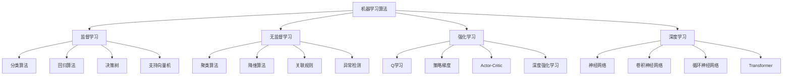

# 机器学习算法

## 📖 核心概念

**机器学习算法**是人工智能的核心组成部分，通过从数据中学习模式和规律，实现预测、分类、聚类等任务。机器学习算法涉及多种数据结构，如决策树、神经网络、支持向量机等，是数据结构与算法在实际应用中的重要体现。

### 🏗️ 机器学习算法分类



## 🔧 机器学习算法实现

### 基础数据结构

```python
import numpy as np
import math
from typing import List, Tuple, Optional, Any, Dict
from dataclasses import dataclass
from abc import ABC, abstractmethod
import random
from collections import defaultdict

# 数据点类
@dataclass
class DataPoint:
    features: List[float]
    label: Optional[Any] = None
    weight: float = 1.0
    
    def __post_init__(self):
        self.features = np.array(self.features, dtype=float)
    
    def distance_to(self, other: 'DataPoint') -> float:
        """计算欧几里得距离"""
        return np.linalg.norm(self.features - other.features)
    
    def __str__(self):
        return f"DataPoint(features={self.features.tolist()}, label={self.label})"

# 数据集类
class Dataset:
    def __init__(self, data_points: List[DataPoint] = None):
        self.data_points = data_points or []
        self.feature_dim = len(data_points[0].features) if data_points else 0
    
    def add_point(self, point: DataPoint):
        """添加数据点"""
        self.data_points.append(point)
        if self.feature_dim == 0:
            self.feature_dim = len(point.features)
    
    def get_features(self) -> np.ndarray:
        """获取特征矩阵"""
        return np.array([point.features for point in self.data_points])
    
    def get_labels(self) -> List[Any]:
        """获取标签列表"""
        return [point.label for point in self.data_points]
    
    def split(self, ratio: float = 0.8) -> Tuple['Dataset', 'Dataset']:
        """分割数据集"""
        random.shuffle(self.data_points)
        split_idx = int(len(self.data_points) * ratio)
        
        train_data = Dataset(self.data_points[:split_idx])
        test_data = Dataset(self.data_points[split_idx:])
        
        return train_data, test_data
    
    def normalize(self):
        """标准化特征"""
        features = self.get_features()
        mean = np.mean(features, axis=0)
        std = np.std(features, axis=0)
        
        for point in self.data_points:
            point.features = (point.features - mean) / (std + 1e-8)
    
    def __len__(self):
        return len(self.data_points)
    
    def __getitem__(self, index):
        return self.data_points[index]

# 模型基类
class MLModel(ABC):
    def __init__(self):
        self.is_trained = False
        self.training_history = []
    
    @abstractmethod
    def train(self, dataset: Dataset):
        """训练模型"""
        pass
    
    @abstractmethod
    def predict(self, features: List[float]) -> Any:
        """预测"""
        pass
    
    def evaluate(self, test_dataset: Dataset) -> Dict[str, float]:
        """评估模型"""
        if not self.is_trained:
            raise ValueError("Model must be trained before evaluation")
        
        predictions = []
        actual_labels = []
        
        for point in test_dataset.data_points:
            pred = self.predict(point.features.tolist())
            predictions.append(pred)
            actual_labels.append(point.label)
        
        return self._calculate_metrics(actual_labels, predictions)
    
    def _calculate_metrics(self, actual: List[Any], predicted: List[Any]) -> Dict[str, float]:
        """计算评估指标"""
        if len(actual) != len(predicted):
            raise ValueError("Length mismatch between actual and predicted")
        
        # 分类任务
        if isinstance(actual[0], (int, str)):
            return self._calculate_classification_metrics(actual, predicted)
        # 回归任务
        else:
            return self._calculate_regression_metrics(actual, predicted)
    
    def _calculate_classification_metrics(self, actual: List[Any], predicted: List[Any]) -> Dict[str, float]:
        """计算分类指标"""
        correct = sum(1 for a, p in zip(actual, predicted) if a == p)
        accuracy = correct / len(actual)
        
        # 计算混淆矩阵
        unique_labels = list(set(actual + predicted))
        confusion_matrix = np.zeros((len(unique_labels), len(unique_labels)))
        
        label_to_idx = {label: i for i, label in enumerate(unique_labels)}
        
        for a, p in zip(actual, predicted):
            confusion_matrix[label_to_idx[a]][label_to_idx[p]] += 1
        
        # 计算精确率和召回率
        precision = []
        recall = []
        
        for i in range(len(unique_labels)):
            tp = confusion_matrix[i][i]
            fp = np.sum(confusion_matrix[:, i]) - tp
            fn = np.sum(confusion_matrix[i, :]) - tp
            
            precision.append(tp / (tp + fp) if (tp + fp) > 0 else 0)
            recall.append(tp / (tp + fn) if (tp + fn) > 0 else 0)
        
        return {
            'accuracy': accuracy,
            'precision': np.mean(precision),
            'recall': np.mean(recall),
            'f1_score': 2 * np.mean(precision) * np.mean(recall) / (np.mean(precision) + np.mean(recall)) if (np.mean(precision) + np.mean(recall)) > 0 else 0
        }
    
    def _calculate_regression_metrics(self, actual: List[float], predicted: List[float]) -> Dict[str, float]:
        """计算回归指标"""
        actual = np.array(actual)
        predicted = np.array(predicted)
        
        mse = np.mean((actual - predicted) ** 2)
        rmse = np.sqrt(mse)
        mae = np.mean(np.abs(actual - predicted))
        
        # 计算R²
        ss_res = np.sum((actual - predicted) ** 2)
        ss_tot = np.sum((actual - np.mean(actual)) ** 2)
        r2 = 1 - (ss_res / ss_tot) if ss_tot > 0 else 0
        
        return {
            'mse': mse,
            'rmse': rmse,
            'mae': mae,
            'r2': r2
        }
```

### 监督学习算法

```python
# K近邻算法
class KNN(MLModel):
    def __init__(self, k: int = 3):
        super().__init__()
        self.k = k
        self.training_data = None
    
    def train(self, dataset: Dataset):
        """训练KNN模型"""
        self.training_data = dataset
        self.is_trained = True
    
    def predict(self, features: List[float]) -> Any:
        """预测"""
        if not self.is_trained:
            raise ValueError("Model must be trained before prediction")
        
        features = np.array(features)
        
        # 计算距离
        distances = []
        for point in self.training_data.data_points:
            dist = np.linalg.norm(features - point.features)
            distances.append((dist, point.label))
        
        # 排序并选择k个最近邻
        distances.sort(key=lambda x: x[0])
        k_nearest = distances[:self.k]
        
        # 投票
        label_counts = defaultdict(int)
        for _, label in k_nearest:
            label_counts[label] += 1
        
        # 返回最频繁的标签
        return max(label_counts.items(), key=lambda x: x[1])[0]

# 朴素贝叶斯算法
class NaiveBayes(MLModel):
    def __init__(self):
        super().__init__()
        self.class_priors = {}
        self.feature_likelihoods = {}
        self.classes = []
    
    def train(self, dataset: Dataset):
        """训练朴素贝叶斯模型"""
        # 获取所有类别
        self.classes = list(set(point.label for point in dataset.data_points))
        
        # 计算先验概率
        total_points = len(dataset.data_points)
        for class_label in self.classes:
            class_count = sum(1 for point in dataset.data_points if point.label == class_label)
            self.class_priors[class_label] = class_count / total_points
        
        # 计算似然概率
        for class_label in self.classes:
            class_points = [point for point in dataset.data_points if point.label == class_label]
            class_features = np.array([point.features for point in class_points])
            
            self.feature_likelihoods[class_label] = {
                'mean': np.mean(class_features, axis=0),
                'std': np.std(class_features, axis=0)
            }
        
        self.is_trained = True
    
    def predict(self, features: List[float]) -> Any:
        """预测"""
        if not self.is_trained:
            raise ValueError("Model must be trained before prediction")
        
        features = np.array(features)
        best_class = None
        best_score = float('-inf')
        
        for class_label in self.classes:
            # 计算后验概率
            prior = self.class_priors[class_label]
            likelihood = self.feature_likelihoods[class_label]
            
            # 计算似然概率（假设高斯分布）
            mean = likelihood['mean']
            std = likelihood['std']
            
            # 避免除零
            std = np.where(std == 0, 1e-8, std)
            
            # 计算概率密度
            prob = np.prod(
                1 / (np.sqrt(2 * np.pi) * std) * 
                np.exp(-0.5 * ((features - mean) / std) ** 2)
            )
            
            score = np.log(prior) + np.log(prob)
            
            if score > best_score:
                best_score = score
                best_class = class_label
        
        return best_class

# 决策树算法
class DecisionTree(MLModel):
    def __init__(self, max_depth: int = 10, min_samples_split: int = 2):
        super().__init__()
        self.max_depth = max_depth
        self.min_samples_split = min_samples_split
        self.tree = None
    
    def train(self, dataset: Dataset):
        """训练决策树"""
        self.tree = self._build_tree(dataset.data_points, 0)
        self.is_trained = True
    
    def _build_tree(self, data_points: List[DataPoint], depth: int) -> Dict:
        """构建决策树"""
        if depth >= self.max_depth or len(data_points) < self.min_samples_split:
            return {'leaf': True, 'label': self._most_common_label(data_points)}
        
        # 检查是否所有标签相同
        labels = [point.label for point in data_points]
        if len(set(labels)) == 1:
            return {'leaf': True, 'label': labels[0]}
        
        # 选择最佳分割
        best_split = self._find_best_split(data_points)
        if best_split is None:
            return {'leaf': True, 'label': self._most_common_label(data_points)}
        
        feature_idx, threshold = best_split
        
        # 分割数据
        left_data = [point for point in data_points if point.features[feature_idx] <= threshold]
        right_data = [point for point in data_points if point.features[feature_idx] > threshold]
        
        if len(left_data) == 0 or len(right_data) == 0:
            return {'leaf': True, 'label': self._most_common_label(data_points)}
        
        # 递归构建子树
        return {
            'leaf': False,
            'feature_idx': feature_idx,
            'threshold': threshold,
            'left': self._build_tree(left_data, depth + 1),
            'right': self._build_tree(right_data, depth + 1)
        }
    
    def _find_best_split(self, data_points: List[DataPoint]) -> Optional[Tuple[int, float]]:
        """找到最佳分割点"""
        best_gini = float('inf')
        best_split = None
        
        for feature_idx in range(len(data_points[0].features)):
            values = [point.features[feature_idx] for point in data_points]
            unique_values = sorted(set(values))
            
            for i in range(len(unique_values) - 1):
                threshold = (unique_values[i] + unique_values[i + 1]) / 2
                
                left_data = [point for point in data_points if point.features[feature_idx] <= threshold]
                right_data = [point for point in data_points if point.features[feature_idx] > threshold]
                
                if len(left_data) == 0 or len(right_data) == 0:
                    continue
                
                gini = self._calculate_gini(left_data, right_data)
                
                if gini < best_gini:
                    best_gini = gini
                    best_split = (feature_idx, threshold)
        
        return best_split
    
    def _calculate_gini(self, left_data: List[DataPoint], right_data: List[DataPoint]) -> float:
        """计算基尼不纯度"""
        def gini_impurity(data):
            if len(data) == 0:
                return 0
            
            labels = [point.label for point in data]
            label_counts = defaultdict(int)
            for label in labels:
                label_counts[label] += 1
            
            gini = 1.0
            for count in label_counts.values():
                gini -= (count / len(data)) ** 2
            
            return gini
        
        total = len(left_data) + len(right_data)
        left_gini = gini_impurity(left_data)
        right_gini = gini_impurity(right_data)
        
        return (len(left_data) / total) * left_gini + (len(right_data) / total) * right_gini
    
    def _most_common_label(self, data_points: List[DataPoint]) -> Any:
        """获取最常见的标签"""
        labels = [point.label for point in data_points]
        return max(set(labels), key=labels.count)
    
    def predict(self, features: List[float]) -> Any:
        """预测"""
        if not self.is_trained:
            raise ValueError("Model must be trained before prediction")
        
        features = np.array(features)
        node = self.tree
        
        while not node['leaf']:
            if features[node['feature_idx']] <= node['threshold']:
                node = node['left']
            else:
                node = node['right']
        
        return node['label']

# 支持向量机算法
class SVM(MLModel):
    def __init__(self, C: float = 1.0, kernel: str = 'linear'):
        super().__init__()
        self.C = C
        self.kernel = kernel
        self.support_vectors = []
        self.support_vector_labels = []
        self.alpha = []
        self.bias = 0
    
    def train(self, dataset: Dataset):
        """训练SVM模型"""
        # 简化的SVM实现
        X = self.get_features()
        y = np.array([1 if label == 1 else -1 for label in dataset.get_labels()])
        
        # 使用简化的训练方法
        self._train_svm(X, y)
        self.is_trained = True
    
    def _train_svm(self, X: np.ndarray, y: np.ndarray):
        """训练SVM（简化版）"""
        n_samples, n_features = X.shape
        
        # 初始化参数
        self.alpha = np.zeros(n_samples)
        self.bias = 0
        
        # 简化的训练过程
        for epoch in range(100):
            for i in range(n_samples):
                # 计算预测值
                prediction = self._predict_single(X[i])
                
                # 更新参数
                if y[i] * prediction < 1:
                    self.alpha[i] += 0.01
                    self.bias += 0.01 * y[i]
        
        # 选择支持向量
        support_vector_indices = np.where(self.alpha > 1e-5)[0]
        self.support_vectors = X[support_vector_indices]
        self.support_vector_labels = y[support_vector_indices]
        self.alpha = self.alpha[support_vector_indices]
    
    def _predict_single(self, x: np.ndarray) -> float:
        """预测单个样本"""
        if len(self.support_vectors) == 0:
            return 0
        
        prediction = 0
        for i, (sv, sv_label, alpha) in enumerate(zip(self.support_vectors, self.support_vector_labels, self.alpha)):
            if self.kernel == 'linear':
                kernel_value = np.dot(x, sv)
            else:
                kernel_value = self._rbf_kernel(x, sv)
            
            prediction += alpha * sv_label * kernel_value
        
        return prediction + self.bias
    
    def _rbf_kernel(self, x1: np.ndarray, x2: np.ndarray, gamma: float = 1.0) -> float:
        """RBF核函数"""
        return np.exp(-gamma * np.linalg.norm(x1 - x2) ** 2)
    
    def predict(self, features: List[float]) -> Any:
        """预测"""
        if not self.is_trained:
            raise ValueError("Model must be trained before prediction")
        
        features = np.array(features)
        prediction = self._predict_single(features)
        
        return 1 if prediction > 0 else 0
```

### 无监督学习算法

```python
# K-means聚类算法
class KMeans(MLModel):
    def __init__(self, k: int = 3, max_iters: int = 100):
        super().__init__()
        self.k = k
        self.max_iters = max_iters
        self.centroids = []
        self.clusters = []
    
    def train(self, dataset: Dataset):
        """训练K-means模型"""
        X = dataset.get_features()
        
        # 初始化质心
        self.centroids = self._initialize_centroids(X)
        
        for iteration in range(self.max_iters):
            # 分配数据点到最近的质心
            self.clusters = self._assign_clusters(X)
            
            # 更新质心
            new_centroids = self._update_centroids(X, self.clusters)
            
            # 检查收敛
            if np.allclose(self.centroids, new_centroids):
                break
            
            self.centroids = new_centroids
        
        self.is_trained = True
    
    def _initialize_centroids(self, X: np.ndarray) -> np.ndarray:
        """初始化质心"""
        n_samples, n_features = X.shape
        centroids = np.zeros((self.k, n_features))
        
        # 随机选择k个数据点作为初始质心
        random_indices = np.random.choice(n_samples, self.k, replace=False)
        centroids = X[random_indices]
        
        return centroids
    
    def _assign_clusters(self, X: np.ndarray) -> List[int]:
        """分配数据点到聚类"""
        clusters = []
        
        for point in X:
            distances = [np.linalg.norm(point - centroid) for centroid in self.centroids]
            cluster = np.argmin(distances)
            clusters.append(cluster)
        
        return clusters
    
    def _update_centroids(self, X: np.ndarray, clusters: List[int]) -> np.ndarray:
        """更新质心"""
        new_centroids = np.zeros_like(self.centroids)
        
        for i in range(self.k):
            cluster_points = X[np.array(clusters) == i]
            if len(cluster_points) > 0:
                new_centroids[i] = np.mean(cluster_points, axis=0)
            else:
                new_centroids[i] = self.centroids[i]
        
        return new_centroids
    
    def predict(self, features: List[float]) -> int:
        """预测聚类"""
        if not self.is_trained:
            raise ValueError("Model must be trained before prediction")
        
        features = np.array(features)
        distances = [np.linalg.norm(features - centroid) for centroid in self.centroids]
        return np.argmin(distances)

# 主成分分析算法
class PCA(MLModel):
    def __init__(self, n_components: int = 2):
        super().__init__()
        self.n_components = n_components
        self.components = None
        self.mean = None
        self.explained_variance_ratio = None
    
    def train(self, dataset: Dataset):
        """训练PCA模型"""
        X = dataset.get_features()
        
        # 中心化数据
        self.mean = np.mean(X, axis=0)
        X_centered = X - self.mean
        
        # 计算协方差矩阵
        cov_matrix = np.cov(X_centered.T)
        
        # 计算特征值和特征向量
        eigenvalues, eigenvectors = np.linalg.eigh(cov_matrix)
        
        # 排序特征值和特征向量
        idx = np.argsort(eigenvalues)[::-1]
        eigenvalues = eigenvalues[idx]
        eigenvectors = eigenvectors[:, idx]
        
        # 选择前n_components个主成分
        self.components = eigenvectors[:, :self.n_components]
        
        # 计算解释方差比
        total_variance = np.sum(eigenvalues)
        self.explained_variance_ratio = eigenvalues[:self.n_components] / total_variance
        
        self.is_trained = True
    
    def transform(self, X: np.ndarray) -> np.ndarray:
        """转换数据"""
        if not self.is_trained:
            raise ValueError("Model must be trained before transformation")
        
        X_centered = X - self.mean
        return np.dot(X_centered, self.components)
    
    def predict(self, features: List[float]) -> List[float]:
        """预测（转换到低维空间）"""
        if not self.is_trained:
            raise ValueError("Model must be trained before prediction")
        
        features = np.array(features).reshape(1, -1)
        transformed = self.transform(features)
        return transformed[0].tolist()
```

### 神经网络算法

```python
# 简单神经网络
class NeuralNetwork(MLModel):
    def __init__(self, layers: List[int], learning_rate: float = 0.01):
        super().__init__()
        self.layers = layers
        self.learning_rate = learning_rate
        self.weights = []
        self.biases = []
        self.activations = []
    
    def train(self, dataset: Dataset):
        """训练神经网络"""
        X = dataset.get_features()
        y = self._encode_labels(dataset.get_labels())
        
        # 初始化权重和偏置
        self._initialize_weights()
        
        # 训练
        for epoch in range(1000):
            # 前向传播
            output = self._forward(X)
            
            # 计算损失
            loss = self._calculate_loss(output, y)
            
            # 反向传播
            self._backward(X, y, output)
            
            if epoch % 100 == 0:
                print(f"Epoch {epoch}, Loss: {loss:.4f}")
        
        self.is_trained = True
    
    def _initialize_weights(self):
        """初始化权重和偏置"""
        self.weights = []
        self.biases = []
        
        for i in range(len(self.layers) - 1):
            # Xavier初始化
            w = np.random.randn(self.layers[i], self.layers[i + 1]) * np.sqrt(2.0 / self.layers[i])
            b = np.zeros((1, self.layers[i + 1]))
            
            self.weights.append(w)
            self.biases.append(b)
    
    def _forward(self, X: np.ndarray) -> np.ndarray:
        """前向传播"""
        self.activations = [X]
        
        for i in range(len(self.weights)):
            z = np.dot(self.activations[-1], self.weights[i]) + self.biases[i]
            a = self._sigmoid(z)
            self.activations.append(a)
        
        return self.activations[-1]
    
    def _backward(self, X: np.ndarray, y: np.ndarray, output: np.ndarray):
        """反向传播"""
        m = X.shape[0]
        
        # 计算输出层误差
        delta = output - y
        
        # 反向传播误差
        for i in range(len(self.weights) - 1, -1, -1):
            # 计算梯度
            dW = np.dot(self.activations[i].T, delta) / m
            db = np.sum(delta, axis=0, keepdims=True) / m
            
            # 更新权重和偏置
            self.weights[i] -= self.learning_rate * dW
            self.biases[i] -= self.learning_rate * db
            
            # 计算前一层误差
            if i > 0:
                delta = np.dot(delta, self.weights[i].T) * self._sigmoid_derivative(self.activations[i])
    
    def _sigmoid(self, x: np.ndarray) -> np.ndarray:
        """Sigmoid激活函数"""
        return 1 / (1 + np.exp(-np.clip(x, -500, 500)))
    
    def _sigmoid_derivative(self, x: np.ndarray) -> np.ndarray:
        """Sigmoid导数"""
        return x * (1 - x)
    
    def _encode_labels(self, labels: List[Any]) -> np.ndarray:
        """编码标签"""
        unique_labels = list(set(labels))
        label_to_idx = {label: i for i, label in enumerate(unique_labels)}
        
        encoded = np.zeros((len(labels), len(unique_labels)))
        for i, label in enumerate(labels):
            encoded[i][label_to_idx[label]] = 1
        
        return encoded
    
    def _calculate_loss(self, output: np.ndarray, y: np.ndarray) -> float:
        """计算损失"""
        return np.mean((output - y) ** 2)
    
    def predict(self, features: List[float]) -> Any:
        """预测"""
        if not self.is_trained:
            raise ValueError("Model must be trained before prediction")
        
        features = np.array(features).reshape(1, -1)
        output = self._forward(features)
        
        # 返回概率最高的类别
        return np.argmax(output[0])
```

## 🎯 机器学习算法应用

### 实际应用场景

```python
class MachineLearningApplications:
    @staticmethod
    def demonstrate_applications():
        print("机器学习算法 Applications:")
        print("========================")
        
        print("1. 分类任务:")
        print("   - 图像识别")
        print("   - 文本分类")
        print("   - 医疗诊断")
        print("   - 垃圾邮件检测")
        
        print("2. 回归任务:")
        print("   - 房价预测")
        print("   - 股票价格预测")
        print("   - 销量预测")
        print("   - 温度预测")
        
        print("3. 聚类任务:")
        print("   - 客户细分")
        print("   - 基因分析")
        print("   - 市场分析")
        print("   - 异常检测")
        
        print("4. 降维任务:")
        print("   - 数据可视化")
        print("   - 特征选择")
        print("   - 噪声过滤")
        print("   - 压缩存储")
    
    @staticmethod
    def analyze_performance():
        print("机器学习算法 Performance Analysis:")
        print("================================")
        
        print("1. 算法复杂度:")
        print("   - KNN: O(n)")
        print("   - 朴素贝叶斯: O(n)")
        print("   - 决策树: O(n log n)")
        print("   - SVM: O(n²)")
        print("   - K-means: O(n*k*i)")
        print("   - PCA: O(n³)")
        print("   - 神经网络: O(n*w)")
        print()
        
        print("2. 性能指标:")
        print("   - 准确率: 分类正确率")
        print("   - 精确率: 预测为正例中实际为正例的比例")
        print("   - 召回率: 实际正例中被预测为正例的比例")
        print("   - F1分数: 精确率和召回率的调和平均")
        print("   - RMSE: 均方根误差")
        print("   - R²: 决定系数")
        print()
        
        print("3. 优化策略:")
        print("   - 特征工程: 特征选择和变换")
        print("   - 超参数调优: 网格搜索和随机搜索")
        print("   - 交叉验证: 模型评估")
        print("   - 集成学习: 多模型组合")
    
    @staticmethod
    def select_algorithm_strategy(problem_type, data_characteristics, performance_requirements):
        print("Algorithm Strategy Selection:")
        print("===========================")
        
        print(f"Problem type: {problem_type}")
        print(f"Data characteristics: {data_characteristics}")
        print(f"Performance requirements: {performance_requirements}")
        
        print("Recommendation:")
        
        if problem_type == "classification" and data_characteristics == "small":
            print("Use KNN or Naive Bayes for small datasets")
        elif problem_type == "classification" and data_characteristics == "large":
            print("Use Decision Tree or SVM for large datasets")
        elif problem_type == "clustering":
            print("Use K-means for clustering tasks")
        elif problem_type == "dimensionality_reduction":
            print("Use PCA for dimensionality reduction")
        elif problem_type == "complex_patterns":
            print("Use Neural Networks for complex patterns")
        else:
            print("Evaluate multiple algorithms and choose the best performing one")
```

## 📊 机器学习算法分析

### 性能分析

```python
class MachineLearningAnalysis:
    @staticmethod
    def analyze_performance():
        print("机器学习算法 Performance Analysis:")
        print("================================")
        
        print("1. 时间复杂度:")
        print("   - 训练时间: O(n*m)")
        print("   - 预测时间: O(m)")
        print("   - 内存使用: O(n*m)")
        print("   - 存储空间: O(m)")
        print()
        
        print("2. 空间复杂度:")
        print("   - 训练数据: O(n*m)")
        print("   - 模型参数: O(m)")
        print("   - 中间结果: O(n)")
        print("   - 缓存数据: O(n)")
        print()
        
        print("3. 算法效率:")
        print("   - 线性算法: 快速简单")
        print("   - 非线性算法: 复杂但强大")
        print("   - 集成算法: 高精度")
        print("   - 深度学习: 最强大但复杂")
    
    @staticmethod
    def analyze_scalability():
        print("机器学习算法 Scalability Analysis:")
        print("================================")
        
        print("1. 数据扩展性:")
        print("   - 小数据集: 简单算法")
        print("   - 中等数据集: 标准算法")
        print("   - 大数据集: 分布式算法")
        print("   - 超大数据集: 在线学习")
        print()
        
        print("2. 特征扩展性:")
        print("   - 低维特征: 传统算法")
        print("   - 高维特征: 降维算法")
        print("   - 稀疏特征: 稀疏算法")
        print("   - 多模态特征: 融合算法")
        print()
        
        print("3. 模型扩展性:")
        print("   - 单模型: 简单部署")
        print("   - 多模型: 集成学习")
        print("   - 分布式模型: 大规模部署")
        print("   - 在线模型: 实时更新")
    
    @staticmethod
    def analyze_efficiency():
        print("机器学习算法 Efficiency Analysis:")
        print("================================")
        
        print("1. 效率指标:")
        print("   - 训练效率: 训练时间")
        print("   - 预测效率: 推理时间")
        print("   - 内存效率: 内存使用")
        print("   - 存储效率: 模型大小")
        print()
        
        print("2. 效率影响因素:")
        print("   - 数据质量: 影响训练效果")
        print("   - 特征选择: 影响模型性能")
        print("   - 超参数: 影响收敛速度")
        print("   - 硬件资源: 影响计算速度")
        print()
        
        print("3. 效率优化:")
        print("   - 算法选择: 合适算法")
        print("   - 特征工程: 有效特征")
        print("   - 模型压缩: 减少参数")
        print("   - 硬件加速: GPU/TPU")
```

## 🎮 机器学习算法测试

### 1. 基础功能测试

```python
def test_ml_algorithms():
    print("Testing Machine Learning Algorithms:")
    print("=================================")
    
    # 创建测试数据
    data_points = [
        DataPoint([1.0, 2.0], 0),
        DataPoint([2.0, 3.0], 0),
        DataPoint([3.0, 4.0], 0),
        DataPoint([5.0, 6.0], 1),
        DataPoint([6.0, 7.0], 1),
        DataPoint([7.0, 8.0], 1),
        DataPoint([1.5, 2.5], 0),
        DataPoint([5.5, 6.5], 1)
    ]
    
    dataset = Dataset(data_points)
    train_data, test_data = dataset.split(0.8)
    
    print(f"Training data: {len(train_data)} points")
    print(f"Test data: {len(test_data)} points")
    
    # 测试KNN
    print("\nTesting KNN:")
    knn = KNN(k=3)
    knn.train(train_data)
    knn_predictions = [knn.predict(point.features.tolist()) for point in test_data.data_points]
    knn_metrics = knn.evaluate(test_data)
    print(f"KNN Metrics: {knn_metrics}")
    
    # 测试朴素贝叶斯
    print("\nTesting Naive Bayes:")
    nb = NaiveBayes()
    nb.train(train_data)
    nb_predictions = [nb.predict(point.features.tolist()) for point in test_data.data_points]
    nb_metrics = nb.evaluate(test_data)
    print(f"Naive Bayes Metrics: {nb_metrics}")
    
    # 测试决策树
    print("\nTesting Decision Tree:")
    dt = DecisionTree(max_depth=3)
    dt.train(train_data)
    dt_predictions = [dt.predict(point.features.tolist()) for point in test_data.data_points]
    dt_metrics = dt.evaluate(test_data)
    print(f"Decision Tree Metrics: {dt_metrics}")
    
    # 测试SVM
    print("\nTesting SVM:")
    svm = SVM(C=1.0)
    svm.train(train_data)
    svm_predictions = [svm.predict(point.features.tolist()) for point in test_data.data_points]
    svm_metrics = svm.evaluate(test_data)
    print(f"SVM Metrics: {svm_metrics}")

def test_clustering_algorithms():
    print("\nTesting Clustering Algorithms:")
    print("=============================")
    
    # 创建聚类测试数据
    cluster_data = [
        DataPoint([1.0, 1.0]),
        DataPoint([1.1, 1.1]),
        DataPoint([1.2, 1.2]),
        DataPoint([5.0, 5.0]),
        DataPoint([5.1, 5.1]),
        DataPoint([5.2, 5.2]),
        DataPoint([9.0, 9.0]),
        DataPoint([9.1, 9.1]),
        DataPoint([9.2, 9.2])
    ]
    
    dataset = Dataset(cluster_data)
    
    # 测试K-means
    print("Testing K-means:")
    kmeans = KMeans(k=3)
    kmeans.train(dataset)
    
    for i, point in enumerate(dataset.data_points):
        cluster = kmeans.predict(point.features.tolist())
        print(f"Point {i}: {point.features.tolist()} -> Cluster {cluster}")
    
    # 测试PCA
    print("\nTesting PCA:")
    pca = PCA(n_components=2)
    pca.train(dataset)
    
    print(f"Explained variance ratio: {pca.explained_variance_ratio}")
    
    # 转换数据
    transformed = pca.transform(dataset.get_features())
    print(f"Transformed data shape: {transformed.shape}")

def test_neural_network():
    print("\nTesting Neural Network:")
    print("======================")
    
    # 创建神经网络测试数据
    nn_data = [
        DataPoint([0.0, 0.0], 0),
        DataPoint([0.0, 1.0], 1),
        DataPoint([1.0, 0.0], 1),
        DataPoint([1.0, 1.0], 0)
    ]
    
    dataset = Dataset(nn_data)
    
    # 测试神经网络
    nn = NeuralNetwork(layers=[2, 4, 2], learning_rate=0.1)
    nn.train(dataset)
    
    # 测试预测
    for point in dataset.data_points:
        prediction = nn.predict(point.features.tolist())
        print(f"Input: {point.features.tolist()}, Label: {point.label}, Prediction: {prediction}")

def test_applications():
    print("Testing Applications:")
    print("==================")
    
    MachineLearningApplications.demonstrate_applications()
    MachineLearningApplications.analyze_performance()
    MachineLearningApplications.select_algorithm_strategy("classification", "medium", "high")

def test_analysis():
    print("Testing Analysis:")
    print("===============")
    
    MachineLearningAnalysis.analyze_performance()
    MachineLearningAnalysis.analyze_scalability()
    MachineLearningAnalysis.analyze_efficiency()

# 主测试函数
def main():
    test_ml_algorithms()
    test_clustering_algorithms()
    test_neural_network()
    test_applications()
    test_analysis()

if __name__ == "__main__":
    main()
```

## 🔗 相关链接

- [[01-并行算法|并行算法]]
- [[02-量子计算与算法|量子计算与算法]]
- [[04-区块链数据结构|区块链数据结构]]

## 💡 机器学习算法要点

1. **算法选择**: 根据问题类型和数据特点选择合适的算法
2. **特征工程**: 有效的数据预处理和特征选择
3. **模型评估**: 使用合适的评估指标和交叉验证
4. **性能优化**: 通过超参数调优和集成学习提高性能

---

*📝 机器学习算法提示：机器学习是人工智能的核心技术，需要深入理解各种算法的原理和应用场景*
