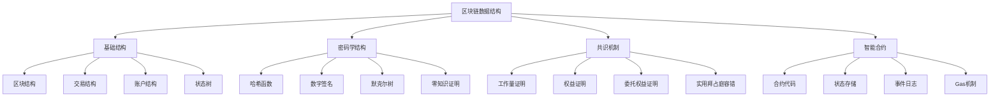

# 区块链数据结构

## 📖 核心概念

**区块链数据结构**是分布式账本技术的核心，通过密码学哈希、默克尔树、共识算法等数据结构实现去中心化的数据存储和验证。区块链数据结构具有不可篡改、去中心化、透明性等特点，是数据结构在金融科技、供应链管理等领域的重要应用。

### 🏗️ 区块链数据结构分类



## 🔧 区块链数据结构实现

### 基础数据结构

```python
import hashlib
import json
import time
from typing import List, Dict, Optional, Any, Tuple
from dataclasses import dataclass, asdict
from abc import ABC, abstractmethod
import ecdsa
import base58

# 交易类
@dataclass
class Transaction:
    sender: str
    receiver: str
    amount: float
    timestamp: float
    signature: Optional[str] = None
    transaction_id: Optional[str] = None
    
    def __post_init__(self):
        if self.timestamp == 0:
            self.timestamp = time.time()
        if self.transaction_id is None:
            self.transaction_id = self._calculate_hash()
    
    def _calculate_hash(self) -> str:
        """计算交易哈希"""
        transaction_string = f"{self.sender}{self.receiver}{self.amount}{self.timestamp}"
        return hashlib.sha256(transaction_string.encode()).hexdigest()
    
    def sign(self, private_key: str):
        """签名交易"""
        transaction_data = f"{self.sender}{self.receiver}{self.amount}{self.timestamp}"
        self.signature = self._sign_data(transaction_data, private_key)
    
    def _sign_data(self, data: str, private_key: str) -> str:
        """签名数据"""
        # 简化的签名实现
        return hashlib.sha256((data + private_key).encode()).hexdigest()
    
    def verify_signature(self) -> bool:
        """验证签名"""
        if not self.signature:
            return False
        
        transaction_data = f"{self.sender}{self.receiver}{self.amount}{self.timestamp}"
        expected_signature = self._sign_data(transaction_data, "public_key")  # 简化实现
        return self.signature == expected_signature
    
    def to_dict(self) -> Dict[str, Any]:
        """转换为字典"""
        return asdict(self)

# 区块类
@dataclass
class Block:
    index: int
    timestamp: float
    transactions: List[Transaction]
    previous_hash: str
    nonce: int = 0
    hash: Optional[str] = None
    merkle_root: Optional[str] = None
    
    def __post_init__(self):
        if self.timestamp == 0:
            self.timestamp = time.time()
        if self.merkle_root is None:
            self.merkle_root = self._calculate_merkle_root()
        if self.hash is None:
            self.hash = self._calculate_hash()
    
    def _calculate_merkle_root(self) -> str:
        """计算默克尔根"""
        if not self.transactions:
            return hashlib.sha256(b"").hexdigest()
        
        transaction_hashes = [tx.transaction_id for tx in self.transactions]
        return self._build_merkle_tree(transaction_hashes)
    
    def _build_merkle_tree(self, hashes: List[str]) -> str:
        """构建默克尔树"""
        if len(hashes) == 1:
            return hashes[0]
        
        if len(hashes) % 2 == 1:
            hashes.append(hashes[-1])  # 复制最后一个哈希
        
        new_hashes = []
        for i in range(0, len(hashes), 2):
            combined = hashes[i] + hashes[i + 1]
            new_hash = hashlib.sha256(combined.encode()).hexdigest()
            new_hashes.append(new_hash)
        
        return self._build_merkle_tree(new_hashes)
    
    def _calculate_hash(self) -> str:
        """计算区块哈希"""
        block_string = f"{self.index}{self.timestamp}{self.merkle_root}{self.previous_hash}{self.nonce}"
        return hashlib.sha256(block_string.encode()).hexdigest()
    
    def mine_block(self, difficulty: int):
        """挖矿"""
        target = "0" * difficulty
        
        while self.hash[:difficulty] != target:
            self.nonce += 1
            self.hash = self._calculate_hash()
    
    def is_valid(self) -> bool:
        """验证区块"""
        # 验证哈希
        if self.hash != self._calculate_hash():
            return False
        
        # 验证交易
        for transaction in self.transactions:
            if not transaction.verify_signature():
                return False
        
        # 验证默克尔根
        if self.merkle_root != self._calculate_merkle_root():
            return False
        
        return True
    
    def to_dict(self) -> Dict[str, Any]:
        """转换为字典"""
        return {
            'index': self.index,
            'timestamp': self.timestamp,
            'transactions': [tx.to_dict() for tx in self.transactions],
            'previous_hash': self.previous_hash,
            'nonce': self.nonce,
            'hash': self.hash,
            'merkle_root': self.merkle_root
        }

# 账户类
@dataclass
class Account:
    address: str
    balance: float
    nonce: int = 0
    
    def __post_init__(self):
        if not self.address:
            self.address = self._generate_address()
    
    def _generate_address(self) -> str:
        """生成地址"""
        # 简化的地址生成
        return hashlib.sha256(str(time.time()).encode()).hexdigest()[:40]
    
    def update_balance(self, amount: float):
        """更新余额"""
        self.balance += amount
    
    def can_spend(self, amount: float) -> bool:
        """检查是否可以花费"""
        return self.balance >= amount
    
    def increment_nonce(self):
        """增加nonce"""
        self.nonce += 1

# 状态树节点
class StateTreeNode:
    def __init__(self, key: str, value: Any = None):
        self.key = key
        self.value = value
        self.left = None
        self.right = None
        self.hash = None
    
    def calculate_hash(self) -> str:
        """计算节点哈希"""
        if self.value is None:
            return hashlib.sha256(self.key.encode()).hexdigest()
        
        value_str = str(self.value) if not isinstance(self.value, str) else self.value
        return hashlib.sha256((self.key + value_str).encode()).hexdigest()
    
    def update_hash(self):
        """更新哈希"""
        self.hash = self.calculate_hash()

# 状态树
class StateTree:
    def __init__(self):
        self.root = None
        self.size = 0
    
    def insert(self, key: str, value: Any):
        """插入键值对"""
        self.root = self._insert_recursive(self.root, key, value)
        self.size += 1
    
    def _insert_recursive(self, node: Optional[StateTreeNode], key: str, value: Any) -> StateTreeNode:
        """递归插入"""
        if node is None:
            new_node = StateTreeNode(key, value)
            new_node.update_hash()
            return new_node
        
        if key < node.key:
            node.left = self._insert_recursive(node.left, key, value)
        elif key > node.key:
            node.right = self._insert_recursive(node.right, key, value)
        else:
            node.value = value
        
        node.update_hash()
        return node
    
    def get(self, key: str) -> Optional[Any]:
        """获取值"""
        return self._get_recursive(self.root, key)
    
    def _get_recursive(self, node: Optional[StateTreeNode], key: str) -> Optional[Any]:
        """递归获取"""
        if node is None:
            return None
        
        if key < node.key:
            return self._get_recursive(node.left, key)
        elif key > node.key:
            return self._get_recursive(node.right, key)
        else:
            return node.value
    
    def get_root_hash(self) -> str:
        """获取根哈希"""
        if self.root is None:
            return hashlib.sha256(b"").hexdigest()
        return self.root.hash
```

### 区块链主类

```python
# 区块链类
class Blockchain:
    def __init__(self):
        self.chain: List[Block] = []
        self.pending_transactions: List[Transaction] = []
        self.accounts: Dict[str, Account] = {}
        self.state_tree = StateTree()
        self.difficulty = 2
        self.mining_reward = 10.0
        
        # 创建创世区块
        self._create_genesis_block()
    
    def _create_genesis_block(self):
        """创建创世区块"""
        genesis_transaction = Transaction(
            sender="0",
            receiver="genesis",
            amount=0,
            timestamp=time.time()
        )
        
        genesis_block = Block(
            index=0,
            timestamp=time.time(),
            transactions=[genesis_transaction],
            previous_hash="0"
        )
        
        self.chain.append(genesis_block)
    
    def add_transaction(self, transaction: Transaction) -> bool:
        """添加交易"""
        if not transaction.verify_signature():
            return False
        
        # 检查发送者余额
        sender_account = self.accounts.get(transaction.sender)
        if sender_account and not sender_account.can_spend(transaction.amount):
            return False
        
        self.pending_transactions.append(transaction)
        return True
    
    def mine_pending_transactions(self, mining_reward_address: str):
        """挖矿待处理交易"""
        if not self.pending_transactions:
            return
        
        # 添加挖矿奖励交易
        reward_transaction = Transaction(
            sender="0",
            receiver=mining_reward_address,
            amount=self.mining_reward,
            timestamp=time.time()
        )
        
        # 创建新区块
        new_block = Block(
            index=len(self.chain),
            timestamp=time.time(),
            transactions=self.pending_transactions + [reward_transaction],
            previous_hash=self.get_latest_block().hash
        )
        
        # 挖矿
        new_block.mine_block(self.difficulty)
        
        # 添加到链
        self.chain.append(new_block)
        
        # 更新账户状态
        self._update_accounts(new_block.transactions)
        
        # 清空待处理交易
        self.pending_transactions = []
    
    def _update_accounts(self, transactions: List[Transaction]):
        """更新账户状态"""
        for transaction in transactions:
            # 更新发送者账户
            if transaction.sender != "0":  # 不是挖矿奖励
                sender_account = self.accounts.get(transaction.sender)
                if sender_account:
                    sender_account.update_balance(-transaction.amount)
                    sender_account.increment_nonce()
                else:
                    sender_account = Account(transaction.sender, 0)
                    sender_account.update_balance(-transaction.amount)
                    sender_account.increment_nonce()
                    self.accounts[transaction.sender] = sender_account
            
            # 更新接收者账户
            receiver_account = self.accounts.get(transaction.receiver)
            if receiver_account:
                receiver_account.update_balance(transaction.amount)
            else:
                receiver_account = Account(transaction.receiver, transaction.amount)
                self.accounts[transaction.receiver] = receiver_account
            
            # 更新状态树
            self.state_tree.insert(transaction.receiver, receiver_account.balance)
            if transaction.sender != "0":
                self.state_tree.insert(transaction.sender, sender_account.balance)
    
    def get_latest_block(self) -> Block:
        """获取最新区块"""
        return self.chain[-1]
    
    def get_balance(self, address: str) -> float:
        """获取账户余额"""
        account = self.accounts.get(address)
        return account.balance if account else 0.0
    
    def is_chain_valid(self) -> bool:
        """验证区块链"""
        for i in range(1, len(self.chain)):
            current_block = self.chain[i]
            previous_block = self.chain[i - 1]
            
            # 验证当前区块
            if not current_block.is_valid():
                return False
            
            # 验证与前一个区块的连接
            if current_block.previous_hash != previous_block.hash:
                return False
        
        return True
    
    def get_chain_info(self) -> Dict[str, Any]:
        """获取区块链信息"""
        return {
            'chain_length': len(self.chain),
            'pending_transactions': len(self.pending_transactions),
            'total_accounts': len(self.accounts),
            'difficulty': self.difficulty,
            'mining_reward': self.mining_reward,
            'state_root': self.state_tree.get_root_hash()
        }
```

### 智能合约结构

```python
# 智能合约类
class SmartContract:
    def __init__(self, address: str, code: str):
        self.address = address
        self.code = code
        self.storage: Dict[str, Any] = {}
        self.balance = 0.0
        self.creator = ""
        self.created_at = time.time()
    
    def execute(self, function_name: str, args: List[Any], caller: str) -> Any:
        """执行合约函数"""
        # 简化的合约执行
        if function_name == "get_balance":
            return self.balance
        elif function_name == "deposit":
            amount = args[0] if args else 0
            self.balance += amount
            return True
        elif function_name == "withdraw":
            amount = args[0] if args else 0
            if self.balance >= amount:
                self.balance -= amount
                return True
            return False
        elif function_name == "set_storage":
            key = args[0] if len(args) > 0 else ""
            value = args[1] if len(args) > 1 else None
            self.storage[key] = value
            return True
        elif function_name == "get_storage":
            key = args[0] if args else ""
            return self.storage.get(key)
        
        return None
    
    def get_storage_hash(self) -> str:
        """获取存储哈希"""
        storage_str = json.dumps(self.storage, sort_keys=True)
        return hashlib.sha256(storage_str.encode()).hexdigest()

# 智能合约管理器
class ContractManager:
    def __init__(self):
        self.contracts: Dict[str, SmartContract] = {}
        self.contract_events: List[Dict[str, Any]] = []
    
    def deploy_contract(self, code: str, creator: str) -> str:
        """部署合约"""
        contract_address = self._generate_contract_address()
        contract = SmartContract(contract_address, code)
        contract.creator = creator
        
        self.contracts[contract_address] = contract
        
        # 记录部署事件
        self.contract_events.append({
            'type': 'contract_deployed',
            'address': contract_address,
            'creator': creator,
            'timestamp': time.time()
        })
        
        return contract_address
    
    def call_contract(self, contract_address: str, function_name: str, 
                     args: List[Any], caller: str) -> Any:
        """调用合约"""
        if contract_address not in self.contracts:
            return None
        
        contract = self.contracts[contract_address]
        result = contract.execute(function_name, args, caller)
        
        # 记录调用事件
        self.contract_events.append({
            'type': 'contract_called',
            'address': contract_address,
            'function': function_name,
            'args': args,
            'caller': caller,
            'result': result,
            'timestamp': time.time()
        })
        
        return result
    
    def _generate_contract_address(self) -> str:
        """生成合约地址"""
        return hashlib.sha256(str(time.time()).encode()).hexdigest()[:40]
    
    def get_contract_events(self, contract_address: str = None) -> List[Dict[str, Any]]:
        """获取合约事件"""
        if contract_address:
            return [event for event in self.contract_events 
                   if event.get('address') == contract_address]
        return self.contract_events
```

### 共识机制

```python
# 共识机制基类
class ConsensusMechanism(ABC):
    def __init__(self):
        self.validators = []
        self.block_time = 10  # 秒
    
    @abstractmethod
    def validate_block(self, block: Block, blockchain: Blockchain) -> bool:
        """验证区块"""
        pass
    
    @abstractmethod
    def select_validator(self) -> str:
        """选择验证者"""
        pass
    
    def add_validator(self, validator_address: str):
        """添加验证者"""
        if validator_address not in self.validators:
            self.validators.append(validator_address)

# 工作量证明
class ProofOfWork(ConsensusMechanism):
    def __init__(self, difficulty: int = 2):
        super().__init__()
        self.difficulty = difficulty
    
    def validate_block(self, block: Block, blockchain: Blockchain) -> bool:
        """验证区块"""
        # 验证工作量证明
        target = "0" * self.difficulty
        if block.hash[:self.difficulty] != target:
            return False
        
        # 验证区块内容
        return block.is_valid()
    
    def select_validator(self) -> str:
        """选择验证者（PoW不需要选择）"""
        return "miner"

# 权益证明
class ProofOfStake(ConsensusMechanism):
    def __init__(self):
        super().__init__()
        self.stakes: Dict[str, float] = {}
    
    def add_stake(self, validator: str, amount: float):
        """添加权益"""
        if validator in self.stakes:
            self.stakes[validator] += amount
        else:
            self.stakes[validator] = amount
    
    def validate_block(self, block: Block, blockchain: Blockchain) -> bool:
        """验证区块"""
        # 验证区块内容
        return block.is_valid()
    
    def select_validator(self) -> str:
        """选择验证者"""
        if not self.stakes:
            return random.choice(self.validators) if self.validators else "validator"
        
        # 根据权益权重选择
        total_stake = sum(self.stakes.values())
        if total_stake == 0:
            return random.choice(self.validators) if self.validators else "validator"
        
        random_value = random.uniform(0, total_stake)
        current_stake = 0
        
        for validator, stake in self.stakes.items():
            current_stake += stake
            if random_value <= current_stake:
                return validator
        
        return list(self.stakes.keys())[-1]

# 实用拜占庭容错
class PBFT(ConsensusMechanism):
    def __init__(self):
        super().__init__()
        self.view_number = 0
        self.sequence_number = 0
        self.prepared = {}
        self.committed = {}
    
    def validate_block(self, block: Block, blockchain: Blockchain) -> bool:
        """验证区块"""
        return block.is_valid()
    
    def select_validator(self) -> str:
        """选择主节点"""
        if not self.validators:
            return "primary"
        
        return self.validators[self.view_number % len(self.validators)]
    
    def prepare_phase(self, block: Block) -> bool:
        """准备阶段"""
        # 简化的PBFT实现
        self.prepared[block.hash] = True
        return True
    
    def commit_phase(self, block: Block) -> bool:
        """提交阶段"""
        if block.hash in self.prepared:
            self.committed[block.hash] = True
            return True
        return False
```

## 🎯 区块链数据结构应用

### 实际应用场景

```python
class BlockchainApplications:
    @staticmethod
    def demonstrate_applications():
        print("区块链数据结构 Applications:")
        print("=========================")
        
        print("1. 数字货币:")
        print("   - 比特币")
        print("   - 以太坊")
        print("   - 其他加密货币")
        
        print("2. 供应链管理:")
        print("   - 产品溯源")
        print("   - 物流跟踪")
        print("   - 质量认证")
        
        print("3. 金融服务:")
        print("   - 跨境支付")
        print("   - 智能合约")
        print("   - 去中心化金融")
        
        print("4. 身份认证:")
        print("   - 数字身份")
        print("   - 证书管理")
        print("   - 访问控制")
    
    @staticmethod
    def analyze_performance():
        print("区块链数据结构 Performance Analysis:")
        print("=================================")
        
        print("1. 数据结构效率:")
        print("   - 哈希计算: O(1)")
        print("   - 默克尔树: O(log n)")
        print("   - 状态树: O(log n)")
        print("   - 区块验证: O(n)")
        print()
        
        print("2. 共识机制:")
        print("   - 工作量证明: 高能耗")
        print("   - 权益证明: 低能耗")
        print("   - PBFT: 快速确认")
        print("   - 委托权益证明: 平衡")
        print()
        
        print("3. 扩展性:")
        print("   - 分片技术: 提高吞吐量")
        print("   - 侧链技术: 扩展功能")
        print("   - 状态通道: 减少链上交易")
        print("   - 跨链技术: 互操作性")
    
    @staticmethod
    def select_blockchain_strategy(use_case, performance_requirements, security_requirements):
        print("Blockchain Strategy Selection:")
        print("============================")
        
        print(f"Use case: {use_case}")
        print(f"Performance requirements: {performance_requirements}")
        print(f"Security requirements: {security_requirements}")
        
        print("Recommendation:")
        
        if use_case == "cryptocurrency" and security_requirements == "high":
            print("Use Proof of Work with Bitcoin-like structure")
        elif use_case == "smart_contracts" and performance_requirements == "medium":
            print("Use Proof of Stake with Ethereum-like structure")
        elif use_case == "enterprise" and performance_requirements == "high":
            print("Use PBFT with permissioned blockchain")
        elif use_case == "supply_chain":
            print("Use Proof of Authority with custom consensus")
        else:
            print("Evaluate specific requirements and choose appropriate consensus mechanism")
```

## 📊 区块链数据结构分析

### 性能分析

```python
class BlockchainAnalysis:
    @staticmethod
    def analyze_performance():
        print("区块链数据结构 Performance Analysis:")
        print("=================================")
        
        print("1. 时间复杂度:")
        print("   - 交易验证: O(1)")
        print("   - 区块创建: O(n)")
        print("   - 链验证: O(m)")
        print("   - 状态更新: O(log n)")
        print()
        
        print("2. 空间复杂度:")
        print("   - 区块存储: O(n)")
        print("   - 状态存储: O(n)")
        print("   - 交易存储: O(n)")
        print("   - 索引存储: O(n)")
        print()
        
        print("3. 网络效率:")
        print("   - 广播延迟: O(log n)")
        print("   - 同步时间: O(n)")
        print("   - 存储需求: O(n)")
        print("   - 带宽使用: O(n)")
    
    @staticmethod
    def analyze_security():
        print("区块链数据结构 Security Analysis:")
        print("===============================")
        
        print("1. 密码学安全:")
        print("   - 哈希函数: 抗碰撞")
        print("   - 数字签名: 身份验证")
        print("   - 默克尔树: 数据完整性")
        print("   - 零知识证明: 隐私保护")
        print()
        
        print("2. 共识安全:")
        print("   - 51%攻击: 防止双花")
        print("   - 长程攻击: 检查点机制")
        print("   - 自私挖矿: 激励机制")
        print("   - 女巫攻击: 身份验证")
        print()
        
        print("3. 经济安全:")
        print("   - 激励机制: 鼓励诚实行为")
        print("   - 惩罚机制: 防止恶意行为")
        print("   - 经济模型: 可持续发展")
        print("   - 治理机制: 协议升级")
    
    @staticmethod
    def analyze_scalability():
        print("区块链数据结构 Scalability Analysis:")
        print("=================================")
        
        print("1. 吞吐量扩展:")
        print("   - 分片技术: 并行处理")
        print("   - 侧链技术: 功能扩展")
        print("   - 状态通道: 链下交易")
        print("   - 跨链技术: 互操作性")
        print()
        
        print("2. 存储扩展:")
        print("   - 数据压缩: 减少存储")
        print("   - 数据归档: 历史数据")
        print("   - 分布式存储: IPFS")
        print("   - 轻节点: 部分同步")
        print()
        
        print("3. 网络扩展:")
        print("   - 网络拓扑: 优化连接")
        print("   - 路由算法: 减少延迟")
        print("   - 缓存机制: 提高效率")
        print("   - 负载均衡: 分散压力")
```

## 🎮 区块链数据结构测试

### 1. 基础功能测试

```python
def test_blockchain_basics():
    print("Testing Blockchain Basics:")
    print("========================")
    
    # 创建区块链
    blockchain = Blockchain()
    
    # 创建账户
    alice = Account("alice", 100.0)
    bob = Account("bob", 50.0)
    
    blockchain.accounts["alice"] = alice
    blockchain.accounts["bob"] = bob
    
    print(f"Alice balance: {blockchain.get_balance('alice')}")
    print(f"Bob balance: {blockchain.get_balance('bob')}")
    
    # 创建交易
    transaction = Transaction(
        sender="alice",
        receiver="bob",
        amount=25.0,
        timestamp=time.time()
    )
    transaction.sign("alice_private_key")
    
    # 添加交易
    success = blockchain.add_transaction(transaction)
    print(f"Transaction added: {success}")
    
    # 挖矿
    blockchain.mine_pending_transactions("miner")
    
    print(f"Alice balance after: {blockchain.get_balance('alice')}")
    print(f"Bob balance after: {blockchain.get_balance('bob')}")
    print(f"Chain length: {len(blockchain.chain)}")
    
    # 验证链
    is_valid = blockchain.is_chain_valid()
    print(f"Chain is valid: {is_valid}")

def test_merkle_tree():
    print("\nTesting Merkle Tree:")
    print("==================")
    
    # 创建交易
    transactions = [
        Transaction("alice", "bob", 10.0, time.time()),
        Transaction("bob", "charlie", 5.0, time.time()),
        Transaction("charlie", "alice", 3.0, time.time()),
        Transaction("alice", "david", 7.0, time.time())
    ]
    
    # 创建区块
    block = Block(
        index=1,
        timestamp=time.time(),
        transactions=transactions,
        previous_hash="0"
    )
    
    print(f"Merkle root: {block.merkle_root}")
    print(f"Block hash: {block.hash}")
    print(f"Block is valid: {block.is_valid()}")

def test_smart_contracts():
    print("\nTesting Smart Contracts:")
    print("======================")
    
    # 创建合约管理器
    contract_manager = ContractManager()
    
    # 部署合约
    contract_code = """
    contract SimpleBank {
        mapping(address => uint) balances;
        
        function deposit() public payable {
            balances[msg.sender] += msg.value;
        }
        
        function withdraw(uint amount) public {
            require(balances[msg.sender] >= amount);
            balances[msg.sender] -= amount;
        }
        
        function getBalance() public view returns (uint) {
            return balances[msg.sender];
        }
    }
    """
    
    contract_address = contract_manager.deploy_contract(contract_code, "deployer")
    print(f"Contract deployed at: {contract_address}")
    
    # 调用合约
    result = contract_manager.call_contract(contract_address, "deposit", [100], "user1")
    print(f"Deposit result: {result}")
    
    balance = contract_manager.call_contract(contract_address, "get_balance", [], "user1")
    print(f"Balance: {balance}")
    
    # 获取事件
    events = contract_manager.get_contract_events(contract_address)
    print(f"Contract events: {len(events)}")

def test_consensus_mechanisms():
    print("\nTesting Consensus Mechanisms:")
    print("===========================")
    
    # 测试工作量证明
    print("Proof of Work:")
    pow_consensus = ProofOfWork(difficulty=2)
    block = Block(1, time.time(), [], "0")
    block.mine_block(2)
    is_valid = pow_consensus.validate_block(block, None)
    print(f"PoW block valid: {is_valid}")
    
    # 测试权益证明
    print("\nProof of Stake:")
    pos_consensus = ProofOfStake()
    pos_consensus.add_validator("validator1")
    pos_consensus.add_validator("validator2")
    pos_consensus.add_stake("validator1", 100.0)
    pos_consensus.add_stake("validator2", 200.0)
    
    selected = pos_consensus.select_validator()
    print(f"Selected validator: {selected}")
    
    # 测试PBFT
    print("\nPBFT:")
    pbft_consensus = PBFT()
    pbft_consensus.add_validator("validator1")
    pbft_consensus.add_validator("validator2")
    pbft_consensus.add_validator("validator3")
    
    block = Block(1, time.time(), [], "0")
    prepared = pbft_consensus.prepare_phase(block)
    committed = pbft_consensus.commit_phase(block)
    print(f"PBFT prepared: {prepared}, committed: {committed}")

def test_applications():
    print("Testing Applications:")
    print("==================")
    
    BlockchainApplications.demonstrate_applications()
    BlockchainApplications.analyze_performance()
    BlockchainApplications.select_blockchain_strategy("smart_contracts", "medium", "high")

def test_analysis():
    print("Testing Analysis:")
    print("===============")
    
    BlockchainAnalysis.analyze_performance()
    BlockchainAnalysis.analyze_security()
    BlockchainAnalysis.analyze_scalability()

# 主测试函数
def main():
    test_blockchain_basics()
    test_merkle_tree()
    test_smart_contracts()
    test_consensus_mechanisms()
    test_applications()
    test_analysis()

if __name__ == "__main__":
    main()
```

## 🔗 相关链接

- [[01-并行算法|并行算法]]
- [[02-量子计算与算法|量子计算与算法]]
- [[03-机器学习算法|机器学习算法]]

## 💡 区块链数据结构要点

1. **数据结构设计**: 合理设计区块、交易、账户等核心数据结构
2. **密码学安全**: 使用哈希函数、数字签名等保证安全性
3. **共识机制**: 选择合适的共识算法保证一致性
4. **性能优化**: 通过分片、侧链等技术提高扩展性

---

*📝 区块链数据结构提示：区块链是分布式系统的重要应用，需要综合考虑数据结构、密码学、共识机制和性能优化*
