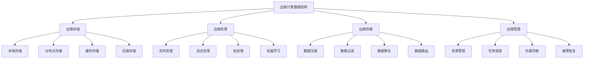

# 边缘计算数据结构

## 📖 核心概念

**边缘计算数据结构**是边缘计算环境中的数据结构设计，通过优化数据存储、处理、传输等环节，实现低延迟、高可靠、低功耗的边缘计算应用。边缘计算数据结构是现代物联网和5G应用的重要技术基础。

### 🏗️ 边缘计算数据结构的组成要素



## 🔍 边缘计算数据结构分类

### 数据结构类型

| 结构类型 | 特点 | 优势 | 劣势 | 适用场景 |
|----------|------|------|------|----------|
| **本地存储** | 设备存储 | 低延迟 | 容量有限 | 传感器数据 |
| **分布式存储** | 多节点存储 | 高可靠 | 复杂度高 | 边缘集群 |
| **流式处理** | 实时处理 | 低延迟 | 内存消耗 | 实时应用 |
| **边缘缓存** | 缓存机制 | 快速访问 | 一致性难 | 热点数据 |

## 💻 边缘计算数据结构实现

### 边缘存储系统

```cpp
// 边缘存储系统
class EdgeStorageSystem {
private:
    struct EdgeNode {
        string nodeId;
        string location;
        size_t storageCapacity;
        size_t usedStorage;
        double cpuUsage;
        double memoryUsage;
        bool isOnline;
        
        EdgeNode(const string& id, const string& loc, size_t capacity) 
            : nodeId(id), location(loc), storageCapacity(capacity), usedStorage(0), 
              cpuUsage(0), memoryUsage(0), isOnline(true) {}
        
        double getStorageUtilization() const {
            return storageCapacity > 0 ? (double)usedStorage / storageCapacity : 0;
        }
    };
    
    struct DataChunk {
        string chunkId;
        string data;
        string nodeId;
        uint64_t timestamp;
        int replicationFactor;
        vector<string> replicaNodes;
        
        DataChunk(const string& id, const string& d, const string& node) 
            : chunkId(id), data(d), nodeId(node), timestamp(0), replicationFactor(1) {
            timestamp = chrono::duration_cast<chrono::milliseconds>(
                chrono::system_clock::now().time_since_epoch()).count();
        }
    };
    
    map<string, EdgeNode> edgeNodes;
    map<string, DataChunk> dataChunks;
    mutex storageMutex;
    
    int defaultReplicationFactor;
    
public:
    EdgeStorageSystem(int replicationFactor = 2) 
        : defaultReplicationFactor(replicationFactor) {}
    
    // 添加边缘节点
    void addEdgeNode(const string& nodeId, const string& location, size_t storageCapacity) {
        lock_guard<mutex> lock(storageMutex);
        
        edgeNodes[nodeId] = EdgeNode(nodeId, location, storageCapacity);
        cout << "Edge node added: " << nodeId << " at " << location << " (" << storageCapacity << " MB)" << endl;
    }
    
    // 移除边缘节点
    void removeEdgeNode(const string& nodeId) {
        lock_guard<mutex> lock(storageMutex);
        
        auto it = edgeNodes.find(nodeId);
        if (it != edgeNodes.end()) {
            // 迁移数据到其他节点
            migrateDataFromNode(nodeId);
            edgeNodes.erase(it);
            cout << "Edge node removed: " << nodeId << endl;
        }
    }
    
    // 存储数据
    bool storeData(const string& key, const string& data) {
        lock_guard<mutex> lock(storageMutex);
        
        // 选择存储节点
        vector<string> selectedNodes = selectStorageNodes(defaultReplicationFactor);
        if (selectedNodes.empty()) {
            cout << "No available edge nodes for storage" << endl;
            return false;
        }
        
        // 创建数据块
        string chunkId = generateChunkId(key);
        DataChunk chunk(chunkId, data, selectedNodes[0]);
        chunk.replicationFactor = defaultReplicationFactor;
        chunk.replicaNodes = selectedNodes;
        
        dataChunks[chunkId] = chunk;
        
        // 更新节点存储使用量
        for (const string& nodeId : selectedNodes) {
            auto it = edgeNodes.find(nodeId);
            if (it != edgeNodes.end()) {
                it->second.usedStorage += data.length();
            }
        }
        
        cout << "Data stored: " << key << " -> " << chunkId << " on " << selectedNodes.size() << " nodes" << endl;
        return true;
    }
    
    // 读取数据
    string readData(const string& key) {
        lock_guard<mutex> lock(storageMutex);
        
        string chunkId = generateChunkId(key);
        auto it = dataChunks.find(chunkId);
        if (it == dataChunks.end()) {
            cout << "Data not found: " << key << endl;
            return "";
        }
        
        DataChunk& chunk = it->second;
        
        // 尝试从第一个可用节点读取
        for (const string& nodeId : chunk.replicaNodes) {
            auto nodeIt = edgeNodes.find(nodeId);
            if (nodeIt != edgeNodes.end() && nodeIt->second.isOnline) {
                cout << "Data read: " << key << " from node " << nodeId << endl;
                return chunk.data;
            }
        }
        
        cout << "No available replica for: " << key << endl;
        return "";
    }
    
    // 删除数据
    bool deleteData(const string& key) {
        lock_guard<mutex> lock(storageMutex);
        
        string chunkId = generateChunkId(key);
        auto it = dataChunks.find(chunkId);
        if (it == dataChunks.end()) {
            cout << "Data not found: " << key << endl;
            return false;
        }
        
        DataChunk& chunk = it->second;
        
        // 从所有副本节点删除
        for (const string& nodeId : chunk.replicaNodes) {
            auto nodeIt = edgeNodes.find(nodeId);
            if (nodeIt != edgeNodes.end()) {
                nodeIt->second.usedStorage -= chunk.data.length();
            }
        }
        
        dataChunks.erase(it);
        cout << "Data deleted: " << key << endl;
        return true;
    }
    
private:
    // 选择存储节点
    vector<string> selectStorageNodes(int count) {
        vector<string> availableNodes;
        
        for (const auto& [nodeId, node] : edgeNodes) {
            if (node.isOnline && node.getStorageUtilization() < 0.8) {
                availableNodes.push_back(nodeId);
            }
        }
        
        if (availableNodes.size() < count) {
            return {};
        }
        
        // 简单的节点选择策略
        vector<string> selected;
        for (int i = 0; i < count; i++) {
            selected.push_back(availableNodes[i % availableNodes.size()]);
        }
        
        return selected;
    }
    
    // 迁移数据
    void migrateDataFromNode(const string& nodeId) {
        for (auto& [chunkId, chunk] : dataChunks) {
            auto it = find(chunk.replicaNodes.begin(), chunk.replicaNodes.end(), nodeId);
            if (it != chunk.replicaNodes.end()) {
                // 选择新的存储节点
                vector<string> newNodes = selectStorageNodes(1);
                if (!newNodes.empty()) {
                    *it = newNodes[0];
                    cout << "Data migrated: " << chunkId << " from " << nodeId << " to " << newNodes[0] << endl;
                }
            }
        }
    }
    
    // 生成块ID
    string generateChunkId(const string& key) {
        hash<string> hasher;
        return "chunk_" + to_string(hasher(key));
    }
    
public:
    // 获取存储统计信息
    struct EdgeStorageStatistics {
        int totalNodes;
        int onlineNodes;
        int totalChunks;
        size_t totalCapacity;
        size_t usedStorage;
        double utilization;
    };
    
    EdgeStorageStatistics getStatistics() {
        lock_guard<mutex> lock(storageMutex);
        
        EdgeStorageStatistics stats;
        stats.totalNodes = edgeNodes.size();
        stats.onlineNodes = 0;
        stats.totalChunks = dataChunks.size();
        stats.totalCapacity = 0;
        stats.usedStorage = 0;
        
        for (const auto& [nodeId, node] : edgeNodes) {
            if (node.isOnline) {
                stats.onlineNodes++;
            }
            stats.totalCapacity += node.storageCapacity;
            stats.usedStorage += node.usedStorage;
        }
        
        if (stats.totalCapacity > 0) {
            stats.utilization = (double)stats.usedStorage / stats.totalCapacity;
        }
        
        return stats;
    }
};
```

### 边缘处理系统

```cpp
// 边缘处理系统
class EdgeProcessingSystem {
private:
    struct ProcessingTask {
        string taskId;
        string taskType;
        string inputData;
        string outputData;
        TaskStatus status;
        string assignedNode;
        uint64_t priority;
        chrono::system_clock::time_point submitTime;
        
        ProcessingTask(const string& id, const string& type, const string& input, uint64_t prio) 
            : taskId(id), taskType(type), inputData(input), status(TaskStatus::PENDING), priority(prio) {
            submitTime = chrono::system_clock::now();
        }
    };
    
    enum class TaskStatus {
        PENDING,
        RUNNING,
        COMPLETED,
        FAILED
    };
    
    struct EdgeProcessor {
        string processorId;
        string location;
        int cores;
        int memory;
        double cpuUsage;
        double memoryUsage;
        bool isOnline;
        int currentTasks;
        
        EdgeProcessor(const string& id, const string& loc, int c, int m) 
            : processorId(id), location(loc), cores(c), memory(m), cpuUsage(0), memoryUsage(0), 
              isOnline(true), currentTasks(0) {}
        
        double getLoad() const {
            return cores > 0 ? (double)currentTasks / cores : 0;
        }
    };
    
    map<string, EdgeProcessor> processors;
    priority_queue<ProcessingTask> taskQueue;
    map<string, ProcessingTask> runningTasks;
    mutex processingMutex;
    
    thread taskScheduler;
    atomic<bool> isRunning;
    
public:
    EdgeProcessingSystem() : isRunning(false) {}
    
    ~EdgeProcessingSystem() {
        stop();
    }
    
    // 启动处理系统
    void start() {
        isRunning = true;
        taskScheduler = thread(&EdgeProcessingSystem::taskSchedulingLoop, this);
        cout << "Edge processing system started" << endl;
    }
    
    // 停止处理系统
    void stop() {
        isRunning = false;
        if (taskScheduler.joinable()) {
            taskScheduler.join();
        }
        cout << "Edge processing system stopped" << endl;
    }
    
    // 添加边缘处理器
    void addEdgeProcessor(const string& processorId, const string& location, int cores, int memory) {
        lock_guard<mutex> lock(processingMutex);
        
        processors[processorId] = EdgeProcessor(processorId, location, cores, memory);
        cout << "Edge processor added: " << processorId << " at " << location << " (" << cores << " cores, " << memory << " MB)" << endl;
    }
    
    // 移除边缘处理器
    void removeEdgeProcessor(const string& processorId) {
        lock_guard<mutex> lock(processingMutex);
        
        auto it = processors.find(processorId);
        if (it != processors.end()) {
            // 迁移任务到其他处理器
            migrateTasksFromProcessor(processorId);
            processors.erase(it);
            cout << "Edge processor removed: " << processorId << endl;
        }
    }
    
    // 提交处理任务
    string submitTask(const string& taskType, const string& inputData, uint64_t priority = 1) {
        string taskId = generateTaskId();
        ProcessingTask task(taskId, taskType, inputData, priority);
        
        {
            lock_guard<mutex> lock(processingMutex);
            taskQueue.push(task);
        }
        
        cout << "Task submitted: " << taskId << " (" << taskType << ", priority: " << priority << ")" << endl;
        return taskId;
    }
    
    // 获取任务结果
    string getTaskResult(const string& taskId) {
        lock_guard<mutex> lock(processingMutex);
        
        auto it = runningTasks.find(taskId);
        if (it != runningTasks.end()) {
            if (it->second.status == TaskStatus::COMPLETED) {
                return it->second.outputData;
            } else if (it->second.status == TaskStatus::FAILED) {
                return "Task failed: " + taskId;
            }
        }
        
        return "Task not found or still running: " + taskId;
    }
    
private:
    // 任务调度循环
    void taskSchedulingLoop() {
        while (isRunning) {
            if (!taskQueue.empty()) {
                ProcessingTask task = taskQueue.top();
                taskQueue.pop();
                
                // 选择处理器
                string selectedProcessor = selectProcessor();
                if (!selectedProcessor.empty()) {
                    // 分配任务
                    assignTask(task, selectedProcessor);
                } else {
                    // 没有可用处理器，重新加入队列
                    taskQueue.push(task);
                }
            }
            
            // 检查运行中的任务
            checkRunningTasks();
            
            this_thread::sleep_for(chrono::milliseconds(100));
        }
    }
    
    // 选择处理器
    string selectProcessor() {
        lock_guard<mutex> lock(processingMutex);
        
        string selectedProcessor;
        double minLoad = 1.0;
        
        for (const auto& [processorId, processor] : processors) {
            if (processor.isOnline && processor.getLoad() < minLoad) {
                minLoad = processor.getLoad();
                selectedProcessor = processorId;
            }
        }
        
        return selectedProcessor;
    }
    
    // 分配任务
    void assignTask(ProcessingTask& task, const string& processorId) {
        lock_guard<mutex> lock(processingMutex);
        
        auto it = processors.find(processorId);
        if (it != processors.end()) {
            task.status = TaskStatus::RUNNING;
            task.assignedNode = processorId;
            it->second.currentTasks++;
            
            runningTasks[task.taskId] = task;
            
            cout << "Task assigned: " << task.taskId << " to processor " << processorId << endl;
            
            // 模拟任务执行
            thread([this, taskId = task.taskId]() {
                this_thread::sleep_for(chrono::seconds(1));
                completeTask(taskId);
            }).detach();
        }
    }
    
    // 完成任务
    void completeTask(const string& taskId) {
        lock_guard<mutex> lock(processingMutex);
        
        auto it = runningTasks.find(taskId);
        if (it != runningTasks.end()) {
            ProcessingTask& task = it->second;
            task.status = TaskStatus::COMPLETED;
            task.outputData = "Result for " + task.taskId;
            
            // 释放处理器资源
            auto processorIt = processors.find(task.assignedNode);
            if (processorIt != processors.end()) {
                processorIt->second.currentTasks--;
            }
            
            cout << "Task completed: " << taskId << endl;
        }
    }
    
    // 检查运行中的任务
    void checkRunningTasks() {
        lock_guard<mutex> lock(processingMutex);
        
        auto it = runningTasks.begin();
        while (it != runningTasks.end()) {
            auto now = chrono::system_clock::now();
            auto duration = chrono::duration_cast<chrono::seconds>(now - it->second.submitTime);
            
            if (duration.count() > 30) { // 超时
                it->second.status = TaskStatus::FAILED;
                cout << "Task timeout: " << it->first << endl;
            }
            
            it++;
        }
    }
    
    // 迁移任务
    void migrateTasksFromProcessor(const string& processorId) {
        for (auto& [taskId, task] : runningTasks) {
            if (task.assignedNode == processorId) {
                // 选择新的处理器
                string newProcessor = selectProcessor();
                if (!newProcessor.empty()) {
                    task.assignedNode = newProcessor;
                    cout << "Task migrated: " << taskId << " to processor " << newProcessor << endl;
                }
            }
        }
    }
    
    // 生成任务ID
    string generateTaskId() {
        static int counter = 0;
        return "task_" + to_string(++counter);
    }
    
public:
    // 获取处理统计信息
    struct EdgeProcessingStatistics {
        int totalProcessors;
        int onlineProcessors;
        int queuedTasks;
        int runningTasks;
        int completedTasks;
        double averageLoad;
    };
    
    EdgeProcessingStatistics getStatistics() {
        lock_guard<mutex> lock(processingMutex);
        
        EdgeProcessingStatistics stats;
        stats.totalProcessors = processors.size();
        stats.onlineProcessors = 0;
        stats.queuedTasks = taskQueue.size();
        stats.runningTasks = 0;
        stats.completedTasks = 0;
        stats.averageLoad = 0;
        
        double totalLoad = 0;
        
        for (const auto& [processorId, processor] : processors) {
            if (processor.isOnline) {
                stats.onlineProcessors++;
                totalLoad += processor.getLoad();
            }
        }
        
        for (const auto& [taskId, task] : runningTasks) {
            if (task.status == TaskStatus::RUNNING) {
                stats.runningTasks++;
            } else if (task.status == TaskStatus::COMPLETED) {
                stats.completedTasks++;
            }
        }
        
        if (stats.onlineProcessors > 0) {
            stats.averageLoad = totalLoad / stats.onlineProcessors;
        }
        
        return stats;
    }
};
```

### 边缘传输系统

```cpp
// 边缘传输系统
class EdgeTransmissionSystem {
private:
    struct TransmissionChannel {
        string channelId;
        string sourceNode;
        string destinationNode;
        int bandwidth;
        int latency;
        bool isActive;
        
        TransmissionChannel(const string& id, const string& src, const string& dst, int bw, int lat) 
            : channelId(id), sourceNode(src), destinationNode(dst), bandwidth(bw), latency(lat), isActive(true) {}
        
        double getTransmissionTime(size_t dataSize) const {
            return bandwidth > 0 ? (double)dataSize / bandwidth : 0;
        }
    };
    
    struct DataPacket {
        string packetId;
        string sourceNode;
        string destinationNode;
        string data;
        uint64_t timestamp;
        int priority;
        
        DataPacket(const string& id, const string& src, const string& dst, const string& d, int prio) 
            : packetId(id), sourceNode(src), destinationNode(dst), data(d), priority(prio) {
            timestamp = chrono::duration_cast<chrono::milliseconds>(
                chrono::system_clock::now().time_since_epoch()).count();
        }
    };
    
    map<string, TransmissionChannel> channels;
    queue<DataPacket> transmissionQueue;
    map<string, DataPacket> transmittedPackets;
    mutex transmissionMutex;
    
    thread transmissionThread;
    atomic<bool> isRunning;
    
public:
    EdgeTransmissionSystem() : isRunning(false) {}
    
    ~EdgeTransmissionSystem() {
        stop();
    }
    
    // 启动传输系统
    void start() {
        isRunning = true;
        transmissionThread = thread(&EdgeTransmissionSystem::transmissionLoop, this);
        cout << "Edge transmission system started" << endl;
    }
    
    // 停止传输系统
    void stop() {
        isRunning = false;
        if (transmissionThread.joinable()) {
            transmissionThread.join();
        }
        cout << "Edge transmission system stopped" << endl;
    }
    
    // 添加传输通道
    void addTransmissionChannel(const string& channelId, const string& sourceNode, 
                               const string& destinationNode, int bandwidth, int latency) {
        lock_guard<mutex> lock(transmissionMutex);
        
        channels[channelId] = TransmissionChannel(channelId, sourceNode, destinationNode, bandwidth, latency);
        cout << "Transmission channel added: " << channelId << " (" << sourceNode << " -> " << destinationNode << ")" << endl;
    }
    
    // 移除传输通道
    void removeTransmissionChannel(const string& channelId) {
        lock_guard<mutex> lock(transmissionMutex);
        
        auto it = channels.find(channelId);
        if (it != channels.end()) {
            channels.erase(it);
            cout << "Transmission channel removed: " << channelId << endl;
        }
    }
    
    // 发送数据包
    bool sendDataPacket(const string& sourceNode, const string& destinationNode, 
                       const string& data, int priority = 1) {
        string packetId = generatePacketId();
        DataPacket packet(packetId, sourceNode, destinationNode, data, priority);
        
        {
            lock_guard<mutex> lock(transmissionMutex);
            transmissionQueue.push(packet);
        }
        
        cout << "Data packet queued: " << packetId << " (" << sourceNode << " -> " << destinationNode << ")" << endl;
        return true;
    }
    
    // 接收数据包
    string receiveDataPacket(const string& destinationNode) {
        lock_guard<mutex> lock(transmissionMutex);
        
        for (const auto& [packetId, packet] : transmittedPackets) {
            if (packet.destinationNode == destinationNode) {
                cout << "Data packet received: " << packetId << " at " << destinationNode << endl;
                return packet.data;
            }
        }
        
        return "";
    }
    
private:
    // 传输循环
    void transmissionLoop() {
        while (isRunning) {
            if (!transmissionQueue.empty()) {
                DataPacket packet = transmissionQueue.front();
                transmissionQueue.pop();
                
                // 选择传输通道
                string selectedChannel = selectTransmissionChannel(packet.sourceNode, packet.destinationNode);
                if (!selectedChannel.empty()) {
                    // 传输数据包
                    transmitPacket(packet, selectedChannel);
                } else {
                    // 没有可用通道，重新加入队列
                    transmissionQueue.push(packet);
                }
            }
            
            this_thread::sleep_for(chrono::milliseconds(100));
        }
    }
    
    // 选择传输通道
    string selectTransmissionChannel(const string& sourceNode, const string& destinationNode) {
        lock_guard<mutex> lock(transmissionMutex);
        
        string selectedChannel;
        int minLatency = INT_MAX;
        
        for (const auto& [channelId, channel] : channels) {
            if (channel.isActive && channel.sourceNode == sourceNode && 
                channel.destinationNode == destinationNode && channel.latency < minLatency) {
                minLatency = channel.latency;
                selectedChannel = channelId;
            }
        }
        
        return selectedChannel;
    }
    
    // 传输数据包
    void transmitPacket(const DataPacket& packet, const string& channelId) {
        lock_guard<mutex> lock(transmissionMutex);
        
        auto it = channels.find(channelId);
        if (it != channels.end()) {
            TransmissionChannel& channel = it->second;
            
            // 计算传输时间
            double transmissionTime = channel.getTransmissionTime(packet.data.length());
            
            // 模拟传输延迟
            this_thread::sleep_for(chrono::milliseconds((int)transmissionTime));
            
            // 标记为已传输
            transmittedPackets[packet.packetId] = packet;
            
            cout << "Data packet transmitted: " << packet.packetId << " via " << channelId 
                 << " (time: " << transmissionTime << " ms)" << endl;
        }
    }
    
    // 生成数据包ID
    string generatePacketId() {
        static int counter = 0;
        return "packet_" + to_string(++counter);
    }
    
public:
    // 获取传输统计信息
    struct EdgeTransmissionStatistics {
        int totalChannels;
        int activeChannels;
        int queuedPackets;
        int transmittedPackets;
        double averageLatency;
    };
    
    EdgeTransmissionStatistics getStatistics() {
        lock_guard<mutex> lock(transmissionMutex);
        
        EdgeTransmissionStatistics stats;
        stats.totalChannels = channels.size();
        stats.activeChannels = 0;
        stats.queuedPackets = transmissionQueue.size();
        stats.transmittedPackets = transmittedPackets.size();
        stats.averageLatency = 0;
        
        double totalLatency = 0;
        
        for (const auto& [channelId, channel] : channels) {
            if (channel.isActive) {
                stats.activeChannels++;
                totalLatency += channel.latency;
            }
        }
        
        if (stats.activeChannels > 0) {
            stats.averageLatency = totalLatency / stats.activeChannels;
        }
        
        return stats;
    }
};
```

### 边缘计算数据结构测试

```cpp
// 边缘计算数据结构测试
class EdgeComputingDataStructureTest {
public:
    static void runAllTests() {
        cout << "=== Edge Computing Data Structure Tests ===" << endl;
        
        // 测试边缘存储
        testEdgeStorage();
        
        cout << "\n" << string(50, '=') << endl;
        
        // 测试边缘处理
        testEdgeProcessing();
        
        cout << "\n" << string(50, '=') << endl;
        
        // 测试边缘传输
        testEdgeTransmission();
    }
    
private:
    static void testEdgeStorage() {
        cout << "=== Edge Storage Test ===" << endl;
        
        EdgeStorageSystem ess;
        
        // 添加边缘节点
        ess.addEdgeNode("node1", "location1", 1024); // 1GB
        ess.addEdgeNode("node2", "location2", 2048); // 2GB
        ess.addEdgeNode("node3", "location3", 1024); // 1GB
        
        // 存储数据
        ess.storeData("key1", "Hello, Edge Storage!");
        ess.storeData("key2", "This is edge computing data");
        ess.storeData("key3", "Edge storage is efficient");
        
        // 读取数据
        string value1 = ess.readData("key1");
        string value2 = ess.readData("key2");
        string value3 = ess.readData("key3");
        
        cout << "Retrieved values: " << value1 << ", " << value2 << ", " << value3 << endl;
        
        // 删除数据
        ess.deleteData("key1");
        
        // 获取统计信息
        auto stats = ess.getStatistics();
        cout << "\nEdge storage statistics:" << endl;
        cout << "Total nodes: " << stats.totalNodes << endl;
        cout << "Online nodes: " << stats.onlineNodes << endl;
        cout << "Total chunks: " << stats.totalChunks << endl;
        cout << "Utilization: " << stats.utilization << endl;
        
        cout << "Edge storage test completed" << endl;
    }
    
    static void testEdgeProcessing() {
        cout << "=== Edge Processing Test ===" << endl;
        
        EdgeProcessingSystem eps;
        
        // 启动处理系统
        eps.start();
        
        // 添加边缘处理器
        eps.addEdgeProcessor("proc1", "location1", 4, 8192); // 4 cores, 8GB
        eps.addEdgeProcessor("proc2", "location2", 8, 16384); // 8 cores, 16GB
        eps.addEdgeProcessor("proc3", "location3", 2, 4096); // 2 cores, 4GB
        
        // 提交处理任务
        string task1 = eps.submitTask("image_processing", "image_data1", 1);
        string task2 = eps.submitTask("data_analysis", "analysis_data1", 2);
        string task3 = eps.submitTask("machine_learning", "ml_data1", 3);
        
        cout << "Tasks submitted: " << task1 << ", " << task2 << ", " << task3 << endl;
        
        // 等待任务完成
        this_thread::sleep_for(chrono::seconds(2));
        
        // 获取任务结果
        string result1 = eps.getTaskResult(task1);
        string result2 = eps.getTaskResult(task2);
        string result3 = eps.getTaskResult(task3);
        
        cout << "Task results: " << result1 << ", " << result2 << ", " << result3 << endl;
        
        // 获取统计信息
        auto stats = eps.getStatistics();
        cout << "\nEdge processing statistics:" << endl;
        cout << "Total processors: " << stats.totalProcessors << endl;
        cout << "Online processors: " << stats.onlineProcessors << endl;
        cout << "Queued tasks: " << stats.queuedTasks << endl;
        cout << "Running tasks: " << stats.runningTasks << endl;
        cout << "Completed tasks: " << stats.completedTasks << endl;
        cout << "Average load: " << stats.averageLoad << endl;
        
        // 停止处理系统
        eps.stop();
        
        cout << "Edge processing test completed" << endl;
    }
    
    static void testEdgeTransmission() {
        cout << "=== Edge Transmission Test ===" << endl;
        
        EdgeTransmissionSystem ets;
        
        // 启动传输系统
        ets.start();
        
        // 添加传输通道
        ets.addTransmissionChannel("channel1", "node1", "node2", 1000, 10); // 1Gbps, 10ms
        ets.addTransmissionChannel("channel2", "node2", "node3", 500, 20); // 500Mbps, 20ms
        ets.addTransmissionChannel("channel3", "node1", "node3", 2000, 5); // 2Gbps, 5ms
        
        // 发送数据包
        ets.sendDataPacket("node1", "node2", "Hello from node1 to node2", 1);
        ets.sendDataPacket("node2", "node3", "Hello from node2 to node3", 2);
        ets.sendDataPacket("node1", "node3", "Hello from node1 to node3", 3);
        
        // 等待传输完成
        this_thread::sleep_for(chrono::seconds(1));
        
        // 接收数据包
        string data1 = ets.receiveDataPacket("node2");
        string data2 = ets.receiveDataPacket("node3");
        string data3 = ets.receiveDataPacket("node3");
        
        cout << "Received data: " << data1 << ", " << data2 << ", " << data3 << endl;
        
        // 获取统计信息
        auto stats = ets.getStatistics();
        cout << "\nEdge transmission statistics:" << endl;
        cout << "Total channels: " << stats.totalChannels << endl;
        cout << "Active channels: " << stats.activeChannels << endl;
        cout << "Queued packets: " << stats.queuedPackets << endl;
        cout << "Transmitted packets: " << stats.transmittedPackets << endl;
        cout << "Average latency: " << stats.averageLatency << " ms" << endl;
        
        // 停止传输系统
        ets.stop();
        
        cout << "Edge transmission test completed" << endl;
    }
};
```

## ⚡ 复杂度分析

### 边缘计算数据结构复杂度

| 操作 | 时间复杂度 | 空间复杂度 | 网络开销 | 适用场景 |
|------|------------|------------|----------|----------|
| **边缘存储** | O(log n) | O(n) | 低 | 本地存储 |
| **边缘处理** | O(1) | O(n) | 中 | 实时处理 |
| **边缘传输** | O(1) | O(n) | 高 | 数据传输 |
| **边缘管理** | O(log n) | O(n) | 低 | 资源管理 |

## 🎓 学习要点总结

### 核心理解

1. **边缘计算**：理解边缘计算的基本概念
2. **数据结构设计**：掌握边缘计算数据结构设计
3. **资源管理**：理解边缘资源管理
4. **性能优化**：掌握边缘计算性能优化

### 实践要点

1. **系统设计**：设计边缘计算系统
2. **性能优化**：优化边缘计算性能
3. **资源管理**：管理边缘计算资源
4. **实际应用**：将边缘计算技术应用到实际问题中

### 应用思维

1. **边缘思维**：从边缘角度思考问题
2. **性能思维**：关注边缘计算性能
3. **资源思维**：合理管理边缘资源
4. **实际应用**：将边缘计算技术应用到实际问题中

---

**相关链接：**
- [[08-知识边疆/01-前沿探索/01-量子数据结构|量子数据结构]] - 量子数据结构
- [[08-知识边疆/01-前沿探索/02-区块链数据结构|区块链数据结构]] - 区块链数据结构
- [[08-知识边疆/02-跨界融合/03-数据结构与大数据|数据结构与大数据]] - 大数据技术
- [[08-知识边疆/02-跨界融合/04-数据结构与云计算|数据结构与云计算]] - 云计算技术
