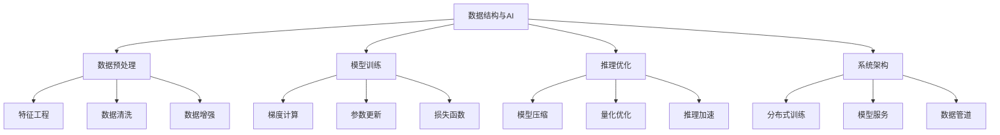

# 数据结构与AI

## 📖 核心概念

**数据结构与AI**是计算机科学的前沿交叉领域，探索数据结构在人工智能系统中的关键作用。从机器学习的数据预处理到深度学习模型的优化，从图神经网络到强化学习的经验存储，数据结构为AI系统提供了高效的数据组织和处理能力。

### 🏗️ 数据结构与AI的组成要素



## 🔍 AI中的数据结构分类

### 按应用场景分类

| 应用场景 | 数据结构 | 特点 | 优势 | 代表技术 |
|----------|----------|------|------|----------|
| **特征存储** | 向量数据库 | 高维向量 | 快速检索 | Faiss, Milvus |
| **图神经网络** | 图数据结构 | 关系建模 | 结构学习 | PyTorch Geometric |
| **强化学习** | 经验回放 | 时序数据 | 样本效率 | DQN, A3C |
| **自然语言处理** | 前缀树 | 文本处理 | 高效匹配 | Trie, BERT |
| **计算机视觉** | 图像金字塔 | 多尺度 | 特征提取 | SIFT, CNN |

### 按技术特性分类

| 技术特性 | 数据结构 | 特点 | 优势 | 挑战 |
|----------|----------|------|------|------|
| **稀疏性** | 稀疏矩阵 | 内存效率 | 计算优化 | 存储复杂 |
| **并行性** | 并行数据结构 | 并发处理 | 性能提升 | 同步开销 |
| **动态性** | 动态图 | 结构变化 | 适应性 | 更新复杂 |
| **近似性** | 近似数据结构 | 概率保证 | 空间效率 | 精度损失 |

## 💻 机器学习数据结构

### 特征向量存储

```cpp
template<typename T>
class MLFeatureStore {
private:
    struct FeatureVector {
        vector<T> features;
        string label;
        int id;
        float weight;
        
        FeatureVector(int id, const vector<T>& feat, const string& lbl, float w = 1.0f) 
            : id(id), features(feat), label(lbl), weight(w) {}
    };
    
    vector<FeatureVector> vectors;
    unordered_map<string, vector<int>> labelIndex;
    unordered_map<int, vector<int>> featureIndex;
    int nextId;
    int featureDimension;
    
public:
    MLFeatureStore(int dim) : nextId(0), featureDimension(dim) {}
    
    // 添加特征向量
    int addVector(const vector<T>& features, const string& label, float weight = 1.0f) {
        if (features.size() != featureDimension) {
            throw invalid_argument("Feature dimension mismatch");
        }
        
        int id = nextId++;
        vectors.emplace_back(id, features, label, weight);
        labelIndex[label].push_back(id);
        
        // 为每个特征维度建立索引
        for (int i = 0; i < featureDimension; i++) {
            featureIndex[i].push_back(id);
        }
        
        return id;
    }
    
    // 批量添加向量
    vector<int> addVectors(const vector<vector<T>>& featuresList, 
                          const vector<string>& labels, 
                          const vector<float>& weights = {}) {
        vector<int> ids;
        
        for (size_t i = 0; i < featuresList.size(); i++) {
            float weight = (i < weights.size()) ? weights[i] : 1.0f;
            int id = addVector(featuresList[i], labels[i], weight);
            ids.push_back(id);
        }
        
        return ids;
    }
    
    // 计算欧几里得距离
    double euclideanDistance(const vector<T>& v1, const vector<T>& v2) const {
        if (v1.size() != v2.size()) {
            throw invalid_argument("Vector dimensions must match");
        }
        
        double sum = 0;
        for (size_t i = 0; i < v1.size(); i++) {
            double diff = static_cast<double>(v1[i]) - static_cast<double>(v2[i]);
            sum += diff * diff;
        }
        
        return sqrt(sum);
    }
    
    // 计算曼哈顿距离
    double manhattanDistance(const vector<T>& v1, const vector<T>& v2) const {
        if (v1.size() != v2.size()) {
            throw invalid_argument("Vector dimensions must match");
        }
        
        double sum = 0;
        for (size_t i = 0; i < v1.size(); i++) {
            sum += abs(static_cast<double>(v1[i]) - static_cast<double>(v2[i]));
        }
        
        return sum;
    }
    
    // K近邻搜索
    vector<pair<int, double>> kNearestNeighbors(const vector<T>& query, int k = 5) const {
        vector<pair<int, double>> distances;
        
        for (const auto& vector : vectors) {
            double distance = euclideanDistance(query, vector.features);
            distances.push_back({vector.id, distance});
        }
        
        // 按距离排序
        sort(distances.begin(), distances.end(), 
             [](const auto& a, const auto& b) {
                 return a.second < b.second;
             });
        
        // 返回前k个
        if (distances.size() > k) {
            distances.resize(k);
        }
        
        return distances;
    }
    
    // 按标签获取向量
    vector<int> getVectorsByLabel(const string& label) const {
        auto it = labelIndex.find(label);
        if (it != labelIndex.end()) {
            return it->second;
        }
        return {};
    }
    
    // 获取所有标签
    vector<string> getAllLabels() const {
        vector<string> labels;
        for (const auto& [label, ids] : labelIndex) {
            labels.push_back(label);
        }
        return labels;
    }
    
    // 计算标签分布
    unordered_map<string, int> getLabelDistribution() const {
        unordered_map<string, int> distribution;
        for (const auto& [label, ids] : labelIndex) {
            distribution[label] = ids.size();
        }
        return distribution;
    }
    
    // 特征标准化
    void normalizeFeatures() {
        if (vectors.empty()) return;
        
        // 计算每个特征的均值和标准差
        vector<double> means(featureDimension, 0);
        vector<double> stdDevs(featureDimension, 0);
        
        // 计算均值
        for (const auto& vector : vectors) {
            for (int i = 0; i < featureDimension; i++) {
                means[i] += static_cast<double>(vector.features[i]);
            }
        }
        
        for (int i = 0; i < featureDimension; i++) {
            means[i] /= vectors.size();
        }
        
        // 计算标准差
        for (const auto& vector : vectors) {
            for (int i = 0; i < featureDimension; i++) {
                double diff = static_cast<double>(vector.features[i]) - means[i];
                stdDevs[i] += diff * diff;
            }
        }
        
        for (int i = 0; i < featureDimension; i++) {
            stdDevs[i] = sqrt(stdDevs[i] / vectors.size());
        }
        
        // 标准化
        for (auto& vector : vectors) {
            for (int i = 0; i < featureDimension; i++) {
                if (stdDevs[i] != 0) {
                    vector.features[i] = static_cast<T>(
                        (static_cast<double>(vector.features[i]) - means[i]) / stdDevs[i]);
                }
            }
        }
    }
    
    // 获取向量数量
    size_t size() const {
        return vectors.size();
    }
    
    // 清空存储
    void clear() {
        vectors.clear();
        labelIndex.clear();
        featureIndex.clear();
        nextId = 0;
    }
};
```

### 图神经网络数据结构

```cpp
template<typename NodeType, typename EdgeType>
class GraphNeuralNetwork {
private:
    struct GraphNode {
        NodeType id;
        vector<float> features;
        vector<float> hiddenState;
        vector<int> neighbors;
        
        GraphNode(NodeType id, const vector<float>& feat) 
            : id(id), features(feat) {}
    };
    
    struct GraphEdge {
        EdgeType id;
        NodeType from;
        NodeType to;
        float weight;
        vector<float> edgeFeatures;
        
        GraphEdge(EdgeType id, NodeType from, NodeType to, float w = 1.0f) 
            : id(id), from(from), to(to), weight(w) {}
    };
    
    unordered_map<NodeType, GraphNode> nodes;
    unordered_map<EdgeType, GraphEdge> edges;
    unordered_map<NodeType, vector<EdgeType>> adjacencyList;
    
public:
    // 添加节点
    void addNode(NodeType id, const vector<float>& features) {
        nodes[id] = GraphNode(id, features);
        adjacencyList[id] = vector<EdgeType>();
    }
    
    // 添加边
    void addEdge(EdgeType id, NodeType from, NodeType to, float weight = 1.0f) {
        if (nodes.find(from) == nodes.end() || nodes.find(to) == nodes.end()) {
            throw invalid_argument("Node not found");
        }
        
        edges[id] = GraphEdge(id, from, to, weight);
        adjacencyList[from].push_back(id);
        adjacencyList[to].push_back(id);
        
        nodes[from].neighbors.push_back(to);
        nodes[to].neighbors.push_back(from);
    }
    
    // 图卷积层
    void graphConvolutionLayer(int hiddenDim) {
        unordered_map<NodeType, vector<float>> newHiddenStates;
        
        for (const auto& [nodeId, node] : nodes) {
            vector<float> aggregatedFeatures(hiddenDim, 0);
            
            // 聚合邻居特征
            for (const auto& neighborId : node.neighbors) {
                auto neighborIt = nodes.find(neighborId);
                if (neighborIt != nodes.end()) {
                    const auto& neighborFeatures = neighborIt->second.features;
                    
                    // 简单的特征聚合（实际实现会更复杂）
                    for (size_t i = 0; i < min(aggregatedFeatures.size(), neighborFeatures.size()); i++) {
                        aggregatedFeatures[i] += neighborFeatures[i];
                    }
                }
            }
            
            // 归一化
            if (!node.neighbors.empty()) {
                for (auto& feature : aggregatedFeatures) {
                    feature /= node.neighbors.size();
                }
            }
            
            newHiddenStates[nodeId] = aggregatedFeatures;
        }
        
        // 更新隐藏状态
        for (const auto& [nodeId, newState] : newHiddenStates) {
            nodes[nodeId].hiddenState = newState;
        }
    }
    
    // 消息传递
    void messagePassing(int numIterations = 3) {
        for (int iter = 0; iter < numIterations; iter++) {
            unordered_map<NodeType, vector<float>> messages;
            
            // 收集消息
            for (const auto& [edgeId, edge] : edges) {
                auto fromIt = nodes.find(edge.from);
                auto toIt = nodes.find(edge.to);
                
                if (fromIt != nodes.end() && toIt != nodes.end()) {
                    // 简单的消息传递（实际实现会更复杂）
                    vector<float> message = fromIt->second.hiddenState;
                    
                    // 应用边权重
                    for (auto& val : message) {
                        val *= edge.weight;
                    }
                    
                    messages[edge.to].insert(messages[edge.to].end(), 
                                           message.begin(), message.end());
                }
            }
            
            // 更新节点状态
            for (const auto& [nodeId, message] : messages) {
                auto nodeIt = nodes.find(nodeId);
                if (nodeIt != nodes.end()) {
                    // 简单的状态更新（实际实现会更复杂）
                    for (size_t i = 0; i < min(nodeIt->second.hiddenState.size(), message.size()); i++) {
                        nodeIt->second.hiddenState[i] += message[i];
                    }
                }
            }
        }
    }
    
    // 获取节点特征
    vector<float> getNodeFeatures(NodeType nodeId) const {
        auto it = nodes.find(nodeId);
        if (it != nodes.end()) {
            return it->second.features;
        }
        return {};
    }
    
    // 获取节点隐藏状态
    vector<float> getNodeHiddenState(NodeType nodeId) const {
        auto it = nodes.find(nodeId);
        if (it != nodes.end()) {
            return it->second.hiddenState;
        }
        return {};
    }
    
    // 获取邻居节点
    vector<NodeType> getNeighbors(NodeType nodeId) const {
        auto it = nodes.find(nodeId);
        if (it != nodes.end()) {
            return it->second.neighbors;
        }
        return {};
    }
    
    // 获取图的统计信息
    struct GraphStats {
        size_t nodeCount;
        size_t edgeCount;
        double averageDegree;
        size_t maxDegree;
        size_t minDegree;
    };
    
    GraphStats getStats() const {
        GraphStats stats;
        stats.nodeCount = nodes.size();
        stats.edgeCount = edges.size();
        
        if (nodes.empty()) {
            stats.averageDegree = 0;
            stats.maxDegree = 0;
            stats.minDegree = 0;
            return stats;
        }
        
        size_t totalDegree = 0;
        stats.maxDegree = 0;
        stats.minDegree = numeric_limits<size_t>::max();
        
        for (const auto& [id, node] : nodes) {
            size_t degree = node.neighbors.size();
            totalDegree += degree;
            stats.maxDegree = max(stats.maxDegree, degree);
            stats.minDegree = min(stats.minDegree, degree);
        }
        
        stats.averageDegree = static_cast<double>(totalDegree) / nodes.size();
        
        return stats;
    }
};
```

## 💻 强化学习数据结构

### 经验回放缓冲区

```cpp
template<typename StateType, typename ActionType>
class ExperienceReplayBuffer {
private:
    struct Experience {
        StateType state;
        ActionType action;
        float reward;
        StateType nextState;
        bool done;
        
        Experience(const StateType& s, const ActionType& a, float r, 
                  const StateType& ns, bool d) 
            : state(s), action(a), reward(r), nextState(ns), done(d) {}
    };
    
    vector<Experience> buffer;
    size_t maxSize;
    size_t currentSize;
    size_t currentIndex;
    random_device rd;
    mt19937 gen;
    
public:
    ExperienceReplayBuffer(size_t maxSize) 
        : maxSize(maxSize), currentSize(0), currentIndex(0), gen(rd()) {}
    
    // 添加经验
    void addExperience(const StateType& state, const ActionType& action, 
                     float reward, const StateType& nextState, bool done) {
        Experience exp(state, action, reward, nextState, done);
        
        if (currentSize < maxSize) {
            buffer.push_back(exp);
            currentSize++;
        } else {
            buffer[currentIndex] = exp;
            currentIndex = (currentIndex + 1) % maxSize;
        }
    }
    
    // 随机采样
    vector<Experience> sample(size_t batchSize) const {
        if (currentSize < batchSize) {
            return vector<Experience>(buffer.begin(), buffer.begin() + currentSize);
        }
        
        vector<Experience> batch;
        uniform_int_distribution<size_t> dis(0, currentSize - 1);
        
        for (size_t i = 0; i < batchSize; i++) {
            size_t index = dis(gen);
            batch.push_back(buffer[index]);
        }
        
        return batch;
    }
    
    // 优先经验回放（简化版）
    vector<Experience> prioritizedSample(size_t batchSize, float alpha = 0.6f) const {
        if (currentSize < batchSize) {
            return vector<Experience>(buffer.begin(), buffer.begin() + currentSize);
        }
        
        vector<Experience> batch;
        vector<float> priorities;
        
        // 计算优先级（基于奖励的绝对值）
        for (size_t i = 0; i < currentSize; i++) {
            float priority = pow(abs(buffer[i].reward) + 1e-6, alpha);
            priorities.push_back(priority);
        }
        
        // 归一化优先级
        float totalPriority = accumulate(priorities.begin(), priorities.end(), 0.0f);
        for (auto& priority : priorities) {
            priority /= totalPriority;
        }
        
        // 按优先级采样
        discrete_distribution<size_t> dis(priorities.begin(), priorities.end());
        
        for (size_t i = 0; i < batchSize; i++) {
            size_t index = dis(gen);
            batch.push_back(buffer[index]);
        }
        
        return batch;
    }
    
    // 获取缓冲区大小
    size_t size() const {
        return currentSize;
    }
    
    // 检查是否已满
    bool isFull() const {
        return currentSize == maxSize;
    }
    
    // 清空缓冲区
    void clear() {
        buffer.clear();
        currentSize = 0;
        currentIndex = 0;
    }
    
    // 获取统计信息
    struct BufferStats {
        size_t size;
        float averageReward;
        float maxReward;
        float minReward;
        float doneRatio;
    };
    
    BufferStats getStats() const {
        BufferStats stats;
        stats.size = currentSize;
        
        if (currentSize == 0) {
            stats.averageReward = 0;
            stats.maxReward = 0;
            stats.minReward = 0;
            stats.doneRatio = 0;
            return stats;
        }
        
        float totalReward = 0;
        float maxReward = numeric_limits<float>::lowest();
        float minReward = numeric_limits<float>::max();
        int doneCount = 0;
        
        for (size_t i = 0; i < currentSize; i++) {
            float reward = buffer[i].reward;
            totalReward += reward;
            maxReward = max(maxReward, reward);
            minReward = min(minReward, reward);
            
            if (buffer[i].done) {
                doneCount++;
            }
        }
        
        stats.averageReward = totalReward / currentSize;
        stats.maxReward = maxReward;
        stats.minReward = minReward;
        stats.doneRatio = static_cast<float>(doneCount) / currentSize;
        
        return stats;
    }
};
```

### 动作价值表

```cpp
template<typename StateType, typename ActionType>
class ActionValueTable {
private:
    struct StateAction {
        StateType state;
        ActionType action;
        
        bool operator==(const StateAction& other) const {
            return state == other.state && action == other.action;
        }
    };
    
    struct StateActionHash {
        size_t operator()(const StateAction& sa) const {
            size_t h1 = hash<StateType>{}(sa.state);
            size_t h2 = hash<ActionType>{}(sa.action);
            return h1 ^ (h2 << 1);
        }
    };
    
    unordered_map<StateAction, float, StateActionHash> qTable;
    float learningRate;
    float discountFactor;
    float epsilon;
    
public:
    ActionValueTable(float lr = 0.1f, float gamma = 0.9f, float eps = 0.1f) 
        : learningRate(lr), discountFactor(gamma), epsilon(eps) {}
    
    // 获取Q值
    float getQValue(const StateType& state, const ActionType& action) const {
        StateAction sa{state, action};
        auto it = qTable.find(sa);
        return (it != qTable.end()) ? it->second : 0.0f;
    }
    
    // 更新Q值
    void updateQValue(const StateType& state, const ActionType& action, 
                     float reward, const StateType& nextState, 
                     const vector<ActionType>& possibleActions) {
        StateAction sa{state, action};
        
        // 计算目标Q值
        float maxNextQ = 0.0f;
        if (!possibleActions.empty()) {
            for (const auto& nextAction : possibleActions) {
                maxNextQ = max(maxNextQ, getQValue(nextState, nextAction));
            }
        }
        
        float targetQ = reward + discountFactor * maxNextQ;
        float currentQ = getQValue(state, action);
        
        // Q学习更新
        float newQ = currentQ + learningRate * (targetQ - currentQ);
        
        qTable[sa] = newQ;
    }
    
    // 选择动作（ε-贪心）
    ActionType selectAction(const StateType& state, 
                           const vector<ActionType>& possibleActions) const {
        if (possibleActions.empty()) {
            throw invalid_argument("No possible actions");
        }
        
        uniform_real_distribution<float> dis(0.0f, 1.0f);
        random_device rd;
        mt19937 gen(rd());
        
        if (dis(gen) < epsilon) {
            // 随机选择
            uniform_int_distribution<size_t> actionDis(0, possibleActions.size() - 1);
            return possibleActions[actionDis(gen)];
        } else {
            // 选择最优动作
            ActionType bestAction = possibleActions[0];
            float bestQValue = getQValue(state, bestAction);
            
            for (const auto& action : possibleActions) {
                float qValue = getQValue(state, action);
                if (qValue > bestQValue) {
                    bestQValue = qValue;
                    bestAction = action;
                }
            }
            
            return bestAction;
        }
    }
    
    // 获取最优动作
    ActionType getBestAction(const StateType& state, 
                           const vector<ActionType>& possibleActions) const {
        if (possibleActions.empty()) {
            throw invalid_argument("No possible actions");
        }
        
        ActionType bestAction = possibleActions[0];
        float bestQValue = getQValue(state, bestAction);
        
        for (const auto& action : possibleActions) {
            float qValue = getQValue(state, action);
            if (qValue > bestQValue) {
                bestQValue = qValue;
                bestAction = action;
            }
        }
        
        return bestAction;
    }
    
    // 设置参数
    void setLearningRate(float lr) {
        learningRate = lr;
    }
    
    void setDiscountFactor(float gamma) {
        discountFactor = gamma;
    }
    
    void setEpsilon(float eps) {
        epsilon = eps;
    }
    
    // 获取Q表大小
    size_t size() const {
        return qTable.size();
    }
    
    // 清空Q表
    void clear() {
        qTable.clear();
    }
    
    // 获取统计信息
    struct QTableStats {
        size_t size;
        float averageQValue;
        float maxQValue;
        float minQValue;
    };
    
    QTableStats getStats() const {
        QTableStats stats;
        stats.size = qTable.size();
        
        if (qTable.empty()) {
            stats.averageQValue = 0;
            stats.maxQValue = 0;
            stats.minQValue = 0;
            return stats;
        }
        
        float totalQ = 0;
        float maxQ = numeric_limits<float>::lowest();
        float minQ = numeric_limits<float>::max();
        
        for (const auto& [sa, qValue] : qTable) {
            totalQ += qValue;
            maxQ = max(maxQ, qValue);
            minQ = min(minQ, qValue);
        }
        
        stats.averageQValue = totalQ / qTable.size();
        stats.maxQValue = maxQ;
        stats.minQValue = minQ;
        
        return stats;
    }
};
```

## ⚡ 复杂度分析

### 时间复杂度

| AI应用 | 数据结构 | 操作 | 时间复杂度 | 空间复杂度 | 特点 |
|--------|----------|------|------------|------------|------|
| **特征存储** | 向量数据库 | 相似搜索 | O(n) | O(n) | 精确搜索 |
| **图神经网络** | 图结构 | 消息传递 | O(V + E) | O(V + E) | 结构学习 |
| **强化学习** | 经验回放 | 采样 | O(1) | O(n) | 随机采样 |
| **动作价值** | 哈希表 | Q值更新 | O(1) | O(n) | 快速查找 |

### 性能特点

| 特点 | 特征存储 | 图神经网络 | 强化学习 | 动作价值 |
|------|----------|------------|----------|----------|
| **实时性** | 良好 | 一般 | 优秀 | 优秀 |
| **准确性** | 精确 | 精确 | 近似 | 精确 |
| **可扩展性** | 优秀 | 良好 | 优秀 | 一般 |
| **内存效率** | 一般 | 一般 | 优秀 | 优秀 |

## 🎓 学习要点总结

### 核心理解

1. **AI需求**：理解AI系统对数据结构的需求
2. **技术融合**：掌握数据结构与AI技术的融合方法
3. **性能优化**：优化AI系统中的数据结构性能
4. **应用场景**：了解不同AI应用场景的数据结构选择

### 实践要点

1. **技术选型**：根据AI需求选择合适的数据结构
2. **性能调优**：优化数据结构的性能表现
3. **系统集成**：将数据结构集成到AI系统中
4. **持续学习**：跟踪AI技术的发展趋势

### 应用思维

1. **问题分析**：分析AI系统的数据结构需求
2. **技术选择**：选择合适的数据结构支持AI
3. **系统设计**：设计基于数据结构的AI系统
4. **创新应用**：将数据结构创新应用到AI场景

---

**相关链接：**
- [[08-知识边疆/01-前沿探索/01-新兴数据结构|新兴数据结构]] - 前沿数据结构基础
- [[06-应用实战/04-网络应用/01-分布式系统|分布式系统]] - 分布式AI系统基础
- [[07-练习战场/03-项目实战/02-系统设计项目|系统设计项目]] - AI系统设计实践
- [[08-知识边疆/03-学习资源/01-前沿技术资源|前沿技术资源]] - AI学习资源推荐
