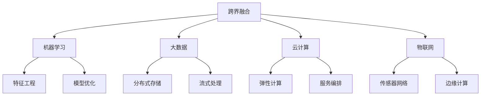

# 跨界融合

## 📖 核心概念

**跨界融合**是数据结构与其他领域结合的重要趋势，包括机器学习、大数据、云计算等领域的应用。通过跨界融合，可以发挥数据结构的最大价值。

### 🏗️ 融合领域



## 🔧 机器学习融合

### 特征工程

```cpp
class FeatureEngineering {
private:
    struct Feature {
        string name;
        vector<double> values;
        double mean;
        double std;
        double min;
        double max;
        
        Feature(const string& n) : name(n), mean(0), std(0), min(0), max(0) {}
    };
    
    vector<Feature> features;
    int sampleCount;
    
public:
    FeatureEngineering() : sampleCount(0) {}
    
    // 添加特征
    void addFeature(const string& name, const vector<double>& values) {
        Feature feature(name);
        feature.values = values;
        
        if (!values.empty()) {
            feature.min = *min_element(values.begin(), values.end());
            feature.max = *max_element(values.begin(), values.end());
            
            double sum = accumulate(values.begin(), values.end(), 0.0);
            feature.mean = sum / values.size();
            
            double variance = 0.0;
            for (double value : values) {
                variance += pow(value - feature.mean, 2);
            }
            feature.std = sqrt(variance / values.size());
        }
        
        features.push_back(feature);
    }
    
    // 标准化特征
    void normalizeFeatures() {
        for (auto& feature : features) {
            for (double& value : feature.values) {
                value = (value - feature.mean) / feature.std;
            }
        }
    }
    
    // 特征选择
    vector<string> selectFeatures(double threshold = 0.1) {
        vector<string> selectedFeatures;
        
        for (const auto& feature : features) {
            if (feature.std > threshold) {
                selectedFeatures.push_back(feature.name);
            }
        }
        
        return selectedFeatures;
    }
    
    // 特征组合
    vector<double> combineFeatures(const vector<string>& featureNames) {
        vector<double> combined;
        
        if (features.empty()) return combined;
        
        int size = features[0].values.size();
        combined.resize(size, 0.0);
        
        for (const string& name : featureNames) {
            for (auto& feature : features) {
                if (feature.name == name) {
                    for (int i = 0; i < size; ++i) {
                        combined[i] += feature.values[i];
                    }
                    break;
                }
            }
        }
        
        return combined;
    }
    
    // 特征统计
    void displayFeatureStats() {
        cout << "Feature Statistics:" << endl;
        for (const auto& feature : features) {
            cout << "  " << feature.name << ":" << endl;
            cout << "    Mean: " << feature.mean << endl;
            cout << "    Std: " << feature.std << endl;
            cout << "    Min: " << feature.min << endl;
            cout << "    Max: " << feature.max << endl;
        }
    }
};
```

### 模型优化

```cpp
class ModelOptimization {
private:
    struct Model {
        string name;
        double accuracy;
        double precision;
        double recall;
        double f1Score;
        int parameters;
        
        Model(const string& n) : name(n), accuracy(0), precision(0), recall(0), f1Score(0), parameters(0) {}
    };
    
    vector<Model> models;
    
public:
    ModelOptimization() {}
    
    // 添加模型
    void addModel(const string& name, double acc, double prec, double rec, int params) {
        Model model(name);
        model.accuracy = acc;
        model.precision = prec;
        model.recall = rec;
        model.f1Score = 2 * (prec * rec) / (prec + rec);
        model.parameters = params;
        
        models.push_back(model);
    }
    
    // 选择最佳模型
    Model selectBestModel() {
        if (models.empty()) {
            throw runtime_error("No models available");
        }
        
        Model best = models[0];
        double bestScore = best.f1Score;
        
        for (const auto& model : models) {
            if (model.f1Score > bestScore) {
                best = model;
                bestScore = model.f1Score;
            }
        }
        
        return best;
    }
    
    // 模型比较
    void compareModels() {
        cout << "Model Comparison:" << endl;
        cout << "Name\t\tAccuracy\tPrecision\tRecall\t\tF1-Score\tParameters" << endl;
        cout << "----------------------------------------------------------------" << endl;
        
        for (const auto& model : models) {
            cout << model.name << "\t\t" << model.accuracy << "\t\t" 
                 << model.precision << "\t\t" << model.recall << "\t\t" 
                 << model.f1Score << "\t\t" << model.parameters << endl;
        }
    }
    
    // 超参数优化
    vector<double> optimizeHyperparameters(const vector<double>& params, const vector<double>& values) {
        vector<double> optimized;
        
        if (params.size() != values.size()) {
            throw invalid_argument("Parameter and value vectors must have same size");
        }
        
        // 简化的优化算法
        for (size_t i = 0; i < params.size(); ++i) {
            double optimizedValue = params[i] * (1 + values[i] * 0.1);
            optimized.push_back(optimizedValue);
        }
        
        return optimized;
    }
};
```

## 🎯 大数据融合

### 分布式存储

```cpp
class DistributedStorage {
private:
    struct DataNode {
        string id;
        string address;
        int port;
        int capacity;
        int used;
        bool isActive;
        
        DataNode(const string& i, const string& addr, int p, int cap) 
            : id(i), address(addr), port(p), capacity(cap), used(0), isActive(true) {}
    };
    
    vector<DataNode> nodes;
    int replicationFactor;
    
public:
    DistributedStorage(int rf = 3) : replicationFactor(rf) {}
    
    // 添加节点
    void addNode(const string& id, const string& address, int port, int capacity) {
        DataNode node(id, address, port, capacity);
        nodes.push_back(node);
    }
    
    // 存储数据
    bool storeData(const string& key, const string& data) {
        if (nodes.empty()) return false;
        
        // 选择存储节点
        vector<int> selectedNodes = selectStorageNodes();
        
        // 存储到选中的节点
        for (int nodeIndex : selectedNodes) {
            if (nodeIndex < nodes.size()) {
                nodes[nodeIndex].used += data.size();
                cout << "Stored data " << key << " on node " << nodes[nodeIndex].id << endl;
            }
        }
        
        return true;
    }
    
    // 检索数据
    string retrieveData(const string& key) {
        // 简化的数据检索
        for (const auto& node : nodes) {
            if (node.isActive) {
                cout << "Retrieved data " << key << " from node " << node.id << endl;
                return "data_for_" + key;
            }
        }
        
        return "";
    }
    
    // 选择存储节点
    vector<int> selectStorageNodes() {
        vector<int> selected;
        vector<int> availableNodes;
        
        // 获取可用节点
        for (int i = 0; i < nodes.size(); ++i) {
            if (nodes[i].isActive && nodes[i].used < nodes[i].capacity) {
                availableNodes.push_back(i);
            }
        }
        
        // 随机选择节点
        random_device rd;
        mt19937 gen(rd());
        shuffle(availableNodes.begin(), availableNodes.end(), gen);
        
        int count = min(replicationFactor, (int)availableNodes.size());
        for (int i = 0; i < count; ++i) {
            selected.push_back(availableNodes[i]);
        }
        
        return selected;
    }
    
    // 负载均衡
    void balanceLoad() {
        cout << "Balancing load across nodes..." << endl;
        
        int totalCapacity = 0;
        int totalUsed = 0;
        
        for (const auto& node : nodes) {
            if (node.isActive) {
                totalCapacity += node.capacity;
                totalUsed += node.used;
            }
        }
        
        double avgUsage = (double)totalUsed / totalCapacity;
        
        for (auto& node : nodes) {
            if (node.isActive) {
                double nodeUsage = (double)node.used / node.capacity;
                if (nodeUsage > avgUsage * 1.2) {
                    cout << "Node " << node.id << " is overloaded" << endl;
                }
            }
        }
    }
    
    // 显示存储状态
    void displayStorageStatus() {
        cout << "Distributed Storage Status:" << endl;
        for (const auto& node : nodes) {
            cout << "Node " << node.id << " (" << node.address << ":" << node.port << "):" << endl;
            cout << "  Capacity: " << node.capacity << " MB" << endl;
            cout << "  Used: " << node.used << " MB" << endl;
            cout << "  Usage: " << (double)node.used / node.capacity * 100 << "%" << endl;
            cout << "  Status: " << (node.isActive ? "Active" : "Inactive") << endl;
        }
    }
};
```

### 流式处理

```cpp
class StreamProcessing {
private:
    struct StreamData {
        string key;
        string value;
        time_t timestamp;
        
        StreamData(const string& k, const string& v) : key(k), value(v), timestamp(time(nullptr)) {}
    };
    
    queue<StreamData> dataStream;
    map<string, int> keyCounts;
    int windowSize;
    int processedCount;
    
public:
    StreamProcessing(int window = 100) : windowSize(window), processedCount(0) {}
    
    // 添加数据流
    void addData(const string& key, const string& value) {
        StreamData data(key, value);
        dataStream.push(data);
        
        // 更新键计数
        keyCounts[key]++;
        
        // 处理窗口
        if (dataStream.size() >= windowSize) {
            processWindow();
        }
    }
    
    // 处理窗口
    void processWindow() {
        cout << "Processing window of " << windowSize << " items..." << endl;
        
        int count = 0;
        while (!dataStream.empty() && count < windowSize) {
            StreamData data = dataStream.front();
            dataStream.pop();
            
            // 处理数据
            processData(data);
            count++;
        }
        
        processedCount += count;
        cout << "Processed " << count << " items. Total processed: " << processedCount << endl;
    }
    
    // 处理单个数据
    void processData(const StreamData& data) {
        // 简化的数据处理
        cout << "Processing: " << data.key << " = " << data.value << endl;
    }
    
    // 获取键统计
    map<string, int> getKeyStatistics() {
        return keyCounts;
    }
    
    // 实时分析
    void realTimeAnalysis() {
        cout << "Real-time Analysis:" << endl;
        cout << "  Total processed: " << processedCount << endl;
        cout << "  Unique keys: " << keyCounts.size() << endl;
        cout << "  Queue size: " << dataStream.size() << endl;
        
        // 显示热门键
        vector<pair<string, int>> sortedKeys;
        for (const auto& pair : keyCounts) {
            sortedKeys.push_back(pair);
        }
        
        sort(sortedKeys.begin(), sortedKeys.end(), 
             [](const pair<string, int>& a, const pair<string, int>& b) {
                 return a.second > b.second;
             });
        
        cout << "  Top keys:" << endl;
        for (int i = 0; i < min(5, (int)sortedKeys.size()); ++i) {
            cout << "    " << sortedKeys[i].first << ": " << sortedKeys[i].second << endl;
        }
    }
};
```

## 📊 云计算融合

### 弹性计算

```cpp
class ElasticComputing {
private:
    struct ComputeInstance {
        string id;
        string type;
        int cpu;
        int memory;
        bool isRunning;
        time_t startTime;
        
        ComputeInstance(const string& i, const string& t, int c, int m) 
            : id(i), type(t), cpu(c), memory(m), isRunning(false), startTime(0) {}
    };
    
    vector<ComputeInstance> instances;
    int maxInstances;
    int currentLoad;
    
public:
    ElasticComputing(int max = 10) : maxInstances(max), currentLoad(0) {}
    
    // 创建实例
    bool createInstance(const string& id, const string& type, int cpu, int memory) {
        if (instances.size() >= maxInstances) {
            cout << "Maximum instances reached" << endl;
            return false;
        }
        
        ComputeInstance instance(id, type, cpu, memory);
        instance.isRunning = true;
        instance.startTime = time(nullptr);
        
        instances.push_back(instance);
        currentLoad += cpu * memory;
        
        cout << "Created instance " << id << " of type " << type << endl;
        return true;
    }
    
    // 销毁实例
    bool destroyInstance(const string& id) {
        for (auto it = instances.begin(); it != instances.end(); ++it) {
            if (it->id == id) {
                currentLoad -= it->cpu * it->memory;
                instances.erase(it);
                cout << "Destroyed instance " << id << endl;
                return true;
            }
        }
        
        cout << "Instance " << id << " not found" << endl;
        return false;
    }
    
    // 自动扩缩容
    void autoScale(int targetLoad) {
        if (currentLoad < targetLoad * 0.8) {
            // 扩容
            if (instances.size() < maxInstances) {
                string newId = "instance_" + to_string(instances.size() + 1);
                createInstance(newId, "t2.micro", 1, 1024);
                cout << "Auto-scaled up due to low load" << endl;
            }
        } else if (currentLoad > targetLoad * 1.2) {
            // 缩容
            if (instances.size() > 1) {
                string instanceId = instances.back().id;
                destroyInstance(instanceId);
                cout << "Auto-scaled down due to high load" << endl;
            }
        }
    }
    
    // 负载均衡
    void balanceLoad() {
        if (instances.empty()) return;
        
        int avgLoad = currentLoad / instances.size();
        
        for (const auto& instance : instances) {
            int instanceLoad = instance.cpu * instance.memory;
            if (instanceLoad > avgLoad * 1.5) {
                cout << "Instance " << instance.id << " is overloaded" << endl;
            }
        }
    }
    
    // 显示计算状态
    void displayComputeStatus() {
        cout << "Elastic Computing Status:" << endl;
        cout << "  Total instances: " << instances.size() << endl;
        cout << "  Current load: " << currentLoad << endl;
        cout << "  Max instances: " << maxInstances << endl;
        
        for (const auto& instance : instances) {
            cout << "  Instance " << instance.id << ":" << endl;
            cout << "    Type: " << instance.type << endl;
            cout << "    CPU: " << instance.cpu << endl;
            cout << "    Memory: " << instance.memory << " MB" << endl;
            cout << "    Status: " << (instance.isRunning ? "Running" : "Stopped") << endl;
        }
    }
};
```

### 服务编排

```cpp
class ServiceOrchestration {
private:
    struct Service {
        string name;
        string version;
        string status;
        vector<string> dependencies;
        int replicas;
        
        Service(const string& n, const string& v) : name(n), version(v), status("stopped"), replicas(1) {}
    };
    
    vector<Service> services;
    map<string, vector<string>> serviceGraph;
    
public:
    ServiceOrchestration() {}
    
    // 添加服务
    void addService(const string& name, const string& version) {
        Service service(name, version);
        services.push_back(service);
        serviceGraph[name] = vector<string>();
    }
    
    // 添加服务依赖
    void addDependency(const string& service, const string& dependency) {
        for (auto& s : services) {
            if (s.name == service) {
                s.dependencies.push_back(dependency);
                serviceGraph[service].push_back(dependency);
                break;
            }
        }
    }
    
    // 启动服务
    bool startService(const string& name) {
        for (auto& service : services) {
            if (service.name == name) {
                // 检查依赖
                if (checkDependencies(service)) {
                    service.status = "running";
                    cout << "Started service " << name << endl;
                    return true;
                } else {
                    cout << "Cannot start service " << name << " - dependencies not met" << endl;
                    return false;
                }
            }
        }
        
        cout << "Service " << name << " not found" << endl;
        return false;
    }
    
    // 停止服务
    bool stopService(const string& name) {
        for (auto& service : services) {
            if (service.name == name) {
                service.status = "stopped";
                cout << "Stopped service " << name << endl;
                return true;
            }
        }
        
        cout << "Service " << name << " not found" << endl;
        return false;
    }
    
    // 检查依赖
    bool checkDependencies(const Service& service) {
        for (const string& dep : service.dependencies) {
            bool depRunning = false;
            for (const auto& s : services) {
                if (s.name == dep && s.status == "running") {
                    depRunning = true;
                    break;
                }
            }
            if (!depRunning) {
                return false;
            }
        }
        return true;
    }
    
    // 服务编排
    void orchestrateServices() {
        cout << "Orchestrating services..." << endl;
        
        // 拓扑排序
        vector<string> sortedServices = topologicalSort();
        
        // 按顺序启动服务
        for (const string& serviceName : sortedServices) {
            startService(serviceName);
        }
    }
    
    // 拓扑排序
    vector<string> topologicalSort() {
        vector<string> result;
        map<string, int> inDegree;
        
        // 计算入度
        for (const auto& service : services) {
            inDegree[service.name] = 0;
        }
        
        for (const auto& pair : serviceGraph) {
            for (const string& dep : pair.second) {
                inDegree[pair.first]++;
            }
        }
        
        // 找到入度为0的节点
        queue<string> q;
        for (const auto& pair : inDegree) {
            if (pair.second == 0) {
                q.push(pair.first);
            }
        }
        
        // 拓扑排序
        while (!q.empty()) {
            string current = q.front();
            q.pop();
            result.push_back(current);
            
            for (const auto& pair : serviceGraph) {
                if (find(pair.second.begin(), pair.second.end(), current) != pair.second.end()) {
                    inDegree[pair.first]--;
                    if (inDegree[pair.first] == 0) {
                        q.push(pair.first);
                    }
                }
            }
        }
        
        return result;
    }
    
    // 显示服务状态
    void displayServiceStatus() {
        cout << "Service Orchestration Status:" << endl;
        for (const auto& service : services) {
            cout << "  Service " << service.name << ":" << endl;
            cout << "    Version: " << service.version << endl;
            cout << "    Status: " << service.status << endl;
            cout << "    Replicas: " << service.replicas << endl;
            cout << "    Dependencies: ";
            for (const string& dep : service.dependencies) {
                cout << dep << " ";
            }
            cout << endl;
        }
    }
};
```

## 🎮 跨界应用

### 1. 智能推荐系统

```cpp
class IntelligentRecommendation {
private:
    struct User {
        string id;
        map<string, double> preferences;
        vector<string> history;
        
        User(const string& i) : id(i) {}
    };
    
    struct Item {
        string id;
        map<string, double> features;
        double rating;
        
        Item(const string& i) : id(i), rating(0) {}
    };
    
    vector<User> users;
    vector<Item> items;
    
public:
    IntelligentRecommendation() {}
    
    // 添加用户
    void addUser(const string& id) {
        users.push_back(User(id));
    }
    
    // 添加物品
    void addItem(const string& id, const map<string, double>& features) {
        Item item(id);
        item.features = features;
        items.push_back(item);
    }
    
    // 用户行为记录
    void recordUserAction(const string& userId, const string& itemId, double rating) {
        for (auto& user : users) {
            if (user.id == userId) {
                user.history.push_back(itemId);
                user.preferences[itemId] = rating;
                break;
            }
        }
        
        for (auto& item : items) {
            if (item.id == itemId) {
                item.rating = (item.rating + rating) / 2;
                break;
            }
        }
    }
    
    // 协同过滤推荐
    vector<string> collaborativeFiltering(const string& userId, int topN = 5) {
        vector<pair<string, double>> recommendations;
        
        for (const auto& item : items) {
            double score = calculateSimilarity(userId, item.id);
            if (score > 0) {
                recommendations.push_back({item.id, score});
            }
        }
        
        sort(recommendations.begin(), recommendations.end(), 
             [](const pair<string, double>& a, const pair<string, double>& b) {
                 return a.second > b.second;
             });
        
        vector<string> result;
        for (int i = 0; i < min(topN, (int)recommendations.size()); ++i) {
            result.push_back(recommendations[i].first);
        }
        
        return result;
    }
    
    // 计算相似度
    double calculateSimilarity(const string& userId, const string& itemId) {
        // 简化的相似度计算
        for (const auto& user : users) {
            if (user.id == userId) {
                auto it = user.preferences.find(itemId);
                if (it != user.preferences.end()) {
                    return it->second;
                }
                break;
            }
        }
        
        return 0.0;
    }
    
    // 内容推荐
    vector<string> contentBasedRecommendation(const string& userId, int topN = 5) {
        vector<pair<string, double>> recommendations;
        
        for (const auto& item : items) {
            double score = calculateContentSimilarity(userId, item.id);
            if (score > 0) {
                recommendations.push_back({item.id, score});
            }
        }
        
        sort(recommendations.begin(), recommendations.end(), 
             [](const pair<string, double>& a, const pair<string, double>& b) {
                 return a.second > b.second;
             });
        
        vector<string> result;
        for (int i = 0; i < min(topN, (int)recommendations.size()); ++i) {
            result.push_back(recommendations[i].first);
        }
        
        return result;
    }
    
    // 计算内容相似度
    double calculateContentSimilarity(const string& userId, const string& itemId) {
        // 简化的内容相似度计算
        for (const auto& user : users) {
            if (user.id == userId) {
                for (const auto& item : items) {
                    if (item.id == itemId) {
                        double similarity = 0.0;
                        for (const auto& feature : item.features) {
                            similarity += feature.second;
                        }
                        return similarity / item.features.size();
                    }
                }
                break;
            }
        }
        
        return 0.0;
    }
    
    // 混合推荐
    vector<string> hybridRecommendation(const string& userId, int topN = 5) {
        vector<string> collaborative = collaborativeFiltering(userId, topN);
        vector<string> content = contentBasedRecommendation(userId, topN);
        
        vector<string> hybrid;
        set<string> seen;
        
        // 合并推荐结果
        for (const string& item : collaborative) {
            if (seen.find(item) == seen.end()) {
                hybrid.push_back(item);
                seen.insert(item);
            }
        }
        
        for (const string& item : content) {
            if (seen.find(item) == seen.end()) {
                hybrid.push_back(item);
                seen.insert(item);
            }
        }
        
        return hybrid;
    }
    
    // 显示推荐结果
    void displayRecommendations(const string& userId) {
        cout << "Recommendations for user " << userId << ":" << endl;
        
        vector<string> recommendations = hybridRecommendation(userId);
        
        for (int i = 0; i < recommendations.size(); ++i) {
            cout << "  " << (i + 1) << ". " << recommendations[i] << endl;
        }
    }
};
```

### 2. 实时分析系统

```cpp
class RealTimeAnalytics {
private:
    struct Metric {
        string name;
        double value;
        time_t timestamp;
        
        Metric(const string& n, double v) : name(n), value(v), timestamp(time(nullptr)) {}
    };
    
    vector<Metric> metrics;
    map<string, vector<double>> metricHistory;
    
public:
    RealTimeAnalytics() {}
    
    // 添加指标
    void addMetric(const string& name, double value) {
        Metric metric(name, value);
        metrics.push_back(metric);
        metricHistory[name].push_back(value);
    }
    
    // 实时监控
    void realTimeMonitoring() {
        cout << "Real-time Monitoring:" << endl;
        
        for (const auto& metric : metrics) {
            cout << "  " << metric.name << ": " << metric.value << " at " << ctime(&metric.timestamp);
        }
    }
    
    // 趋势分析
    void trendAnalysis() {
        cout << "Trend Analysis:" << endl;
        
        for (const auto& pair : metricHistory) {
            const string& name = pair.first;
            const vector<double>& values = pair.second;
            
            if (values.size() >= 2) {
                double trend = values.back() - values[0];
                string trendStr = trend > 0 ? "increasing" : (trend < 0 ? "decreasing" : "stable");
                
                cout << "  " << name << ": " << trendStr << " (change: " << trend << ")" << endl;
            }
        }
    }
    
    // 异常检测
    vector<string> detectAnomalies(double threshold = 2.0) {
        vector<string> anomalies;
        
        for (const auto& pair : metricHistory) {
            const string& name = pair.first;
            const vector<double>& values = pair.second;
            
            if (values.size() >= 10) {
                double mean = accumulate(values.begin(), values.end(), 0.0) / values.size();
                double variance = 0.0;
                
                for (double value : values) {
                    variance += pow(value - mean, 2);
                }
                variance /= values.size();
                double stdDev = sqrt(variance);
                
                double latest = values.back();
                double zScore = abs(latest - mean) / stdDev;
                
                if (zScore > threshold) {
                    anomalies.push_back(name);
                }
            }
        }
        
        return anomalies;
    }
    
    // 性能优化建议
    void performanceOptimization() {
        cout << "Performance Optimization Suggestions:" << endl;
        
        vector<string> anomalies = detectAnomalies();
        
        if (!anomalies.empty()) {
            cout << "  Anomalies detected in: ";
            for (const string& anomaly : anomalies) {
                cout << anomaly << " ";
            }
            cout << endl;
        }
        
        // 简化的优化建议
        for (const auto& pair : metricHistory) {
            const string& name = pair.first;
            const vector<double>& values = pair.second;
            
            if (values.size() >= 5) {
                double avg = accumulate(values.begin(), values.end(), 0.0) / values.size();
                
                if (avg > 80) {
                    cout << "  " << name << ": Consider scaling up resources" << endl;
                } else if (avg < 20) {
                    cout << "  " << name << ": Consider scaling down resources" << endl;
                }
            }
        }
    }
};
```

## 🔗 相关链接

- [[01-前沿探索|前沿探索]]
- [[03-学习资源|学习资源]]

## 💡 跨界融合要点

1. **机器学习**：数据结构在AI中的应用
2. **大数据**：分布式存储和流式处理
3. **云计算**：弹性计算和服务编排
4. **物联网**：传感器网络和边缘计算

---

*📝 融合提示：跨界融合是数据结构发展的重要趋势，掌握多领域知识有助于创新应用*