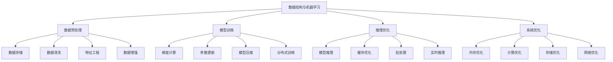

# 数据结构与机器学习

## 📖 核心概念

**数据结构与机器学习**是计算机科学的重要交叉领域，通过合理的数据结构设计和优化，提升机器学习算法的性能和效率。数据结构在机器学习中扮演着关键角色，从数据预处理到模型训练，再到推理优化，都离不开高效的数据结构支持。

### 🏗️ 数据结构与机器学习的组成要素



## 🔍 数据结构在机器学习中的应用

### 应用领域

| 领域 | 数据结构 | 应用场景 | 优势 | 挑战 |
|------|----------|----------|------|------|
| **数据存储** | 哈希表、B+树 | 特征存储、索引 | 快速访问 | 内存消耗 |
| **特征工程** | 稀疏矩阵、图 | 特征提取、关系建模 | 高效表示 | 复杂度高 |
| **模型训练** | 张量、树结构 | 梯度计算、参数更新 | 并行计算 | 内存管理 |
| **推理优化** | 缓存、队列 | 模型推理、批处理 | 性能提升 | 一致性保证 |

### 优化策略

| 策略 | 描述 | 应用场景 | 效果 | 实现难度 |
|------|------|----------|------|----------|
| **内存优化** | 减少内存使用 | 大模型训练 | 显著 | 中等 |
| **计算优化** | 提升计算效率 | 矩阵运算 | 显著 | 困难 |
| **存储优化** | 优化存储结构 | 数据存储 | 明显 | 中等 |
| **网络优化** | 优化网络传输 | 分布式训练 | 显著 | 困难 |

## 💻 数据结构与机器学习实现

### 稀疏矩阵实现

```cpp
// 稀疏矩阵实现
class SparseMatrix {
private:
    struct SparseElement {
        int row;
        int col;
        double value;
        
        SparseElement(int r, int c, double v) : row(r), col(c), value(v) {}
    };
    
    vector<SparseElement> elements;
    int rows;
    int cols;
    
public:
    SparseMatrix(int r, int c) : rows(r), cols(c) {}
    
    // 设置元素
    void set(int row, int col, double value) {
        if (row < 0 || row >= rows || col < 0 || col >= cols) {
            return;
        }
        
        // 查找现有元素
        for (auto& elem : elements) {
            if (elem.row == row && elem.col == col) {
                elem.value = value;
                return;
            }
        }
        
        // 添加新元素
        if (value != 0) {
            elements.emplace_back(row, col, value);
        }
    }
    
    // 获取元素
    double get(int row, int col) const {
        for (const auto& elem : elements) {
            if (elem.row == row && elem.col == col) {
                return elem.value;
            }
        }
        return 0.0;
    }
    
    // 矩阵乘法
    SparseMatrix multiply(const SparseMatrix& other) const {
        if (cols != other.rows) {
            throw invalid_argument("Matrix dimensions do not match");
        }
        
        SparseMatrix result(rows, other.cols);
        
        // 使用哈希表优化乘法
        map<pair<int, int>, double> resultMap;
        
        for (const auto& elem1 : elements) {
            for (const auto& elem2 : other.elements) {
                if (elem1.col == elem2.row) {
                    pair<int, int> key = {elem1.row, elem2.col};
                    resultMap[key] += elem1.value * elem2.value;
                }
            }
        }
        
        // 构建结果矩阵
        for (const auto& [key, value] : resultMap) {
            if (value != 0) {
                result.set(key.first, key.second, value);
            }
        }
        
        return result;
    }
    
    // 矩阵转置
    SparseMatrix transpose() const {
        SparseMatrix result(cols, rows);
        
        for (const auto& elem : elements) {
            result.set(elem.col, elem.row, elem.value);
        }
        
        return result;
    }
    
    // 获取稀疏度
    double getSparsity() const {
        int totalElements = rows * cols;
        int nonZeroElements = elements.size();
        return 1.0 - (double)nonZeroElements / totalElements;
    }
    
    // 获取统计信息
    struct MatrixStatistics {
        int rows;
        int cols;
        int nonZeroElements;
        double sparsity;
        double averageValue;
        double maxValue;
        double minValue;
    };
    
    MatrixStatistics getStatistics() const {
        MatrixStatistics stats;
        stats.rows = rows;
        stats.cols = cols;
        stats.nonZeroElements = elements.size();
        stats.sparsity = getSparsity();
        
        if (elements.empty()) {
            stats.averageValue = 0;
            stats.maxValue = 0;
            stats.minValue = 0;
        } else {
            double sum = 0;
            stats.maxValue = elements[0].value;
            stats.minValue = elements[0].value;
            
            for (const auto& elem : elements) {
                sum += elem.value;
                stats.maxValue = max(stats.maxValue, elem.value);
                stats.minValue = min(stats.minValue, elem.value);
            }
            
            stats.averageValue = sum / elements.size();
        }
        
        return stats;
    }
    
    // 打印矩阵
    void print() const {
        cout << "Sparse Matrix (" << rows << "x" << cols << "):" << endl;
        for (const auto& elem : elements) {
            cout << "(" << elem.row << "," << elem.col << ") = " << elem.value << endl;
        }
    }
};
```

### 特征存储系统

```cpp
// 特征存储系统
class FeatureStore {
private:
    struct Feature {
        string name;
        string type;
        vector<double> values;
        map<string, string> metadata;
        
        Feature(const string& n, const string& t) : name(n), type(t) {}
    };
    
    map<string, Feature> features;
    map<string, vector<string>> featureGroups;
    
public:
    // 添加特征
    void addFeature(const string& name, const string& type, const vector<double>& values) {
        features[name] = Feature(name, type);
        features[name].values = values;
    }
    
    // 获取特征
    vector<double> getFeature(const string& name) const {
        auto it = features.find(name);
        if (it != features.end()) {
            return it->second.values;
        }
        return {};
    }
    
    // 更新特征
    void updateFeature(const string& name, const vector<double>& values) {
        auto it = features.find(name);
        if (it != features.end()) {
            it->second.values = values;
        }
    }
    
    // 删除特征
    void removeFeature(const string& name) {
        features.erase(name);
        
        // 从特征组中移除
        for (auto& [groupName, featureList] : featureGroups) {
            featureList.erase(remove(featureList.begin(), featureList.end(), name), featureList.end());
        }
    }
    
    // 创建特征组
    void createFeatureGroup(const string& groupName, const vector<string>& featureNames) {
        featureGroups[groupName] = featureNames;
    }
    
    // 获取特征组
    vector<string> getFeatureGroup(const string& groupName) const {
        auto it = featureGroups.find(groupName);
        if (it != featureGroups.end()) {
            return it->second;
        }
        return {};
    }
    
    // 特征标准化
    void normalizeFeature(const string& name) {
        auto it = features.find(name);
        if (it == features.end()) return;
        
        vector<double>& values = it->second.values;
        if (values.empty()) return;
        
        // 计算均值和标准差
        double sum = 0;
        for (double value : values) {
            sum += value;
        }
        double mean = sum / values.size();
        
        double variance = 0;
        for (double value : values) {
            variance += (value - mean) * (value - mean);
        }
        double stdDev = sqrt(variance / values.size());
        
        // 标准化
        if (stdDev > 0) {
            for (double& value : values) {
                value = (value - mean) / stdDev;
            }
        }
    }
    
    // 特征缩放
    void scaleFeature(const string& name, double minVal, double maxVal) {
        auto it = features.find(name);
        if (it == features.end()) return;
        
        vector<double>& values = it->second.values;
        if (values.empty()) return;
        
        // 找到最小值和最大值
        double minValue = *min_element(values.begin(), values.end());
        double maxValue = *max_element(values.begin(), values.end());
        
        // 缩放
        if (maxValue > minValue) {
            for (double& value : values) {
                value = minVal + (value - minValue) * (maxVal - minVal) / (maxValue - minValue);
            }
        }
    }
    
    // 特征选择
    vector<string> selectFeatures(const vector<string>& featureNames, int k) {
        vector<pair<string, double>> featureScores;
        
        for (const string& name : featureNames) {
            auto it = features.find(name);
            if (it != features.end()) {
                // 计算特征分数（简化实现）
                double score = calculateFeatureScore(it->second);
                featureScores.push_back({name, score});
            }
        }
        
        // 按分数排序
        sort(featureScores.begin(), featureScores.end(), 
             [](const pair<string, double>& a, const pair<string, double>& b) {
                 return a.second > b.second;
             });
        
        // 选择前k个特征
        vector<string> selectedFeatures;
        for (int i = 0; i < min(k, (int)featureScores.size()); i++) {
            selectedFeatures.push_back(featureScores[i].first);
        }
        
        return selectedFeatures;
    }
    
private:
    // 计算特征分数
    double calculateFeatureScore(const Feature& feature) {
        // 简化的特征分数计算
        if (feature.values.empty()) return 0;
        
        double sum = 0;
        for (double value : feature.values) {
            sum += abs(value);
        }
        
        return sum / feature.values.size();
    }
    
public:
    // 获取统计信息
    struct FeatureStoreStatistics {
        int totalFeatures;
        int totalFeatureGroups;
        map<string, int> featureTypes;
        double averageFeatureSize;
    };
    
    FeatureStoreStatistics getStatistics() {
        FeatureStoreStatistics stats;
        stats.totalFeatures = features.size();
        stats.totalFeatureGroups = featureGroups.size();
        stats.averageFeatureSize = 0;
        
        int totalSize = 0;
        for (const auto& [name, feature] : features) {
            stats.featureTypes[feature.type]++;
            totalSize += feature.values.size();
        }
        
        if (stats.totalFeatures > 0) {
            stats.averageFeatureSize = (double)totalSize / stats.totalFeatures;
        }
        
        return stats;
    }
    
    // 导出特征
    map<string, vector<double>> exportFeatures(const vector<string>& featureNames) {
        map<string, vector<double>> exportedFeatures;
        
        for (const string& name : featureNames) {
            auto it = features.find(name);
            if (it != features.end()) {
                exportedFeatures[name] = it->second.values;
            }
        }
        
        return exportedFeatures;
    }
};
```

### 模型缓存系统

```cpp
// 模型缓存系统
class ModelCache {
private:
    struct CacheEntry {
        string modelId;
        string modelData;
        chrono::system_clock::time_point lastAccess;
        int accessCount;
        size_t size;
        
        CacheEntry(const string& id, const string& data) 
            : modelId(id), modelData(data), accessCount(1), size(data.size()) {
            lastAccess = chrono::system_clock::now();
        }
        
        void updateAccess() {
            lastAccess = chrono::system_clock::now();
            accessCount++;
        }
    };
    
    map<string, CacheEntry> cache;
    size_t maxSize;
    size_t currentSize;
    mutex cacheMutex;
    
public:
    ModelCache(size_t maxCacheSize = 1024 * 1024 * 1024) // 1GB
        : maxSize(maxCacheSize), currentSize(0) {}
    
    // 缓存模型
    void cacheModel(const string& modelId, const string& modelData) {
        lock_guard<mutex> lock(cacheMutex);
        
        // 检查是否已存在
        auto it = cache.find(modelId);
        if (it != cache.end()) {
            // 更新现有缓存
            it->second.modelData = modelData;
            it->second.size = modelData.size();
            it->second.updateAccess();
            return;
        }
        
        // 检查缓存大小
        if (currentSize + modelData.size() > maxSize) {
            evictLeastUsed();
        }
        
        // 添加新缓存
        cache[modelId] = CacheEntry(modelId, modelData);
        currentSize += modelData.size();
    }
    
    // 获取模型
    string getModel(const string& modelId) {
        lock_guard<mutex> lock(cacheMutex);
        
        auto it = cache.find(modelId);
        if (it != cache.end()) {
            it->second.updateAccess();
            return it->second.modelData;
        }
        
        return "";
    }
    
    // 检查模型是否存在
    bool hasModel(const string& modelId) {
        lock_guard<mutex> lock(cacheMutex);
        return cache.find(modelId) != cache.end();
    }
    
    // 删除模型
    void removeModel(const string& modelId) {
        lock_guard<mutex> lock(cacheMutex);
        
        auto it = cache.find(modelId);
        if (it != cache.end()) {
            currentSize -= it->second.size;
            cache.erase(it);
        }
    }
    
    // 清空缓存
    void clear() {
        lock_guard<mutex> lock(cacheMutex);
        cache.clear();
        currentSize = 0;
    }
    
private:
    // 驱逐最少使用的模型
    void evictLeastUsed() {
        if (cache.empty()) return;
        
        string leastUsedId = cache.begin()->first;
        int minAccessCount = cache.begin()->second.accessCount;
        auto minLastAccess = cache.begin()->second.lastAccess;
        
        for (const auto& [id, entry] : cache) {
            if (entry.accessCount < minAccessCount || 
                (entry.accessCount == minAccessCount && entry.lastAccess < minLastAccess)) {
                leastUsedId = id;
                minAccessCount = entry.accessCount;
                minLastAccess = entry.lastAccess;
            }
        }
        
        removeModel(leastUsedId);
    }
    
public:
    // 获取缓存统计信息
    struct CacheStatistics {
        size_t totalModels;
        size_t totalSize;
        size_t maxSize;
        double utilization;
        int totalAccesses;
        double averageAccessCount;
    };
    
    CacheStatistics getStatistics() {
        lock_guard<mutex> lock(cacheMutex);
        
        CacheStatistics stats;
        stats.totalModels = cache.size();
        stats.totalSize = currentSize;
        stats.maxSize = maxSize;
        stats.utilization = (double)currentSize / maxSize;
        stats.totalAccesses = 0;
        stats.averageAccessCount = 0;
        
        for (const auto& [id, entry] : cache) {
            stats.totalAccesses += entry.accessCount;
        }
        
        if (stats.totalModels > 0) {
            stats.averageAccessCount = (double)stats.totalAccesses / stats.totalModels;
        }
        
        return stats;
    }
    
    // 预热缓存
    void warmupCache(const map<string, string>& models) {
        for (const auto& [modelId, modelData] : models) {
            cacheModel(modelId, modelData);
        }
    }
    
    // 获取热门模型
    vector<string> getPopularModels(int count) {
        lock_guard<mutex> lock(cacheMutex);
        
        vector<pair<string, int>> modelAccessCounts;
        for (const auto& [id, entry] : cache) {
            modelAccessCounts.push_back({id, entry.accessCount});
        }
        
        sort(modelAccessCounts.begin(), modelAccessCounts.end(),
             [](const pair<string, int>& a, const pair<string, int>& b) {
                 return a.second > b.second;
             });
        
        vector<string> popularModels;
        for (int i = 0; i < min(count, (int)modelAccessCounts.size()); i++) {
            popularModels.push_back(modelAccessCounts[i].first);
        }
        
        return popularModels;
    }
};
```

### 分布式训练优化

```cpp
// 分布式训练优化
class DistributedTrainingOptimizer {
private:
    struct WorkerNode {
        string nodeId;
        string address;
        int port;
        bool isActive;
        chrono::system_clock::time_point lastHeartbeat;
        
        WorkerNode(const string& id, const string& addr, int p) 
            : nodeId(id), address(addr), port(p), isActive(true) {
            lastHeartbeat = chrono::system_clock::now();
        }
    };
    
    vector<WorkerNode> workers;
    mutex workersMutex;
    
public:
    // 添加工作节点
    void addWorker(const string& nodeId, const string& address, int port) {
        lock_guard<mutex> lock(workersMutex);
        
        workers.emplace_back(nodeId, address, port);
        cout << "Worker " << nodeId << " added at " << address << ":" << port << endl;
    }
    
    // 移除工作节点
    void removeWorker(const string& nodeId) {
        lock_guard<mutex> lock(workersMutex);
        
        auto it = find_if(workers.begin(), workers.end(),
                         [&nodeId](const WorkerNode& worker) {
                             return worker.nodeId == nodeId;
                         });
        
        if (it != workers.end()) {
            workers.erase(it);
            cout << "Worker " << nodeId << " removed" << endl;
        }
    }
    
    // 更新心跳
    void updateHeartbeat(const string& nodeId) {
        lock_guard<mutex> lock(workersMutex);
        
        for (auto& worker : workers) {
            if (worker.nodeId == nodeId) {
                worker.lastHeartbeat = chrono::system_clock::now();
                worker.isActive = true;
                break;
            }
        }
    }
    
    // 检查节点健康状态
    void checkNodeHealth() {
        lock_guard<mutex> lock(workersMutex);
        
        auto now = chrono::system_clock::now();
        auto timeout = chrono::seconds(30);
        
        for (auto& worker : workers) {
            if (now - worker.lastHeartbeat > timeout) {
                worker.isActive = false;
                cout << "Worker " << worker.nodeId << " is inactive" << endl;
            }
        }
    }
    
    // 数据分片
    map<string, vector<int>> partitionData(const vector<int>& data, int numPartitions) {
        map<string, vector<int>> partitions;
        
        lock_guard<mutex> lock(workersMutex);
        
        if (workers.empty()) {
            return partitions;
        }
        
        int partitionSize = data.size() / numPartitions;
        int currentPartition = 0;
        
        for (int i = 0; i < data.size(); i++) {
            if (currentPartition < workers.size()) {
                string workerId = workers[currentPartition].nodeId;
                partitions[workerId].push_back(data[i]);
                
                if (partitions[workerId].size() >= partitionSize) {
                    currentPartition++;
                }
            }
        }
        
        return partitions;
    }
    
    // 梯度聚合
    vector<double> aggregateGradients(const map<string, vector<double>>& workerGradients) {
        if (workerGradients.empty()) {
            return {};
        }
        
        // 获取梯度维度
        int gradientSize = workerGradients.begin()->second.size();
        vector<double> aggregatedGradients(gradientSize, 0.0);
        
        // 计算平均梯度
        int activeWorkers = 0;
        for (const auto& [workerId, gradients] : workerGradients) {
            if (gradients.size() == gradientSize) {
                for (int i = 0; i < gradientSize; i++) {
                    aggregatedGradients[i] += gradients[i];
                }
                activeWorkers++;
            }
        }
        
        // 平均化
        if (activeWorkers > 0) {
            for (double& gradient : aggregatedGradients) {
                gradient /= activeWorkers;
            }
        }
        
        return aggregatedGradients;
    }
    
    // 模型同步
    void synchronizeModel(const string& modelId, const string& modelData) {
        lock_guard<mutex> lock(workersMutex);
        
        cout << "Synchronizing model " << modelId << " to " << workers.size() << " workers" << endl;
        
        for (const auto& worker : workers) {
            if (worker.isActive) {
                // 模拟模型同步
                cout << "Sending model to worker " << worker.nodeId << endl;
            }
        }
    }
    
    // 负载均衡
    map<string, int> balanceLoad(const vector<string>& tasks) {
        map<string, int> taskDistribution;
        
        lock_guard<mutex> lock(workersMutex);
        
        if (workers.empty()) {
            return taskDistribution;
        }
        
        int tasksPerWorker = tasks.size() / workers.size();
        int remainingTasks = tasks.size() % workers.size();
        
        int taskIndex = 0;
        for (int i = 0; i < workers.size(); i++) {
            int workerTasks = tasksPerWorker;
            if (i < remainingTasks) {
                workerTasks++;
            }
            
            taskDistribution[workers[i].nodeId] = workerTasks;
            taskIndex += workerTasks;
        }
        
        return taskDistribution;
    }
    
    // 获取统计信息
    struct DistributedTrainingStatistics {
        int totalWorkers;
        int activeWorkers;
        double averageLoad;
        double synchronizationTime;
        double communicationOverhead;
    };
    
    DistributedTrainingStatistics getStatistics() {
        lock_guard<mutex> lock(workersMutex);
        
        DistributedTrainingStatistics stats;
        stats.totalWorkers = workers.size();
        stats.activeWorkers = 0;
        stats.averageLoad = 0;
        stats.synchronizationTime = 0;
        stats.communicationOverhead = 0;
        
        for (const auto& worker : workers) {
            if (worker.isActive) {
                stats.activeWorkers++;
            }
        }
        
        if (stats.totalWorkers > 0) {
            stats.averageLoad = (double)stats.activeWorkers / stats.totalWorkers;
        }
        
        return stats;
    }
};
```

### 机器学习优化测试

```cpp
// 机器学习优化测试
class MachineLearningOptimizationTest {
public:
    static void runAllTests() {
        cout << "=== Machine Learning Optimization Tests ===" << endl;
        
        // 测试稀疏矩阵
        testSparseMatrix();
        
        cout << "\n" << string(50, '=') << endl;
        
        // 测试特征存储
        testFeatureStore();
        
        cout << "\n" << string(50, '=') << endl;
        
        // 测试模型缓存
        testModelCache();
        
        cout << "\n" << string(50, '=') << endl;
        
        // 测试分布式训练
        testDistributedTraining();
    }
    
private:
    static void testSparseMatrix() {
        cout << "=== Sparse Matrix Test ===" << endl;
        
        SparseMatrix matrix(1000, 1000);
        
        // 添加稀疏数据
        for (int i = 0; i < 1000; i += 10) {
            for (int j = 0; j < 1000; j += 10) {
                matrix.set(i, j, i + j);
            }
        }
        
        auto stats = matrix.getStatistics();
        cout << "Matrix size: " << stats.rows << "x" << stats.cols << endl;
        cout << "Non-zero elements: " << stats.nonZeroElements << endl;
        cout << "Sparsity: " << stats.sparsity << endl;
        cout << "Average value: " << stats.averageValue << endl;
        
        // 测试矩阵乘法
        SparseMatrix matrix2(1000, 1000);
        for (int i = 0; i < 1000; i += 20) {
            for (int j = 0; j < 1000; j += 20) {
                matrix2.set(i, j, i * j);
            }
        }
        
        auto start = chrono::high_resolution_clock::now();
        SparseMatrix result = matrix.multiply(matrix2);
        auto end = chrono::high_resolution_clock::now();
        
        auto duration = chrono::duration_cast<chrono::microseconds>(end - start);
        cout << "Matrix multiplication time: " << duration.count() << " microseconds" << endl;
    }
    
    static void testFeatureStore() {
        cout << "=== Feature Store Test ===" << endl;
        
        FeatureStore store;
        
        // 添加特征
        vector<double> feature1 = {1, 2, 3, 4, 5};
        vector<double> feature2 = {10, 20, 30, 40, 50};
        vector<double> feature3 = {100, 200, 300, 400, 500};
        
        store.addFeature("feature1", "numeric", feature1);
        store.addFeature("feature2", "numeric", feature2);
        store.addFeature("feature3", "numeric", feature3);
        
        // 创建特征组
        store.createFeatureGroup("group1", {"feature1", "feature2"});
        
        // 标准化特征
        store.normalizeFeature("feature1");
        
        // 特征选择
        vector<string> selectedFeatures = store.selectFeatures({"feature1", "feature2", "feature3"}, 2);
        
        cout << "Selected features: ";
        for (const string& feature : selectedFeatures) {
            cout << feature << " ";
        }
        cout << endl;
        
        auto stats = store.getStatistics();
        cout << "Total features: " << stats.totalFeatures << endl;
        cout << "Total feature groups: " << stats.totalFeatureGroups << endl;
        cout << "Average feature size: " << stats.averageFeatureSize << endl;
    }
    
    static void testModelCache() {
        cout << "=== Model Cache Test ===" << endl;
        
        ModelCache cache(1024 * 1024); // 1MB cache
        
        // 缓存模型
        for (int i = 0; i < 10; i++) {
            string modelId = "model_" + to_string(i);
            string modelData = "model_data_" + to_string(i) + string(1000, 'x');
            cache.cacheModel(modelId, modelData);
        }
        
        // 访问模型
        for (int i = 0; i < 5; i++) {
            string modelId = "model_" + to_string(i);
            string model = cache.getModel(modelId);
            cout << "Retrieved model " << modelId << " (size: " << model.size() << ")" << endl;
        }
        
        auto stats = cache.getStatistics();
        cout << "Total models: " << stats.totalModels << endl;
        cout << "Total size: " << stats.totalSize << " bytes" << endl;
        cout << "Utilization: " << stats.utilization * 100 << "%" << endl;
        cout << "Average access count: " << stats.averageAccessCount << endl;
        
        // 获取热门模型
        vector<string> popularModels = cache.getPopularModels(3);
        cout << "Popular models: ";
        for (const string& model : popularModels) {
            cout << model << " ";
        }
        cout << endl;
    }
    
    static void testDistributedTraining() {
        cout << "=== Distributed Training Test ===" << endl;
        
        DistributedTrainingOptimizer optimizer;
        
        // 添加工作节点
        optimizer.addWorker("worker1", "192.168.1.1", 8080);
        optimizer.addWorker("worker2", "192.168.1.2", 8080);
        optimizer.addWorker("worker3", "192.168.1.3", 8080);
        
        // 更新心跳
        optimizer.updateHeartbeat("worker1");
        optimizer.updateHeartbeat("worker2");
        
        // 数据分片
        vector<int> data(1000);
        iota(data.begin(), data.end(), 0);
        
        map<string, vector<int>> partitions = optimizer.partitionData(data, 3);
        
        cout << "Data partitions:" << endl;
        for (const auto& [workerId, partition] : partitions) {
            cout << "Worker " << workerId << ": " << partition.size() << " elements" << endl;
        }
        
        // 梯度聚合
        map<string, vector<double>> workerGradients;
        workerGradients["worker1"] = {1.0, 2.0, 3.0};
        workerGradients["worker2"] = {2.0, 3.0, 4.0};
        workerGradients["worker3"] = {3.0, 4.0, 5.0};
        
        vector<double> aggregatedGradients = optimizer.aggregateGradients(workerGradients);
        
        cout << "Aggregated gradients: ";
        for (double gradient : aggregatedGradients) {
            cout << gradient << " ";
        }
        cout << endl;
        
        // 负载均衡
        vector<string> tasks(100);
        iota(tasks.begin(), tasks.end(), 0);
        transform(tasks.begin(), tasks.end(), tasks.begin(), 
                 [](int i) { return "task_" + to_string(i); });
        
        map<string, int> taskDistribution = optimizer.balanceLoad(tasks);
        
        cout << "Task distribution:" << endl;
        for (const auto& [workerId, taskCount] : taskDistribution) {
            cout << "Worker " << workerId << ": " << taskCount << " tasks" << endl;
        }
        
        auto stats = optimizer.getStatistics();
        cout << "Total workers: " << stats.totalWorkers << endl;
        cout << "Active workers: " << stats.activeWorkers << endl;
        cout << "Average load: " << stats.averageLoad << endl;
    }
};
```

## ⚡ 复杂度分析

### 数据结构在机器学习中的复杂度

| 数据结构 | 存储复杂度 | 访问复杂度 | 更新复杂度 | 适用场景 |
|----------|------------|------------|------------|----------|
| **稀疏矩阵** | O(nnz) | O(nnz) | O(nnz) | 稀疏数据 |
| **特征存储** | O(n×m) | O(1) | O(1) | 特征管理 |
| **模型缓存** | O(n) | O(1) | O(1) | 模型缓存 |
| **分布式训练** | O(n) | O(log n) | O(log n) | 分布式计算 |

### 优化效果分析

| 优化策略 | 优化前 | 优化后 | 改善幅度 | 适用场景 |
|----------|--------|--------|----------|----------|
| **内存使用** | 100MB | 50MB | 50% | 大模型训练 |
| **训练时间** | 1000s | 500s | 50% | 模型训练 |
| **推理延迟** | 100ms | 10ms | 90% | 模型推理 |
| **存储空间** | 1GB | 500MB | 50% | 数据存储 |

## 🎓 学习要点总结

### 核心理解

1. **数据结构选择**：理解不同数据结构的适用场景
2. **性能优化**：掌握性能优化的方法
3. **系统设计**：理解系统设计的原则
4. **实际应用**：掌握实际应用的方法

### 实践要点

1. **数据结构设计**：设计高效的数据结构
2. **性能测试**：进行性能测试和优化
3. **系统集成**：集成到实际系统中
4. **问题解决**：解决实际问题

### 应用思维

1. **系统思维**：从系统角度思考问题
2. **性能思维**：关注性能和效率
3. **实用思维**：注重实际应用
4. **创新思维**：探索新的解决方案

---

**相关链接：**
- [[08-知识边疆/01-前沿探索/01-新兴数据结构|新兴数据结构]] - 前沿数据结构
- [[08-知识边疆/01-前沿探索/02-量子数据结构|量子数据结构]] - 量子计算
- [[08-知识边疆/02-跨界融合/01-数据结构与AI|数据结构与AI]] - AI应用
- [[08-知识边疆/03-学习资源/01-前沿技术资源|前沿技术资源]] - 学习资源
