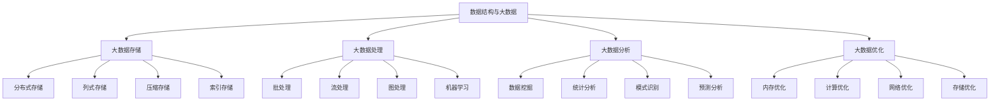

# 数据结构与大数据

## 📖 核心概念

**数据结构与大数据**是数据结构在大数据环境中的应用和优化。通过设计适合大数据处理的数据结构，可以实现高效的数据存储、查询、分析和处理。数据结构与大数据是现代数据科学和人工智能的重要技术基础。

### 🏗️ 数据结构与大数据的组成要素



## 🔍 数据结构与大数据分类

### 大数据技术分类

| 技术类型 | 特点 | 优势 | 劣势 | 适用场景 |
|----------|------|------|------|----------|
| **Hadoop** | 分布式存储 | 高可靠 | 延迟高 | 批处理 |
| **Spark** | 内存计算 | 高性能 | 内存消耗 | 实时处理 |
| **Flink** | 流处理 | 低延迟 | 复杂度高 | 流计算 |
| **Kafka** | 消息队列 | 高吞吐 | 一致性难 | 数据流 |

## 💻 数据结构与大数据实现

### 大数据存储系统

```cpp
// 大数据存储系统
class BigDataStorageSystem {
private:
    struct DataBlock {
        string blockId;
        vector<string> data;
        size_t blockSize;
        uint64_t timestamp;
        int replicationFactor;
        vector<string> replicaNodes;
        
        DataBlock(const string& id, const vector<string>& d, int factor) 
            : blockId(id), data(d), replicationFactor(factor) {
            blockSize = 0;
            for (const string& item : data) {
                blockSize += item.length();
            }
            timestamp = chrono::duration_cast<chrono::milliseconds>(
                chrono::system_clock::now().time_since_epoch()).count();
        }
    };
    
    struct StorageNode {
        string nodeId;
        string host;
        int port;
        size_t totalCapacity;
        size_t usedCapacity;
        double cpuUsage;
        double memoryUsage;
        bool isOnline;
        
        StorageNode(const string& id, const string& h, int p, size_t capacity) 
            : nodeId(id), host(h), port(p), totalCapacity(capacity), usedCapacity(0), 
              cpuUsage(0), memoryUsage(0), isOnline(true) {}
        
        double getCapacityUtilization() const {
            return totalCapacity > 0 ? (double)usedCapacity / totalCapacity : 0;
        }
    };
    
    map<string, StorageNode> storageNodes;
    map<string, DataBlock> dataBlocks;
    mutex storageMutex;
    
    int defaultReplicationFactor;
    
public:
    BigDataStorageSystem(int replicationFactor = 3) 
        : defaultReplicationFactor(replicationFactor) {}
    
    // 添加存储节点
    void addStorageNode(const string& nodeId, const string& host, int port, size_t capacity) {
        lock_guard<mutex> lock(storageMutex);
        
        storageNodes[nodeId] = StorageNode(nodeId, host, port, capacity);
        cout << "Storage node added: " << nodeId << " at " << host << ":" << port << " (" << capacity << " MB)" << endl;
    }
    
    // 移除存储节点
    void removeStorageNode(const string& nodeId) {
        lock_guard<mutex> lock(storageMutex);
        
        auto it = storageNodes.find(nodeId);
        if (it != storageNodes.end()) {
            // 迁移数据到其他节点
            migrateDataFromNode(nodeId);
            storageNodes.erase(it);
            cout << "Storage node removed: " << nodeId << endl;
        }
    }
    
    // 存储数据块
    bool storeDataBlock(const string& blockId, const vector<string>& data) {
        lock_guard<mutex> lock(storageMutex);
        
        // 选择存储节点
        vector<string> selectedNodes = selectStorageNodes(defaultReplicationFactor);
        if (selectedNodes.empty()) {
            cout << "No available storage nodes" << endl;
            return false;
        }
        
        // 创建数据块
        DataBlock block(blockId, data, defaultReplicationFactor);
        block.replicaNodes = selectedNodes;
        
        dataBlocks[blockId] = block;
        
        // 更新节点存储使用量
        for (const string& nodeId : selectedNodes) {
            auto it = storageNodes.find(nodeId);
            if (it != storageNodes.end()) {
                it->second.usedCapacity += block.blockSize;
            }
        }
        
        cout << "Data block stored: " << blockId << " (" << block.blockSize << " bytes) on " << selectedNodes.size() << " nodes" << endl;
        return true;
    }
    
    // 读取数据块
    vector<string> readDataBlock(const string& blockId) {
        lock_guard<mutex> lock(storageMutex);
        
        auto it = dataBlocks.find(blockId);
        if (it == dataBlocks.end()) {
            cout << "Data block not found: " << blockId << endl;
            return {};
        }
        
        DataBlock& block = it->second;
        
        // 尝试从第一个可用节点读取
        for (const string& nodeId : block.replicaNodes) {
            auto nodeIt = storageNodes.find(nodeId);
            if (nodeIt != storageNodes.end() && nodeIt->second.isOnline) {
                cout << "Data block read: " << blockId << " from node " << nodeId << endl;
                return block.data;
            }
        }
        
        cout << "No available replica for: " << blockId << endl;
        return {};
    }
    
    // 删除数据块
    bool deleteDataBlock(const string& blockId) {
        lock_guard<mutex> lock(storageMutex);
        
        auto it = dataBlocks.find(blockId);
        if (it == dataBlocks.end()) {
            cout << "Data block not found: " << blockId << endl;
            return false;
        }
        
        DataBlock& block = it->second;
        
        // 从所有副本节点删除
        for (const string& nodeId : block.replicaNodes) {
            auto nodeIt = storageNodes.find(nodeId);
            if (nodeIt != storageNodes.end()) {
                nodeIt->second.usedCapacity -= block.blockSize;
            }
        }
        
        dataBlocks.erase(it);
        cout << "Data block deleted: " << blockId << endl;
        return true;
    }
    
private:
    // 选择存储节点
    vector<string> selectStorageNodes(int count) {
        vector<string> availableNodes;
        
        for (const auto& [nodeId, node] : storageNodes) {
            if (node.isOnline && node.getCapacityUtilization() < 0.8) {
                availableNodes.push_back(nodeId);
            }
        }
        
        if (availableNodes.size() < count) {
            return {};
        }
        
        // 简单的节点选择策略
        vector<string> selected;
        for (int i = 0; i < count; i++) {
            selected.push_back(availableNodes[i % availableNodes.size()]);
        }
        
        return selected;
    }
    
    // 迁移数据
    void migrateDataFromNode(const string& nodeId) {
        for (auto& [blockId, block] : dataBlocks) {
            auto it = find(block.replicaNodes.begin(), block.replicaNodes.end(), nodeId);
            if (it != block.replicaNodes.end()) {
                // 选择新的存储节点
                vector<string> newNodes = selectStorageNodes(1);
                if (!newNodes.empty()) {
                    *it = newNodes[0];
                    cout << "Data block migrated: " << blockId << " from " << nodeId << " to " << newNodes[0] << endl;
                }
            }
        }
    }
    
public:
    // 获取存储统计信息
    struct BigDataStorageStatistics {
        int totalNodes;
        int onlineNodes;
        int totalBlocks;
        size_t totalCapacity;
        size_t usedCapacity;
        double utilization;
    };
    
    BigDataStorageStatistics getStatistics() {
        lock_guard<mutex> lock(storageMutex);
        
        BigDataStorageStatistics stats;
        stats.totalNodes = storageNodes.size();
        stats.onlineNodes = 0;
        stats.totalBlocks = dataBlocks.size();
        stats.totalCapacity = 0;
        stats.usedCapacity = 0;
        
        for (const auto& [nodeId, node] : storageNodes) {
            if (node.isOnline) {
                stats.onlineNodes++;
            }
            stats.totalCapacity += node.totalCapacity;
            stats.usedCapacity += node.usedCapacity;
        }
        
        if (stats.totalCapacity > 0) {
            stats.utilization = (double)stats.usedCapacity / stats.totalCapacity;
        }
        
        return stats;
    }
};
```

### 大数据处理系统

```cpp
// 大数据处理系统
class BigDataProcessingSystem {
private:
    struct ProcessingTask {
        string taskId;
        string taskType;
        vector<string> inputData;
        vector<string> outputData;
        TaskStatus status;
        string assignedNode;
        uint64_t priority;
        chrono::system_clock::time_point submitTime;
        
        ProcessingTask(const string& id, const string& type, const vector<string>& input, uint64_t prio) 
            : taskId(id), taskType(type), inputData(input), status(TaskStatus::PENDING), priority(prio) {
            submitTime = chrono::system_clock::now();
        }
    };
    
    enum class TaskStatus {
        PENDING,
        RUNNING,
        COMPLETED,
        FAILED
    };
    
    struct ProcessingNode {
        string nodeId;
        string host;
        int port;
        int cores;
        int memory;
        double cpuUsage;
        double memoryUsage;
        bool isOnline;
        int currentTasks;
        
        ProcessingNode(const string& id, const string& h, int p, int c, int m) 
            : nodeId(id), host(h), port(p), cores(c), memory(m), cpuUsage(0), memoryUsage(0), 
              isOnline(true), currentTasks(0) {}
        
        double getLoad() const {
            return cores > 0 ? (double)currentTasks / cores : 0;
        }
    };
    
    map<string, ProcessingNode> processingNodes;
    priority_queue<ProcessingTask> taskQueue;
    map<string, ProcessingTask> runningTasks;
    mutex processingMutex;
    
    thread taskScheduler;
    atomic<bool> isRunning;
    
public:
    BigDataProcessingSystem() : isRunning(false) {}
    
    ~BigDataProcessingSystem() {
        stop();
    }
    
    // 启动处理系统
    void start() {
        isRunning = true;
        taskScheduler = thread(&BigDataProcessingSystem::taskSchedulingLoop, this);
        cout << "Big data processing system started" << endl;
    }
    
    // 停止处理系统
    void stop() {
        isRunning = false;
        if (taskScheduler.joinable()) {
            taskScheduler.join();
        }
        cout << "Big data processing system stopped" << endl;
    }
    
    // 添加处理节点
    void addProcessingNode(const string& nodeId, const string& host, int port, int cores, int memory) {
        lock_guard<mutex> lock(processingMutex);
        
        processingNodes[nodeId] = ProcessingNode(nodeId, host, port, cores, memory);
        cout << "Processing node added: " << nodeId << " at " << host << ":" << port << " (" << cores << " cores, " << memory << " MB)" << endl;
    }
    
    // 移除处理节点
    void removeProcessingNode(const string& nodeId) {
        lock_guard<mutex> lock(processingMutex);
        
        auto it = processingNodes.find(nodeId);
        if (it != processingNodes.end()) {
            // 迁移任务到其他节点
            migrateTasksFromNode(nodeId);
            processingNodes.erase(it);
            cout << "Processing node removed: " << nodeId << endl;
        }
    }
    
    // 提交处理任务
    string submitTask(const string& taskType, const vector<string>& inputData, uint64_t priority = 1) {
        string taskId = generateTaskId();
        ProcessingTask task(taskId, taskType, inputData, priority);
        
        {
            lock_guard<mutex> lock(processingMutex);
            taskQueue.push(task);
        }
        
        cout << "Task submitted: " << taskId << " (" << taskType << ", priority: " << priority << ")" << endl;
        return taskId;
    }
    
    // 获取任务结果
    vector<string> getTaskResult(const string& taskId) {
        lock_guard<mutex> lock(processingMutex);
        
        auto it = runningTasks.find(taskId);
        if (it != runningTasks.end()) {
            if (it->second.status == TaskStatus::COMPLETED) {
                return it->second.outputData;
            } else if (it->second.status == TaskStatus::FAILED) {
                return {"Task failed: " + taskId};
            }
        }
        
        return {"Task not found or still running: " + taskId};
    }
    
private:
    // 任务调度循环
    void taskSchedulingLoop() {
        while (isRunning) {
            if (!taskQueue.empty()) {
                ProcessingTask task = taskQueue.top();
                taskQueue.pop();
                
                // 选择处理节点
                string selectedNode = selectProcessingNode();
                if (!selectedNode.empty()) {
                    // 分配任务
                    assignTask(task, selectedNode);
                } else {
                    // 没有可用节点，重新加入队列
                    taskQueue.push(task);
                }
            }
            
            // 检查运行中的任务
            checkRunningTasks();
            
            this_thread::sleep_for(chrono::milliseconds(100));
        }
    }
    
    // 选择处理节点
    string selectProcessingNode() {
        lock_guard<mutex> lock(processingMutex);
        
        string selectedNode;
        double minLoad = 1.0;
        
        for (const auto& [nodeId, node] : processingNodes) {
            if (node.isOnline && node.getLoad() < minLoad) {
                minLoad = node.getLoad();
                selectedNode = nodeId;
            }
        }
        
        return selectedNode;
    }
    
    // 分配任务
    void assignTask(ProcessingTask& task, const string& nodeId) {
        lock_guard<mutex> lock(processingMutex);
        
        auto it = processingNodes.find(nodeId);
        if (it != processingNodes.end()) {
            task.status = TaskStatus::RUNNING;
            task.assignedNode = nodeId;
            it->second.currentTasks++;
            
            runningTasks[task.taskId] = task;
            
            cout << "Task assigned: " << task.taskId << " to node " << nodeId << endl;
            
            // 模拟任务执行
            thread([this, taskId = task.taskId]() {
                this_thread::sleep_for(chrono::seconds(2));
                completeTask(taskId);
            }).detach();
        }
    }
    
    // 完成任务
    void completeTask(const string& taskId) {
        lock_guard<mutex> lock(processingMutex);
        
        auto it = runningTasks.find(taskId);
        if (it != runningTasks.end()) {
            ProcessingTask& task = it->second;
            task.status = TaskStatus::COMPLETED;
            
            // 模拟处理结果
            for (const string& input : task.inputData) {
                task.outputData.push_back("Processed: " + input);
            }
            
            // 释放节点资源
            auto nodeIt = processingNodes.find(task.assignedNode);
            if (nodeIt != processingNodes.end()) {
                nodeIt->second.currentTasks--;
            }
            
            cout << "Task completed: " << taskId << endl;
        }
    }
    
    // 检查运行中的任务
    void checkRunningTasks() {
        lock_guard<mutex> lock(processingMutex);
        
        auto it = runningTasks.begin();
        while (it != runningTasks.end()) {
            auto now = chrono::system_clock::now();
            auto duration = chrono::duration_cast<chrono::seconds>(now - it->second.submitTime);
            
            if (duration.count() > 60) { // 超时
                it->second.status = TaskStatus::FAILED;
                cout << "Task timeout: " << it->first << endl;
            }
            
            it++;
        }
    }
    
    // 迁移任务
    void migrateTasksFromNode(const string& nodeId) {
        for (auto& [taskId, task] : runningTasks) {
            if (task.assignedNode == nodeId) {
                // 选择新的处理节点
                string newNode = selectProcessingNode();
                if (!newNode.empty()) {
                    task.assignedNode = newNode;
                    cout << "Task migrated: " << taskId << " to node " << newNode << endl;
                }
            }
        }
    }
    
    // 生成任务ID
    string generateTaskId() {
        static int counter = 0;
        return "task_" + to_string(++counter);
    }
    
public:
    // 获取处理统计信息
    struct BigDataProcessingStatistics {
        int totalNodes;
        int onlineNodes;
        int queuedTasks;
        int runningTasks;
        int completedTasks;
        double averageLoad;
    };
    
    BigDataProcessingStatistics getStatistics() {
        lock_guard<mutex> lock(processingMutex);
        
        BigDataProcessingStatistics stats;
        stats.totalNodes = processingNodes.size();
        stats.onlineNodes = 0;
        stats.queuedTasks = taskQueue.size();
        stats.runningTasks = 0;
        stats.completedTasks = 0;
        stats.averageLoad = 0;
        
        double totalLoad = 0;
        
        for (const auto& [nodeId, node] : processingNodes) {
            if (node.isOnline) {
                stats.onlineNodes++;
                totalLoad += node.getLoad();
            }
        }
        
        for (const auto& [taskId, task] : runningTasks) {
            if (task.status == TaskStatus::RUNNING) {
                stats.runningTasks++;
            } else if (task.status == TaskStatus::COMPLETED) {
                stats.completedTasks++;
            }
        }
        
        if (stats.onlineNodes > 0) {
            stats.averageLoad = totalLoad / stats.onlineNodes;
        }
        
        return stats;
    }
};
```

### 大数据分析系统

```cpp
// 大数据分析系统
class BigDataAnalysisSystem {
private:
    struct AnalysisTask {
        string taskId;
        string analysisType;
        vector<string> inputData;
        map<string, double> results;
        TaskStatus status;
        chrono::system_clock::time_point submitTime;
        
        AnalysisTask(const string& id, const string& type, const vector<string>& input) 
            : taskId(id), analysisType(type), inputData(input), status(TaskStatus::PENDING) {
            submitTime = chrono::system_clock::now();
        }
    };
    
    enum class TaskStatus {
        PENDING,
        RUNNING,
        COMPLETED,
        FAILED
    };
    
    struct AnalysisEngine {
        string engineId;
        string engineType;
        bool isAvailable;
        int currentTasks;
        
        AnalysisEngine(const string& id, const string& type) 
            : engineId(id), engineType(type), isAvailable(true), currentTasks(0) {}
    };
    
    map<string, AnalysisEngine> analysisEngines;
    queue<AnalysisTask> analysisQueue;
    map<string, AnalysisTask> runningAnalyses;
    mutex analysisMutex;
    
    thread analysisScheduler;
    atomic<bool> isRunning;
    
public:
    BigDataAnalysisSystem() : isRunning(false) {}
    
    ~BigDataAnalysisSystem() {
        stop();
    }
    
    // 启动分析系统
    void start() {
        isRunning = true;
        analysisScheduler = thread(&BigDataAnalysisSystem::analysisSchedulingLoop, this);
        cout << "Big data analysis system started" << endl;
    }
    
    // 停止分析系统
    void stop() {
        isRunning = false;
        if (analysisScheduler.joinable()) {
            analysisScheduler.join();
        }
        cout << "Big data analysis system stopped" << endl;
    }
    
    // 添加分析引擎
    void addAnalysisEngine(const string& engineId, const string& engineType) {
        lock_guard<mutex> lock(analysisMutex);
        
        analysisEngines[engineId] = AnalysisEngine(engineId, engineType);
        cout << "Analysis engine added: " << engineId << " (" << engineType << ")" << endl;
    }
    
    // 移除分析引擎
    void removeAnalysisEngine(const string& engineId) {
        lock_guard<mutex> lock(analysisMutex);
        
        auto it = analysisEngines.find(engineId);
        if (it != analysisEngines.end()) {
            analysisEngines.erase(it);
            cout << "Analysis engine removed: " << engineId << endl;
        }
    }
    
    // 提交分析任务
    string submitAnalysisTask(const string& analysisType, const vector<string>& inputData) {
        string taskId = generateTaskId();
        AnalysisTask task(taskId, analysisType, inputData);
        
        {
            lock_guard<mutex> lock(analysisMutex);
            analysisQueue.push(task);
        }
        
        cout << "Analysis task submitted: " << taskId << " (" << analysisType << ")" << endl;
        return taskId;
    }
    
    // 获取分析结果
    map<string, double> getAnalysisResult(const string& taskId) {
        lock_guard<mutex> lock(analysisMutex);
        
        auto it = runningAnalyses.find(taskId);
        if (it != runningAnalyses.end()) {
            if (it->second.status == TaskStatus::COMPLETED) {
                return it->second.results;
            } else if (it->second.status == TaskStatus::FAILED) {
                return {{"error", 1.0}};
            }
        }
        
        return {{"not_found", 0.0}};
    }
    
private:
    // 分析调度循环
    void analysisSchedulingLoop() {
        while (isRunning) {
            if (!analysisQueue.empty()) {
                AnalysisTask task = analysisQueue.front();
                analysisQueue.pop();
                
                // 选择分析引擎
                string selectedEngine = selectAnalysisEngine(task.analysisType);
                if (!selectedEngine.empty()) {
                    // 分配任务
                    assignAnalysisTask(task, selectedEngine);
                } else {
                    // 没有可用引擎，重新加入队列
                    analysisQueue.push(task);
                }
            }
            
            // 检查运行中的分析
            checkRunningAnalyses();
            
            this_thread::sleep_for(chrono::milliseconds(100));
        }
    }
    
    // 选择分析引擎
    string selectAnalysisEngine(const string& analysisType) {
        lock_guard<mutex> lock(analysisMutex);
        
        for (const auto& [engineId, engine] : analysisEngines) {
            if (engine.isAvailable && engine.engineType == analysisType) {
                return engineId;
            }
        }
        
        return "";
    }
    
    // 分配分析任务
    void assignAnalysisTask(AnalysisTask& task, const string& engineId) {
        lock_guard<mutex> lock(analysisMutex);
        
        auto it = analysisEngines.find(engineId);
        if (it != analysisEngines.end()) {
            task.status = TaskStatus::RUNNING;
            it->second.currentTasks++;
            
            runningAnalyses[task.taskId] = task;
            
            cout << "Analysis task assigned: " << task.taskId << " to engine " << engineId << endl;
            
            // 模拟分析执行
            thread([this, taskId = task.taskId]() {
                this_thread::sleep_for(chrono::seconds(3));
                completeAnalysisTask(taskId);
            }).detach();
        }
    }
    
    // 完成分析任务
    void completeAnalysisTask(const string& taskId) {
        lock_guard<mutex> lock(analysisMutex);
        
        auto it = runningAnalyses.find(taskId);
        if (it != runningAnalyses.end()) {
            AnalysisTask& task = it->second;
            task.status = TaskStatus::COMPLETED;
            
            // 模拟分析结果
            if (task.analysisType == "statistical") {
                task.results["mean"] = calculateMean(task.inputData);
                task.results["variance"] = calculateVariance(task.inputData);
                task.results["count"] = task.inputData.size();
            } else if (task.analysisType == "clustering") {
                task.results["clusters"] = performClustering(task.inputData);
                task.results["silhouette"] = calculateSilhouette(task.inputData);
            } else if (task.analysisType == "classification") {
                task.results["accuracy"] = performClassification(task.inputData);
                task.results["precision"] = calculatePrecision(task.inputData);
                task.results["recall"] = calculateRecall(task.inputData);
            }
            
            // 释放引擎资源
            for (auto& [engineId, engine] : analysisEngines) {
                if (engine.currentTasks > 0) {
                    engine.currentTasks--;
                    break;
                }
            }
            
            cout << "Analysis task completed: " << taskId << endl;
        }
    }
    
    // 检查运行中的分析
    void checkRunningAnalyses() {
        lock_guard<mutex> lock(analysisMutex);
        
        auto it = runningAnalyses.begin();
        while (it != runningAnalyses.end()) {
            auto now = chrono::system_clock::now();
            auto duration = chrono::duration_cast<chrono::seconds>(now - it->second.submitTime);
            
            if (duration.count() > 120) { // 超时
                it->second.status = TaskStatus::FAILED;
                cout << "Analysis task timeout: " << it->first << endl;
            }
            
            it++;
        }
    }
    
    // 生成任务ID
    string generateTaskId() {
        static int counter = 0;
        return "analysis_" + to_string(++counter);
    }
    
    // 计算均值
    double calculateMean(const vector<string>& data) {
        double sum = 0;
        int count = 0;
        
        for (const string& item : data) {
            try {
                double value = stod(item);
                sum += value;
                count++;
            } catch (const exception& e) {
                // 忽略非数字数据
            }
        }
        
        return count > 0 ? sum / count : 0;
    }
    
    // 计算方差
    double calculateVariance(const vector<string>& data) {
        double mean = calculateMean(data);
        double sum = 0;
        int count = 0;
        
        for (const string& item : data) {
            try {
                double value = stod(item);
                sum += (value - mean) * (value - mean);
                count++;
            } catch (const exception& e) {
                // 忽略非数字数据
            }
        }
        
        return count > 0 ? sum / count : 0;
    }
    
    // 执行聚类
    double performClustering(const vector<string>& data) {
        // 模拟聚类结果
        return data.size() > 0 ? min(5.0, (double)data.size() / 10) : 0;
    }
    
    // 计算轮廓系数
    double calculateSilhouette(const vector<string>& data) {
        // 模拟轮廓系数计算
        return data.size() > 0 ? 0.7 : 0;
    }
    
    // 执行分类
    double performClassification(const vector<string>& data) {
        // 模拟分类准确率
        return data.size() > 0 ? 0.85 : 0;
    }
    
    // 计算精确率
    double calculatePrecision(const vector<string>& data) {
        // 模拟精确率计算
        return data.size() > 0 ? 0.82 : 0;
    }
    
    // 计算召回率
    double calculateRecall(const vector<string>& data) {
        // 模拟召回率计算
        return data.size() > 0 ? 0.88 : 0;
    }
    
public:
    // 获取分析统计信息
    struct BigDataAnalysisStatistics {
        int totalEngines;
        int availableEngines;
        int queuedTasks;
        int runningTasks;
        int completedTasks;
    };
    
    BigDataAnalysisStatistics getStatistics() {
        lock_guard<mutex> lock(analysisMutex);
        
        BigDataAnalysisStatistics stats;
        stats.totalEngines = analysisEngines.size();
        stats.availableEngines = 0;
        stats.queuedTasks = analysisQueue.size();
        stats.runningTasks = 0;
        stats.completedTasks = 0;
        
        for (const auto& [engineId, engine] : analysisEngines) {
            if (engine.isAvailable) {
                stats.availableEngines++;
            }
        }
        
        for (const auto& [taskId, task] : runningAnalyses) {
            if (task.status == TaskStatus::RUNNING) {
                stats.runningTasks++;
            } else if (task.status == TaskStatus::COMPLETED) {
                stats.completedTasks++;
            }
        }
        
        return stats;
    }
};
```

### 数据结构与大数据测试

```cpp
// 数据结构与大数据测试
class BigDataDataStructureTest {
public:
    static void runAllTests() {
        cout << "=== Big Data Data Structure Tests ===" << endl;
        
        // 测试大数据存储
        testBigDataStorage();
        
        cout << "\n" << string(50, '=') << endl;
        
        // 测试大数据处理
        testBigDataProcessing();
        
        cout << "\n" << string(50, '=') << endl;
        
        // 测试大数据分析
        testBigDataAnalysis();
    }
    
private:
    static void testBigDataStorage() {
        cout << "=== Big Data Storage Test ===" << endl;
        
        BigDataStorageSystem bdss;
        
        // 添加存储节点
        bdss.addStorageNode("node1", "192.168.1.1", 9000, 10240); // 10GB
        bdss.addStorageNode("node2", "192.168.1.2", 9000, 20480); // 20GB
        bdss.addStorageNode("node3", "192.168.1.3", 9000, 10240); // 10GB
        
        // 存储数据块
        vector<string> data1 = {"Hello", "World", "Big", "Data"};
        vector<string> data2 = {"Data", "Structure", "Analysis", "Processing"};
        vector<string> data3 = {"Machine", "Learning", "AI", "Deep", "Learning"};
        
        bdss.storeDataBlock("block1", data1);
        bdss.storeDataBlock("block2", data2);
        bdss.storeDataBlock("block3", data3);
        
        // 读取数据块
        vector<string> result1 = bdss.readDataBlock("block1");
        vector<string> result2 = bdss.readDataBlock("block2");
        vector<string> result3 = bdss.readDataBlock("block3");
        
        cout << "Retrieved data blocks:" << endl;
        for (const string& item : result1) {
            cout << "  " << item << " ";
        }
        cout << endl;
        
        // 删除数据块
        bdss.deleteDataBlock("block1");
        
        // 获取统计信息
        auto stats = bdss.getStatistics();
        cout << "\nBig data storage statistics:" << endl;
        cout << "Total nodes: " << stats.totalNodes << endl;
        cout << "Online nodes: " << stats.onlineNodes << endl;
        cout << "Total blocks: " << stats.totalBlocks << endl;
        cout << "Utilization: " << stats.utilization << endl;
        
        cout << "Big data storage test completed" << endl;
    }
    
    static void testBigDataProcessing() {
        cout << "=== Big Data Processing Test ===" << endl;
        
        BigDataProcessingSystem bdps;
        
        // 启动处理系统
        bdps.start();
        
        // 添加处理节点
        bdps.addProcessingNode("node1", "192.168.1.1", 8000, 8, 16384); // 8 cores, 16GB
        bdps.addProcessingNode("node2", "192.168.1.2", 8000, 16, 32768); // 16 cores, 32GB
        bdps.addProcessingNode("node3", "192.168.1.3", 8000, 4, 8192); // 4 cores, 8GB
        
        // 提交处理任务
        vector<string> input1 = {"data1", "data2", "data3"};
        vector<string> input2 = {"data4", "data5", "data6"};
        vector<string> input3 = {"data7", "data8", "data9"};
        
        string task1 = bdps.submitTask("map_reduce", input1, 1);
        string task2 = bdps.submitTask("spark_processing", input2, 2);
        string task3 = bdps.submitTask("flink_streaming", input3, 3);
        
        cout << "Tasks submitted: " << task1 << ", " << task2 << ", " << task3 << endl;
        
        // 等待任务完成
        this_thread::sleep_for(chrono::seconds(3));
        
        // 获取任务结果
        vector<string> result1 = bdps.getTaskResult(task1);
        vector<string> result2 = bdps.getTaskResult(task2);
        vector<string> result3 = bdps.getTaskResult(task3);
        
        cout << "Task results:" << endl;
        for (const string& item : result1) {
            cout << "  " << item << " ";
        }
        cout << endl;
        
        // 获取统计信息
        auto stats = bdps.getStatistics();
        cout << "\nBig data processing statistics:" << endl;
        cout << "Total nodes: " << stats.totalNodes << endl;
        cout << "Online nodes: " << stats.onlineNodes << endl;
        cout << "Queued tasks: " << stats.queuedTasks << endl;
        cout << "Running tasks: " << stats.runningTasks << endl;
        cout << "Completed tasks: " << stats.completedTasks << endl;
        cout << "Average load: " << stats.averageLoad << endl;
        
        // 停止处理系统
        bdps.stop();
        
        cout << "Big data processing test completed" << endl;
    }
    
    static void testBigDataAnalysis() {
        cout << "=== Big Data Analysis Test ===" << endl;
        
        BigDataAnalysisSystem bdas;
        
        // 启动分析系统
        bdas.start();
        
        // 添加分析引擎
        bdas.addAnalysisEngine("engine1", "statistical");
        bdas.addAnalysisEngine("engine2", "clustering");
        bdas.addAnalysisEngine("engine3", "classification");
        
        // 提交分析任务
        vector<string> data1 = {"1.5", "2.3", "3.7", "4.1", "5.9"};
        vector<string> data2 = {"A", "B", "C", "D", "E"};
        vector<string> data3 = {"X", "Y", "Z", "X", "Y"};
        
        string task1 = bdas.submitAnalysisTask("statistical", data1);
        string task2 = bdas.submitAnalysisTask("clustering", data2);
        string task3 = bdas.submitAnalysisTask("classification", data3);
        
        cout << "Analysis tasks submitted: " << task1 << ", " << task2 << ", " << task3 << endl;
        
        // 等待分析完成
        this_thread::sleep_for(chrono::seconds(4));
        
        // 获取分析结果
        map<string, double> result1 = bdas.getAnalysisResult(task1);
        map<string, double> result2 = bdas.getAnalysisResult(task2);
        map<string, double> result3 = bdas.getAnalysisResult(task3);
        
        cout << "Analysis results:" << endl;
        cout << "Statistical analysis:" << endl;
        for (const auto& [key, value] : result1) {
            cout << "  " << key << ": " << value << endl;
        }
        
        cout << "Clustering analysis:" << endl;
        for (const auto& [key, value] : result2) {
            cout << "  " << key << ": " << value << endl;
        }
        
        cout << "Classification analysis:" << endl;
        for (const auto& [key, value] : result3) {
            cout << "  " << key << ": " << value << endl;
        }
        
        // 获取统计信息
        auto stats = bdas.getStatistics();
        cout << "\nBig data analysis statistics:" << endl;
        cout << "Total engines: " << stats.totalEngines << endl;
        cout << "Available engines: " << stats.availableEngines << endl;
        cout << "Queued tasks: " << stats.queuedTasks << endl;
        cout << "Running tasks: " << stats.runningTasks << endl;
        cout << "Completed tasks: " << stats.completedTasks << endl;
        
        // 停止分析系统
        bdas.stop();
        
        cout << "Big data analysis test completed" << endl;
    }
};
```

## ⚡ 复杂度分析

### 数据结构与大数据复杂度

| 操作 | 时间复杂度 | 空间复杂度 | 网络开销 | 适用场景 |
|------|------------|------------|----------|----------|
| **大数据存储** | O(log n) | O(n) | 高 | 数据存储 |
| **大数据处理** | O(n) | O(n) | 中 | 数据处理 |
| **大数据分析** | O(n²) | O(n) | 低 | 数据分析 |
| **大数据优化** | O(n log n) | O(n) | 中 | 性能优化 |

## 🎓 学习要点总结

### 核心理解

1. **大数据概念**：理解大数据的基本概念
2. **数据结构设计**：掌握大数据数据结构设计
3. **处理技术**：理解大数据处理技术
4. **分析技术**：掌握大数据分析技术

### 实践要点

1. **系统设计**：设计大数据系统
2. **性能优化**：优化大数据性能
3. **资源管理**：管理大数据资源
4. **实际应用**：将大数据技术应用到实际问题中

### 应用思维

1. **大数据思维**：从大数据角度思考问题
2. **性能思维**：关注大数据性能
3. **资源思维**：合理管理大数据资源
4. **实际应用**：将大数据技术应用到实际问题中

---

**相关链接：**
- [[08-知识边疆/02-跨界融合/01-数据结构与机器学习|数据结构与机器学习]] - 机器学习技术
- [[08-知识边疆/02-跨界融合/02-数据结构与云计算|数据结构与云计算]] - 云计算技术
- [[08-知识边疆/01-前沿探索/03-区块链数据结构|区块链数据结构]] - 区块链技术
- [[08-知识边疆/01-前沿探索/04-边缘计算数据结构|边缘计算数据结构]] - 边缘计算技术
