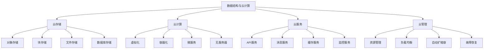

# 数据结构与云计算

## 📖 核心概念

**数据结构与云计算**是数据结构在云计算环境中的应用和优化。通过设计适合云计算的数据结构，可以实现高效的数据存储、处理、传输和管理。数据结构与云计算是现代分布式系统和云服务的重要技术基础。

### 🏗️ 数据结构与云计算的组成要素



## 🔍 数据结构与云计算分类

### 云计算服务分类

| 服务类型 | 特点 | 优势 | 劣势 | 适用场景 |
|----------|------|------|------|----------|
| **IaaS** | 基础设施即服务 | 灵活性高 | 管理复杂 | 企业应用 |
| **PaaS** | 平台即服务 | 开发效率高 | 定制性差 | 应用开发 |
| **SaaS** | 软件即服务 | 使用简单 | 功能受限 | 终端用户 |
| **FaaS** | 函数即服务 | 按需付费 | 冷启动 | 事件驱动 |

## 💻 数据结构与云计算实现

### 云存储系统

```cpp
// 云存储系统
class CloudStorageSystem {
private:
    struct CloudNode {
        string nodeId;
        string region;
        string zone;
        size_t storageCapacity;
        size_t usedStorage;
        double cpuUsage;
        double memoryUsage;
        bool isOnline;
        
        CloudNode(const string& id, const string& reg, const string& z, size_t capacity) 
            : nodeId(id), region(reg), zone(z), storageCapacity(capacity), usedStorage(0), 
              cpuUsage(0), memoryUsage(0), isOnline(true) {}
        
        double getStorageUtilization() const {
            return storageCapacity > 0 ? (double)usedStorage / storageCapacity : 0;
        }
    };
    
    struct StorageObject {
        string objectId;
        string objectName;
        string data;
        string contentType;
        size_t objectSize;
        uint64_t timestamp;
        int replicationFactor;
        vector<string> replicaNodes;
        
        StorageObject(const string& id, const string& name, const string& d, const string& type) 
            : objectId(id), objectName(name), data(d), contentType(type), replicationFactor(1) {
            objectSize = data.length();
            timestamp = chrono::duration_cast<chrono::milliseconds>(
                chrono::system_clock::now().time_since_epoch()).count();
        }
    };
    
    map<string, CloudNode> cloudNodes;
    map<string, StorageObject> storageObjects;
    mutex storageMutex;
    
    int defaultReplicationFactor;
    
public:
    CloudStorageSystem(int replicationFactor = 3) 
        : defaultReplicationFactor(replicationFactor) {}
    
    // 添加云节点
    void addCloudNode(const string& nodeId, const string& region, const string& zone, size_t capacity) {
        lock_guard<mutex> lock(storageMutex);
        
        cloudNodes[nodeId] = CloudNode(nodeId, region, zone, capacity);
        cout << "Cloud node added: " << nodeId << " in " << region << "/" << zone << " (" << capacity << " MB)" << endl;
    }
    
    // 移除云节点
    void removeCloudNode(const string& nodeId) {
        lock_guard<mutex> lock(storageMutex);
        
        auto it = cloudNodes.find(nodeId);
        if (it != cloudNodes.end()) {
            // 迁移数据到其他节点
            migrateDataFromNode(nodeId);
            cloudNodes.erase(it);
            cout << "Cloud node removed: " << nodeId << endl;
        }
    }
    
    // 存储对象
    bool storeObject(const string& objectName, const string& data, const string& contentType) {
        lock_guard<mutex> lock(storageMutex);
        
        // 选择存储节点
        vector<string> selectedNodes = selectStorageNodes(defaultReplicationFactor);
        if (selectedNodes.empty()) {
            cout << "No available cloud nodes for storage" << endl;
            return false;
        }
        
        // 创建存储对象
        string objectId = generateObjectId(objectName);
        StorageObject obj(objectId, objectName, data, contentType);
        obj.replicationFactor = defaultReplicationFactor;
        obj.replicaNodes = selectedNodes;
        
        storageObjects[objectId] = obj;
        
        // 更新节点存储使用量
        for (const string& nodeId : selectedNodes) {
            auto it = cloudNodes.find(nodeId);
            if (it != cloudNodes.end()) {
                it->second.usedStorage += obj.objectSize;
            }
        }
        
        cout << "Object stored: " << objectName << " (" << obj.objectSize << " bytes) on " << selectedNodes.size() << " nodes" << endl;
        return true;
    }
    
    // 读取对象
    string readObject(const string& objectName) {
        lock_guard<mutex> lock(storageMutex);
        
        string objectId = generateObjectId(objectName);
        auto it = storageObjects.find(objectId);
        if (it == storageObjects.end()) {
            cout << "Object not found: " << objectName << endl;
            return "";
        }
        
        StorageObject& obj = it->second;
        
        // 尝试从第一个可用节点读取
        for (const string& nodeId : obj.replicaNodes) {
            auto nodeIt = cloudNodes.find(nodeId);
            if (nodeIt != cloudNodes.end() && nodeIt->second.isOnline) {
                cout << "Object read: " << objectName << " from node " << nodeId << endl;
                return obj.data;
            }
        }
        
        cout << "No available replica for: " << objectName << endl;
        return "";
    }
    
    // 删除对象
    bool deleteObject(const string& objectName) {
        lock_guard<mutex> lock(storageMutex);
        
        string objectId = generateObjectId(objectName);
        auto it = storageObjects.find(objectId);
        if (it == storageObjects.end()) {
            cout << "Object not found: " << objectName << endl;
            return false;
        }
        
        StorageObject& obj = it->second;
        
        // 从所有副本节点删除
        for (const string& nodeId : obj.replicaNodes) {
            auto nodeIt = cloudNodes.find(nodeId);
            if (nodeIt != cloudNodes.end()) {
                nodeIt->second.usedStorage -= obj.objectSize;
            }
        }
        
        storageObjects.erase(it);
        cout << "Object deleted: " << objectName << endl;
        return true;
    }
    
    // 列出对象
    vector<string> listObjects(const string& prefix = "") {
        lock_guard<mutex> lock(storageMutex);
        
        vector<string> objects;
        for (const auto& [objectId, obj] : storageObjects) {
            if (prefix.empty() || obj.objectName.find(prefix) == 0) {
                objects.push_back(obj.objectName);
            }
        }
        
        cout << "Listed " << objects.size() << " objects" << endl;
        return objects;
    }
    
private:
    // 选择存储节点
    vector<string> selectStorageNodes(int count) {
        vector<string> availableNodes;
        
        for (const auto& [nodeId, node] : cloudNodes) {
            if (node.isOnline && node.getStorageUtilization() < 0.8) {
                availableNodes.push_back(nodeId);
            }
        }
        
        if (availableNodes.size() < count) {
            return {};
        }
        
        // 简单的节点选择策略
        vector<string> selected;
        for (int i = 0; i < count; i++) {
            selected.push_back(availableNodes[i % availableNodes.size()]);
        }
        
        return selected;
    }
    
    // 迁移数据
    void migrateDataFromNode(const string& nodeId) {
        for (auto& [objectId, obj] : storageObjects) {
            auto it = find(obj.replicaNodes.begin(), obj.replicaNodes.end(), nodeId);
            if (it != obj.replicaNodes.end()) {
                // 选择新的存储节点
                vector<string> newNodes = selectStorageNodes(1);
                if (!newNodes.empty()) {
                    *it = newNodes[0];
                    cout << "Object migrated: " << obj.objectName << " from " << nodeId << " to " << newNodes[0] << endl;
                }
            }
        }
    }
    
    // 生成对象ID
    string generateObjectId(const string& objectName) {
        hash<string> hasher;
        return "obj_" + to_string(hasher(objectName));
    }
    
public:
    // 获取存储统计信息
    struct CloudStorageStatistics {
        int totalNodes;
        int onlineNodes;
        int totalObjects;
        size_t totalCapacity;
        size_t usedStorage;
        double utilization;
    };
    
    CloudStorageStatistics getStatistics() {
        lock_guard<mutex> lock(storageMutex);
        
        CloudStorageStatistics stats;
        stats.totalNodes = cloudNodes.size();
        stats.onlineNodes = 0;
        stats.totalObjects = storageObjects.size();
        stats.totalCapacity = 0;
        stats.usedStorage = 0;
        
        for (const auto& [nodeId, node] : cloudNodes) {
            if (node.isOnline) {
                stats.onlineNodes++;
            }
            stats.totalCapacity += node.storageCapacity;
            stats.usedStorage += node.usedStorage;
        }
        
        if (stats.totalCapacity > 0) {
            stats.utilization = (double)stats.usedStorage / stats.totalCapacity;
        }
        
        return stats;
    }
};
```

### 云计算系统

```cpp
// 云计算系统
class CloudComputingSystem {
private:
    struct CloudInstance {
        string instanceId;
        string instanceType;
        string region;
        string zone;
        int cores;
        int memory;
        double cpuUsage;
        double memoryUsage;
        bool isRunning;
        
        CloudInstance(const string& id, const string& type, const string& reg, const string& z, int c, int m) 
            : instanceId(id), instanceType(type), region(reg), zone(z), cores(c), memory(m), 
              cpuUsage(0), memoryUsage(0), isRunning(true) {}
        
        double getLoad() const {
            return cores > 0 ? (double)cpuUsage / cores : 0;
        }
    };
    
    struct ComputingTask {
        string taskId;
        string taskType;
        string inputData;
        string outputData;
        TaskStatus status;
        string assignedInstance;
        uint64_t priority;
        chrono::system_clock::time_point submitTime;
        
        ComputingTask(const string& id, const string& type, const string& input, uint64_t prio) 
            : taskId(id), taskType(type), inputData(input), status(TaskStatus::PENDING), priority(prio) {
            submitTime = chrono::system_clock::now();
        }
    };
    
    enum class TaskStatus {
        PENDING,
        RUNNING,
        COMPLETED,
        FAILED
    };
    
    map<string, CloudInstance> cloudInstances;
    priority_queue<ComputingTask> taskQueue;
    map<string, ComputingTask> runningTasks;
    mutex computingMutex;
    
    thread taskScheduler;
    atomic<bool> isRunning;
    
public:
    CloudComputingSystem() : isRunning(false) {}
    
    ~CloudComputingSystem() {
        stop();
    }
    
    // 启动计算系统
    void start() {
        isRunning = true;
        taskScheduler = thread(&CloudComputingSystem::taskSchedulingLoop, this);
        cout << "Cloud computing system started" << endl;
    }
    
    // 停止计算系统
    void stop() {
        isRunning = false;
        if (taskScheduler.joinable()) {
            taskScheduler.join();
        }
        cout << "Cloud computing system stopped" << endl;
    }
    
    // 创建云实例
    string createCloudInstance(const string& instanceType, const string& region, const string& zone) {
        string instanceId = generateInstanceId();
        int cores = getCoresForType(instanceType);
        int memory = getMemoryForType(instanceType);
        
        lock_guard<mutex> lock(computingMutex);
        cloudInstances[instanceId] = CloudInstance(instanceId, instanceType, region, zone, cores, memory);
        
        cout << "Cloud instance created: " << instanceId << " (" << instanceType << ") in " << region << "/" << zone << endl;
        return instanceId;
    }
    
    // 终止云实例
    void terminateCloudInstance(const string& instanceId) {
        lock_guard<mutex> lock(computingMutex);
        
        auto it = cloudInstances.find(instanceId);
        if (it != cloudInstances.end()) {
            // 迁移任务到其他实例
            migrateTasksFromInstance(instanceId);
            cloudInstances.erase(it);
            cout << "Cloud instance terminated: " << instanceId << endl;
        }
    }
    
    // 提交计算任务
    string submitComputingTask(const string& taskType, const string& inputData, uint64_t priority = 1) {
        string taskId = generateTaskId();
        ComputingTask task(taskId, taskType, inputData, priority);
        
        {
            lock_guard<mutex> lock(computingMutex);
            taskQueue.push(task);
        }
        
        cout << "Computing task submitted: " << taskId << " (" << taskType << ", priority: " << priority << ")" << endl;
        return taskId;
    }
    
    // 获取任务结果
    string getTaskResult(const string& taskId) {
        lock_guard<mutex> lock(computingMutex);
        
        auto it = runningTasks.find(taskId);
        if (it != runningTasks.end()) {
            if (it->second.status == TaskStatus::COMPLETED) {
                return it->second.outputData;
            } else if (it->second.status == TaskStatus::FAILED) {
                return "Task failed: " + taskId;
            }
        }
        
        return "Task not found or still running: " + taskId;
    }
    
private:
    // 任务调度循环
    void taskSchedulingLoop() {
        while (isRunning) {
            if (!taskQueue.empty()) {
                ComputingTask task = taskQueue.top();
                taskQueue.pop();
                
                // 选择云实例
                string selectedInstance = selectCloudInstance();
                if (!selectedInstance.empty()) {
                    // 分配任务
                    assignTask(task, selectedInstance);
                } else {
                    // 没有可用实例，重新加入队列
                    taskQueue.push(task);
                }
            }
            
            // 检查运行中的任务
            checkRunningTasks();
            
            this_thread::sleep_for(chrono::milliseconds(100));
        }
    }
    
    // 选择云实例
    string selectCloudInstance() {
        lock_guard<mutex> lock(computingMutex);
        
        string selectedInstance;
        double minLoad = 1.0;
        
        for (const auto& [instanceId, instance] : cloudInstances) {
            if (instance.isRunning && instance.getLoad() < minLoad) {
                minLoad = instance.getLoad();
                selectedInstance = instanceId;
            }
        }
        
        return selectedInstance;
    }
    
    // 分配任务
    void assignTask(ComputingTask& task, const string& instanceId) {
        lock_guard<mutex> lock(computingMutex);
        
        auto it = cloudInstances.find(instanceId);
        if (it != cloudInstances.end()) {
            task.status = TaskStatus::RUNNING;
            task.assignedInstance = instanceId;
            it->second.cpuUsage += 0.1; // 模拟CPU使用率增加
            
            runningTasks[task.taskId] = task;
            
            cout << "Task assigned: " << task.taskId << " to instance " << instanceId << endl;
            
            // 模拟任务执行
            thread([this, taskId = task.taskId]() {
                this_thread::sleep_for(chrono::seconds(2));
                completeTask(taskId);
            }).detach();
        }
    }
    
    // 完成任务
    void completeTask(const string& taskId) {
        lock_guard<mutex> lock(computingMutex);
        
        auto it = runningTasks.find(taskId);
        if (it != runningTasks.end()) {
            ComputingTask& task = it->second;
            task.status = TaskStatus::COMPLETED;
            task.outputData = "Result for " + task.taskId;
            
            // 释放实例资源
            auto instanceIt = cloudInstances.find(task.assignedInstance);
            if (instanceIt != cloudInstances.end()) {
                instanceIt->second.cpuUsage -= 0.1; // 模拟CPU使用率减少
            }
            
            cout << "Task completed: " << taskId << endl;
        }
    }
    
    // 检查运行中的任务
    void checkRunningTasks() {
        lock_guard<mutex> lock(computingMutex);
        
        auto it = runningTasks.begin();
        while (it != runningTasks.end()) {
            auto now = chrono::system_clock::now();
            auto duration = chrono::duration_cast<chrono::seconds>(now - it->second.submitTime);
            
            if (duration.count() > 60) { // 超时
                it->second.status = TaskStatus::FAILED;
                cout << "Task timeout: " << it->first << endl;
            }
            
            it++;
        }
    }
    
    // 迁移任务
    void migrateTasksFromInstance(const string& instanceId) {
        for (auto& [taskId, task] : runningTasks) {
            if (task.assignedInstance == instanceId) {
                // 选择新的云实例
                string newInstance = selectCloudInstance();
                if (!newInstance.empty()) {
                    task.assignedInstance = newInstance;
                    cout << "Task migrated: " << taskId << " to instance " << newInstance << endl;
                }
            }
        }
    }
    
    // 生成实例ID
    string generateInstanceId() {
        static int counter = 0;
        return "instance_" + to_string(++counter);
    }
    
    // 生成任务ID
    string generateTaskId() {
        static int counter = 0;
        return "task_" + to_string(++counter);
    }
    
    // 获取实例类型的核心数
    int getCoresForType(const string& instanceType) {
        if (instanceType == "t2.micro") return 1;
        if (instanceType == "t2.small") return 1;
        if (instanceType == "t2.medium") return 2;
        if (instanceType == "t2.large") return 2;
        if (instanceType == "t2.xlarge") return 4;
        if (instanceType == "t2.2xlarge") return 8;
        return 1;
    }
    
    // 获取实例类型的内存
    int getMemoryForType(const string& instanceType) {
        if (instanceType == "t2.micro") return 1024;
        if (instanceType == "t2.small") return 2048;
        if (instanceType == "t2.medium") return 4096;
        if (instanceType == "t2.large") return 8192;
        if (instanceType == "t2.xlarge") return 16384;
        if (instanceType == "t2.2xlarge") return 32768;
        return 1024;
    }
    
public:
    // 获取计算统计信息
    struct CloudComputingStatistics {
        int totalInstances;
        int runningInstances;
        int queuedTasks;
        int runningTasks;
        int completedTasks;
        double averageLoad;
    };
    
    CloudComputingStatistics getStatistics() {
        lock_guard<mutex> lock(computingMutex);
        
        CloudComputingStatistics stats;
        stats.totalInstances = cloudInstances.size();
        stats.runningInstances = 0;
        stats.queuedTasks = taskQueue.size();
        stats.runningTasks = 0;
        stats.completedTasks = 0;
        stats.averageLoad = 0;
        
        double totalLoad = 0;
        
        for (const auto& [instanceId, instance] : cloudInstances) {
            if (instance.isRunning) {
                stats.runningInstances++;
                totalLoad += instance.getLoad();
            }
        }
        
        for (const auto& [taskId, task] : runningTasks) {
            if (task.status == TaskStatus::RUNNING) {
                stats.runningTasks++;
            } else if (task.status == TaskStatus::COMPLETED) {
                stats.completedTasks++;
            }
        }
        
        if (stats.runningInstances > 0) {
            stats.averageLoad = totalLoad / stats.runningInstances;
        }
        
        return stats;
    }
};
```

### 云服务系统

```cpp
// 云服务系统
class CloudServiceSystem {
private:
    struct CloudService {
        string serviceId;
        string serviceName;
        string serviceType;
        string region;
        string zone;
        bool isActive;
        int currentConnections;
        double cpuUsage;
        double memoryUsage;
        
        CloudService(const string& id, const string& name, const string& type, const string& reg, const string& z) 
            : serviceId(id), serviceName(name), serviceType(type), region(reg), zone(z), 
              isActive(true), currentConnections(0), cpuUsage(0), memoryUsage(0) {}
        
        double getLoad() const {
            return currentConnections > 0 ? (double)cpuUsage / currentConnections : 0;
        }
    };
    
    struct ServiceRequest {
        string requestId;
        string serviceName;
        string requestData;
        string responseData;
        RequestStatus status;
        string assignedService;
        uint64_t priority;
        chrono::system_clock::time_point submitTime;
        
        ServiceRequest(const string& id, const string& name, const string& data, uint64_t prio) 
            : requestId(id), serviceName(name), requestData(data), status(RequestStatus::PENDING), priority(prio) {
            submitTime = chrono::system_clock::now();
        }
    };
    
    enum class RequestStatus {
        PENDING,
        PROCESSING,
        COMPLETED,
        FAILED
    };
    
    map<string, CloudService> cloudServices;
    priority_queue<ServiceRequest> requestQueue;
    map<string, ServiceRequest> processingRequests;
    mutex serviceMutex;
    
    thread serviceScheduler;
    atomic<bool> isRunning;
    
public:
    CloudServiceSystem() : isRunning(false) {}
    
    ~CloudServiceSystem() {
        stop();
    }
    
    // 启动服务系统
    void start() {
        isRunning = true;
        serviceScheduler = thread(&CloudServiceSystem::serviceSchedulingLoop, this);
        cout << "Cloud service system started" << endl;
    }
    
    // 停止服务系统
    void stop() {
        isRunning = false;
        if (serviceScheduler.joinable()) {
            serviceScheduler.join();
        }
        cout << "Cloud service system stopped" << endl;
    }
    
    // 创建云服务
    string createCloudService(const string& serviceName, const string& serviceType, const string& region, const string& zone) {
        string serviceId = generateServiceId();
        
        lock_guard<mutex> lock(serviceMutex);
        cloudServices[serviceId] = CloudService(serviceId, serviceName, serviceType, region, zone);
        
        cout << "Cloud service created: " << serviceId << " (" << serviceName << ") in " << region << "/" << zone << endl;
        return serviceId;
    }
    
    // 删除云服务
    void deleteCloudService(const string& serviceId) {
        lock_guard<mutex> lock(serviceMutex);
        
        auto it = cloudServices.find(serviceId);
        if (it != cloudServices.end()) {
            // 迁移请求到其他服务
            migrateRequestsFromService(serviceId);
            cloudServices.erase(it);
            cout << "Cloud service deleted: " << serviceId << endl;
        }
    }
    
    // 提交服务请求
    string submitServiceRequest(const string& serviceName, const string& requestData, uint64_t priority = 1) {
        string requestId = generateRequestId();
        ServiceRequest request(requestId, serviceName, requestData, priority);
        
        {
            lock_guard<mutex> lock(serviceMutex);
            requestQueue.push(request);
        }
        
        cout << "Service request submitted: " << requestId << " (" << serviceName << ", priority: " << priority << ")" << endl;
        return requestId;
    }
    
    // 获取请求结果
    string getRequestResult(const string& requestId) {
        lock_guard<mutex> lock(serviceMutex);
        
        auto it = processingRequests.find(requestId);
        if (it != processingRequests.end()) {
            if (it->second.status == RequestStatus::COMPLETED) {
                return it->second.responseData;
            } else if (it->second.status == RequestStatus::FAILED) {
                return "Request failed: " + requestId;
            }
        }
        
        return "Request not found or still processing: " + requestId;
    }
    
private:
    // 服务调度循环
    void serviceSchedulingLoop() {
        while (isRunning) {
            if (!requestQueue.empty()) {
                ServiceRequest request = requestQueue.top();
                requestQueue.pop();
                
                // 选择云服务
                string selectedService = selectCloudService(request.serviceName);
                if (!selectedService.empty()) {
                    // 分配请求
                    assignRequest(request, selectedService);
                } else {
                    // 没有可用服务，重新加入队列
                    requestQueue.push(request);
                }
            }
            
            // 检查处理中的请求
            checkProcessingRequests();
            
            this_thread::sleep_for(chrono::milliseconds(100));
        }
    }
    
    // 选择云服务
    string selectCloudService(const string& serviceName) {
        lock_guard<mutex> lock(serviceMutex);
        
        string selectedService;
        double minLoad = 1.0;
        
        for (const auto& [serviceId, service] : cloudServices) {
            if (service.isActive && service.serviceName == serviceName && service.getLoad() < minLoad) {
                minLoad = service.getLoad();
                selectedService = serviceId;
            }
        }
        
        return selectedService;
    }
    
    // 分配请求
    void assignRequest(ServiceRequest& request, const string& serviceId) {
        lock_guard<mutex> lock(serviceMutex);
        
        auto it = cloudServices.find(serviceId);
        if (it != cloudServices.end()) {
            request.status = RequestStatus::PROCESSING;
            request.assignedService = serviceId;
            it->second.currentConnections++;
            it->second.cpuUsage += 0.1; // 模拟CPU使用率增加
            
            processingRequests[request.requestId] = request;
            
            cout << "Request assigned: " << request.requestId << " to service " << serviceId << endl;
            
            // 模拟请求处理
            thread([this, requestId = request.requestId]() {
                this_thread::sleep_for(chrono::seconds(1));
                completeRequest(requestId);
            }).detach();
        }
    }
    
    // 完成请求
    void completeRequest(const string& requestId) {
        lock_guard<mutex> lock(serviceMutex);
        
        auto it = processingRequests.find(requestId);
        if (it != processingRequests.end()) {
            ServiceRequest& request = it->second;
            request.status = RequestStatus::COMPLETED;
            request.responseData = "Response for " + request.requestId;
            
            // 释放服务资源
            auto serviceIt = cloudServices.find(request.assignedService);
            if (serviceIt != cloudServices.end()) {
                serviceIt->second.currentConnections--;
                serviceIt->second.cpuUsage -= 0.1; // 模拟CPU使用率减少
            }
            
            cout << "Request completed: " << requestId << endl;
        }
    }
    
    // 检查处理中的请求
    void checkProcessingRequests() {
        lock_guard<mutex> lock(serviceMutex);
        
        auto it = processingRequests.begin();
        while (it != processingRequests.end()) {
            auto now = chrono::system_clock::now();
            auto duration = chrono::duration_cast<chrono::seconds>(now - it->second.submitTime);
            
            if (duration.count() > 30) { // 超时
                it->second.status = RequestStatus::FAILED;
                cout << "Request timeout: " << it->first << endl;
            }
            
            it++;
        }
    }
    
    // 迁移请求
    void migrateRequestsFromService(const string& serviceId) {
        for (auto& [requestId, request] : processingRequests) {
            if (request.assignedService == serviceId) {
                // 选择新的云服务
                string newService = selectCloudService(request.serviceName);
                if (!newService.empty()) {
                    request.assignedService = newService;
                    cout << "Request migrated: " << requestId << " to service " << newService << endl;
                }
            }
        }
    }
    
    // 生成服务ID
    string generateServiceId() {
        static int counter = 0;
        return "service_" + to_string(++counter);
    }
    
    // 生成请求ID
    string generateRequestId() {
        static int counter = 0;
        return "request_" + to_string(++counter);
    }
    
public:
    // 获取服务统计信息
    struct CloudServiceStatistics {
        int totalServices;
        int activeServices;
        int queuedRequests;
        int processingRequests;
        int completedRequests;
        double averageLoad;
    };
    
    CloudServiceStatistics getStatistics() {
        lock_guard<mutex> lock(serviceMutex);
        
        CloudServiceStatistics stats;
        stats.totalServices = cloudServices.size();
        stats.activeServices = 0;
        stats.queuedRequests = requestQueue.size();
        stats.processingRequests = 0;
        stats.completedRequests = 0;
        stats.averageLoad = 0;
        
        double totalLoad = 0;
        
        for (const auto& [serviceId, service] : cloudServices) {
            if (service.isActive) {
                stats.activeServices++;
                totalLoad += service.getLoad();
            }
        }
        
        for (const auto& [requestId, request] : processingRequests) {
            if (request.status == RequestStatus::PROCESSING) {
                stats.processingRequests++;
            } else if (request.status == RequestStatus::COMPLETED) {
                stats.completedRequests++;
            }
        }
        
        if (stats.activeServices > 0) {
            stats.averageLoad = totalLoad / stats.activeServices;
        }
        
        return stats;
    }
};
```

### 数据结构与云计算测试

```cpp
// 数据结构与云计算测试
class CloudComputingDataStructureTest {
public:
    static void runAllTests() {
        cout << "=== Cloud Computing Data Structure Tests ===" << endl;
        
        // 测试云存储
        testCloudStorage();
        
        cout << "\n" << string(50, '=') << endl;
        
        // 测试云计算
        testCloudComputing();
        
        cout << "\n" << string(50, '=') << endl;
        
        // 测试云服务
        testCloudService();
    }
    
private:
    static void testCloudStorage() {
        cout << "=== Cloud Storage Test ===" << endl;
        
        CloudStorageSystem css;
        
        // 添加云节点
        css.addCloudNode("node1", "us-east-1", "us-east-1a", 10240); // 10GB
        css.addCloudNode("node2", "us-west-1", "us-west-1a", 20480); // 20GB
        css.addCloudNode("node3", "eu-west-1", "eu-west-1a", 10240); // 10GB
        
        // 存储对象
        css.storeObject("object1", "Hello, Cloud Storage!", "text/plain");
        css.storeObject("object2", "This is cloud data", "text/plain");
        css.storeObject("object3", "Cloud storage is scalable", "text/plain");
        
        // 读取对象
        string value1 = css.readObject("object1");
        string value2 = css.readObject("object2");
        string value3 = css.readObject("object3");
        
        cout << "Retrieved objects: " << value1 << ", " << value2 << ", " << value3 << endl;
        
        // 列出对象
        vector<string> objects = css.listObjects();
        cout << "Listed objects: " << objects.size() << " items" << endl;
        
        // 删除对象
        css.deleteObject("object1");
        
        // 获取统计信息
        auto stats = css.getStatistics();
        cout << "\nCloud storage statistics:" << endl;
        cout << "Total nodes: " << stats.totalNodes << endl;
        cout << "Online nodes: " << stats.onlineNodes << endl;
        cout << "Total objects: " << stats.totalObjects << endl;
        cout << "Utilization: " << stats.utilization << endl;
        
        cout << "Cloud storage test completed" << endl;
    }
    
    static void testCloudComputing() {
        cout << "=== Cloud Computing Test ===" << endl;
        
        CloudComputingSystem ccs;
        
        // 启动计算系统
        ccs.start();
        
        // 创建云实例
        string instance1 = ccs.createCloudInstance("t2.micro", "us-east-1", "us-east-1a");
        string instance2 = ccs.createCloudInstance("t2.small", "us-west-1", "us-west-1a");
        string instance3 = ccs.createCloudInstance("t2.medium", "eu-west-1", "eu-west-1a");
        
        cout << "Cloud instances created: " << instance1 << ", " << instance2 << ", " << instance3 << endl;
        
        // 提交计算任务
        string task1 = ccs.submitComputingTask("data_processing", "input_data1", 1);
        string task2 = ccs.submitComputingTask("machine_learning", "ml_data1", 2);
        string task3 = ccs.submitComputingTask("image_processing", "image_data1", 3);
        
        cout << "Computing tasks submitted: " << task1 << ", " << task2 << ", " << task3 << endl;
        
        // 等待任务完成
        this_thread::sleep_for(chrono::seconds(3));
        
        // 获取任务结果
        string result1 = ccs.getTaskResult(task1);
        string result2 = ccs.getTaskResult(task2);
        string result3 = ccs.getTaskResult(task3);
        
        cout << "Task results: " << result1 << ", " << result2 << ", " << result3 << endl;
        
        // 获取统计信息
        auto stats = ccs.getStatistics();
        cout << "\nCloud computing statistics:" << endl;
        cout << "Total instances: " << stats.totalInstances << endl;
        cout << "Running instances: " << stats.runningInstances << endl;
        cout << "Queued tasks: " << stats.queuedTasks << endl;
        cout << "Running tasks: " << stats.runningTasks << endl;
        cout << "Completed tasks: " << stats.completedTasks << endl;
        cout << "Average load: " << stats.averageLoad << endl;
        
        // 停止计算系统
        ccs.stop();
        
        cout << "Cloud computing test completed" << endl;
    }
    
    static void testCloudService() {
        cout << "=== Cloud Service Test ===" << endl;
        
        CloudServiceSystem css;
        
        // 启动服务系统
        css.start();
        
        // 创建云服务
        string service1 = css.createCloudService("api_service", "REST API", "us-east-1", "us-east-1a");
        string service2 = css.createCloudService("database_service", "Database", "us-west-1", "us-west-1a");
        string service3 = css.createCloudService("cache_service", "Cache", "eu-west-1", "eu-west-1a");
        
        cout << "Cloud services created: " << service1 << ", " << service2 << ", " << service3 << endl;
        
        // 提交服务请求
        string request1 = css.submitServiceRequest("api_service", "GET /users", 1);
        string request2 = css.submitServiceRequest("database_service", "SELECT * FROM users", 2);
        string request3 = css.submitServiceRequest("cache_service", "GET key1", 3);
        
        cout << "Service requests submitted: " << request1 << ", " << request2 << ", " << request3 << endl;
        
        // 等待请求完成
        this_thread::sleep_for(chrono::seconds(2));
        
        // 获取请求结果
        string result1 = css.getRequestResult(request1);
        string result2 = css.getRequestResult(request2);
        string result3 = css.getRequestResult(request3);
        
        cout << "Request results: " << result1 << ", " << result2 << ", " << result3 << endl;
        
        // 获取统计信息
        auto stats = css.getStatistics();
        cout << "\nCloud service statistics:" << endl;
        cout << "Total services: " << stats.totalServices << endl;
        cout << "Active services: " << stats.activeServices << endl;
        cout << "Queued requests: " << stats.queuedRequests << endl;
        cout << "Processing requests: " << stats.processingRequests << endl;
        cout << "Completed requests: " << stats.completedRequests << endl;
        cout << "Average load: " << stats.averageLoad << endl;
        
        // 停止服务系统
        css.stop();
        
        cout << "Cloud service test completed" << endl;
    }
};
```

## ⚡ 复杂度分析

### 数据结构与云计算复杂度

| 操作 | 时间复杂度 | 空间复杂度 | 网络开销 | 适用场景 |
|------|------------|------------|----------|----------|
| **云存储** | O(log n) | O(n) | 高 | 数据存储 |
| **云计算** | O(1) | O(n) | 中 | 计算处理 |
| **云服务** | O(1) | O(n) | 低 | 服务调用 |
| **云管理** | O(log n) | O(n) | 低 | 资源管理 |

## 🎓 学习要点总结

### 核心理解

1. **云计算概念**：理解云计算的基本概念
2. **数据结构设计**：掌握云计算数据结构设计
3. **服务架构**：理解云服务架构
4. **资源管理**：掌握云资源管理

### 实践要点

1. **系统设计**：设计云计算系统
2. **性能优化**：优化云计算性能
3. **资源管理**：管理云计算资源
4. **实际应用**：将云计算技术应用到实际问题中

### 应用思维

1. **云计算思维**：从云计算角度思考问题
2. **服务思维**：关注云服务质量
3. **资源思维**：合理管理云资源
4. **实际应用**：将云计算技术应用到实际问题中

---

**相关链接：**
- [[08-知识边疆/02-跨界融合/01-数据结构与机器学习|数据结构与机器学习]] - 机器学习技术
- [[08-知识边疆/02-跨界融合/02-数据结构与大数据|数据结构与大数据]] - 大数据技术
- [[08-知识边疆/01-前沿探索/03-区块链数据结构|区块链数据结构]] - 区块链技术
- [[08-知识边疆/01-前沿探索/04-边缘计算数据结构|边缘计算数据结构]] - 边缘计算技术
