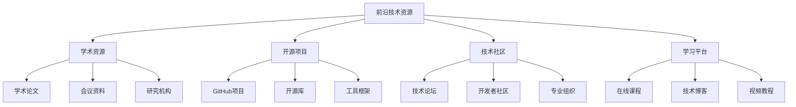

# 前沿技术资源

## 📖 核心概念

**前沿技术资源**是数据结构学习的重要支撑，通过提供最新的技术资讯、学习资源、开源项目和学术论文，帮助学习者跟上技术发展步伐，掌握前沿技术趋势，提升学习效果和实践能力。

### 🏗️ 技术资源的组成要素



## 🔍 资源分类

### 按资源类型分类

| 资源类型 | 特点 | 优势 | 适用人群 | 代表平台 |
|----------|------|------|----------|----------|
| **学术资源** | 理论深度 | 权威性高 | 研究人员 | ACM, IEEE |
| **开源项目** | 实践性强 | 可学习代码 | 开发者 | GitHub, GitLab |
| **技术社区** | 互动性强 | 实时交流 | 学习者 | Stack Overflow |
| **学习平台** | 系统性强 | 结构化学习 | 初学者 | Coursera, edX |

### 按技术领域分类

| 技术领域 | 核心资源 | 前沿方向 | 学习重点 | 应用场景 |
|----------|----------|----------|----------|----------|
| **数据结构** | 算法导论 | 新兴结构 | 理论基础 | 系统设计 |
| **机器学习** | 深度学习 | AI优化 | 算法应用 | 智能系统 |
| **分布式系统** | 微服务 | 云原生 | 架构设计 | 大规模系统 |
| **数据库** | 分布式数据库 | 图数据库 | 存储优化 | 数据管理 |

## 💻 学术资源

### 顶级会议和期刊

```cpp
// 学术资源管理类
class AcademicResourceManager {
private:
    struct AcademicPaper {
        std::string title;
        std::string authors;
        std::string venue;
        int year;
        std::string doi;
        std::string abstract;
        std::vector<std::string> keywords;
        std::string pdfUrl;
        
        AcademicPaper(const std::string& t, const std::string& a, 
                     const std::string& v, int y, const std::string& d)
            : title(t), authors(a), venue(v), year(y), doi(d) {}
    };
    
    std::vector<AcademicPaper> papers;
    std::unordered_map<std::string, std::vector<int>> keywordIndex;
    std::unordered_map<std::string, std::vector<int>> venueIndex;
    
public:
    // 添加学术论文
    void addPaper(const std::string& title, const std::string& authors,
                 const std::string& venue, int year, const std::string& doi,
                 const std::string& abstract = "", 
                 const std::vector<std::string>& keywords = {}) {
        
        papers.emplace_back(title, authors, venue, year, doi);
        papers.back().abstract = abstract;
        papers.back().keywords = keywords;
        
        // 建立索引
        for (const auto& keyword : keywords) {
            keywordIndex[keyword].push_back(papers.size() - 1);
        }
        venueIndex[venue].push_back(papers.size() - 1);
    }
    
    // 按关键词搜索
    std::vector<AcademicPaper> searchByKeyword(const std::string& keyword) const {
        std::vector<AcademicPaper> results;
        auto it = keywordIndex.find(keyword);
        
        if (it != keywordIndex.end()) {
            for (int index : it->second) {
                results.push_back(papers[index]);
            }
        }
        
        return results;
    }
    
    // 按会议/期刊搜索
    std::vector<AcademicPaper> searchByVenue(const std::string& venue) const {
        std::vector<AcademicPaper> results;
        auto it = venueIndex.find(venue);
        
        if (it != venueIndex.end()) {
            for (int index : it->second) {
                results.push_back(papers[index]);
            }
        }
        
        return results;
    }
    
    // 获取最新论文
    std::vector<AcademicPaper> getRecentPapers(int year) const {
        std::vector<AcademicPaper> results;
        
        for (const auto& paper : papers) {
            if (paper.year >= year) {
                results.push_back(paper);
            }
        }
        
        // 按年份排序
        std::sort(results.begin(), results.end(),
                 [](const AcademicPaper& a, const AcademicPaper& b) {
                     return a.year > b.year;
                 });
        
        return results;
    }
    
    // 生成推荐论文
    std::vector<AcademicPaper> getRecommendedPapers(const std::string& interest) const {
        std::vector<AcademicPaper> results;
        
        // 基于兴趣关键词推荐
        auto keywordResults = searchByKeyword(interest);
        results.insert(results.end(), keywordResults.begin(), keywordResults.end());
        
        // 去重
        std::sort(results.begin(), results.end(),
                 [](const AcademicPaper& a, const AcademicPaper& b) {
                     return a.title < b.title;
                 });
        
        results.erase(std::unique(results.begin(), results.end(),
                                [](const AcademicPaper& a, const AcademicPaper& b) {
                                    return a.title == b.title;
                                }), results.end());
        
        return results;
    }
    
    // 获取统计信息
    struct PaperStats {
        int totalPapers;
        int recentPapers;
        std::unordered_map<std::string, int> venueCount;
        std::unordered_map<std::string, int> keywordCount;
    };
    
    PaperStats getStats() const {
        PaperStats stats;
        stats.totalPapers = papers.size();
        
        int currentYear = 2024; // 假设当前年份
        stats.recentPapers = 0;
        
        for (const auto& paper : papers) {
            if (paper.year >= currentYear - 2) {
                stats.recentPapers++;
            }
            
            stats.venueCount[paper.venue]++;
            
            for (const auto& keyword : paper.keywords) {
                stats.keywordCount[keyword]++;
            }
        }
        
        return stats;
    }
};

// 顶级会议和期刊信息
class TopTierVenues {
public:
    static std::vector<std::string> getDataStructureVenues() {
        return {
            "SIGCOMM", "SIGMETRICS", "SIGMOD", "SIGKDD", "SIGIR",
            "SOSP", "OSDI", "NSDI", "FAST", "ATC",
            "ISCA", "MICRO", "ASPLOS", "HPCA", "DAC",
            "ICSE", "FSE", "ASE", "OOPSLA", "PLDI",
            "POPL", "ICFP", "ICLR", "NeurIPS", "ICML"
        };
    }
    
    static std::vector<std::string> getAlgorithmVenues() {
        return {
            "SODA", "FOCS", "STOC", "ICALP", "ESA",
            "WADS", "SWAT", "ISAAC", "COCOON", "LATIN",
            "AAAI", "IJCAI", "UAI", "AAMAS", "KR"
        };
    }
    
    static std::vector<std::string> getSystemVenues() {
        return {
            "SOSP", "OSDI", "NSDI", "FAST", "ATC",
            "EuroSys", "Middleware", "HotOS", "HotNets", "HotCloud",
            "VLDB", "ICDE", "SIGMOD", "CIDR", "DaMoN"
        };
    }
};
```

### 研究机构和实验室

```cpp
class ResearchInstitutionManager {
private:
    struct ResearchLab {
        std::string name;
        std::string institution;
        std::string country;
        std::vector<std::string> researchAreas;
        std::string website;
        std::vector<std::string> keyResearchers;
        
        ResearchLab(const std::string& n, const std::string& inst, 
                   const std::string& c, const std::string& web)
            : name(n), institution(inst), country(c), website(web) {}
    };
    
    std::vector<ResearchLab> labs;
    std::unordered_map<std::string, std::vector<int>> areaIndex;
    
public:
    // 添加研究实验室
    void addLab(const std::string& name, const std::string& institution,
               const std::string& country, const std::string& website,
               const std::vector<std::string>& researchAreas = {},
               const std::vector<std::string>& researchers = {}) {
        
        labs.emplace_back(name, institution, country, website);
        labs.back().researchAreas = researchAreas;
        labs.back().keyResearchers = researchers;
        
        // 建立研究领域索引
        for (const auto& area : researchAreas) {
            areaIndex[area].push_back(labs.size() - 1);
        }
    }
    
    // 按研究领域搜索
    std::vector<ResearchLab> searchByResearchArea(const std::string& area) const {
        std::vector<ResearchLab> results;
        auto it = areaIndex.find(area);
        
        if (it != areaIndex.end()) {
            for (int index : it->second) {
                results.push_back(labs[index]);
            }
        }
        
        return results;
    }
    
    // 按国家搜索
    std::vector<ResearchLab> searchByCountry(const std::string& country) const {
        std::vector<ResearchLab> results;
        
        for (const auto& lab : labs) {
            if (lab.country == country) {
                results.push_back(lab);
            }
        }
        
        return results;
    }
    
    // 获取顶级实验室
    std::vector<ResearchLab> getTopLabs() const {
        // 这里可以根据实际排名数据返回顶级实验室
        std::vector<ResearchLab> topLabs;
        
        for (const auto& lab : labs) {
            // 简单的筛选条件（实际实现会更复杂）
            if (lab.researchAreas.size() >= 3 && lab.keyResearchers.size() >= 5) {
                topLabs.push_back(lab);
            }
        }
        
        return topLabs;
    }
};

// 知名研究机构信息
class FamousInstitutions {
public:
    static std::vector<std::string> getUSInstitutions() {
        return {
            "MIT", "Stanford University", "UC Berkeley", "CMU", "Princeton",
            "Harvard University", "Yale University", "Cornell University",
            "University of Washington", "UCLA", "Caltech", "Columbia University"
        };
    }
    
    static std::vector<std::string> getEuropeanInstitutions() {
        return {
            "ETH Zurich", "EPFL", "University of Cambridge", "University of Oxford",
            "Imperial College London", "TU Delft", "KTH", "INRIA", "Max Planck Institute"
        };
    }
    
    static std::vector<std::string> getAsianInstitutions() {
        return {
            "Tsinghua University", "Peking University", "University of Tokyo",
            "KAIST", "Seoul National University", "NUS", "NTU", "IIT"
        };
    }
};
```

## 💻 开源项目

### GitHub项目管理

```cpp
class GitHubProjectManager {
private:
    struct GitHubProject {
        std::string name;
        std::string owner;
        std::string description;
        std::string language;
        int stars;
        int forks;
        int watchers;
        std::string url;
        std::vector<std::string> topics;
        std::string lastUpdated;
        
        GitHubProject(const std::string& n, const std::string& o, 
                     const std::string& desc, const std::string& lang)
            : name(n), owner(o), description(desc), language(lang), 
              stars(0), forks(0), watchers(0) {}
    };
    
    std::vector<GitHubProject> projects;
    std::unordered_map<std::string, std::vector<int>> languageIndex;
    std::unordered_map<std::string, std::vector<int>> topicIndex;
    
public:
    // 添加GitHub项目
    void addProject(const std::string& name, const std::string& owner,
                   const std::string& description, const std::string& language,
                   int stars = 0, int forks = 0, int watchers = 0,
                   const std::string& url = "", 
                   const std::vector<std::string>& topics = {}) {
        
        projects.emplace_back(name, owner, description, language);
        projects.back().stars = stars;
        projects.back().forks = forks;
        projects.back().watchers = watchers;
        projects.back().url = url;
        projects.back().topics = topics;
        
        // 建立索引
        languageIndex[language].push_back(projects.size() - 1);
        for (const auto& topic : topics) {
            topicIndex[topic].push_back(projects.size() - 1);
        }
    }
    
    // 按编程语言搜索
    std::vector<GitHubProject> searchByLanguage(const std::string& language) const {
        std::vector<GitHubProject> results;
        auto it = languageIndex.find(language);
        
        if (it != languageIndex.end()) {
            for (int index : it->second) {
                results.push_back(projects[index]);
            }
        }
        
        return results;
    }
    
    // 按主题搜索
    std::vector<GitHubProject> searchByTopic(const std::string& topic) const {
        std::vector<GitHubProject> results;
        auto it = topicIndex.find(topic);
        
        if (it != topicIndex.end()) {
            for (int index : it->second) {
                results.push_back(projects[index]);
            }
        }
        
        return results;
    }
    
    // 获取热门项目
    std::vector<GitHubProject> getTrendingProjects(int minStars = 1000) const {
        std::vector<GitHubProject> results;
        
        for (const auto& project : projects) {
            if (project.stars >= minStars) {
                results.push_back(project);
            }
        }
        
        // 按星数排序
        std::sort(results.begin(), results.end(),
                 [](const GitHubProject& a, const GitHubProject& b) {
                     return a.stars > b.stars;
                 });
        
        return results;
    }
    
    // 获取推荐项目
    std::vector<GitHubProject> getRecommendedProjects(const std::string& interest) const {
        std::vector<GitHubProject> results;
        
        // 基于兴趣主题推荐
        auto topicResults = searchByTopic(interest);
        results.insert(results.end(), topicResults.begin(), topicResults.end());
        
        // 去重
        std::sort(results.begin(), results.end(),
                 [](const GitHubProject& a, const GitHubProject& b) {
                     return a.name < b.name;
                 });
        
        results.erase(std::unique(results.begin(), results.end(),
                                [](const GitHubProject& a, const GitHubProject& b) {
                                    return a.name == b.name;
                                }), results.end());
        
        return results;
    }
};

// 知名开源项目信息
class FamousOpenSourceProjects {
public:
    static std::vector<std::string> getDataStructureProjects() {
        return {
            "facebook/folly", "google/abseil-cpp", "microsoft/GSL",
            "boostorg/boost", "apache/arrow", "facebook/rocksdb",
            "redis/redis", "mongodb/mongo", "postgres/postgres"
        };
    }
    
    static std::vector<std::string> getAlgorithmProjects() {
        return {
            "google/or-tools", "facebook/faiss", "microsoft/CNTK",
            "tensorflow/tensorflow", "pytorch/pytorch", "apache/spark",
            "apache/hadoop", "apache/kafka", "apache/flink"
        };
    }
    
    static std::vector<std::string> getSystemProjects() {
        return {
            "kubernetes/kubernetes", "docker/docker", "etcd-io/etcd",
            "prometheus/prometheus", "grafana/grafana", "istio/istio",
            "envoyproxy/envoy", "grpc/grpc", "protocolbuffers/protobuf"
        };
    }
};
```

### 开源库和框架

```cpp
class OpenSourceLibraryManager {
private:
    struct Library {
        std::string name;
        std::string category;
        std::string description;
        std::string language;
        std::string license;
        std::string documentation;
        std::string repository;
        std::vector<std::string> features;
        
        Library(const std::string& n, const std::string& cat, 
               const std::string& desc, const std::string& lang)
            : name(n), category(cat), description(desc), language(lang) {}
    };
    
    std::vector<Library> libraries;
    std::unordered_map<std::string, std::vector<int>> categoryIndex;
    
public:
    // 添加开源库
    void addLibrary(const std::string& name, const std::string& category,
                   const std::string& description, const std::string& language,
                   const std::string& license = "", const std::string& doc = "",
                   const std::string& repo = "", 
                   const std::vector<std::string>& features = {}) {
        
        libraries.emplace_back(name, category, description, language);
        libraries.back().license = license;
        libraries.back().documentation = doc;
        libraries.back().repository = repo;
        libraries.back().features = features;
        
        categoryIndex[category].push_back(libraries.size() - 1);
    }
    
    // 按类别搜索
    std::vector<Library> searchByCategory(const std::string& category) const {
        std::vector<Library> results;
        auto it = categoryIndex.find(category);
        
        if (it != categoryIndex.end()) {
            for (int index : it->second) {
                results.push_back(libraries[index]);
            }
        }
        
        return results;
    }
    
    // 按编程语言搜索
    std::vector<Library> searchByLanguage(const std::string& language) const {
        std::vector<Library> results;
        
        for (const auto& library : libraries) {
            if (library.language == language) {
                results.push_back(library);
            }
        }
        
        return results;
    }
    
    // 获取推荐库
    std::vector<Library> getRecommendedLibraries(const std::string& useCase) const {
        std::vector<Library> results;
        
        // 基于用例推荐
        for (const auto& library : libraries) {
            for (const auto& feature : library.features) {
                if (feature.find(useCase) != std::string::npos) {
                    results.push_back(library);
                    break;
                }
            }
        }
        
        return results;
    }
};

// 知名开源库信息
class FamousLibraries {
public:
    static std::vector<std::string> getCppLibraries() {
        return {
            "Boost", "Eigen", "OpenCV", "Qt", "Poco",
            "Catch2", "Google Test", "spdlog", "fmt", "nlohmann/json"
        };
    }
    
    static std::vector<std::string> getPythonLibraries() {
        return {
            "NumPy", "Pandas", "Matplotlib", "Scikit-learn", "TensorFlow",
            "PyTorch", "Django", "Flask", "FastAPI", "Requests"
        };
    }
    
    static std::vector<std::string> getJavaLibraries() {
        return {
            "Spring Framework", "Hibernate", "Apache Commons", "Guava",
            "Jackson", "Logback", "JUnit", "Mockito", "Maven", "Gradle"
        };
    }
};
```

## 🎯 技术社区

### 开发者社区管理

```cpp
class DeveloperCommunityManager {
private:
    struct Community {
        std::string name;
        std::string platform;
        std::string description;
        std::string url;
        int memberCount;
        std::vector<std::string> topics;
        std::string language;
        
        Community(const std::string& n, const std::string& p, 
                 const std::string& desc, const std::string& u)
            : name(n), platform(p), description(desc), url(u), memberCount(0) {}
    };
    
    std::vector<Community> communities;
    std::unordered_map<std::string, std::vector<int>> platformIndex;
    std::unordered_map<std::string, std::vector<int>> topicIndex;
    
public:
    // 添加开发者社区
    void addCommunity(const std::string& name, const std::string& platform,
                     const std::string& description, const std::string& url,
                     int memberCount = 0, const std::vector<std::string>& topics = {},
                     const std::string& language = "") {
        
        communities.emplace_back(name, platform, description, url);
        communities.back().memberCount = memberCount;
        communities.back().topics = topics;
        communities.back().language = language;
        
        platformIndex[platform].push_back(communities.size() - 1);
        for (const auto& topic : topics) {
            topicIndex[topic].push_back(communities.size() - 1);
        }
    }
    
    // 按平台搜索
    std::vector<Community> searchByPlatform(const std::string& platform) const {
        std::vector<Community> results;
        auto it = platformIndex.find(platform);
        
        if (it != platformIndex.end()) {
            for (int index : it->second) {
                results.push_back(communities[index]);
            }
        }
        
        return results;
    }
    
    // 按主题搜索
    std::vector<Community> searchByTopic(const std::string& topic) const {
        std::vector<Community> results;
        auto it = topicIndex.find(topic);
        
        if (it != topicIndex.end()) {
            for (int index : it->second) {
                results.push_back(communities[index]);
            }
        }
        
        return results;
    }
    
    // 获取活跃社区
    std::vector<Community> getActiveCommunities(int minMembers = 10000) const {
        std::vector<Community> results;
        
        for (const auto& community : communities) {
            if (community.memberCount >= minMembers) {
                results.push_back(community);
            }
        }
        
        // 按成员数排序
        std::sort(results.begin(), results.end(),
                 [](const Community& a, const Community& b) {
                     return a.memberCount > b.memberCount;
                 });
        
        return results;
    }
};

// 知名技术社区信息
class FamousCommunities {
public:
    static std::vector<std::string> getQAACommunities() {
        return {
            "Stack Overflow", "Stack Exchange", "Reddit Programming",
            "Quora", "Dev.to", "Hashnode", "Medium"
        };
    }
    
    static std::vector<std::string> getForumCommunities() {
        return {
            "Hacker News", "Reddit", "Slashdot", "Ars Technica",
            "TechCrunch", "Wired", "The Verge"
        };
    }
    
    static std::vector<std::string> getSocialCommunities() {
        return {
            "GitHub", "GitLab", "Bitbucket", "LinkedIn",
            "Twitter", "Discord", "Slack", "Telegram"
        };
    }
};
```

## ⚡ 学习平台

### 在线课程管理

```cpp
class OnlineCourseManager {
private:
    struct Course {
        std::string title;
        std::string instructor;
        std::string platform;
        std::string description;
        std::string level;
        int duration; // 小时
        double rating;
        int students;
        std::string language;
        std::vector<std::string> topics;
        
        Course(const std::string& t, const std::string& inst, 
               const std::string& p, const std::string& desc)
            : title(t), instructor(inst), platform(p), description(desc),
              duration(0), rating(0), students(0) {}
    };
    
    std::vector<Course> courses;
    std::unordered_map<std::string, std::vector<int>> platformIndex;
    std::unordered_map<std::string, std::vector<int>> topicIndex;
    
public:
    // 添加在线课程
    void addCourse(const std::string& title, const std::string& instructor,
                  const std::string& platform, const std::string& description,
                  const std::string& level = "", int duration = 0, double rating = 0,
                  int students = 0, const std::string& language = "",
                  const std::vector<std::string>& topics = {}) {
        
        courses.emplace_back(title, instructor, platform, description);
        courses.back().level = level;
        courses.back().duration = duration;
        courses.back().rating = rating;
        courses.back().students = students;
        courses.back().language = language;
        courses.back().topics = topics;
        
        platformIndex[platform].push_back(courses.size() - 1);
        for (const auto& topic : topics) {
            topicIndex[topic].push_back(courses.size() - 1);
        }
    }
    
    // 按平台搜索
    std::vector<Course> searchByPlatform(const std::string& platform) const {
        std::vector<Course> results;
        auto it = platformIndex.find(platform);
        
        if (it != platformIndex.end()) {
            for (int index : it->second) {
                results.push_back(courses[index]);
            }
        }
        
        return results;
    }
    
    // 按主题搜索
    std::vector<Course> searchByTopic(const std::string& topic) const {
        std::vector<Course> results;
        auto it = topicIndex.find(topic);
        
        if (it != topicIndex.end()) {
            for (int index : it->second) {
                results.push_back(courses[index]);
            }
        }
        
        return results;
    }
    
    // 获取高评分课程
    std::vector<Course> getTopRatedCourses(double minRating = 4.0) const {
        std::vector<Course> results;
        
        for (const auto& course : courses) {
            if (course.rating >= minRating) {
                results.push_back(course);
            }
        }
        
        // 按评分排序
        std::sort(results.begin(), results.end(),
                 [](const Course& a, const Course& b) {
                     return a.rating > b.rating;
                 });
        
        return results;
    }
    
    // 获取推荐课程
    std::vector<Course> getRecommendedCourses(const std::string& interest) const {
        std::vector<Course> results;
        
        // 基于兴趣主题推荐
        auto topicResults = searchByTopic(interest);
        results.insert(results.end(), topicResults.begin(), topicResults.end());
        
        // 去重
        std::sort(results.begin(), results.end(),
                 [](const Course& a, const Course& b) {
                     return a.title < b.title;
                 });
        
        results.erase(std::unique(results.begin(), results.end(),
                                [](const Course& a, const Course& b) {
                                    return a.title == b.title;
                                }), results.end());
        
        return results;
    }
};

// 知名在线学习平台
class FamousLearningPlatforms {
public:
    static std::vector<std::string> getMOOCPlatforms() {
        return {
            "Coursera", "edX", "Udacity", "Udemy", "Khan Academy",
            "MIT OpenCourseWare", "Stanford Online", "Harvard Online"
        };
    }
    
    static std::vector<std::string> getCodingPlatforms() {
        return {
            "LeetCode", "HackerRank", "Codeforces", "AtCoder",
            "TopCoder", "CodeChef", "SPOJ", "UVa Online Judge"
        };
    }
    
    static std::vector<std::string> getVideoPlatforms() {
        return {
            "YouTube", "Vimeo", "Bilibili", "TED", "Khan Academy"
        };
    }
};
```

## ⚡ 复杂度分析

### 资源管理复杂度

| 资源类型 | 搜索复杂度 | 存储复杂度 | 更新复杂度 | 推荐复杂度 |
|----------|------------|------------|------------|------------|
| **学术资源** | O(n) | O(n) | O(1) | O(n) |
| **开源项目** | O(n) | O(n) | O(1) | O(n) |
| **技术社区** | O(n) | O(n) | O(1) | O(n) |
| **学习平台** | O(n) | O(n) | O(1) | O(n) |

### 资源质量评估

| 评估维度 | 学术资源 | 开源项目 | 技术社区 | 学习平台 |
|----------|----------|----------|----------|----------|
| **权威性** | 高 | 中等 | 低 | 中等 |
| **时效性** | 中等 | 高 | 高 | 中等 |
| **实用性** | 中等 | 高 | 高 | 高 |
| **可访问性** | 低 | 高 | 高 | 高 |

## 🎓 学习要点总结

### 核心理解

1. **资源分类**：理解不同类型资源的特点和用途
2. **质量评估**：掌握资源质量的评估方法
3. **搜索策略**：学会高效搜索和筛选资源
4. **推荐系统**：理解个性化推荐的工作原理

### 实践要点

1. **资源收集**：建立个人资源库
2. **定期更新**：保持资源的时效性
3. **质量筛选**：筛选高质量资源
4. **分享交流**：与他人分享优质资源

### 应用思维

1. **学习规划**：制定基于资源的学习计划
2. **技能提升**：利用资源提升专业技能
3. **项目实践**：将资源应用到实际项目中
4. **持续学习**：建立持续学习的资源体系

---

**相关链接：**
- [[08-知识边疆/01-前沿探索/01-新兴数据结构|新兴数据结构]] - 前沿技术基础
- [[08-知识边疆/02-跨界融合/01-数据结构与AI|数据结构与AI]] - 跨界融合应用
- [[08-知识边疆/03-学习资源/02-学习路径推荐|学习路径推荐]] - 学习路径规划
- [[00-学习枢纽/03-📊-学习进度跟踪|学习进度跟踪]] - 学习进度管理
