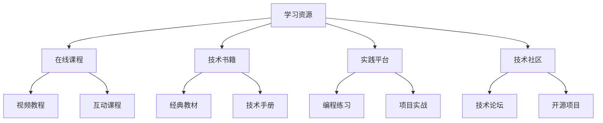

# 学习资源

## 📖 核心概念

**学习资源**是数据结构学习的重要支撑，包括优质的学习材料、实践平台、技术社区等。合理利用学习资源可以显著提升学习效果。

### 🏗️ 资源类型



## 🔧 在线学习平台

### 课程推荐

```cpp
class OnlineLearningPlatform {
private:
    struct Course {
        string name;
        string platform;
        string instructor;
        double rating;
        int duration;
        string difficulty;
        vector<string> topics;
        
        Course(const string& n, const string& p, const string& i) 
            : name(n), platform(p), instructor(i), rating(0), duration(0), difficulty("beginner") {}
    };
    
    vector<Course> courses;
    
public:
    OnlineLearningPlatform() {
        initializeCourses();
    }
    
    void initializeCourses() {
        // 数据结构基础课程
        Course course1("数据结构与算法", "Coursera", "Robert Sedgewick");
        course1.rating = 4.8;
        course1.duration = 40;
        course1.difficulty = "intermediate";
        course1.topics = {"数组", "链表", "栈", "队列", "树", "图"};
        courses.push_back(course1);
        
        // 算法设计课程
        Course course2("算法设计与分析", "edX", "Tim Roughgarden");
        course2.rating = 4.7;
        course2.duration = 35;
        course2.difficulty = "advanced";
        course2.topics = {"分治法", "动态规划", "贪心算法", "图算法"};
        courses.push_back(course2);
        
        // 系统设计课程
        Course course3("系统设计与架构", "Udacity", "Gayle McDowell");
        course3.rating = 4.6;
        course3.duration = 30;
        course3.difficulty = "advanced";
        course3.topics = {"分布式系统", "数据库设计", "缓存系统", "负载均衡"};
        courses.push_back(course3);
    }
    
    // 推荐课程
    vector<Course> recommendCourses(const string& level, const vector<string>& interests) {
        vector<Course> recommendations;
        
        for (const auto& course : courses) {
            if (course.difficulty == level) {
                bool hasInterest = false;
                for (const string& interest : interests) {
                    if (find(course.topics.begin(), course.topics.end(), interest) != course.topics.end()) {
                        hasInterest = true;
                        break;
                    }
                }
                
                if (hasInterest) {
                    recommendations.push_back(course);
                }
            }
        }
        
        // 按评分排序
        sort(recommendations.begin(), recommendations.end(), 
             [](const Course& a, const Course& b) {
                 return a.rating > b.rating;
             });
        
        return recommendations;
    }
    
    // 显示课程信息
    void displayCourses() {
        cout << "Available Courses:" << endl;
        cout << "==================" << endl;
        
        for (const auto& course : courses) {
            cout << "Course: " << course.name << endl;
            cout << "  Platform: " << course.platform << endl;
            cout << "  Instructor: " << course.instructor << endl;
            cout << "  Rating: " << course.rating << "/5.0" << endl;
            cout << "  Duration: " << course.duration << " hours" << endl;
            cout << "  Difficulty: " << course.difficulty << endl;
            cout << "  Topics: ";
            for (const string& topic : course.topics) {
                cout << topic << " ";
            }
            cout << endl << endl;
        }
    }
    
    // 学习路径规划
    vector<string> createLearningPath(const string& goal) {
        vector<string> path;
        
        if (goal == "数据结构基础") {
            path = {"数组和链表", "栈和队列", "树结构", "图结构", "排序算法", "搜索算法"};
        } else if (goal == "算法竞赛") {
            path = {"基础算法", "数据结构应用", "动态规划", "图论算法", "数学算法", "高级技巧"};
        } else if (goal == "系统设计") {
            path = {"基础数据结构", "数据库设计", "分布式系统", "缓存策略", "负载均衡", "性能优化"};
        }
        
        return path;
    }
};
```

### 学习进度跟踪

```cpp
class LearningProgressTracker {
private:
    struct LearningGoal {
        string name;
        string description;
        int targetHours;
        int completedHours;
        string status;
        time_t startDate;
        time_t targetDate;
        
        LearningGoal(const string& n, const string& d, int hours) 
            : name(n), description(d), targetHours(hours), completedHours(0), 
              status("not_started"), startDate(0), targetDate(0) {}
    };
    
    vector<LearningGoal> goals;
    map<string, int> dailyProgress;
    
public:
    LearningProgressTracker() {}
    
    // 添加学习目标
    void addGoal(const string& name, const string& description, int targetHours) {
        LearningGoal goal(name, description, targetHours);
        goals.push_back(goal);
    }
    
    // 开始学习
    void startLearning(const string& goalName) {
        for (auto& goal : goals) {
            if (goal.name == goalName) {
                goal.status = "in_progress";
                goal.startDate = time(nullptr);
                goal.targetDate = goal.startDate + (goal.targetHours * 3600); // 假设每天1小时
                break;
            }
        }
    }
    
    // 记录学习进度
    void recordProgress(const string& goalName, int hours) {
        for (auto& goal : goals) {
            if (goal.name == goalName) {
                goal.completedHours += hours;
                
                if (goal.completedHours >= goal.targetHours) {
                    goal.status = "completed";
                }
                
                break;
            }
        }
        
        // 记录每日进度
        time_t today = time(nullptr);
        string dateStr = ctime(&today);
        dailyProgress[dateStr] += hours;
    }
    
    // 计算学习效率
    double calculateEfficiency(const string& goalName) {
        for (const auto& goal : goals) {
            if (goal.name == goalName) {
                if (goal.targetHours == 0) return 0.0;
                return (double)goal.completedHours / goal.targetHours * 100;
            }
        }
        return 0.0;
    }
    
    // 预测完成时间
    time_t predictCompletionTime(const string& goalName) {
        for (const auto& goal : goals) {
            if (goal.name == goalName) {
                if (goal.completedHours == 0) return goal.targetDate;
                
                double hoursPerDay = (double)goal.completedHours / 
                                   ((time(nullptr) - goal.startDate) / 86400.0 + 1);
                int remainingHours = goal.targetHours - goal.completedHours;
                int remainingDays = (int)(remainingHours / hoursPerDay);
                
                return time(nullptr) + (remainingDays * 86400);
            }
        }
        return 0;
    }
    
    // 显示学习报告
    void displayProgressReport() {
        cout << "Learning Progress Report:" << endl;
        cout << "========================" << endl;
        
        for (const auto& goal : goals) {
            cout << "Goal: " << goal.name << endl;
            cout << "  Description: " << goal.description << endl;
            cout << "  Progress: " << goal.completedHours << "/" << goal.targetHours << " hours" << endl;
            cout << "  Efficiency: " << calculateEfficiency(goal.name) << "%" << endl;
            cout << "  Status: " << goal.status << endl;
            
            if (goal.status == "in_progress") {
                time_t completionTime = predictCompletionTime(goal.name);
                cout << "  Predicted completion: " << ctime(&completionTime);
            }
            
            cout << endl;
        }
        
        // 显示每日进度
        cout << "Daily Progress:" << endl;
        for (const auto& pair : dailyProgress) {
            cout << "  " << pair.first << ": " << pair.second << " hours" << endl;
        }
    }
};
```

## 🎯 技术书籍推荐

### 经典教材

```cpp
class TechnicalBooks {
private:
    struct Book {
        string title;
        string author;
        string publisher;
        int year;
        double rating;
        string difficulty;
        vector<string> topics;
        string description;
        
        Book(const string& t, const string& a, const string& p, int y) 
            : title(t), author(a), publisher(p), year(y), rating(0), difficulty("beginner") {}
    };
    
    vector<Book> books;
    
public:
    TechnicalBooks() {
        initializeBooks();
    }
    
    void initializeBooks() {
        // 数据结构经典教材
        Book book1("算法导论", "Thomas H. Cormen", "MIT Press", 2009);
        book1.rating = 4.8;
        book1.difficulty = "advanced";
        book1.topics = {"算法分析", "数据结构", "算法设计", "图算法"};
        book1.description = "计算机科学领域的经典教材，深入讲解算法设计和分析";
        books.push_back(book1);
        
        // 数据结构基础
        Book book2("数据结构与算法分析", "Mark Allen Weiss", "Pearson", 2011);
        book2.rating = 4.6;
        book2.difficulty = "intermediate";
        book2.topics = {"数据结构", "算法分析", "C++实现", "算法设计"};
        book2.description = "数据结构学习的优秀教材，理论与实践并重";
        books.push_back(book2);
        
        // 算法竞赛
        Book book3("算法竞赛入门经典", "刘汝佳", "清华大学出版社", 2014);
        book3.rating = 4.7;
        book3.difficulty = "intermediate";
        book3.topics = {"算法竞赛", "数据结构", "算法技巧", "编程实践"};
        book3.description = "算法竞赛学习的经典教材，适合竞赛选手";
        books.push_back(book3);
        
        // 系统设计
        Book book4("设计数据密集型应用", "Martin Kleppmann", "O'Reilly", 2017);
        book4.rating = 4.9;
        book4.difficulty = "advanced";
        book4.topics = {"分布式系统", "数据库设计", "系统架构", "数据存储"};
        book4.description = "现代分布式系统设计的权威指南";
        books.push_back(book4);
    }
    
    // 推荐书籍
    vector<Book> recommendBooks(const string& level, const vector<string>& interests) {
        vector<Book> recommendations;
        
        for (const auto& book : books) {
            if (book.difficulty == level) {
                bool hasInterest = false;
                for (const string& interest : interests) {
                    if (find(book.topics.begin(), book.topics.end(), interest) != book.topics.end()) {
                        hasInterest = true;
                        break;
                    }
                }
                
                if (hasInterest) {
                    recommendations.push_back(book);
                }
            }
        }
        
        // 按评分排序
        sort(recommendations.begin(), recommendations.end(), 
             [](const Book& a, const Book& b) {
                 return a.rating > b.rating;
             });
        
        return recommendations;
    }
    
    // 显示书籍信息
    void displayBooks() {
        cout << "Recommended Books:" << endl;
        cout << "==================" << endl;
        
        for (const auto& book : books) {
            cout << "Title: " << book.title << endl;
            cout << "  Author: " << book.author << endl;
            cout << "  Publisher: " << book.publisher << endl;
            cout << "  Year: " << book.year << endl;
            cout << "  Rating: " << book.rating << "/5.0" << endl;
            cout << "  Difficulty: " << book.difficulty << endl;
            cout << "  Topics: ";
            for (const string& topic : book.topics) {
                cout << topic << " ";
            }
            cout << endl;
            cout << "  Description: " << book.description << endl;
            cout << endl;
        }
    }
    
    // 创建阅读计划
    vector<string> createReadingPlan(const string& goal) {
        vector<string> plan;
        
        if (goal == "数据结构基础") {
            plan = {"算法导论 - 第1-3章", "数据结构与算法分析 - 第1-4章", 
                   "算法竞赛入门经典 - 第1-2章"};
        } else if (goal == "算法竞赛") {
            plan = {"算法竞赛入门经典 - 全书", "算法导论 - 第4-6章", 
                   "数据结构与算法分析 - 第5-8章"};
        } else if (goal == "系统设计") {
            plan = {"设计数据密集型应用 - 第1-3章", "算法导论 - 第7-9章", 
                   "数据结构与算法分析 - 第9-12章"};
        }
        
        return plan;
    }
};
```

## 📊 实践平台

### 编程练习平台

```cpp
class ProgrammingPracticePlatform {
private:
    struct Problem {
        string title;
        string difficulty;
        vector<string> tags;
        string description;
        int acceptanceRate;
        int totalSubmissions;
        
        Problem(const string& t, const string& d) : title(t), difficulty(d), 
                                                   acceptanceRate(0), totalSubmissions(0) {}
    };
    
    vector<Problem> problems;
    map<string, int> userStats;
    
public:
    ProgrammingPracticePlatform() {
        initializeProblems();
    }
    
    void initializeProblems() {
        // LeetCode风格题目
        Problem problem1("两数之和", "简单");
        problem1.tags = {"数组", "哈希表"};
        problem1.description = "给定一个整数数组和一个目标值，找出数组中和为目标值的两个数";
        problem1.acceptanceRate = 45;
        problem1.totalSubmissions = 1000000;
        problems.push_back(problem1);
        
        Problem problem2("反转链表", "简单");
        problem2.tags = {"链表", "递归"};
        problem2.description = "反转一个单链表";
        problem2.acceptanceRate = 60;
        problem2.totalSubmissions = 800000;
        problems.push_back(problem2);
        
        Problem problem3("最长递增子序列", "中等");
        problem3.tags = {"动态规划", "二分查找"};
        problem3.description = "给定一个无序的整数数组，找到其中最长上升子序列的长度";
        problem3.acceptanceRate = 35;
        problem3.totalSubmissions = 500000;
        problems.push_back(problem3);
        
        Problem problem4("岛屿数量", "中等");
        problem4.tags = {"深度优先搜索", "广度优先搜索", "并查集"};
        problem4.description = "给定一个由'1'和'0'组成的二维网格，计算岛屿的数量";
        problem4.acceptanceRate = 40;
        problem4.totalSubmissions = 600000;
        problems.push_back(problem4);
    }
    
    // 推荐题目
    vector<Problem> recommendProblems(const string& level, const vector<string>& tags) {
        vector<Problem> recommendations;
        
        for (const auto& problem : problems) {
            if (problem.difficulty == level) {
                bool hasTag = false;
                for (const string& tag : tags) {
                    if (find(problem.tags.begin(), problem.tags.end(), tag) != problem.tags.end()) {
                        hasTag = true;
                        break;
                    }
                }
                
                if (hasTag) {
                    recommendations.push_back(problem);
                }
            }
        }
        
        // 按通过率排序
        sort(recommendations.begin(), recommendations.end(), 
             [](const Problem& a, const Problem& b) {
                 return a.acceptanceRate > b.acceptanceRate;
             });
        
        return recommendations;
    }
    
    // 提交解决方案
    void submitSolution(const string& problemTitle, const string& solution, bool isCorrect) {
        for (auto& problem : problems) {
            if (problem.title == problemTitle) {
                problem.totalSubmissions++;
                if (isCorrect) {
                    problem.acceptanceRate = (problem.acceptanceRate * (problem.totalSubmissions - 1) + 100) / problem.totalSubmissions;
                } else {
                    problem.acceptanceRate = (problem.acceptanceRate * (problem.totalSubmissions - 1)) / problem.totalSubmissions;
                }
                break;
            }
        }
        
        // 更新用户统计
        if (isCorrect) {
            userStats["solved"]++;
        } else {
            userStats["attempted"]++;
        }
    }
    
    // 显示题目信息
    void displayProblems() {
        cout << "Available Problems:" << endl;
        cout << "==================" << endl;
        
        for (const auto& problem : problems) {
            cout << "Title: " << problem.title << endl;
            cout << "  Difficulty: " << problem.difficulty << endl;
            cout << "  Tags: ";
            for (const string& tag : problem.tags) {
                cout << tag << " ";
            }
            cout << endl;
            cout << "  Description: " << problem.description << endl;
            cout << "  Acceptance Rate: " << problem.acceptanceRate << "%" << endl;
            cout << "  Total Submissions: " << problem.totalSubmissions << endl;
            cout << endl;
        }
    }
    
    // 显示用户统计
    void displayUserStats() {
        cout << "User Statistics:" << endl;
        cout << "================" << endl;
        cout << "Problems Solved: " << userStats["solved"] << endl;
        cout << "Problems Attempted: " << userStats["attempted"] << endl;
        
        if (userStats["attempted"] > 0) {
            double successRate = (double)userStats["solved"] / userStats["attempted"] * 100;
            cout << "Success Rate: " << successRate << "%" << endl;
        }
    }
    
    // 创建练习计划
    vector<string> createPracticePlan(const string& goal) {
        vector<string> plan;
        
        if (goal == "数据结构基础") {
            plan = {"两数之和", "反转链表", "有效的括号", "合并两个有序链表"};
        } else if (goal == "算法竞赛") {
            plan = {"最长递增子序列", "岛屿数量", "编辑距离", "零钱兑换"};
        } else if (goal == "系统设计") {
            plan = {"LRU缓存", "设计循环队列", "滑动窗口最大值", "数据流中的中位数"};
        }
        
        return plan;
    }
};
```

## 🎮 技术社区

### 开源项目

```cpp
class OpenSourceProjects {
private:
    struct Project {
        string name;
        string description;
        string language;
        int stars;
        int forks;
        string license;
        vector<string> contributors;
        
        Project(const string& n, const string& d, const string& lang) 
            : name(n), description(d), language(lang), stars(0), forks(0) {}
    };
    
    vector<Project> projects;
    
public:
    OpenSourceProjects() {
        initializeProjects();
    }
    
    void initializeProjects() {
        // 数据结构相关项目
        Project project1("Algorithms", "Collection of algorithms and data structures", "C++");
        project1.stars = 15000;
        project1.forks = 3000;
        project1.license = "MIT";
        project1.contributors = {"Contributor1", "Contributor2", "Contributor3"};
        projects.push_back(project1);
        
        Project project2("LeetCode", "LeetCode solutions in various languages", "Python");
        project2.stars = 20000;
        project2.forks = 5000;
        project2.license = "MIT";
        project2.contributors = {"Contributor1", "Contributor2", "Contributor3"};
        projects.push_back(project2);
        
        Project project3("Data Structures", "Implementation of common data structures", "Java");
        project3.stars = 8000;
        project3.forks = 1500;
        project3.license = "Apache 2.0";
        project3.contributors = {"Contributor1", "Contributor2", "Contributor3"};
        projects.push_back(project3);
    }
    
    // 推荐项目
    vector<Project> recommendProjects(const string& language, const string& interest) {
        vector<Project> recommendations;
        
        for (const auto& project : projects) {
            if (project.language == language) {
                if (project.description.find(interest) != string::npos) {
                    recommendations.push_back(project);
                }
            }
        }
        
        // 按星数排序
        sort(recommendations.begin(), recommendations.end(), 
             [](const Project& a, const Project& b) {
                 return a.stars > b.stars;
             });
        
        return recommendations;
    }
    
    // 显示项目信息
    void displayProjects() {
        cout << "Open Source Projects:" << endl;
        cout << "====================" << endl;
        
        for (const auto& project : projects) {
            cout << "Name: " << project.name << endl;
            cout << "  Description: " << project.description << endl;
            cout << "  Language: " << project.language << endl;
            cout << "  Stars: " << project.stars << endl;
            cout << "  Forks: " << project.forks << endl;
            cout << "  License: " << project.license << endl;
            cout << "  Contributors: ";
            for (const string& contributor : project.contributors) {
                cout << contributor << " ";
            }
            cout << endl << endl;
        }
    }
    
    // 贡献指南
    void displayContributionGuide() {
        cout << "Contribution Guide:" << endl;
        cout << "==================" << endl;
        cout << "1. Fork the repository" << endl;
        cout << "2. Create a feature branch" << endl;
        cout << "3. Make your changes" << endl;
        cout << "4. Add tests if applicable" << endl;
        cout << "5. Submit a pull request" << endl;
        cout << "6. Wait for review and feedback" << endl;
    }
};
```

### 技术论坛

```cpp
class TechnicalForum {
private:
    struct Post {
        string title;
        string author;
        string content;
        int views;
        int likes;
        vector<string> tags;
        time_t timestamp;
        
        Post(const string& t, const string& a, const string& c) 
            : title(t), author(a), content(c), views(0), likes(0), timestamp(time(nullptr)) {}
    };
    
    vector<Post> posts;
    
public:
    TechnicalForum() {
        initializePosts();
    }
    
    void initializePosts() {
        // 技术讨论帖子
        Post post1("数据结构学习心得", "User1", "分享一些数据结构学习的心得体会");
        post1.views = 1000;
        post1.likes = 50;
        post1.tags = {"数据结构", "学习心得", "经验分享"};
        posts.push_back(post1);
        
        Post post2("算法竞赛技巧", "User2", "介绍一些算法竞赛中的实用技巧");
        post2.views = 800;
        post2.likes = 40;
        post2.tags = {"算法竞赛", "技巧", "编程"};
        posts.push_back(post2);
        
        Post post3("系统设计面试准备", "User3", "如何准备系统设计面试");
        post3.views = 1200;
        post3.likes = 60;
        post3.tags = {"系统设计", "面试", "准备"};
        posts.push_back(post3);
    }
    
    // 搜索帖子
    vector<Post> searchPosts(const string& keyword) {
        vector<Post> results;
        
        for (const auto& post : posts) {
            if (post.title.find(keyword) != string::npos || 
                post.content.find(keyword) != string::npos) {
                results.push_back(post);
            }
        }
        
        // 按浏览量排序
        sort(results.begin(), results.end(), 
             [](const Post& a, const Post& b) {
                 return a.views > b.views;
             });
        
        return results;
    }
    
    // 显示热门帖子
    void displayPopularPosts() {
        cout << "Popular Posts:" << endl;
        cout << "=============" << endl;
        
        // 按浏览量排序
        vector<Post> sortedPosts = posts;
        sort(sortedPosts.begin(), sortedPosts.end(), 
             [](const Post& a, const Post& b) {
                 return a.views > b.views;
             });
        
        for (const auto& post : sortedPosts) {
            cout << "Title: " << post.title << endl;
            cout << "  Author: " << post.author << endl;
            cout << "  Views: " << post.views << endl;
            cout << "  Likes: " << post.likes << endl;
            cout << "  Tags: ";
            for (const string& tag : post.tags) {
                cout << tag << " ";
            }
            cout << endl;
            cout << "  Posted: " << ctime(&post.timestamp);
            cout << endl;
        }
    }
    
    // 创建新帖子
    void createPost(const string& title, const string& author, const string& content, const vector<string>& tags) {
        Post post(title, author, content);
        post.tags = tags;
        posts.push_back(post);
        
        cout << "Post created successfully!" << endl;
    }
    
    // 显示论坛统计
    void displayForumStats() {
        cout << "Forum Statistics:" << endl;
        cout << "================" << endl;
        cout << "Total Posts: " << posts.size() << endl;
        
        int totalViews = 0;
        int totalLikes = 0;
        
        for (const auto& post : posts) {
            totalViews += post.views;
            totalLikes += post.likes;
        }
        
        cout << "Total Views: " << totalViews << endl;
        cout << "Total Likes: " << totalLikes << endl;
        
        if (!posts.empty()) {
            cout << "Average Views per Post: " << totalViews / posts.size() << endl;
            cout << "Average Likes per Post: " << totalLikes / posts.size() << endl;
        }
    }
};
```

## 🔗 相关链接

- [[01-前沿探索|前沿探索]]
- [[02-跨界融合|跨界融合]]

## 💡 学习资源要点

1. **在线课程**：系统化学习数据结构知识
2. **技术书籍**：深入理解理论基础
3. **实践平台**：提升编程实践能力
4. **技术社区**：交流学习心得和经验

---

*📝 资源提示：合理利用学习资源可以显著提升学习效果，建议结合多种资源进行学习*