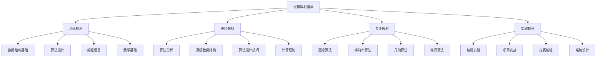

# 经典教材推荐

## 📖 核心概念

**经典教材推荐**是数据结构与算法学习的重要资源指南，通过系统性的教材学习，可以建立扎实的理论基础和实践能力。经典教材涵盖了从基础概念到高级应用的完整知识体系，是深入学习数据结构与算法的必备资源。

### 🏗️ 经典教材分类



## 🔧 经典教材推荐

### 基础教材

#### 1. 《算法导论》(Introduction to Algorithms)
**作者**: Thomas H. Cormen, Charles E. Leiserson, Ronald L. Rivest, Clifford Stein
**出版社**: MIT Press
**推荐指数**: ⭐⭐⭐⭐⭐

**内容特点**:
- 全面覆盖算法设计与分析
- 详细的数学证明和复杂度分析
- 丰富的练习题和思考题
- 适合系统学习算法理论

**适用人群**:
- 计算机科学专业学生
- 算法竞赛选手
- 软件工程师
- 研究人员

**学习建议**:
- 建议配合编程实践
- 重点关注复杂度分析
- 多做练习题巩固理解

#### 2. 《数据结构与算法分析》(Data Structures and Algorithm Analysis)
**作者**: Mark Allen Weiss
**出版社**: Pearson
**推荐指数**: ⭐⭐⭐⭐⭐

**内容特点**:
- 清晰的数据结构讲解
- 实用的算法实现
- 多种编程语言版本
- 丰富的代码示例

**适用人群**:
- 初学者
- 自学者
- 编程爱好者
- 软件开发者

**学习建议**:
- 选择熟悉的编程语言版本
- 动手实现书中的算法
- 理解数据结构的应用场景

#### 3. 《算法》(Algorithms)
**作者**: Robert Sedgewick, Kevin Wayne
**出版社**: Addison-Wesley
**推荐指数**: ⭐⭐⭐⭐⭐

**内容特点**:
- 现代算法设计方法
- 优秀的可视化展示
- 实用的Java实现
- 在线资源丰富

**适用人群**:
- Java开发者
- 算法学习者
- 教育工作者
- 软件工程师

**学习建议**:
- 利用在线可视化工具
- 学习Java实现
- 关注算法应用

### 进阶教材

#### 4. 《算法设计手册》(The Algorithm Design Manual)
**作者**: Steven S. Skiena
**出版社**: Springer
**推荐指数**: ⭐⭐⭐⭐⭐

**内容特点**:
- 实用的算法设计技巧
- 丰富的实际应用案例
- 算法选择指南
- 问题解决策略

**适用人群**:
- 有基础的算法学习者
- 软件工程师
- 算法竞赛选手
- 系统设计师

**学习建议**:
- 重点关注设计技巧
- 学习问题分析方法
- 实践算法选择

#### 5. 《计算几何：算法与应用》(Computational Geometry: Algorithms and Applications)
**作者**: Mark de Berg, Otfried Cheong, Marc van Kreveld, Mark Overmars
**出版社**: Springer
**推荐指数**: ⭐⭐⭐⭐

**内容特点**:
- 专业的几何算法
- 详细的算法分析
- 丰富的应用实例
- 清晰的数学推导

**适用人群**:
- 计算几何研究者
- 图形学开发者
- 算法竞赛选手
- 数学爱好者

**学习建议**:
- 需要扎实的数学基础
- 重点关注算法实现
- 理解几何应用

#### 6. 《图论算法》(Graph Algorithms)
**作者**: Shimon Even
**出版社**: Cambridge University Press
**推荐指数**: ⭐⭐⭐⭐

**内容特点**:
- 全面的图论算法
- 清晰的算法描述
- 详细的复杂度分析
- 实用的实现技巧

**适用人群**:
- 图论研究者
- 网络算法开发者
- 算法竞赛选手
- 计算机科学学生

**学习建议**:
- 理解图论基础概念
- 掌握算法实现技巧
- 关注算法应用

### 专业教材

#### 7. 《字符串算法》(Algorithms on Strings)
**作者**: Maxime Crochemore, Christophe Hancart, Thierry Lecroq
**出版社**: Cambridge University Press
**推荐指数**: ⭐⭐⭐⭐

**内容特点**:
- 专业的字符串算法
- 详细的算法分析
- 丰富的应用案例
- 清晰的实现描述

**适用人群**:
- 文本处理研究者
- 搜索引擎开发者
- 算法竞赛选手
- 计算机科学学生

**学习建议**:
- 理解字符串匹配原理
- 掌握算法实现技巧
- 关注实际应用

#### 8. 《并行算法》(Parallel Algorithms)
**作者**: Ananth Grama, Anshul Gupta, George Karypis, Vipin Kumar
**出版社**: Pearson
**推荐指数**: ⭐⭐⭐⭐

**内容特点**:
- 全面的并行算法
- 详细的并行模型
- 丰富的算法实例
- 清晰的复杂度分析

**适用人群**:
- 并行计算研究者
- 高性能计算开发者
- 分布式系统工程师
- 计算机科学学生

**学习建议**:
- 理解并行计算模型
- 掌握并行算法设计
- 关注性能优化

#### 9. 《随机算法》(Randomized Algorithms)
**作者**: Rajeev Motwani, Prabhakar Raghavan
**出版社**: Cambridge University Press
**推荐指数**: ⭐⭐⭐⭐

**内容特点**:
- 专业的随机算法
- 详细的概率分析
- 丰富的算法实例
- 清晰的数学推导

**适用人群**:
- 算法研究者
- 概率论爱好者
- 算法竞赛选手
- 计算机科学学生

**学习建议**:
- 需要概率论基础
- 理解随机性原理
- 掌握算法分析

### 实践教材

#### 10. 《编程珠玑》(Programming Pearls)
**作者**: Jon Bentley
**出版社**: Addison-Wesley
**推荐指数**: ⭐⭐⭐⭐⭐

**内容特点**:
- 实用的编程技巧
- 丰富的实际案例
- 清晰的代码示例
- 深入的问题分析

**适用人群**:
- 软件工程师
- 编程爱好者
- 算法学习者
- 系统设计师

**学习建议**:
- 重点关注编程技巧
- 学习问题分析方法
- 实践代码优化

#### 11. 《算法竞赛入门经典》(Algorithm Competition Primer)
**作者**: 刘汝佳
**出版社**: 清华大学出版社
**推荐指数**: ⭐⭐⭐⭐⭐

**内容特点**:
- 针对算法竞赛
- 丰富的题目解析
- 清晰的算法讲解
- 实用的编程技巧

**适用人群**:
- 算法竞赛选手
- 编程爱好者
- 计算机科学学生
- 软件工程师

**学习建议**:
- 多做练习题
- 掌握竞赛技巧
- 关注算法优化

#### 12. 《系统设计面试》(System Design Interview)
**作者**: Alex Xu
**出版社**: Independently Published
**推荐指数**: ⭐⭐⭐⭐

**内容特点**:
- 实用的系统设计
- 丰富的案例分析
- 清晰的设计思路
- 详细的实现方案

**适用人群**:
- 软件工程师
- 系统架构师
- 技术面试者
- 系统设计师

**学习建议**:
- 理解系统设计原理
- 学习设计模式
- 关注可扩展性

## 🎯 教材选择指南

### 学习路径推荐

```python
class TextbookSelectionGuide:
    @staticmethod
    def recommend_learning_path(level, goals, time_available):
        print("教材选择指南:")
        print("===========")
        
        if level == "beginner":
            print("初学者推荐:")
            print("1. 《数据结构与算法分析》- 建立基础")
            print("2. 《算法》- 学习现代算法")
            print("3. 《编程珠玑》- 提升编程技巧")
        
        elif level == "intermediate":
            print("进阶者推荐:")
            print("1. 《算法导论》- 深入学习理论")
            print("2. 《算法设计手册》- 掌握设计技巧")
            print("3. 《算法竞赛入门经典》- 提升实践能力")
        
        elif level == "advanced":
            print("高级者推荐:")
            print("1. 《计算几何》- 专业算法")
            print("2. 《并行算法》- 现代计算")
            print("3. 《系统设计面试》- 实际应用")
        
        if goals == "competition":
            print("\n竞赛导向:")
            print("- 重点学习《算法竞赛入门经典》")
            print("- 配合《算法导论》理论学习")
            print("- 多做在线题目练习")
        
        elif goals == "industry":
            print("\n工业导向:")
            print("- 重点学习《算法设计手册》")
            print("- 配合《系统设计面试》")
            print("- 关注实际应用场景")
        
        elif goals == "research":
            print("\n研究导向:")
            print("- 重点学习《算法导论》")
            print("- 配合专业领域教材")
            print("- 关注前沿算法研究")
    
    @staticmethod
    def analyze_textbook_characteristics():
        print("教材特点分析:")
        print("===========")
        
        print("1. 理论深度:")
        print("   - 《算法导论》: 理论最深入")
        print("   - 《算法设计手册》: 实用性强")
        print("   - 《编程珠玑》: 技巧性强")
        print()
        
        print("2. 实践性:")
        print("   - 《算法》: 代码实现丰富")
        print("   - 《数据结构与算法分析》: 实现详细")
        print("   - 《算法竞赛入门经典》: 题目丰富")
        print()
        
        print("3. 适用性:")
        print("   - 初学者: 《数据结构与算法分析》")
        print("   - 进阶者: 《算法导论》")
        print("   - 专业者: 专业领域教材")
        print()
        
        print("4. 语言支持:")
        print("   - Java: 《算法》")
        print("   - C++: 《算法导论》")
        print("   - Python: 《数据结构与算法分析》")
    
    @staticmethod
    def select_textbook_strategy(background, goals, time_constraints, language_preference):
        print("教材选择策略:")
        print("===========")
        
        print(f"背景: {background}")
        print(f"目标: {goals}")
        print(f"时间: {time_constraints}")
        print(f"语言: {language_preference}")
        
        print("\n推荐策略:")
        
        if background == "computer_science" and goals == "comprehensive":
            print("选择《算法导论》作为主要教材")
            print("配合《算法设计手册》学习实用技巧")
            print("使用《编程珠玑》提升编程能力")
        
        elif background == "self_taught" and goals == "practical":
            print("选择《数据结构与算法分析》作为入门")
            print("配合《算法》学习现代算法")
            print("使用《算法竞赛入门经典》练习")
        
        elif background == "experienced" and goals == "specialized":
            print("选择专业领域教材")
            print("配合《算法设计手册》学习设计技巧")
            print("使用《系统设计面试》学习应用")
        
        if time_constraints == "limited":
            print("\n时间有限建议:")
            print("- 选择一本核心教材深入学习")
            print("- 重点关注实用算法")
            print("- 多做编程练习")
        
        elif time_constraints == "abundant":
            print("\n时间充足建议:")
            print("- 系统学习多本教材")
            print("- 深入理解算法原理")
            print("- 广泛涉猎不同领域")
```

## 📊 教材学习分析

### 学习效果分析

```python
class TextbookLearningAnalysis:
    @staticmethod
    def analyze_learning_effectiveness():
        print("教材学习效果分析:")
        print("===============")
        
        print("1. 学习效率:")
        print("   - 理论教材: 建立扎实基础")
        print("   - 实践教材: 提升编程能力")
        print("   - 综合教材: 平衡理论与实践")
        print("   - 专业教材: 深入特定领域")
        print()
        
        print("2. 知识掌握:")
        print("   - 概念理解: 理论教材更有效")
        print("   - 算法实现: 实践教材更有效")
        print("   - 问题解决: 综合教材更有效")
        print("   - 专业应用: 专业教材更有效")
        print()
        
        print("3. 技能提升:")
        print("   - 编程能力: 实践教材")
        print("   - 算法思维: 理论教材")
        print("   - 问题分析: 综合教材")
        print("   - 系统设计: 专业教材")
    
    @staticmethod
    def analyze_learning_methods():
        print("学习方法分析:")
        print("===========")
        
        print("1. 阅读方法:")
        print("   - 精读: 深入理解核心概念")
        print("   - 泛读: 快速了解整体结构")
        print("   - 跳读: 重点关注感兴趣部分")
        print("   - 重读: 巩固重要知识点")
        print()
        
        print("2. 实践方法:")
        print("   - 代码实现: 动手编写算法")
        print("   - 题目练习: 解决实际问题")
        print("   - 项目应用: 在项目中应用")
        print("   - 讨论交流: 与他人讨论")
        print()
        
        print("3. 复习方法:")
        print("   - 定期复习: 巩固已学知识")
        print("   - 总结归纳: 整理知识体系")
        print("   - 对比分析: 比较不同算法")
        print("   - 应用验证: 在实际中验证")
    
    @staticmethod
    def analyze_learning_progress():
        print("学习进度分析:")
        print("===========")
        
        print("1. 学习阶段:")
        print("   - 入门阶段: 建立基础概念")
        print("   - 进阶阶段: 深入学习算法")
        print("   - 高级阶段: 掌握复杂算法")
        print("   - 专家阶段: 创新算法设计")
        print()
        
        print("2. 学习指标:")
        print("   - 概念理解: 能解释算法原理")
        print("   - 算法实现: 能编写正确代码")
        print("   - 问题解决: 能分析解决问题")
        print("   - 算法优化: 能改进算法性能")
        print()
        
        print("3. 学习评估:")
        print("   - 自我评估: 定期检查学习效果")
        print("   - 他人评估: 寻求他人反馈")
        print("   - 实践评估: 通过实践验证")
        print("   - 考试评估: 通过考试测试")
```

## 🎮 教材学习测试

### 1. 基础功能测试

```python
def test_textbook_recommendations():
    print("Testing Textbook Recommendations:")
    print("==============================")
    
    # 测试教材推荐
    guide = TextbookSelectionGuide()
    
    print("初学者推荐:")
    guide.recommend_learning_path("beginner", "comprehensive", "abundant")
    
    print("\n进阶者推荐:")
    guide.recommend_learning_path("intermediate", "competition", "limited")
    
    print("\n高级者推荐:")
    guide.recommend_learning_path("advanced", "research", "abundant")
    
    print("\n教材特点分析:")
    guide.analyze_textbook_characteristics()
    
    print("\n教材选择策略:")
    guide.select_textbook_strategy("computer_science", "comprehensive", "abundant", "java")

def test_learning_analysis():
    print("\nTesting Learning Analysis:")
    print("========================")
    
    analysis = TextbookLearningAnalysis()
    
    print("学习效果分析:")
    analysis.analyze_learning_effectiveness()
    
    print("\n学习方法分析:")
    analysis.analyze_learning_methods()
    
    print("\n学习进度分析:")
    analysis.analyze_learning_progress()

def test_textbook_categories():
    print("\nTesting Textbook Categories:")
    print("==========================")
    
    print("基础教材:")
    print("- 《算法导论》: 理论全面，适合深入学习")
    print("- 《数据结构与算法分析》: 基础扎实，适合初学者")
    print("- 《算法》: 现代方法，适合实践学习")
    
    print("\n进阶教材:")
    print("- 《算法设计手册》: 实用技巧，适合工程师")
    print("- 《计算几何》: 专业算法，适合研究者")
    print("- 《图论算法》: 图论专业，适合竞赛选手")
    
    print("\n专业教材:")
    print("- 《字符串算法》: 文本处理，适合搜索引擎")
    print("- 《并行算法》: 并行计算，适合高性能计算")
    print("- 《随机算法》: 概率算法，适合算法研究")
    
    print("\n实践教材:")
    print("- 《编程珠玑》: 编程技巧，适合软件工程师")
    print("- 《算法竞赛入门经典》: 竞赛导向，适合竞赛选手")
    print("- 《系统设计面试》: 系统设计，适合架构师")

def test_learning_strategies():
    print("\nTesting Learning Strategies:")
    print("==========================")
    
    print("学习策略选择:")
    print("1. 目标导向:")
    print("   - 竞赛目标: 重点学习竞赛教材")
    print("   - 工作目标: 重点学习实用教材")
    print("   - 研究目标: 重点学习理论教材")
    
    print("\n2. 时间管理:")
    print("   - 时间充足: 系统学习多本教材")
    print("   - 时间有限: 选择核心教材深入学习")
    print("   - 时间紧张: 重点关注实用算法")
    
    print("\n3. 学习方法:")
    print("   - 理论学习: 深入理解算法原理")
    print("   - 实践学习: 动手实现算法")
    print("   - 综合学习: 平衡理论与实践")

def test_applications():
    print("Testing Applications:")
    print("==================")
    
    print("教材应用场景:")
    print("1. 学术研究:")
    print("   - 算法理论研究")
    print("   - 复杂度分析")
    print("   - 算法优化")
    
    print("\n2. 工业应用:")
    print("   - 软件开发")
    print("   - 系统设计")
    print("   - 性能优化")
    
    print("\n3. 竞赛编程:")
    print("   - 算法竞赛")
    print("   - 编程挑战")
    print("   - 技能提升")
    
    print("\n4. 教学教育:")
    print("   - 课程教学")
    print("   - 自学指导")
    print("   - 知识传播")

def test_analysis():
    print("Testing Analysis:")
    print("===============")
    
    print("教材分析要点:")
    print("1. 内容质量:")
    print("   - 理论深度")
    print("   - 实践性")
    print("   - 适用性")
    
    print("\n2. 学习效果:")
    print("   - 知识掌握")
    print("   - 技能提升")
    print("   - 应用能力")
    
    print("\n3. 推荐策略:")
    print("   - 目标导向")
    print("   - 水平匹配")
    print("   - 时间考虑")

# 主测试函数
def main():
    test_textbook_recommendations()
    test_learning_analysis()
    test_textbook_categories()
    test_learning_strategies()
    test_applications()
    test_analysis()

if __name__ == "__main__":
    main()
```

## 🔗 相关链接

- [[02-在线课程推荐|在线课程推荐]]
- [[03-开源项目学习|开源项目学习]]
- [[04-技术博客与论坛|技术博客与论坛]]

## 💡 经典教材推荐要点

1. **教材选择**: 根据学习目标和水平选择合适的教材
2. **学习方法**: 结合理论学习和实践练习
3. **学习进度**: 制定合理的学习计划和目标
4. **知识巩固**: 通过练习和项目应用巩固知识

---

*📝 经典教材推荐提示：选择合适的教材是学习数据结构与算法的重要基础，需要根据个人情况制定学习计划*
