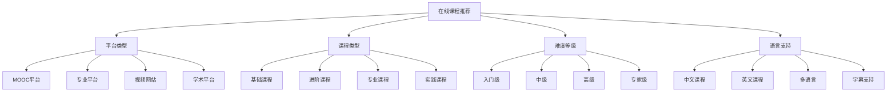

# 在线课程推荐

## 📖 核心概念

**在线课程推荐**是数据结构与算法学习的重要资源，通过系统性的在线课程学习，可以获得结构化的知识体系和实践指导。在线课程具有灵活性、互动性、实时性等特点，是传统教材学习的重要补充。

### 🏗️ 在线课程分类



## 🔧 在线课程推荐

### MOOC平台课程

#### 1. Coursera - 算法专项课程
**平台**: Coursera
**提供方**: Stanford University, Princeton University
**推荐指数**: ⭐⭐⭐⭐⭐

**课程特点**:
- 世界顶级大学课程
- 系统性的算法学习
- 丰富的编程作业
- 专业的讲师团队

**主要课程**:
- Algorithms Specialization (Stanford)
- Algorithms Part I & II (Princeton)
- Data Structures and Algorithms Specialization

**适用人群**:
- 计算机科学专业学生
- 软件工程师
- 算法竞赛选手
- 自学者

**学习建议**:
- 建议按顺序学习
- 完成所有编程作业
- 参与讨论论坛
- 获得认证证书

#### 2. edX - MIT算法课程
**平台**: edX
**提供方**: MIT
**推荐指数**: ⭐⭐⭐⭐⭐

**课程特点**:
- MIT权威课程
- 深入的算法分析
- 数学证明详细
- 免费学习选项

**主要课程**:
- Introduction to Computer Science and Programming
- Introduction to Algorithms
- Design and Analysis of Algorithms

**适用人群**:
- 有数学基础的学习者
- 算法研究者
- 计算机科学学生
- 软件工程师

**学习建议**:
- 需要扎实的数学基础
- 重点关注算法分析
- 完成所有练习
- 理解算法原理

#### 3. Udacity - 数据结构与算法纳米学位
**平台**: Udacity
**推荐指数**: ⭐⭐⭐⭐

**课程特点**:
- 项目导向学习
- 实际应用案例
- 导师指导
- 职业发展支持

**主要课程**:
- Data Structures & Algorithms Nanodegree
- Intro to Data Structures and Algorithms
- Advanced Data Structures and Algorithms

**适用人群**:
- 职业转换者
- 软件工程师
- 项目导向学习者
- 职业发展关注者

**学习建议**:
- 重点关注项目实践
- 利用导师资源
- 参与学习社区
- 关注职业发展

### 专业平台课程

#### 4. LeetCode - 算法训练营
**平台**: LeetCode
**推荐指数**: ⭐⭐⭐⭐⭐

**课程特点**:
- 题目导向学习
- 实时编程环境
- 详细的题解分析
- 社区讨论活跃

**主要课程**:
- LeetCode 101
- Algorithm Bootcamp
- Data Structures Crash Course

**适用人群**:
- 算法竞赛选手
- 技术面试准备者
- 编程爱好者
- 软件工程师

**学习建议**:
- 按难度等级练习
- 学习多种解法
- 参与讨论社区
- 关注算法优化

#### 5. HackerRank - 算法挑战
**平台**: HackerRank
**推荐指数**: ⭐⭐⭐⭐

**课程特点**:
- 挑战式学习
- 多种编程语言支持
- 实时反馈
- 排行榜竞争

**主要课程**:
- Data Structures
- Algorithms
- Problem Solving

**适用人群**:
- 竞赛编程爱好者
- 编程初学者
- 多语言学习者
- 竞争性学习者

**学习建议**:
- 选择熟悉的编程语言
- 挑战不同难度题目
- 关注排行榜
- 学习最优解法

#### 6. Codecademy - 数据结构课程
**平台**: Codecademy
**推荐指数**: ⭐⭐⭐⭐

**课程特点**:
- 交互式学习
- 即时反馈
- 循序渐进
- 友好的用户界面

**主要课程**:
- Data Structures
- Algorithms
- Computer Science

**适用人群**:
- 编程初学者
- 交互式学习者
- 视觉学习者
- 自学者

**学习建议**:
- 按顺序完成课程
- 利用交互式环境
- 完成所有练习
- 理解概念原理

### 视频网站课程

#### 7. YouTube - 算法可视化课程
**平台**: YouTube
**推荐指数**: ⭐⭐⭐⭐

**课程特点**:
- 免费资源丰富
- 可视化效果好
- 多种风格选择
- 随时可观看

**推荐频道**:
- CS50 (Harvard)
- MIT OpenCourseWare
- 3Blue1Brown
- Abdul Bari

**适用人群**:
- 预算有限的学习者
- 视觉学习者
- 灵活时间安排者
- 补充学习资源

**学习建议**:
- 选择高质量频道
- 利用可视化效果
- 配合其他资源
- 做笔记总结

#### 8. Bilibili - 中文算法课程
**平台**: Bilibili
**推荐指数**: ⭐⭐⭐⭐

**课程特点**:
- 中文教学
- 本土化内容
- 社区互动
- 免费资源

**推荐UP主**:
- 王道考研
- 小甲鱼
- 黑马程序员
- 尚硅谷

**适用人群**:
- 中文学习者
- 考研学生
- 本土化学习者
- 社区互动爱好者

**学习建议**:
- 选择权威UP主
- 参与弹幕讨论
- 关注更新动态
- 结合其他资源

### 学术平台课程

#### 9. Khan Academy - 计算机科学
**平台**: Khan Academy
**推荐指数**: ⭐⭐⭐⭐

**课程特点**:
- 免费教育资源
- 循序渐进
- 互动练习
- 多语言支持

**主要课程**:
- Computer Science
- Algorithms
- Data Structures

**适用人群**:
- 初学者
- 教育工作者
- 多语言学习者
- 免费资源需求者

**学习建议**:
- 按顺序学习
- 完成所有练习
- 利用互动功能
- 理解基础概念

#### 10. MIT OpenCourseWare - 算法课程
**平台**: MIT OCW
**推荐指数**: ⭐⭐⭐⭐⭐

**课程特点**:
- MIT官方课程
- 完整的课程材料
- 高质量内容
- 免费开放

**主要课程**:
- Introduction to Algorithms
- Design and Analysis of Algorithms
- Advanced Algorithms

**适用人群**:
- 学术研究者
- 计算机科学学生
- 高质量内容需求者
- 自学者

**学习建议**:
- 下载完整材料
- 按课程大纲学习
- 完成所有作业
- 理解算法原理

## 🎯 课程选择指南

### 学习路径推荐

```python
class OnlineCourseSelectionGuide:
    @staticmethod
    def recommend_learning_path(level, goals, budget, time_available):
        print("在线课程选择指南:")
        print("===============")
        
        if level == "beginner":
            print("初学者推荐:")
            print("1. Khan Academy - 建立基础概念")
            print("2. Codecademy - 交互式学习")
            print("3. YouTube - 可视化理解")
        
        elif level == "intermediate":
            print("进阶者推荐:")
            print("1. Coursera - 系统性学习")
            print("2. LeetCode - 实践练习")
            print("3. MIT OCW - 深入学习")
        
        elif level == "advanced":
            print("高级者推荐:")
            print("1. edX MIT - 专业课程")
            print("2. HackerRank - 挑战练习")
            print("3. 专业平台 - 专项学习")
        
        if goals == "academic":
            print("\n学术导向:")
            print("- 重点选择大学课程")
            print("- 关注理论深度")
            print("- 完成所有作业")
        
        elif goals == "practical":
            print("\n实践导向:")
            print("- 重点选择项目课程")
            print("- 关注实际应用")
            print("- 多做编程练习")
        
        elif goals == "competition":
            print("\n竞赛导向:")
            print("- 重点选择算法平台")
            print("- 关注题目练习")
            print("- 学习最优解法")
        
        if budget == "free":
            print("\n免费资源:")
            print("- YouTube高质量频道")
            print("- MIT OpenCourseWare")
            print("- Khan Academy")
            print("- LeetCode免费部分")
        
        elif budget == "paid":
            print("\n付费资源:")
            print("- Coursera专项课程")
            print("- Udacity纳米学位")
            print("- 专业平台会员")
            print("- 一对一指导")
    
    @staticmethod
    def analyze_course_characteristics():
        print("课程特点分析:")
        print("===========")
        
        print("1. 学习方式:")
        print("   - 视频教学: 直观易懂")
        print("   - 交互式: 动手实践")
        print("   - 项目导向: 实际应用")
        print("   - 挑战式: 竞争激励")
        print()
        
        print("2. 内容质量:")
        print("   - 大学课程: 理论深入")
        print("   - 专业平台: 实用性强")
        print("   - 开源课程: 免费高质量")
        print("   - 商业课程: 服务完善")
        print()
        
        print("3. 学习支持:")
        print("   - 社区讨论: 互动学习")
        print("   - 导师指导: 个性化")
        print("   - 实时反馈: 即时纠错")
        print("   - 认证证书: 学习证明")
        print()
        
        print("4. 适用性:")
        print("   - 初学者: 基础课程")
        print("   - 进阶者: 专业课程")
        print("   - 专家: 高级课程")
        print("   - 特定需求: 专项课程")
    
    @staticmethod
    def select_course_strategy(background, goals, constraints, preferences):
        print("课程选择策略:")
        print("===========")
        
        print(f"背景: {background}")
        print(f"目标: {goals}")
        print(f"约束: {constraints}")
        print(f"偏好: {preferences}")
        
        print("\n推荐策略:")
        
        if background == "computer_science" and goals == "comprehensive":
            print("选择大学MOOC课程")
            print("配合专业平台练习")
            print("关注理论深度")
        
        elif background == "self_taught" and goals == "practical":
            print("选择项目导向课程")
            print("配合交互式平台")
            print("关注实际应用")
        
        elif background == "experienced" and goals == "specialized":
            print("选择专业平台课程")
            print("配合高级课程")
            print("关注前沿技术")
        
        if constraints == "time_limited":
            print("\n时间有限建议:")
            print("- 选择短期集中课程")
            print("- 重点关注核心内容")
            print("- 利用碎片时间学习")
        
        elif constraints == "budget_limited":
            print("\n预算有限建议:")
            print("- 选择免费资源")
            print("- 利用开源课程")
            print("- 关注免费试用")
        
        if preferences == "visual_learner":
            print("\n视觉学习者建议:")
            print("- 选择视频课程")
            print("- 关注可视化内容")
            print("- 利用图表理解")
        
        elif preferences == "hands_on":
            print("\n实践学习者建议:")
            print("- 选择交互式课程")
            print("- 关注编程练习")
            print("- 多做项目实践")
```

## 📊 课程学习分析

### 学习效果分析

```python
class OnlineCourseLearningAnalysis:
    @staticmethod
    def analyze_learning_effectiveness():
        print("在线课程学习效果分析:")
        print("==================")
        
        print("1. 学习效率:")
        print("   - 视频课程: 直观易懂")
        print("   - 交互式课程: 动手实践")
        print("   - 项目课程: 实际应用")
        print("   - 挑战课程: 竞争激励")
        print()
        
        print("2. 知识掌握:")
        print("   - 概念理解: 视频教学更有效")
        print("   - 技能掌握: 交互式更有效")
        print("   - 问题解决: 项目导向更有效")
        print("   - 算法优化: 挑战式更有效")
        print()
        
        print("3. 学习动机:")
        print("   - 证书激励: 完成课程")
        print("   - 社区互动: 持续学习")
        print("   - 实时反馈: 及时纠错")
        print("   - 进度跟踪: 保持动力")
    
    @staticmethod
    def analyze_learning_methods():
        print("学习方法分析:")
        print("===========")
        
        print("1. 学习策略:")
        print("   - 主动学习: 积极参与")
        print("   - 深度学习: 理解原理")
        print("   - 实践学习: 动手编程")
        print("   - 合作学习: 社区讨论")
        print()
        
        print("2. 时间管理:")
        print("   - 固定时间: 规律学习")
        print("   - 碎片时间: 灵活安排")
        print("   - 集中时间: 深度学习")
        print("   - 复习时间: 巩固知识")
        print()
        
        print("3. 进度控制:")
        print("   - 设定目标: 明确方向")
        print("   - 跟踪进度: 监控学习")
        print("   - 调整计划: 灵活应对")
        print("   - 评估效果: 持续改进")
    
    @staticmethod
    def analyze_learning_progress():
        print("学习进度分析:")
        print("===========")
        
        print("1. 学习阶段:")
        print("   - 入门阶段: 建立基础")
        print("   - 进阶阶段: 深入学习")
        print("   - 高级阶段: 专业应用")
        print("   - 专家阶段: 创新研究")
        print()
        
        print("2. 学习指标:")
        print("   - 完成率: 课程完成情况")
        print("   - 理解度: 概念掌握程度")
        print("   - 实践能力: 编程实现能力")
        print("   - 应用能力: 问题解决能力")
        print()
        
        print("3. 学习评估:")
        print("   - 自我评估: 定期检查")
        print("   - 同伴评估: 互相学习")
        print("   - 平台评估: 系统测试")
        print("   - 实践评估: 项目验证")
```

## 🎮 在线课程测试

### 1. 基础功能测试

```python
def test_course_recommendations():
    print("Testing Course Recommendations:")
    print("==============================")
    
    # 测试课程推荐
    guide = OnlineCourseSelectionGuide()
    
    print("初学者推荐:")
    guide.recommend_learning_path("beginner", "comprehensive", "free", "abundant")
    
    print("\n进阶者推荐:")
    guide.recommend_learning_path("intermediate", "practical", "paid", "limited")
    
    print("\n高级者推荐:")
    guide.recommend_learning_path("advanced", "academic", "paid", "abundant")
    
    print("\n课程特点分析:")
    guide.analyze_course_characteristics()
    
    print("\n课程选择策略:")
    guide.select_course_strategy("computer_science", "comprehensive", "time_limited", "visual")

def test_learning_analysis():
    print("\nTesting Learning Analysis:")
    print("========================")
    
    analysis = OnlineCourseLearningAnalysis()
    
    print("学习效果分析:")
    analysis.analyze_learning_effectiveness()
    
    print("\n学习方法分析:")
    analysis.analyze_learning_methods()
    
    print("\n学习进度分析:")
    analysis.analyze_learning_progress()

def test_course_platforms():
    print("\nTesting Course Platforms:")
    print("========================")
    
    print("MOOC平台:")
    print("- Coursera: 大学课程，质量高")
    print("- edX: 学术课程，免费选项")
    print("- Udacity: 项目导向，职业发展")
    
    print("\n专业平台:")
    print("- LeetCode: 算法练习，面试准备")
    print("- HackerRank: 编程挑战，多语言")
    print("- Codecademy: 交互式学习，友好")
    
    print("\n视频网站:")
    print("- YouTube: 免费资源，可视化")
    print("- Bilibili: 中文内容，社区互动")
    
    print("\n学术平台:")
    print("- Khan Academy: 免费教育，循序渐进")
    print("- MIT OCW: 权威课程，完整材料")

def test_learning_strategies():
    print("\nTesting Learning Strategies:")
    print("==========================")
    
    print("学习策略选择:")
    print("1. 目标导向:")
    print("   - 学术目标: 选择大学课程")
    print("   - 实践目标: 选择项目课程")
    print("   - 竞赛目标: 选择算法平台")
    
    print("\n2. 时间管理:")
    print("   - 时间充足: 系统性学习")
    print("   - 时间有限: 重点学习")
    print("   - 碎片时间: 灵活安排")
    
    print("\n3. 学习方式:")
    print("   - 视觉学习: 视频课程")
    print("   - 实践学习: 交互式课程")
    print("   - 理论学习: 学术课程")

def test_applications():
    print("Testing Applications:")
    print("==================")
    
    print("课程应用场景:")
    print("1. 学术研究:")
    print("   - 算法理论研究")
    print("   - 复杂度分析")
    print("   - 算法优化")
    
    print("\n2. 工业应用:")
    print("   - 软件开发")
    print("   - 系统设计")
    print("   - 性能优化")
    
    print("\n3. 竞赛编程:")
    print("   - 算法竞赛")
    print("   - 编程挑战")
    print("   - 技能提升")
    
    print("\n4. 职业发展:")
    print("   - 技能提升")
    print("   - 职业转换")
    print("   - 面试准备")

def test_analysis():
    print("Testing Analysis:")
    print("===============")
    
    print("课程分析要点:")
    print("1. 内容质量:")
    print("   - 理论深度")
    print("   - 实践性")
    print("   - 适用性")
    
    print("\n2. 学习效果:")
    print("   - 知识掌握")
    print("   - 技能提升")
    print("   - 应用能力")
    
    print("\n3. 推荐策略:")
    print("   - 目标导向")
    print("   - 水平匹配")
    print("   - 时间考虑")

# 主测试函数
def main():
    test_course_recommendations()
    test_learning_analysis()
    test_course_platforms()
    test_learning_strategies()
    test_applications()
    test_analysis()

if __name__ == "__main__":
    main()
```

## 🔗 相关链接

- [[01-经典教材推荐|经典教材推荐]]
- [[03-开源项目学习|开源项目学习]]
- [[04-技术博客与论坛|技术博客与论坛]]

## 💡 在线课程推荐要点

1. **平台选择**: 根据学习目标和偏好选择合适的平台
2. **课程质量**: 关注课程内容质量和讲师水平
3. **学习方式**: 选择适合自己的学习方式
4. **时间管理**: 合理安排学习时间和进度

---

*📝 在线课程推荐提示：在线课程是学习数据结构与算法的重要资源，需要根据个人情况选择合适的课程和平台*
