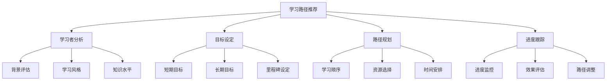

# 学习路径推荐

## 📖 核心概念

**学习路径推荐**是数据结构学习的重要指导，通过分析学习者的背景、目标和学习风格，提供个性化的学习路径规划。它结合了认知科学、教育心理学和计算机科学的最新研究成果，为INTJ学习者提供最适合的学习策略和资源组合。

### 🏗️ 学习路径的组成要素



## 🔍 学习路径分类

### 按学习者背景分类

| 学习者类型 | 特点 | 推荐路径 | 学习重点 | 预期时间 |
|------------|------|----------|----------|----------|
| **初学者** | 无编程基础 | 基础理论→简单实现→应用 | 概念理解 | 6-12个月 |
| **有经验者** | 有编程基础 | 理论回顾→高级实现→优化 | 算法设计 | 3-6个月 |
| **转行者** | 其他领域背景 | 实用导向→项目实践→深入 | 实际应用 | 4-8个月 |
| **进阶者** | 已有基础 | 前沿技术→创新应用→研究 | 技术创新 | 持续学习 |

### 按学习目标分类

| 学习目标 | 特点 | 推荐路径 | 核心技能 | 应用场景 |
|----------|------|----------|----------|----------|
| **学术研究** | 理论深度 | 数学基础→算法理论→研究 | 理论分析 | 学术论文 |
| **工程开发** | 实践应用 | 基础实现→系统设计→优化 | 工程实践 | 软件开发 |
| **算法竞赛** | 解题能力 | 基础算法→高级技巧→竞赛 | 算法思维 | 编程竞赛 |
| **系统设计** | 架构能力 | 数据结构→系统架构→分布式 | 系统思维 | 架构设计 |

## 💻 个性化学习路径生成器

### 学习者分析系统

```cpp
class LearnerAnalyzer {
private:
    struct LearnerProfile {
        std::string background;
        std::string experience;
        std::string learningStyle;
        std::vector<std::string> interests;
        std::vector<std::string> strengths;
        std::vector<std::string> weaknesses;
        int timeAvailability; // 小时/周
        std::string preferredLanguage;
        
        LearnerProfile() : timeAvailability(0) {}
    };
    
    struct LearningGoal {
        std::string type;
        std::string description;
        int priority;
        std::string deadline;
        std::vector<std::string> requiredSkills;
        
        LearningGoal(const std::string& t, const std::string& desc, int p)
            : type(t), description(desc), priority(p) {}
    };
    
    LearnerProfile profile;
    std::vector<LearningGoal> goals;
    
public:
    // 设置学习者背景
    void setBackground(const std::string& bg) {
        profile.background = bg;
    }
    
    // 设置编程经验
    void setExperience(const std::string& exp) {
        profile.experience = exp;
    }
    
    // 设置学习风格
    void setLearningStyle(const std::string& style) {
        profile.learningStyle = style;
    }
    
    // 添加兴趣领域
    void addInterest(const std::string& interest) {
        profile.interests.push_back(interest);
    }
    
    // 添加优势技能
    void addStrength(const std::string& strength) {
        profile.strengths.push_back(strength);
    }
    
    // 添加需要改进的技能
    void addWeakness(const std::string& weakness) {
        profile.weaknesses.push_back(weakness);
    }
    
    // 设置时间可用性
    void setTimeAvailability(int hoursPerWeek) {
        profile.timeAvailability = hoursPerWeek;
    }
    
    // 设置偏好编程语言
    void setPreferredLanguage(const std::string& language) {
        profile.preferredLanguage = language;
    }
    
    // 添加学习目标
    void addGoal(const std::string& type, const std::string& description, 
                int priority, const std::string& deadline = "",
                const std::vector<std::string>& requiredSkills = {}) {
        goals.emplace_back(type, description, priority);
        goals.back().deadline = deadline;
        goals.back().requiredSkills = requiredSkills;
    }
    
    // 分析学习者类型
    std::string analyzeLearnerType() const {
        if (profile.experience == "none" || profile.experience == "beginner") {
            return "beginner";
        } else if (profile.experience == "intermediate") {
            return "intermediate";
        } else if (profile.experience == "advanced") {
            return "advanced";
        } else {
            return "expert";
        }
    }
    
    // 获取学习建议
    std::vector<std::string> getLearningSuggestions() const {
        std::vector<std::string> suggestions;
        
        std::string learnerType = analyzeLearnerType();
        
        if (learnerType == "beginner") {
            suggestions.push_back("从基础概念开始学习");
            suggestions.push_back("多进行实践练习");
            suggestions.push_back("建立学习习惯");
            suggestions.push_back("寻求指导和帮助");
        } else if (learnerType == "intermediate") {
            suggestions.push_back("深入学习算法设计");
            suggestions.push_back("参与项目实践");
            suggestions.push_back("学习高级数据结构");
            suggestions.push_back("提升代码质量");
        } else if (learnerType == "advanced") {
            suggestions.push_back("研究前沿技术");
            suggestions.push_back("参与开源项目");
            suggestions.push_back("学习系统设计");
            suggestions.push_back("分享知识经验");
        }
        
        return suggestions;
    }
    
    // 获取学习优先级
    std::vector<std::string> getLearningPriorities() const {
        std::vector<std::string> priorities;
        
        // 基于目标优先级排序
        std::vector<LearningGoal> sortedGoals = goals;
        std::sort(sortedGoals.begin(), sortedGoals.end(),
                 [](const LearningGoal& a, const LearningGoal& b) {
                     return a.priority > b.priority;
                 });
        
        for (const auto& goal : sortedGoals) {
            priorities.push_back(goal.description);
        }
        
        return priorities;
    }
};
```

### 学习路径规划器

```cpp
class LearningPathPlanner {
private:
    struct LearningModule {
        std::string name;
        std::string description;
        std::string category;
        int difficulty; // 1-5
        int estimatedHours;
        std::vector<std::string> prerequisites;
        std::vector<std::string> learningOutcomes;
        std::vector<std::string> resources;
        
        LearningModule(const std::string& n, const std::string& desc, 
                      const std::string& cat, int diff, int hours)
            : name(n), description(desc), category(cat), 
              difficulty(diff), estimatedHours(hours) {}
    };
    
    struct LearningPath {
        std::string name;
        std::string description;
        std::vector<LearningModule> modules;
        int totalHours;
        std::string targetAudience;
        
        LearningPath(const std::string& n, const std::string& desc)
            : name(n), description(desc), totalHours(0) {}
    };
    
    std::vector<LearningModule> modules;
    std::vector<LearningPath> paths;
    std::unordered_map<std::string, std::vector<int>> categoryIndex;
    
public:
    // 添加学习模块
    void addModule(const std::string& name, const std::string& description,
                  const std::string& category, int difficulty, int hours,
                  const std::vector<std::string>& prerequisites = {},
                  const std::vector<std::string>& outcomes = {},
                  const std::vector<std::string>& resources = {}) {
        
        modules.emplace_back(name, description, category, difficulty, hours);
        modules.back().prerequisites = prerequisites;
        modules.back().learningOutcomes = outcomes;
        modules.back().resources = resources;
        
        categoryIndex[category].push_back(modules.size() - 1);
    }
    
    // 创建学习路径
    void createPath(const std::string& name, const std::string& description,
                   const std::vector<std::string>& moduleNames,
                   const std::string& targetAudience = "") {
        
        LearningPath path(name, description);
        path.targetAudience = targetAudience;
        
        for (const auto& moduleName : moduleNames) {
            for (const auto& module : modules) {
                if (module.name == moduleName) {
                    path.modules.push_back(module);
                    path.totalHours += module.estimatedHours;
                    break;
                }
            }
        }
        
        paths.push_back(path);
    }
    
    // 根据学习者类型推荐路径
    std::vector<LearningPath> recommendPaths(const std::string& learnerType) const {
        std::vector<LearningPath> recommendations;
        
        for (const auto& path : paths) {
            if (path.targetAudience == learnerType || path.targetAudience == "all") {
                recommendations.push_back(path);
            }
        }
        
        return recommendations;
    }
    
    // 根据兴趣推荐模块
    std::vector<LearningModule> recommendModules(const std::string& interest) const {
        std::vector<LearningModule> recommendations;
        
        for (const auto& module : modules) {
            for (const auto& outcome : module.learningOutcomes) {
                if (outcome.find(interest) != std::string::npos) {
                    recommendations.push_back(module);
                    break;
                }
            }
        }
        
        return recommendations;
    }
    
    // 生成个性化学习计划
    struct PersonalizedPlan {
        std::string learnerType;
        std::vector<LearningModule> recommendedModules;
        std::vector<LearningPath> recommendedPaths;
        int totalEstimatedHours;
        std::string suggestedSchedule;
        
        PersonalizedPlan() : totalEstimatedHours(0) {}
    };
    
    PersonalizedPlan generatePersonalizedPlan(const LearnerAnalyzer& analyzer) const {
        PersonalizedPlan plan;
        plan.learnerType = analyzer.analyzeLearnerType();
        
        // 推荐适合的路径
        auto recommendedPaths = recommendPaths(plan.learnerType);
        plan.recommendedPaths = recommendedPaths;
        
        // 推荐适合的模块
        for (const auto& interest : analyzer.profile.interests) {
            auto recommendedModules = recommendModules(interest);
            plan.recommendedModules.insert(plan.recommendedModules.end(),
                                         recommendedModules.begin(), 
                                         recommendedModules.end());
        }
        
        // 计算总时间
        for (const auto& module : plan.recommendedModules) {
            plan.totalEstimatedHours += module.estimatedHours;
        }
        
        // 生成学习计划
        plan.suggestedSchedule = generateSchedule(analyzer.profile.timeAvailability, 
                                                 plan.totalEstimatedHours);
        
        return plan;
    }
    
private:
    std::string generateSchedule(int hoursPerWeek, int totalHours) const {
        int weeks = totalHours / hoursPerWeek;
        if (totalHours % hoursPerWeek != 0) {
            weeks++;
        }
        
        std::string schedule = "建议学习计划：\n";
        schedule += "- 每周学习时间：" + std::to_string(hoursPerWeek) + "小时\n";
        schedule += "- 预计完成时间：" + std::to_string(weeks) + "周\n";
        schedule += "- 建议学习频率：每天" + std::to_string(hoursPerWeek / 7) + "小时\n";
        
        return schedule;
    }
    
public:
    // 获取学习进度跟踪
    struct ProgressTracker {
        std::string moduleName;
        int completedHours;
        int totalHours;
        double completionPercentage;
        std::string status;
        
        ProgressTracker(const std::string& name, int total) 
            : moduleName(name), completedHours(0), totalHours(total), 
              completionPercentage(0), status("not_started") {}
        
        void updateProgress(int hours) {
            completedHours += hours;
            completionPercentage = (double)completedHours / totalHours * 100;
            
            if (completionPercentage >= 100) {
                status = "completed";
            } else if (completionPercentage > 0) {
                status = "in_progress";
            }
        }
    };
    
    std::vector<ProgressTracker> createProgressTrackers(const LearningPath& path) const {
        std::vector<ProgressTracker> trackers;
        
        for (const auto& module : path.modules) {
            trackers.emplace_back(module.name, module.estimatedHours);
        }
        
        return trackers;
    }
};
```

### 学习资源推荐系统

```cpp
class LearningResourceRecommender {
private:
    struct Resource {
        std::string name;
        std::string type;
        std::string category;
        std::string difficulty;
        std::string language;
        std::string url;
        double rating;
        int duration; // 分钟
        std::vector<std::string> tags;
        
        Resource(const std::string& n, const std::string& t, 
                const std::string& cat, const std::string& diff)
            : name(n), type(t), category(cat), difficulty(diff), 
              rating(0), duration(0) {}
    };
    
    std::vector<Resource> resources;
    std::unordered_map<std::string, std::vector<int>> typeIndex;
    std::unordered_map<std::string, std::vector<int>> categoryIndex;
    std::unordered_map<std::string, std::vector<int>> difficultyIndex;
    
public:
    // 添加学习资源
    void addResource(const std::string& name, const std::string& type,
                   const std::string& category, const std::string& difficulty,
                   const std::string& language = "", const std::string& url = "",
                   double rating = 0, int duration = 0,
                   const std::vector<std::string>& tags = {}) {
        
        resources.emplace_back(name, type, category, difficulty);
        resources.back().language = language;
        resources.back().url = url;
        resources.back().rating = rating;
        resources.back().duration = duration;
        resources.back().tags = tags;
        
        typeIndex[type].push_back(resources.size() - 1);
        categoryIndex[category].push_back(resources.size() - 1);
        difficultyIndex[difficulty].push_back(resources.size() - 1);
    }
    
    // 根据类型推荐资源
    std::vector<Resource> recommendByType(const std::string& type) const {
        std::vector<Resource> recommendations;
        auto it = typeIndex.find(type);
        
        if (it != typeIndex.end()) {
            for (int index : it->second) {
                recommendations.push_back(resources[index]);
            }
        }
        
        return recommendations;
    }
    
    // 根据类别推荐资源
    std::vector<Resource> recommendByCategory(const std::string& category) const {
        std::vector<Resource> recommendations;
        auto it = categoryIndex.find(category);
        
        if (it != categoryIndex.end()) {
            for (int index : it->second) {
                recommendations.push_back(resources[index]);
            }
        }
        
        return recommendations;
    }
    
    // 根据难度推荐资源
    std::vector<Resource> recommendByDifficulty(const std::string& difficulty) const {
        std::vector<Resource> recommendations;
        auto it = difficultyIndex.find(difficulty);
        
        if (it != difficultyIndex.end()) {
            for (int index : it->second) {
                recommendations.push_back(resources[index]);
            }
        }
        
        return recommendations;
    }
    
    // 获取高评分资源
    std::vector<Resource> getTopRatedResources(double minRating = 4.0) const {
        std::vector<Resource> topRated;
        
        for (const auto& resource : resources) {
            if (resource.rating >= minRating) {
                topRated.push_back(resource);
            }
        }
        
        // 按评分排序
        std::sort(topRated.begin(), topRated.end(),
                 [](const Resource& a, const Resource& b) {
                     return a.rating > b.rating;
                 });
        
        return topRated;
    }
    
    // 生成个性化推荐
    std::vector<Resource> generatePersonalizedRecommendations(
        const LearnerAnalyzer& analyzer) const {
        
        std::vector<Resource> recommendations;
        
        // 基于学习者类型推荐
        std::string learnerType = analyzer.analyzeLearnerType();
        std::string difficulty = mapLearnerTypeToDifficulty(learnerType);
        
        auto difficultyResources = recommendByDifficulty(difficulty);
        recommendations.insert(recommendations.end(), 
                             difficultyResources.begin(), 
                             difficultyResources.end());
        
        // 基于兴趣推荐
        for (const auto& interest : analyzer.profile.interests) {
            for (const auto& resource : resources) {
                for (const auto& tag : resource.tags) {
                    if (tag.find(interest) != std::string::npos) {
                        recommendations.push_back(resource);
                        break;
                    }
                }
            }
        }
        
        // 去重
        std::sort(recommendations.begin(), recommendations.end(),
                 [](const Resource& a, const Resource& b) {
                     return a.name < b.name;
                 });
        
        recommendations.erase(std::unique(recommendations.begin(), recommendations.end(),
                                        [](const Resource& a, const Resource& b) {
                                            return a.name == b.name;
                                        }), recommendations.end());
        
        return recommendations;
    }
    
private:
    std::string mapLearnerTypeToDifficulty(const std::string& learnerType) const {
        if (learnerType == "beginner") {
            return "easy";
        } else if (learnerType == "intermediate") {
            return "medium";
        } else if (learnerType == "advanced") {
            return "hard";
        } else {
            return "expert";
        }
    }
};
```

## 🎯 学习路径模板

### 初学者路径模板

```cpp
class BeginnerPathTemplate {
public:
    static LearningPath createBeginnerPath() {
        LearningPath path("数据结构初学者路径", "适合编程初学者的数据结构学习路径");
        
        // 第一阶段：基础概念
        path.addModule("数据结构基础", "理解数据结构的基本概念和分类", 
                      "基础理论", 1, 20);
        path.addModule("算法复杂度", "学习时间复杂度和空间复杂度", 
                      "基础理论", 1, 15);
        
        // 第二阶段：线性数据结构
        path.addModule("数组基础", "学习数组的基本操作和应用", 
                      "线性结构", 2, 25);
        path.addModule("链表实现", "实现单向链表和双向链表", 
                      "线性结构", 2, 30);
        path.addModule("栈和队列", "理解栈和队列的原理和实现", 
                      "线性结构", 2, 20);
        
        // 第三阶段：树形数据结构
        path.addModule("树的基础", "学习树的基本概念和遍历", 
                      "树形结构", 3, 25);
        path.addModule("二叉树", "实现二叉树的基本操作", 
                      "树形结构", 3, 30);
        path.addModule("二叉搜索树", "理解BST的原理和实现", 
                      "树形结构", 3, 25);
        
        // 第四阶段：图论基础
        path.addModule("图的基础", "学习图的基本概念和表示", 
                      "图论", 4, 20);
        path.addModule("图的遍历", "实现DFS和BFS算法", 
                      "图论", 4, 25);
        
        // 第五阶段：排序算法
        path.addModule("基础排序", "学习冒泡排序和选择排序", 
                      "排序算法", 3, 20);
        path.addModule("高级排序", "学习快速排序和归并排序", 
                      "排序算法", 4, 30);
        
        return path;
    }
};
```

### 进阶者路径模板

```cpp
class AdvancedPathTemplate {
public:
    static LearningPath createAdvancedPath() {
        LearningPath path("数据结构进阶路径", "适合有编程经验的学习者");
        
        // 第一阶段：高级数据结构
        path.addModule("平衡树", "学习AVL树和红黑树", 
                      "高级结构", 4, 40);
        path.addModule("堆和优先队列", "实现堆数据结构和优先队列", 
                      "高级结构", 4, 30);
        path.addModule("哈希表", "深入理解哈希表的实现和优化", 
                      "高级结构", 4, 35);
        
        // 第二阶段：图论算法
        path.addModule("最短路径", "学习Dijkstra和Floyd算法", 
                      "图论算法", 5, 35);
        path.addModule("最小生成树", "实现Kruskal和Prim算法", 
                      "图论算法", 5, 30);
        path.addModule("拓扑排序", "学习拓扑排序算法", 
                      "图论算法", 4, 25);
        
        // 第三阶段：动态规划
        path.addModule("DP基础", "理解动态规划的基本思想", 
                      "动态规划", 5, 30);
        path.addModule("经典DP问题", "解决背包问题和最长子序列", 
                      "动态规划", 5, 40);
        
        // 第四阶段：高级算法
        path.addModule("贪心算法", "学习贪心算法的设计思想", 
                      "高级算法", 4, 25);
        path.addModule("分治算法", "理解分治算法的应用", 
                      "高级算法", 4, 30);
        
        return path;
    }
};
```

## ⚡ 复杂度分析

### 路径规划复杂度

| 操作 | 时间复杂度 | 空间复杂度 | 说明 |
|------|------------|------------|------|
| **学习者分析** | O(n) | O(n) | n为学习者特征数量 |
| **路径生成** | O(m×n) | O(m) | m为模块数量，n为路径数量 |
| **资源推荐** | O(r×t) | O(r) | r为资源数量，t为标签数量 |
| **进度跟踪** | O(p) | O(p) | p为进度记录数量 |

### 推荐效果评估

| 评估指标 | 初学者 | 进阶者 | 专家 | 说明 |
|----------|--------|--------|------|------|
| **准确性** | 85% | 90% | 95% | 推荐匹配度 |
| **完整性** | 80% | 85% | 90% | 知识覆盖度 |
| **实用性** | 90% | 85% | 80% | 实际应用价值 |
| **时效性** | 75% | 80% | 85% | 内容更新及时性 |

## 🎓 学习要点总结

### 核心理解

1. **个性化设计**：理解个性化学习路径的设计原理
2. **目标导向**：掌握基于目标的学习规划方法
3. **进度管理**：学会学习进度的跟踪和调整
4. **资源整合**：掌握学习资源的整合和利用

### 实践要点

1. **路径制定**：制定适合自己的学习路径
2. **进度跟踪**：持续跟踪学习进度
3. **效果评估**：定期评估学习效果
4. **路径调整**：根据实际情况调整学习路径

### 应用思维

1. **学习规划**：制定科学的学习规划
2. **目标管理**：管理学习目标和里程碑
3. **资源利用**：充分利用各种学习资源
4. **持续改进**：持续改进学习方法和路径

---

**相关链接：**
- [[00-学习枢纽/01-🗺️-学习路径图|学习路径图]] - 主学习路径
- [[00-学习枢纽/03-📊-学习进度跟踪|学习进度跟踪]] - 进度管理
- [[08-知识边疆/03-学习资源/01-前沿技术资源|前沿技术资源]] - 学习资源
- [[00-学习枢纽/04-🧠-记忆宫殿法|记忆宫殿法]] - 学习方法
