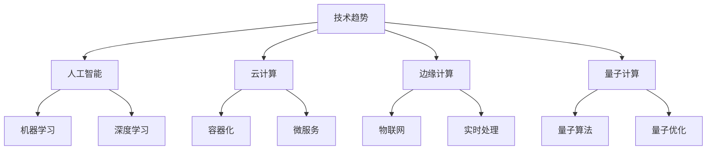

# 技术趋势

## 📖 核心概念

**技术趋势**是数据结构领域的发展方向，包括新兴技术、创新应用和未来发展方向。了解技术趋势有助于把握技术发展脉络。

### 🏗️ 趋势领域



## 🔧 人工智能趋势

### 机器学习算法

```cpp
class MachineLearningTrends {
private:
    struct Algorithm {
        string name;
        string category;
        double popularity;
        vector<string> applications;
        string description;
        
        Algorithm(const string& n, const string& c) : name(n), category(c), popularity(0) {}
    };
    
    vector<Algorithm> algorithms;
    
public:
    MachineLearningTrends() {
        initializeAlgorithms();
    }
    
    void initializeAlgorithms() {
        // 深度学习算法
        Algorithm alg1("Transformer", "深度学习");
        alg1.popularity = 95.0;
        alg1.applications = {"自然语言处理", "计算机视觉", "语音识别"};
        alg1.description = "基于注意力机制的深度学习模型";
        algorithms.push_back(alg1);
        
        // 强化学习算法
        Algorithm alg2("Deep Q-Network", "强化学习");
        alg2.popularity = 80.0;
        alg2.applications = {"游戏AI", "机器人控制", "自动驾驶"};
        alg2.description = "结合深度学习和Q学习的强化学习算法";
        algorithms.push_back(alg2);
        
        // 联邦学习算法
        Algorithm alg3("Federated Learning", "分布式学习");
        alg3.popularity = 85.0;
        alg3.applications = {"隐私保护", "移动计算", "边缘智能"};
        alg3.description = "在保护数据隐私的前提下进行分布式机器学习";
        algorithms.push_back(alg3);
    }
    
    // 获取热门算法
    vector<Algorithm> getTrendingAlgorithms() {
        vector<Algorithm> trending = algorithms;
        sort(trending.begin(), trending.end(), 
             [](const Algorithm& a, const Algorithm& b) {
                 return a.popularity > b.popularity;
             });
        return trending;
    }
    
    // 预测算法趋势
    void predictTrends() {
        cout << "AI Algorithm Trends Prediction:" << endl;
        cout << "===============================" << endl;
        
        for (const auto& alg : algorithms) {
            cout << "Algorithm: " << alg.name << endl;
            cout << "  Category: " << alg.category << endl;
            cout << "  Current Popularity: " << alg.popularity << "%" << endl;
            
            // 简化的趋势预测
            double futurePopularity = alg.popularity * (1 + (rand() % 20 - 10) / 100.0);
            cout << "  Predicted Popularity: " << futurePopularity << "%" << endl;
            
            cout << "  Applications: ";
            for (const string& app : alg.applications) {
                cout << app << " ";
            }
            cout << endl << endl;
        }
    }
    
    // 显示算法信息
    void displayAlgorithms() {
        cout << "Machine Learning Algorithms:" << endl;
        cout << "===========================" << endl;
        
        for (const auto& alg : algorithms) {
            cout << "Name: " << alg.name << endl;
            cout << "  Category: " << alg.category << endl;
            cout << "  Popularity: " << alg.popularity << "%" << endl;
            cout << "  Description: " << alg.description << endl;
            cout << "  Applications: ";
            for (const string& app : alg.applications) {
                cout << app << " ";
            }
            cout << endl << endl;
        }
    }
};
```

### 深度学习框架

```cpp
class DeepLearningFrameworks {
private:
    struct Framework {
        string name;
        string language;
        double performance;
        double easeOfUse;
        vector<string> features;
        string description;
        
        Framework(const string& n, const string& lang) : name(n), language(lang), 
                                                        performance(0), easeOfUse(0) {}
    };
    
    vector<Framework> frameworks;
    
public:
    DeepLearningFrameworks() {
        initializeFrameworks();
    }
    
    void initializeFrameworks() {
        // PyTorch
        Framework fw1("PyTorch", "Python");
        fw1.performance = 90.0;
        fw1.easeOfUse = 95.0;
        fw1.features = {"动态图", "自动微分", "GPU加速", "模型部署"};
        fw1.description = "Facebook开源的深度学习框架，以动态图和易用性著称";
        frameworks.push_back(fw1);
        
        // TensorFlow
        Framework fw2("TensorFlow", "Python");
        fw2.performance = 95.0;
        fw2.easeOfUse = 85.0;
        fw2.features = {"静态图", "分布式训练", "模型优化", "生产部署"};
        fw2.description = "Google开源的深度学习框架，以性能和可扩展性著称";
        frameworks.push_back(fw2);
        
        // JAX
        Framework fw3("JAX", "Python");
        fw3.performance = 92.0;
        fw3.easeOfUse = 80.0;
        fw3.features = {"函数式编程", "自动微分", "JIT编译", "科学计算"};
        fw3.description = "Google开发的科学计算库，结合了NumPy和自动微分";
        frameworks.push_back(fw3);
    }
    
    // 比较框架
    void compareFrameworks() {
        cout << "Deep Learning Framework Comparison:" << endl;
        cout << "===================================" << endl;
        
        for (const auto& fw : frameworks) {
            cout << "Framework: " << fw.name << endl;
            cout << "  Language: " << fw.language << endl;
            cout << "  Performance: " << fw.performance << "/100" << endl;
            cout << "  Ease of Use: " << fw.easeOfUse << "/100" << endl;
            cout << "  Features: ";
            for (const string& feature : fw.features) {
                cout << feature << " ";
            }
            cout << endl;
            cout << "  Description: " << fw.description << endl;
            cout << endl;
        }
    }
    
    // 推荐框架
    Framework recommendFramework(const string& useCase) {
        Framework best("", "");
        double bestScore = 0;
        
        for (const auto& fw : frameworks) {
            double score = 0;
            
            if (useCase == "研究") {
                score = fw.easeOfUse * 0.7 + fw.performance * 0.3;
            } else if (useCase == "生产") {
                score = fw.performance * 0.7 + fw.easeOfUse * 0.3;
            } else if (useCase == "科学计算") {
                score = fw.performance * 0.8 + fw.easeOfUse * 0.2;
            }
            
            if (score > bestScore) {
                bestScore = score;
                best = fw;
            }
        }
        
        return best;
    }
    
    // 显示框架信息
    void displayFrameworks() {
        cout << "Deep Learning Frameworks:" << endl;
        cout << "========================" << endl;
        
        for (const auto& fw : frameworks) {
            cout << "Name: " << fw.name << endl;
            cout << "  Language: " << fw.language << endl;
            cout << "  Performance: " << fw.performance << "/100" << endl;
            cout << "  Ease of Use: " << fw.easeOfUse << "/100" << endl;
            cout << "  Features: ";
            for (const string& feature : fw.features) {
                cout << feature << " ";
            }
            cout << endl;
            cout << "  Description: " << fw.description << endl;
            cout << endl;
        }
    }
};
```

## 🎯 云计算趋势

### 容器化技术

```cpp
class ContainerizationTrends {
private:
    struct ContainerTech {
        string name;
        string category;
        double adoption;
        vector<string> benefits;
        string description;
        
        ContainerTech(const string& n, const string& c) : name(n), category(c), adoption(0) {}
    };
    
    vector<ContainerTech> technologies;
    
public:
    ContainerizationTrends() {
        initializeTechnologies();
    }
    
    void initializeTechnologies() {
        // Docker
        ContainerTech tech1("Docker", "容器化");
        tech1.adoption = 90.0;
        tech1.benefits = {"轻量级", "可移植性", "快速部署", "资源隔离"};
        tech1.description = "最流行的容器化平台，简化了应用程序的打包和部署";
        technologies.push_back(tech1);
        
        // Kubernetes
        ContainerTech tech2("Kubernetes", "容器编排");
        tech2.adoption = 85.0;
        tech2.benefits = {"自动扩缩容", "服务发现", "负载均衡", "滚动更新"};
        tech2.description = "Google开源的容器编排平台，用于自动化容器部署和管理";
        technologies.push_back(tech2);
        
        // Serverless
        ContainerTech tech3("Serverless", "无服务器计算");
        tech3.adoption = 75.0;
        tech3.benefits = {"按需付费", "自动扩缩容", "零运维", "快速开发"};
        tech3.description = "无服务器计算模式，开发者无需管理服务器基础设施";
        technologies.push_back(tech3);
    }
    
    // 分析趋势
    void analyzeTrends() {
        cout << "Containerization Technology Trends:" << endl;
        cout << "=================================" << endl;
        
        for (const auto& tech : technologies) {
            cout << "Technology: " << tech.name << endl;
            cout << "  Category: " << tech.category << endl;
            cout << "  Adoption Rate: " << tech.adoption << "%" << endl;
            cout << "  Benefits: ";
            for (const string& benefit : tech.benefits) {
                cout << benefit << " ";
            }
            cout << endl;
            cout << "  Description: " << tech.description << endl;
            cout << endl;
        }
    }
    
    // 预测未来趋势
    void predictFutureTrends() {
        cout << "Future Trends Prediction:" << endl;
        cout << "========================" << endl;
        
        cout << "1. 容器化技术将继续普及" << endl;
        cout << "2. 无服务器计算将更加成熟" << endl;
        cout << "3. 边缘计算将推动容器技术发展" << endl;
        cout << "4. 安全性和合规性将更加重要" << endl;
        cout << "5. 多云和混合云部署将成为主流" << endl;
    }
    
    // 显示技术信息
    void displayTechnologies() {
        cout << "Containerization Technologies:" << endl;
        cout << "============================" << endl;
        
        for (const auto& tech : technologies) {
            cout << "Name: " << tech.name << endl;
            cout << "  Category: " << tech.category << endl;
            cout << "  Adoption Rate: " << tech.adoption << "%" << endl;
            cout << "  Benefits: ";
            for (const string& benefit : tech.benefits) {
                cout << benefit << " ";
            }
            cout << endl;
            cout << "  Description: " << tech.description << endl;
            cout << endl;
        }
    }
};
```

### 微服务架构

```cpp
class MicroservicesTrends {
private:
    struct MicroservicePattern {
        string name;
        string category;
        double complexity;
        vector<string> useCases;
        string description;
        
        MicroservicePattern(const string& n, const string& c) : name(n), category(c), complexity(0) {}
    };
    
    vector<MicroservicePattern> patterns;
    
public:
    MicroservicesTrends() {
        initializePatterns();
    }
    
    void initializePatterns() {
        // API网关模式
        MicroservicePattern pattern1("API Gateway", "通信模式");
        pattern1.complexity = 70.0;
        pattern1.useCases = {"统一入口", "认证授权", "限流熔断", "监控日志"};
        pattern1.description = "为微服务提供统一的API入口，处理横切关注点";
        patterns.push_back(pattern1);
        
        // 服务网格模式
        MicroservicePattern pattern2("Service Mesh", "通信模式");
        pattern2.complexity = 85.0;
        pattern2.useCases = {"服务发现", "负载均衡", "故障恢复", "安全通信"};
        pattern2.description = "在应用层之下提供透明的服务间通信基础设施";
        patterns.push_back(pattern2);
        
        // 事件驱动模式
        MicroservicePattern pattern3("Event-Driven", "架构模式");
        pattern3.complexity = 80.0;
        pattern3.useCases = {"异步通信", "解耦服务", "实时处理", "数据同步"};
        pattern3.description = "基于事件的异步通信模式，提高系统的响应性和可扩展性";
        patterns.push_back(pattern3);
    }
    
    // 分析模式趋势
    void analyzePatternTrends() {
        cout << "Microservice Pattern Trends:" << endl;
        cout << "==========================" << endl;
        
        for (const auto& pattern : patterns) {
            cout << "Pattern: " << pattern.name << endl;
            cout << "  Category: " << pattern.category << endl;
            cout << "  Complexity: " << pattern.complexity << "/100" << endl;
            cout << "  Use Cases: ";
            for (const string& useCase : pattern.useCases) {
                cout << useCase << " ";
            }
            cout << endl;
            cout << "  Description: " << pattern.description << endl;
            cout << endl;
        }
    }
    
    // 推荐架构模式
    MicroservicePattern recommendPattern(const string& requirement) {
        MicroservicePattern best("", "");
        double bestScore = 0;
        
        for (const auto& pattern : patterns) {
            double score = 0;
            
            if (requirement == "简单") {
                score = 100 - pattern.complexity;
            } else if (requirement == "高性能") {
                score = pattern.complexity * 0.8 + 20;
            } else if (requirement == "可扩展") {
                score = pattern.complexity * 0.6 + 40;
            }
            
            if (score > bestScore) {
                bestScore = score;
                best = pattern;
            }
        }
        
        return best;
    }
    
    // 显示模式信息
    void displayPatterns() {
        cout << "Microservice Patterns:" << endl;
        cout << "====================" << endl;
        
        for (const auto& pattern : patterns) {
            cout << "Name: " << pattern.name << endl;
            cout << "  Category: " << pattern.category << endl;
            cout << "  Complexity: " << pattern.complexity << "/100" << endl;
            cout << "  Use Cases: ";
            for (const string& useCase : pattern.useCases) {
                cout << useCase << " ";
            }
            cout << endl;
            cout << "  Description: " << pattern.description << endl;
            cout << endl;
        }
    }
};
```

## 📊 边缘计算趋势

### 物联网技术

```cpp
class IoTTrends {
private:
    struct IoTTechnology {
        string name;
        string category;
        double growth;
        vector<string> applications;
        string description;
        
        IoTTechnology(const string& n, const string& c) : name(n), category(c), growth(0) {}
    };
    
    vector<IoTTechnology> technologies;
    
public:
    IoTTrends() {
        initializeTechnologies();
    }
    
    void initializeTechnologies() {
        // 5G技术
        IoTTechnology tech1("5G", "通信技术");
        tech1.growth = 95.0;
        tech1.applications = {"智能城市", "自动驾驶", "工业4.0", "远程医疗"};
        tech1.description = "第五代移动通信技术，提供高速、低延迟的无线连接";
        technologies.push_back(tech1);
        
        // 边缘AI
        IoTTechnology tech2("Edge AI", "人工智能");
        tech2.growth = 90.0;
        tech2.applications = {"实时分析", "智能设备", "自动驾驶", "工业监控"};
        tech2.description = "在边缘设备上运行的人工智能算法，减少延迟和带宽需求";
        technologies.push_back(tech2);
        
        // 数字孪生
        IoTTechnology tech3("Digital Twin", "仿真技术");
        tech3.growth = 85.0;
        tech3.applications = {"智能制造", "智慧城市", "产品设计", "预测维护"};
        tech3.description = "物理实体的数字副本，用于仿真、分析和优化";
        technologies.push_back(tech3);
    }
    
    // 分析增长趋势
    void analyzeGrowthTrends() {
        cout << "IoT Technology Growth Trends:" << endl;
        cout << "============================" << endl;
        
        for (const auto& tech : technologies) {
            cout << "Technology: " << tech.name << endl;
            cout << "  Category: " << tech.category << endl;
            cout << "  Growth Rate: " << tech.growth << "%" << endl;
            cout << "  Applications: ";
            for (const string& app : tech.applications) {
                cout << app << " ";
            }
            cout << endl;
            cout << "  Description: " << tech.description << endl;
            cout << endl;
        }
    }
    
    // 预测未来应用
    void predictFutureApplications() {
        cout << "Future IoT Applications:" << endl;
        cout << "=======================" << endl;
        
        cout << "1. 智能城市将更加普及" << endl;
        cout << "2. 工业4.0将推动制造业转型" << endl;
        cout << "3. 自动驾驶技术将逐步成熟" << endl;
        cout << "4. 远程医疗将改变 healthcare" << endl;
        cout << "5. 边缘计算将支持更多实时应用" << endl;
    }
    
    // 显示技术信息
    void displayTechnologies() {
        cout << "IoT Technologies:" << endl;
        cout << "================" << endl;
        
        for (const auto& tech : technologies) {
            cout << "Name: " << tech.name << endl;
            cout << "  Category: " << tech.category << endl;
            cout << "  Growth Rate: " << tech.growth << "%" << endl;
            cout << "  Applications: ";
            for (const string& app : tech.applications) {
                cout << app << " ";
            }
            cout << endl;
            cout << "  Description: " << tech.description << endl;
            cout << endl;
        }
    }
};
```

### 实时处理技术

```cpp
class RealTimeProcessingTrends {
private:
    struct ProcessingTech {
        string name;
        string category;
        double latency;
        vector<string> features;
        string description;
        
        ProcessingTech(const string& n, const string& c) : name(n), category(c), latency(0) {}
    };
    
    vector<ProcessingTech> technologies;
    
public:
    RealTimeProcessingTrends() {
        initializeTechnologies();
    }
    
    void initializeTechnologies() {
        // 流式处理
        ProcessingTech tech1("Stream Processing", "数据处理");
        tech1.latency = 10.0; // 毫秒
        tech1.features = {"实时分析", "事件驱动", "容错性", "可扩展性"};
        tech1.description = "实时处理数据流的技术，支持低延迟的数据分析";
        technologies.push_back(tech1);
        
        // 内存计算
        ProcessingTech tech2("In-Memory Computing", "计算技术");
        tech2.latency = 1.0; // 毫秒
        tech2.features = {"高速访问", "并行处理", "实时分析", "内存优化"};
        tech2.description = "将数据存储在内存中进行计算，大幅提升处理速度";
        technologies.push_back(tech2);
        
        // 边缘计算
        ProcessingTech tech3("Edge Computing", "计算架构");
        tech3.latency = 5.0; // 毫秒
        tech3.features = {"低延迟", "本地处理", "带宽优化", "实时响应"};
        tech3.description = "在数据源附近进行数据处理，减少网络延迟";
        technologies.push_back(tech3);
    }
    
    // 分析延迟趋势
    void analyzeLatencyTrends() {
        cout << "Real-Time Processing Latency Trends:" << endl;
        cout << "===================================" << endl;
        
        for (const auto& tech : technologies) {
            cout << "Technology: " << tech.name << endl;
            cout << "  Category: " << tech.category << endl;
            cout << "  Latency: " << tech.latency << " ms" << endl;
            cout << "  Features: ";
            for (const string& feature : tech.features) {
                cout << feature << " ";
            }
            cout << endl;
            cout << "  Description: " << tech.description << endl;
            cout << endl;
        }
    }
    
    // 推荐技术
    ProcessingTech recommendTechnology(const string& requirement) {
        ProcessingTech best("", "");
        double bestScore = 0;
        
        for (const auto& tech : technologies) {
            double score = 0;
            
            if (requirement == "低延迟") {
                score = 100 - tech.latency;
            } else if (requirement == "高吞吐") {
                score = tech.latency * 0.5 + 50;
            } else if (requirement == "实时性") {
                score = 100 - tech.latency * 2;
            }
            
            if (score > bestScore) {
                bestScore = score;
                best = tech;
            }
        }
        
        return best;
    }
    
    // 显示技术信息
    void displayTechnologies() {
        cout << "Real-Time Processing Technologies:" << endl;
        cout << "================================" << endl;
        
        for (const auto& tech : technologies) {
            cout << "Name: " << tech.name << endl;
            cout << "  Category: " << tech.category << endl;
            cout << "  Latency: " << tech.latency << " ms" << endl;
            cout << "  Features: ";
            for (const string& feature : tech.features) {
                cout << feature << " ";
            }
            cout << endl;
            cout << "  Description: " << tech.description << endl;
            cout << endl;
        }
    }
};
```

## 🎮 趋势应用

### 1. 技术趋势分析

```cpp
class TechnologyTrendAnalyzer {
public:
    static void analyzeOverallTrends() {
        cout << "=== Overall Technology Trends Analysis ===" << endl;
        
        MachineLearningTrends mlTrends;
        DeepLearningFrameworks dlFrameworks;
        ContainerizationTrends containerTrends;
        MicroservicesTrends microservicesTrends;
        IoTTrends ioTrends;
        RealTimeProcessingTrends rtTrends;
        
        cout << "1. AI/ML Trends:" << endl;
        mlTrends.predictTrends();
        
        cout << "2. Deep Learning Framework Trends:" << endl;
        dlFrameworks.compareFrameworks();
        
        cout << "3. Containerization Trends:" << endl;
        containerTrends.analyzeTrends();
        
        cout << "4. Microservices Trends:" << endl;
        microservicesTrends.analyzePatternTrends();
        
        cout << "5. IoT Trends:" << endl;
        ioTrends.analyzeGrowthTrends();
        
        cout << "6. Real-Time Processing Trends:" << endl;
        rtTrends.analyzeLatencyTrends();
    }
    
    static void predictFutureTrends() {
        cout << "=== Future Technology Trends Prediction ===" << endl;
        
        cout << "AI/ML领域:" << endl;
        cout << "  - 大模型将继续发展" << endl;
        cout << "  - 多模态AI将更加成熟" << endl;
        cout << "  - 联邦学习将普及" << endl;
        
        cout << "云计算领域:" << endl;
        cout << "  - 容器化将成为标准" << endl;
        cout << "  - 无服务器计算将普及" << endl;
        cout << "  - 多云部署将成为主流" << endl;
        
        cout << "边缘计算领域:" << endl;
        cout << "  - 5G将推动边缘计算发展" << endl;
        cout << "  - 边缘AI将更加智能" << endl;
        cout << "  - 实时处理将更加重要" << endl;
    }
};
```

### 2. 技术选型建议

```cpp
class TechnologySelectionAdvisor {
public:
    static void provideRecommendations() {
        cout << "=== Technology Selection Recommendations ===" << endl;
        
        MachineLearningTrends mlTrends;
        DeepLearningFrameworks dlFrameworks;
        MicroservicesTrends microservicesTrends;
        RealTimeProcessingTrends rtTrends;
        
        cout << "1. 深度学习框架选择:" << endl;
        auto researchFramework = dlFrameworks.recommendFramework("研究");
        cout << "  研究用途推荐: " << researchFramework.name << endl;
        
        auto productionFramework = dlFrameworks.recommendFramework("生产");
        cout << "  生产用途推荐: " << productionFramework.name << endl;
        
        cout << "2. 微服务架构模式选择:" << endl;
        auto simplePattern = microservicesTrends.recommendPattern("简单");
        cout << "  简单架构推荐: " << simplePattern.name << endl;
        
        auto scalablePattern = microservicesTrends.recommendPattern("可扩展");
        cout << "  可扩展架构推荐: " << scalablePattern.name << endl;
        
        cout << "3. 实时处理技术选择:" << endl;
        auto lowLatencyTech = rtTrends.recommendTechnology("低延迟");
        cout << "  低延迟需求推荐: " << lowLatencyTech.name << endl;
        
        auto realTimeTech = rtTrends.recommendTechnology("实时性");
        cout << "  实时性需求推荐: " << realTimeTech.name << endl;
    }
    
    static void displayTechnologyRoadmap() {
        cout << "=== Technology Roadmap ===" << endl;
        
        cout << "短期目标 (1-2年):" << endl;
        cout << "  - 掌握主流深度学习框架" << endl;
        cout << "  - 学习容器化技术" << endl;
        cout << "  - 了解微服务架构" << endl;
        
        cout << "中期目标 (3-5年):" << endl;
        cout << "  - 深入边缘计算技术" << endl;
        cout << "  - 掌握实时处理技术" << endl;
        cout << "  - 学习量子计算基础" << endl;
        
        cout << "长期目标 (5年以上):" << endl;
        cout << "  - 成为技术专家" << endl;
        cout << "  - 推动技术创新" << endl;
        cout << "  - 培养下一代技术人才" << endl;
    }
};
```

## 🔗 相关链接

- [[01-前沿探索|前沿探索]]
- [[02-跨界融合|跨界融合]]
- [[03-学习资源|学习资源]]

## 💡 技术趋势要点

1. **人工智能**：机器学习算法和深度学习框架的发展
2. **云计算**：容器化和微服务架构的普及
3. **边缘计算**：物联网和实时处理技术的成熟
4. **量子计算**：量子算法和量子优化的研究

---

*📝 趋势提示：了解技术趋势有助于把握技术发展方向，为技术选型提供参考*