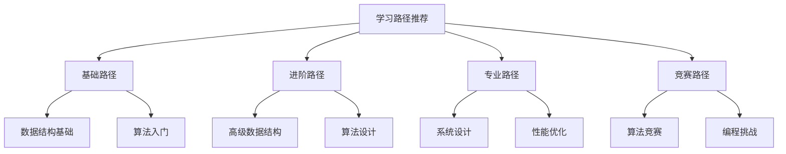

# 学习路径推荐

## 📖 核心概念

**学习路径推荐**是为不同学习目标量身定制的学习计划，帮助学习者系统性地掌握数据结构知识。通过合理的学习路径，可以高效地提升学习效果。

### 🏗️ 学习路径类型



## 🔧 基础学习路径

### 初学者路径

```cpp
class BeginnerLearningPath {
private:
    struct LearningStep {
        string title;
        string description;
        int estimatedHours;
        vector<string> prerequisites;
        vector<string> resources;
        string difficulty;
        
        LearningStep(const string& t, const string& d, int hours) 
            : title(t), description(d), estimatedHours(hours), difficulty("beginner") {}
    };
    
    vector<LearningStep> steps;
    
public:
    BeginnerLearningPath() {
        initializeSteps();
    }
    
    void initializeSteps() {
        // 第一步：数据结构基础
        LearningStep step1("数据结构基础", "学习基本的数据结构概念和分类", 20);
        step1.prerequisites = {"编程基础", "C++基础"};
        step1.resources = {"《数据结构与算法分析》", "在线课程：数据结构基础"};
        steps.push_back(step1);
        
        // 第二步：数组和链表
        LearningStep step2("数组和链表", "掌握线性数据结构的基本操作", 15);
        step2.prerequisites = {"数据结构基础"};
        step2.resources = {"《算法导论》第1-3章", "LeetCode：数组和链表题目"};
        steps.push_back(step2);
        
        // 第三步：栈和队列
        LearningStep step3("栈和队列", "学习受限线性数据结构", 12);
        step3.prerequisites = {"数组和链表"};
        step3.resources = {"《数据结构与算法分析》第3章", "编程练习：栈和队列应用"};
        steps.push_back(step3);
        
        // 第四步：树结构
        LearningStep step4("树结构", "掌握层次数据结构", 25);
        step4.prerequisites = {"栈和队列"};
        step4.resources = {"《算法导论》第12-13章", "二叉树遍历练习"};
        steps.push_back(step4);
        
        // 第五步：图结构
        LearningStep step5("图结构", "学习图的基本概念和表示", 20);
        step5.prerequisites = {"树结构"};
        step5.resources = {"《算法导论》第22-24章", "图的遍历算法"};
        steps.push_back(step5);
        
        // 第六步：排序算法
        LearningStep step6("排序算法", "掌握基本排序算法", 18);
        step6.prerequisites = {"图结构"};
        step6.resources = {"《算法导论》第2章", "排序算法实现练习"};
        steps.push_back(step6);
        
        // 第七步：搜索算法
        LearningStep step7("搜索算法", "学习基本搜索技术", 15);
        step7.prerequisites = {"排序算法"};
        step7.resources = {"《算法导论》第6章", "二分搜索练习"};
        steps.push_back(step7);
    }
    
    // 显示学习路径
    void displayLearningPath() {
        cout << "Beginner Learning Path:" << endl;
        cout << "=====================" << endl;
        
        int totalHours = 0;
        for (int i = 0; i < steps.size(); ++i) {
            const auto& step = steps[i];
            cout << "Step " << (i + 1) << ": " << step.title << endl;
            cout << "  Description: " << step.description << endl;
            cout << "  Estimated Hours: " << step.estimatedHours << endl;
            cout << "  Difficulty: " << step.difficulty << endl;
            cout << "  Prerequisites: ";
            for (const string& prereq : step.prerequisites) {
                cout << prereq << " ";
            }
            cout << endl;
            cout << "  Resources: ";
            for (const string& resource : step.resources) {
                cout << resource << " ";
            }
            cout << endl << endl;
            
            totalHours += step.estimatedHours;
        }
        
        cout << "Total Estimated Hours: " << totalHours << endl;
    }
    
    // 获取学习进度
    void trackProgress(int completedSteps) {
        cout << "Learning Progress:" << endl;
        cout << "=================" << endl;
        
        if (completedSteps >= steps.size()) {
            cout << "Congratulations! You have completed the beginner learning path!" << endl;
            return;
        }
        
        cout << "Completed Steps: " << completedSteps << "/" << steps.size() << endl;
        cout << "Progress: " << (double)completedSteps / steps.size() * 100 << "%" << endl;
        
        if (completedSteps < steps.size()) {
            cout << "Next Step: " << steps[completedSteps].title << endl;
            cout << "Description: " << steps[completedSteps].description << endl;
        }
    }
    
    // 推荐学习资源
    void recommendResources(int currentStep) {
        if (currentStep < 0 || currentStep >= steps.size()) {
            cout << "Invalid step number" << endl;
            return;
        }
        
        cout << "Recommended Resources for Step " << (currentStep + 1) << ":" << endl;
        cout << "===============================================" << endl;
        
        const auto& step = steps[currentStep];
        cout << "Step: " << step.title << endl;
        cout << "Resources:" << endl;
        
        for (const string& resource : step.resources) {
            cout << "  - " << resource << endl;
        }
    }
};
```

### 进阶学习路径

```cpp
class AdvancedLearningPath {
private:
    struct AdvancedStep {
        string title;
        string description;
        int estimatedHours;
        vector<string> prerequisites;
        vector<string> resources;
        string difficulty;
        vector<string> projects;
        
        AdvancedStep(const string& t, const string& d, int hours) 
            : title(t), description(d), estimatedHours(hours), difficulty("advanced") {}
    };
    
    vector<AdvancedStep> steps;
    
public:
    AdvancedLearningPath() {
        initializeSteps();
    }
    
    void initializeSteps() {
        // 第一步：高级数据结构
        AdvancedStep step1("高级数据结构", "学习复杂数据结构的设计和实现", 30);
        step1.prerequisites = {"数据结构基础", "算法基础"};
        step1.resources = {"《算法导论》第18-21章", "《数据结构与算法分析》第4-6章"};
        step1.projects = {"实现B+树", "设计LRU缓存", "构建跳表"};
        steps.push_back(step1);
        
        // 第二步：动态规划
        AdvancedStep step2("动态规划", "掌握动态规划算法设计", 25);
        step2.prerequisites = {"高级数据结构"};
        step2.resources = {"《算法导论》第15章", "动态规划专题练习"};
        step2.projects = {"背包问题求解器", "最长公共子序列", "编辑距离算法"};
        steps.push_back(step2);
        
        // 第三步：图论算法
        AdvancedStep step3("图论算法", "深入学习图算法", 28);
        step3.prerequisites = {"动态规划"};
        step3.resources = {"《算法导论》第22-26章", "图论算法实现"};
        step3.projects = {"最短路径算法", "最小生成树", "网络流算法"};
        steps.push_back(step3);
        
        // 第四步：字符串算法
        AdvancedStep step4("字符串算法", "掌握字符串处理技术", 22);
        step4.prerequisites = {"图论算法"};
        step4.resources = {"《算法导论》第32章", "字符串匹配算法"};
        step4.projects = {"KMP算法实现", "后缀数组构建", "AC自动机"};
        steps.push_back(step4);
        
        // 第五步：计算几何
        AdvancedStep step5("计算几何", "学习几何算法", 20);
        step5.prerequisites = {"字符串算法"};
        step5.resources = {"《计算几何算法与应用》", "几何算法练习"};
        step5.projects = {"凸包算法", "线段相交检测", "最近点对问题"};
        steps.push_back(step5);
        
        // 第六步：数论算法
        AdvancedStep step6("数论算法", "掌握数论相关算法", 18);
        step6.prerequisites = {"计算几何"};
        step6.resources = {"《数论算法》", "数论算法实现"};
        step6.projects = {"素数筛法", "快速幂算法", "扩展欧几里得算法"};
        steps.push_back(step6);
    }
    
    // 显示学习路径
    void displayLearningPath() {
        cout << "Advanced Learning Path:" << endl;
        cout << "=====================" << endl;
        
        int totalHours = 0;
        for (int i = 0; i < steps.size(); ++i) {
            const auto& step = steps[i];
            cout << "Step " << (i + 1) << ": " << step.title << endl;
            cout << "  Description: " << step.description << endl;
            cout << "  Estimated Hours: " << step.estimatedHours << endl;
            cout << "  Difficulty: " << step.difficulty << endl;
            cout << "  Prerequisites: ";
            for (const string& prereq : step.prerequisites) {
                cout << prereq << " ";
            }
            cout << endl;
            cout << "  Resources: ";
            for (const string& resource : step.resources) {
                cout << resource << " ";
            }
            cout << endl;
            cout << "  Projects: ";
            for (const string& project : step.projects) {
                cout << project << " ";
            }
            cout << endl << endl;
            
            totalHours += step.estimatedHours;
        }
        
        cout << "Total Estimated Hours: " << totalHours << endl;
    }
    
    // 推荐项目
    void recommendProjects(int currentStep) {
        if (currentStep < 0 || currentStep >= steps.size()) {
            cout << "Invalid step number" << endl;
            return;
        }
        
        cout << "Recommended Projects for Step " << (currentStep + 1) << ":" << endl;
        cout << "===============================================" << endl;
        
        const auto& step = steps[currentStep];
        cout << "Step: " << step.title << endl;
        cout << "Projects:" << endl;
        
        for (const string& project : step.projects) {
            cout << "  - " << project << endl;
        }
    }
};
```

## 🎯 专业学习路径

### 系统设计路径

```cpp
class SystemDesignLearningPath {
private:
    struct SystemDesignStep {
        string title;
        string description;
        int estimatedHours;
        vector<string> prerequisites;
        vector<string> resources;
        string difficulty;
        vector<string> designPatterns;
        
        SystemDesignStep(const string& t, const string& d, int hours) 
            : title(t), description(d), estimatedHours(hours), difficulty("expert") {}
    };
    
    vector<SystemDesignStep> steps;
    
public:
    SystemDesignLearningPath() {
        initializeSteps();
    }
    
    void initializeSteps() {
        // 第一步：分布式系统基础
        SystemDesignStep step1("分布式系统基础", "学习分布式系统的基本概念", 25);
        step1.prerequisites = {"数据结构基础", "网络基础"};
        step1.resources = {"《设计数据密集型应用》", "分布式系统课程"};
        step1.designPatterns = {"CAP定理", "一致性模型", "分布式锁"};
        steps.push_back(step1);
        
        // 第二步：数据库设计
        SystemDesignStep step2("数据库设计", "掌握数据库设计和优化", 30);
        step2.prerequisites = {"分布式系统基础"};
        step2.resources = {"《数据库系统概念》", "数据库设计实践"};
        step2.designPatterns = {"索引设计", "查询优化", "分库分表"};
        steps.push_back(step2);
        
        // 第三步：缓存系统
        SystemDesignStep step3("缓存系统", "学习缓存策略和实现", 20);
        step3.prerequisites = {"数据库设计"};
        step3.resources = {"《Redis设计与实现》", "缓存系统实践"};
        step3.designPatterns = {"缓存策略", "缓存一致性", "缓存穿透"};
        steps.push_back(step3);
        
        // 第四步：负载均衡
        SystemDesignStep step4("负载均衡", "掌握负载均衡技术", 18);
        step4.prerequisites = {"缓存系统"};
        step4.resources = {"《负载均衡技术》", "负载均衡实践"};
        step4.designPatterns = {"轮询算法", "加权轮询", "最少连接"};
        steps.push_back(step4);
        
        // 第五步：微服务架构
        SystemDesignStep step5("微服务架构", "学习微服务设计", 28);
        step5.prerequisites = {"负载均衡"};
        step5.resources = {"《微服务架构设计模式》", "微服务实践"};
        step5.designPatterns = {"服务拆分", "服务治理", "服务监控"};
        steps.push_back(step5);
        
        // 第六步：性能优化
        SystemDesignStep step6("性能优化", "掌握系统性能优化", 22);
        step6.prerequisites = {"微服务架构"};
        step6.resources = {"《高性能MySQL》", "性能优化实践"};
        step6.designPatterns = {"性能监控", "瓶颈分析", "优化策略"};
        steps.push_back(step6);
    }
    
    // 显示学习路径
    void displayLearningPath() {
        cout << "System Design Learning Path:" << endl;
        cout << "=========================" << endl;
        
        int totalHours = 0;
        for (int i = 0; i < steps.size(); ++i) {
            const auto& step = steps[i];
            cout << "Step " << (i + 1) << ": " << step.title << endl;
            cout << "  Description: " << step.description << endl;
            cout << "  Estimated Hours: " << step.estimatedHours << endl;
            cout << "  Difficulty: " << step.difficulty << endl;
            cout << "  Prerequisites: ";
            for (const string& prereq : step.prerequisites) {
                cout << prereq << " ";
            }
            cout << endl;
            cout << "  Resources: ";
            for (const string& resource : step.resources) {
                cout << resource << " ";
            }
            cout << endl;
            cout << "  Design Patterns: ";
            for (const string& pattern : step.designPatterns) {
                cout << pattern << " ";
            }
            cout << endl << endl;
            
            totalHours += step.estimatedHours;
        }
        
        cout << "Total Estimated Hours: " << totalHours << endl;
    }
    
    // 推荐设计模式
    void recommendDesignPatterns(int currentStep) {
        if (currentStep < 0 || currentStep >= steps.size()) {
            cout << "Invalid step number" << endl;
            return;
        }
        
        cout << "Recommended Design Patterns for Step " << (currentStep + 1) << ":" << endl;
        cout << "===============================================" << endl;
        
        const auto& step = steps[currentStep];
        cout << "Step: " << step.title << endl;
        cout << "Design Patterns:" << endl;
        
        for (const string& pattern : step.designPatterns) {
            cout << "  - " << pattern << endl;
        }
    }
};
```

### 竞赛学习路径

```cpp
class CompetitionLearningPath {
private:
    struct CompetitionStep {
        string title;
        string description;
        int estimatedHours;
        vector<string> prerequisites;
        vector<string> resources;
        string difficulty;
        vector<string> problems;
        
        CompetitionStep(const string& t, const string& d, int hours) 
            : title(t), description(d), estimatedHours(hours), difficulty("expert") {}
    };
    
    vector<CompetitionStep> steps;
    
public:
    CompetitionLearningPath() {
        initializeSteps();
    }
    
    void initializeSteps() {
        // 第一步：基础算法
        CompetitionStep step1("基础算法", "掌握竞赛中的基础算法", 20);
        step1.prerequisites = {"数据结构基础", "算法基础"};
        step1.resources = {"《算法竞赛入门经典》", "基础算法练习"};
        step1.problems = {"排序算法", "搜索算法", "贪心算法"};
        steps.push_back(step1);
        
        // 第二步：动态规划
        CompetitionStep step2("动态规划", "深入学习动态规划", 25);
        step2.prerequisites = {"基础算法"};
        step2.resources = {"《算法竞赛入门经典》第9章", "动态规划专题"};
        step2.problems = {"背包问题", "最长上升子序列", "区间DP"};
        steps.push_back(step2);
        
        // 第三步：图论算法
        CompetitionStep step3("图论算法", "掌握图论相关算法", 28);
        step3.prerequisites = {"动态规划"};
        step3.resources = {"《算法竞赛入门经典》第11章", "图论算法练习"};
        step3.problems = {"最短路径", "最小生成树", "网络流"};
        steps.push_back(step3);
        
        // 第四步：字符串算法
        CompetitionStep step4("字符串算法", "学习字符串处理算法", 22);
        step4.prerequisites = {"图论算法"};
        step4.resources = {"《算法竞赛入门经典》第12章", "字符串算法练习"};
        step4.problems = {"KMP算法", "后缀数组", "AC自动机"};
        steps.push_back(step4);
        
        // 第五步：数学算法
        CompetitionStep step5("数学算法", "掌握数论和组合数学", 30);
        step5.prerequisites = {"字符串算法"};
        step5.resources = {"《算法竞赛入门经典》第10章", "数学算法练习"};
        step5.problems = {"素数筛法", "快速幂", "组合数学"};
        steps.push_back(step5);
        
        // 第六步：高级技巧
        CompetitionStep step6("高级技巧", "学习竞赛中的高级技巧", 25);
        step6.prerequisites = {"数学算法"};
        step6.resources = {"《算法竞赛进阶指南》", "高级技巧练习"};
        step6.problems = {"线段树", "树状数组", "分块算法"};
        steps.push_back(step6);
    }
    
    // 显示学习路径
    void displayLearningPath() {
        cout << "Competition Learning Path:" << endl;
        cout << "========================" << endl;
        
        int totalHours = 0;
        for (int i = 0; i < steps.size(); ++i) {
            const auto& step = steps[i];
            cout << "Step " << (i + 1) << ": " << step.title << endl;
            cout << "  Description: " << step.description << endl;
            cout << "  Estimated Hours: " << step.estimatedHours << endl;
            cout << "  Difficulty: " << step.difficulty << endl;
            cout << "  Prerequisites: ";
            for (const string& prereq : step.prerequisites) {
                cout << prereq << " ";
            }
            cout << endl;
            cout << "  Resources: ";
            for (const string& resource : step.resources) {
                cout << resource << " ";
            }
            cout << endl;
            cout << "  Problems: ";
            for (const string& problem : step.problems) {
                cout << problem << " ";
            }
            cout << endl << endl;
            
            totalHours += step.estimatedHours;
        }
        
        cout << "Total Estimated Hours: " << totalHours << endl;
    }
    
    // 推荐题目
    void recommendProblems(int currentStep) {
        if (currentStep < 0 || currentStep >= steps.size()) {
            cout << "Invalid step number" << endl;
            return;
        }
        
        cout << "Recommended Problems for Step " << (currentStep + 1) << ":" << endl;
        cout << "===============================================" << endl;
        
        const auto& step = steps[currentStep];
        cout << "Step: " << step.title << endl;
        cout << "Problems:" << endl;
        
        for (const string& problem : step.problems) {
            cout << "  - " << problem << endl;
        }
    }
};
```

## 🎮 学习路径应用

### 1. 个性化学习计划

```cpp
class PersonalizedLearningPlan {
private:
    struct LearningGoal {
        string goal;
        string level;
        int targetHours;
        vector<string> interests;
        
        LearningGoal(const string& g, const string& l, int hours) 
            : goal(g), level(l), targetHours(hours) {}
    };
    
    vector<LearningGoal> goals;
    
public:
    PersonalizedLearningPlan() {}
    
    // 添加学习目标
    void addGoal(const string& goal, const string& level, int hours, const vector<string>& interests) {
        LearningGoal newGoal(goal, level, hours);
        newGoal.interests = interests;
        goals.push_back(newGoal);
    }
    
    // 生成学习计划
    void generateLearningPlan() {
        cout << "Personalized Learning Plan:" << endl;
        cout << "=========================" << endl;
        
        for (const auto& goal : goals) {
            cout << "Goal: " << goal.goal << endl;
            cout << "  Level: " << goal.level << endl;
            cout << "  Target Hours: " << goal.targetHours << endl;
            cout << "  Interests: ";
            for (const string& interest : goal.interests) {
                cout << interest << " ";
            }
            cout << endl;
            
            // 推荐学习路径
            if (goal.level == "beginner") {
                cout << "  Recommended Path: Beginner Learning Path" << endl;
            } else if (goal.level == "intermediate") {
                cout << "  Recommended Path: Advanced Learning Path" << endl;
            } else if (goal.level == "expert") {
                cout << "  Recommended Path: System Design Learning Path" << endl;
            }
            
            cout << endl;
        }
    }
    
    // 跟踪学习进度
    void trackProgress(const string& goal, int completedHours) {
        for (auto& g : goals) {
            if (g.goal == goal) {
                double progress = (double)completedHours / g.targetHours * 100;
                cout << "Goal: " << goal << endl;
                cout << "  Progress: " << progress << "%" << endl;
                cout << "  Completed: " << completedHours << "/" << g.targetHours << " hours" << endl;
                
                if (progress >= 100) {
                    cout << "  Congratulations! Goal completed!" << endl;
                } else {
                    cout << "  Remaining: " << (g.targetHours - completedHours) << " hours" << endl;
                }
                break;
            }
        }
    }
    
    // 显示学习建议
    void displayLearningAdvice() {
        cout << "Learning Advice:" << endl;
        cout << "===============" << endl;
        
        cout << "1. 制定明确的学习目标" << endl;
        cout << "2. 合理安排学习时间" << endl;
        cout << "3. 多做实践练习" << endl;
        cout << "4. 参与技术社区讨论" << endl;
        cout << "5. 定期复习和总结" << endl;
        cout << "6. 寻找学习伙伴" << endl;
        cout << "7. 保持学习的持续性" << endl;
    }
};
```

### 2. 学习资源推荐

```cpp
class LearningResourceRecommender {
private:
    struct Resource {
        string name;
        string type;
        string level;
        double rating;
        string description;
        
        Resource(const string& n, const string& t, const string& l) 
            : name(n), type(t), level(l), rating(0) {}
    };
    
    vector<Resource> resources;
    
public:
    LearningResourceRecommender() {
        initializeResources();
    }
    
    void initializeResources() {
        // 书籍资源
        Resource book1("《算法导论》", "书籍", "advanced");
        book1.rating = 4.8;
        book1.description = "计算机科学领域的经典教材";
        resources.push_back(book1);
        
        Resource book2("《数据结构与算法分析》", "书籍", "intermediate");
        book2.rating = 4.6;
        book2.description = "数据结构学习的优秀教材";
        resources.push_back(book2);
        
        // 在线课程
        Resource course1("数据结构与算法", "在线课程", "beginner");
        course1.rating = 4.7;
        course1.description = "Coursera上的数据结构课程";
        resources.push_back(course1);
        
        Resource course2("算法设计与分析", "在线课程", "advanced");
        course2.rating = 4.5;
        course2.description = "edX上的算法设计课程";
        resources.push_back(course2);
        
        // 实践平台
        Resource platform1("LeetCode", "实践平台", "intermediate");
        platform1.rating = 4.9;
        platform1.description = "算法练习和面试准备平台";
        resources.push_back(platform1);
        
        Resource platform2("HackerRank", "实践平台", "beginner");
        platform2.rating = 4.4;
        platform2.description = "编程挑战和技能评估平台";
        resources.push_back(platform2);
    }
    
    // 推荐资源
    vector<Resource> recommendResources(const string& level, const string& type) {
        vector<Resource> recommendations;
        
        for (const auto& resource : resources) {
            if (resource.level == level && resource.type == type) {
                recommendations.push_back(resource);
            }
        }
        
        // 按评分排序
        sort(recommendations.begin(), recommendations.end(), 
             [](const Resource& a, const Resource& b) {
                 return a.rating > b.rating;
             });
        
        return recommendations;
    }
    
    // 显示推荐资源
    void displayRecommendations(const string& level, const string& type) {
        cout << "Recommended Resources for " << level << " " << type << ":" << endl;
        cout << "===============================================" << endl;
        
        vector<Resource> recommendations = recommendResources(level, type);
        
        for (const auto& resource : recommendations) {
            cout << "Name: " << resource.name << endl;
            cout << "  Type: " << resource.type << endl;
            cout << "  Level: " << resource.level << endl;
            cout << "  Rating: " << resource.rating << "/5.0" << endl;
            cout << "  Description: " << resource.description << endl;
            cout << endl;
        }
    }
    
    // 显示所有资源
    void displayAllResources() {
        cout << "All Learning Resources:" << endl;
        cout << "=====================" << endl;
        
        for (const auto& resource : resources) {
            cout << "Name: " << resource.name << endl;
            cout << "  Type: " << resource.type << endl;
            cout << "  Level: " << resource.level << endl;
            cout << "  Rating: " << resource.rating << "/5.0" << endl;
            cout << "  Description: " << resource.description << endl;
            cout << endl;
        }
    }
};
```

## 🔗 相关链接

- [[01-前沿探索|前沿探索]]
- [[02-跨界融合|跨界融合]]
- [[03-学习资源|学习资源]]

## 💡 学习路径推荐要点

1. **基础路径**：适合初学者，循序渐进
2. **进阶路径**：适合有一定基础的学习者
3. **专业路径**：适合系统设计和性能优化
4. **竞赛路径**：适合算法竞赛和编程挑战

---

*📝 路径提示：选择合适的学习路径可以显著提升学习效率，建议根据个人目标选择*
