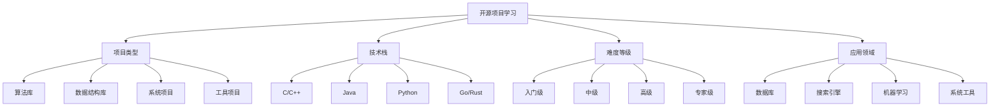

# 开源项目学习

## 📖 核心概念

**开源项目学习**是数据结构与算法学习的重要实践方式，通过参与和贡献开源项目，可以深入理解实际应用中的数据结构设计和算法实现。开源项目提供了真实的代码库、协作开发经验和最佳实践，是理论学习的重要补充。

### 🏗️ 开源项目分类



## 🔧 开源项目推荐

### 算法库项目

#### 1. Boost C++ Libraries
**项目地址**: https://github.com/boostorg/boost
**语言**: C++
**推荐指数**: ⭐⭐⭐⭐⭐

**项目特点**:
- 高质量的C++算法库
- 广泛使用的数据结构
- 优秀的性能优化
- 丰富的文档和测试

**核心组件**:
- Boost.Graph: 图算法库
- Boost.Heap: 堆数据结构
- Boost.Intrusive: 侵入式容器
- Boost.Container: 高级容器

**学习价值**:
- 学习C++模板编程
- 理解高性能数据结构
- 掌握算法优化技巧
- 了解工业级代码质量

**参与方式**:
- 阅读源码理解实现
- 提交bug报告
- 贡献代码改进
- 编写文档和测试

#### 2. Apache Commons Collections
**项目地址**: https://github.com/apache/commons-collections
**语言**: Java
**推荐指数**: ⭐⭐⭐⭐⭐

**项目特点**:
- Java集合框架扩展
- 丰富的数据结构实现
- 良好的API设计
- 完善的测试覆盖

**核心组件**:
- 双向链表实现
- 多值映射
- 有序集合
- 缓存实现

**学习价值**:
- 学习Java集合设计
- 理解数据结构实现
- 掌握API设计原则
- 了解测试驱动开发

**参与方式**:
- 学习源码实现
- 提交性能优化
- 添加新功能
- 改进文档

#### 3. Python Algorithms
**项目地址**: https://github.com/TheAlgorithms/Python
**语言**: Python
**推荐指数**: ⭐⭐⭐⭐

**项目特点**:
- 全面的算法实现
- 清晰的代码注释
- 丰富的示例
- 教育友好

**核心内容**:
- 排序算法
- 搜索算法
- 图算法
- 动态规划

**学习价值**:
- 学习Python编程
- 理解算法实现
- 掌握代码规范
- 了解算法应用

**参与方式**:
- 实现新算法
- 优化现有代码
- 添加测试用例
- 改进文档

### 数据结构库项目

#### 4. Redis
**项目地址**: https://github.com/redis/redis
**语言**: C
**推荐指数**: ⭐⭐⭐⭐⭐

**项目特点**:
- 高性能内存数据库
- 多种数据结构支持
- 优秀的架构设计
- 广泛的生产应用

**核心数据结构**:
- 字符串(String)
- 列表(List)
- 集合(Set)
- 有序集合(Sorted Set)
- 哈希表(Hash)

**学习价值**:
- 学习高性能数据结构
- 理解内存管理
- 掌握并发编程
- 了解数据库设计

**参与方式**:
- 阅读核心代码
- 理解数据结构实现
- 学习性能优化
- 参与社区讨论

#### 5. LevelDB
**项目地址**: https://github.com/google/leveldb
**语言**: C++
**推荐指数**: ⭐⭐⭐⭐⭐

**项目特点**:
- Google开发的高性能存储引擎
- LSM-Tree数据结构
- 优秀的读写性能
- 简洁的API设计

**核心特性**:
- LSM-Tree实现
- 布隆过滤器
- 压缩算法
- 快照机制

**学习价值**:
- 学习LSM-Tree设计
- 理解存储引擎原理
- 掌握性能优化
- 了解Google工程实践

**参与方式**:
- 学习源码架构
- 理解算法实现
- 分析性能优化
- 学习测试方法

#### 6. RocksDB
**项目地址**: https://github.com/facebook/rocksdb
**语言**: C++
**推荐指数**: ⭐⭐⭐⭐⭐

**项目特点**:
- Facebook优化的存储引擎
- 基于LevelDB改进
- 丰富的功能特性
- 优秀的性能表现

**核心改进**:
- 多线程优化
- 压缩策略改进
- 内存管理优化
- 监控和调试工具

**学习价值**:
- 学习存储引擎优化
- 理解多线程编程
- 掌握性能调优
- 了解Facebook工程实践

**参与方式**:
- 学习优化技巧
- 理解架构设计
- 分析性能改进
- 学习工程实践

### 系统项目

#### 7. Linux Kernel
**项目地址**: https://github.com/torvalds/linux
**语言**: C
**推荐指数**: ⭐⭐⭐⭐⭐

**项目特点**:
- 世界最大的开源项目
- 复杂的系统架构
- 高性能数据结构
- 优秀的代码质量

**核心数据结构**:
- 红黑树
- 哈希表
- 链表
- 队列
- 位图

**学习价值**:
- 学习系统级数据结构
- 理解内核编程
- 掌握性能优化
- 了解操作系统原理

**参与方式**:
- 学习内核数据结构
- 理解系统调用
- 分析性能优化
- 参与社区讨论

#### 8. PostgreSQL
**项目地址**: https://github.com/postgresql/postgresql
**语言**: C
**推荐指数**: ⭐⭐⭐⭐⭐

**项目特点**:
- 开源关系数据库
- 复杂的数据结构
- 优秀的查询优化
- 丰富的功能特性

**核心数据结构**:
- B+树索引
- 哈希索引
- 位图索引
- 内存管理

**学习价值**:
- 学习数据库设计
- 理解索引结构
- 掌握查询优化
- 了解事务处理

**参与方式**:
- 学习数据库架构
- 理解索引实现
- 分析查询优化
- 参与功能开发

#### 9. MongoDB
**项目地址**: https://github.com/mongodb/mongo
**语言**: C++
**推荐指数**: ⭐⭐⭐⭐

**项目特点**:
- 文档数据库
- 灵活的数据模型
- 高性能存储
- 丰富的功能

**核心数据结构**:
- BSON文档
- 索引结构
- 内存映射
- 复制机制

**学习价值**:
- 学习NoSQL设计
- 理解文档存储
- 掌握索引优化
- 了解分布式系统

**参与方式**:
- 学习存储引擎
- 理解索引实现
- 分析性能优化
- 参与功能开发

### 工具项目

#### 10. Git
**项目地址**: https://github.com/git/git
**语言**: C
**推荐指数**: ⭐⭐⭐⭐⭐

**项目特点**:
- 分布式版本控制
- 高效的数据结构
- 优秀的算法设计
- 广泛的使用

**核心数据结构**:
- 有向无环图
- 哈希表
- 压缩算法
- 增量存储

**学习价值**:
- 学习版本控制原理
- 理解图算法应用
- 掌握压缩技术
- 了解分布式系统

**参与方式**:
- 学习核心算法
- 理解数据结构
- 分析性能优化
- 参与功能开发

#### 11. V8 JavaScript Engine
**项目地址**: https://github.com/v8/v8
**语言**: C++
**推荐指数**: ⭐⭐⭐⭐⭐

**项目特点**:
- Google的JavaScript引擎
- 高性能执行
- 复杂的数据结构
- 优秀的优化技术

**核心数据结构**:
- 对象模型
- 垃圾回收
- 内联缓存
- 优化编译器

**学习价值**:
- 学习虚拟机设计
- 理解垃圾回收
- 掌握编译优化
- 了解JavaScript实现

**参与方式**:
- 学习引擎架构
- 理解优化技术
- 分析性能改进
- 参与功能开发

#### 12. TensorFlow
**项目地址**: https://github.com/tensorflow/tensorflow
**语言**: C++, Python
**推荐指数**: ⭐⭐⭐⭐⭐

**项目特点**:
- Google的机器学习框架
- 复杂的数据流图
- 高性能计算
- 丰富的功能

**核心数据结构**:
- 计算图
- 张量表示
- 内存管理
- 并行计算

**学习价值**:
- 学习机器学习系统
- 理解计算图
- 掌握并行计算
- 了解深度学习

**参与方式**:
- 学习系统架构
- 理解计算图
- 分析性能优化
- 参与功能开发

## 🎯 项目学习指南

### 学习路径推荐

```python
class OpenSourceProjectLearningGuide:
    @staticmethod
    def recommend_learning_path(level, interests, time_available):
        print("开源项目学习指南:")
        print("===============")
        
        if level == "beginner":
            print("初学者推荐:")
            print("1. Python Algorithms - 学习基础算法")
            print("2. Apache Commons Collections - 理解数据结构")
            print("3. Git - 学习版本控制")
        
        elif level == "intermediate":
            print("进阶者推荐:")
            print("1. Boost C++ Libraries - 学习高性能实现")
            print("2. Redis - 理解内存数据库")
            print("3. PostgreSQL - 学习数据库设计")
        
        elif level == "advanced":
            print("高级者推荐:")
            print("1. Linux Kernel - 学习系统级数据结构")
            print("2. LevelDB/RocksDB - 理解存储引擎")
            print("3. V8 Engine - 学习虚拟机设计")
        
        if interests == "algorithms":
            print("\n算法兴趣:")
            print("- 重点学习算法库项目")
            print("- 关注算法实现细节")
            print("- 学习性能优化技巧")
        
        elif interests == "databases":
            print("\n数据库兴趣:")
            print("- 重点学习数据库项目")
            print("- 关注存储引擎设计")
            print("- 学习查询优化")
        
        elif interests == "systems":
            print("\n系统兴趣:")
            print("- 重点学习系统项目")
            print("- 关注架构设计")
            print("- 学习性能优化")
        
        if time_available == "limited":
            print("\n时间有限建议:")
            print("- 选择小型项目学习")
            print("- 重点关注核心模块")
            print("- 利用碎片时间学习")
        
        elif time_available == "abundant":
            print("\n时间充足建议:")
            print("- 选择大型项目学习")
            print("- 深入理解架构设计")
            print("- 参与项目贡献")
    
    @staticmethod
    def analyze_project_characteristics():
        print("项目特点分析:")
        print("===========")
        
        print("1. 项目规模:")
        print("   - 小型项目: 易于理解")
        print("   - 中型项目: 平衡复杂度")
        print("   - 大型项目: 复杂架构")
        print("   - 超大型项目: 系统级设计")
        print()
        
        print("2. 技术栈:")
        print("   - C/C++: 系统级编程")
        print("   - Java: 企业级应用")
        print("   - Python: 快速开发")
        print("   - Go/Rust: 现代系统编程")
        print()
        
        print("3. 应用领域:")
        print("   - 算法库: 算法实现")
        print("   - 数据库: 存储系统")
        print("   - 系统工具: 系统编程")
        print("   - 机器学习: AI系统")
        print()
        
        print("4. 学习价值:")
        print("   - 代码质量: 学习最佳实践")
        print("   - 架构设计: 理解系统设计")
        print("   - 性能优化: 掌握优化技巧")
        print("   - 工程实践: 了解工业标准")
    
    @staticmethod
    def select_project_strategy(background, goals, constraints, preferences):
        print("项目选择策略:")
        print("===========")
        
        print(f"背景: {background}")
        print(f"目标: {goals}")
        print(f"约束: {constraints}")
        print(f"偏好: {preferences}")
        
        print("\n推荐策略:")
        
        if background == "computer_science" and goals == "comprehensive":
            print("选择多个不同类型的项目")
            print("从算法库到系统项目")
            print("全面了解数据结构应用")
        
        elif background == "self_taught" and goals == "practical":
            print("选择实用性强的小型项目")
            print("重点关注代码实现")
            print("学习最佳实践")
        
        elif background == "experienced" and goals == "specialized":
            print("选择专业领域的大型项目")
            print("深入理解架构设计")
            print("学习高级优化技巧")
        
        if constraints == "time_limited":
            print("\n时间有限建议:")
            print("- 选择小型项目")
            print("- 重点关注核心模块")
            print("- 利用现有资源学习")
        
        elif constraints == "skill_limited":
            print("\n技能有限建议:")
            print("- 选择简单项目")
            print("- 重点关注基础实现")
            print("- 逐步提升技能")
        
        if preferences == "performance":
            print("\n性能关注建议:")
            print("- 选择高性能项目")
            print("- 学习优化技巧")
            print("- 关注性能测试")
        
        elif preferences == "architecture":
            print("\n架构关注建议:")
            print("- 选择大型项目")
            print("- 学习系统设计")
            print("- 关注模块化设计")
```

## 📊 项目学习分析

### 学习效果分析

```python
class OpenSourceProjectLearningAnalysis:
    @staticmethod
    def analyze_learning_effectiveness():
        print("开源项目学习效果分析:")
        print("==================")
        
        print("1. 学习效率:")
        print("   - 代码阅读: 理解实现细节")
        print("   - 实践参与: 提升编程能力")
        print("   - 社区互动: 扩展知识网络")
        print("   - 项目贡献: 获得实践经验")
        print()
        
        print("2. 知识掌握:")
        print("   - 算法理解: 通过代码学习")
        print("   - 数据结构: 理解实际应用")
        print("   - 系统设计: 学习架构模式")
        print("   - 工程实践: 掌握最佳实践")
        print()
        
        print("3. 技能提升:")
        print("   - 编程能力: 代码实现")
        print("   - 调试能力: 问题解决")
        print("   - 协作能力: 团队合作")
        print("   - 沟通能力: 社区交流")
    
    @staticmethod
    def analyze_learning_methods():
        print("学习方法分析:")
        print("===========")
        
        print("1. 学习策略:")
        print("   - 自上而下: 先理解架构")
        print("   - 自下而上: 先理解细节")
        print("   - 问题驱动: 解决具体问题")
        print("   - 项目驱动: 完成具体任务")
        print()
        
        print("2. 参与方式:")
        print("   - 代码阅读: 理解实现")
        print("   - 问题报告: 发现bug")
        print("   - 功能开发: 添加功能")
        print("   - 文档改进: 完善文档")
        print()
        
        print("3. 学习工具:")
        print("   - 代码编辑器: 阅读代码")
        print("   - 调试器: 理解执行")
        print("   - 版本控制: 跟踪变化")
        print("   - 测试工具: 验证理解")
    
    @staticmethod
    def analyze_learning_progress():
        print("学习进度分析:")
        print("===========")
        
        print("1. 学习阶段:")
        print("   - 入门阶段: 理解项目结构")
        print("   - 进阶阶段: 理解核心实现")
        print("   - 高级阶段: 参与项目开发")
        print("   - 专家阶段: 主导项目方向")
        print()
        
        print("2. 学习指标:")
        print("   - 代码理解: 能解释实现")
        print("   - 问题解决: 能修复bug")
        print("   - 功能开发: 能添加功能")
        print("   - 架构设计: 能设计模块")
        print()
        
        print("3. 学习评估:")
        print("   - 自我评估: 定期检查")
        print("   - 社区评估: 获得反馈")
        print("   - 项目评估: 贡献质量")
        print("   - 技能评估: 能力提升")
```

## 🎮 开源项目学习测试

### 1. 基础功能测试

```python
def test_project_recommendations():
    print("Testing Project Recommendations:")
    print("==============================")
    
    # 测试项目推荐
    guide = OpenSourceProjectLearningGuide()
    
    print("初学者推荐:")
    guide.recommend_learning_path("beginner", "algorithms", "limited")
    
    print("\n进阶者推荐:")
    guide.recommend_learning_path("intermediate", "databases", "abundant")
    
    print("\n高级者推荐:")
    guide.recommend_learning_path("advanced", "systems", "abundant")
    
    print("\n项目特点分析:")
    guide.analyze_project_characteristics()
    
    print("\n项目选择策略:")
    guide.select_project_strategy("computer_science", "comprehensive", "time_limited", "performance")

def test_learning_analysis():
    print("\nTesting Learning Analysis:")
    print("========================")
    
    analysis = OpenSourceProjectLearningAnalysis()
    
    print("学习效果分析:")
    analysis.analyze_learning_effectiveness()
    
    print("\n学习方法分析:")
    analysis.analyze_learning_methods()
    
    print("\n学习进度分析:")
    analysis.analyze_learning_progress()

def test_project_categories():
    print("\nTesting Project Categories:")
    print("==========================")
    
    print("算法库项目:")
    print("- Boost C++: 高性能C++库")
    print("- Apache Commons: Java集合扩展")
    print("- Python Algorithms: 算法实现")
    
    print("\n数据结构库项目:")
    print("- Redis: 内存数据库")
    print("- LevelDB: 存储引擎")
    print("- RocksDB: 优化存储引擎")
    
    print("\n系统项目:")
    print("- Linux Kernel: 操作系统内核")
    print("- PostgreSQL: 关系数据库")
    print("- MongoDB: 文档数据库")
    
    print("\n工具项目:")
    print("- Git: 版本控制系统")
    print("- V8: JavaScript引擎")
    print("- TensorFlow: 机器学习框架")

def test_learning_strategies():
    print("\nTesting Learning Strategies:")
    print("==========================")
    
    print("学习策略选择:")
    print("1. 项目选择:")
    print("   - 算法库: 学习算法实现")
    print("   - 数据库: 学习存储系统")
    print("   - 系统工具: 学习系统编程")
    
    print("\n2. 参与方式:")
    print("   - 代码阅读: 理解实现")
    print("   - 问题报告: 发现bug")
    print("   - 功能开发: 添加功能")
    print("   - 文档改进: 完善文档")
    
    print("\n3. 学习工具:")
    print("   - 代码编辑器: 阅读代码")
    print("   - 调试器: 理解执行")
    print("   - 版本控制: 跟踪变化")
    print("   - 测试工具: 验证理解")

def test_applications():
    print("Testing Applications:")
    print("==================")
    
    print("项目应用场景:")
    print("1. 学习研究:")
    print("   - 算法实现研究")
    print("   - 数据结构应用")
    print("   - 系统设计学习")
    
    print("\n2. 技能提升:")
    print("   - 编程能力提升")
    print("   - 系统设计能力")
    print("   - 工程实践能力")
    
    print("\n3. 职业发展:")
    print("   - 开源贡献")
    print("   - 技术影响力")
    print("   - 职业机会")
    
    print("\n4. 社区参与:")
    print("   - 技术交流")
    print("   - 知识分享")
    print("   - 协作开发")

def test_analysis():
    print("Testing Analysis:")
    print("===============")
    
    print("项目分析要点:")
    print("1. 项目质量:")
    print("   - 代码质量")
    print("   - 架构设计")
    print("   - 文档完善")
    
    print("\n2. 学习价值:")
    print("   - 技术深度")
    print("   - 实用价值")
    print("   - 学习难度")
    
    print("\n3. 参与方式:")
    print("   - 学习方式")
    print("   - 贡献方式")
    print("   - 社区参与")

# 主测试函数
def main():
    test_project_recommendations()
    test_learning_analysis()
    test_project_categories()
    test_learning_strategies()
    test_applications()
    test_analysis()

if __name__ == "__main__":
    main()
```

## 🔗 相关链接

- [[01-经典教材推荐|经典教材推荐]]
- [[02-在线课程推荐|在线课程推荐]]
- [[04-技术博客与论坛|技术博客与论坛]]

## 💡 开源项目学习要点

1. **项目选择**: 根据学习目标和技能水平选择合适的项目
2. **学习方式**: 采用多种方式参与项目学习
3. **参与贡献**: 积极参与项目贡献获得实践经验
4. **社区互动**: 通过社区交流扩展知识网络

---

*📝 开源项目学习提示：开源项目是学习数据结构与算法的重要实践资源，需要选择合适的项目并积极参与*
