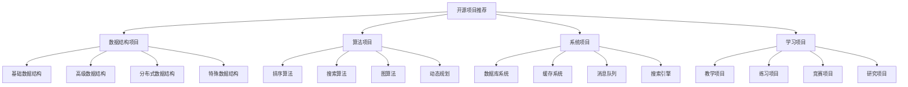

# 开源项目推荐

## 📖 核心概念

**开源项目推荐**是为数据结构学习者提供优质开源项目的指南。通过推荐和介绍优秀的开源项目，可以帮助学习者更好地理解数据结构的实际应用，提升编程技能，并参与到开源社区中。

### 🏗️ 开源项目推荐的组成要素

## 🔍 开源项目分类

### 项目难度分类

| 难度等级 | 项目特点 | 技术要求 | 学习价值 | 适用人群 |
|----------|----------|----------|----------|----------|
| **入门级** | 基础实现 | 基础编程 | 高 | 初学者 |
| **进阶级** | 复杂算法 | 算法基础 | 高 | 有经验者 |
| **专家级** | 系统设计 | 系统知识 | 极高 | 专家级 |
| **研究级** | 前沿技术 | 研究能力 | 极高 | 研究人员 |

## 💻 开源项目推荐

### 数据结构项目

#### 基础数据结构项目

**1. C++ STL (Standard Template Library)**
- **项目地址**: https://github.com/gcc-mirror/gcc
- **项目描述**: C++标准模板库，包含各种数据结构的实现
- **技术特点**: 
  - 模板编程
  - 内存管理
  - 性能优化
- **学习价值**: 理解标准库的设计和实现
- **难度等级**: 进阶级
- **推荐理由**: 学习C++标准库的最佳资源

**2. Java Collections Framework**
- **项目地址**: https://github.com/openjdk/jdk
- **项目描述**: Java集合框架，包含各种数据结构的实现
- **技术特点**:
  - 面向对象设计
  - 泛型编程
  - 线程安全
- **学习价值**: 理解Java集合框架的设计
- **难度等级**: 进阶级
- **推荐理由**: Java开发必备知识

**3. Python Data Structures**
- **项目地址**: https://github.com/python/cpython
- **项目描述**: Python内置数据结构实现
- **技术特点**:
  - 动态类型
  - 内存优化
  - 简洁实现
- **学习价值**: 理解Python数据结构设计
- **难度等级**: 进阶级
- **推荐理由**: Python开发基础

#### 高级数据结构项目

**4. Redis**
- **项目地址**: https://github.com/redis/redis
- **项目描述**: 内存数据库，包含多种数据结构实现
- **技术特点**:
  - 内存存储
  - 持久化
  - 集群支持
- **学习价值**: 理解高性能数据结构设计
- **难度等级**: 专家级
- **推荐理由**: 学习高性能数据结构的最佳选择

**5. LevelDB**
- **项目地址**: https://github.com/google/leveldb
- **项目描述**: Google开发的键值存储数据库
- **技术特点**:
  - LSM树
  - 压缩算法
  - 并发控制
- **学习价值**: 理解存储引擎设计
- **难度等级**: 专家级
- **推荐理由**: 学习存储系统设计

**6. RocksDB**
- **项目地址**: https://github.com/facebook/rocksdb
- **项目描述**: Facebook开发的键值存储数据库
- **技术特点**:
  - LSM树优化
  - 多线程
  - 压缩优化
- **学习价值**: 理解现代存储引擎
- **难度等级**: 专家级
- **推荐理由**: 学习高性能存储系统

### 算法项目

#### 排序算法项目

**7. Sorting Algorithms**
- **项目地址**: https://github.com/TheAlgorithms/C-Plus-Plus
- **项目描述**: 各种排序算法的实现
- **技术特点**:
  - 多种排序算法
  - 性能比较
  - 可视化
- **学习价值**: 理解排序算法原理
- **难度等级**: 入门级
- **推荐理由**: 学习排序算法的最佳资源

**8. Algorithm Visualizer**
- **项目地址**: https://github.com/algorithm-visualizer/algorithm-visualizer
- **项目描述**: 算法可视化工具
- **技术特点**:
  - 可视化展示
  - 交互式学习
  - 多种算法
- **学习价值**: 直观理解算法过程
- **难度等级**: 入门级
- **推荐理由**: 学习算法的可视化工具

#### 图算法项目

**9. NetworkX**
- **项目地址**: https://github.com/networkx/networkx
- **项目描述**: Python图论算法库
- **技术特点**:
  - 图数据结构
  - 图算法
  - 网络分析
- **学习价值**: 理解图论算法
- **难度等级**: 进阶级
- **推荐理由**: 学习图论算法

**10. Boost Graph Library**
- **项目地址**: https://github.com/boostorg/graph
- **项目描述**: C++图论算法库
- **技术特点**:
  - 高性能
  - 模板设计
  - 多种图算法
- **学习价值**: 理解高性能图算法
- **难度等级**: 专家级
- **推荐理由**: 学习高性能图算法

### 系统项目

#### 数据库系统项目

**11. SQLite**
- **项目地址**: https://github.com/sqlite/sqlite
- **项目描述**: 轻量级关系数据库
- **技术特点**:
  - B+树索引
  - 事务处理
  - 嵌入式设计
- **学习价值**: 理解数据库系统设计
- **难度等级**: 专家级
- **推荐理由**: 学习数据库系统设计

**12. PostgreSQL**
- **项目地址**: https://github.com/postgres/postgres
- **项目描述**: 开源关系数据库
- **技术特点**:
  - 复杂查询
  - 索引优化
  - 并发控制
- **学习价值**: 理解大型数据库系统
- **难度等级**: 专家级
- **推荐理由**: 学习大型数据库系统

#### 缓存系统项目

**13. Memcached**
- **项目地址**: https://github.com/memcached/memcached
- **项目描述**: 分布式内存缓存系统
- **技术特点**:
  - 哈希表
  - 分布式
  - 内存管理
- **学习价值**: 理解缓存系统设计
- **难度等级**: 专家级
- **推荐理由**: 学习缓存系统设计

**14. Varnish**
- **项目地址**: https://github.com/varnishcache/varnish-cache
- **项目描述**: 高性能HTTP缓存
- **技术特点**:
  - HTTP缓存
  - 性能优化
  - 配置灵活
- **学习价值**: 理解HTTP缓存系统
- **难度等级**: 专家级
- **推荐理由**: 学习HTTP缓存系统

#### 消息队列项目

**15. Apache Kafka**
- **项目地址**: https://github.com/apache/kafka
- **项目描述**: 分布式流处理平台
- **技术特点**:
  - 分布式
  - 高吞吐
  - 流处理
- **学习价值**: 理解分布式系统设计
- **难度等级**: 专家级
- **推荐理由**: 学习分布式系统设计

**16. RabbitMQ**
- **项目地址**: https://github.com/rabbitmq/rabbitmq-server
- **项目描述**: 消息队列中间件
- **技术特点**:
  - 消息路由
  - 可靠性
  - 集群支持
- **学习价值**: 理解消息队列设计
- **难度等级**: 专家级
- **推荐理由**: 学习消息队列设计

### 学习项目

#### 教学项目

**17. Data Structures and Algorithms**
- **项目地址**: https://github.com/williamfiset/Algorithms
- **项目描述**: 数据结构和算法教学项目
- **技术特点**:
  - 详细注释
  - 多种语言
  - 可视化
- **学习价值**: 系统学习数据结构
- **难度等级**: 入门级
- **推荐理由**: 学习数据结构的最佳资源

**18. LeetCode Solutions**
- **项目地址**: https://github.com/haoel/leetcode
- **项目描述**: LeetCode题目解答
- **技术特点**:
  - 题目解答
  - 多种解法
  - 性能分析
- **学习价值**: 提升算法能力
- **难度等级**: 进阶级
- **推荐理由**: 提升算法能力

#### 练习项目

**19. Algorithm Practice**
- **项目地址**: https://github.com/keon/algorithms
- **项目描述**: 算法练习项目
- **技术特点**:
  - 算法实现
  - 测试用例
  - 性能测试
- **学习价值**: 练习算法实现
- **难度等级**: 进阶级
- **推荐理由**: 练习算法实现

**20. Data Structure Implementations**
- **项目地址**: https://github.com/TheAlgorithms/Python
- **项目描述**: Python数据结构实现
- **技术特点**:
  - 多种数据结构
  - 详细注释
  - 测试用例
- **学习价值**: 理解数据结构实现
- **难度等级**: 入门级
- **推荐理由**: 学习数据结构实现

### 项目学习指南

#### 如何选择项目

**1. 根据学习目标选择**
- 基础学习：选择教学项目
- 技能提升：选择算法项目
- 系统设计：选择系统项目
- 研究学习：选择研究项目

**2. 根据技术水平选择**
- 初学者：选择入门级项目
- 有经验者：选择进阶级项目
- 专家级：选择专家级项目
- 研究人员：选择研究级项目

**3. 根据兴趣领域选择**
- 数据结构：选择数据结构项目
- 算法：选择算法项目
- 系统：选择系统项目
- 应用：选择应用项目

#### 如何学习项目

**1. 阅读代码**
- 理解代码结构
- 分析算法实现
- 学习设计模式
- 掌握编程技巧

**2. 运行测试**
- 运行测试用例
- 分析测试结果
- 理解测试逻辑
- 学习测试方法

**3. 修改代码**
- 修改参数
- 添加功能
- 优化性能
- 修复bug

**4. 参与贡献**
- 提交issue
- 提交PR
- 参与讨论
- 分享经验

#### 学习建议

**1. 循序渐进**
- 从简单项目开始
- 逐步增加难度
- 持续学习
- 不断实践

**2. 理论结合实践**
- 学习理论知识
- 实践代码实现
- 分析性能
- 总结经验

**3. 参与社区**
- 加入开源社区
- 参与讨论
- 分享经验
- 帮助他人

**4. 持续学习**
- 关注新技术
- 学习新项目
- 提升技能
- 保持热情

## ⚡ 项目推荐总结

### 推荐优先级

| 优先级 | 项目类型 | 推荐理由 | 适用人群 |
|--------|----------|----------|----------|
| **高** | 基础数据结构 | 学习基础 | 初学者 |
| **高** | 算法项目 | 提升能力 | 有经验者 |
| **中** | 系统项目 | 系统设计 | 专家级 |
| **低** | 研究项目 | 前沿技术 | 研究人员 |

### 学习路径

**1. 基础阶段**
- 学习基础数据结构
- 实现简单算法
- 理解基本概念
- 掌握编程技巧

**2. 进阶阶段**
- 学习高级数据结构
- 实现复杂算法
- 分析性能
- 优化代码

**3. 专家阶段**
- 学习系统设计
- 实现大型项目
- 性能优化
- 架构设计

**4. 研究阶段**
- 学习前沿技术
- 参与研究项目
- 发表论文
- 推动技术发展

## 🎓 学习要点总结

### 核心理解

1. **项目选择**：根据学习目标选择合适项目
2. **学习方法**：理论结合实践学习
3. **社区参与**：积极参与开源社区
4. **持续学习**：保持学习热情

### 实践要点

1. **代码阅读**：仔细阅读项目代码
2. **实践操作**：动手实践项目
3. **问题解决**：解决遇到的问题
4. **经验总结**：总结学习经验

### 应用思维

1. **项目思维**：从项目角度思考问题
2. **学习思维**：持续学习新技术
3. **社区思维**：参与开源社区
4. **实际应用**：将学到的知识应用到实际项目中

---

**相关链接：**
- [[08-知识边疆/03-学习资源/01-前沿技术资源|前沿技术资源]] - 前沿技术资源
- [[08-知识边疆/03-学习资源/02-学习路径推荐|学习路径推荐]] - 学习路径推荐
- [[08-知识边疆/03-学习资源/04-技术社区推荐|技术社区推荐]] - 技术社区推荐
- [[00-学习枢纽/��-学习路径图|学习路径图]] - 学习路径图
