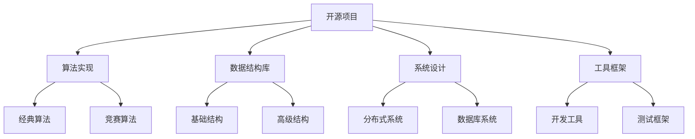

# 开源项目

## 📖 核心概念

**开源项目**是数据结构学习的重要资源，通过参与开源项目可以提升实践能力、学习最佳实践，并与技术社区互动。开源项目提供了丰富的学习机会。

### 🏗️ 项目类型



## 🔧 算法实现项目

### 经典算法库

```cpp
class AlgorithmLibrary {
private:
    struct Algorithm {
        string name;
        string category;
        string language;
        int stars;
        int forks;
        string description;
        vector<string> features;
        
        Algorithm(const string& n, const string& c, const string& lang) 
            : name(n), category(c), language(lang), stars(0), forks(0) {}
    };
    
    vector<Algorithm> algorithms;
    
public:
    AlgorithmLibrary() {
        initializeAlgorithms();
    }
    
    void initializeAlgorithms() {
        // 排序算法
        Algorithm alg1("Sorting Algorithms", "排序", "C++");
        alg1.stars = 5000;
        alg1.forks = 1200;
        alg1.description = "实现各种排序算法的C++库";
        alg1.features = {"快速排序", "归并排序", "堆排序", "计数排序"};
        algorithms.push_back(alg1);
        
        // 搜索算法
        Algorithm alg2("Search Algorithms", "搜索", "Python");
        alg2.stars = 3000;
        alg2.forks = 800;
        alg2.description = "实现各种搜索算法的Python库";
        alg2.features = {"二分搜索", "深度优先搜索", "广度优先搜索", "A*搜索"};
        algorithms.push_back(alg2);
        
        // 图算法
        Algorithm alg3("Graph Algorithms", "图论", "Java");
        alg3.stars = 4000;
        alg3.forks = 1000;
        alg3.description = "实现图论算法的Java库";
        alg3.features = {"最短路径", "最小生成树", "拓扑排序", "强连通分量"};
        algorithms.push_back(alg3);
        
        // 动态规划
        Algorithm alg4("Dynamic Programming", "动态规划", "C++");
        alg4.stars = 2500;
        alg4.forks = 600;
        alg4.description = "实现动态规划算法的C++库";
        alg4.features = {"背包问题", "最长公共子序列", "编辑距离", "最长递增子序列"};
        algorithms.push_back(alg4);
    }
    
    // 显示算法库
    void displayAlgorithms() {
        cout << "Algorithm Libraries:" << endl;
        cout << "==================" << endl;
        
        for (const auto& alg : algorithms) {
            cout << "Name: " << alg.name << endl;
            cout << "  Category: " << alg.category << endl;
            cout << "  Language: " << alg.language << endl;
            cout << "  Stars: " << alg.stars << endl;
            cout << "  Forks: " << alg.forks << endl;
            cout << "  Description: " << alg.description << endl;
            cout << "  Features: ";
            for (const string& feature : alg.features) {
                cout << feature << " ";
            }
            cout << endl << endl;
        }
    }
    
    // 推荐算法库
    vector<Algorithm> recommendAlgorithms(const string& category, const string& language) {
        vector<Algorithm> recommendations;
        
        for (const auto& alg : algorithms) {
            if (alg.category == category && alg.language == language) {
                recommendations.push_back(alg);
            }
        }
        
        // 按星数排序
        sort(recommendations.begin(), recommendations.end(), 
             [](const Algorithm& a, const Algorithm& b) {
                 return a.stars > b.stars;
             });
        
        return recommendations;
    }
    
    // 显示推荐
    void displayRecommendations(const string& category, const string& language) {
        cout << "Recommended " << category << " Libraries in " << language << ":" << endl;
        cout << "===============================================" << endl;
        
        vector<Algorithm> recommendations = recommendAlgorithms(category, language);
        
        for (const auto& alg : recommendations) {
            cout << "Name: " << alg.name << endl;
            cout << "  Stars: " << alg.stars << endl;
            cout << "  Description: " << alg.description << endl;
            cout << endl;
        }
    }
};
```

### 竞赛算法项目

```cpp
class CompetitionAlgorithms {
private:
    struct CompetitionProject {
        string name;
        string platform;
        string language;
        int problems;
        double difficulty;
        vector<string> topics;
        string description;
        
        CompetitionProject(const string& n, const string& p, const string& lang) 
            : name(n), platform(p), language(lang), problems(0), difficulty(0) {}
    };
    
    vector<CompetitionProject> projects;
    
public:
    CompetitionAlgorithms() {
        initializeProjects();
    }
    
    void initializeProjects() {
        // LeetCode解决方案
        CompetitionProject proj1("LeetCode Solutions", "LeetCode", "C++");
        proj1.problems = 2000;
        proj1.difficulty = 3.5;
        proj1.topics = {"数组", "链表", "树", "图", "动态规划"};
        proj1.description = "LeetCode题目的C++解决方案集合";
        projects.push_back(proj1);
        
        // Codeforces解决方案
        CompetitionProject proj2("Codeforces Solutions", "Codeforces", "Python");
        proj2.problems = 1500;
        proj2.difficulty = 4.0;
        proj2.topics = {"算法竞赛", "数据结构", "数学", "图论"};
        proj2.description = "Codeforces题目的Python解决方案";
        projects.push_back(proj2);
        
        // AtCoder解决方案
        CompetitionProject proj3("AtCoder Solutions", "AtCoder", "Java");
        proj3.problems = 1000;
        proj3.difficulty = 3.8;
        proj3.topics = {"算法竞赛", "数据结构", "数学", "字符串"};
        proj3.description = "AtCoder题目的Java解决方案";
        projects.push_back(proj3);
    }
    
    // 显示竞赛项目
    void displayProjects() {
        cout << "Competition Algorithm Projects:" << endl;
        cout << "=============================" << endl;
        
        for (const auto& proj : projects) {
            cout << "Name: " << proj.name << endl;
            cout << "  Platform: " << proj.platform << endl;
            cout << "  Language: " << proj.language << endl;
            cout << "  Problems: " << proj.problems << endl;
            cout << "  Difficulty: " << proj.difficulty << "/5.0" << endl;
            cout << "  Topics: ";
            for (const string& topic : proj.topics) {
                cout << topic << " ";
            }
            cout << endl;
            cout << "  Description: " << proj.description << endl;
            cout << endl;
        }
    }
    
    // 推荐项目
    CompetitionProject recommendProject(const string& platform, const string& language) {
        CompetitionProject best("", "", "");
        double bestScore = 0;
        
        for (const auto& proj : projects) {
            if (proj.platform == platform && proj.language == language) {
                double score = proj.problems * 0.5 + proj.difficulty * 10;
                if (score > bestScore) {
                    bestScore = score;
                    best = proj;
                }
            }
        }
        
        return best;
    }
    
    // 显示推荐
    void displayRecommendation(const string& platform, const string& language) {
        cout << "Recommended " << platform << " Project in " << language << ":" << endl;
        cout << "===============================================" << endl;
        
        CompetitionProject recommendation = recommendProject(platform, language);
        
        if (recommendation.name.empty()) {
            cout << "No project found for the specified criteria." << endl;
            return;
        }
        
        cout << "Name: " << recommendation.name << endl;
        cout << "  Problems: " << recommendation.problems << endl;
        cout << "  Difficulty: " << recommendation.difficulty << "/5.0" << endl;
        cout << "  Description: " << recommendation.description << endl;
    }
};
```

## 🎯 数据结构库项目

### 基础数据结构库

```cpp
class DataStructureLibraries {
private:
    struct DataStructureLib {
        string name;
        string language;
        int stars;
        int forks;
        vector<string> structures;
        string description;
        string license;
        
        DataStructureLib(const string& n, const string& lang) 
            : name(n), language(lang), stars(0), forks(0) {}
    };
    
    vector<DataStructureLib> libraries;
    
public:
    DataStructureLibraries() {
        initializeLibraries();
    }
    
    void initializeLibraries() {
        // C++ STL扩展
        DataStructureLib lib1("STL Extensions", "C++");
        lib1.stars = 8000;
        lib1.forks = 2000;
        lib1.structures = {"红黑树", "B+树", "跳表", "布隆过滤器"};
        lib1.description = "C++ STL的扩展数据结构库";
        lib1.license = "MIT";
        libraries.push_back(lib1);
        
        // Java集合框架扩展
        DataStructureLib lib2("Java Collections Extensions", "Java");
        lib2.stars = 6000;
        lib2.forks = 1500;
        lib2.structures = {"Trie树", "线段树", "树状数组", "并查集"};
        lib2.description = "Java集合框架的扩展数据结构";
        lib2.license = "Apache 2.0";
        libraries.push_back(lib2);
        
        // Python数据结构库
        DataStructureLib lib3("Python Data Structures", "Python");
        lib3.stars = 5000;
        lib3.forks = 1200;
        lib3.structures = {"堆", "优先队列", "哈希表", "LRU缓存"};
        lib3.description = "Python的高级数据结构库";
        lib3.license = "BSD";
        libraries.push_back(lib3);
    }
    
    // 显示数据结构库
    void displayLibraries() {
        cout << "Data Structure Libraries:" << endl;
        cout << "=======================" << endl;
        
        for (const auto& lib : libraries) {
            cout << "Name: " << lib.name << endl;
            cout << "  Language: " << lib.language << endl;
            cout << "  Stars: " << lib.stars << endl;
            cout << "  Forks: " << lib.forks << endl;
            cout << "  License: " << lib.license << endl;
            cout << "  Structures: ";
            for (const string& structure : lib.structures) {
                cout << structure << " ";
            }
            cout << endl;
            cout << "  Description: " << lib.description << endl;
            cout << endl;
        }
    }
    
    // 推荐库
    vector<DataStructureLib> recommendLibraries(const string& language) {
        vector<DataStructureLib> recommendations;
        
        for (const auto& lib : libraries) {
            if (lib.language == language) {
                recommendations.push_back(lib);
            }
        }
        
        // 按星数排序
        sort(recommendations.begin(), recommendations.end(), 
             [](const DataStructureLib& a, const DataStructureLib& b) {
                 return a.stars > b.stars;
             });
        
        return recommendations;
    }
    
    // 显示推荐
    void displayRecommendations(const string& language) {
        cout << "Recommended " << language << " Data Structure Libraries:" << endl;
        cout << "===============================================" << endl;
        
        vector<DataStructureLib> recommendations = recommendLibraries(language);
        
        for (const auto& lib : recommendations) {
            cout << "Name: " << lib.name << endl;
            cout << "  Stars: " << lib.stars << endl;
            cout << "  Description: " << lib.description << endl;
            cout << endl;
        }
    }
};
```

### 高级数据结构库

```cpp
class AdvancedDataStructureLibraries {
private:
    struct AdvancedLib {
        string name;
        string language;
        int stars;
        int forks;
        vector<string> structures;
        string description;
        string license;
        
        AdvancedLib(const string& n, const string& lang) 
            : name(n), language(lang), stars(0), forks(0) {}
    };
    
    vector<AdvancedLib> libraries;
    
public:
    AdvancedDataStructureLibraries() {
        initializeLibraries();
    }
    
    void initializeLibraries() {
        // 分布式数据结构
        AdvancedLib lib1("Distributed Data Structures", "Go");
        lib1.stars = 7000;
        lib1.forks = 1800;
        lib1.structures = {"一致性哈希", "分布式锁", "分布式队列", "分布式缓存"};
        lib1.description = "分布式系统中的高级数据结构";
        lib1.license = "MIT";
        libraries.push_back(lib1);
        
        // 并发数据结构
        AdvancedLib lib2("Concurrent Data Structures", "C++");
        lib2.stars = 6000;
        lib2.forks = 1500;
        lib2.structures = {"无锁队列", "并发哈希表", "读写锁", "原子操作"};
        lib2.description = "多线程环境下的并发数据结构";
        lib2.license = "Apache 2.0";
        libraries.push_back(lib2);
        
        // 持久化数据结构
        AdvancedLib lib3("Persistent Data Structures", "Scala");
        lib3.stars = 5000;
        lib3.forks = 1200;
        lib3.structures = {"持久化树", "持久化列表", "持久化映射", "版本控制"};
        lib3.description = "支持版本控制的持久化数据结构";
        lib3.license = "BSD";
        libraries.push_back(lib3);
    }
    
    // 显示高级数据结构库
    void displayLibraries() {
        cout << "Advanced Data Structure Libraries:" << endl;
        cout << "=================================" << endl;
        
        for (const auto& lib : libraries) {
            cout << "Name: " << lib.name << endl;
            cout << "  Language: " << lib.language << endl;
            cout << "  Stars: " << lib.stars << endl;
            cout << "  Forks: " << lib.forks << endl;
            cout << "  License: " << lib.license << endl;
            cout << "  Structures: ";
            for (const string& structure : lib.structures) {
                cout << structure << " ";
            }
            cout << endl;
            cout << "  Description: " << lib.description << endl;
            cout << endl;
        }
    }
    
    // 推荐库
    vector<AdvancedLib> recommendLibraries(const string& language) {
        vector<AdvancedLib> recommendations;
        
        for (const auto& lib : libraries) {
            if (lib.language == language) {
                recommendations.push_back(lib);
            }
        }
        
        // 按星数排序
        sort(recommendations.begin(), recommendations.end(), 
             [](const AdvancedLib& a, const AdvancedLib& b) {
                 return a.stars > b.stars;
             });
        
        return recommendations;
    }
    
    // 显示推荐
    void displayRecommendations(const string& language) {
        cout << "Recommended " << language << " Advanced Data Structure Libraries:" << endl;
        cout << "===============================================" << endl;
        
        vector<AdvancedLib> recommendations = recommendLibraries(language);
        
        for (const auto& lib : recommendations) {
            cout << "Name: " << lib.name << endl;
            cout << "  Stars: " << lib.stars << endl;
            cout << "  Description: " << lib.description << endl;
            cout << endl;
        }
    }
};
```

## 📊 系统设计项目

### 分布式系统项目

```cpp
class DistributedSystemProjects {
private:
    struct DistributedProject {
        string name;
        string category;
        string language;
        int stars;
        int forks;
        vector<string> features;
        string description;
        string license;
        
        DistributedProject(const string& n, const string& c, const string& lang) 
            : name(n), category(c), language(lang), stars(0), forks(0) {}
    };
    
    vector<DistributedProject> projects;
    
public:
    DistributedSystemProjects() {
        initializeProjects();
    }
    
    void initializeProjects() {
        // 分布式数据库
        DistributedProject proj1("Distributed Database", "数据库", "C++");
        proj1.stars = 15000;
        proj1.forks = 3000;
        proj1.features = {"分片", "复制", "一致性", "故障恢复"};
        proj1.description = "高性能分布式数据库系统";
        proj1.license = "Apache 2.0";
        projects.push_back(proj1);
        
        // 分布式缓存
        DistributedProject proj2("Distributed Cache", "缓存", "Go");
        proj2.stars = 12000;
        proj2.forks = 2500;
        proj2.features = {"一致性哈希", "故障转移", "数据同步", "负载均衡"};
        proj2.description = "分布式缓存系统";
        proj2.license = "MIT";
        projects.push_back(proj2);
        
        // 分布式消息队列
        DistributedProject proj3("Distributed Message Queue", "消息队列", "Java");
        proj3.stars = 10000;
        proj3.forks = 2000;
        proj3.features = {"消息持久化", "顺序保证", "事务支持", "监控"};
        proj3.description = "高可用分布式消息队列";
        proj3.license = "Apache 2.0";
        projects.push_back(proj3);
    }
    
    // 显示分布式系统项目
    void displayProjects() {
        cout << "Distributed System Projects:" << endl;
        cout << "=========================" << endl;
        
        for (const auto& proj : projects) {
            cout << "Name: " << proj.name << endl;
            cout << "  Category: " << proj.category << endl;
            cout << "  Language: " << proj.language << endl;
            cout << "  Stars: " << proj.stars << endl;
            cout << "  Forks: " << proj.forks << endl;
            cout << "  License: " << proj.license << endl;
            cout << "  Features: ";
            for (const string& feature : proj.features) {
                cout << feature << " ";
            }
            cout << endl;
            cout << "  Description: " << proj.description << endl;
            cout << endl;
        }
    }
    
    // 推荐项目
    vector<DistributedProject> recommendProjects(const string& category, const string& language) {
        vector<DistributedProject> recommendations;
        
        for (const auto& proj : projects) {
            if (proj.category == category && proj.language == language) {
                recommendations.push_back(proj);
            }
        }
        
        // 按星数排序
        sort(recommendations.begin(), recommendations.end(), 
             [](const DistributedProject& a, const DistributedProject& b) {
                 return a.stars > b.stars;
             });
        
        return recommendations;
    }
    
    // 显示推荐
    void displayRecommendations(const string& category, const string& language) {
        cout << "Recommended " << category << " Projects in " << language << ":" << endl;
        cout << "===============================================" << endl;
        
        vector<DistributedProject> recommendations = recommendProjects(category, language);
        
        for (const auto& proj : recommendations) {
            cout << "Name: " << proj.name << endl;
            cout << "  Stars: " << proj.stars << endl;
            cout << "  Description: " << proj.description << endl;
            cout << endl;
        }
    }
};
```

### 数据库系统项目

```cpp
class DatabaseSystemProjects {
private:
    struct DatabaseProject {
        string name;
        string type;
        string language;
        int stars;
        int forks;
        vector<string> features;
        string description;
        string license;
        
        DatabaseProject(const string& n, const string& t, const string& lang) 
            : name(n), type(t), language(lang), stars(0), forks(0) {}
    };
    
    vector<DatabaseProject> projects;
    
public:
    DatabaseSystemProjects() {
        initializeProjects();
    }
    
    void initializeProjects() {
        // 关系型数据库
        DatabaseProject proj1("Relational Database", "关系型", "C++");
        proj1.stars = 20000;
        proj1.forks = 4000;
        proj1.features = {"ACID事务", "SQL支持", "索引优化", "查询优化"};
        proj1.description = "高性能关系型数据库系统";
        proj1.license = "GPL";
        projects.push_back(proj1);
        
        // NoSQL数据库
        DatabaseProject proj2("NoSQL Database", "NoSQL", "Go");
        proj2.stars = 18000;
        proj2.forks = 3500;
        proj2.features = {"文档存储", "键值存储", "列族存储", "图数据库"};
        proj2.description = "灵活的NoSQL数据库系统";
        proj2.license = "Apache 2.0";
        projects.push_back(proj2);
        
        // 内存数据库
        DatabaseProject proj3("In-Memory Database", "内存", "C++");
        proj3.stars = 15000;
        proj3.forks = 3000;
        proj3.features = {"内存存储", "持久化", "高并发", "低延迟"};
        proj3.description = "高性能内存数据库系统";
        proj3.license = "MIT";
        projects.push_back(proj3);
    }
    
    // 显示数据库系统项目
    void displayProjects() {
        cout << "Database System Projects:" << endl;
        cout << "========================" << endl;
        
        for (const auto& proj : projects) {
            cout << "Name: " << proj.name << endl;
            cout << "  Type: " << proj.type << endl;
            cout << "  Language: " << proj.language << endl;
            cout << "  Stars: " << proj.stars << endl;
            cout << "  Forks: " << proj.forks << endl;
            cout << "  License: " << proj.license << endl;
            cout << "  Features: ";
            for (const string& feature : proj.features) {
                cout << feature << " ";
            }
            cout << endl;
            cout << "  Description: " << proj.description << endl;
            cout << endl;
        }
    }
    
    // 推荐项目
    vector<DatabaseProject> recommendProjects(const string& type, const string& language) {
        vector<DatabaseProject> recommendations;
        
        for (const auto& proj : projects) {
            if (proj.type == type && proj.language == language) {
                recommendations.push_back(proj);
            }
        }
        
        // 按星数排序
        sort(recommendations.begin(), recommendations.end(), 
             [](const DatabaseProject& a, const DatabaseProject& b) {
                 return a.stars > b.stars;
             });
        
        return recommendations;
    }
    
    // 显示推荐
    void displayRecommendations(const string& type, const string& language) {
        cout << "Recommended " << type << " Database Projects in " << language << ":" << endl;
        cout << "===============================================" << endl;
        
        vector<DatabaseProject> recommendations = recommendProjects(type, language);
        
        for (const auto& proj : recommendations) {
            cout << "Name: " << proj.name << endl;
            cout << "  Stars: " << proj.stars << endl;
            cout << "  Description: " << proj.description << endl;
            cout << endl;
        }
    }
};
```

## 🎮 开源项目应用

### 1. 项目推荐系统

```cpp
class OpenSourceProjectRecommender {
public:
    static void recommendProjects() {
        cout << "=== Open Source Project Recommendations ===" << endl;
        
        AlgorithmLibrary algLib;
        CompetitionAlgorithms compAlg;
        DataStructureLibraries dsLib;
        AdvancedDataStructureLibraries advDsLib;
        DistributedSystemProjects distSys;
        DatabaseSystemProjects dbSys;
        
        cout << "1. Algorithm Libraries:" << endl;
        algLib.displayRecommendations("排序", "C++");
        
        cout << "2. Competition Algorithms:" << endl;
        compAlg.displayRecommendation("LeetCode", "C++");
        
        cout << "3. Data Structure Libraries:" << endl;
        dsLib.displayRecommendations("C++");
        
        cout << "4. Advanced Data Structure Libraries:" << endl;
        advDsLib.displayRecommendations("C++");
        
        cout << "5. Distributed System Projects:" << endl;
        distSys.displayRecommendations("数据库", "C++");
        
        cout << "6. Database System Projects:" << endl;
        dbSys.displayRecommendations("关系型", "C++");
    }
    
    static void displayProjectCategories() {
        cout << "=== Open Source Project Categories ===" << endl;
        
        cout << "1. Algorithm Implementation:" << endl;
        cout << "   - 经典算法实现" << endl;
        cout << "   - 竞赛算法解决方案" << endl;
        cout << "   - 算法可视化工具" << endl;
        
        cout << "2. Data Structure Libraries:" << endl;
        cout << "   - 基础数据结构库" << endl;
        cout << "   - 高级数据结构库" << endl;
        cout << "   - 并发数据结构库" << endl;
        
        cout << "3. System Design Projects:" << endl;
        cout << "   - 分布式系统" << endl;
        cout << "   - 数据库系统" << endl;
        cout << "   - 缓存系统" << endl;
        
        cout << "4. Development Tools:" << endl;
        cout << "   - 代码生成工具" << endl;
        cout << "   - 测试框架" << endl;
        cout << "   - 性能分析工具" << endl;
    }
};
```

### 2. 贡献指南

```cpp
class ContributionGuide {
public:
    static void displayContributionGuide() {
        cout << "=== Open Source Contribution Guide ===" << endl;
        
        cout << "1. 如何开始贡献:" << endl;
        cout << "   - 选择合适的项目" << endl;
        cout << "   - 阅读项目文档" << endl;
        cout << "   - 了解代码规范" << endl;
        cout << "   - 从小问题开始" << endl;
        
        cout << "2. 贡献流程:" << endl;
        cout << "   - Fork项目仓库" << endl;
        cout << "   - 创建功能分支" << endl;
        cout << "   - 编写代码和测试" << endl;
        cout << "   - 提交Pull Request" << endl;
        cout << "   - 等待代码审查" << endl;
        
        cout << "3. 贡献类型:" << endl;
        cout << "   - 代码贡献" << endl;
        cout << "   - 文档改进" << endl;
        cout << "   - 问题报告" << endl;
        cout << "   - 功能建议" << endl;
        
        cout << "4. 最佳实践:" << endl;
        cout << "   - 遵循代码规范" << endl;
        cout << "   - 编写清晰的提交信息" << endl;
        cout << "   - 添加必要的测试" << endl;
        cout << "   - 保持代码简洁" << endl;
    }
    
    static void displayProjectSelectionTips() {
        cout << "=== Project Selection Tips ===" << endl;
        
        cout << "1. 选择适合的项目:" << endl;
        cout << "   - 根据技能水平选择" << endl;
        cout << "   - 选择活跃的项目" << endl;
        cout << "   - 选择有明确文档的项目" << endl;
        cout << "   - 选择有良好社区的项目" << endl;
        
        cout << "2. 评估项目质量:" << endl;
        cout << "   - 查看项目星数" << endl;
        cout << "   - 检查提交频率" << endl;
        cout << "   - 阅读问题讨论" << endl;
        cout << "   - 查看代码质量" << endl;
        
        cout << "3. 开始贡献:" << endl;
        cout << "   - 从简单问题开始" << endl;
        cout << "   - 参与社区讨论" << endl;
        cout << "   - 提供有价值的反馈" << endl;
        cout << "   - 持续学习和改进" << endl;
    }
};
```

## 🔗 相关链接

- [[01-前沿探索|前沿探索]]
- [[02-跨界融合|跨界融合]]
- [[03-学习资源|学习资源]]

## 💡 开源项目要点

1. **算法实现**：学习经典算法的实现
2. **数据结构库**：使用和贡献数据结构库
3. **系统设计**：参与分布式系统项目
4. **贡献指南**：了解开源贡献的最佳实践

---

*📝 项目提示：参与开源项目是提升技术能力的重要途径，建议从小项目开始贡献*
