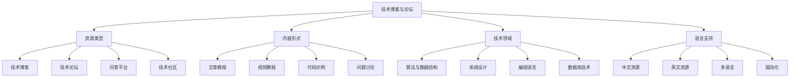

# 技术博客与论坛

## 📖 核心概念

**技术博客与论坛**是数据结构与算法学习的重要资源，提供了丰富的实践经验、技术分享和问题解答。通过技术博客和论坛，可以了解最新的技术趋势、学习他人的经验教训，并与技术社区进行交流互动。

### 🏗️ 技术资源分类



## 🔧 技术博客推荐

### 算法与数据结构博客

#### 1. 算法导论博客
**网站**: https://algorithms.blog/
**语言**: 英文
**推荐指数**: ⭐⭐⭐⭐⭐

**博客特点**:
- 深入算法理论分析
- 详细的数学证明
- 丰富的代码实现
- 高质量的技术文章

**主要内容**:
- 算法复杂度分析
- 数据结构设计原理
- 算法优化技巧
- 实际应用案例

**学习价值**:
- 深入理解算法原理
- 学习数学分析方法
- 掌握代码实现技巧
- 了解算法应用场景

**更新频率**: 每周1-2篇
**适合人群**: 算法研究者、计算机科学学生、软件工程师

#### 2. 数据结构与算法之美
**网站**: https://time.geekbang.org/column/intro/100017301
**语言**: 中文
**推荐指数**: ⭐⭐⭐⭐⭐

**博客特点**:
- 通俗易懂的算法讲解
- 丰富的实际应用案例
- 系统性的知识体系
- 优秀的教学风格

**主要内容**:
- 基础数据结构
- 经典算法实现
- 算法优化策略
- 实际项目应用

**学习价值**:
- 系统学习数据结构
- 理解算法应用
- 掌握优化技巧
- 提升编程能力

**更新频率**: 每周2-3篇
**适合人群**: 算法初学者、软件工程师、技术爱好者

#### 3. LeetCode官方博客
**网站**: https://blog.leetcode.com/
**语言**: 英文
**推荐指数**: ⭐⭐⭐⭐

**博客特点**:
- 算法题目解析
- 多种解法对比
- 面试经验分享
- 技术趋势分析

**主要内容**:
- 算法题目详解
- 解题思路分析
- 代码优化技巧
- 面试准备指南

**学习价值**:
- 提升算法解题能力
- 学习多种解法
- 了解面试技巧
- 掌握优化方法

**更新频率**: 每周1-2篇
**适合人群**: 算法竞赛选手、面试准备者、编程爱好者

### 系统设计博客

#### 4. High Scalability
**网站**: http://highscalability.com/
**语言**: 英文
**推荐指数**: ⭐⭐⭐⭐⭐

**博客特点**:
- 大规模系统设计案例
- 详细的架构分析
- 性能优化经验
- 真实项目分享

**主要内容**:
- 分布式系统设计
- 高并发架构
- 数据库优化
- 缓存策略

**学习价值**:
- 学习系统设计原理
- 理解架构模式
- 掌握性能优化
- 了解工程实践

**更新频率**: 每周1-2篇
**适合人群**: 系统架构师、后端工程师、技术负责人

#### 5. 系统设计面试
**网站**: https://www.educative.io/courses/grokking-the-system-design-interview
**语言**: 英文
**推荐指数**: ⭐⭐⭐⭐

**博客特点**:
- 系统设计面试准备
- 常见问题解析
- 设计模式应用
- 最佳实践分享

**主要内容**:
- 系统设计基础
- 常见系统设计
- 设计模式应用
- 面试技巧

**学习价值**:
- 准备系统设计面试
- 学习设计模式
- 理解架构原理
- 掌握设计方法

**更新频率**: 定期更新
**适合人群**: 面试准备者、系统设计师、软件工程师

#### 6. 分布式系统设计
**网站**: https://martin.kleppmann.com/
**语言**: 英文
**推荐指数**: ⭐⭐⭐⭐⭐

**博客特点**:
- 分布式系统理论
- 数据一致性分析
- 系统可靠性设计
- 学术研究分享

**主要内容**:
- 分布式系统原理
- 数据一致性
- 系统可靠性
- 性能优化

**学习价值**:
- 深入理解分布式系统
- 学习一致性理论
- 掌握可靠性设计
- 了解学术前沿

**更新频率**: 每月1-2篇
**适合人群**: 分布式系统研究者、系统架构师、技术专家

### 编程语言博客

#### 7. C++ Reference
**网站**: https://en.cppreference.com/
**语言**: 英文
**推荐指数**: ⭐⭐⭐⭐⭐

**博客特点**:
- 权威的C++参考
- 详细的API文档
- 丰富的代码示例
- 标准库分析

**主要内容**:
- C++标准库
- 数据结构实现
- 算法实现
- 性能优化

**学习价值**:
- 学习C++标准库
- 理解数据结构实现
- 掌握算法实现
- 提升编程技能

**更新频率**: 持续更新
**适合人群**: C++开发者、算法实现者、系统程序员

#### 8. Python算法实现
**网站**: https://python-algorithms.readthedocs.io/
**语言**: 英文
**推荐指数**: ⭐⭐⭐⭐

**博客特点**:
- Python算法实现
- 清晰的代码注释
- 性能分析对比
- 实际应用案例

**主要内容**:
- 基础算法实现
- 数据结构实现
- 算法优化
- 性能分析

**学习价值**:
- 学习Python编程
- 理解算法实现
- 掌握性能优化
- 了解算法应用

**更新频率**: 定期更新
**适合人群**: Python开发者、算法学习者、数据科学家

#### 9. Java数据结构与算法
**网站**: https://www.baeldung.com/java-collections
**语言**: 英文
**推荐指数**: ⭐⭐⭐⭐

**博客特点**:
- Java集合框架分析
- 数据结构实现原理
- 性能对比分析
- 最佳实践分享

**主要内容**:
- Java集合框架
- 数据结构实现
- 算法实现
- 性能优化

**学习价值**:
- 学习Java集合框架
- 理解数据结构原理
- 掌握算法实现
- 提升编程技能

**更新频率**: 每周1-2篇
**适合人群**: Java开发者、企业级应用开发者、软件工程师

### 数据库技术博客

#### 10. MySQL官方博客
**网站**: https://mysqlserverteam.com/
**语言**: 英文
**推荐指数**: ⭐⭐⭐⭐⭐

**博客特点**:
- MySQL官方技术分享
- 性能优化技巧
- 新特性介绍
- 最佳实践指南

**主要内容**:
- MySQL性能优化
- 索引设计
- 查询优化
- 存储引擎

**学习价值**:
- 学习MySQL优化
- 理解数据库设计
- 掌握查询优化
- 了解存储引擎

**更新频率**: 每周1-2篇
**适合人群**: 数据库管理员、后端工程师、数据工程师

#### 11. PostgreSQL官方博客
**网站**: https://blog.postgresql.org/
**语言**: 英文
**推荐指数**: ⭐⭐⭐⭐⭐

**博客特点**:
- PostgreSQL技术分享
- 高级特性介绍
- 性能优化技巧
- 社区贡献

**主要内容**:
- PostgreSQL特性
- 性能优化
- 扩展开发
- 社区动态

**学习价值**:
- 学习PostgreSQL
- 理解高级特性
- 掌握性能优化
- 了解开源社区

**更新频率**: 每周1-2篇
**适合人群**: PostgreSQL用户、数据库开发者、开源贡献者

#### 12. Redis官方博客
**网站**: https://redis.com/blog/
**语言**: 英文
**推荐指数**: ⭐⭐⭐⭐

**博客特点**:
- Redis技术分享
- 使用案例介绍
- 性能优化技巧
- 新特性发布

**主要内容**:
- Redis使用技巧
- 性能优化
- 数据结构应用
- 实际案例

**学习价值**:
- 学习Redis使用
- 理解数据结构应用
- 掌握性能优化
- 了解实际应用

**更新频率**: 每月1-2篇
**适合人群**: Redis用户、缓存工程师、后端开发者

## 🔧 技术论坛推荐

### 问答平台

#### 13. Stack Overflow
**网站**: https://stackoverflow.com/
**语言**: 多语言
**推荐指数**: ⭐⭐⭐⭐⭐

**论坛特点**:
- 全球最大的编程问答平台
- 高质量的问题和答案
- 活跃的社区讨论
- 丰富的技术标签

**主要内容**:
- 编程问题解答
- 算法实现讨论
- 数据结构问题
- 技术经验分享

**学习价值**:
- 解决编程问题
- 学习最佳实践
- 了解技术趋势
- 参与社区讨论

**活跃度**: 极高
**适合人群**: 所有编程人员、技术爱好者、问题解决者

#### 14. Stack Exchange
**网站**: https://stackexchange.com/
**语言**: 多语言
**推荐指数**: ⭐⭐⭐⭐⭐

**论坛特点**:
- 专业的技术问答网络
- 多个专业领域
- 高质量的内容
- 严格的社区规范

**主要内容**:
- 计算机科学
- 软件工程
- 数据库设计
- 系统架构

**学习价值**:
- 深入学习技术
- 理解专业概念
- 掌握最佳实践
- 参与专业讨论

**活跃度**: 高
**适合人群**: 技术专家、研究人员、专业开发者

#### 15. Reddit编程社区
**网站**: https://www.reddit.com/r/programming/
**语言**: 英文
**推荐指数**: ⭐⭐⭐⭐

**论坛特点**:
- 活跃的编程社区
- 多样化的讨论话题
- 实时技术新闻
- 轻松的学习氛围

**主要内容**:
- 技术新闻
- 编程讨论
- 项目分享
- 职业发展

**学习价值**:
- 了解技术趋势
- 参与技术讨论
- 分享项目经验
- 获得职业建议

**活跃度**: 极高
**适合人群**: 编程爱好者、技术社区参与者、职业发展关注者

### 专业论坛

#### 16. Hacker News
**网站**: https://news.ycombinator.com/
**语言**: 英文
**推荐指数**: ⭐⭐⭐⭐⭐

**论坛特点**:
- 高质量的技术新闻
- 深度的技术讨论
- 创业和技术趋势
- 精英社区氛围

**主要内容**:
- 技术新闻
- 创业动态
- 技术讨论
- 行业趋势

**学习价值**:
- 了解技术前沿
- 学习创业经验
- 参与深度讨论
- 扩展技术视野

**活跃度**: 高
**适合人群**: 技术创业者、技术专家、行业观察者

#### 17. GitHub Discussions
**网站**: https://github.com/
**语言**: 多语言
**推荐指数**: ⭐⭐⭐⭐

**论坛特点**:
- 开源项目讨论
- 技术协作平台
- 代码审查讨论
- 项目贡献交流

**主要内容**:
- 开源项目讨论
- 技术协作
- 代码审查
- 项目贡献

**学习价值**:
- 参与开源项目
- 学习协作开发
- 提升代码质量
- 扩展技术网络

**活跃度**: 极高
**适合人群**: 开源贡献者、协作开发者、技术社区参与者

#### 18. 掘金技术社区
**网站**: https://juejin.cn/
**语言**: 中文
**推荐指数**: ⭐⭐⭐⭐

**论坛特点**:
- 中文技术社区
- 高质量技术文章
- 活跃的讨论氛围
- 丰富的技术资源

**主要内容**:
- 技术文章分享
- 算法与数据结构
- 前端后端技术
- 职业发展

**学习价值**:
- 学习中文技术资源
- 参与技术讨论
- 分享技术经验
- 获得职业建议

**活跃度**: 高
**适合人群**: 中文技术社区参与者、技术文章作者、职业发展关注者

## 🎯 资源使用指南

### 学习策略推荐

```python
class TechBlogForumGuide:
    @staticmethod
    def recommend_learning_strategy(level, interests, time_available):
        print("技术博客与论坛学习策略:")
        print("====================")
        
        if level == "beginner":
            print("初学者推荐:")
            print("1. 算法与数据结构之美 - 系统性学习")
            print("2. Stack Overflow - 问题解答")
            print("3. 掘金技术社区 - 中文资源")
        
        elif level == "intermediate":
            print("进阶者推荐:")
            print("1. 算法导论博客 - 深入理解")
            print("2. High Scalability - 系统设计")
            print("3. Hacker News - 技术前沿")
        
        elif level == "advanced":
            print("高级者推荐:")
            print("1. 分布式系统设计 - 理论研究")
            print("2. Stack Exchange - 专业讨论")
            print("3. GitHub Discussions - 开源参与")
        
        if interests == "algorithms":
            print("\n算法兴趣:")
            print("- 重点学习算法博客")
            print("- 关注算法竞赛论坛")
            print("- 学习算法实现技巧")
        
        elif interests == "systems":
            print("\n系统兴趣:")
            print("- 重点学习系统设计博客")
            print("- 关注架构设计论坛")
            print("- 学习系统优化技巧")
        
        elif interests == "databases":
            print("\n数据库兴趣:")
            print("- 重点学习数据库博客")
            print("- 关注数据库优化论坛")
            print("- 学习数据库设计技巧")
        
        if time_available == "limited":
            print("\n时间有限建议:")
            print("- 选择高质量博客")
            print("- 重点关注核心内容")
            print("- 利用碎片时间学习")
        
        elif time_available == "abundant":
            print("\n时间充足建议:")
            print("- 广泛阅读技术博客")
            print("- 积极参与论坛讨论")
            print("- 分享学习心得")
    
    @staticmethod
    def analyze_resource_characteristics():
        print("资源特点分析:")
        print("===========")
        
        print("1. 内容质量:")
        print("   - 官方博客: 权威准确")
        print("   - 个人博客: 经验丰富")
        print("   - 社区论坛: 多样观点")
        print("   - 问答平台: 问题导向")
        print()
        
        print("2. 更新频率:")
        print("   - 官方博客: 定期更新")
        print("   - 个人博客: 不定期更新")
        print("   - 社区论坛: 实时更新")
        print("   - 问答平台: 即时响应")
        print()
        
        print("3. 互动性:")
        print("   - 博客: 单向传播")
        print("   - 论坛: 双向互动")
        print("   - 问答: 问题解答")
        print("   - 社区: 多向交流")
        print()
        
        print("4. 学习价值:")
        print("   - 理论深度: 博客文章")
        print("   - 实践经验: 论坛讨论")
        print("   - 问题解决: 问答平台")
        print("   - 社区参与: 技术社区")
    
    @staticmethod
    def select_resource_strategy(background, goals, constraints, preferences):
        print("资源选择策略:")
        print("===========")
        
        print(f"背景: {background}")
        print(f"目标: {goals}")
        print(f"约束: {constraints}")
        print(f"偏好: {preferences}")
        
        print("\n推荐策略:")
        
        if background == "computer_science" and goals == "comprehensive":
            print("选择多个类型的资源")
            print("从博客到论坛")
            print("全面了解技术趋势")
        
        elif background == "self_taught" and goals == "practical":
            print("选择实用性强的小型项目")
            print("重点关注代码实现")
            print("学习最佳实践")
        
        elif background == "experienced" and goals == "specialized":
            print("选择专业领域的大型项目")
            print("深入理解架构设计")
            print("学习高级优化技巧")
        
        if constraints == "time_limited":
            print("\n时间有限建议:")
            print("- 选择高质量博客")
            print("- 重点关注核心内容")
            print("- 利用现有资源学习")
        
        elif constraints == "language_limited":
            print("\n语言有限建议:")
            print("- 选择中文资源")
            print("- 重点关注基础内容")
            print("- 逐步提升语言能力")
        
        if preferences == "reading":
            print("\n阅读偏好建议:")
            print("- 选择博客文章")
            print("- 关注技术深度")
            print("- 学习理论知识")
        
        elif preferences == "interaction":
            print("\n互动偏好建议:")
            print("- 选择论坛社区")
            print("- 参与讨论交流")
            print("- 分享学习心得")
```

## 📊 资源使用分析

### 学习效果分析

```python
class TechResourceLearningAnalysis:
    @staticmethod
    def analyze_learning_effectiveness():
        print("技术资源学习效果分析:")
        print("==================")
        
        print("1. 学习效率:")
        print("   - 博客阅读: 深度理解")
        print("   - 论坛讨论: 互动学习")
        print("   - 问答平台: 问题解决")
        print("   - 社区参与: 经验分享")
        print()
        
        print("2. 知识掌握:")
        print("   - 理论学习: 博客文章")
        print("   - 实践应用: 论坛讨论")
        print("   - 问题解决: 问答平台")
        print("   - 经验积累: 社区参与")
        print()
        
        print("3. 技能提升:")
        print("   - 技术理解: 博客学习")
        print("   - 问题解决: 论坛讨论")
        print("   - 沟通能力: 社区交流")
        print("   - 知识分享: 内容创作")
    
    @staticmethod
    def analyze_learning_methods():
        print("学习方法分析:")
        print("===========")
        
        print("1. 学习策略:")
        print("   - 主题学习: 深入理解")
        print("   - 问题驱动: 解决具体问题")
        print("   - 社区参与: 互动学习")
        print("   - 内容创作: 知识分享")
        print()
        
        print("2. 参与方式:")
        print("   - 被动学习: 阅读文章")
        print("   - 主动学习: 参与讨论")
        print("   - 问题解答: 帮助他人")
        print("   - 内容创作: 分享经验")
        print()
        
        print("3. 学习工具:")
        print("   - 阅读工具: 浏览器、RSS")
        print("   - 笔记工具: 笔记软件")
        print("   - 讨论工具: 论坛、聊天")
        print("   - 创作工具: 博客、文档")
    
    @staticmethod
    def analyze_learning_progress():
        print("学习进度分析:")
        print("===========")
        
        print("1. 学习阶段:")
        print("   - 入门阶段: 基础概念学习")
        print("   - 进阶阶段: 深入理解")
        print("   - 高级阶段: 专业应用")
        print("   - 专家阶段: 知识创造")
        print()
        
        print("2. 学习指标:")
        print("   - 阅读量: 文章阅读数量")
        print("   - 参与度: 论坛参与程度")
        print("   - 贡献度: 内容贡献质量")
        print("   - 影响力: 社区影响力")
        print()
        
        print("3. 学习评估:")
        print("   - 自我评估: 定期检查")
        print("   - 社区评估: 获得反馈")
        print("   - 内容评估: 创作质量")
        print("   - 技能评估: 能力提升")
```

## 🎮 技术资源测试

### 1. 基础功能测试

```python
def test_resource_recommendations():
    print("Testing Resource Recommendations:")
    print("==============================")
    
    # 测试资源推荐
    guide = TechBlogForumGuide()
    
    print("初学者推荐:")
    guide.recommend_learning_strategy("beginner", "algorithms", "limited")
    
    print("\n进阶者推荐:")
    guide.recommend_learning_strategy("intermediate", "systems", "abundant")
    
    print("\n高级者推荐:")
    guide.recommend_learning_strategy("advanced", "databases", "abundant")
    
    print("\n资源特点分析:")
    guide.analyze_resource_characteristics()
    
    print("\n资源选择策略:")
    guide.select_resource_strategy("computer_science", "comprehensive", "time_limited", "reading")

def test_learning_analysis():
    print("\nTesting Learning Analysis:")
    print("========================")
    
    analysis = TechResourceLearningAnalysis()
    
    print("学习效果分析:")
    analysis.analyze_learning_effectiveness()
    
    print("\n学习方法分析:")
    analysis.analyze_learning_methods()
    
    print("\n学习进度分析:")
    analysis.analyze_learning_progress()

def test_resource_categories():
    print("\nTesting Resource Categories:")
    print("==========================")
    
    print("技术博客:")
    print("- 算法导论: 理论深度")
    print("- 数据结构之美: 通俗易懂")
    print("- LeetCode官方: 题目解析")
    
    print("\n系统设计博客:")
    print("- High Scalability: 大规模系统")
    print("- 系统设计面试: 面试准备")
    print("- 分布式系统: 理论研究")
    
    print("\n编程语言博客:")
    print("- C++ Reference: 权威参考")
    print("- Python算法: 实现技巧")
    print("- Java集合: 框架分析")
    
    print("\n数据库技术博客:")
    print("- MySQL官方: 性能优化")
    print("- PostgreSQL: 高级特性")
    print("- Redis官方: 使用技巧")

def test_forum_categories():
    print("\nTesting Forum Categories:")
    print("=======================")
    
    print("问答平台:")
    print("- Stack Overflow: 全球最大")
    print("- Stack Exchange: 专业网络")
    print("- Reddit编程: 活跃社区")
    
    print("\n专业论坛:")
    print("- Hacker News: 技术前沿")
    print("- GitHub Discussions: 开源协作")
    print("- 掘金技术: 中文社区")
    
    print("\n技术社区:")
    print("- 技术博客平台")
    print("- 开发者社区")
    print("- 技术交流群")

def test_learning_strategies():
    print("\nTesting Learning Strategies:")
    print("==========================")
    
    print("学习策略选择:")
    print("1. 资源选择:")
    print("   - 博客: 深度阅读")
    print("   - 论坛: 互动讨论")
    print("   - 问答: 问题解决")
    
    print("\n2. 参与方式:")
    print("   - 被动学习: 阅读文章")
    print("   - 主动学习: 参与讨论")
    print("   - 问题解答: 帮助他人")
    print("   - 内容创作: 分享经验")
    
    print("\n3. 学习工具:")
    print("   - 阅读工具: 浏览器、RSS")
    print("   - 笔记工具: 笔记软件")
    print("   - 讨论工具: 论坛、聊天")
    print("   - 创作工具: 博客、文档")

def test_applications():
    print("Testing Applications:")
    print("==================")
    
    print("资源应用场景:")
    print("1. 学习研究:")
    print("   - 技术理论学习")
    print("   - 实践经验学习")
    print("   - 问题解决学习")
    
    print("\n2. 技能提升:")
    print("   - 编程能力提升")
    print("   - 系统设计能力")
    print("   - 问题解决能力")
    
    print("\n3. 职业发展:")
    print("   - 技术影响力")
    print("   - 社区参与")
    print("   - 知识分享")
    
    print("\n4. 社区参与:")
    print("   - 技术交流")
    print("   - 经验分享")
    print("   - 协作开发")

def test_analysis():
    print("Testing Analysis:")
    print("===============")
    
    print("资源分析要点:")
    print("1. 内容质量:")
    print("   - 权威性")
    print("   - 准确性")
    print("   - 实用性")
    
    print("\n2. 学习价值:")
    print("   - 理论深度")
    print("   - 实践价值")
    print("   - 学习难度")
    
    print("\n3. 参与方式:")
    print("   - 学习方式")
    print("   - 参与方式")
    print("   - 贡献方式")

# 主测试函数
def main():
    test_resource_recommendations()
    test_learning_analysis()
    test_resource_categories()
    test_forum_categories()
    test_learning_strategies()
    test_applications()
    test_analysis()

if __name__ == "__main__":
    main()
```

## 🔗 相关链接

- [[01-经典教材推荐|经典教材推荐]]
- [[02-在线课程推荐|在线课程推荐]]
- [[03-开源项目学习|开源项目学习]]

## 💡 技术博客与论坛要点

1. **资源选择**: 根据学习目标和兴趣选择合适的资源
2. **学习方式**: 采用多种方式参与技术社区
3. **内容质量**: 关注高质量的技术内容和讨论
4. **社区参与**: 积极参与技术社区交流和分享

---

*📝 技术博客与论坛提示：技术博客和论坛是学习数据结构与算法的重要资源，需要选择合适的资源并积极参与社区交流*
