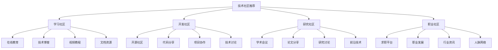

# 技术社区推荐

## 📖 核心概念

**技术社区推荐**是为数据结构学习者提供优质技术社区的指南。通过推荐和介绍优秀的技术社区，可以帮助学习者更好地学习数据结构，提升编程技能，并与同行交流经验。

### 🏗️ 技术社区推荐的组成要素

## 🔍 技术社区分类

### 社区类型分类

| 社区类型 | 特点 | 优势 | 适用人群 | 学习价值 |
|----------|------|------|----------|----------|
| **学习社区** | 教学导向 | 系统学习 | 初学者 | 高 |
| **开发社区** | 实践导向 | 实战经验 | 开发者 | 高 |
| **研究社区** | 学术导向 | 前沿技术 | 研究人员 | 极高 |
| **职业社区** | 职业导向 | 职业发展 | 职场人士 | 中 |

## 💻 技术社区推荐

### 学习社区

#### 在线教育平台

**1. Coursera**
- **网站地址**: https://www.coursera.org
- **社区描述**: 全球领先的在线教育平台
- **技术特点**:
  - 名校课程
  - 专业认证
  - 互动学习
  - 项目实践
- **数据结构课程**:
  - 算法专项课程
  - 数据结构与算法
  - 算法设计与分析
- **学习价值**: 系统学习数据结构
- **推荐理由**: 高质量课程，专业认证

**2. edX**
- **网站地址**: https://www.edx.org
- **社区描述**: 哈佛和MIT联合创办的在线教育平台
- **技术特点**:
  - 免费课程
  - 名校资源
  - 灵活学习
  - 证书认证
- **数据结构课程**:
  - CS50: 计算机科学导论
  - 算法设计与分析
  - 数据结构基础
- **学习价值**: 免费学习名校课程
- **推荐理由**: 免费高质量课程

**3. Udacity**
- **网站地址**: https://www.udacity.com
- **社区描述**: 专注于技术教育的在线平台
- **技术特点**:
  - 项目导向
  - 实战经验
  - 导师指导
  - 职业发展
- **数据结构课程**:
  - 数据结构与算法
  - 算法分析
  - 系统设计
- **学习价值**: 项目导向学习
- **推荐理由**: 实战项目经验

**4. Khan Academy**
- **网站地址**: https://www.khanacademy.org
- **社区描述**: 免费在线教育平台
- **技术特点**:
  - 完全免费
  - 互动练习
  - 进度跟踪
  - 个性化学习
- **数据结构课程**:
  - 计算机科学基础
  - 算法入门
  - 数据结构基础
- **学习价值**: 免费基础学习
- **推荐理由**: 完全免费，基础扎实

#### 技术博客平台

**5. Medium**
- **网站地址**: https://medium.com
- **社区描述**: 高质量技术文章平台
- **技术特点**:
  - 优质内容
  - 技术深度
  - 社区互动
  - 个性化推荐
- **数据结构内容**:
  - 算法解析
  - 数据结构实现
  - 性能优化
  - 系统设计
- **学习价值**: 深度技术文章
- **推荐理由**: 高质量技术内容

**6. Dev.to**
- **网站地址**: https://dev.to
- **社区描述**: 开发者社区平台
- **技术特点**:
  - 开发者友好
  - 技术分享
  - 社区互动
  - 职业发展
- **数据结构内容**:
  - 算法实现
  - 数据结构应用
  - 编程技巧
  - 项目经验
- **学习价值**: 开发者经验分享
- **推荐理由**: 开发者社区

**7. Hashnode**
- **网站地址**: https://hashnode.com
- **社区描述**: 技术博客平台
- **技术特点**:
  - 技术深度
  - 社区互动
  - 个性化推荐
  - 职业发展
- **数据结构内容**:
  - 算法解析
  - 数据结构设计
  - 性能分析
  - 系统架构
- **学习价值**: 深度技术分析
- **推荐理由**: 技术深度内容

### 开发社区

#### 开源社区

**8. GitHub**
- **网站地址**: https://github.com
- **社区描述**: 全球最大的代码托管平台
- **技术特点**:
  - 代码托管
  - 协作开发
  - 开源项目
  - 社区贡献
- **数据结构内容**:
  - 开源项目
  - 代码实现
  - 项目协作
  - 技术讨论
- **学习价值**: 开源项目学习
- **推荐理由**: 开源项目资源

**9. GitLab**
- **网站地址**: https://gitlab.com
- **社区描述**: 代码托管和协作平台
- **技术特点**:
  - 代码托管
  - CI/CD
  - 项目管理
  - 社区协作
- **数据结构内容**:
  - 开源项目
  - 代码实现
  - 项目协作
  - 技术讨论
- **学习价值**: 项目协作学习
- **推荐理由**: 项目协作平台

**10. Bitbucket**
- **网站地址**: https://bitbucket.org
- **社区描述**: Atlassian的代码托管平台
- **技术特点**:
  - 代码托管
  - 团队协作
  - 项目管理
  - 集成工具
- **数据结构内容**:
  - 开源项目
  - 代码实现
  - 团队协作
  - 技术讨论
- **学习价值**: 团队协作学习
- **推荐理由**: 团队协作平台

#### 技术讨论社区

**11. Stack Overflow**
- **网站地址**: https://stackoverflow.com
- **社区描述**: 程序员问答社区
- **技术特点**:
  - 问答社区
  - 技术讨论
  - 问题解决
  - 知识分享
- **数据结构内容**:
  - 算法问题
  - 数据结构实现
  - 性能优化
  - 技术讨论
- **学习价值**: 问题解决学习
- **推荐理由**: 技术问答社区

**12. Reddit**
- **网站地址**: https://www.reddit.com
- **社区描述**: 社交新闻网站
- **技术特点**:
  - 社区讨论
  - 技术分享
  - 新闻资讯
  - 社区互动
- **数据结构内容**:
  - 技术讨论
  - 算法分享
  - 项目展示
  - 学习资源
- **学习价值**: 社区讨论学习
- **推荐理由**: 技术社区讨论

**13. Hacker News**
- **网站地址**: https://news.ycombinator.com
- **社区描述**: 技术新闻社区
- **技术特点**:
  - 技术新闻
  - 社区讨论
  - 技术分享
  - 创业资讯
- **数据结构内容**:
  - 技术新闻
  - 算法讨论
  - 系统设计
  - 技术趋势
- **学习价值**: 技术趋势学习
- **推荐理由**: 技术新闻社区

### 研究社区

#### 学术会议

**14. ACM**
- **网站地址**: https://www.acm.org
- **社区描述**: 计算机科学学会
- **技术特点**:
  - 学术会议
  - 论文发表
  - 研究交流
  - 学术资源
- **数据结构内容**:
  - 算法研究
  - 数据结构设计
  - 性能分析
  - 系统研究
- **学习价值**: 学术研究学习
- **推荐理由**: 学术研究资源

**15. IEEE**
- **网站地址**: https://www.ieee.org
- **社区描述**: 电气和电子工程师学会
- **技术特点**:
  - 学术会议
  - 论文发表
  - 研究交流
  - 技术标准
- **数据结构内容**:
  - 算法研究
  - 数据结构设计
  - 性能分析
  - 系统研究
- **学习价值**: 学术研究学习
- **推荐理由**: 学术研究资源

**16. SIGMOD**
- **网站地址**: https://www.sigmod.org
- **社区描述**: 数据库管理系统会议
- **技术特点**:
  - 数据库研究
  - 系统设计
  - 性能优化
  - 研究交流
- **数据结构内容**:
  - 数据库结构
  - 索引设计
  - 查询优化
  - 系统架构
- **学习价值**: 数据库系统学习
- **推荐理由**: 数据库研究资源

#### 论文分享平台

**17. arXiv**
- **网站地址**: https://arxiv.org
- **社区描述**: 学术论文预印本平台
- **技术特点**:
  - 学术论文
  - 研究分享
  - 前沿技术
  - 开放获取
- **数据结构内容**:
  - 算法研究
  - 数据结构设计
  - 性能分析
  - 系统研究
- **学习价值**: 前沿研究学习
- **推荐理由**: 前沿研究资源

**18. Google Scholar**
- **网站地址**: https://scholar.google.com
- **社区描述**: 学术搜索引擎
- **技术特点**:
  - 学术搜索
  - 论文引用
  - 研究跟踪
  - 学术资源
- **数据结构内容**:
  - 学术论文
  - 研究引用
  - 研究跟踪
  - 学术资源
- **学习价值**: 学术研究学习
- **推荐理由**: 学术研究资源

### 职业社区

#### 求职平台

**19. LinkedIn**
- **网站地址**: https://www.linkedin.com
- **社区描述**: 职业社交网络
- **技术特点**:
  - 职业网络
  - 求职平台
  - 技能展示
  - 行业资讯
- **数据结构内容**:
  - 技能展示
  - 项目经验
  - 职业发展
  - 行业资讯
- **学习价值**: 职业发展学习
- **推荐理由**: 职业发展平台

**20. Indeed**
- **网站地址**: https://www.indeed.com
- **社区描述**: 求职搜索引擎
- **技术特点**:
  - 求职搜索
  - 职位匹配
  - 简历优化
  - 职业发展
- **数据结构内容**:
  - 技能要求
  - 职位描述
  - 职业发展
  - 行业趋势
- **学习价值**: 职业需求学习
- **推荐理由**: 求职平台

#### 职业发展社区

**21. LeetCode**
- **网站地址**: https://leetcode.com
- **社区描述**: 算法练习平台
- **技术特点**:
  - 算法练习
  - 面试准备
  - 技能评估
  - 社区讨论
- **数据结构内容**:
  - 算法题目
  - 数据结构实现
  - 性能优化
  - 面试准备
- **学习价值**: 算法能力提升
- **推荐理由**: 算法练习平台

**22. HackerRank**
- **网站地址**: https://www.hackerrank.com
- **社区描述**: 编程挑战平台
- **技术特点**:
  - 编程挑战
  - 技能评估
  - 面试准备
  - 职业发展
- **数据结构内容**:
  - 算法挑战
  - 数据结构实现
  - 性能优化
  - 面试准备
- **学习价值**: 编程能力提升
- **推荐理由**: 编程挑战平台

### 社区参与指南

#### 如何选择社区

**1. 根据学习目标选择**
- 基础学习：选择学习社区
- 技能提升：选择开发社区
- 学术研究：选择研究社区
- 职业发展：选择职业社区

**2. 根据技术水平选择**
- 初学者：选择入门社区
- 有经验者：选择进阶社区
- 专家级：选择专家社区
- 研究人员：选择研究社区

**3. 根据兴趣领域选择**
- 数据结构：选择算法社区
- 系统设计：选择系统社区
- 应用开发：选择开发社区
- 学术研究：选择研究社区

#### 如何参与社区

**1. 积极参与讨论**
- 提出问题
- 回答问题
- 分享经验
- 交流想法

**2. 贡献内容**
- 分享文章
- 开源项目
- 代码实现
- 技术分享

**3. 建立人脉**
- 关注专家
- 建立联系
- 参与活动
- 扩大网络

**4. 持续学习**
- 关注更新
- 学习新技术
- 提升技能
- 保持活跃

#### 参与建议

**1. 保持活跃**
- 定期参与
- 积极互动
- 分享经验
- 帮助他人

**2. 质量优先**
- 高质量内容
- 深度思考
- 实用价值
- 原创性

**3. 尊重他人**
- 礼貌交流
- 尊重观点
- 建设性讨论
- 社区规则

**4. 持续改进**
- 接受反馈
- 改进内容
- 提升技能
- 学习成长

## ⚡ 社区推荐总结

### 推荐优先级

| 优先级 | 社区类型 | 推荐理由 | 适用人群 |
|--------|----------|----------|----------|
| **高** | 学习社区 | 系统学习 | 初学者 |
| **高** | 开发社区 | 实战经验 | 开发者 |
| **中** | 研究社区 | 前沿技术 | 研究人员 |
| **中** | 职业社区 | 职业发展 | 职场人士 |

### 参与策略

**1. 多平台参与**
- 选择多个社区
- 不同平台优势
- 扩大影响力
- 建立网络

**2. 深度参与**
- 深度讨论
- 高质量内容
- 建立声誉
- 获得认可

**3. 持续参与**
- 定期参与
- 保持活跃
- 建立关系
- 持续学习

**4. 价值贡献**
- 分享价值
- 帮助他人
- 建立声誉
- 获得回报

## 🎓 学习要点总结

### 核心理解

1. **社区选择**：根据学习目标选择合适社区
2. **参与方式**：积极参与社区活动
3. **价值贡献**：为社区贡献价值
4. **持续学习**：在社区中持续学习

### 实践要点

1. **积极参与**：积极参与社区讨论
2. **内容贡献**：贡献高质量内容
3. **人脉建立**：建立专业人脉
4. **技能提升**：通过社区提升技能

### 应用思维

1. **社区思维**：从社区角度思考问题
2. **学习思维**：在社区中持续学习
3. **贡献思维**：为社区贡献价值
4. **实际应用**：将社区学到的知识应用到实际项目中

---

**相关链接：**
- [[08-知识边疆/03-学习资源/01-前沿技术资源|前沿技术资源]] - 前沿技术资源
- [[08-知识边疆/03-学习资源/02-学习路径推荐|学习路径推荐]] - 学习路径推荐
- [[08-知识边疆/03-学习资源/03-开源项目推荐|开源项目推荐]] - 开源项目推荐
- [[00-学习枢纽/��-学习路径图|学习路径图]] - 学习路径图
