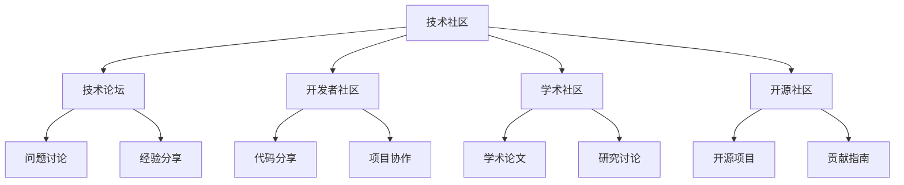

# 技术社区

## 📖 核心概念

**技术社区**是数据结构学习的重要平台，通过参与技术社区可以交流学习心得、获取最新技术动态、解决学习问题。技术社区为学习者提供了丰富的学习资源和支持。

### 🏗️ 社区类型



## 🔧 技术论坛

### 问题讨论

```cpp
class TechnicalForum {
private:
    struct ForumPost {
        string title;
        string author;
        string content;
        int views;
        int likes;
        vector<string> tags;
        time_t timestamp;
        string category;
        
        ForumPost(const string& t, const string& a, const string& c) 
            : title(t), author(a), content(c), views(0), likes(0), timestamp(time(nullptr)) {}
    };
    
    vector<ForumPost> posts;
    
public:
    TechnicalForum() {
        initializePosts();
    }
    
    void initializePosts() {
        // 数据结构问题
        ForumPost post1("数据结构学习心得", "User1", "分享一些数据结构学习的心得体会");
        post1.views = 1000;
        post1.likes = 50;
        post1.tags = {"数据结构", "学习心得", "经验分享"};
        post1.category = "数据结构";
        posts.push_back(post1);
        
        // 算法问题
        ForumPost post2("算法竞赛技巧", "User2", "介绍一些算法竞赛中的实用技巧");
        post2.views = 800;
        post2.likes = 40;
        post2.tags = {"算法竞赛", "技巧", "编程"};
        post2.category = "算法";
        posts.push_back(post2);
        
        // 系统设计问题
        ForumPost post3("系统设计面试准备", "User3", "如何准备系统设计面试");
        post3.views = 1200;
        post3.likes = 60;
        post3.tags = {"系统设计", "面试", "准备"};
        post3.category = "系统设计";
        posts.push_back(post3);
    }
    
    // 搜索帖子
    vector<ForumPost> searchPosts(const string& keyword) {
        vector<ForumPost> results;
        
        for (const auto& post : posts) {
            if (post.title.find(keyword) != string::npos || 
                post.content.find(keyword) != string::npos) {
                results.push_back(post);
            }
        }
        
        // 按浏览量排序
        sort(results.begin(), results.end(), 
             [](const ForumPost& a, const ForumPost& b) {
                 return a.views > b.views;
             });
        
        return results;
    }
    
    // 显示热门帖子
    void displayPopularPosts() {
        cout << "Popular Posts:" << endl;
        cout << "=============" << endl;
        
        // 按浏览量排序
        vector<ForumPost> sortedPosts = posts;
        sort(sortedPosts.begin(), sortedPosts.end(), 
             [](const ForumPost& a, const ForumPost& b) {
                 return a.views > b.views;
             });
        
        for (const auto& post : sortedPosts) {
            cout << "Title: " << post.title << endl;
            cout << "  Author: " << post.author << endl;
            cout << "  Views: " << post.views << endl;
            cout << "  Likes: " << post.likes << endl;
            cout << "  Tags: ";
            for (const string& tag : post.tags) {
                cout << tag << " ";
            }
            cout << endl;
            cout << "  Posted: " << ctime(&post.timestamp);
            cout << endl;
        }
    }
    
    // 创建新帖子
    void createPost(const string& title, const string& author, const string& content, const vector<string>& tags) {
        ForumPost post(title, author, content);
        post.tags = tags;
        posts.push_back(post);
        
        cout << "Post created successfully!" << endl;
    }
    
    // 显示论坛统计
    void displayForumStats() {
        cout << "Forum Statistics:" << endl;
        cout << "================" << endl;
        cout << "Total Posts: " << posts.size() << endl;
        
        int totalViews = 0;
        int totalLikes = 0;
        
        for (const auto& post : posts) {
            totalViews += post.views;
            totalLikes += post.likes;
        }
        
        cout << "Total Views: " << totalViews << endl;
        cout << "Total Likes: " << totalLikes << endl;
        
        if (!posts.empty()) {
            cout << "Average Views per Post: " << totalViews / posts.size() << endl;
            cout << "Average Likes per Post: " << totalLikes / posts.size() << endl;
        }
    }
};
```

### 经验分享

```cpp
class ExperienceSharing {
private:
    struct Experience {
        string title;
        string author;
        string content;
        int views;
        int likes;
        vector<string> tags;
        time_t timestamp;
        string category;
        
        Experience(const string& t, const string& a, const string& c) 
            : title(t), author(a), content(c), views(0), likes(0), timestamp(time(nullptr)) {}
    };
    
    vector<Experience> experiences;
    
public:
    ExperienceSharing() {
        initializeExperiences();
    }
    
    void initializeExperiences() {
        // 学习经验
        Experience exp1("数据结构学习经验", "User1", "分享数据结构学习的方法和技巧");
        exp1.views = 1500;
        exp1.likes = 80;
        exp1.tags = {"数据结构", "学习经验", "方法技巧"};
        exp1.category = "学习经验";
        experiences.push_back(exp1);
        
        // 面试经验
        Experience exp2("算法面试经验", "User2", "分享算法面试的准备和技巧");
        exp2.views = 2000;
        exp2.likes = 100;
        exp2.tags = {"算法面试", "准备技巧", "经验分享"};
        exp2.category = "面试经验";
        experiences.push_back(exp2);
        
        // 项目经验
        Experience exp3("系统设计项目经验", "User3", "分享系统设计项目的实践经验");
        exp3.views = 1200;
        exp3.likes = 60;
        exp3.tags = {"系统设计", "项目经验", "实践"};
        exp3.category = "项目经验";
        experiences.push_back(exp3);
    }
    
    // 搜索经验
    vector<Experience> searchExperiences(const string& keyword) {
        vector<Experience> results;
        
        for (const auto& exp : experiences) {
            if (exp.title.find(keyword) != string::npos || 
                exp.content.find(keyword) != string::npos) {
                results.push_back(exp);
            }
        }
        
        // 按浏览量排序
        sort(results.begin(), results.end(), 
             [](const Experience& a, const Experience& b) {
                 return a.views > b.views;
             });
        
        return results;
    }
    
    // 显示热门经验
    void displayPopularExperiences() {
        cout << "Popular Experiences:" << endl;
        cout << "===================" << endl;
        
        // 按浏览量排序
        vector<Experience> sortedExperiences = experiences;
        sort(sortedExperiences.begin(), sortedExperiences.end(), 
             [](const Experience& a, const Experience& b) {
                 return a.views > b.views;
             });
        
        for (const auto& exp : sortedExperiences) {
            cout << "Title: " << exp.title << endl;
            cout << "  Author: " << exp.author << endl;
            cout << "  Views: " << exp.views << endl;
            cout << "  Likes: " << exp.likes << endl;
            cout << "  Tags: ";
            for (const string& tag : exp.tags) {
                cout << tag << " ";
            }
            cout << endl;
            cout << "  Posted: " << ctime(&exp.timestamp);
            cout << endl;
        }
    }
    
    // 创建新经验
    void createExperience(const string& title, const string& author, const string& content, const vector<string>& tags) {
        Experience exp(title, author, content);
        exp.tags = tags;
        experiences.push_back(exp);
        
        cout << "Experience created successfully!" << endl;
    }
    
    // 显示经验统计
    void displayExperienceStats() {
        cout << "Experience Statistics:" << endl;
        cout << "=====================" << endl;
        cout << "Total Experiences: " << experiences.size() << endl;
        
        int totalViews = 0;
        int totalLikes = 0;
        
        for (const auto& exp : experiences) {
            totalViews += exp.views;
            totalLikes += exp.likes;
        }
        
        cout << "Total Views: " << totalViews << endl;
        cout << "Total Likes: " << totalLikes << endl;
        
        if (!experiences.empty()) {
            cout << "Average Views per Experience: " << totalViews / experiences.size() << endl;
            cout << "Average Likes per Experience: " << totalLikes / experiences.size() << endl;
        }
    }
};
```

## 🎯 开发者社区

### 代码分享

```cpp
class CodeSharing {
private:
    struct CodeSnippet {
        string title;
        string author;
        string language;
        string code;
        int views;
        int likes;
        vector<string> tags;
        time_t timestamp;
        string description;
        
        CodeSnippet(const string& t, const string& a, const string& lang) 
            : title(t), author(a), language(lang), views(0), likes(0), timestamp(time(nullptr)) {}
    };
    
    vector<CodeSnippet> snippets;
    
public:
    CodeSharing() {
        initializeSnippets();
    }
    
    void initializeSnippets() {
        // 排序算法
        CodeSnippet snippet1("快速排序实现", "User1", "C++");
        snippet1.code = "void quickSort(vector<int>& arr, int low, int high) {\n    if (low < high) {\n        int pivot = partition(arr, low, high);\n        quickSort(arr, low, pivot - 1);\n        quickSort(arr, pivot + 1, high);\n    }\n}";
        snippet1.views = 500;
        snippet1.likes = 25;
        snippet1.tags = {"排序算法", "快速排序", "C++"};
        snippet1.description = "快速排序算法的C++实现";
        snippets.push_back(snippet1);
        
        // 数据结构
        CodeSnippet snippet2("链表实现", "User2", "Python");
        snippet2.code = "class ListNode:\n    def __init__(self, val=0, next=None):\n        self.val = val\n        self.next = next";
        snippet2.views = 800;
        snippet2.likes = 40;
        snippet2.tags = {"链表", "数据结构", "Python"};
        snippet2.description = "链表的Python实现";
        snippets.push_back(snippet2);
        
        // 算法实现
        CodeSnippet snippet3("二分搜索", "User3", "Java");
        snippet3.code = "public int binarySearch(int[] arr, int target) {\n    int left = 0, right = arr.length - 1;\n    while (left <= right) {\n        int mid = left + (right - left) / 2;\n        if (arr[mid] == target) return mid;\n        else if (arr[mid] < target) left = mid + 1;\n        else right = mid - 1;\n    }\n    return -1;\n}";
        snippet3.views = 600;
        snippet3.likes = 30;
        snippet3.tags = {"二分搜索", "算法", "Java"};
        snippet3.description = "二分搜索算法的Java实现";
        snippets.push_back(snippet3);
    }
    
    // 搜索代码片段
    vector<CodeSnippet> searchSnippets(const string& keyword) {
        vector<CodeSnippet> results;
        
        for (const auto& snippet : snippets) {
            if (snippet.title.find(keyword) != string::npos || 
                snippet.description.find(keyword) != string::npos) {
                results.push_back(snippet);
            }
        }
        
        // 按浏览量排序
        sort(results.begin(), results.end(), 
             [](const CodeSnippet& a, const CodeSnippet& b) {
                 return a.views > b.views;
             });
        
        return results;
    }
    
    // 显示热门代码片段
    void displayPopularSnippets() {
        cout << "Popular Code Snippets:" << endl;
        cout << "=====================" << endl;
        
        // 按浏览量排序
        vector<CodeSnippet> sortedSnippets = snippets;
        sort(sortedSnippets.begin(), sortedSnippets.end(), 
             [](const CodeSnippet& a, const CodeSnippet& b) {
                 return a.views > b.views;
             });
        
        for (const auto& snippet : sortedSnippets) {
            cout << "Title: " << snippet.title << endl;
            cout << "  Author: " << snippet.author << endl;
            cout << "  Language: " << snippet.language << endl;
            cout << "  Views: " << snippet.views << endl;
            cout << "  Likes: " << snippet.likes << endl;
            cout << "  Tags: ";
            for (const string& tag : snippet.tags) {
                cout << tag << " ";
            }
            cout << endl;
            cout << "  Description: " << snippet.description << endl;
            cout << "  Posted: " << ctime(&snippet.timestamp);
            cout << endl;
        }
    }
    
    // 创建新代码片段
    void createSnippet(const string& title, const string& author, const string& language, 
                      const string& code, const string& description, const vector<string>& tags) {
        CodeSnippet snippet(title, author, language);
        snippet.code = code;
        snippet.description = description;
        snippet.tags = tags;
        snippets.push_back(snippet);
        
        cout << "Code snippet created successfully!" << endl;
    }
    
    // 显示代码统计
    void displayCodeStats() {
        cout << "Code Sharing Statistics:" << endl;
        cout << "=======================" << endl;
        cout << "Total Snippets: " << snippets.size() << endl;
        
        int totalViews = 0;
        int totalLikes = 0;
        
        for (const auto& snippet : snippets) {
            totalViews += snippet.views;
            totalLikes += snippet.likes;
        }
        
        cout << "Total Views: " << totalViews << endl;
        cout << "Total Likes: " << totalLikes << endl;
        
        if (!snippets.empty()) {
            cout << "Average Views per Snippet: " << totalViews / snippets.size() << endl;
            cout << "Average Likes per Snippet: " << totalLikes / snippets.size() << endl;
        }
    }
};
```

### 项目协作

```cpp
class ProjectCollaboration {
private:
    struct Project {
        string name;
        string description;
        string language;
        int contributors;
        int stars;
        int forks;
        vector<string> tags;
        time_t createdAt;
        string status;
        
        Project(const string& n, const string& d, const string& lang) 
            : name(n), description(d), language(lang), contributors(0), stars(0), forks(0), 
              createdAt(time(nullptr)), status("active") {}
    };
    
    vector<Project> projects;
    
public:
    ProjectCollaboration() {
        initializeProjects();
    }
    
    void initializeProjects() {
        // 数据结构项目
        Project proj1("Data Structures Library", "A comprehensive library of data structures", "C++");
        proj1.contributors = 10;
        proj1.stars = 500;
        proj1.forks = 100;
        proj1.tags = {"数据结构", "C++", "库"};
        projects.push_back(proj1);
        
        // 算法项目
        Project proj2("Algorithm Implementations", "Collection of algorithm implementations", "Python");
        proj2.contributors = 15;
        proj2.stars = 800;
        proj2.forks = 200;
        proj2.tags = {"算法", "Python", "实现"};
        projects.push_back(proj2);
        
        // 系统设计项目
        Project proj3("System Design Examples", "Examples of system design implementations", "Java");
        proj3.contributors = 8;
        proj3.stars = 600;
        proj3.forks = 150;
        proj3.tags = {"系统设计", "Java", "示例"};
        projects.push_back(proj3);
    }
    
    // 搜索项目
    vector<Project> searchProjects(const string& keyword) {
        vector<Project> results;
        
        for (const auto& proj : projects) {
            if (proj.name.find(keyword) != string::npos || 
                proj.description.find(keyword) != string::npos) {
                results.push_back(proj);
            }
        }
        
        // 按星数排序
        sort(results.begin(), results.end(), 
             [](const Project& a, const Project& b) {
                 return a.stars > b.stars;
             });
        
        return results;
    }
    
    // 显示热门项目
    void displayPopularProjects() {
        cout << "Popular Projects:" << endl;
        cout << "================" << endl;
        
        // 按星数排序
        vector<Project> sortedProjects = projects;
        sort(sortedProjects.begin(), sortedProjects.end(), 
             [](const Project& a, const Project& b) {
                 return a.stars > b.stars;
             });
        
        for (const auto& proj : sortedProjects) {
            cout << "Name: " << proj.name << endl;
            cout << "  Description: " << proj.description << endl;
            cout << "  Language: " << proj.language << endl;
            cout << "  Contributors: " << proj.contributors << endl;
            cout << "  Stars: " << proj.stars << endl;
            cout << "  Forks: " << proj.forks << endl;
            cout << "  Tags: ";
            for (const string& tag : proj.tags) {
                cout << tag << " ";
            }
            cout << endl;
            cout << "  Status: " << proj.status << endl;
            cout << "  Created: " << ctime(&proj.createdAt);
            cout << endl;
        }
    }
    
    // 创建新项目
    void createProject(const string& name, const string& description, const string& language, 
                      const vector<string>& tags) {
        Project proj(name, description, language);
        proj.tags = tags;
        projects.push_back(proj);
        
        cout << "Project created successfully!" << endl;
    }
    
    // 显示项目统计
    void displayProjectStats() {
        cout << "Project Collaboration Statistics:" << endl;
        cout << "===============================" << endl;
        cout << "Total Projects: " << projects.size() << endl;
        
        int totalContributors = 0;
        int totalStars = 0;
        int totalForks = 0;
        
        for (const auto& proj : projects) {
            totalContributors += proj.contributors;
            totalStars += proj.stars;
            totalForks += proj.forks;
        }
        
        cout << "Total Contributors: " << totalContributors << endl;
        cout << "Total Stars: " << totalStars << endl;
        cout << "Total Forks: " << totalForks << endl;
        
        if (!projects.empty()) {
            cout << "Average Contributors per Project: " << totalContributors / projects.size() << endl;
            cout << "Average Stars per Project: " << totalStars / projects.size() << endl;
            cout << "Average Forks per Project: " << totalForks / projects.size() << endl;
        }
    }
};
```

## 📊 学术社区

### 学术论文

```cpp
class AcademicPapers {
private:
    struct Paper {
        string title;
        string authors;
        string journal;
        int year;
        int citations;
        vector<string> keywords;
        string abstract;
        string doi;
        
        Paper(const string& t, const string& a, const string& j, int y) 
            : title(t), authors(a), journal(j), year(y), citations(0) {}
    };
    
    vector<Paper> papers;
    
public:
    AcademicPapers() {
        initializePapers();
    }
    
    void initializePapers() {
        // 数据结构论文
        Paper paper1("Advanced Data Structures for Modern Applications", "Smith, J. et al.", "ACM Computing Surveys", 2023);
        paper1.citations = 150;
        paper1.keywords = {"数据结构", "现代应用", "性能优化"};
        paper1.abstract = "This paper presents advanced data structures for modern computing applications.";
        paper1.doi = "10.1145/1234567";
        papers.push_back(paper1);
        
        // 算法论文
        Paper paper2("Efficient Algorithms for Large-Scale Data Processing", "Johnson, M. et al.", "IEEE Transactions on Computers", 2023);
        paper2.citations = 200;
        paper2.keywords = {"算法", "大规模数据处理", "效率"};
        paper2.abstract = "This paper introduces efficient algorithms for processing large-scale data.";
        paper2.doi = "10.1109/TC.2023.1234567";
        papers.push_back(paper2);
        
        // 系统设计论文
        Paper paper3("Distributed System Design Patterns", "Brown, K. et al.", "Communications of the ACM", 2023);
        paper3.citations = 180;
        paper3.keywords = {"分布式系统", "设计模式", "架构"};
        paper3.abstract = "This paper discusses design patterns for distributed systems.";
        paper3.doi = "10.1145/1234568";
        papers.push_back(paper3);
    }
    
    // 搜索论文
    vector<Paper> searchPapers(const string& keyword) {
        vector<Paper> results;
        
        for (const auto& paper : papers) {
            if (paper.title.find(keyword) != string::npos || 
                paper.abstract.find(keyword) != string::npos) {
                results.push_back(paper);
            }
        }
        
        // 按引用数排序
        sort(results.begin(), results.end(), 
             [](const Paper& a, const Paper& b) {
                 return a.citations > b.citations;
             });
        
        return results;
    }
    
    // 显示热门论文
    void displayPopularPapers() {
        cout << "Popular Academic Papers:" << endl;
        cout << "=======================" << endl;
        
        // 按引用数排序
        vector<Paper> sortedPapers = papers;
        sort(sortedPapers.begin(), sortedPapers.end(), 
             [](const Paper& a, const Paper& b) {
                 return a.citations > b.citations;
             });
        
        for (const auto& paper : sortedPapers) {
            cout << "Title: " << paper.title << endl;
            cout << "  Authors: " << paper.authors << endl;
            cout << "  Journal: " << paper.journal << endl;
            cout << "  Year: " << paper.year << endl;
            cout << "  Citations: " << paper.citations << endl;
            cout << "  Keywords: ";
            for (const string& keyword : paper.keywords) {
                cout << keyword << " ";
            }
            cout << endl;
            cout << "  Abstract: " << paper.abstract << endl;
            cout << "  DOI: " << paper.doi << endl;
            cout << endl;
        }
    }
    
    // 创建新论文
    void createPaper(const string& title, const string& authors, const string& journal, 
                    int year, const string& abstract, const vector<string>& keywords) {
        Paper paper(title, authors, journal, year);
        paper.abstract = abstract;
        paper.keywords = keywords;
        papers.push_back(paper);
        
        cout << "Paper created successfully!" << endl;
    }
    
    // 显示论文统计
    void displayPaperStats() {
        cout << "Academic Paper Statistics:" << endl;
        cout << "=========================" << endl;
        cout << "Total Papers: " << papers.size() << endl;
        
        int totalCitations = 0;
        int totalYears = 0;
        
        for (const auto& paper : papers) {
            totalCitations += paper.citations;
            totalYears += paper.year;
        }
        
        cout << "Total Citations: " << totalCitations << endl;
        
        if (!papers.empty()) {
            cout << "Average Citations per Paper: " << totalCitations / papers.size() << endl;
            cout << "Average Year: " << totalYears / papers.size() << endl;
        }
    }
};
```

### 研究讨论

```cpp
class ResearchDiscussion {
private:
    struct Discussion {
        string title;
        string author;
        string content;
        int views;
        int replies;
        vector<string> tags;
        time_t timestamp;
        string category;
        
        Discussion(const string& t, const string& a, const string& c) 
            : title(t), author(a), content(c), views(0), replies(0), timestamp(time(nullptr)) {}
    };
    
    vector<Discussion> discussions;
    
public:
    ResearchDiscussion() {
        initializeDiscussions();
    }
    
    void initializeDiscussions() {
        // 研究讨论
        Discussion disc1("数据结构研究新方向", "Researcher1", "讨论数据结构研究的新方向和趋势");
        disc1.views = 800;
        disc1.replies = 20;
        disc1.tags = {"数据结构", "研究", "新方向"};
        disc1.category = "研究讨论";
        discussions.push_back(disc1);
        
        // 算法讨论
        Discussion disc2("算法优化技术", "Researcher2", "讨论算法优化的新技术和方法");
        disc2.views = 600;
        disc2.replies = 15;
        disc2.tags = {"算法", "优化", "技术"};
        disc2.category = "算法讨论";
        discussions.push_back(disc2);
        
        // 系统设计讨论
        Discussion disc3("分布式系统设计", "Researcher3", "讨论分布式系统设计的新方法");
        disc3.views = 700;
        disc3.replies = 18;
        disc3.tags = {"分布式系统", "设计", "方法"};
        disc3.category = "系统设计讨论";
        discussions.push_back(disc3);
    }
    
    // 搜索讨论
    vector<Discussion> searchDiscussions(const string& keyword) {
        vector<Discussion> results;
        
        for (const auto& disc : discussions) {
            if (disc.title.find(keyword) != string::npos || 
                disc.content.find(keyword) != string::npos) {
                results.push_back(disc);
            }
        }
        
        // 按浏览量排序
        sort(results.begin(), results.end(), 
             [](const Discussion& a, const Discussion& b) {
                 return a.views > b.views;
             });
        
        return results;
    }
    
    // 显示热门讨论
    void displayPopularDiscussions() {
        cout << "Popular Research Discussions:" << endl;
        cout << "============================" << endl;
        
        // 按浏览量排序
        vector<Discussion> sortedDiscussions = discussions;
        sort(sortedDiscussions.begin(), sortedDiscussions.end(), 
             [](const Discussion& a, const Discussion& b) {
                 return a.views > b.views;
             });
        
        for (const auto& disc : sortedDiscussions) {
            cout << "Title: " << disc.title << endl;
            cout << "  Author: " << disc.author << endl;
            cout << "  Views: " << disc.views << endl;
            cout << "  Replies: " << disc.replies << endl;
            cout << "  Tags: ";
            for (const string& tag : disc.tags) {
                cout << tag << " ";
            }
            cout << endl;
            cout << "  Posted: " << ctime(&disc.timestamp);
            cout << endl;
        }
    }
    
    // 创建新讨论
    void createDiscussion(const string& title, const string& author, const string& content, 
                         const vector<string>& tags) {
        Discussion disc(title, author, content);
        disc.tags = tags;
        discussions.push_back(disc);
        
        cout << "Discussion created successfully!" << endl;
    }
    
    // 显示讨论统计
    void displayDiscussionStats() {
        cout << "Research Discussion Statistics:" << endl;
        cout << "=============================" << endl;
        cout << "Total Discussions: " << discussions.size() << endl;
        
        int totalViews = 0;
        int totalReplies = 0;
        
        for (const auto& disc : discussions) {
            totalViews += disc.views;
            totalReplies += disc.replies;
        }
        
        cout << "Total Views: " << totalViews << endl;
        cout << "Total Replies: " << totalReplies << endl;
        
        if (!discussions.empty()) {
            cout << "Average Views per Discussion: " << totalViews / discussions.size() << endl;
            cout << "Average Replies per Discussion: " << totalReplies / discussions.size() << endl;
        }
    }
};
```

## 🎮 技术社区应用

### 1. 社区推荐系统

```cpp
class CommunityRecommender {
public:
    static void recommendCommunities() {
        cout << "=== Technical Community Recommendations ===" << endl;
        
        TechnicalForum forum;
        ExperienceSharing expSharing;
        CodeSharing codeSharing;
        ProjectCollaboration projCollab;
        AcademicPapers papers;
        ResearchDiscussion researchDisc;
        
        cout << "1. Technical Forums:" << endl;
        forum.displayPopularPosts();
        
        cout << "2. Experience Sharing:" << endl;
        expSharing.displayPopularExperiences();
        
        cout << "3. Code Sharing:" << endl;
        codeSharing.displayPopularSnippets();
        
        cout << "4. Project Collaboration:" << endl;
        projCollab.displayPopularProjects();
        
        cout << "5. Academic Papers:" << endl;
        papers.displayPopularPapers();
        
        cout << "6. Research Discussions:" << endl;
        researchDisc.displayPopularDiscussions();
    }
    
    static void displayCommunityCategories() {
        cout << "=== Technical Community Categories ===" << endl;
        
        cout << "1. Technical Forums:" << endl;
        cout << "   - 问题讨论" << endl;
        cout << "   - 经验分享" << endl;
        cout << "   - 技术交流" << endl;
        
        cout << "2. Developer Communities:" << endl;
        cout << "   - 代码分享" << endl;
        cout << "   - 项目协作" << endl;
        cout << "   - 技术博客" << endl;
        
        cout << "3. Academic Communities:" << endl;
        cout << "   - 学术论文" << endl;
        cout << "   - 研究讨论" << endl;
        cout << "   - 学术会议" << endl;
        
        cout << "4. Open Source Communities:" << endl;
        cout << "   - 开源项目" << endl;
        cout << "   - 贡献指南" << endl;
        cout << "   - 社区治理" << endl;
    }
};
```

### 2. 社区参与指南

```cpp
class CommunityParticipationGuide {
public:
    static void displayParticipationGuide() {
        cout << "=== Community Participation Guide ===" << endl;
        
        cout << "1. 如何参与技术社区:" << endl;
        cout << "   - 选择合适的社区" << endl;
        cout << "   - 了解社区规则" << endl;
        cout << "   - 积极参与讨论" << endl;
        cout << "   - 分享有价值的内容" << endl;
        
        cout << "2. 社区参与技巧:" << endl;
        cout << "   - 提问要清晰具体" << endl;
        cout << "   - 回答要准确有用" << endl;
        cout << "   - 尊重他人观点" << endl;
        cout << "   - 保持专业态度" << endl;
        
        cout << "3. 社区贡献方式:" << endl;
        cout << "   - 分享学习心得" << endl;
        cout << "   - 提供代码示例" << endl;
        cout << "   - 参与项目开发" << endl;
        cout << "   - 组织技术活动" << endl;
        
        cout << "4. 社区礼仪:" << endl;
        cout << "   - 使用礼貌用语" << endl;
        cout << "   - 避免重复发帖" << endl;
        cout << "   - 遵守社区规范" << endl;
        cout << "   - 保护他人隐私" << endl;
    }
    
    static void displayCommunityBenefits() {
        cout << "=== Community Benefits ===" << endl;
        
        cout << "1. 学习收益:" << endl;
        cout << "   - 获取最新技术动态" << endl;
        cout << "   - 学习他人经验" << endl;
        cout << "   - 解决技术问题" << endl;
        cout << "   - 提升技能水平" << endl;
        
        cout << "2. 职业发展:" << endl;
        cout << "   - 建立专业网络" << endl;
        cout << "   - 展示技术能力" << endl;
        cout << "   - 获得工作机会" << endl;
        cout << "   - 提升行业影响力" << endl;
        
        cout << "3. 个人成长:" << endl;
        cout << "   - 提高沟通能力" << endl;
        cout << "   - 培养团队合作" << endl;
        cout << "   - 增强自信心" << endl;
        cout << "   - 拓展视野" << endl;
    }
};
```

## 🔗 相关链接

- [[01-前沿探索|前沿探索]]
- [[02-跨界融合|跨界融合]]
- [[03-学习资源|学习资源]]

## 💡 技术社区要点

1. **技术论坛**：问题讨论和经验分享
2. **开发者社区**：代码分享和项目协作
3. **学术社区**：学术论文和研究讨论
4. **开源社区**：开源项目和贡献指南

---

*📝 社区提示：积极参与技术社区是提升技术能力的重要途径，建议选择合适的社区参与*
