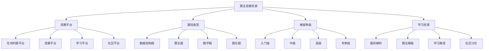

# 算法竞赛资源

## 📖 核心概念

**算法竞赛资源**是数据结构与算法学习的重要实践平台，通过参与算法竞赛可以提升算法思维、编程能力和问题解决能力。算法竞赛提供了丰富的题目资源、学习平台和社区支持，是检验和提升算法水平的重要途径。

### 🏗️ 竞赛资源分类



## 🔧 竞赛平台推荐

### 在线判题平台

#### 1. LeetCode
**网站**: https://leetcode.com/
**语言**: 多语言
**推荐指数**: ⭐⭐⭐⭐⭐

**平台特点**:
- 全球最大的算法平台
- 丰富的题目资源
- 高质量的问题解析
- 活跃的社区讨论

**主要内容**:
- 数据结构与算法题目
- 系统设计题目
- 数据库题目
- 多线程题目

**学习价值**:
- 提升算法解题能力
- 学习多种解法
- 了解面试题型
- 掌握编程技巧

**题目分类**:
- Easy: 基础算法题
- Medium: 中等难度题
- Hard: 高难度题
- Premium: 付费题目

**参与方式**:
- 每日一题练习
- 周赛和双周赛
- 企业题库
- 社区讨论

#### 2. Codeforces
**网站**: https://codeforces.com/
**语言**: 多语言
**推荐指数**: ⭐⭐⭐⭐⭐

**平台特点**:
- 俄罗斯顶级竞赛平台
- 高质量的算法竞赛
- 丰富的题目类型
- 强大的社区支持

**主要内容**:
- 算法竞赛题目
- 数据结构题目
- 数学题目
- 图论题目

**学习价值**:
- 提升竞赛编程能力
- 学习高级算法
- 掌握优化技巧
- 了解竞赛文化

**竞赛类型**:
- Div. 1: 高级竞赛
- Div. 2: 中级竞赛
- Div. 3: 初级竞赛
- Educational: 教育竞赛

**参与方式**:
- 定期竞赛参与
- 虚拟竞赛练习
- 题目集练习
- 社区交流

#### 3. AtCoder
**网站**: https://atcoder.jp/
**语言**: 多语言
**推荐指数**: ⭐⭐⭐⭐

**平台特点**:
- 日本顶级竞赛平台
- 高质量的题目设计
- 丰富的学习资源
- 友好的社区氛围

**主要内容**:
- 算法竞赛题目
- 数据结构题目
- 数学题目
- 图论题目

**学习价值**:
- 学习日本算法文化
- 提升编程能力
- 掌握算法技巧
- 了解竞赛趋势

**竞赛类型**:
- AtCoder Beginner Contest (ABC)
- AtCoder Regular Contest (ARC)
- AtCoder Grand Contest (AGC)
- AtCoder Heuristic Contest (AHC)

**参与方式**:
- 定期竞赛参与
- 题目集练习
- 学习资源利用
- 社区交流

#### 4. HackerRank
**网站**: https://www.hackerrank.com/
**语言**: 多语言
**推荐指数**: ⭐⭐⭐⭐

**平台特点**:
- 综合技能评估平台
- 丰富的题目类型
- 企业招聘集成
- 技能认证系统

**主要内容**:
- 算法题目
- 数据结构题目
- 数学题目
- 数据库题目

**学习价值**:
- 提升编程技能
- 学习算法实现
- 掌握数据结构
- 准备技术面试

**题目分类**:
- Algorithms: 算法题目
- Data Structures: 数据结构题目
- Mathematics: 数学题目
- SQL: 数据库题目

**参与方式**:
- 技能挑战
- 竞赛参与
- 认证考试
- 企业招聘

### 竞赛平台

#### 5. TopCoder
**网站**: https://www.topcoder.com/
**语言**: 多语言
**推荐指数**: ⭐⭐⭐⭐

**平台特点**:
- 美国顶级竞赛平台
- 高质量的算法竞赛
- 丰富的题目类型
- 强大的社区支持

**主要内容**:
- 算法竞赛题目
- 数据结构题目
- 数学题目
- 图论题目

**学习价值**:
- 提升竞赛编程能力
- 学习高级算法
- 掌握优化技巧
- 了解美国竞赛文化

**竞赛类型**:
- Single Round Match (SRM)
- Marathon Match (MM)
- Algorithm Competition
- Data Science Competition

**参与方式**:
- 定期竞赛参与
- 虚拟竞赛练习
- 题目集练习
- 社区交流

#### 6. CodeChef
**网站**: https://www.codechef.com/
**语言**: 多语言
**推荐指数**: ⭐⭐⭐⭐

**平台特点**:
- 印度顶级竞赛平台
- 丰富的题目资源
- 活跃的社区讨论
- 友好的学习环境

**主要内容**:
- 算法竞赛题目
- 数据结构题目
- 数学题目
- 图论题目

**学习价值**:
- 学习印度算法文化
- 提升编程能力
- 掌握算法技巧
- 了解竞赛趋势

**竞赛类型**:
- Long Challenge
- Cook-Off
- Lunchtime
- Starters

**参与方式**:
- 定期竞赛参与
- 题目集练习
- 学习资源利用
- 社区交流

#### 7. SPOJ
**网站**: https://www.spoj.com/
**语言**: 多语言
**推荐指数**: ⭐⭐⭐

**平台特点**:
- 波兰竞赛平台
- 丰富的题目资源
- 简单的界面设计
- 活跃的社区

**主要内容**:
- 算法竞赛题目
- 数据结构题目
- 数学题目
- 图论题目

**学习价值**:
- 学习算法实现
- 提升编程能力
- 掌握数据结构
- 了解竞赛文化

**题目分类**:
- Classical: 经典题目
- Challenge: 挑战题目
- Partial: 部分题目
- Tutorial: 教程题目

**参与方式**:
- 题目练习
- 竞赛参与
- 社区交流
- 学习资源利用

### 学习平台

#### 8. 洛谷
**网站**: https://www.luogu.com.cn/
**语言**: 中文
**推荐指数**: ⭐⭐⭐⭐

**平台特点**:
- 中文算法学习平台
- 丰富的题目资源
- 活跃的社区讨论
- 友好的学习环境

**主要内容**:
- 算法竞赛题目
- 数据结构题目
- 数学题目
- 图论题目

**学习价值**:
- 学习中文算法文化
- 提升编程能力
- 掌握算法技巧
- 了解竞赛趋势

**题目分类**:
- 入门题目
- 普及题目
- 提高题目
- 省选题目

**参与方式**:
- 题目练习
- 竞赛参与
- 社区交流
- 学习资源利用

#### 9. 牛客网
**网站**: https://www.nowcoder.com/
**语言**: 中文
**推荐指数**: ⭐⭐⭐⭐

**平台特点**:
- 中文技术学习平台
- 丰富的题目资源
- 企业招聘集成
- 活跃的社区讨论

**主要内容**:
- 算法竞赛题目
- 数据结构题目
- 数学题目
- 数据库题目

**学习价值**:
- 提升编程技能
- 学习算法实现
- 掌握数据结构
- 准备技术面试

**题目分类**:
- 算法题目
- 数据结构题目
- 数学题目
- 数据库题目

**参与方式**- 题目练习
- 竞赛参与
- 企业招聘
- 社区交流

#### 10. 力扣
**网站**: https://leetcode.cn/
**语言**: 中文
**推荐指数**: ⭐⭐⭐⭐⭐

**平台特点**:
- LeetCode中文版
- 丰富的题目资源
- 高质量的问题解析
- 活跃的社区讨论

**主要内容**:
- 数据结构与算法题目
- 系统设计题目
- 数据库题目
- 多线程题目

**学习价值**:
- 提升算法解题能力
- 学习多种解法
- 了解面试题型
- 掌握编程技巧

**题目分类**:
- 简单: 基础算法题
- 中等: 中等难度题
- 困难: 高难度题
- 会员: 付费题目

**参与方式**:
- 每日一题练习
- 周赛和双周赛
- 企业题库
- 社区讨论

## 🎯 竞赛学习指南

### 学习路径推荐

```python
class AlgorithmCompetitionGuide:
    @staticmethod
    def recommend_learning_path(level, goals, time_available):
        print("算法竞赛学习路径:")
        print("===============")
        
        if level == "beginner":
            print("初学者推荐:")
            print("1. 洛谷 - 中文学习平台")
            print("2. LeetCode - 基础算法题")
            print("3. HackerRank - 技能挑战")
        
        elif level == "intermediate":
            print("进阶者推荐:")
            print("1. Codeforces - 竞赛编程")
            print("2. AtCoder - 高质量题目")
            print("3. TopCoder - 高级竞赛")
        
        elif level == "advanced":
            print("高级者推荐:")
            print("1. Codeforces Div. 1 - 顶级竞赛")
            print("2. AtCoder AGC - 高级竞赛")
            print("3. TopCoder SRM - 专业竞赛")
        
        if goals == "interview":
            print("\n面试准备:")
            print("- 重点练习LeetCode")
            print("- 关注企业题库")
            print("- 学习系统设计")
        
        elif goals == "competition":
            print("\n竞赛准备:")
            print("- 重点练习Codeforces")
            print("- 关注竞赛题目")
            print("- 学习高级算法")
        
        elif goals == "learning":
            print("\n学习提升:")
            print("- 重点练习基础题目")
            print("- 关注算法理解")
            print("- 学习数据结构")
        
        if time_available == "limited":
            print("\n时间有限建议:")
            print("- 选择高质量平台")
            print("- 重点关注核心题目")
            print("- 利用碎片时间练习")
        
        elif time_available == "abundant":
            print("\n时间充足建议:")
            print("- 多平台练习")
            print("- 参与竞赛")
            print("- 深入学习算法")
    
    @staticmethod
    def analyze_platform_characteristics():
        print("平台特点分析:")
        print("===========")
        
        print("1. 题目质量:")
        print("   - LeetCode: 高质量题目")
        print("   - Codeforces: 竞赛级题目")
        print("   - AtCoder: 精心设计题目")
        print("   - TopCoder: 专业级题目")
        print()
        
        print("2. 社区活跃度:")
        print("   - LeetCode: 极高活跃度")
        print("   - Codeforces: 高活跃度")
        print("   - AtCoder: 中等活跃度")
        print("   - TopCoder: 中等活跃度")
        print()
        
        print("3. 学习资源:")
        print("   - LeetCode: 丰富解析")
        print("   - Codeforces: 社区讨论")
        print("   - AtCoder: 官方资源")
        print("   - TopCoder: 专业资源")
        print()
        
        print("4. 适用人群:")
        print("   - LeetCode: 面试准备者")
        print("   - Codeforces: 竞赛选手")
        print("   - AtCoder: 算法学习者")
        print("   - TopCoder: 专业开发者")
    
    @staticmethod
    def select_platform_strategy(background, goals, constraints, preferences):
        print("平台选择策略:")
        print("===========")
        
        print(f"背景: {background}")
        print(f"目标: {goals}")
        print(f"约束: {constraints}")
        print(f"偏好: {preferences}")
        
        print("\n推荐策略:")
        
        if background == "computer_science" and goals == "comprehensive":
            print("选择多个平台")
            print("从基础到高级")
            print("全面提升能力")
        
        elif background == "self_taught" and goals == "practical":
            print("选择实用平台")
            print("重点关注基础")
            print("学习实际应用")
        
        elif background == "experienced" and goals == "specialized":
            print("选择专业平台")
            print("重点关注高级")
            print("学习专业技巧")
        
        if constraints == "time_limited":
            print("\n时间有限建议:")
            print("- 选择高效平台")
            print("- 重点关注核心")
            print("- 利用现有资源")
        
        elif constraints == "language_limited":
            print("\n语言有限建议:")
            print("- 选择中文平台")
            print("- 重点关注基础")
            print("- 逐步提升语言")
        
        if preferences == "competition":
            print("\n竞赛偏好建议:")
            print("- 选择竞赛平台")
            print("- 关注竞赛题目")
            print("- 参与竞赛活动")
        
        elif preferences == "learning":
            print("\n学习偏好建议:")
            print("- 选择学习平台")
            print("- 关注基础题目")
            print("- 学习算法原理")
```

## 📊 竞赛学习分析

### 学习效果分析

```python
class AlgorithmCompetitionLearningAnalysis:
    @staticmethod
    def analyze_learning_effectiveness():
        print("算法竞赛学习效果分析:")
        print("==================")
        
        print("1. 学习效率:")
        print("   - 题目练习: 提升解题能力")
        print("   - 竞赛参与: 提升竞赛能力")
        print("   - 社区交流: 扩展知识网络")
        print("   - 资源学习: 深入理解算法")
        print()
        
        print("2. 知识掌握:")
        print("   - 算法理解: 通过题目学习")
        print("   - 数据结构: 理解实际应用")
        print("   - 编程技巧: 掌握实现方法")
        print("   - 优化技巧: 学习性能优化")
        print()
        
        print("3. 技能提升:")
        print("   - 编程能力: 代码实现")
        print("   - 算法思维: 问题分析")
        print("   - 调试能力: 问题解决")
        print("   - 时间管理: 竞赛策略")
    
    @staticmethod
    def analyze_learning_methods():
        print("学习方法分析:")
        print("===========")
        
        print("1. 学习策略:")
        print("   - 题目驱动: 通过题目学习")
        print("   - 竞赛驱动: 通过竞赛提升")
        print("   - 社区驱动: 通过交流学习")
        print("   - 资源驱动: 通过资源学习")
        print()
        
        print("2. 练习方式:")
        print("   - 题目练习: 基础能力提升")
        print("   - 竞赛参与: 综合能力提升")
        print("   - 虚拟竞赛: 模拟竞赛环境")
        print("   - 题目集: 系统性练习")
        print()
        
        print("3. 学习工具:")
        print("   - 在线平台: 题目练习")
        print("   - 代码编辑器: 代码实现")
        print("   - 调试器: 问题调试")
        print("   - 社区论坛: 交流学习")
    
    @staticmethod
    def analyze_learning_progress():
        print("学习进度分析:")
        print("===========")
        
        print("1. 学习阶段:")
        print("   - 入门阶段: 基础题目练习")
        print("   - 进阶阶段: 中等题目练习")
        print("   - 高级阶段: 高级题目练习")
        print("   - 专家阶段: 竞赛参与")
        print()
        
        print("2. 学习指标:")
        print("   - 题目数量: 练习题目数量")
        print("   - 正确率: 题目正确率")
        print("   - 竞赛排名: 竞赛表现")
        print("   - 技能提升: 能力提升")
        print()
        
        print("3. 学习评估:")
        print("   - 自我评估: 定期检查")
        print("   - 平台评估: 系统测试")
        print("   - 竞赛评估: 竞赛表现")
        print("   - 社区评估: 获得反馈")
```

## 🎮 算法竞赛测试

### 1. 基础功能测试

```python
def test_platform_recommendations():
    print("Testing Platform Recommendations:")
    print("==============================")
    
    # 测试平台推荐
    guide = AlgorithmCompetitionGuide()
    
    print("初学者推荐:")
    guide.recommend_learning_path("beginner", "learning", "limited")
    
    print("\n进阶者推荐:")
    guide.recommend_learning_path("intermediate", "competition", "abundant")
    
    print("\n高级者推荐:")
    guide.recommend_learning_path("advanced", "competition", "abundant")
    
    print("\n平台特点分析:")
    guide.analyze_platform_characteristics()
    
    print("\n平台选择策略:")
    guide.select_platform_strategy("computer_science", "comprehensive", "time_limited", "competition")

def test_learning_analysis():
    print("\nTesting Learning Analysis:")
    print("========================")
    
    analysis = AlgorithmCompetitionLearningAnalysis()
    
    print("学习效果分析:")
    analysis.analyze_learning_effectiveness()
    
    print("\n学习方法分析:")
    analysis.analyze_learning_methods()
    
    print("\n学习进度分析:")
    analysis.analyze_learning_progress()

def test_platform_categories():
    print("\nTesting Platform Categories:")
    print("==========================")
    
    print("在线判题平台:")
    print("- LeetCode: 全球最大")
    print("- Codeforces: 俄罗斯顶级")
    print("- AtCoder: 日本顶级")
    print("- HackerRank: 综合技能")
    
    print("\n竞赛平台:")
    print("- TopCoder: 美国顶级")
    print("- CodeChef: 印度顶级")
    print("- SPOJ: 波兰平台")
    
    print("\n学习平台:")
    print("- 洛谷: 中文学习")
    print("- 牛客网: 中文技术")
    print("- 力扣: LeetCode中文")

def test_learning_strategies():
    print("\nTesting Learning Strategies:")
    print("==========================")
    
    print("学习策略选择:")
    print("1. 平台选择:")
    print("   - 在线判题: 题目练习")
    print("   - 竞赛平台: 竞赛参与")
    print("   - 学习平台: 系统学习")
    
    print("\n2. 练习方式:")
    print("   - 题目练习: 基础能力")
    print("   - 竞赛参与: 综合能力")
    print("   - 虚拟竞赛: 模拟环境")
    print("   - 题目集: 系统练习")
    
    print("\n3. 学习工具:")
    print("   - 在线平台: 题目练习")
    print("   - 代码编辑器: 代码实现")
    print("   - 调试器: 问题调试")
    print("   - 社区论坛: 交流学习")

def test_applications():
    print("Testing Applications:")
    print("==================")
    
    print("竞赛应用场景:")
    print("1. 学习提升:")
    print("   - 算法能力提升")
    print("   - 编程技能提升")
    print("   - 问题解决能力")
    
    print("\n2. 竞赛参与:")
    print("   - 算法竞赛")
    print("   - 编程竞赛")
    print("   - 技能竞赛")
    
    print("\n3. 职业发展:")
    print("   - 技术面试准备")
    print("   - 技能认证")
    print("   - 职业机会")
    
    print("\n4. 社区参与:")
    print("   - 技术交流")
    print("   - 经验分享")
    print("   - 协作学习")

def test_analysis():
    print("Testing Analysis:")
    print("===============")
    
    print("竞赛分析要点:")
    print("1. 平台质量:")
    print("   - 题目质量")
    print("   - 社区活跃度")
    print("   - 学习资源")
    
    print("\n2. 学习价值:")
    print("   - 技能提升")
    print("   - 知识掌握")
    print("   - 能力发展")
    
    print("\n3. 参与方式:")
    print("   - 学习方式")
    print("   - 练习方式")
    print("   - 竞赛方式")

# 主测试函数
def main():
    test_platform_recommendations()
    test_learning_analysis()
    test_platform_categories()
    test_learning_strategies()
    test_applications()
    test_analysis()

if __name__ == "__main__":
    main()
```

## 🔗 相关链接

- [[01-经典教材推荐|经典教材推荐]]
- [[02-在线课程推荐|在线课程推荐]]
- [[03-开源项目学习|开源项目学习]]
- [[04-技术博客与论坛|技术博客与论坛]]

## 💡 算法竞赛资源要点

1. **平台选择**: 根据学习目标和技能水平选择合适的平台
2. **学习方式**: 采用多种方式参与算法竞赛
3. **练习策略**: 制定系统的练习计划
4. **社区参与**: 积极参与竞赛社区交流

---

*📝 算法竞赛资源提示：算法竞赛是学习数据结构与算法的重要实践平台，需要选择合适的平台并积极参与*
