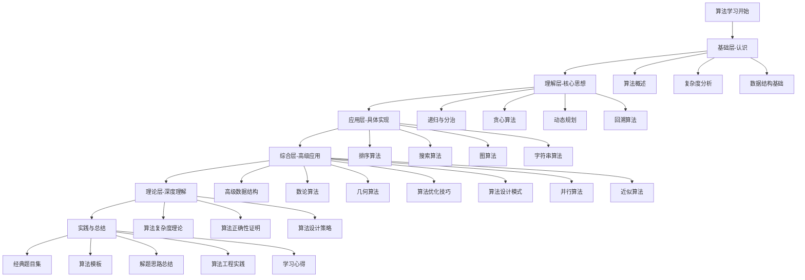

# 算法学习路径图

## 🎯 学习目标
掌握算法设计与分析的核心技能，建立完整的算法知识体系

## 📚 学习路径

## 🗺️ 学习阶段

### 阶段一：基础认知 (2-3周)
- **目标**：建立算法基础概念
- **内容**：[[01-算法概述]]、[[02-复杂度分析]]、[[03-数据结构基础]]
- **重点**：理解算法本质，掌握复杂度分析方法

### 阶段二：核心思想 (4-6周)
- **目标**：掌握四大核心算法思想
- **内容**：[[01-递归与分治]]、[[02-贪心算法]]、[[03-动态规划]]、[[04-回溯算法]]
- **重点**：理解算法设计思想，培养问题分析能力

### 阶段三：具体实现 (6-8周)
- **目标**：掌握经典算法实现
- **内容**：[[01-排序算法]]、[[02-搜索算法]]、[[03-图算法]]、[[04-字符串算法]]
- **重点**：熟练实现经典算法，理解算法细节

### 阶段四：高级应用 (8-10周)
- **目标**：掌握高级算法技术
- **内容**：[[01-高级数据结构]]、[[02-数论算法]]、[[03-几何算法]]等
- **重点**：解决复杂问题，优化算法性能

### 阶段五：理论深化 (4-6周)
- **目标**：深入理解算法理论
- **内容**：[[01-算法复杂度理论]]、[[02-算法正确性证明]]、[[03-算法设计策略]]
- **重点**：理论分析，算法证明

### 阶段六：实践总结 (持续)
- **目标**：巩固提升，形成体系
- **内容**：[[01-经典题目集]]、[[02-算法模板]]、[[03-解题思路总结]]
- **重点**：大量练习，总结规律

## 🎯 学习建议

### 费曼学习法应用
1. **选择概念**：每次学习一个核心概念
2. **教授他人**：用自己的话解释算法原理
3. **回顾简化**：找出理解不足的地方
4. **重新组织**：用更简单的方式表达

### 刻意练习要点
- **明确目标**：每次练习都有具体目标
- **专注练习**：避免重复性练习，注重质量
- **及时反馈**：通过测试验证学习效果
- **走出舒适区**：挑战更难的算法问题

## 📊 学习进度跟踪

| 阶段 | 内容 | 预计时间 | 完成状态 | 备注 |
|------|------|----------|----------|------|
| 基础层 | 算法概述、复杂度分析、数据结构 | 2-3周 | ⏳ | 重点掌握复杂度分析 |
| 理解层 | 四大核心思想 | 4-6周 | ⏳ | 理解算法设计思想 |
| 应用层 | 经典算法实现 | 6-8周 | ⏳ | 熟练实现算法 |
| 综合层 | 高级算法技术 | 8-10周 | ⏳ | 解决复杂问题 |
| 理论层 | 算法理论深化 | 4-6周 | ⏳ | 理论分析能力 |
| 实践层 | 题目练习总结 | 持续 | ⏳ | 大量练习 |

## 🔗 相关链接
- [[02-知识点索引]] - 快速查找知识点
- [[03-学习检查清单]] - 学习进度检查
- [[04-核心概念速查表]] - 核心概念快速查阅
- [[05-算法对比总表]] - 算法对比分析

