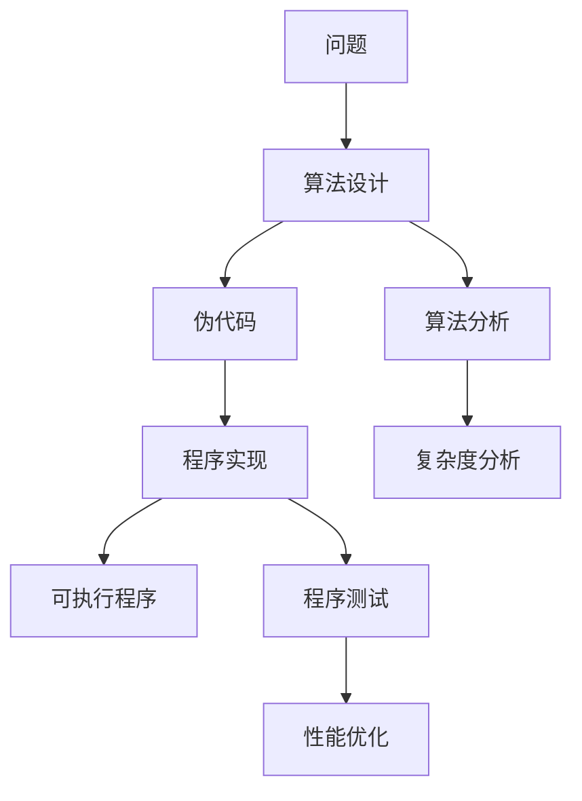

# 算法与程序的关系

## 🎯 核心关系

**算法**是解决问题的抽象方法，**程序**是算法的具体实现。

## 🔍 详细对比

| 维度 | 算法 | 程序 |
|------|------|------|
| **本质** | 抽象的问题解决方法 | 具体的可执行代码 |
| **语言** | 自然语言、伪代码 | 编程语言 |
| **平台** | 平台无关 | 平台相关 |
| **执行** | 概念性 | 实际可执行 |
| **调试** | 逻辑验证 | 实际测试 |
| **优化** | 理论分析 | 性能测量 |

## 🏗️ 关系层次



## 📝 算法到程序的转换

### 1. 算法设计阶段
```python
# 算法：冒泡排序
# 输入：数组 arr
# 输出：排序后的数组
# 步骤：
# 1. 比较相邻元素
# 2. 如果顺序错误则交换
# 3. 重复直到排序完成
```

### 2. 伪代码阶段
```python
# 伪代码
for i = 0 to n-1:
    for j = 0 to n-i-2:
        if arr[j] > arr[j+1]:
            swap(arr[j], arr[j+1])
```

### 3. 程序实现阶段
```python
def bubble_sort(arr):
    """冒泡排序实现"""
    n = len(arr)
    for i in range(n):
        for j in range(0, n-i-1):
            if arr[j] > arr[j+1]:
                arr[j], arr[j+1] = arr[j+1], arr[j]
    return arr
```

## 🎨 实际示例

### 算法：二分查找
```python
# 算法描述
# 1. 在有序数组中查找目标值
# 2. 比较中间元素
# 3. 根据比较结果缩小搜索范围
# 4. 重复直到找到或确定不存在

def binary_search(arr, target):
    """二分查找算法实现"""
    left, right = 0, len(arr) - 1
    
    while left <= right:
        mid = (left + right) // 2
        if arr[mid] == target:
            return mid
        elif arr[mid] < target:
            left = mid + 1
        else:
            right = mid - 1
    
    return -1
```

## 🔄 算法与程序的相互影响

### 算法影响程序
- **效率**：算法复杂度决定程序性能
- **正确性**：算法逻辑决定程序功能
- **可维护性**：算法清晰度影响代码质量

### 程序影响算法
- **实现约束**：编程语言特性影响算法实现
- **优化机会**：程序优化可能改变算法选择
- **错误发现**：程序测试可能发现算法问题

## 📊 开发流程


## 🎯 实践建议

### 算法设计原则
1. **清晰性**：算法逻辑清晰易懂
2. **正确性**：算法能够正确解决问题
3. **效率性**：算法时间和空间效率合理
4. **通用性**：算法适用于类似问题

### 程序实现原则
1. **可读性**：代码结构清晰，注释完整
2. **可维护性**：代码易于修改和扩展
3. **健壮性**：程序能够处理异常情况
4. **性能**：程序运行效率满足要求

## 🔗 相关概念

### 算法复杂度 vs 程序性能
- **算法复杂度**：理论分析，关注增长趋势
- **程序性能**：实际测量，关注具体数值
- **关系**：算法复杂度是程序性能的理论基础

### 算法正确性 vs 程序正确性
- **算法正确性**：逻辑正确，能够解决问题
- **程序正确性**：实现正确，能够正确执行
- **关系**：程序正确性依赖算法正确性

## 📚 学习建议

### 理解关系
1. **对比学习**：同时学习算法和程序
2. **实践验证**：通过编程验证算法
3. **分析思考**：思考算法到程序的转换
4. **优化改进**：不断优化算法和程序

### 刻意练习
1. **算法设计**：设计解决具体问题的算法
2. **程序实现**：将算法转换为可执行程序
3. **性能分析**：分析程序的实际性能
4. **优化改进**：根据分析结果优化算法

## 🔗 相关链接
- [[01-算法定义与特征]] - 算法的基本概念
- [[03-算法设计目标]] - 算法设计的目标
- [[01-时间复杂度概念]] - 算法效率分析
- [[02-空间复杂度概念]] - 算法空间分析

