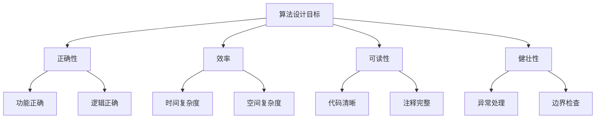
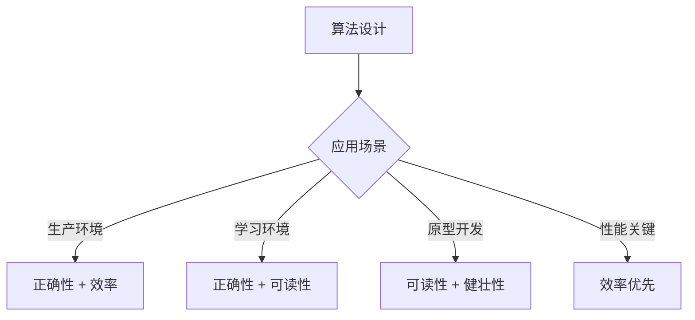

# 算法设计目标

## 🎯 核心目标

算法设计的四大核心目标：**正确性**、**效率**、**可读性**、**健壮性**

## 📊 目标优先级



## 🔍 详细分析

### 1. 正确性 (Correctness) ⭐⭐⭐
- **定义**：算法能够正确解决问题
- **要求**：对于所有合法输入都能产生正确输出
- **验证方法**：
  - 数学证明
  - 测试用例验证
  - 边界条件检查

**示例**：排序算法必须保证输出数组有序
```python
def is_sorted(arr):
    """检查数组是否有序"""
    for i in range(len(arr) - 1):
        if arr[i] > arr[i + 1]:
            return False
    return True
```

### 2. 效率 (Efficiency) ⭐⭐⭐
- **定义**：算法的时间和空间效率
- **时间效率**：执行时间随输入规模的增长
- **空间效率**：内存使用随输入规模的增长

**复杂度对比**：
| 复杂度 | 时间 | 空间 | 示例 |
|--------|------|------|------|
| O(1) | 常数 | 常数 | 数组访问 |
| O(log n) | 对数 | 对数 | 二分查找 |
| O(n) | 线性 | 线性 | 遍历数组 |
| O(n log n) | 线性对数 | 线性对数 | 归并排序 |
| O(n²) | 平方 | 平方 | 冒泡排序 |

### 3. 可读性 (Readability) ⭐⭐
- **定义**：算法易于理解和维护
- **要求**：
  - 清晰的逻辑结构
  - 有意义的变量名
  - 适当的注释
  - 模块化设计

**示例**：清晰的快速排序实现
```python
def quick_sort(arr):
    """快速排序 - 清晰版本"""
    if len(arr) <= 1:
        return arr
    
    # 选择基准元素
    pivot = arr[len(arr) // 2]
    
    # 分割数组
    left = [x for x in arr if x < pivot]
    middle = [x for x in arr if x == pivot]
    right = [x for x in arr if x > pivot]
    
    # 递归排序并合并
    return quick_sort(left) + middle + quick_sort(right)
```

### 4. 健壮性 (Robustness) ⭐⭐
- **定义**：算法对异常输入的处理能力
- **要求**：
  - 输入验证
  - 异常处理
  - 边界条件处理
  - 错误恢复机制

**示例**：健壮的查找算法
```python
def safe_search(arr, target):
    """健壮的查找算法"""
    # 输入验证
    if not isinstance(arr, list):
        raise TypeError("输入必须是列表")
    
    if not arr:
        return -1
    
    # 边界检查
    if target is None:
        return -1
    
    # 执行查找
    try:
        for i, value in enumerate(arr):
            if value == target:
                return i
        return -1
    except Exception as e:
        print(f"查找过程中发生错误: {e}")
        return -1
```

## ⚖️ 目标权衡

### 常见权衡情况

| 情况 | 优先目标 | 次要目标 | 示例 |
|------|----------|----------|------|
| 生产环境 | 正确性 + 效率 | 可读性 | 高频交易系统 |
| 学习阶段 | 正确性 + 可读性 | 效率 | 教学代码 |
| 原型开发 | 可读性 + 健壮性 | 效率 | 快速验证 |
| 性能关键 | 效率 | 可读性 | 实时系统 |

### 权衡策略


## 🎯 设计原则

### 1. 正确性优先
- 功能正确是基本要求
- 通过测试验证正确性
- 考虑边界条件

### 2. 效率平衡
- 根据应用场景选择复杂度
- 时间与空间效率的权衡
- 实际性能测试

### 3. 可读性保障
- 清晰的代码结构
- 有意义的命名
- 适当的注释

### 4. 健壮性考虑
- 输入验证
- 异常处理
- 错误恢复

## 📈 目标评估

### 评估方法
| 目标 | 评估方法 | 工具 |
|------|----------|------|
| 正确性 | 测试用例 | 单元测试 |
| 效率 | 复杂度分析 | 性能分析器 |
| 可读性 | 代码审查 | 静态分析 |
| 健壮性 | 异常测试 | 压力测试 |

### 评估标准
- **正确性**：100% 测试用例通过
- **效率**：满足性能要求
- **可读性**：代码审查通过
- **健壮性**：异常情况处理正确

## 🔗 相关概念

### 算法复杂度分析
- **时间复杂度**：[[01-时间复杂度概念]]
- **空间复杂度**：[[02-空间复杂度概念]]
- **复杂度分析**：[[04-复杂度分析方法]]

### 算法设计策略
- **分治策略**：[[03-分治策略]]
- **贪心策略**：[[01-贪心策略原理]]
- **动态规划**：[[01-DP基本思想]]

## 📚 学习建议

### 目标导向学习
1. **明确目标**：根据应用场景确定优先级
2. **平衡考虑**：在多个目标间找到平衡
3. **持续改进**：不断优化算法设计
4. **实践验证**：通过实际项目验证目标

### 刻意练习
1. **正确性练习**：设计测试用例验证算法
2. **效率练习**：分析算法复杂度
3. **可读性练习**：编写清晰的代码
4. **健壮性练习**：处理异常情况

## 🔗 相关链接
- [[01-算法定义与特征]] - 算法的基本概念
- [[02-算法与程序的关系]] - 算法与程序的区别
- [[01-时间复杂度概念]] - 算法效率分析
- [[02-空间复杂度概念]] - 算法空间分析

