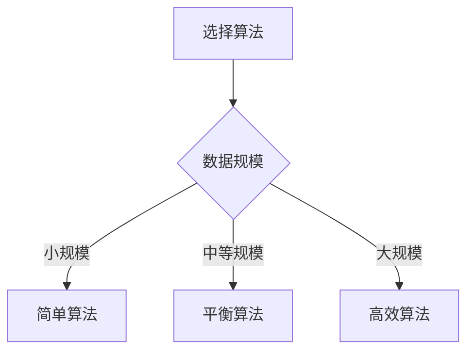

# 复杂度分析方法

## 🎯 核心概念

**复杂度分析**是评估算法效率的系统性方法，包括时间复杂度和空间复杂度的分析技巧。

## 🔍 分析方法概览

### 分析步骤
1. **识别基本操作**：确定算法中的基本操作
2. **统计执行次数**：计算基本操作的执行次数
3. **建立函数关系**：建立执行次数与输入规模的关系
4. **确定复杂度**：用大O记号法表示复杂度

### 分析原则
- **最坏情况**：分析最坏情况下的复杂度
- **忽略常数**：忽略常数因子和低次项
- **关注趋势**：关注增长趋势而非具体数值

## 📊 具体分析方法

### 1. 基本操作计数法

#### 适用场景
- 简单算法
- 循环结构清晰
- 基本操作明确

#### 分析步骤
1. 识别基本操作
2. 统计执行次数
3. 建立函数关系

#### 示例：线性查找
```python
def linear_search(arr, target):
    """线性查找 - O(n)"""
    for i, value in enumerate(arr):  # 基本操作：比较
        if value == target:          # 基本操作：比较
            return i                 # 基本操作：返回
    return -1
```

**分析过程**：
- 基本操作：比较操作
- 最坏情况：需要比较n次
- 时间复杂度：O(n)

### 2. 循环分析法

#### 适用场景
- 包含循环的算法
- 嵌套循环结构
- 循环次数可计算

#### 分析步骤
1. 分析外层循环次数
2. 分析内层循环次数
3. 计算总执行次数

#### 示例：冒泡排序
```python
def bubble_sort(arr):
    """冒泡排序 - O(n²)"""
    n = len(arr)
    for i in range(n):                    # 外层循环：n次
        for j in range(0, n - i - 1):    # 内层循环：n-i-1次
            if arr[j] > arr[j + 1]:       # 基本操作：比较
                arr[j], arr[j + 1] = arr[j + 1], arr[j]  # 基本操作：交换
    return arr
```

**分析过程**：
- 外层循环：n次
- 内层循环：n-i-1次
- 总执行次数：∑(n-i-1) = n(n-1)/2
- 时间复杂度：O(n²)

### 3. 递归分析法

#### 适用场景
- 递归算法
- 分治算法
- 递归关系明确

#### 分析方法
1. **递归树法**：画出递归调用树
2. **主定理法**：使用主定理公式
3. **递推关系法**：建立递推关系式

#### 示例：归并排序
```python
def merge_sort(arr):
    """归并排序 - O(n log n)"""
    if len(arr) <= 1:
        return arr
    
    mid = len(arr) // 2
    left = merge_sort(arr[:mid])    # 递归调用
    right = merge_sort(arr[mid:])   # 递归调用
    
    return merge(left, right)       # 合并操作
```

**递归树分析**：
```
                n
              /   \
            n/2   n/2
           /  \   /  \
         n/4 n/4 n/4 n/4
         ... ... ... ...
```

**分析过程**：
- 递归深度：log n
- 每层工作量：O(n)
- 总工作量：O(n log n)

### 4. 主定理法

#### 主定理公式
对于递归关系 T(n) = aT(n/b) + f(n)：

| 条件 | 复杂度 | 说明 |
|------|--------|------|
| f(n) = O(n^c), c < log_b(a) | T(n) = Θ(n^(log_b(a))) | 叶子节点主导 |
| f(n) = Θ(n^c), c = log_b(a) | T(n) = Θ(n^c log n) | 各层平衡 |
| f(n) = Ω(n^c), c > log_b(a) | T(n) = Θ(f(n)) | 根节点主导 |

#### 示例：快速排序
```python
def quick_sort(arr):
    """快速排序 - O(n log n)"""
    if len(arr) <= 1:
        return arr
    
    pivot = arr[len(arr) // 2]
    left = [x for x in arr if x < pivot]
    middle = [x for x in arr if x == pivot]
    right = [x for x in arr if x > pivot]
    
    return quick_sort(left) + middle + quick_sort(right)
```

**主定理分析**：
- a = 2（两个子问题）
- b = 2（问题规模减半）
- f(n) = O(n)（分割操作）
- log_b(a) = log_2(2) = 1
- 因为 f(n) = O(n^1) = O(n^c), c = 1 = log_b(a)
- 所以 T(n) = Θ(n log n)

## 🎨 复杂情况分析

### 1. 条件分支分析
```python
def conditional_example(arr):
    """条件分支示例"""
    if len(arr) == 0:         # O(1)
        return 0
    
    max_val = arr[0]          # O(1)
    for i in range(1, len(arr)):  # O(n)
        if arr[i] > max_val:      # O(1)
            max_val = arr[i]      # O(1)
    
    return max_val
# 总复杂度：O(1) + O(1) + O(n) × O(1) = O(n)
```

### 2. 嵌套结构分析
```python
def nested_example(n):
    """嵌套结构示例 - O(n²)"""
    result = []
    for i in range(n):        # 外层循环：n次
        for j in range(i):    # 内层循环：i次
            result.append(i * j)  # 基本操作：O(1)
    return result
# 总执行次数：∑i = n(n-1)/2
# 时间复杂度：O(n²)
```

### 3. 递归优化分析
```python
def fibonacci_memo(n, memo={}):
    """记忆化斐波那契 - O(n)"""
    if n in memo:
        return memo[n]
    
    if n <= 1:
        return n
    
    memo[n] = fibonacci_memo(n-1, memo) + fibonacci_memo(n-2, memo)
    return memo[n]
# 每个子问题只计算一次
# 时间复杂度：O(n)
```

## 📈 空间复杂度分析

### 1. 变量空间分析
```python
def space_example(arr):
    """空间复杂度分析 - O(1)"""
    max_val = arr[0]          # O(1)
    min_val = arr[0]          # O(1)
    
    for i in range(1, len(arr)):
        if arr[i] > max_val:
            max_val = arr[i]
        if arr[i] < min_val:
            min_val = arr[i]
    
    return max_val, min_val
# 只使用常数个变量
# 空间复杂度：O(1)
```

### 2. 递归空间分析
```python
def recursive_space(n):
    """递归空间分析 - O(n)"""
    if n <= 0:
        return 0
    
    return n + recursive_space(n - 1)
# 递归深度：n
# 每层空间：O(1)
# 总空间复杂度：O(n)
```

### 3. 数据结构空间分析
```python
def data_structure_space(n):
    """数据结构空间分析 - O(n)"""
    result = []               # O(n)空间
    for i in range(n):
        result.append(i)
    
    return result
# 结果数组大小：n
# 空间复杂度：O(n)
```

## 🔍 分析技巧

### 1. 简化技巧
- **忽略常数**：O(3n) = O(n)
- **忽略低次项**：O(n² + n) = O(n²)
- **关注主导项**：O(n² + n log n) = O(n²)

### 2. 近似技巧
- **循环次数**：近似为循环上界
- **递归深度**：近似为log n
- **分支概率**：考虑最坏情况

### 3. 验证技巧
- **小规模测试**：用小的输入验证
- **数学验证**：用数学公式验证
- **实际测量**：用实际运行时间验证

## 📊 分析工具

### 1. 数学工具
- **求和公式**：∑i = n(n+1)/2
- **对数性质**：log(ab) = log a + log b
- **指数性质**：a^(b+c) = a^b × a^c

### 2. 图形工具
- **递归树**：可视化递归过程
- **调用图**：显示函数调用关系
- **复杂度图**：比较不同复杂度

### 3. 编程工具
- **性能分析器**：测量实际运行时间
- **内存分析器**：测量内存使用
- **复杂度分析器**：自动分析复杂度

## 🎯 实际应用

### 1. 算法选择


### 2. 性能优化
- **时间复杂度优化**：选择更高效的算法
- **空间复杂度优化**：减少内存使用
- **实际性能优化**：考虑常数因子

### 3. 系统设计
- **架构设计**：根据复杂度选择架构
- **资源分配**：根据复杂度分配资源
- **性能监控**：监控复杂度变化

## 🔗 相关概念

### 时间复杂度
- **关系**：复杂度分析的核心内容
- **链接**：[[01-时间复杂度概念]]

### 空间复杂度
- **关系**：复杂度分析的重要组成部分
- **链接**：[[02-空间复杂度概念]]

### 大O记号法
- **关系**：复杂度分析的工具
- **链接**：[[03-大O记号法详解]]

## 📚 学习建议

### 费曼学习法
1. **选择概念**：复杂度分析方法
2. **教授他人**：解释分析方法
3. **回顾简化**：找出理解不足
4. **重新组织**：用更简单的方式表达

### 刻意练习
1. **分析练习**：分析各种算法的复杂度
2. **比较练习**：比较不同算法的复杂度
3. **优化练习**：优化算法的复杂度
4. **应用练习**：在实际问题中应用复杂度分析

## 🔗 相关链接
- [[01-时间复杂度概念]] - 算法的时间效率
- [[02-空间复杂度概念]] - 算法的空间效率
- [[03-大O记号法详解]] - 复杂度表示方法
- [[05-复杂度比较表]] - 复杂度对比分析

