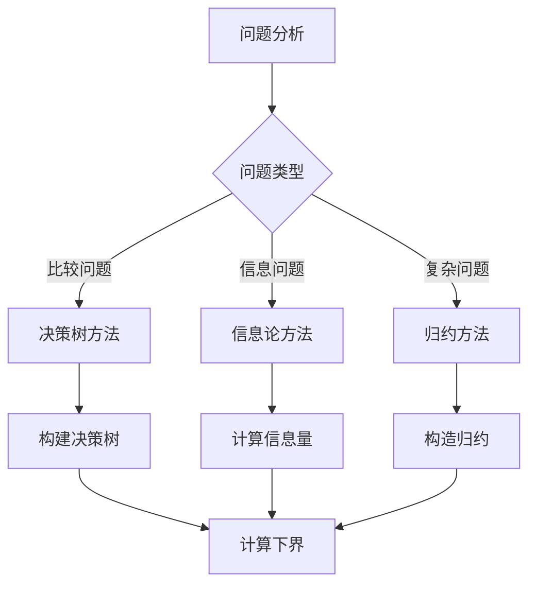

# 算法复杂度下界

## 🎯 核心概念

**算法复杂度下界**是解决特定问题所需的最小时间和空间复杂度，是算法理论分析的重要概念。

## 🔍 基本定义

### 复杂度下界的含义
- **定义**：解决特定问题所需的最小复杂度
- **目的**：评估算法的理论极限
- **意义**：判断算法是否达到最优

### 下界类型
| 下界类型 | 含义 | 示例 |
|----------|------|------|
| 时间复杂度下界 | 解决问题所需的最小时间 | 比较排序下界 |
| 空间复杂度下界 | 解决问题所需的最小空间 | 原地排序下界 |
| 通信复杂度下界 | 分布式计算中的通信量 | 分布式排序 |

## 📊 经典下界定理

### 1. 比较排序下界定理
- **定理**：任何基于比较的排序算法在最坏情况下至少需要 Ω(n log n) 次比较
- **证明**：决策树模型
- **意义**：归并排序、堆排序达到最优

#### 决策树证明
```
对于n个元素的排序：
- 可能的排列数：n!
- 决策树叶子节点数：n!
- 决策树高度：log(n!)
- 根据斯特林公式：log(n!) = n log n - n + O(log n)
- 因此：比较次数 ≥ log(n!) = Ω(n log n)
```

### 2. 线性时间排序下界
- **定理**：基于比较的排序算法不能在线性时间内完成
- **证明**：比较模型限制
- **例外**：非比较排序（计数排序、基数排序）

### 3. 搜索下界定理
- **定理**：在有序数组中搜索需要 Ω(log n) 次比较
- **证明**：二分搜索的最优性
- **意义**：二分搜索达到最优

## 🎨 下界证明方法

### 1. 决策树方法
- **原理**：将算法执行过程建模为决策树
- **适用**：比较类算法
- **步骤**：
  1. 构建决策树
  2. 计算叶子节点数
  3. 计算树的高度
  4. 得出下界

#### 示例：排序决策树
```
对于3个元素的排序：
        [a,b,c]
       /       \
    a≤b?        a>b?
   /   \       /   \
a≤c?   a>c?   b≤c?  b>c?
/ \    / \    / \   / \
...  ... ... ... ... ... ...
```

### 2. 信息论方法
- **原理**：基于信息量的下界
- **适用**：信息处理问题
- **公式**：下界 = 信息量 / 每次操作的信息量

#### 示例：排序信息论
```
排序问题：
- 输入信息量：log(n!) bits
- 每次比较信息量：1 bit
- 最少比较次数：log(n!) = Ω(n log n)
```

### 3. 归约方法
- **原理**：将问题归约到已知下界的问题
- **适用**：复杂问题
- **步骤**：
  1. 选择已知下界的问题
  2. 构造归约
  3. 证明归约的正确性
  4. 得出下界

## 📈 具体下界分析

### 1. 排序算法下界
| 排序类型 | 下界 | 达到下界的算法 | 证明方法 |
|----------|------|----------------|----------|
| 比较排序 | Ω(n log n) | 归并排序、堆排序 | 决策树 |
| 非比较排序 | Ω(n) | 计数排序、基数排序 | 信息论 |
| 原地排序 | Ω(n log n) | 堆排序 | 决策树 |

### 2. 搜索算法下界
| 搜索类型 | 下界 | 达到下界的算法 | 证明方法 |
|----------|------|----------------|----------|
| 有序数组搜索 | Ω(log n) | 二分查找 | 决策树 |
| 无序数组搜索 | Ω(n) | 线性搜索 | 信息论 |
| 哈希表搜索 | Ω(1) | 完美哈希 | 直接构造 |

### 3. 图算法下界
| 图问题 | 下界 | 达到下界的算法 | 证明方法 |
|--------|------|----------------|----------|
| 最小生成树 | Ω(E log V) | Kruskal算法 | 归约 |
| 最短路径 | Ω(V log V) | Dijkstra算法 | 归约 |
| 拓扑排序 | Ω(V + E) | DFS算法 | 信息论 |

## 🔍 下界应用

### 1. 算法优化
- **目标**：达到理论下界
- **方法**：改进算法设计
- **示例**：从O(n²)优化到O(n log n)

### 2. 算法选择
- **原则**：选择接近下界的算法
- **考虑**：实际性能与理论下界
- **示例**：选择归并排序而非冒泡排序

### 3. 问题分类
- **可解问题**：存在多项式时间算法
- **难解问题**：下界为指数时间
- **开放问题**：下界未知

## 📊 下界与上界关系

### 复杂度层次
| 复杂度 | 上界 | 下界 | 状态 |
|--------|------|------|------|
| 排序 | O(n log n) | Ω(n log n) | 最优 |
| 搜索 | O(log n) | Ω(log n) | 最优 |
| 矩阵乘法 | O(n^2.37) | Ω(n²) | 开放 |
| 旅行商问题 | O(2ⁿ) | Ω(2ⁿ) | 最优 |

### 下界证明策略


## 🎯 实际应用

### 1. 算法设计
- **目标**：设计达到下界的算法
- **方法**：分析问题本质
- **示例**：设计O(n log n)排序算法

### 2. 性能评估
- **标准**：与理论下界比较
- **指标**：实际性能/理论下界
- **目标**：接近1.0

### 3. 问题难度
- **简单问题**：下界为多项式
- **困难问题**：下界为指数
- **开放问题**：下界未知

## 🔗 相关概念

### 时间复杂度
- **关系**：下界是时间复杂度的理论极限
- **链接**：[[01-时间复杂度概念]]

### 空间复杂度
- **关系**：下界是空间复杂度的理论极限
- **链接**：[[02-空间复杂度概念]]

### 大O记号法
- **关系**：下界用Ω记号法表示
- **链接**：[[03-大O记号法详解]]

### 复杂度分析
- **关系**：下界是复杂度分析的理论基础
- **链接**：[[04-复杂度分析方法]]

## 📚 学习建议

### 费曼学习法
1. **选择概念**：算法复杂度下界
2. **教授他人**：解释下界概念
3. **回顾简化**：找出理解不足
4. **重新组织**：用更简单的方式表达

### 刻意练习
1. **证明练习**：证明各种算法的下界
2. **比较练习**：比较上界与下界
3. **应用练习**：在实际问题中应用下界
4. **分析练习**：分析算法的理论极限

## 🔗 相关链接
- [[01-时间复杂度概念]] - 算法的时间效率
- [[02-空间复杂度概念]] - 算法的空间效率
- [[03-大O记号法详解]] - 复杂度表示方法
- [[04-复杂度分析方法]] - 复杂度分析技巧
- [[05-复杂度比较表]] - 复杂度对比分析

