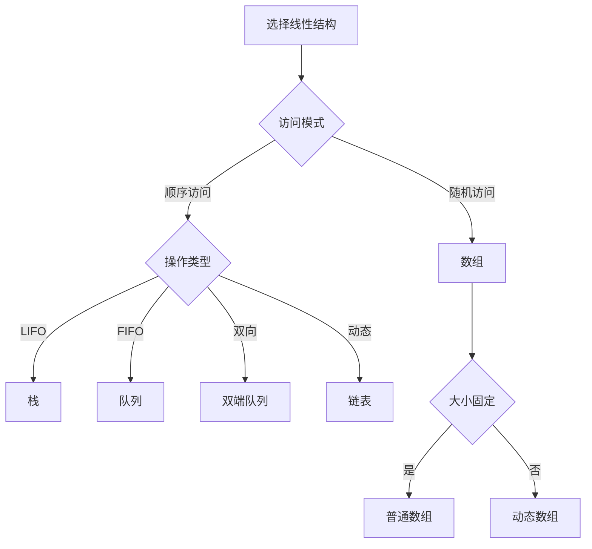

# 线性结构总览

## 🎯 核心概念

**线性结构**是数据元素之间存在一对一关系的数据结构，是最基础的数据组织方式。

## 🔍 基本定义

### 线性结构的特征
- **一对一关系**：每个元素最多有一个前驱和一个后继
- **顺序性**：元素之间存在明确的先后顺序
- **有限性**：元素个数有限
- **同质性**：所有元素属于同一数据类型

### 线性结构的基本操作
| 操作 | 含义 | 时间复杂度 |
|------|------|------------|
| 访问 | 获取指定位置的元素 | O(1) 或 O(n) |
| 搜索 | 查找指定值的元素 | O(n) |
| 插入 | 在指定位置插入元素 | O(1) 或 O(n) |
| 删除 | 删除指定位置的元素 | O(1) 或 O(n) |

## 📊 线性结构分类

### 1. 数组 (Array)
- **特点**：连续存储，固定大小
- **优势**：随机访问，缓存友好
- **劣势**：大小固定，插入删除困难

```python
class Array:
    def __init__(self, size):
        self.data = [None] * size
        self.size = size
    
    def get(self, index):
        if 0 <= index < self.size:
            return self.data[index]
        raise IndexError("Index out of range")
    
    def set(self, index, value):
        if 0 <= index < self.size:
            self.data[index] = value
        else:
            raise IndexError("Index out of range")
```

### 2. 链表 (Linked List)
- **特点**：链式存储，动态大小
- **优势**：动态大小，插入删除容易
- **劣势**：顺序访问，内存开销

```python
class ListNode:
    def __init__(self, val=0, next=None):
        self.val = val
        self.next = next

class LinkedList:
    def __init__(self):
        self.head = None
        self.size = 0
    
    def append(self, val):
        new_node = ListNode(val)
        if not self.head:
            self.head = new_node
        else:
            current = self.head
            while current.next:
                current = current.next
            current.next = new_node
        self.size += 1
```

### 3. 栈 (Stack)
- **特点**：后进先出 (LIFO)
- **操作**：入栈、出栈、查看栈顶
- **应用**：函数调用、表达式求值

```python
class Stack:
    def __init__(self):
        self.items = []
    
    def push(self, item):
        self.items.append(item)
    
    def pop(self):
        if self.is_empty():
            raise IndexError("Stack is empty")
        return self.items.pop()
    
    def peek(self):
        if self.is_empty():
            raise IndexError("Stack is empty")
        return self.items[-1]
    
    def is_empty(self):
        return len(self.items) == 0
    
    def size(self):
        return len(self.items)
```

### 4. 队列 (Queue)
- **特点**：先进先出 (FIFO)
- **操作**：入队、出队、查看队首
- **应用**：任务调度、广度优先搜索

```python
class Queue:
    def __init__(self):
        self.items = []
    
    def enqueue(self, item):
        self.items.append(item)
    
    def dequeue(self):
        if self.is_empty():
            raise IndexError("Queue is empty")
        return self.items.pop(0)
    
    def front(self):
        if self.is_empty():
            raise IndexError("Queue is empty")
        return self.items[0]
    
    def is_empty(self):
        return len(self.items) == 0
    
    def size(self):
        return len(self.items)
```

## 📈 线性结构对比

### 时间复杂度对比
| 操作 | 数组 | 链表 | 栈 | 队列 |
|------|------|------|-----|------|
| 访问 | O(1) | O(n) | O(n) | O(n) |
| 搜索 | O(n) | O(n) | O(n) | O(n) |
| 插入 | O(n) | O(1) | O(1) | O(1) |
| 删除 | O(n) | O(1) | O(1) | O(1) |

### 空间复杂度对比
| 结构 | 空间复杂度 | 额外空间 | 特点 |
|------|------------|----------|------|
| 数组 | O(n) | O(1) | 紧凑存储 |
| 链表 | O(n) | O(n) | 指针开销 |
| 栈 | O(n) | O(1) | 动态增长 |
| 队列 | O(n) | O(1) | 动态增长 |

## 🎨 线性结构变种

### 1. 双端队列 (Deque)
- **特点**：两端都可以插入删除
- **操作**：前端/后端插入删除
- **应用**：滑动窗口、回文检查

```python
class Deque:
    def __init__(self):
        self.items = []
    
    def add_front(self, item):
        self.items.insert(0, item)
    
    def add_rear(self, item):
        self.items.append(item)
    
    def remove_front(self):
        if self.is_empty():
            raise IndexError("Deque is empty")
        return self.items.pop(0)
    
    def remove_rear(self):
        if self.is_empty():
            raise IndexError("Deque is empty")
        return self.items.pop()
    
    def is_empty(self):
        return len(self.items) == 0
```

### 2. 循环队列 (Circular Queue)
- **特点**：固定大小，循环使用
- **优势**：空间利用率高
- **应用**：缓冲区、任务队列

```python
class CircularQueue:
    def __init__(self, size):
        self.size = size
        self.queue = [None] * size
        self.front = 0
        self.rear = 0
        self.count = 0
    
    def enqueue(self, item):
        if self.is_full():
            raise IndexError("Queue is full")
        self.queue[self.rear] = item
        self.rear = (self.rear + 1) % self.size
        self.count += 1
    
    def dequeue(self):
        if self.is_empty():
            raise IndexError("Queue is empty")
        item = self.queue[self.front]
        self.front = (self.front + 1) % self.size
        self.count -= 1
        return item
    
    def is_empty(self):
        return self.count == 0
    
    def is_full(self):
        return self.count == self.size
```

### 3. 优先队列 (Priority Queue)
- **特点**：按优先级排序
- **实现**：堆、有序数组
- **应用**：任务调度、最短路径

```python
import heapq

class PriorityQueue:
    def __init__(self):
        self.heap = []
    
    def push(self, item, priority):
        heapq.heappush(self.heap, (priority, item))
    
    def pop(self):
        if self.is_empty():
            raise IndexError("Priority queue is empty")
        priority, item = heapq.heappop(self.heap)
        return item
    
    def is_empty(self):
        return len(self.heap) == 0
    
    def size(self):
        return len(self.heap)
```

## 🔍 线性结构应用

### 1. 数组应用
- **矩阵存储**：二维数组表示矩阵
- **字符串处理**：字符数组
- **图像处理**：像素数组
- **缓存系统**：固定大小缓存

### 2. 链表应用
- **动态内存管理**：操作系统内存分配
- **文件系统**：文件链式存储
- **音乐播放器**：播放列表
- **撤销操作**：命令历史

### 3. 栈应用
- **函数调用**：调用栈
- **表达式求值**：中缀转后缀
- **括号匹配**：语法检查
- **深度优先搜索**：递归转迭代

### 4. 队列应用
- **任务调度**：操作系统调度
- **广度优先搜索**：图遍历
- **缓冲区**：生产者消费者
- **打印队列**：打印任务管理

## 📊 选择指南

### 数据结构选择决策树


### 选择原则
| 需求 | 推荐结构 | 原因 |
|------|----------|------|
| 频繁随机访问 | 数组 | O(1)访问 |
| 频繁插入删除 | 链表 | O(1)操作 |
| 后进先出 | 栈 | 天然LIFO |
| 先进先出 | 队列 | 天然FIFO |
| 两端操作 | 双端队列 | 双向操作 |
| 优先级处理 | 优先队列 | 自动排序 |

## 🎯 学习要点

### 理解重点
1. **结构特点**：理解各种线性结构的特点
2. **操作复杂度**：掌握各种操作的时间复杂度
3. **应用场景**：了解各种结构的适用场景
4. **选择原则**：学会根据需求选择合适结构

### 常见误区
- **误区1**：认为数组总是比链表快
- **误区2**：忽略空间开销
- **误区3**：不考虑访问模式
- **误区4**：混淆栈和队列

## 🔗 相关概念

### 复杂度分析
- **关系**：线性结构的操作复杂度
- **链接**：[[01-时间复杂度概念]]、[[02-空间复杂度概念]]

### 具体实现
- **关系**：线性结构的具体实现
- **链接**：[[02-数组详解]]、[[03-链表详解]]、[[04-栈详解]]、[[05-队列详解]]

## 📚 学习建议

### 费曼学习法
1. **选择概念**：线性结构
2. **教授他人**：解释线性结构特点
3. **回顾简化**：找出理解不足
4. **重新组织**：用更简单的方式表达

### 刻意练习
1. **实现练习**：实现各种线性结构
2. **应用练习**：解决实际问题
3. **比较练习**：比较不同结构的性能
4. **选择练习**：根据场景选择合适结构

## 🔗 相关链接
- [[02-数组详解]] - 数组的详细实现
- [[03-链表详解]] - 链表的详细实现
- [[04-栈详解]] - 栈的详细实现
- [[05-队列详解]] - 队列的详细实现

