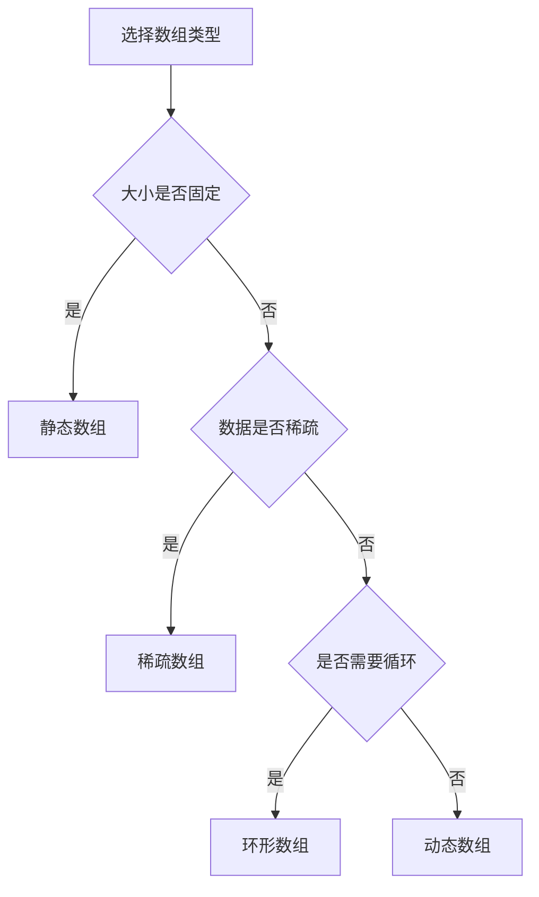

# 数组详解

## 🎯 核心概念

**数组**是一种线性数据结构，由相同类型的元素按顺序排列，通过索引访问元素。

## 🔍 基本定义

### 数组的特征
- **同质性**：所有元素类型相同
- **连续性**：内存中连续存储
- **索引性**：通过索引直接访问
- **固定性**：大小在创建时确定

### 数组的基本操作
| 操作 | 时间复杂度 | 空间复杂度 | 说明 |
|------|------------|------------|------|
| 访问 | O(1) | O(1) | 通过索引直接访问 |
| 搜索 | O(n) | O(1) | 线性搜索 |
| 插入 | O(n) | O(1) | 需要移动元素 |
| 删除 | O(n) | O(1) | 需要移动元素 |

## 📊 数组实现

### 1. 静态数组
- **特点**：大小固定，编译时确定
- **优势**：内存效率高，访问速度快
- **劣势**：大小不可变

```python
class StaticArray:
    def __init__(self, size):
        self.data = [None] * size
        self.size = size
    
    def get(self, index):
        if 0 <= index < self.size:
            return self.data[index]
        raise IndexError("Index out of range")
    
    def set(self, index, value):
        if 0 <= index < self.size:
            self.data[index] = value
        else:
            raise IndexError("Index out of range")
    
    def length(self):
        return self.size
```

### 2. 动态数组
- **特点**：大小可变，自动扩容
- **优势**：灵活性高，自动管理内存
- **劣势**：扩容时有性能开销

```python
class DynamicArray:
    def __init__(self, initial_capacity=10):
        self.data = [None] * initial_capacity
        self.size = 0
        self.capacity = initial_capacity
    
    def get(self, index):
        if 0 <= index < self.size:
            return self.data[index]
        raise IndexError("Index out of range")
    
    def set(self, index, value):
        if 0 <= index < self.size:
            self.data[index] = value
        else:
            raise IndexError("Index out of range")
    
    def append(self, value):
        if self.size >= self.capacity:
            self._resize()
        self.data[self.size] = value
        self.size += 1
    
    def insert(self, index, value):
        if index < 0 or index > self.size:
            raise IndexError("Index out of range")
        
        if self.size >= self.capacity:
            self._resize()
        
        # 移动元素
        for i in range(self.size, index, -1):
            self.data[i] = self.data[i-1]
        
        self.data[index] = value
        self.size += 1
    
    def delete(self, index):
        if index < 0 or index >= self.size:
            raise IndexError("Index out of range")
        
        # 移动元素
        for i in range(index, self.size - 1):
            self.data[i] = self.data[i + 1]
        
        self.size -= 1
    
    def _resize(self):
        new_capacity = self.capacity * 2
        new_data = [None] * new_capacity
        
        for i in range(self.size):
            new_data[i] = self.data[i]
        
        self.data = new_data
        self.capacity = new_capacity
```

## 🎨 数组变种

### 1. 多维数组
- **二维数组**：矩阵表示
- **三维数组**：立体数据
- **应用**：图像处理、科学计算

```python
class Matrix:
    def __init__(self, rows, cols):
        self.rows = rows
        self.cols = cols
        self.data = [[0] * cols for _ in range(rows)]
    
    def get(self, row, col):
        if 0 <= row < self.rows and 0 <= col < self.cols:
            return self.data[row][col]
        raise IndexError("Index out of range")
    
    def set(self, row, col, value):
        if 0 <= row < self.rows and 0 <= col < self.cols:
            self.data[row][col] = value
        else:
            raise IndexError("Index out of range")
    
    def transpose(self):
        result = Matrix(self.cols, self.rows)
        for i in range(self.rows):
            for j in range(self.cols):
                result.set(j, i, self.get(i, j))
        return result
```

### 2. 稀疏数组
- **特点**：大部分元素为0或空
- **优势**：节省存储空间
- **应用**：稀疏矩阵、图像压缩

```python
class SparseArray:
    def __init__(self, size):
        self.size = size
        self.data = {}  # 只存储非零元素
    
    def get(self, index):
        if 0 <= index < self.size:
            return self.data.get(index, 0)
        raise IndexError("Index out of range")
    
    def set(self, index, value):
        if 0 <= index < self.size:
            if value != 0:
                self.data[index] = value
            elif index in self.data:
                del self.data[index]
        else:
            raise IndexError("Index out of range")
```

### 3. 环形数组
- **特点**：首尾相连，循环使用
- **优势**：空间利用率高
- **应用**：缓冲区、循环队列

```python
class CircularArray:
    def __init__(self, size):
        self.data = [None] * size
        self.size = size
        self.head = 0
        self.count = 0
    
    def get(self, index):
        if 0 <= index < self.count:
            actual_index = (self.head + index) % self.size
            return self.data[actual_index]
        raise IndexError("Index out of range")
    
    def append(self, value):
        if self.count < self.size:
            index = (self.head + self.count) % self.size
            self.data[index] = value
            self.count += 1
        else:
            # 覆盖最旧的元素
            self.data[self.head] = value
            self.head = (self.head + 1) % self.size
```

## 🔍 数组算法

### 1. 数组搜索
```python
def linear_search(arr, target):
    """线性搜索 - O(n)"""
    for i, value in enumerate(arr):
        if value == target:
            return i
    return -1

def binary_search(arr, target):
    """二分搜索 - O(log n)"""
    left, right = 0, len(arr) - 1
    
    while left <= right:
        mid = (left + right) // 2
        if arr[mid] == target:
            return mid
        elif arr[mid] < target:
            left = mid + 1
        else:
            right = mid - 1
    
    return -1
```

### 2. 数组排序
```python
def bubble_sort(arr):
    """冒泡排序 - O(n²)"""
    n = len(arr)
    for i in range(n):
        for j in range(0, n - i - 1):
            if arr[j] > arr[j + 1]:
                arr[j], arr[j + 1] = arr[j + 1], arr[j]
    return arr

def selection_sort(arr):
    """选择排序 - O(n²)"""
    n = len(arr)
    for i in range(n):
        min_idx = i
        for j in range(i + 1, n):
            if arr[j] < arr[min_idx]:
                min_idx = j
        arr[i], arr[min_idx] = arr[min_idx], arr[i]
    return arr

def insertion_sort(arr):
    """插入排序 - O(n²)"""
    for i in range(1, len(arr)):
        key = arr[i]
        j = i - 1
        while j >= 0 and arr[j] > key:
            arr[j + 1] = arr[j]
            j -= 1
        arr[j + 1] = key
    return arr
```

### 3. 数组操作
```python
def reverse_array(arr):
    """反转数组 - O(n)"""
    left, right = 0, len(arr) - 1
    while left < right:
        arr[left], arr[right] = arr[right], arr[left]
        left += 1
        right -= 1
    return arr

def rotate_array(arr, k):
    """旋转数组 - O(n)"""
    n = len(arr)
    k = k % n
    
    # 反转整个数组
    arr.reverse()
    
    # 反转前k个元素
    arr[:k] = arr[:k][::-1]
    
    # 反转后n-k个元素
    arr[k:] = arr[k:][::-1]
    
    return arr

def find_duplicates(arr):
    """查找重复元素 - O(n)"""
    seen = set()
    duplicates = set()
    
    for num in arr:
        if num in seen:
            duplicates.add(num)
        else:
            seen.add(num)
    
    return list(duplicates)
```

## 📈 数组性能分析

### 时间复杂度分析
| 操作 | 最好情况 | 平均情况 | 最坏情况 | 说明 |
|------|----------|----------|----------|------|
| 访问 | O(1) | O(1) | O(1) | 直接索引访问 |
| 搜索 | O(1) | O(n) | O(n) | 线性搜索 |
| 插入 | O(1) | O(n) | O(n) | 末尾插入vs中间插入 |
| 删除 | O(1) | O(n) | O(n) | 末尾删除vs中间删除 |

### 空间复杂度分析
| 类型 | 空间复杂度 | 额外空间 | 说明 |
|------|------------|----------|------|
| 静态数组 | O(n) | O(1) | 固定大小 |
| 动态数组 | O(n) | O(n) | 扩容时需要额外空间 |
| 稀疏数组 | O(k) | O(k) | k为非零元素个数 |

## 🎯 数组应用

### 1. 基础应用
- **计数器**：统计字符出现次数
- **缓存**：LRU缓存实现
- **哈希表**：数组实现哈希表
- **栈和队列**：数组实现栈和队列

### 2. 算法应用
- **动态规划**：状态转移表
- **图算法**：邻接矩阵
- **排序算法**：各种排序实现
- **搜索算法**：二分搜索

### 3. 实际应用
- **图像处理**：像素数组
- **音频处理**：音频数据
- **科学计算**：数值计算
- **数据库**：索引结构

## 📊 数组选择指南

### 选择原则
| 需求 | 推荐类型 | 原因 |
|------|----------|------|
| 固定大小 | 静态数组 | 内存效率高 |
| 动态大小 | 动态数组 | 灵活性好 |
| 稀疏数据 | 稀疏数组 | 节省空间 |
| 循环使用 | 环形数组 | 空间利用率高 |
| 多维数据 | 多维数组 | 自然表示 |

### 性能考虑


## 🔗 相关概念

### 线性结构
- **关系**：数组是线性结构的一种
- **链接**：[[01-线性结构总览]]

### 复杂度分析
- **关系**：数组操作的复杂度分析
- **链接**：[[01-时间复杂度概念]]、[[02-空间复杂度概念]]

### 排序算法
- **关系**：数组是排序算法的基础
- **链接**：[[01-排序算法总览]]

## 📚 学习建议

### 费曼学习法
1. **选择概念**：数组
2. **教授他人**：解释数组特点
3. **回顾简化**：找出理解不足
4. **重新组织**：用更简单的方式表达

### 刻意练习
1. **实现练习**：实现各种数组操作
2. **算法练习**：在数组上实现算法
3. **应用练习**：解决实际问题
4. **优化练习**：优化数组操作性能

## 🔗 相关链接
- [[01-线性结构总览]] - 线性结构概述
- [[03-链表详解]] - 链表的详细实现
- [[04-栈详解]] - 栈的详细实现
- [[05-队列详解]] - 队列的详细实现

