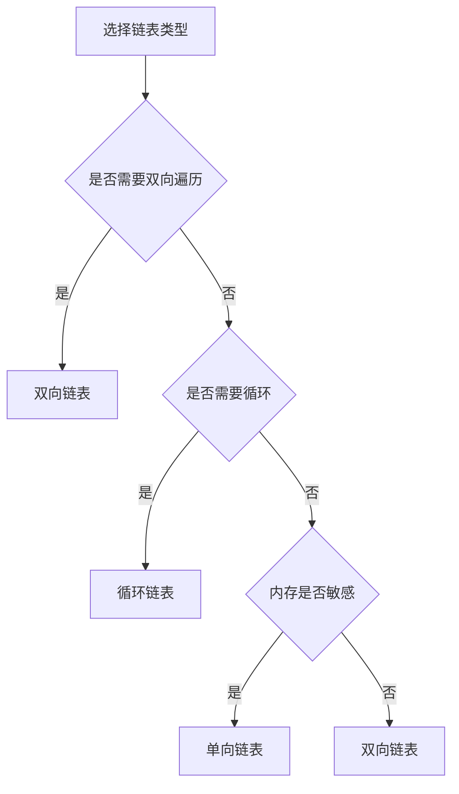

# 链表详解

## 🎯 核心概念

**链表**是一种线性数据结构，由节点组成，每个节点包含数据和指向下一个节点的指针。

## 🔍 基本定义

### 链表的特征
- **动态性**：大小可以动态变化
- **链式存储**：节点通过指针连接
- **顺序访问**：只能顺序访问元素
- **内存分散**：节点在内存中不一定连续

### 链表的基本操作
| 操作 | 时间复杂度 | 空间复杂度 | 说明 |
|------|------------|------------|------|
| 访问 | O(n) | O(1) | 需要遍历到目标位置 |
| 搜索 | O(n) | O(1) | 线性搜索 |
| 插入 | O(1) | O(1) | 已知位置插入 |
| 删除 | O(1) | O(1) | 已知位置删除 |

## 📊 链表实现

### 1. 单向链表
- **特点**：每个节点只有一个指针
- **优势**：实现简单，内存开销小
- **劣势**：只能单向遍历

```python
class ListNode:
    def __init__(self, val=0, next=None):
        self.val = val
        self.next = next

class SinglyLinkedList:
    def __init__(self):
        self.head = None
        self.size = 0
    
    def append(self, val):
        """在末尾添加元素 - O(n)"""
        new_node = ListNode(val)
        if not self.head:
            self.head = new_node
        else:
            current = self.head
            while current.next:
                current = current.next
            current.next = new_node
        self.size += 1
    
    def prepend(self, val):
        """在开头添加元素 - O(1)"""
        new_node = ListNode(val)
        new_node.next = self.head
        self.head = new_node
        self.size += 1
    
    def insert(self, index, val):
        """在指定位置插入元素 - O(n)"""
        if index < 0 or index > self.size:
            raise IndexError("Index out of range")
        
        if index == 0:
            self.prepend(val)
            return
        
        new_node = ListNode(val)
        current = self.head
        for i in range(index - 1):
            current = current.next
        
        new_node.next = current.next
        current.next = new_node
        self.size += 1
    
    def delete(self, index):
        """删除指定位置的元素 - O(n)"""
        if index < 0 or index >= self.size:
            raise IndexError("Index out of range")
        
        if index == 0:
            self.head = self.head.next
            self.size -= 1
            return
        
        current = self.head
        for i in range(index - 1):
            current = current.next
        
        current.next = current.next.next
        self.size -= 1
    
    def get(self, index):
        """获取指定位置的元素 - O(n)"""
        if index < 0 or index >= self.size:
            raise IndexError("Index out of range")
        
        current = self.head
        for i in range(index):
            current = current.next
        return current.val
    
    def find(self, val):
        """查找指定值的元素 - O(n)"""
        current = self.head
        index = 0
        while current:
            if current.val == val:
                return index
            current = current.next
            index += 1
        return -1
```

### 2. 双向链表
- **特点**：每个节点有两个指针
- **优势**：可以双向遍历
- **劣势**：内存开销大，实现复杂

```python
class DoublyListNode:
    def __init__(self, val=0, prev=None, next=None):
        self.val = val
        self.prev = prev
        self.next = next

class DoublyLinkedList:
    def __init__(self):
        self.head = None
        self.tail = None
        self.size = 0
    
    def append(self, val):
        """在末尾添加元素 - O(1)"""
        new_node = DoublyListNode(val)
        if not self.head:
            self.head = self.tail = new_node
        else:
            new_node.prev = self.tail
            self.tail.next = new_node
            self.tail = new_node
        self.size += 1
    
    def prepend(self, val):
        """在开头添加元素 - O(1)"""
        new_node = DoublyListNode(val)
        if not self.head:
            self.head = self.tail = new_node
        else:
            new_node.next = self.head
            self.head.prev = new_node
            self.head = new_node
        self.size += 1
    
    def insert(self, index, val):
        """在指定位置插入元素 - O(n)"""
        if index < 0 or index > self.size:
            raise IndexError("Index out of range")
        
        if index == 0:
            self.prepend(val)
            return
        elif index == self.size:
            self.append(val)
            return
        
        new_node = DoublyListNode(val)
        current = self.head
        for i in range(index):
            current = current.next
        
        new_node.prev = current.prev
        new_node.next = current
        current.prev.next = new_node
        current.prev = new_node
        self.size += 1
    
    def delete(self, index):
        """删除指定位置的元素 - O(n)"""
        if index < 0 or index >= self.size:
            raise IndexError("Index out of range")
        
        if self.size == 1:
            self.head = self.tail = None
        elif index == 0:
            self.head = self.head.next
            self.head.prev = None
        elif index == self.size - 1:
            self.tail = self.tail.prev
            self.tail.next = None
        else:
            current = self.head
            for i in range(index):
                current = current.next
            current.prev.next = current.next
            current.next.prev = current.prev
        
        self.size -= 1
```

### 3. 循环链表
- **特点**：最后一个节点指向第一个节点
- **优势**：可以循环遍历
- **应用**：约瑟夫问题、轮询调度

```python
class CircularLinkedList:
    def __init__(self):
        self.head = None
        self.size = 0
    
    def append(self, val):
        """在末尾添加元素 - O(1)"""
        new_node = ListNode(val)
        if not self.head:
            self.head = new_node
            new_node.next = self.head
        else:
            current = self.head
            while current.next != self.head:
                current = current.next
            current.next = new_node
            new_node.next = self.head
        self.size += 1
    
    def delete(self, val):
        """删除指定值的元素 - O(n)"""
        if not self.head:
            return False
        
        current = self.head
        prev = None
        
        # 找到要删除的节点
        while current.next != self.head:
            if current.val == val:
                break
            prev = current
            current = current.next
        
        # 如果是要删除的节点
        if current.val == val:
            if self.size == 1:
                self.head = None
            elif current == self.head:
                # 删除头节点
                temp = self.head
                while temp.next != self.head:
                    temp = temp.next
                temp.next = self.head.next
                self.head = self.head.next
            else:
                prev.next = current.next
            self.size -= 1
            return True
        return False
```

## 🎨 链表算法

### 1. 链表反转
```python
def reverse_list(head):
    """反转链表 - O(n)"""
    prev = None
    current = head
    
    while current:
        next_temp = current.next
        current.next = prev
        prev = current
        current = next_temp
    
    return prev

def reverse_list_recursive(head):
    """递归反转链表 - O(n)"""
    if not head or not head.next:
        return head
    
    new_head = reverse_list_recursive(head.next)
    head.next.next = head
    head.next = None
    
    return new_head
```

### 2. 链表合并
```python
def merge_two_lists(l1, l2):
    """合并两个有序链表 - O(n+m)"""
    dummy = ListNode(0)
    current = dummy
    
    while l1 and l2:
        if l1.val <= l2.val:
            current.next = l1
            l1 = l1.next
        else:
            current.next = l2
            l2 = l2.next
        current = current.next
    
    # 连接剩余节点
    current.next = l1 if l1 else l2
    
    return dummy.next
```

### 3. 链表检测
```python
def has_cycle(head):
    """检测链表是否有环 - O(n)"""
    if not head or not head.next:
        return False
    
    slow = head
    fast = head.next
    
    while fast and fast.next:
        if slow == fast:
            return True
        slow = slow.next
        fast = fast.next.next
    
    return False

def find_cycle_start(head):
    """找到环的起始节点 - O(n)"""
    if not head or not head.next:
        return None
    
    # 第一阶段：检测是否有环
    slow = fast = head
    while fast and fast.next:
        slow = slow.next
        fast = fast.next.next
        if slow == fast:
            break
    else:
        return None  # 无环
    
    # 第二阶段：找到环的起始节点
    slow = head
    while slow != fast:
        slow = slow.next
        fast = fast.next
    
    return slow
```

### 4. 链表排序
```python
def merge_sort_list(head):
    """归并排序链表 - O(n log n)"""
    if not head or not head.next:
        return head
    
    # 分割链表
    mid = find_middle(head)
    left = head
    right = mid.next
    mid.next = None
    
    # 递归排序
    left_sorted = merge_sort_list(left)
    right_sorted = merge_sort_list(right)
    
    # 合并
    return merge_two_lists(left_sorted, right_sorted)

def find_middle(head):
    """找到链表中点 - O(n)"""
    slow = fast = head
    while fast.next and fast.next.next:
        slow = slow.next
        fast = fast.next.next
    return slow
```

## 📈 链表性能分析

### 时间复杂度分析
| 操作 | 最好情况 | 平均情况 | 最坏情况 | 说明 |
|------|----------|----------|----------|------|
| 访问 | O(1) | O(n) | O(n) | 头节点访问vs末尾访问 |
| 搜索 | O(1) | O(n) | O(n) | 头节点搜索vs末尾搜索 |
| 插入 | O(1) | O(1) | O(n) | 头节点插入vs末尾插入 |
| 删除 | O(1) | O(1) | O(n) | 头节点删除vs末尾删除 |

### 空间复杂度分析
| 类型 | 空间复杂度 | 额外空间 | 说明 |
|------|------------|----------|------|
| 单向链表 | O(n) | O(n) | 每个节点一个指针 |
| 双向链表 | O(n) | O(2n) | 每个节点两个指针 |
| 循环链表 | O(n) | O(n) | 额外循环指针 |

## 🎯 链表应用

### 1. 基础应用
- **动态内存管理**：操作系统内存分配
- **文件系统**：文件链式存储
- **音乐播放器**：播放列表
- **撤销操作**：命令历史

### 2. 算法应用
- **LRU缓存**：双向链表实现
- **哈希表**：链式哈希表
- **图算法**：邻接表表示
- **栈和队列**：链表实现

### 3. 实际应用
- **浏览器历史**：前进后退
- **文本编辑器**：行编辑
- **游戏开发**：对象链表
- **数据库**：索引链表

## 📊 链表选择指南

### 选择原则
| 需求 | 推荐类型 | 原因 |
|------|----------|------|
| 简单实现 | 单向链表 | 实现简单 |
| 双向遍历 | 双向链表 | 支持双向操作 |
| 循环遍历 | 循环链表 | 支持循环操作 |
| 频繁插入删除 | 双向链表 | 操作效率高 |
| 内存敏感 | 单向链表 | 内存开销小 |

### 性能考虑


## 🔗 相关概念

### 线性结构
- **关系**：链表是线性结构的一种
- **链接**：[[01-线性结构总览]]

### 复杂度分析
- **关系**：链表操作的复杂度分析
- **链接**：[[01-时间复杂度概念]]、[[02-空间复杂度概念]]

### 数组
- **关系**：链表与数组的对比
- **链接**：[[02-数组详解]]

## 📚 学习建议

### 费曼学习法
1. **选择概念**：链表
2. **教授他人**：解释链表特点
3. **回顾简化**：找出理解不足
4. **重新组织**：用更简单的方式表达

### 刻意练习
1. **实现练习**：实现各种链表操作
2. **算法练习**：在链表上实现算法
3. **应用练习**：解决实际问题
4. **优化练习**：优化链表操作性能

## 🔗 相关链接
- [[01-线性结构总览]] - 线性结构概述
- [[02-数组详解]] - 数组的详细实现
- [[04-栈详解]] - 栈的详细实现
- [[05-队列详解]] - 队列的详细实现

