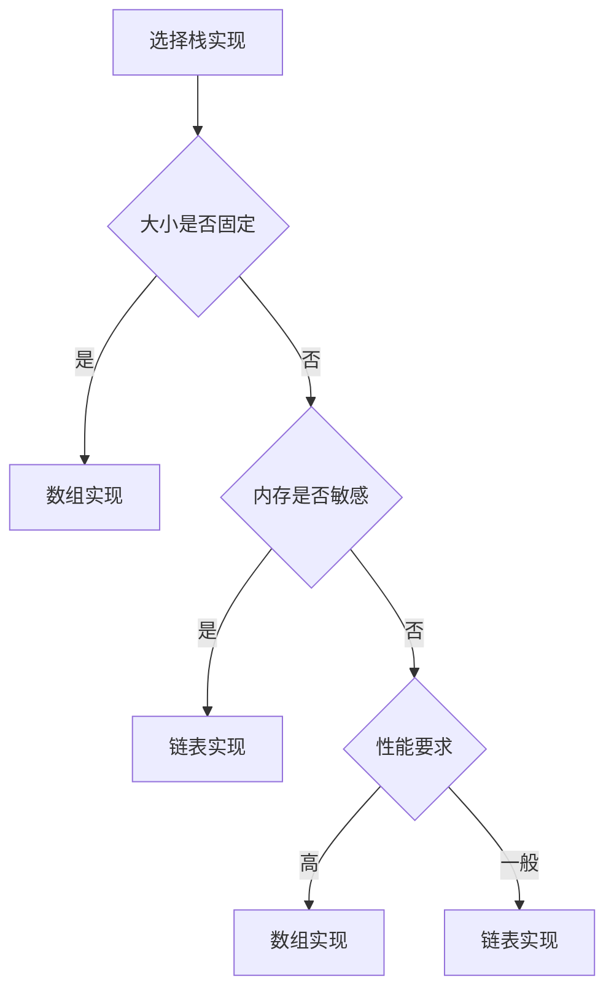

# 栈详解

## 🎯 核心概念

**栈**是一种后进先出(LIFO)的线性数据结构，只能在栈顶进行插入和删除操作。

## 🔍 基本定义

### 栈的特征
- **后进先出**：最后进入的元素最先出来
- **单端操作**：只能在栈顶进行操作
- **线性结构**：元素按顺序排列
- **动态大小**：大小可以动态变化

### 栈的基本操作
| 操作 | 时间复杂度 | 空间复杂度 | 说明 |
|------|------------|------------|------|
| 入栈(push) | O(1) | O(1) | 在栈顶插入元素 |
| 出栈(pop) | O(1) | O(1) | 删除栈顶元素 |
| 查看栈顶(peek) | O(1) | O(1) | 获取栈顶元素 |
| 判空(is_empty) | O(1) | O(1) | 检查栈是否为空 |

## 📊 栈实现

### 1. 数组实现栈
- **特点**：使用数组存储元素
- **优势**：实现简单，访问速度快
- **劣势**：大小固定，需要预分配空间

```python
class ArrayStack:
    def __init__(self, capacity=10):
        self.capacity = capacity
        self.data = [None] * capacity
        self.top = -1
    
    def push(self, item):
        """入栈 - O(1)"""
        if self.is_full():
            raise OverflowError("Stack is full")
        self.top += 1
        self.data[self.top] = item
    
    def pop(self):
        """出栈 - O(1)"""
        if self.is_empty():
            raise IndexError("Stack is empty")
        item = self.data[self.top]
        self.data[self.top] = None
        self.top -= 1
        return item
    
    def peek(self):
        """查看栈顶 - O(1)"""
        if self.is_empty():
            raise IndexError("Stack is empty")
        return self.data[self.top]
    
    def is_empty(self):
        """判空 - O(1)"""
        return self.top == -1
    
    def is_full(self):
        """判满 - O(1)"""
        return self.top == self.capacity - 1
    
    def size(self):
        """获取大小 - O(1)"""
        return self.top + 1
```

### 2. 链表实现栈
- **特点**：使用链表存储元素
- **优势**：动态大小，内存利用率高
- **劣势**：实现复杂，有指针开销

```python
class StackNode:
    def __init__(self, data):
        self.data = data
        self.next = None

class LinkedStack:
    def __init__(self):
        self.top = None
        self.size = 0
    
    def push(self, item):
        """入栈 - O(1)"""
        new_node = StackNode(item)
        new_node.next = self.top
        self.top = new_node
        self.size += 1
    
    def pop(self):
        """出栈 - O(1)"""
        if self.is_empty():
            raise IndexError("Stack is empty")
        item = self.top.data
        self.top = self.top.next
        self.size -= 1
        return item
    
    def peek(self):
        """查看栈顶 - O(1)"""
        if self.is_empty():
            raise IndexError("Stack is empty")
        return self.top.data
    
    def is_empty(self):
        """判空 - O(1)"""
        return self.top is None
    
    def size(self):
        """获取大小 - O(1)"""
        return self.size
```

### 3. 动态栈
- **特点**：大小可以动态调整
- **优势**：灵活性高，自动管理内存
- **劣势**：扩容时有性能开销

```python
class DynamicStack:
    def __init__(self, initial_capacity=10):
        self.capacity = initial_capacity
        self.data = [None] * self.capacity
        self.top = -1
    
    def push(self, item):
        """入栈 - O(1) 平均"""
        if self.is_full():
            self._resize()
        self.top += 1
        self.data[self.top] = item
    
    def pop(self):
        """出栈 - O(1)"""
        if self.is_empty():
            raise IndexError("Stack is empty")
        item = self.data[self.top]
        self.data[self.top] = None
        self.top -= 1
        return item
    
    def peek(self):
        """查看栈顶 - O(1)"""
        if self.is_empty():
            raise IndexError("Stack is empty")
        return self.data[self.top]
    
    def is_empty(self):
        """判空 - O(1)"""
        return self.top == -1
    
    def is_full(self):
        """判满 - O(1)"""
        return self.top == self.capacity - 1
    
    def _resize(self):
        """扩容 - O(n)"""
        new_capacity = self.capacity * 2
        new_data = [None] * new_capacity
        
        for i in range(self.top + 1):
            new_data[i] = self.data[i]
        
        self.data = new_data
        self.capacity = new_capacity
```

## 🎨 栈算法

### 1. 表达式求值
```python
def evaluate_postfix(expression):
    """后缀表达式求值 - O(n)"""
    stack = []
    operators = {'+', '-', '*', '/'}
    
    for token in expression.split():
        if token in operators:
            if len(stack) < 2:
                raise ValueError("Invalid expression")
            
            b = stack.pop()
            a = stack.pop()
            
            if token == '+':
                result = a + b
            elif token == '-':
                result = a - b
            elif token == '*':
                result = a * b
            elif token == '/':
                if b == 0:
                    raise ValueError("Division by zero")
                result = a / b
            
            stack.append(result)
        else:
            stack.append(float(token))
    
    if len(stack) != 1:
        raise ValueError("Invalid expression")
    
    return stack[0]

def infix_to_postfix(expression):
    """中缀转后缀 - O(n)"""
    precedence = {'+': 1, '-': 1, '*': 2, '/': 2, '^': 3}
    stack = []
    output = []
    
    for token in expression.split():
        if token.isdigit():
            output.append(token)
        elif token == '(':
            stack.append(token)
        elif token == ')':
            while stack and stack[-1] != '(':
                output.append(stack.pop())
            stack.pop()  # 移除 '('
        elif token in precedence:
            while (stack and stack[-1] != '(' and 
                   precedence.get(stack[-1], 0) >= precedence[token]):
                output.append(stack.pop())
            stack.append(token)
    
    while stack:
        output.append(stack.pop())
    
    return ' '.join(output)
```

### 2. 括号匹配
```python
def is_valid_parentheses(s):
    """括号匹配 - O(n)"""
    stack = []
    mapping = {')': '(', '}': '{', ']': '['}
    
    for char in s:
        if char in mapping:
            if not stack or stack.pop() != mapping[char]:
                return False
        else:
            stack.append(char)
    
    return not stack

def min_add_to_make_valid(s):
    """最少添加括号数 - O(n)"""
    stack = []
    
    for char in s:
        if char == '(':
            stack.append(char)
        elif char == ')':
            if stack and stack[-1] == '(':
                stack.pop()
            else:
                stack.append(char)
    
    return len(stack)
```

### 3. 单调栈
```python
def next_greater_element(nums):
    """下一个更大元素 - O(n)"""
    stack = []
    result = [-1] * len(nums)
    
    for i in range(len(nums)):
        while stack and nums[stack[-1]] < nums[i]:
            index = stack.pop()
            result[index] = nums[i]
        stack.append(i)
    
    return result

def largest_rectangle_area(heights):
    """最大矩形面积 - O(n)"""
    stack = []
    max_area = 0
    
    for i, h in enumerate(heights):
        while stack and heights[stack[-1]] > h:
            height = heights[stack.pop()]
            width = i if not stack else i - stack[-1] - 1
            max_area = max(max_area, height * width)
        stack.append(i)
    
    while stack:
        height = heights[stack.pop()]
        width = len(heights) if not stack else len(heights) - stack[-1] - 1
        max_area = max(max_area, height * width)
    
    return max_area
```

### 4. 栈排序
```python
def sort_stack(stack):
    """栈排序 - O(n²)"""
    temp_stack = []
    
    while stack:
        temp = stack.pop()
        
        while temp_stack and temp_stack[-1] > temp:
            stack.append(temp_stack.pop())
        
        temp_stack.append(temp)
    
    return temp_stack

def reverse_stack(stack):
    """反转栈 - O(n²)"""
    if not stack:
        return
    
    temp = stack.pop()
    reverse_stack(stack)
    insert_at_bottom(stack, temp)

def insert_at_bottom(stack, item):
    """在栈底插入元素 - O(n)"""
    if not stack:
        stack.append(item)
        return
    
    temp = stack.pop()
    insert_at_bottom(stack, item)
    stack.append(temp)
```

## 📈 栈性能分析

### 时间复杂度分析
| 操作 | 最好情况 | 平均情况 | 最坏情况 | 说明 |
|------|----------|----------|----------|------|
| 入栈 | O(1) | O(1) | O(n) | 数组实现vs动态扩容 |
| 出栈 | O(1) | O(1) | O(1) | 直接操作栈顶 |
| 查看栈顶 | O(1) | O(1) | O(1) | 直接访问 |
| 判空 | O(1) | O(1) | O(1) | 检查栈顶指针 |

### 空间复杂度分析
| 实现方式 | 空间复杂度 | 额外空间 | 说明 |
|----------|------------|----------|------|
| 数组实现 | O(n) | O(1) | 固定大小数组 |
| 链表实现 | O(n) | O(n) | 每个节点一个指针 |
| 动态实现 | O(n) | O(n) | 扩容时需要额外空间 |

## 🎯 栈应用

### 1. 基础应用
- **函数调用**：调用栈管理函数调用
- **表达式求值**：中缀转后缀，后缀求值
- **括号匹配**：检查括号是否匹配
- **撤销操作**：文本编辑器的撤销功能

### 2. 算法应用
- **深度优先搜索**：递归转迭代
- **回溯算法**：状态保存和恢复
- **单调栈**：解决区间最值问题
- **栈排序**：使用栈进行排序

### 3. 实际应用
- **浏览器历史**：前进后退功能
- **编译器**：语法分析
- **计算器**：表达式计算
- **内存管理**：栈内存分配

## 📊 栈选择指南

### 选择原则
| 需求 | 推荐实现 | 原因 |
|------|----------|------|
| 固定大小 | 数组实现 | 内存效率高 |
| 动态大小 | 链表实现 | 灵活性好 |
| 频繁操作 | 数组实现 | 访问速度快 |
| 内存敏感 | 链表实现 | 按需分配 |

### 性能考虑


## 🔗 相关概念

### 线性结构
- **关系**：栈是线性结构的一种
- **链接**：[[01-线性结构总览]]

### 复杂度分析
- **关系**：栈操作的复杂度分析
- **链接**：[[01-时间复杂度概念]]、[[02-空间复杂度概念]]

### 递归
- **关系**：栈是递归实现的基础
- **链接**：[[01-递归原理]]

## 📚 学习建议

### 费曼学习法
1. **选择概念**：栈
2. **教授他人**：解释栈特点
3. **回顾简化**：找出理解不足
4. **重新组织**：用更简单的方式表达

### 刻意练习
1. **实现练习**：实现各种栈操作
2. **算法练习**：在栈上实现算法
3. **应用练习**：解决实际问题
4. **优化练习**：优化栈操作性能

## 🔗 相关链接
- [[01-线性结构总览]] - 线性结构概述
- [[02-数组详解]] - 数组的详细实现
- [[03-链表详解]] - 链表的详细实现
- [[05-队列详解]] - 队列的详细实现

