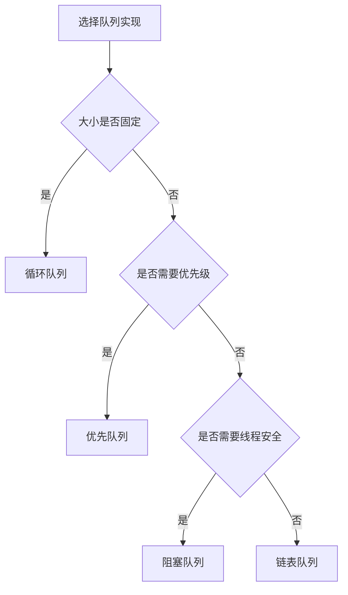

# 队列详解

## 🎯 核心概念

**队列**是一种先进先出(FIFO)的线性数据结构，只能在队尾插入元素，在队首删除元素。

## 🔍 基本定义

### 队列的特征
- **先进先出**：最先进入的元素最先出来
- **双端操作**：队尾插入，队首删除
- **线性结构**：元素按顺序排列
- **动态大小**：大小可以动态变化

### 队列的基本操作
| 操作 | 时间复杂度 | 空间复杂度 | 说明 |
|------|------------|------------|------|
| 入队(enqueue) | O(1) | O(1) | 在队尾插入元素 |
| 出队(dequeue) | O(1) | O(1) | 删除队首元素 |
| 查看队首(front) | O(1) | O(1) | 获取队首元素 |
| 判空(is_empty) | O(1) | O(1) | 检查队列是否为空 |

## 📊 队列实现

### 1. 数组实现队列
- **特点**：使用数组存储元素
- **优势**：实现简单，访问速度快
- **劣势**：大小固定，需要预分配空间

```python
class ArrayQueue:
    def __init__(self, capacity=10):
        self.capacity = capacity
        self.data = [None] * capacity
        self.front = 0
        self.rear = 0
        self.size = 0
    
    def enqueue(self, item):
        """入队 - O(1)"""
        if self.is_full():
            raise OverflowError("Queue is full")
        self.data[self.rear] = item
        self.rear = (self.rear + 1) % self.capacity
        self.size += 1
    
    def dequeue(self):
        """出队 - O(1)"""
        if self.is_empty():
            raise IndexError("Queue is empty")
        item = self.data[self.front]
        self.data[self.front] = None
        self.front = (self.front + 1) % self.capacity
        self.size -= 1
        return item
    
    def front(self):
        """查看队首 - O(1)"""
        if self.is_empty():
            raise IndexError("Queue is empty")
        return self.data[self.front]
    
    def is_empty(self):
        """判空 - O(1)"""
        return self.size == 0
    
    def is_full(self):
        """判满 - O(1)"""
        return self.size == self.capacity
    
    def size(self):
        """获取大小 - O(1)"""
        return self.size
```

### 2. 链表实现队列
- **特点**：使用链表存储元素
- **优势**：动态大小，内存利用率高
- **劣势**：实现复杂，有指针开销

```python
class QueueNode:
    def __init__(self, data):
        self.data = data
        self.next = None

class LinkedQueue:
    def __init__(self):
        self.front = None
        self.rear = None
        self.size = 0
    
    def enqueue(self, item):
        """入队 - O(1)"""
        new_node = QueueNode(item)
        if self.is_empty():
            self.front = self.rear = new_node
        else:
            self.rear.next = new_node
            self.rear = new_node
        self.size += 1
    
    def dequeue(self):
        """出队 - O(1)"""
        if self.is_empty():
            raise IndexError("Queue is empty")
        item = self.front.data
        self.front = self.front.next
        if self.front is None:
            self.rear = None
        self.size -= 1
        return item
    
    def front(self):
        """查看队首 - O(1)"""
        if self.is_empty():
            raise IndexError("Queue is empty")
        return self.front.data
    
    def is_empty(self):
        """判空 - O(1)"""
        return self.front is None
    
    def size(self):
        """获取大小 - O(1)"""
        return self.size
```

### 3. 循环队列
- **特点**：使用循环数组实现
- **优势**：空间利用率高，避免假溢出
- **劣势**：实现复杂，需要处理边界

```python
class CircularQueue:
    def __init__(self, capacity):
        self.capacity = capacity
        self.data = [None] * capacity
        self.front = 0
        self.rear = 0
        self.count = 0
    
    def enqueue(self, item):
        """入队 - O(1)"""
        if self.is_full():
            raise OverflowError("Queue is full")
        self.data[self.rear] = item
        self.rear = (self.rear + 1) % self.capacity
        self.count += 1
    
    def dequeue(self):
        """出队 - O(1)"""
        if self.is_empty():
            raise IndexError("Queue is empty")
        item = self.data[self.front]
        self.data[self.front] = None
        self.front = (self.front + 1) % self.capacity
        self.count -= 1
        return item
    
    def front(self):
        """查看队首 - O(1)"""
        if self.is_empty():
            raise IndexError("Queue is empty")
        return self.data[self.front]
    
    def rear(self):
        """查看队尾 - O(1)"""
        if self.is_empty():
            raise IndexError("Queue is empty")
        return self.data[(self.rear - 1 + self.capacity) % self.capacity]
    
    def is_empty(self):
        """判空 - O(1)"""
        return self.count == 0
    
    def is_full(self):
        """判满 - O(1)"""
        return self.count == self.capacity
    
    def size(self):
        """获取大小 - O(1)"""
        return self.count
```

## 🎨 队列变种

### 1. 双端队列
- **特点**：两端都可以插入删除
- **操作**：前端/后端插入删除
- **应用**：滑动窗口、回文检查

```python
class Deque:
    def __init__(self):
        self.data = []
    
    def add_front(self, item):
        """前端插入 - O(1)"""
        self.data.insert(0, item)
    
    def add_rear(self, item):
        """后端插入 - O(1)"""
        self.data.append(item)
    
    def remove_front(self):
        """前端删除 - O(1)"""
        if self.is_empty():
            raise IndexError("Deque is empty")
        return self.data.pop(0)
    
    def remove_rear(self):
        """后端删除 - O(1)"""
        if self.is_empty():
            raise IndexError("Deque is empty")
        return self.data.pop()
    
    def peek_front(self):
        """查看前端 - O(1)"""
        if self.is_empty():
            raise IndexError("Deque is empty")
        return self.data[0]
    
    def peek_rear(self):
        """查看后端 - O(1)"""
        if self.is_empty():
            raise IndexError("Deque is empty")
        return self.data[-1]
    
    def is_empty(self):
        """判空 - O(1)"""
        return len(self.data) == 0
    
    def size(self):
        """获取大小 - O(1)"""
        return len(self.data)
```

### 2. 优先队列
- **特点**：按优先级排序
- **实现**：堆、有序数组
- **应用**：任务调度、最短路径

```python
import heapq

class PriorityQueue:
    def __init__(self):
        self.heap = []
        self.index = 0
    
    def enqueue(self, item, priority):
        """入队 - O(log n)"""
        heapq.heappush(self.heap, (priority, self.index, item))
        self.index += 1
    
    def dequeue(self):
        """出队 - O(log n)"""
        if self.is_empty():
            raise IndexError("Priority queue is empty")
        priority, index, item = heapq.heappop(self.heap)
        return item
    
    def peek(self):
        """查看队首 - O(1)"""
        if self.is_empty():
            raise IndexError("Priority queue is empty")
        priority, index, item = self.heap[0]
        return item
    
    def is_empty(self):
        """判空 - O(1)"""
        return len(self.heap) == 0
    
    def size(self):
        """获取大小 - O(1)"""
        return len(self.heap)
```

### 3. 阻塞队列
- **特点**：支持阻塞操作
- **实现**：线程同步
- **应用**：生产者消费者模式

```python
import threading
import time

class BlockingQueue:
    def __init__(self, capacity):
        self.capacity = capacity
        self.data = []
        self.lock = threading.Lock()
        self.not_empty = threading.Condition(self.lock)
        self.not_full = threading.Condition(self.lock)
    
    def enqueue(self, item, timeout=None):
        """入队 - 阻塞"""
        with self.not_full:
            if timeout is None:
                while len(self.data) >= self.capacity:
                    self.not_full.wait()
            else:
                if not self.not_full.wait_for(
                    lambda: len(self.data) < self.capacity, timeout):
                    raise TimeoutError("Enqueue timeout")
            
            self.data.append(item)
            self.not_empty.notify()
    
    def dequeue(self, timeout=None):
        """出队 - 阻塞"""
        with self.not_empty:
            if timeout is None:
                while not self.data:
                    self.not_empty.wait()
            else:
                if not self.not_empty.wait_for(
                    lambda: len(self.data) > 0, timeout):
                    raise TimeoutError("Dequeue timeout")
            
            item = self.data.pop(0)
            self.not_full.notify()
            return item
    
    def is_empty(self):
        """判空 - O(1)"""
        with self.lock:
            return len(self.data) == 0
    
    def is_full(self):
        """判满 - O(1)"""
        with self.lock:
            return len(self.data) >= self.capacity
```

## 🔍 队列算法

### 1. 广度优先搜索
```python
def bfs(graph, start):
    """广度优先搜索 - O(V + E)"""
    visited = set()
    queue = [start]
    visited.add(start)
    
    while queue:
        vertex = queue.pop(0)
        print(vertex)
        
        for neighbor in graph[vertex]:
            if neighbor not in visited:
                visited.add(neighbor)
                queue.append(neighbor)
    
    return visited

def bfs_level_order(root):
    """二叉树层序遍历 - O(n)"""
    if not root:
        return []
    
    result = []
    queue = [root]
    
    while queue:
        level_size = len(queue)
        level = []
        
        for _ in range(level_size):
            node = queue.pop(0)
            level.append(node.val)
            
            if node.left:
                queue.append(node.left)
            if node.right:
                queue.append(node.right)
        
        result.append(level)
    
    return result
```

### 2. 滑动窗口
```python
def max_sliding_window(nums, k):
    """滑动窗口最大值 - O(n)"""
    if not nums or k == 0:
        return []
    
    deque = []
    result = []
    
    for i in range(len(nums)):
        # 移除超出窗口的元素
        while deque and deque[0] <= i - k:
            deque.pop(0)
        
        # 移除比当前元素小的元素
        while deque and nums[deque[-1]] < nums[i]:
            deque.pop()
        
        deque.append(i)
        
        # 窗口形成后记录最大值
        if i >= k - 1:
            result.append(nums[deque[0]])
    
    return result

def min_window_substring(s, t):
    """最小覆盖子串 - O(n)"""
    if not s or not t:
        return ""
    
    need = {}
    for char in t:
        need[char] = need.get(char, 0) + 1
    
    left = 0
    valid = 0
    start = 0
    length = float('inf')
    
    window = {}
    
    for right in range(len(s)):
        c = s[right]
        if c in need:
            window[c] = window.get(c, 0) + 1
            if window[c] == need[c]:
                valid += 1
        
        while valid == len(need):
            if right - left + 1 < length:
                start = left
                length = right - left + 1
            
            d = s[left]
            left += 1
            if d in need:
                if window[d] == need[d]:
                    valid -= 1
                window[d] -= 1
    
    return s[start:start + length] if length != float('inf') else ""
```

### 3. 任务调度
```python
def task_scheduler(tasks, n):
    """任务调度 - O(n)"""
    if n == 0:
        return len(tasks)
    
    task_count = {}
    for task in tasks:
        task_count[task] = task_count.get(task, 0) + 1
    
    max_count = max(task_count.values())
    max_tasks = sum(1 for count in task_count.values() if count == max_count)
    
    return max(len(tasks), (max_count - 1) * (n + 1) + max_tasks)

def least_interval(tasks, n):
    """最少间隔时间 - O(n)"""
    if n == 0:
        return len(tasks)
    
    task_count = {}
    for task in tasks:
        task_count[task] = task_count.get(task, 0) + 1
    
    max_count = max(task_count.values())
    max_tasks = sum(1 for count in task_count.values() if count == max_count)
    
    return max(len(tasks), (max_count - 1) * (n + 1) + max_tasks)
```

## 📈 队列性能分析

### 时间复杂度分析
| 操作 | 最好情况 | 平均情况 | 最坏情况 | 说明 |
|------|----------|----------|----------|------|
| 入队 | O(1) | O(1) | O(1) | 直接操作队尾 |
| 出队 | O(1) | O(1) | O(1) | 直接操作队首 |
| 查看队首 | O(1) | O(1) | O(1) | 直接访问 |
| 判空 | O(1) | O(1) | O(1) | 检查大小 |

### 空间复杂度分析
| 实现方式 | 空间复杂度 | 额外空间 | 说明 |
|----------|------------|----------|------|
| 数组实现 | O(n) | O(1) | 固定大小数组 |
| 链表实现 | O(n) | O(n) | 每个节点一个指针 |
| 循环实现 | O(n) | O(1) | 循环数组 |

## 🎯 队列应用

### 1. 基础应用
- **任务调度**：操作系统进程调度
- **广度优先搜索**：图遍历
- **缓冲区**：生产者消费者模式
- **打印队列**：打印任务管理

### 2. 算法应用
- **BFS算法**：图的最短路径
- **层序遍历**：二叉树的层序遍历
- **滑动窗口**：数组子数组问题
- **任务调度**：CPU任务调度

### 3. 实际应用
- **消息队列**：分布式系统通信
- **网络请求**：HTTP请求队列
- **游戏开发**：事件队列
- **数据库**：事务队列

## 📊 队列选择指南

### 选择原则
| 需求 | 推荐实现 | 原因 |
|------|----------|------|
| 固定大小 | 循环队列 | 空间利用率高 |
| 动态大小 | 链表队列 | 灵活性好 |
| 优先级处理 | 优先队列 | 自动排序 |
| 线程安全 | 阻塞队列 | 支持同步 |

### 性能考虑


## 🔗 相关概念

### 线性结构
- **关系**：队列是线性结构的一种
- **链接**：[[01-线性结构总览]]

### 复杂度分析
- **关系**：队列操作的复杂度分析
- **链接**：[[01-时间复杂度概念]]、[[02-空间复杂度概念]]

### 栈
- **关系**：队列与栈的对比
- **链接**：[[04-栈详解]]

## 📚 学习建议

### 费曼学习法
1. **选择概念**：队列
2. **教授他人**：解释队列特点
3. **回顾简化**：找出理解不足
4. **重新组织**：用更简单的方式表达

### 刻意练习
1. **实现练习**：实现各种队列操作
2. **算法练习**：在队列上实现算法
3. **应用练习**：解决实际问题
4. **优化练习**：优化队列操作性能

## 🔗 相关链接
- [[01-线性结构总览]] - 线性结构概述
- [[02-数组详解]] - 数组的详细实现
- [[03-链表详解]] - 链表的详细实现
- [[04-栈详解]] - 栈的详细实现

