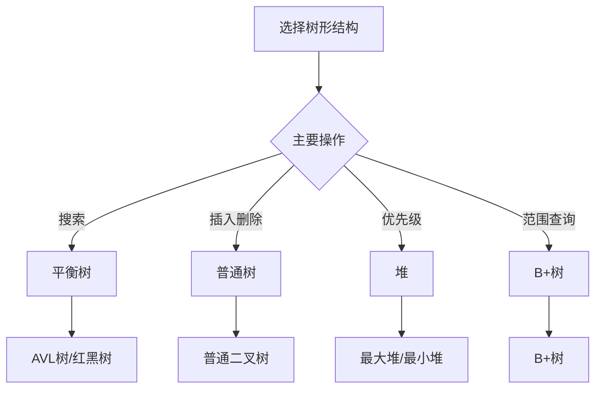

# 树形结构总览

## 🎯 核心概念

**树形结构**是一种层次化的非线性数据结构，由节点和边组成，具有层次关系和分支结构。

## 🔍 基本定义

### 树的基本概念
- **节点(Node)**：树中的基本单位，包含数据和指向子节点的指针
- **根节点(Root)**：树的顶层节点，没有父节点
- **叶子节点(Leaf)**：没有子节点的节点
- **边(Edge)**：连接两个节点的线段
- **路径(Path)**：从一个节点到另一个节点的节点序列
- **深度(Depth)**：从根节点到该节点的路径长度
- **高度(Height)**：树中节点的最大深度

### 树的基本性质
| 性质 | 描述 | 示例 |
|------|------|------|
| 层次性 | 节点按层次排列 | 根节点在第0层 |
| 唯一性 | 每个节点只有一个父节点 | 除根节点外 |
| 连通性 | 任意两个节点间有唯一路径 | 树是连通的 |
| 无环性 | 不存在环路 | 树是无环图 |

## 📊 树形结构分类

### 1. 二叉树 (Binary Tree)
- **特点**：每个节点最多有两个子节点
- **分类**：左子树、右子树
- **应用**：表达式树、决策树

```python
class TreeNode:
    def __init__(self, val=0, left=None, right=None):
        self.val = val
        self.left = left
        self.right = right

class BinaryTree:
    def __init__(self):
        self.root = None
    
    def insert(self, val):
        """插入节点 - O(log n)"""
        if not self.root:
            self.root = TreeNode(val)
            return
        
        self._insert_recursive(self.root, val)
    
    def _insert_recursive(self, node, val):
        """递归插入"""
        if val < node.val:
            if node.left:
                self._insert_recursive(node.left, val)
            else:
                node.left = TreeNode(val)
        else:
            if node.right:
                self._insert_recursive(node.right, val)
            else:
                node.right = TreeNode(val)
    
    def search(self, val):
        """搜索节点 - O(log n)"""
        return self._search_recursive(self.root, val)
    
    def _search_recursive(self, node, val):
        """递归搜索"""
        if not node or node.val == val:
            return node
        
        if val < node.val:
            return self._search_recursive(node.left, val)
        else:
            return self._search_recursive(node.right, val)
```

### 2. 二叉搜索树 (BST)
- **特点**：左子树所有节点值小于根节点，右子树所有节点值大于根节点
- **优势**：搜索、插入、删除效率高
- **劣势**：可能退化为链表

```python
class BST:
    def __init__(self):
        self.root = None
    
    def insert(self, val):
        """插入节点 - O(log n)"""
        self.root = self._insert_recursive(self.root, val)
    
    def _insert_recursive(self, node, val):
        """递归插入"""
        if not node:
            return TreeNode(val)
        
        if val < node.val:
            node.left = self._insert_recursive(node.left, val)
        elif val > node.val:
            node.right = self._insert_recursive(node.right, val)
        
        return node
    
    def delete(self, val):
        """删除节点 - O(log n)"""
        self.root = self._delete_recursive(self.root, val)
    
    def _delete_recursive(self, node, val):
        """递归删除"""
        if not node:
            return node
        
        if val < node.val:
            node.left = self._delete_recursive(node.left, val)
        elif val > node.val:
            node.right = self._delete_recursive(node.right, val)
        else:
            # 找到要删除的节点
            if not node.left:
                return node.right
            elif not node.right:
                return node.left
            
            # 有两个子节点，找到右子树的最小值
            min_node = self._find_min(node.right)
            node.val = min_node.val
            node.right = self._delete_recursive(node.right, min_node.val)
        
        return node
    
    def _find_min(self, node):
        """找到最小值节点"""
        while node.left:
            node = node.left
        return node
```

### 3. 平衡二叉树 (AVL Tree)
- **特点**：任意节点的左右子树高度差不超过1
- **优势**：保证搜索效率
- **劣势**：插入删除复杂

```python
class AVLNode:
    def __init__(self, val):
        self.val = val
        self.left = None
        self.right = None
        self.height = 1

class AVLTree:
    def __init__(self):
        self.root = None
    
    def get_height(self, node):
        """获取节点高度"""
        if not node:
            return 0
        return node.height
    
    def get_balance(self, node):
        """获取平衡因子"""
        if not node:
            return 0
        return self.get_height(node.left) - self.get_height(node.right)
    
    def rotate_right(self, y):
        """右旋转"""
        x = y.left
        T2 = x.right
        
        x.right = y
        y.left = T2
        
        y.height = 1 + max(self.get_height(y.left), self.get_height(y.right))
        x.height = 1 + max(self.get_height(x.left), self.get_height(x.right))
        
        return x
    
    def rotate_left(self, x):
        """左旋转"""
        y = x.right
        T2 = y.left
        
        y.left = x
        x.right = T2
        
        x.height = 1 + max(self.get_height(x.left), self.get_height(x.right))
        y.height = 1 + max(self.get_height(y.left), self.get_height(y.right))
        
        return y
    
    def insert(self, val):
        """插入节点 - O(log n)"""
        self.root = self._insert_recursive(self.root, val)
    
    def _insert_recursive(self, node, val):
        """递归插入"""
        if not node:
            return AVLNode(val)
        
        if val < node.val:
            node.left = self._insert_recursive(node.left, val)
        elif val > node.val:
            node.right = self._insert_recursive(node.right, val)
        else:
            return node  # 不允许重复值
        
        node.height = 1 + max(self.get_height(node.left), self.get_height(node.right))
        
        balance = self.get_balance(node)
        
        # 左左情况
        if balance > 1 and val < node.left.val:
            return self.rotate_right(node)
        
        # 右右情况
        if balance < -1 and val > node.right.val:
            return self.rotate_left(node)
        
        # 左右情况
        if balance > 1 and val > node.left.val:
            node.left = self.rotate_left(node.left)
            return self.rotate_right(node)
        
        # 右左情况
        if balance < -1 and val < node.right.val:
            node.right = self.rotate_right(node.right)
            return self.rotate_left(node)
        
        return node
```

### 4. 堆 (Heap)
- **特点**：完全二叉树，父节点值大于（或小于）子节点值
- **分类**：最大堆、最小堆
- **应用**：优先队列、堆排序

```python
class MinHeap:
    def __init__(self):
        self.heap = []
    
    def parent(self, i):
        """获取父节点索引"""
        return (i - 1) // 2
    
    def left_child(self, i):
        """获取左子节点索引"""
        return 2 * i + 1
    
    def right_child(self, i):
        """获取右子节点索引"""
        return 2 * i + 2
    
    def insert(self, val):
        """插入元素 - O(log n)"""
        self.heap.append(val)
        self._heapify_up(len(self.heap) - 1)
    
    def extract_min(self):
        """提取最小值 - O(log n)"""
        if not self.heap:
            return None
        
        if len(self.heap) == 1:
            return self.heap.pop()
        
        min_val = self.heap[0]
        self.heap[0] = self.heap.pop()
        self._heapify_down(0)
        
        return min_val
    
    def _heapify_up(self, index):
        """向上调整堆"""
        while index > 0:
            parent_index = self.parent(index)
            if self.heap[index] >= self.heap[parent_index]:
                break
            
            self.heap[index], self.heap[parent_index] = self.heap[parent_index], self.heap[index]
            index = parent_index
    
    def _heapify_down(self, index):
        """向下调整堆"""
        while True:
            smallest = index
            left = self.left_child(index)
            right = self.right_child(index)
            
            if left < len(self.heap) and self.heap[left] < self.heap[smallest]:
                smallest = left
            
            if right < len(self.heap) and self.heap[right] < self.heap[smallest]:
                smallest = right
            
            if smallest == index:
                break
            
            self.heap[index], self.heap[smallest] = self.heap[smallest], self.heap[index]
            index = smallest
```

## 🎨 树形结构算法

### 1. 树的遍历
```python
def preorder_traversal(root):
    """前序遍历 - O(n)"""
    if not root:
        return []
    
    result = [root.val]
    result.extend(preorder_traversal(root.left))
    result.extend(preorder_traversal(root.right))
    
    return result

def inorder_traversal(root):
    """中序遍历 - O(n)"""
    if not root:
        return []
    
    result = []
    result.extend(inorder_traversal(root.left))
    result.append(root.val)
    result.extend(inorder_traversal(root.right))
    
    return result

def postorder_traversal(root):
    """后序遍历 - O(n)"""
    if not root:
        return []
    
    result = []
    result.extend(postorder_traversal(root.left))
    result.extend(postorder_traversal(root.right))
    result.append(root.val)
    
    return result

def level_order_traversal(root):
    """层序遍历 - O(n)"""
    if not root:
        return []
    
    result = []
    queue = [root]
    
    while queue:
        level_size = len(queue)
        level = []
        
        for _ in range(level_size):
            node = queue.pop(0)
            level.append(node.val)
            
            if node.left:
                queue.append(node.left)
            if node.right:
                queue.append(node.right)
        
        result.append(level)
    
    return result
```

### 2. 树的高度和深度
```python
def max_depth(root):
    """计算树的最大深度 - O(n)"""
    if not root:
        return 0
    
    left_depth = max_depth(root.left)
    right_depth = max_depth(root.right)
    
    return 1 + max(left_depth, right_depth)

def min_depth(root):
    """计算树的最小深度 - O(n)"""
    if not root:
        return 0
    
    if not root.left and not root.right:
        return 1
    
    if not root.left:
        return 1 + min_depth(root.right)
    
    if not root.right:
        return 1 + min_depth(root.left)
    
    return 1 + min(min_depth(root.left), min_depth(root.right))

def is_balanced(root):
    """判断树是否平衡 - O(n)"""
    def check_height(node):
        if not node:
            return 0
        
        left_height = check_height(node.left)
        if left_height == -1:
            return -1
        
        right_height = check_height(node.right)
        if right_height == -1:
            return -1
        
        if abs(left_height - right_height) > 1:
            return -1
        
        return 1 + max(left_height, right_height)
    
    return check_height(root) != -1
```

### 3. 树的路径问题
```python
def has_path_sum(root, target_sum):
    """路径和 - O(n)"""
    if not root:
        return False
    
    if not root.left and not root.right:
        return root.val == target_sum
    
    remaining_sum = target_sum - root.val
    return (has_path_sum(root.left, remaining_sum) or 
            has_path_sum(root.right, remaining_sum))

def path_sum_ii(root, target_sum):
    """所有路径和 - O(n)"""
    result = []
    
    def dfs(node, path, remaining):
        if not node:
            return
        
        path.append(node.val)
        
        if not node.left and not node.right and remaining == node.val:
            result.append(path[:])
        else:
            dfs(node.left, path, remaining - node.val)
            dfs(node.right, path, remaining - node.val)
        
        path.pop()
    
    dfs(root, [], target_sum)
    return result

def max_path_sum(root):
    """最大路径和 - O(n)"""
    max_sum = float('-inf')
    
    def max_gain(node):
        nonlocal max_sum
        
        if not node:
            return 0
        
        left_gain = max(max_gain(node.left), 0)
        right_gain = max(max_gain(node.right), 0)
        
        current_max = node.val + left_gain + right_gain
        max_sum = max(max_sum, current_max)
        
        return node.val + max(left_gain, right_gain)
    
    max_gain(root)
    return max_sum
```

## 📈 树形结构性能分析

### 时间复杂度分析
| 操作 | 普通树 | 二叉搜索树 | 平衡树 | 堆 |
|------|--------|------------|--------|-----|
| 搜索 | O(n) | O(log n) | O(log n) | O(n) |
| 插入 | O(1) | O(log n) | O(log n) | O(log n) |
| 删除 | O(1) | O(log n) | O(log n) | O(log n) |
| 遍历 | O(n) | O(n) | O(n) | O(n) |

### 空间复杂度分析
| 结构 | 空间复杂度 | 额外空间 | 说明 |
|------|------------|----------|------|
| 普通树 | O(n) | O(n) | 每个节点存储指针 |
| 二叉搜索树 | O(n) | O(n) | 每个节点两个指针 |
| 平衡树 | O(n) | O(n) | 额外存储高度信息 |
| 堆 | O(n) | O(1) | 数组实现 |

## 🎯 树形结构应用

### 1. 基础应用
- **文件系统**：目录结构
- **数据库索引**：B+树索引
- **编译器**：语法分析树
- **决策树**：机器学习

### 2. 算法应用
- **搜索算法**：二叉搜索树
- **排序算法**：堆排序
- **图算法**：最小生成树
- **动态规划**：树形DP

### 3. 实际应用
- **操作系统**：进程树
- **网络协议**：路由树
- **游戏开发**：场景树
- **人工智能**：决策树

## 📊 树形结构选择指南

### 选择原则
| 需求 | 推荐结构 | 原因 |
|------|----------|------|
| 快速搜索 | 平衡树 | O(log n)搜索 |
| 快速插入删除 | 普通树 | O(1)操作 |
| 优先级处理 | 堆 | 自动排序 |
| 范围查询 | B+树 | 支持范围操作 |

### 性能考虑


## 🔗 相关概念

### 线性结构
- **关系**：树是线性结构的扩展
- **链接**：[[01-线性结构总览]]

### 复杂度分析
- **关系**：树操作的复杂度分析
- **链接**：[[01-时间复杂度概念]]、[[02-空间复杂度概念]]

### 具体实现
- **关系**：树形结构的具体实现
- **链接**：[[07-二叉树详解]]、[[08-堆详解]]、[[09-平衡树简介]]

## 📚 学习建议

### 费曼学习法
1. **选择概念**：树形结构
2. **教授他人**：解释树的特点
3. **回顾简化**：找出理解不足
4. **重新组织**：用更简单的方式表达

### 刻意练习
1. **实现练习**：实现各种树操作
2. **算法练习**：在树上实现算法
3. **应用练习**：解决实际问题
4. **优化练习**：优化树操作性能

## 🔗 相关链接
- [[01-线性结构总览]] - 线性结构概述
- [[07-二叉树详解]] - 二叉树的详细实现
- [[08-堆详解]] - 堆的详细实现
- [[09-平衡树简介]] - 平衡树的详细实现

