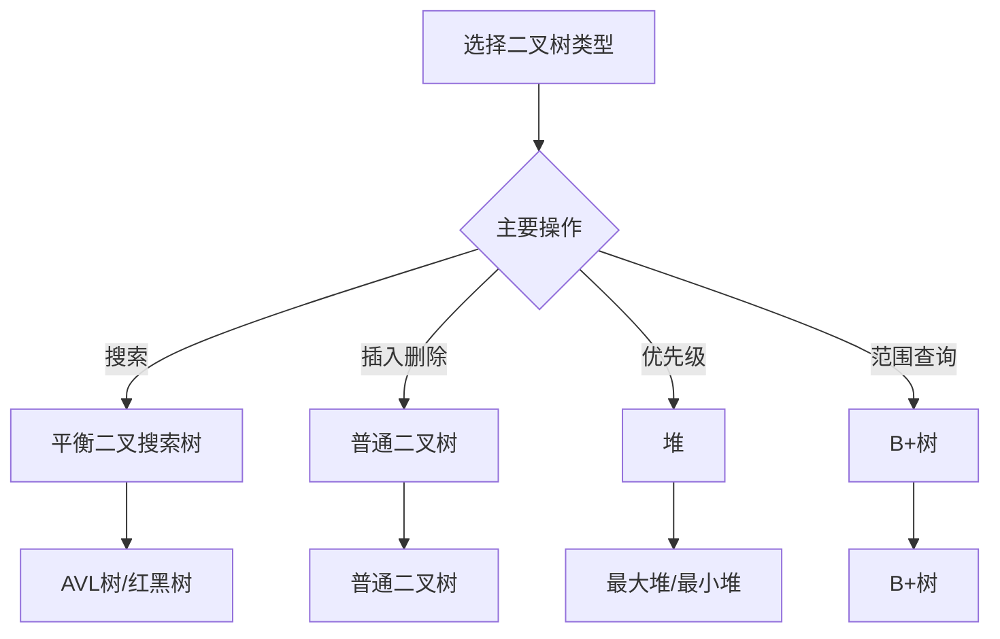

# 二叉树详解

## 🎯 核心概念

**二叉树**是每个节点最多有两个子节点的树形数据结构，是最重要的树形结构之一。

## 🔍 基本定义

### 二叉树的基本概念
- **根节点**：树的顶层节点
- **左子树**：根节点的左子节点及其子树
- **右子树**：根节点的右子节点及其子树
- **叶子节点**：没有子节点的节点
- **内部节点**：有子节点的节点
- **深度**：从根节点到该节点的路径长度
- **高度**：树中节点的最大深度

### 二叉树的特殊类型
| 类型 | 特点 | 应用 |
|------|------|------|
| 满二叉树 | 每个节点都有0或2个子节点 | 完全二叉树的基础 |
| 完全二叉树 | 除最后一层外都是满的，最后一层从左到右填充 | 堆的基础 |
| 平衡二叉树 | 任意节点的左右子树高度差不超过1 | 保证搜索效率 |
| 二叉搜索树 | 左子树所有节点值小于根节点，右子树所有节点值大于根节点 | 快速搜索 |

## 📊 二叉树实现

### 1. 基本节点结构
```python
class TreeNode:
    def __init__(self, val=0, left=None, right=None):
        self.val = val
        self.left = left
        self.right = right
    
    def __str__(self):
        return str(self.val)
```

### 2. 二叉树基本操作
```python
class BinaryTree:
    def __init__(self):
        self.root = None
    
    def insert(self, val):
        """插入节点 - O(log n)"""
        if not self.root:
            self.root = TreeNode(val)
            return
        
        self._insert_recursive(self.root, val)
    
    def _insert_recursive(self, node, val):
        """递归插入"""
        if val < node.val:
            if node.left:
                self._insert_recursive(node.left, val)
            else:
                node.left = TreeNode(val)
        else:
            if node.right:
                self._insert_recursive(node.right, val)
            else:
                node.right = TreeNode(val)
    
    def search(self, val):
        """搜索节点 - O(log n)"""
        return self._search_recursive(self.root, val)
    
    def _search_recursive(self, node, val):
        """递归搜索"""
        if not node or node.val == val:
            return node
        
        if val < node.val:
            return self._search_recursive(node.left, val)
        else:
            return self._search_recursive(node.right, val)
    
    def delete(self, val):
        """删除节点 - O(log n)"""
        self.root = self._delete_recursive(self.root, val)
    
    def _delete_recursive(self, node, val):
        """递归删除"""
        if not node:
            return node
        
        if val < node.val:
            node.left = self._delete_recursive(node.left, val)
        elif val > node.val:
            node.right = self._delete_recursive(node.right, val)
        else:
            # 找到要删除的节点
            if not node.left:
                return node.right
            elif not node.right:
                return node.left
            
            # 有两个子节点，找到右子树的最小值
            min_node = self._find_min(node.right)
            node.val = min_node.val
            node.right = self._delete_recursive(node.right, min_node.val)
        
        return node
    
    def _find_min(self, node):
        """找到最小值节点"""
        while node.left:
            node = node.left
        return node
```

## 🎨 二叉树遍历

### 1. 深度优先遍历
```python
def preorder_traversal(root):
    """前序遍历：根-左-右 - O(n)"""
    if not root:
        return []
    
    result = [root.val]
    result.extend(preorder_traversal(root.left))
    result.extend(preorder_traversal(root.right))
    
    return result

def inorder_traversal(root):
    """中序遍历：左-根-右 - O(n)"""
    if not root:
        return []
    
    result = []
    result.extend(inorder_traversal(root.left))
    result.append(root.val)
    result.extend(inorder_traversal(root.right))
    
    return result

def postorder_traversal(root):
    """后序遍历：左-右-根 - O(n)"""
    if not root:
        return []
    
    result = []
    result.extend(postorder_traversal(root.left))
    result.extend(postorder_traversal(root.right))
    result.append(root.val)
    
    return result

def preorder_iterative(root):
    """前序遍历迭代版本 - O(n)"""
    if not root:
        return []
    
    result = []
    stack = [root]
    
    while stack:
        node = stack.pop()
        result.append(node.val)
        
        if node.right:
            stack.append(node.right)
        if node.left:
            stack.append(node.left)
    
    return result

def inorder_iterative(root):
    """中序遍历迭代版本 - O(n)"""
    if not root:
        return []
    
    result = []
    stack = []
    current = root
    
    while stack or current:
        while current:
            stack.append(current)
            current = current.left
        
        current = stack.pop()
        result.append(current.val)
        current = current.right
    
    return result

def postorder_iterative(root):
    """后序遍历迭代版本 - O(n)"""
    if not root:
        return []
    
    result = []
    stack = []
    last_visited = None
    current = root
    
    while stack or current:
        if current:
            stack.append(current)
            current = current.left
        else:
            peek_node = stack[-1]
            if peek_node.right and last_visited != peek_node.right:
                current = peek_node.right
            else:
                result.append(peek_node.val)
                last_visited = stack.pop()
    
    return result
```

### 2. 广度优先遍历
```python
def level_order_traversal(root):
    """层序遍历 - O(n)"""
    if not root:
        return []
    
    result = []
    queue = [root]
    
    while queue:
        level_size = len(queue)
        level = []
        
        for _ in range(level_size):
            node = queue.pop(0)
            level.append(node.val)
            
            if node.left:
                queue.append(node.left)
            if node.right:
                queue.append(node.right)
        
        result.append(level)
    
    return result

def level_order_zigzag(root):
    """锯齿形层序遍历 - O(n)"""
    if not root:
        return []
    
    result = []
    queue = [root]
    left_to_right = True
    
    while queue:
        level_size = len(queue)
        level = []
        
        for _ in range(level_size):
            node = queue.pop(0)
            
            if left_to_right:
                level.append(node.val)
            else:
                level.insert(0, node.val)
            
            if node.left:
                queue.append(node.left)
            if node.right:
                queue.append(node.right)
        
        result.append(level)
        left_to_right = not left_to_right
    
    return result
```

## 🔍 二叉树算法

### 1. 树的属性
```python
def max_depth(root):
    """计算树的最大深度 - O(n)"""
    if not root:
        return 0
    
    left_depth = max_depth(root.left)
    right_depth = max_depth(root.right)
    
    return 1 + max(left_depth, right_depth)

def min_depth(root):
    """计算树的最小深度 - O(n)"""
    if not root:
        return 0
    
    if not root.left and not root.right:
        return 1
    
    if not root.left:
        return 1 + min_depth(root.right)
    
    if not root.right:
        return 1 + min_depth(root.left)
    
    return 1 + min(min_depth(root.left), min_depth(root.right))

def count_nodes(root):
    """计算节点数量 - O(n)"""
    if not root:
        return 0
    
    return 1 + count_nodes(root.left) + count_nodes(root.right)

def count_leaves(root):
    """计算叶子节点数量 - O(n)"""
    if not root:
        return 0
    
    if not root.left and not root.right:
        return 1
    
    return count_leaves(root.left) + count_leaves(root.right)

def is_balanced(root):
    """判断树是否平衡 - O(n)"""
    def check_height(node):
        if not node:
            return 0
        
        left_height = check_height(node.left)
        if left_height == -1:
            return -1
        
        right_height = check_height(node.right)
        if right_height == -1:
            return -1
        
        if abs(left_height - right_height) > 1:
            return -1
        
        return 1 + max(left_height, right_height)
    
    return check_height(root) != -1
```

### 2. 树的路径问题
```python
def has_path_sum(root, target_sum):
    """路径和 - O(n)"""
    if not root:
        return False
    
    if not root.left and not root.right:
        return root.val == target_sum
    
    remaining_sum = target_sum - root.val
    return (has_path_sum(root.left, remaining_sum) or 
            has_path_sum(root.right, remaining_sum))

def path_sum_ii(root, target_sum):
    """所有路径和 - O(n)"""
    result = []
    
    def dfs(node, path, remaining):
        if not node:
            return
        
        path.append(node.val)
        
        if not node.left and not node.right and remaining == node.val:
            result.append(path[:])
        else:
            dfs(node.left, path, remaining - node.val)
            dfs(node.right, path, remaining - node.val)
        
        path.pop()
    
    dfs(root, [], target_sum)
    return result

def max_path_sum(root):
    """最大路径和 - O(n)"""
    max_sum = float('-inf')
    
    def max_gain(node):
        nonlocal max_sum
        
        if not node:
            return 0
        
        left_gain = max(max_gain(node.left), 0)
        right_gain = max(max_gain(node.right), 0)
        
        current_max = node.val + left_gain + right_gain
        max_sum = max(max_sum, current_max)
        
        return node.val + max(left_gain, right_gain)
    
    max_gain(root)
    return max_sum

def longest_univalue_path(root):
    """最长同值路径 - O(n)"""
    max_length = 0
    
    def dfs(node):
        nonlocal max_length
        
        if not node:
            return 0
        
        left_length = dfs(node.left)
        right_length = dfs(node.right)
        
        left_arrow = right_arrow = 0
        
        if node.left and node.left.val == node.val:
            left_arrow = left_length + 1
        
        if node.right and node.right.val == node.val:
            right_arrow = right_length + 1
        
        max_length = max(max_length, left_arrow + right_arrow)
        
        return max(left_arrow, right_arrow)
    
    dfs(root)
    return max_length
```

### 3. 树的构建
```python
def build_tree_from_preorder_inorder(preorder, inorder):
    """从前序和中序构建树 - O(n)"""
    if not preorder or not inorder:
        return None
    
    root_val = preorder[0]
    root = TreeNode(root_val)
    
    root_index = inorder.index(root_val)
    
    root.left = build_tree_from_preorder_inorder(
        preorder[1:root_index + 1], 
        inorder[:root_index]
    )
    root.right = build_tree_from_preorder_inorder(
        preorder[root_index + 1:], 
        inorder[root_index + 1:]
    )
    
    return root

def build_tree_from_postorder_inorder(postorder, inorder):
    """从后序和中序构建树 - O(n)"""
    if not postorder or not inorder:
        return None
    
    root_val = postorder[-1]
    root = TreeNode(root_val)
    
    root_index = inorder.index(root_val)
    
    root.left = build_tree_from_postorder_inorder(
        postorder[:root_index], 
        inorder[:root_index]
    )
    root.right = build_tree_from_postorder_inorder(
        postorder[root_index:-1], 
        inorder[root_index + 1:]
    )
    
    return root

def serialize(root):
    """序列化二叉树 - O(n)"""
    if not root:
        return "null"
    
    left = serialize(root.left)
    right = serialize(root.right)
    
    return f"{root.val},{left},{right}"

def deserialize(data):
    """反序列化二叉树 - O(n)"""
    def helper():
        val = next(vals)
        if val == "null":
            return None
        
        node = TreeNode(int(val))
        node.left = helper()
        node.right = helper()
        
        return node
    
    vals = iter(data.split(","))
    return helper()
```

## 📈 二叉树性能分析

### 时间复杂度分析
| 操作 | 最好情况 | 平均情况 | 最坏情况 | 说明 |
|------|----------|----------|----------|------|
| 搜索 | O(1) | O(log n) | O(n) | 平衡树vs退化为链表 |
| 插入 | O(1) | O(log n) | O(n) | 平衡树vs退化为链表 |
| 删除 | O(1) | O(log n) | O(n) | 平衡树vs退化为链表 |
| 遍历 | O(n) | O(n) | O(n) | 需要访问所有节点 |

### 空间复杂度分析
| 操作 | 空间复杂度 | 说明 |
|------|------------|------|
| 递归遍历 | O(h) | h为树的高度 |
| 迭代遍历 | O(n) | 需要额外空间存储节点 |
| 序列化 | O(n) | 需要存储所有节点信息 |

## 🎯 二叉树应用

### 1. 基础应用
- **表达式树**：数学表达式表示
- **决策树**：机器学习分类
- **语法树**：编译器语法分析
- **文件系统**：目录结构

### 2. 算法应用
- **二叉搜索树**：快速搜索
- **堆**：优先队列
- **平衡树**：保证搜索效率
- **线段树**：区间查询

### 3. 实际应用
- **数据库索引**：B+树
- **操作系统**：进程调度
- **网络协议**：路由表
- **游戏开发**：场景管理

## 📊 二叉树选择指南

### 选择原则
| 需求 | 推荐类型 | 原因 |
|------|----------|------|
| 快速搜索 | 平衡二叉搜索树 | O(log n)搜索 |
| 快速插入删除 | 普通二叉树 | O(1)操作 |
| 优先级处理 | 堆 | 自动排序 |
| 范围查询 | B+树 | 支持范围操作 |

### 性能考虑


## 🔗 相关概念

### 树形结构
- **关系**：二叉树是树形结构的一种
- **链接**：[[06-树形结构总览]]

### 复杂度分析
- **关系**：二叉树操作的复杂度分析
- **链接**：[[01-时间复杂度概念]]、[[02-空间复杂度概念]]

### 具体实现
- **关系**：二叉树的具体实现
- **链接**：[[08-堆详解]]、[[09-平衡树简介]]

## 📚 学习建议

### 费曼学习法
1. **选择概念**：二叉树
2. **教授他人**：解释二叉树特点
3. **回顾简化**：找出理解不足
4. **重新组织**：用更简单的方式表达

### 刻意练习
1. **实现练习**：实现各种二叉树操作
2. **算法练习**：在二叉树上实现算法
3. **应用练习**：解决实际问题
4. **优化练习**：优化二叉树操作性能

## 🔗 相关链接
- [[06-树形结构总览]] - 树形结构概述
- [[08-堆详解]] - 堆的详细实现
- [[09-平衡树简介]] - 平衡树的详细实现
- [[01-递归原理]] - 递归算法基础
