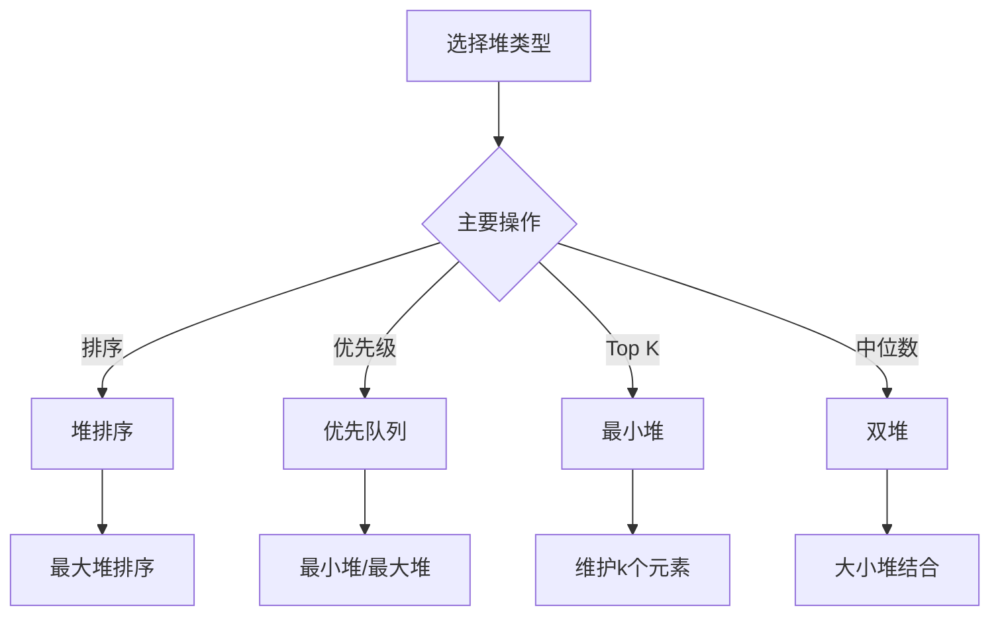

# 堆详解

## 🎯 核心概念

**堆**是一种特殊的完全二叉树，满足堆性质：父节点的值总是大于（或小于）其子节点的值。

## 🔍 基本定义

### 堆的基本概念
- **最大堆**：父节点的值总是大于或等于子节点的值
- **最小堆**：父节点的值总是小于或等于子节点的值
- **完全二叉树**：除最后一层外都是满的，最后一层从左到右填充
- **堆顶**：堆的根节点，最大堆中是最大值，最小堆中是最小值

### 堆的基本性质
| 性质 | 描述 | 示例 |
|------|------|------|
| 堆性质 | 父节点值大于（或小于）子节点值 | 最大堆：父节点 ≥ 子节点 |
| 完全二叉树 | 除最后一层外都是满的 | 最后一层从左到右填充 |
| 堆顶性质 | 堆顶是最大值（或最小值） | 最大堆：堆顶是最大值 |
| 局部有序 | 任意子树都满足堆性质 | 递归定义 |

## 📊 堆实现

### 1. 最小堆实现
```python
class MinHeap:
    def __init__(self):
        self.heap = []
    
    def parent(self, i):
        """获取父节点索引 - O(1)"""
        return (i - 1) // 2
    
    def left_child(self, i):
        """获取左子节点索引 - O(1)"""
        return 2 * i + 1
    
    def right_child(self, i):
        """获取右子节点索引 - O(1)"""
        return 2 * i + 2
    
    def insert(self, val):
        """插入元素 - O(log n)"""
        self.heap.append(val)
        self._heapify_up(len(self.heap) - 1)
    
    def extract_min(self):
        """提取最小值 - O(log n)"""
        if not self.heap:
            return None
        
        if len(self.heap) == 1:
            return self.heap.pop()
        
        min_val = self.heap[0]
        self.heap[0] = self.heap.pop()
        self._heapify_down(0)
        
        return min_val
    
    def peek(self):
        """查看最小值 - O(1)"""
        return self.heap[0] if self.heap else None
    
    def _heapify_up(self, index):
        """向上调整堆 - O(log n)"""
        while index > 0:
            parent_index = self.parent(index)
            if self.heap[index] >= self.heap[parent_index]:
                break
            
            self.heap[index], self.heap[parent_index] = self.heap[parent_index], self.heap[index]
            index = parent_index
    
    def _heapify_down(self, index):
        """向下调整堆 - O(log n)"""
        while True:
            smallest = index
            left = self.left_child(index)
            right = self.right_child(index)
            
            if left < len(self.heap) and self.heap[left] < self.heap[smallest]:
                smallest = left
            
            if right < len(self.heap) and self.heap[right] < self.heap[smallest]:
                smallest = right
            
            if smallest == index:
                break
            
            self.heap[index], self.heap[smallest] = self.heap[smallest], self.heap[index]
            index = smallest
    
    def size(self):
        """获取堆大小 - O(1)"""
        return len(self.heap)
    
    def is_empty(self):
        """判断堆是否为空 - O(1)"""
        return len(self.heap) == 0
```

### 2. 最大堆实现
```python
class MaxHeap:
    def __init__(self):
        self.heap = []
    
    def parent(self, i):
        """获取父节点索引 - O(1)"""
        return (i - 1) // 2
    
    def left_child(self, i):
        """获取左子节点索引 - O(1)"""
        return 2 * i + 1
    
    def right_child(self, i):
        """获取右子节点索引 - O(1)"""
        return 2 * i + 2
    
    def insert(self, val):
        """插入元素 - O(log n)"""
        self.heap.append(val)
        self._heapify_up(len(self.heap) - 1)
    
    def extract_max(self):
        """提取最大值 - O(log n)"""
        if not self.heap:
            return None
        
        if len(self.heap) == 1:
            return self.heap.pop()
        
        max_val = self.heap[0]
        self.heap[0] = self.heap.pop()
        self._heapify_down(0)
        
        return max_val
    
    def peek(self):
        """查看最大值 - O(1)"""
        return self.heap[0] if self.heap else None
    
    def _heapify_up(self, index):
        """向上调整堆 - O(log n)"""
        while index > 0:
            parent_index = self.parent(index)
            if self.heap[index] <= self.heap[parent_index]:
                break
            
            self.heap[index], self.heap[parent_index] = self.heap[parent_index], self.heap[index]
            index = parent_index
    
    def _heapify_down(self, index):
        """向下调整堆 - O(log n)"""
        while True:
            largest = index
            left = self.left_child(index)
            right = self.right_child(index)
            
            if left < len(self.heap) and self.heap[left] > self.heap[largest]:
                largest = left
            
            if right < len(self.heap) and self.heap[right] > self.heap[largest]:
                largest = right
            
            if largest == index:
                break
            
            self.heap[index], self.heap[largest] = self.heap[largest], self.heap[index]
            index = largest
```

### 3. 优先队列实现
```python
import heapq

class PriorityQueue:
    def __init__(self):
        self.heap = []
        self.index = 0
    
    def enqueue(self, item, priority):
        """入队 - O(log n)"""
        heapq.heappush(self.heap, (priority, self.index, item))
        self.index += 1
    
    def dequeue(self):
        """出队 - O(log n)"""
        if self.is_empty():
            raise IndexError("Priority queue is empty")
        priority, index, item = heapq.heappop(self.heap)
        return item
    
    def peek(self):
        """查看队首 - O(1)"""
        if self.is_empty():
            raise IndexError("Priority queue is empty")
        priority, index, item = self.heap[0]
        return item
    
    def is_empty(self):
        """判断是否为空 - O(1)"""
        return len(self.heap) == 0
    
    def size(self):
        """获取大小 - O(1)"""
        return len(self.heap)
```

## 🎨 堆算法

### 1. 堆排序
```python
def heap_sort(arr):
    """堆排序 - O(n log n)"""
    n = len(arr)
    
    # 构建最大堆
    for i in range(n // 2 - 1, -1, -1):
        heapify(arr, n, i)
    
    # 逐个提取元素
    for i in range(n - 1, 0, -1):
        arr[0], arr[i] = arr[i], arr[0]  # 交换
        heapify(arr, i, 0)
    
    return arr

def heapify(arr, n, i):
    """调整堆 - O(log n)"""
    largest = i
    left = 2 * i + 1
    right = 2 * i + 2
    
    if left < n and arr[left] > arr[largest]:
        largest = left
    
    if right < n and arr[right] > arr[largest]:
        largest = right
    
    if largest != i:
        arr[i], arr[largest] = arr[largest], arr[i]
        heapify(arr, n, largest)

def heap_sort_min(arr):
    """最小堆排序 - O(n log n)"""
    n = len(arr)
    
    # 构建最小堆
    for i in range(n // 2 - 1, -1, -1):
        heapify_min(arr, n, i)
    
    # 逐个提取元素
    for i in range(n - 1, 0, -1):
        arr[0], arr[i] = arr[i], arr[0]  # 交换
        heapify_min(arr, i, 0)
    
    return arr

def heapify_min(arr, n, i):
    """调整最小堆 - O(log n)"""
    smallest = i
    left = 2 * i + 1
    right = 2 * i + 2
    
    if left < n and arr[left] < arr[smallest]:
        smallest = left
    
    if right < n and arr[right] < arr[smallest]:
        smallest = right
    
    if smallest != i:
        arr[i], arr[smallest] = arr[smallest], arr[i]
        heapify_min(arr, n, smallest)
```

### 2. Top K 问题
```python
def find_kth_largest(nums, k):
    """找到第k个最大元素 - O(n log k)"""
    import heapq
    
    heap = []
    
    for num in nums:
        if len(heap) < k:
            heapq.heappush(heap, num)
        elif num > heap[0]:
            heapq.heapreplace(heap, num)
    
    return heap[0]

def find_kth_smallest(nums, k):
    """找到第k个最小元素 - O(n log k)"""
    import heapq
    
    heap = []
    
    for num in nums:
        if len(heap) < k:
            heapq.heappush(heap, -num)  # 使用负值模拟最大堆
        elif num < -heap[0]:
            heapq.heapreplace(heap, -num)
    
    return -heap[0]

def top_k_frequent(nums, k):
    """前k个高频元素 - O(n log k)"""
    from collections import Counter
    import heapq
    
    count = Counter(nums)
    heap = []
    
    for num, freq in count.items():
        if len(heap) < k:
            heapq.heappush(heap, (freq, num))
        elif freq > heap[0][0]:
            heapq.heapreplace(heap, (freq, num))
    
    return [num for freq, num in heap]

def merge_k_sorted_lists(lists):
    """合并k个有序链表 - O(n log k)"""
    import heapq
    
    heap = []
    
    # 初始化堆
    for i, lst in enumerate(lists):
        if lst:
            heapq.heappush(heap, (lst[0], i, 0))
    
    result = []
    
    while heap:
        val, list_idx, elem_idx = heapq.heappop(heap)
        result.append(val)
        
        # 添加下一个元素
        if elem_idx + 1 < len(lists[list_idx]):
            heapq.heappush(heap, (lists[list_idx][elem_idx + 1], list_idx, elem_idx + 1))
    
    return result
```

### 3. 堆的其他应用
```python
def median_finder():
    """中位数查找器 - O(log n)"""
    import heapq
    
    class MedianFinder:
        def __init__(self):
            self.small = []  # 最大堆，存储较小的一半
            self.large = []  # 最小堆，存储较大的一半
        
        def add_num(self, num):
            """添加数字 - O(log n)"""
            if len(self.small) == len(self.large):
                heapq.heappush(self.large, -heapq.heappushpop(self.small, -num))
            else:
                heapq.heappush(self.small, -heapq.heappushpop(self.large, num))
        
        def find_median(self):
            """查找中位数 - O(1)"""
            if len(self.small) == len(self.large):
                return (-self.small[0] + self.large[0]) / 2
            else:
                return self.large[0]
    
    return MedianFinder()

def sliding_window_maximum(nums, k):
    """滑动窗口最大值 - O(n)"""
    import heapq
    
    result = []
    heap = []
    
    for i in range(len(nums)):
        # 移除超出窗口的元素
        while heap and heap[0][1] <= i - k:
            heapq.heappop(heap)
        
        # 添加当前元素
        heapq.heappush(heap, (-nums[i], i))
        
        # 窗口形成后记录最大值
        if i >= k - 1:
            result.append(-heap[0][0])
    
    return result

def k_closest_points(points, k):
    """k个最近的点 - O(n log k)"""
    import heapq
    
    heap = []
    
    for point in points:
        x, y = point
        distance = x * x + y * y
        
        if len(heap) < k:
            heapq.heappush(heap, (-distance, point))
        elif distance < -heap[0][0]:
            heapq.heapreplace(heap, (-distance, point))
    
    return [point for distance, point in heap]
```

## 📈 堆性能分析

### 时间复杂度分析
| 操作 | 时间复杂度 | 说明 |
|------|------------|------|
| 插入 | O(log n) | 需要向上调整堆 |
| 删除 | O(log n) | 需要向下调整堆 |
| 查看堆顶 | O(1) | 直接访问根节点 |
| 堆排序 | O(n log n) | 需要n次调整操作 |
| 构建堆 | O(n) | 自底向上构建 |

### 空间复杂度分析
| 操作 | 空间复杂度 | 说明 |
|------|------------|------|
| 堆存储 | O(n) | 需要存储所有元素 |
| 堆排序 | O(1) | 原地排序 |
| 优先队列 | O(n) | 需要存储所有元素 |

## 🎯 堆应用

### 1. 基础应用
- **优先队列**：任务调度
- **堆排序**：高效排序算法
- **Top K 问题**：查找前k个元素
- **中位数查找**：动态中位数

### 2. 算法应用
- **Dijkstra算法**：最短路径
- **Prim算法**：最小生成树
- **合并有序序列**：多路归并
- **滑动窗口**：区间最值

### 3. 实际应用
- **操作系统**：进程调度
- **数据库**：排序和索引
- **网络协议**：优先级队列
- **游戏开发**：AI决策

## 📊 堆选择指南

### 选择原则
| 需求 | 推荐类型 | 原因 |
|------|----------|------|
| 快速排序 | 堆排序 | O(n log n)稳定排序 |
| 优先级处理 | 优先队列 | 自动排序 |
| Top K 问题 | 最小堆 | 维护k个元素 |
| 中位数查找 | 双堆 | 动态维护中位数 |

### 性能考虑


## 🔗 相关概念

### 树形结构
- **关系**：堆是特殊的完全二叉树
- **链接**：[[06-树形结构总览]]

### 复杂度分析
- **关系**：堆操作的复杂度分析
- **链接**：[[01-时间复杂度概念]]、[[02-空间复杂度概念]]

### 具体实现
- **关系**：堆的具体实现
- **链接**：[[07-二叉树详解]]、[[09-平衡树简介]]

## 📚 学习建议

### 费曼学习法
1. **选择概念**：堆
2. **教授他人**：解释堆特点
3. **回顾简化**：找出理解不足
4. **重新组织**：用更简单的方式表达

### 刻意练习
1. **实现练习**：实现各种堆操作
2. **算法练习**：在堆上实现算法
3. **应用练习**：解决实际问题
4. **优化练习**：优化堆操作性能

## 🔗 相关链接
- [[06-树形结构总览]] - 树形结构概述
- [[07-二叉树详解]] - 二叉树的详细实现
- [[09-平衡树简介]] - 平衡树的详细实现
- [[01-排序算法总览]] - 排序算法概述
