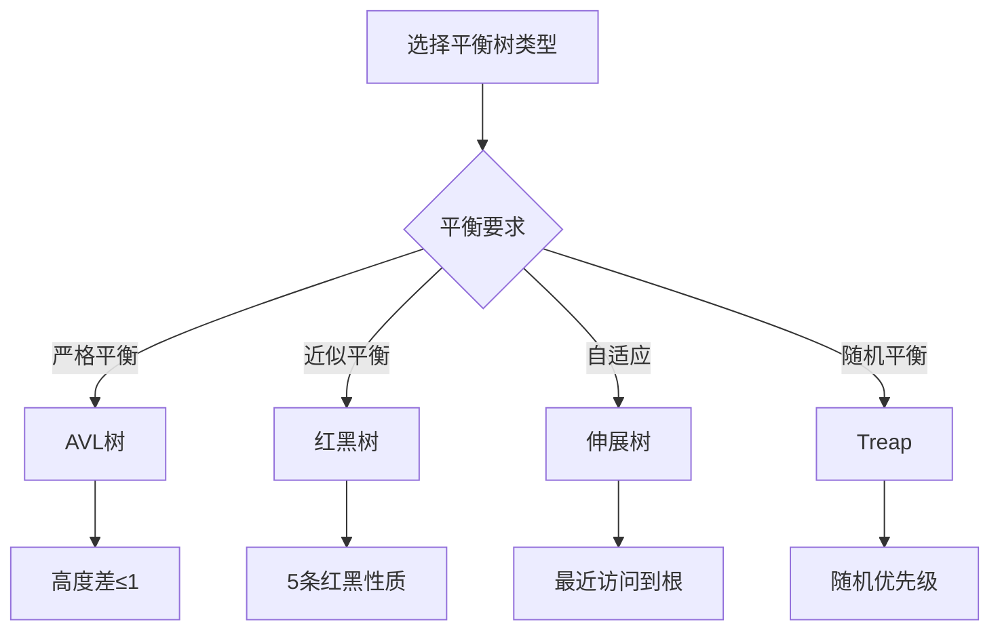

# 平衡树简介

## 🎯 核心概念

**平衡树**是一种自平衡的二叉搜索树，通过旋转操作保持树的平衡，确保搜索、插入、删除操作的时间复杂度为O(log n)。

## 🔍 基本定义

### 平衡树的基本概念
- **平衡因子**：节点的左右子树高度差
- **旋转操作**：通过旋转调整树的结构
- **自平衡**：插入删除后自动调整保持平衡
- **平衡条件**：满足特定的平衡性质

### 平衡树的类型
| 类型 | 平衡条件 | 特点 | 应用 |
|------|----------|------|------|
| AVL树 | 任意节点左右子树高度差≤1 | 严格平衡 | 数据库索引 |
| 红黑树 | 5条红黑性质 | 近似平衡 | C++ STL |
| 伸展树 | 最近访问的节点移到根 | 自适应 | 缓存系统 |
| Treap | 随机优先级 | 随机平衡 | 竞赛编程 |

## 📊 AVL树实现

### 1. AVL节点结构
```python
class AVLNode:
    def __init__(self, val):
        self.val = val
        self.left = None
        self.right = None
        self.height = 1
    
    def __str__(self):
        return str(self.val)
```

### 2. AVL树实现
```python
class AVLTree:
    def __init__(self):
        self.root = None
    
    def get_height(self, node):
        """获取节点高度 - O(1)"""
        if not node:
            return 0
        return node.height
    
    def get_balance(self, node):
        """获取平衡因子 - O(1)"""
        if not node:
            return 0
        return self.get_height(node.left) - self.get_height(node.right)
    
    def update_height(self, node):
        """更新节点高度 - O(1)"""
        if node:
            node.height = 1 + max(self.get_height(node.left), self.get_height(node.right))
    
    def rotate_right(self, y):
        """右旋转 - O(1)"""
        x = y.left
        T2 = x.right
        
        # 执行旋转
        x.right = y
        y.left = T2
        
        # 更新高度
        self.update_height(y)
        self.update_height(x)
        
        return x
    
    def rotate_left(self, x):
        """左旋转 - O(1)"""
        y = x.right
        T2 = y.left
        
        # 执行旋转
        y.left = x
        x.right = T2
        
        # 更新高度
        self.update_height(x)
        self.update_height(y)
        
        return y
    
    def insert(self, val):
        """插入节点 - O(log n)"""
        self.root = self._insert_recursive(self.root, val)
    
    def _insert_recursive(self, node, val):
        """递归插入 - O(log n)"""
        # 1. 执行标准BST插入
        if not node:
            return AVLNode(val)
        
        if val < node.val:
            node.left = self._insert_recursive(node.left, val)
        elif val > node.val:
            node.right = self._insert_recursive(node.right, val)
        else:
            return node  # 不允许重复值
        
        # 2. 更新祖先节点的高度
        self.update_height(node)
        
        # 3. 获取平衡因子
        balance = self.get_balance(node)
        
        # 4. 如果不平衡，执行旋转
        # 左左情况
        if balance > 1 and val < node.left.val:
            return self.rotate_right(node)
        
        # 右右情况
        if balance < -1 and val > node.right.val:
            return self.rotate_left(node)
        
        # 左右情况
        if balance > 1 and val > node.left.val:
            node.left = self.rotate_left(node.left)
            return self.rotate_right(node)
        
        # 右左情况
        if balance < -1 and val < node.right.val:
            node.right = self.rotate_right(node.right)
            return self.rotate_left(node)
        
        return node
    
    def delete(self, val):
        """删除节点 - O(log n)"""
        self.root = self._delete_recursive(self.root, val)
    
    def _delete_recursive(self, node, val):
        """递归删除 - O(log n)"""
        # 1. 执行标准BST删除
        if not node:
            return node
        
        if val < node.val:
            node.left = self._delete_recursive(node.left, val)
        elif val > node.val:
            node.right = self._delete_recursive(node.right, val)
        else:
            # 找到要删除的节点
            if not node.left:
                return node.right
            elif not node.right:
                return node.left
            
            # 有两个子节点，找到右子树的最小值
            min_node = self._find_min(node.right)
            node.val = min_node.val
            node.right = self._delete_recursive(node.right, min_node.val)
        
        # 2. 更新高度
        self.update_height(node)
        
        # 3. 获取平衡因子
        balance = self.get_balance(node)
        
        # 4. 如果不平衡，执行旋转
        # 左左情况
        if balance > 1 and self.get_balance(node.left) >= 0:
            return self.rotate_right(node)
        
        # 右右情况
        if balance < -1 and self.get_balance(node.right) <= 0:
            return self.rotate_left(node)
        
        # 左右情况
        if balance > 1 and self.get_balance(node.left) < 0:
            node.left = self.rotate_left(node.left)
            return self.rotate_right(node)
        
        # 右左情况
        if balance < -1 and self.get_balance(node.right) > 0:
            node.right = self.rotate_right(node.right)
            return self.rotate_left(node)
        
        return node
    
    def _find_min(self, node):
        """找到最小值节点 - O(log n)"""
        while node.left:
            node = node.left
        return node
    
    def search(self, val):
        """搜索节点 - O(log n)"""
        return self._search_recursive(self.root, val)
    
    def _search_recursive(self, node, val):
        """递归搜索 - O(log n)"""
        if not node or node.val == val:
            return node
        
        if val < node.val:
            return self._search_recursive(node.left, val)
        else:
            return self._search_recursive(node.right, val)
```

## 🎨 红黑树简介

### 1. 红黑树性质
```python
class RedBlackNode:
    def __init__(self, val, color='RED'):
        self.val = val
        self.left = None
        self.right = None
        self.parent = None
        self.color = color  # 'RED' or 'BLACK'

class RedBlackTree:
    def __init__(self):
        self.nil = RedBlackNode(0, 'BLACK')  # 哨兵节点
        self.root = self.nil
    
    def left_rotate(self, x):
        """左旋转 - O(1)"""
        y = x.right
        x.right = y.left
        
        if y.left != self.nil:
            y.left.parent = x
        
        y.parent = x.parent
        
        if x.parent == self.nil:
            self.root = y
        elif x == x.parent.left:
            x.parent.left = y
        else:
            x.parent.right = y
        
        y.left = x
        x.parent = y
    
    def right_rotate(self, y):
        """右旋转 - O(1)"""
        x = y.left
        y.left = x.right
        
        if x.right != self.nil:
            x.right.parent = y
        
        x.parent = y.parent
        
        if y.parent == self.nil:
            self.root = x
        elif y == y.parent.left:
            y.parent.left = x
        else:
            y.parent.right = x
        
        x.right = y
        y.parent = x
    
    def insert_fixup(self, z):
        """插入修复 - O(log n)"""
        while z.parent.color == 'RED':
            if z.parent == z.parent.parent.left:
                y = z.parent.parent.right
                if y.color == 'RED':
                    z.parent.color = 'BLACK'
                    y.color = 'BLACK'
                    z.parent.parent.color = 'RED'
                    z = z.parent.parent
                else:
                    if z == z.parent.right:
                        z = z.parent
                        self.left_rotate(z)
                    z.parent.color = 'BLACK'
                    z.parent.parent.color = 'RED'
                    self.right_rotate(z.parent.parent)
            else:
                y = z.parent.parent.left
                if y.color == 'RED':
                    z.parent.color = 'BLACK'
                    y.color = 'BLACK'
                    z.parent.parent.color = 'RED'
                    z = z.parent.parent
                else:
                    if z == z.parent.left:
                        z = z.parent
                        self.right_rotate(z)
                    z.parent.color = 'BLACK'
                    z.parent.parent.color = 'RED'
                    self.left_rotate(z.parent.parent)
        
        self.root.color = 'BLACK'
```

## 🔍 平衡树算法

### 1. 旋转操作
```python
def rotate_right_avl(node):
    """AVL树右旋转 - O(1)"""
    left_child = node.left
    right_subtree = left_child.right
    
    # 执行旋转
    left_child.right = node
    node.left = right_subtree
    
    # 更新高度
    node.height = 1 + max(get_height(node.left), get_height(node.right))
    left_child.height = 1 + max(get_height(left_child.left), get_height(left_child.right))
    
    return left_child

def rotate_left_avl(node):
    """AVL树左旋转 - O(1)"""
    right_child = node.right
    left_subtree = right_child.left
    
    # 执行旋转
    right_child.left = node
    node.right = left_subtree
    
    # 更新高度
    node.height = 1 + max(get_height(node.left), get_height(node.right))
    right_child.height = 1 + max(get_height(right_child.left), get_height(right_child.right))
    
    return right_child

def get_height(node):
    """获取节点高度 - O(1)"""
    if not node:
        return 0
    return node.height
```

### 2. 平衡检查
```python
def is_balanced_avl(root):
    """检查AVL树是否平衡 - O(n)"""
    def check_balance(node):
        if not node:
            return True, 0
        
        left_balanced, left_height = check_balance(node.left)
        right_balanced, right_height = check_balance(node.right)
        
        if not left_balanced or not right_balanced:
            return False, 0
        
        if abs(left_height - right_height) > 1:
            return False, 0
        
        return True, 1 + max(left_height, right_height)
    
    balanced, _ = check_balance(root)
    return balanced

def is_balanced_rb(root):
    """检查红黑树是否平衡 - O(n)"""
    def check_properties(node):
        if not node:
            return True, 0
        
        # 检查红节点的子节点都是黑节点
        if node.color == 'RED':
            if node.left and node.left.color == 'RED':
                return False, 0
            if node.right and node.right.color == 'RED':
                return False, 0
        
        left_valid, left_black_height = check_properties(node.left)
        right_valid, right_black_height = check_properties(node.right)
        
        if not left_valid or not right_valid:
            return False, 0
        
        if left_black_height != right_black_height:
            return False, 0
        
        black_height = left_black_height
        if node.color == 'BLACK':
            black_height += 1
        
        return True, black_height
    
    valid, _ = check_properties(root)
    return valid
```

### 3. 平衡树操作
```python
def avl_insert(root, val):
    """AVL树插入 - O(log n)"""
    if not root:
        return AVLNode(val)
    
    if val < root.val:
        root.left = avl_insert(root.left, val)
    elif val > root.val:
        root.right = avl_insert(root.right, val)
    else:
        return root  # 不允许重复值
    
    # 更新高度
    root.height = 1 + max(get_height(root.left), get_height(root.right))
    
    # 获取平衡因子
    balance = get_balance(root)
    
    # 左左情况
    if balance > 1 and val < root.left.val:
        return rotate_right_avl(root)
    
    # 右右情况
    if balance < -1 and val > root.right.val:
        return rotate_left_avl(root)
    
    # 左右情况
    if balance > 1 and val > root.left.val:
        root.left = rotate_left_avl(root.left)
        return rotate_right_avl(root)
    
    # 右左情况
    if balance < -1 and val < root.right.val:
        root.right = rotate_right_avl(root.right)
        return rotate_left_avl(root)
    
    return root

def get_balance(node):
    """获取平衡因子 - O(1)"""
    if not node:
        return 0
    return get_height(node.left) - get_height(node.right)
```

## 📈 平衡树性能分析

### 时间复杂度分析
| 操作 | AVL树 | 红黑树 | 说明 |
|------|-------|--------|------|
| 搜索 | O(log n) | O(log n) | 平衡保证 |
| 插入 | O(log n) | O(log n) | 需要旋转调整 |
| 删除 | O(log n) | O(log n) | 需要旋转调整 |
| 旋转 | O(1) | O(1) | 常数时间操作 |

### 空间复杂度分析
| 结构 | 空间复杂度 | 额外空间 | 说明 |
|------|------------|----------|------|
| AVL树 | O(n) | O(n) | 存储高度信息 |
| 红黑树 | O(n) | O(n) | 存储颜色信息 |
| 伸展树 | O(n) | O(n) | 存储父节点指针 |

## 🎯 平衡树应用

### 1. 基础应用
- **数据库索引**：B+树索引
- **操作系统**：进程调度
- **编译器**：符号表
- **网络协议**：路由表

### 2. 算法应用
- **动态集合**：支持插入删除的集合
- **区间查询**：线段树
- **优先级队列**：斐波那契堆
- **图算法**：最短路径

### 3. 实际应用
- **C++ STL**：map、set容器
- **Java集合**：TreeMap、TreeSet
- **数据库**：索引结构
- **游戏开发**：场景管理

## 📊 平衡树选择指南

### 选择原则
| 需求 | 推荐类型 | 原因 |
|------|----------|------|
| 严格平衡 | AVL树 | 高度差≤1 |
| 近似平衡 | 红黑树 | 性能稳定 |
| 自适应 | 伸展树 | 访问局部性 |
| 随机平衡 | Treap | 简单实现 |

### 性能考虑


## 🔗 相关概念

### 树形结构
- **关系**：平衡树是特殊的二叉搜索树
- **链接**：[[06-树形结构总览]]

### 复杂度分析
- **关系**：平衡树操作的复杂度分析
- **链接**：[[01-时间复杂度概念]]、[[02-空间复杂度概念]]

### 具体实现
- **关系**：平衡树的具体实现
- **链接**：[[07-二叉树详解]]、[[08-堆详解]]

## 📚 学习建议

### 费曼学习法
1. **选择概念**：平衡树
2. **教授他人**：解释平衡树特点
3. **回顾简化**：找出理解不足
4. **重新组织**：用更简单的方式表达

### 刻意练习
1. **实现练习**：实现各种平衡树操作
2. **算法练习**：在平衡树上实现算法
3. **应用练习**：解决实际问题
4. **优化练习**：优化平衡树操作性能

## 🔗 相关链接
- [[06-树形结构总览]] - 树形结构概述
- [[07-二叉树详解]] - 二叉树的详细实现
- [[08-堆详解]] - 堆的详细实现
- [[01-递归原理]] - 递归算法基础
