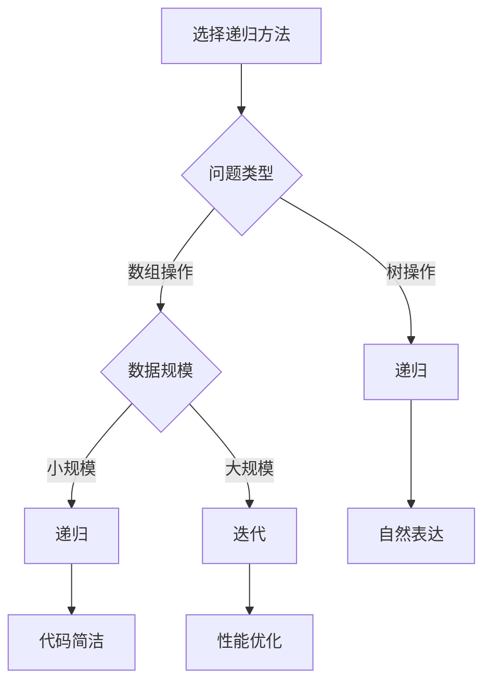

# 递归原理

## 🎯 核心概念

**递归**是一种编程技术，函数直接或间接地调用自身来解决问题，是分治算法的基础。

## 🔍 基本定义

### 递归的基本概念
- **递归函数**：调用自身的函数
- **递归调用**：函数内部调用自身
- **递归终止条件**：防止无限递归的边界条件
- **递归深度**：递归调用的层数

### 递归的基本要素
| 要素 | 描述 | 示例 |
|------|------|------|
| 递归终止条件 | 防止无限递归 | if n <= 1: return 1 |
| 递归关系 | 问题与子问题的关系 | f(n) = f(n-1) + f(n-2) |
| 递归调用 | 函数调用自身 | return fibonacci(n-1) + fibonacci(n-2) |
| 返回值 | 递归结果的处理 | return result |

## 📊 递归实现

### 1. 基本递归结构
```python
def recursive_function(parameters):
    """递归函数基本结构"""
    # 1. 递归终止条件
    if base_case:
        return base_value
    
    # 2. 递归调用
    result = recursive_function(modified_parameters)
    
    # 3. 处理结果
    return process_result(result)
```

### 2. 经典递归示例
```python
def factorial(n):
    """阶乘 - O(n)"""
    # 递归终止条件
    if n <= 1:
        return 1
    
    # 递归调用
    return n * factorial(n - 1)

def fibonacci(n):
    """斐波那契数列 - O(2^n)"""
    # 递归终止条件
    if n <= 1:
        return n
    
    # 递归调用
    return fibonacci(n - 1) + fibonacci(n - 2)

def power(base, exponent):
    """幂运算 - O(log n)"""
    # 递归终止条件
    if exponent == 0:
        return 1
    
    # 递归调用
    if exponent % 2 == 0:
        return power(base, exponent // 2) ** 2
    else:
        return base * power(base, exponent - 1)

def gcd(a, b):
    """最大公约数 - O(log min(a,b))"""
    # 递归终止条件
    if b == 0:
        return a
    
    # 递归调用
    return gcd(b, a % b)
```

### 3. 递归优化
```python
def fibonacci_memo(n, memo={}):
    """记忆化斐波那契 - O(n)"""
    if n in memo:
        return memo[n]
    
    if n <= 1:
        return n
    
    memo[n] = fibonacci_memo(n - 1, memo) + fibonacci_memo(n - 2, memo)
    return memo[n]

def fibonacci_iterative(n):
    """迭代斐波那契 - O(n)"""
    if n <= 1:
        return n
    
    a, b = 0, 1
    for _ in range(2, n + 1):
        a, b = b, a + b
    
    return b

def fibonacci_matrix(n):
    """矩阵斐波那契 - O(log n)"""
    def matrix_power(matrix, n):
        if n == 1:
            return matrix
        
        if n % 2 == 0:
            half = matrix_power(matrix, n // 2)
            return matrix_multiply(half, half)
        else:
            return matrix_multiply(matrix, matrix_power(matrix, n - 1))
    
    def matrix_multiply(a, b):
        return [[a[0][0]*b[0][0] + a[0][1]*b[1][0], a[0][0]*b[0][1] + a[0][1]*b[1][1]],
                [a[1][0]*b[0][0] + a[1][1]*b[1][0], a[1][0]*b[0][1] + a[1][1]*b[1][1]]]
    
    if n <= 1:
        return n
    
    matrix = [[1, 1], [1, 0]]
    result = matrix_power(matrix, n - 1)
    return result[0][0]
```

## 🎨 递归算法

### 1. 树遍历递归
```python
def preorder_traversal(root):
    """前序遍历 - O(n)"""
    if not root:
        return []
    
    result = [root.val]
    result.extend(preorder_traversal(root.left))
    result.extend(preorder_traversal(root.right))
    
    return result

def inorder_traversal(root):
    """中序遍历 - O(n)"""
    if not root:
        return []
    
    result = []
    result.extend(inorder_traversal(root.left))
    result.append(root.val)
    result.extend(inorder_traversal(root.right))
    
    return result

def postorder_traversal(root):
    """后序遍历 - O(n)"""
    if not root:
        return []
    
    result = []
    result.extend(postorder_traversal(root.left))
    result.extend(postorder_traversal(root.right))
    result.append(root.val)
    
    return result

def max_depth(root):
    """计算树的最大深度 - O(n)"""
    if not root:
        return 0
    
    left_depth = max_depth(root.left)
    right_depth = max_depth(root.right)
    
    return 1 + max(left_depth, right_depth)
```

### 2. 数组递归
```python
def binary_search(arr, target, left=0, right=None):
    """二分搜索 - O(log n)"""
    if right is None:
        right = len(arr) - 1
    
    if left > right:
        return -1
    
    mid = (left + right) // 2
    
    if arr[mid] == target:
        return mid
    elif arr[mid] > target:
        return binary_search(arr, target, left, mid - 1)
    else:
        return binary_search(arr, target, mid + 1, right)

def merge_sort(arr):
    """归并排序 - O(n log n)"""
    if len(arr) <= 1:
        return arr
    
    mid = len(arr) // 2
    left = merge_sort(arr[:mid])
    right = merge_sort(arr[mid:])
    
    return merge(left, right)

def merge(left, right):
    """合并两个有序数组 - O(n)"""
    result = []
    i = j = 0
    
    while i < len(left) and j < len(right):
        if left[i] <= right[j]:
            result.append(left[i])
            i += 1
        else:
            result.append(right[j])
            j += 1
    
    result.extend(left[i:])
    result.extend(right[j:])
    
    return result
```

### 3. 字符串递归
```python
def reverse_string(s):
    """反转字符串 - O(n)"""
    if len(s) <= 1:
        return s
    
    return reverse_string(s[1:]) + s[0]

def is_palindrome(s):
    """判断回文 - O(n)"""
    if len(s) <= 1:
        return True
    
    if s[0] != s[-1]:
        return False
    
    return is_palindrome(s[1:-1])

def generate_parentheses(n):
    """生成括号 - O(4^n)"""
    result = []
    
    def backtrack(current, open_count, close_count):
        if len(current) == 2 * n:
            result.append(current)
            return
        
        if open_count < n:
            backtrack(current + '(', open_count + 1, close_count)
        
        if close_count < open_count:
            backtrack(current + ')', open_count, close_count + 1)
    
    backtrack('', 0, 0)
    return result
```

## 🔍 递归分析

### 1. 递归树分析
```python
def analyze_recursion(n):
    """递归树分析示例"""
    if n <= 1:
        return 1
    
    # 递归树：
    #        n
    #       / \
    #    n-1   n-2
    #   / \   / \
    # n-2 n-3 n-3 n-4
    # ... ... ... ...
    
    return analyze_recursion(n - 1) + analyze_recursion(n - 2)

def count_recursive_calls(n):
    """计算递归调用次数"""
    call_count = 0
    
    def fibonacci_with_count(n):
        nonlocal call_count
        call_count += 1
        
        if n <= 1:
            return n
        
        return fibonacci_with_count(n - 1) + fibonacci_with_count(n - 2)
    
    fibonacci_with_count(n)
    return call_count
```

### 2. 递归复杂度分析
```python
def analyze_time_complexity():
    """递归时间复杂度分析"""
    # 1. 线性递归：T(n) = T(n-1) + O(1) = O(n)
    # 2. 二分递归：T(n) = 2T(n/2) + O(1) = O(n)
    # 3. 指数递归：T(n) = 2T(n-1) + O(1) = O(2^n)
    # 4. 对数递归：T(n) = T(n/2) + O(1) = O(log n)
    
    pass

def analyze_space_complexity():
    """递归空间复杂度分析"""
    # 1. 递归深度：O(h)，h为递归深度
    # 2. 每次递归调用：O(1)额外空间
    # 3. 总空间复杂度：O(h)
    
    pass
```

## 📈 递归性能分析

### 时间复杂度分析
| 递归类型 | 时间复杂度 | 示例 | 说明 |
|----------|------------|------|------|
| 线性递归 | O(n) | 阶乘、线性搜索 | 每次减少1 |
| 二分递归 | O(n) | 归并排序 | 每次减半 |
| 指数递归 | O(2^n) | 斐波那契 | 每次分裂为2 |
| 对数递归 | O(log n) | 二分搜索 | 每次减半 |

### 空间复杂度分析
| 递归类型 | 空间复杂度 | 说明 |
|----------|------------|------|
| 线性递归 | O(n) | 递归深度为n |
| 二分递归 | O(log n) | 递归深度为log n |
| 指数递归 | O(n) | 递归深度为n |
| 对数递归 | O(log n) | 递归深度为log n |

## 🎯 递归应用

### 1. 基础应用
- **数学计算**：阶乘、斐波那契、幂运算
- **数据结构**：树遍历、链表操作
- **排序算法**：归并排序、快速排序
- **搜索算法**：二分搜索、深度优先搜索

### 2. 算法应用
- **分治算法**：递归分治
- **回溯算法**：递归回溯
- **动态规划**：递归状态转移
- **图算法**：递归图遍历

### 3. 实际应用
- **文件系统**：目录遍历
- **编译器**：语法分析
- **游戏开发**：AI决策树
- **人工智能**：递归神经网络

## 📊 递归选择指南

### 选择原则
| 需求 | 推荐方法 | 原因 |
|------|----------|------|
| 简单问题 | 递归 | 代码简洁 |
| 复杂问题 | 迭代 | 性能更好 |
| 树操作 | 递归 | 自然表达 |
| 数组操作 | 迭代 | 避免栈溢出 |

### 性能考虑


## 🔗 相关概念

### 分治算法
- **关系**：递归是分治算法的基础
- **链接**：[[03-分治策略]]

### 复杂度分析
- **关系**：递归操作的复杂度分析
- **链接**：[[01-时间复杂度概念]]、[[02-空间复杂度概念]]

### 具体实现
- **关系**：递归的具体实现
- **链接**：[[02-递归模板]]、[[04-递归优化技巧]]

## 📚 学习建议

### 费曼学习法
1. **选择概念**：递归
2. **教授他人**：解释递归原理
3. **回顾简化**：找出理解不足
4. **重新组织**：用更简单的方式表达

### 刻意练习
1. **实现练习**：实现各种递归算法
2. **算法练习**：在递归上实现算法
3. **应用练习**：解决实际问题
4. **优化练习**：优化递归性能

## 🔗 相关链接
- [[02-递归模板]] - 递归的实现模板
- [[03-分治策略]] - 分治算法策略
- [[04-递归优化技巧]] - 递归优化方法
- [[05-经典递归问题]] - 经典递归问题
