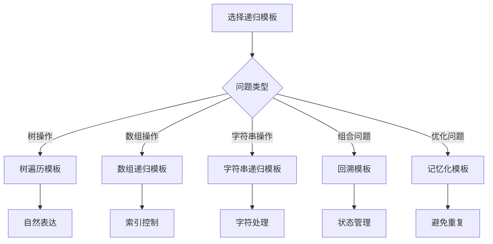

# 递归模板

## 🎯 核心概念

**递归模板**是解决递归问题的标准化框架，提供通用的解题思路和代码结构。

## 🔍 基本模板

### 1. 基础递归模板
```python
def recursive_template(parameters):
    """基础递归模板"""
    # 1. 递归终止条件
    if base_case:
        return base_value
    
    # 2. 递归调用
    result = recursive_template(modified_parameters)
    
    # 3. 处理结果
    return process_result(result)
```

### 2. 分治递归模板
```python
def divide_conquer_template(parameters):
    """分治递归模板"""
    # 1. 递归终止条件
    if base_case:
        return base_value
    
    # 2. 分解问题
    subproblems = divide_problem(parameters)
    
    # 3. 递归解决子问题
    subresults = []
    for subproblem in subproblems:
        subresult = divide_conquer_template(subproblem)
        subresults.append(subresult)
    
    # 4. 合并结果
    return combine_results(subresults)
```

### 3. 回溯递归模板
```python
def backtrack_template(parameters):
    """回溯递归模板"""
    result = []
    
    def backtrack(current_state, remaining_choices):
        # 1. 递归终止条件
        if is_valid_solution(current_state):
            result.append(current_state[:])  # 复制当前状态
            return
        
        # 2. 尝试所有可能的选择
        for choice in remaining_choices:
            # 3. 做出选择
            current_state.append(choice)
            
            # 4. 递归调用
            backtrack(current_state, get_next_choices(choice))
            
            # 5. 撤销选择（回溯）
            current_state.pop()
    
    backtrack([], get_initial_choices())
    return result
```

## 📊 具体应用模板

### 1. 树遍历模板
```python
def tree_traversal_template(root):
    """树遍历模板"""
    if not root:
        return []
    
    # 前序遍历：根-左-右
    result = [root.val]
    result.extend(tree_traversal_template(root.left))
    result.extend(tree_traversal_template(root.right))
    
    return result

def tree_search_template(root, target):
    """树搜索模板"""
    if not root:
        return False
    
    if root.val == target:
        return True
    
    return (tree_search_template(root.left, target) or 
            tree_search_template(root.right, target))

def tree_path_template(root, target):
    """树路径模板"""
    def find_path(node, target, path):
        if not node:
            return False
        
        path.append(node.val)
        
        if node.val == target:
            return True
        
        if (find_path(node.left, target, path) or 
            find_path(node.right, target, path)):
            return True
        
        path.pop()
        return False
    
    path = []
    find_path(root, target, path)
    return path
```

### 2. 数组递归模板
```python
def array_recursion_template(arr, index=0):
    """数组递归模板"""
    if index >= len(arr):
        return []
    
    # 处理当前元素
    current_result = process_element(arr[index])
    
    # 递归处理剩余元素
    remaining_result = array_recursion_template(arr, index + 1)
    
    return [current_result] + remaining_result

def array_search_template(arr, target, index=0):
    """数组搜索模板"""
    if index >= len(arr):
        return -1
    
    if arr[index] == target:
        return index
    
    return array_search_template(arr, target, index + 1)

def array_permutation_template(arr):
    """数组排列模板"""
    result = []
    
    def backtrack(current_permutation, remaining_elements):
        if not remaining_elements:
            result.append(current_permutation[:])
            return
        
        for i, element in enumerate(remaining_elements):
            current_permutation.append(element)
            backtrack(current_permutation, remaining_elements[:i] + remaining_elements[i+1:])
            current_permutation.pop()
    
    backtrack([], arr)
    return result
```

### 3. 字符串递归模板
```python
def string_recursion_template(s, index=0):
    """字符串递归模板"""
    if index >= len(s):
        return ""
    
    # 处理当前字符
    current_char = s[index]
    
    # 递归处理剩余字符串
    remaining_string = string_recursion_template(s, index + 1)
    
    return current_char + remaining_string

def string_palindrome_template(s, left=0, right=None):
    """字符串回文模板"""
    if right is None:
        right = len(s) - 1
    
    if left >= right:
        return True
    
    if s[left] != s[right]:
        return False
    
    return string_palindrome_template(s, left + 1, right - 1)

def string_subsequence_template(s, index=0, current=""):
    """字符串子序列模板"""
    if index >= len(s):
        return [current] if current else []
    
    # 不包含当前字符
    result = string_subsequence_template(s, index + 1, current)
    
    # 包含当前字符
    result.extend(string_subsequence_template(s, index + 1, current + s[index]))
    
    return result
```

## 🎨 高级递归模板

### 1. 记忆化递归模板
```python
def memoized_recursion_template(parameters, memo=None):
    """记忆化递归模板"""
    if memo is None:
        memo = {}
    
    # 检查是否已经计算过
    if parameters in memo:
        return memo[parameters]
    
    # 递归终止条件
    if base_case:
        memo[parameters] = base_value
        return base_value
    
    # 递归计算
    result = memoized_recursion_template(modified_parameters, memo)
    
    # 存储结果
    memo[parameters] = result
    return result

def fibonacci_memo_template(n, memo=None):
    """斐波那契记忆化模板"""
    if memo is None:
        memo = {}
    
    if n in memo:
        return memo[n]
    
    if n <= 1:
        memo[n] = n
        return n
    
    memo[n] = fibonacci_memo_template(n - 1, memo) + fibonacci_memo_template(n - 2, memo)
    return memo[n]
```

### 2. 尾递归模板
```python
def tail_recursion_template(parameters, accumulator=None):
    """尾递归模板"""
    if accumulator is None:
        accumulator = initial_value
    
    # 递归终止条件
    if base_case:
        return accumulator
    
    # 更新累积器
    new_accumulator = update_accumulator(accumulator, parameters)
    
    # 尾递归调用
    return tail_recursion_template(modified_parameters, new_accumulator)

def factorial_tail_template(n, accumulator=1):
    """阶乘尾递归模板"""
    if n <= 1:
        return accumulator
    
    return factorial_tail_template(n - 1, n * accumulator)

def sum_tail_template(arr, index=0, accumulator=0):
    """数组求和尾递归模板"""
    if index >= len(arr):
        return accumulator
    
    return sum_tail_template(arr, index + 1, accumulator + arr[index])
```

### 3. 动态规划递归模板
```python
def dp_recursion_template(parameters, dp=None):
    """动态规划递归模板"""
    if dp is None:
        dp = {}
    
    # 检查是否已经计算过
    if parameters in dp:
        return dp[parameters]
    
    # 递归终止条件
    if base_case:
        dp[parameters] = base_value
        return base_value
    
    # 递归计算
    result = dp_recursion_template(modified_parameters, dp)
    
    # 存储结果
    dp[parameters] = result
    return result

def knapsack_dp_template(weights, values, capacity, index=0, dp=None):
    """背包问题DP模板"""
    if dp is None:
        dp = {}
    
    key = (index, capacity)
    if key in dp:
        return dp[key]
    
    if index >= len(weights) or capacity <= 0:
        dp[key] = 0
        return 0
    
    # 不选择当前物品
    not_take = knapsack_dp_template(weights, values, capacity, index + 1, dp)
    
    # 选择当前物品
    take = 0
    if weights[index] <= capacity:
        take = values[index] + knapsack_dp_template(weights, values, capacity - weights[index], index + 1, dp)
    
    dp[key] = max(not_take, take)
    return dp[key]
```

## 🔍 递归模板应用

### 1. 经典问题模板
```python
def hanoi_template(n, source, destination, auxiliary):
    """汉诺塔模板"""
    if n == 1:
        print(f"Move disk 1 from {source} to {destination}")
        return
    
    hanoi_template(n - 1, source, auxiliary, destination)
    print(f"Move disk {n} from {source} to {destination}")
    hanoi_template(n - 1, auxiliary, destination, source)

def combination_template(n, k):
    """组合数模板"""
    if k == 0 or k == n:
        return 1
    
    return combination_template(n - 1, k - 1) + combination_template(n - 1, k)

def permutation_template(arr):
    """排列模板"""
    if len(arr) <= 1:
        return [arr]
    
    result = []
    for i in range(len(arr)):
        remaining = arr[:i] + arr[i+1:]
        for perm in permutation_template(remaining):
            result.append([arr[i]] + perm)
    
    return result
```

### 2. 图遍历模板
```python
def dfs_template(graph, start, visited=None):
    """深度优先搜索模板"""
    if visited is None:
        visited = set()
    
    visited.add(start)
    result = [start]
    
    for neighbor in graph[start]:
        if neighbor not in visited:
            result.extend(dfs_template(graph, neighbor, visited))
    
    return result

def bfs_template(graph, start):
    """广度优先搜索模板"""
    from collections import deque
    
    queue = deque([start])
    visited = {start}
    result = []
    
    while queue:
        node = queue.popleft()
        result.append(node)
        
        for neighbor in graph[node]:
            if neighbor not in visited:
                visited.add(neighbor)
                queue.append(neighbor)
    
    return result
```

## 📈 模板选择指南

### 选择原则
| 问题类型 | 推荐模板 | 原因 |
|----------|----------|------|
| 树操作 | 树遍历模板 | 自然表达 |
| 数组操作 | 数组递归模板 | 索引控制 |
| 字符串操作 | 字符串递归模板 | 字符处理 |
| 组合问题 | 回溯模板 | 状态管理 |
| 优化问题 | 记忆化模板 | 避免重复计算 |

### 性能考虑


## 🔗 相关概念

### 递归原理
- **关系**：递归模板基于递归原理
- **链接**：[[01-递归原理]]

### 分治策略
- **关系**：分治递归模板
- **链接**：[[03-分治策略]]

### 具体实现
- **关系**：递归模板的具体应用
- **链接**：[[04-递归优化技巧]]、[[05-经典递归问题]]

## 📚 学习建议

### 费曼学习法
1. **选择概念**：递归模板
2. **教授他人**：解释递归模板
3. **回顾简化**：找出理解不足
4. **重新组织**：用更简单的方式表达

### 刻意练习
1. **模板练习**：掌握各种递归模板
2. **应用练习**：用模板解决实际问题
3. **优化练习**：优化递归模板性能
4. **创新练习**：创造新的递归模板

## 🔗 相关链接
- [[01-递归原理]] - 递归的基本原理
- [[03-分治策略]] - 分治算法策略
- [[04-递归优化技巧]] - 递归优化方法
- [[05-经典递归问题]] - 经典递归问题
