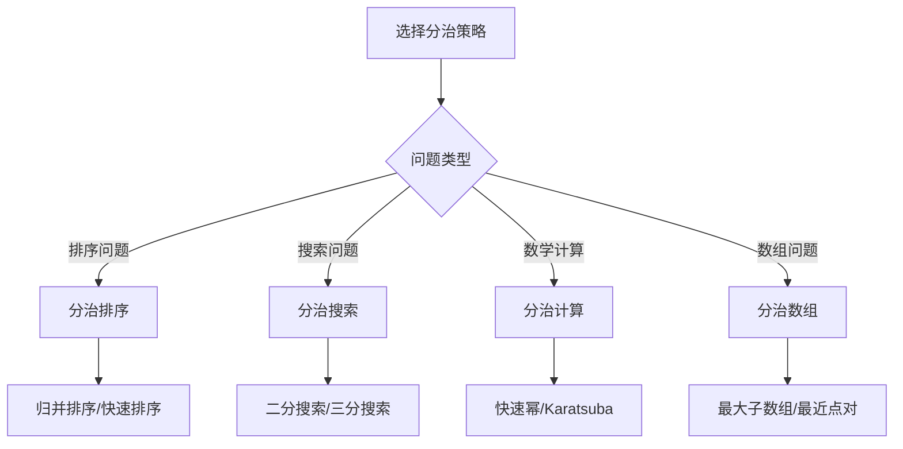

# 分治策略

## 🎯 核心概念

**分治策略**是一种算法设计范式，将问题分解为更小的子问题，递归解决子问题，然后合并结果得到原问题的解。

## 🔍 基本定义

### 分治策略的基本概念
- **分解(Divide)**：将问题分解为更小的子问题
- **解决(Conquer)**：递归解决子问题
- **合并(Combine)**：将子问题的解合并为原问题的解
- **递归终止条件**：子问题足够小时直接求解

### 分治策略的基本要素
| 要素 | 描述 | 示例 |
|------|------|------|
| 分解 | 将问题分解为子问题 | 数组分为两半 |
| 解决 | 递归解决子问题 | 分别排序两半 |
| 合并 | 合并子问题解 | 合并两个有序数组 |
| 终止条件 | 子问题足够小 | 数组长度为1 |

## 📊 分治策略实现

### 1. 基本分治模板
```python
def divide_conquer(problem):
    """分治策略基本模板"""
    # 1. 递归终止条件
    if is_base_case(problem):
        return solve_base_case(problem)
    
    # 2. 分解问题
    subproblems = divide_problem(problem)
    
    # 3. 递归解决子问题
    subresults = []
    for subproblem in subproblems:
        subresult = divide_conquer(subproblem)
        subresults.append(subresult)
    
    # 4. 合并结果
    return combine_results(subresults)
```

### 2. 经典分治算法
```python
def merge_sort(arr):
    """归并排序 - O(n log n)"""
    if len(arr) <= 1:
        return arr
    
    # 分解：将数组分为两半
    mid = len(arr) // 2
    left = arr[:mid]
    right = arr[mid:]
    
    # 解决：递归排序两半
    left_sorted = merge_sort(left)
    right_sorted = merge_sort(right)
    
    # 合并：合并两个有序数组
    return merge(left_sorted, right_sorted)

def merge(left, right):
    """合并两个有序数组 - O(n)"""
    result = []
    i = j = 0
    
    while i < len(left) and j < len(right):
        if left[i] <= right[j]:
            result.append(left[i])
            i += 1
        else:
            result.append(right[j])
            j += 1
    
    result.extend(left[i:])
    result.extend(right[j:])
    
    return result

def quick_sort(arr):
    """快速排序 - O(n log n)"""
    if len(arr) <= 1:
        return arr
    
    # 分解：选择基准元素
    pivot = arr[len(arr) // 2]
    
    # 分解：将数组分为三部分
    left = [x for x in arr if x < pivot]
    middle = [x for x in arr if x == pivot]
    right = [x for x in arr if x > pivot]
    
    # 解决：递归排序左右两部分
    left_sorted = quick_sort(left)
    right_sorted = quick_sort(right)
    
    # 合并：合并三部分
    return left_sorted + middle + right_sorted
```

### 3. 分治搜索算法
```python
def binary_search(arr, target, left=0, right=None):
    """二分搜索 - O(log n)"""
    if right is None:
        right = len(arr) - 1
    
    if left > right:
        return -1
    
    # 分解：选择中间元素
    mid = (left + right) // 2
    
    if arr[mid] == target:
        return mid
    elif arr[mid] > target:
        # 解决：在左半部分搜索
        return binary_search(arr, target, left, mid - 1)
    else:
        # 解决：在右半部分搜索
        return binary_search(arr, target, mid + 1, right)

def find_peak_element(arr):
    """寻找峰值元素 - O(log n)"""
    if len(arr) == 1:
        return 0
    
    left, right = 0, len(arr) - 1
    
    while left < right:
        mid = (left + right) // 2
        
        if arr[mid] > arr[mid + 1]:
            # 峰值在左半部分
            right = mid
        else:
            # 峰值在右半部分
            left = mid + 1
    
    return left
```

## 🎨 分治算法应用

### 1. 数学计算
```python
def power(base, exponent):
    """快速幂运算 - O(log n)"""
    if exponent == 0:
        return 1
    
    if exponent % 2 == 0:
        # 分解：指数减半
        half = power(base, exponent // 2)
        # 合并：平方
        return half * half
    else:
        # 分解：指数减1
        return base * power(base, exponent - 1)

def fibonacci_matrix(n):
    """矩阵斐波那契 - O(log n)"""
    def matrix_power(matrix, n):
        if n == 1:
            return matrix
        
        if n % 2 == 0:
            # 分解：指数减半
            half = matrix_power(matrix, n // 2)
            # 合并：矩阵相乘
            return matrix_multiply(half, half)
        else:
            # 分解：指数减1
            return matrix_multiply(matrix, matrix_power(matrix, n - 1))
    
    def matrix_multiply(a, b):
        return [[a[0][0]*b[0][0] + a[0][1]*b[1][0], a[0][0]*b[0][1] + a[0][1]*b[1][1]],
                [a[1][0]*b[0][0] + a[1][1]*b[1][0], a[1][0]*b[0][1] + a[1][1]*b[1][1]]]
    
    if n <= 1:
        return n
    
    matrix = [[1, 1], [1, 0]]
    result = matrix_power(matrix, n - 1)
    return result[0][0]

def karatsuba_multiply(x, y):
    """Karatsuba乘法 - O(n^log3)"""
    if x < 10 or y < 10:
        return x * y
    
    # 分解：将数字分为两半
    n = max(len(str(x)), len(str(y)))
    m = n // 2
    
    x1, x0 = divmod(x, 10**m)
    y1, y0 = divmod(y, 10**m)
    
    # 解决：递归计算三个乘积
    z2 = karatsuba_multiply(x1, y1)
    z0 = karatsuba_multiply(x0, y0)
    z1 = karatsuba_multiply(x1 + x0, y1 + y0) - z2 - z0
    
    # 合并：组合结果
    return z2 * 10**(2*m) + z1 * 10**m + z0
```

### 2. 数组操作
```python
def maximum_subarray(arr):
    """最大子数组和 - O(n log n)"""
    def max_subarray_divide_conquer(arr, left, right):
        if left == right:
            return arr[left]
        
        # 分解：将数组分为两半
        mid = (left + right) // 2
        
        # 解决：递归计算左右两部分的最大子数组和
        left_max = max_subarray_divide_conquer(arr, left, mid)
        right_max = max_subarray_divide_conquer(arr, mid + 1, right)
        
        # 合并：计算跨越中点的最大子数组和
        cross_max = max_crossing_subarray(arr, left, mid, right)
        
        return max(left_max, right_max, cross_max)
    
    def max_crossing_subarray(arr, left, mid, right):
        # 计算左半部分的最大后缀和
        left_sum = float('-inf')
        total = 0
        for i in range(mid, left - 1, -1):
            total += arr[i]
            left_sum = max(left_sum, total)
        
        # 计算右半部分的最大前缀和
        right_sum = float('-inf')
        total = 0
        for i in range(mid + 1, right + 1):
            total += arr[i]
            right_sum = max(right_sum, total)
        
        return left_sum + right_sum
    
    return max_subarray_divide_conquer(arr, 0, len(arr) - 1)

def closest_pair(points):
    """最近点对 - O(n log n)"""
    def distance(p1, p2):
        return ((p1[0] - p2[0])**2 + (p1[1] - p2[1])**2)**0.5
    
    def closest_pair_rec(points):
        if len(points) <= 3:
            # 暴力求解
            min_dist = float('inf')
            for i in range(len(points)):
                for j in range(i + 1, len(points)):
                    min_dist = min(min_dist, distance(points[i], points[j]))
            return min_dist
        
        # 分解：按x坐标排序并分为两半
        points.sort(key=lambda p: p[0])
        mid = len(points) // 2
        left_points = points[:mid]
        right_points = points[mid:]
        
        # 解决：递归计算左右两部分的最近点对
        left_min = closest_pair_rec(left_points)
        right_min = closest_pair_rec(right_points)
        
        # 合并：计算跨越中线的最近点对
        min_dist = min(left_min, right_min)
        cross_min = closest_crossing_pair(points, mid, min_dist)
        
        return min(min_dist, cross_min)
    
    def closest_crossing_pair(points, mid, min_dist):
        # 找到中线附近的点
        strip = []
        for point in points:
            if abs(point[0] - points[mid][0]) < min_dist:
                strip.append(point)
        
        # 按y坐标排序
        strip.sort(key=lambda p: p[1])
        
        # 检查strip中的点对
        for i in range(len(strip)):
            for j in range(i + 1, len(strip)):
                if strip[j][1] - strip[i][1] >= min_dist:
                    break
                min_dist = min(min_dist, distance(strip[i], strip[j]))
        
        return min_dist
    
    return closest_pair_rec(points)
```

### 3. 树操作
```python
def tree_diameter(root):
    """树的直径 - O(n)"""
    def diameter_recursive(node):
        if not node:
            return 0, 0
        
        # 解决：递归计算左右子树的直径和高度
        left_diameter, left_height = diameter_recursive(node.left)
        right_diameter, right_height = diameter_recursive(node.right)
        
        # 合并：计算当前节点的直径
        current_diameter = left_height + right_height
        max_diameter = max(left_diameter, right_diameter, current_diameter)
        max_height = 1 + max(left_height, right_height)
        
        return max_diameter, max_height
    
    diameter, _ = diameter_recursive(root)
    return diameter

def tree_path_sum(root, target_sum):
    """树路径和 - O(n)"""
    def path_sum_recursive(node, target_sum):
        if not node:
            return False
        
        # 分解：检查左右子树
        if not node.left and not node.right:
            return node.val == target_sum
        
        # 解决：递归检查左右子树
        remaining_sum = target_sum - node.val
        return (path_sum_recursive(node.left, remaining_sum) or 
                path_sum_recursive(node.right, remaining_sum))
    
    return path_sum_recursive(root, target_sum)
```

## 🔍 分治策略分析

### 1. 时间复杂度分析
```python
def analyze_divide_conquer_complexity():
    """分治算法时间复杂度分析"""
    # 1. 线性分解：T(n) = T(n-1) + O(1) = O(n)
    # 2. 二分分解：T(n) = 2T(n/2) + O(n) = O(n log n)
    # 3. 三分分解：T(n) = 3T(n/3) + O(n) = O(n log n)
    # 4. 对数分解：T(n) = T(n/2) + O(1) = O(log n)
    
    pass

def master_theorem(a, b, f):
    """主定理分析分治算法复杂度"""
    # T(n) = aT(n/b) + f(n)
    # 其中 a >= 1, b > 1, f(n) 是渐近正函数
    
    # 情况1：f(n) = O(n^c)，其中 c < log_b(a)
    # 则 T(n) = Θ(n^log_b(a))
    
    # 情况2：f(n) = Θ(n^c)，其中 c = log_b(a)
    # 则 T(n) = Θ(n^c log n)
    
    # 情况3：f(n) = Ω(n^c)，其中 c > log_b(a)
    # 则 T(n) = Θ(f(n))
    
    pass
```

### 2. 空间复杂度分析
```python
def analyze_space_complexity():
    """分治算法空间复杂度分析"""
    # 1. 递归深度：O(log n) 到 O(n)
    # 2. 每次递归调用：O(1) 额外空间
    # 3. 总空间复杂度：O(log n) 到 O(n)
    
    pass
```

## 📈 分治策略性能分析

### 时间复杂度分析
| 分解方式 | 时间复杂度 | 示例 | 说明 |
|----------|------------|------|------|
| 线性分解 | O(n) | 线性搜索 | 每次减少1 |
| 二分分解 | O(n log n) | 归并排序 | 每次减半 |
| 三分分解 | O(n log n) | 三分查找 | 每次减为1/3 |
| 对数分解 | O(log n) | 二分搜索 | 每次减半 |

### 空间复杂度分析
| 分解方式 | 空间复杂度 | 说明 |
|----------|------------|------|
| 线性分解 | O(n) | 递归深度为n |
| 二分分解 | O(log n) | 递归深度为log n |
| 三分分解 | O(log n) | 递归深度为log n |
| 对数分解 | O(log n) | 递归深度为log n |

## 🎯 分治策略应用

### 1. 基础应用
- **排序算法**：归并排序、快速排序
- **搜索算法**：二分搜索、三分搜索
- **数学计算**：快速幂、Karatsuba乘法
- **数组操作**：最大子数组、最近点对

### 2. 算法应用
- **图算法**：分治图算法
- **字符串算法**：分治字符串匹配
- **几何算法**：分治几何问题
- **数值算法**：分治数值计算

### 3. 实际应用
- **数据库**：分治查询优化
- **机器学习**：分治训练算法
- **图像处理**：分治图像算法
- **科学计算**：分治数值方法

## 📊 分治策略选择指南

### 选择原则
| 问题类型 | 推荐策略 | 原因 |
|----------|----------|------|
| 排序问题 | 分治排序 | 高效稳定 |
| 搜索问题 | 分治搜索 | 对数时间 |
| 数学计算 | 分治计算 | 减少计算量 |
| 数组问题 | 分治数组 | 自然分解 |

### 性能考虑


## 🔗 相关概念

### 递归原理
- **关系**：分治策略基于递归
- **链接**：[[01-递归原理]]

### 递归模板
- **关系**：分治递归模板
- **链接**：[[02-递归模板]]

### 具体实现
- **关系**：分治策略的具体应用
- **链接**：[[04-递归优化技巧]]、[[05-经典递归问题]]

## 📚 学习建议

### 费曼学习法
1. **选择概念**：分治策略
2. **教授他人**：解释分治策略
3. **回顾简化**：找出理解不足
4. **重新组织**：用更简单的方式表达

### 刻意练习
1. **策略练习**：掌握各种分治策略
2. **算法练习**：实现分治算法
3. **应用练习**：解决实际问题
4. **优化练习**：优化分治性能

## 🔗 相关链接
- [[01-递归原理]] - 递归的基本原理
- [[02-递归模板]] - 递归的实现模板
- [[04-递归优化技巧]] - 递归优化方法
- [[05-经典递归问题]] - 经典递归问题
