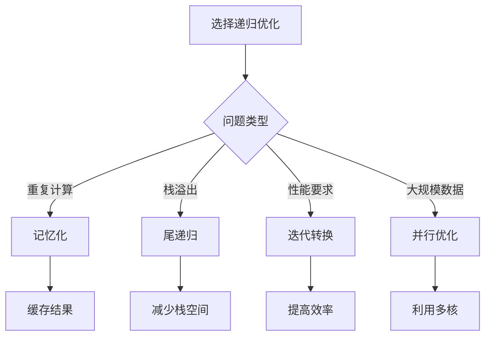

# 递归优化技巧

## 🎯 核心概念

**递归优化**是通过各种技术手段提高递归算法性能的方法，包括记忆化、尾递归、迭代转换等。

## 🔍 基本优化方法

### 1. 记忆化优化
```python
def fibonacci_memo(n, memo=None):
    """记忆化斐波那契 - O(n)"""
    if memo is None:
        memo = {}
    
    if n in memo:
        return memo[n]
    
    if n <= 1:
        memo[n] = n
        return n
    
    memo[n] = fibonacci_memo(n - 1, memo) + fibonacci_memo(n - 2, memo)
    return memo[n]

def factorial_memo(n, memo=None):
    """记忆化阶乘 - O(n)"""
    if memo is None:
        memo = {}
    
    if n in memo:
        return memo[n]
    
    if n <= 1:
        memo[n] = 1
        return 1
    
    memo[n] = n * factorial_memo(n - 1, memo)
    return memo[n]

def combination_memo(n, k, memo=None):
    """记忆化组合数 - O(n*k)"""
    if memo is None:
        memo = {}
    
    key = (n, k)
    if key in memo:
        return memo[key]
    
    if k == 0 or k == n:
        memo[key] = 1
        return 1
    
    memo[key] = combination_memo(n - 1, k - 1, memo) + combination_memo(n - 1, k, memo)
    return memo[key]
```

### 2. 尾递归优化
```python
def factorial_tail(n, accumulator=1):
    """尾递归阶乘 - O(n)"""
    if n <= 1:
        return accumulator
    
    return factorial_tail(n - 1, n * accumulator)

def fibonacci_tail(n, a=0, b=1):
    """尾递归斐波那契 - O(n)"""
    if n == 0:
        return a
    if n == 1:
        return b
    
    return fibonacci_tail(n - 1, b, a + b)

def sum_tail(arr, index=0, accumulator=0):
    """尾递归数组求和 - O(n)"""
    if index >= len(arr):
        return accumulator
    
    return sum_tail(arr, index + 1, accumulator + arr[index])

def reverse_tail(s, index=0, result=""):
    """尾递归字符串反转 - O(n)"""
    if index >= len(s):
        return result
    
    return reverse_tail(s, index + 1, s[index] + result)
```

### 3. 迭代转换
```python
def fibonacci_iterative(n):
    """迭代斐波那契 - O(n)"""
    if n <= 1:
        return n
    
    a, b = 0, 1
    for _ in range(2, n + 1):
        a, b = b, a + b
    
    return b

def factorial_iterative(n):
    """迭代阶乘 - O(n)"""
    if n <= 1:
        return 1
    
    result = 1
    for i in range(2, n + 1):
        result *= i
    
    return result

def power_iterative(base, exponent):
    """迭代幂运算 - O(log n)"""
    if exponent == 0:
        return 1
    
    result = 1
    while exponent > 0:
        if exponent % 2 == 1:
            result *= base
        base *= base
        exponent //= 2
    
    return result

def gcd_iterative(a, b):
    """迭代最大公约数 - O(log min(a,b))"""
    while b != 0:
        a, b = b, a % b
    return a
```

## 🎨 高级优化技巧

### 1. 动态规划优化
```python
def fibonacci_dp(n):
    """动态规划斐波那契 - O(n)"""
    if n <= 1:
        return n
    
    dp = [0] * (n + 1)
    dp[0] = 0
    dp[1] = 1
    
    for i in range(2, n + 1):
        dp[i] = dp[i - 1] + dp[i - 2]
    
    return dp[n]

def fibonacci_dp_optimized(n):
    """优化动态规划斐波那契 - O(n)"""
    if n <= 1:
        return n
    
    prev2, prev1 = 0, 1
    
    for i in range(2, n + 1):
        current = prev1 + prev2
        prev2, prev1 = prev1, current
    
    return prev1

def knapsack_dp(weights, values, capacity):
    """动态规划背包问题 - O(n*W)"""
    n = len(weights)
    dp = [[0 for _ in range(capacity + 1)] for _ in range(n + 1)]
    
    for i in range(1, n + 1):
        for w in range(1, capacity + 1):
            if weights[i - 1] <= w:
                dp[i][w] = max(dp[i - 1][w], 
                              values[i - 1] + dp[i - 1][w - weights[i - 1]])
            else:
                dp[i][w] = dp[i - 1][w]
    
    return dp[n][capacity]
```

### 2. 矩阵快速幂优化
```python
def fibonacci_matrix(n):
    """矩阵快速幂斐波那契 - O(log n)"""
    def matrix_multiply(a, b):
        return [[a[0][0]*b[0][0] + a[0][1]*b[1][0], a[0][0]*b[0][1] + a[0][1]*b[1][1]],
                [a[1][0]*b[0][0] + a[1][1]*b[1][0], a[1][0]*b[0][1] + a[1][1]*b[1][1]]]
    
    def matrix_power(matrix, n):
        if n == 1:
            return matrix
        
        if n % 2 == 0:
            half = matrix_power(matrix, n // 2)
            return matrix_multiply(half, half)
        else:
            return matrix_multiply(matrix, matrix_power(matrix, n - 1))
    
    if n <= 1:
        return n
    
    matrix = [[1, 1], [1, 0]]
    result = matrix_power(matrix, n - 1)
    return result[0][0]

def power_matrix(base, exponent):
    """矩阵快速幂 - O(log n)"""
    def matrix_multiply(a, b):
        return [[a[0][0]*b[0][0] + a[0][1]*b[1][0], a[0][0]*b[0][1] + a[0][1]*b[1][1]],
                [a[1][0]*b[0][0] + a[1][1]*b[1][0], a[1][0]*b[0][1] + a[1][1]*b[1][1]]]
    
    def matrix_power(matrix, n):
        if n == 1:
            return matrix
        
        if n % 2 == 0:
            half = matrix_power(matrix, n // 2)
            return matrix_multiply(half, half)
        else:
            return matrix_multiply(matrix, matrix_power(matrix, n - 1))
    
    if exponent == 0:
        return [[1, 0], [0, 1]]
    
    matrix = [[base, 0], [0, 1]]
    result = matrix_power(matrix, exponent)
    return result[0][0]
```

### 3. 缓存优化
```python
from functools import lru_cache

@lru_cache(maxsize=None)
def fibonacci_cache(n):
    """缓存斐波那契 - O(n)"""
    if n <= 1:
        return n
    
    return fibonacci_cache(n - 1) + fibonacci_cache(n - 2)

@lru_cache(maxsize=None)
def factorial_cache(n):
    """缓存阶乘 - O(n)"""
    if n <= 1:
        return 1
    
    return n * factorial_cache(n - 1)

@lru_cache(maxsize=None)
def combination_cache(n, k):
    """缓存组合数 - O(n*k)"""
    if k == 0 or k == n:
        return 1
    
    return combination_cache(n - 1, k - 1) + combination_cache(n - 1, k)

class MemoizedFunction:
    """自定义记忆化装饰器"""
    def __init__(self, func):
        self.func = func
        self.cache = {}
    
    def __call__(self, *args):
        if args in self.cache:
            return self.cache[args]
        
        result = self.func(*args)
        self.cache[args] = result
        return result

@MemoizedFunction
def fibonacci_custom(n):
    """自定义记忆化斐波那契 - O(n)"""
    if n <= 1:
        return n
    
    return fibonacci_custom(n - 1) + fibonacci_custom(n - 2)
```

## 🔍 递归优化策略

### 1. 剪枝优化
```python
def n_queens_optimized(n):
    """优化的N皇后问题 - O(n!)"""
    result = []
    
    def backtrack(row, cols, diagonals1, diagonals2):
        if row == n:
            result.append(cols[:])
            return
        
        for col in range(n):
            # 剪枝：检查列冲突
            if col in cols:
                continue
            
            # 剪枝：检查对角线冲突
            diagonal1 = row - col
            diagonal2 = row + col
            
            if diagonal1 in diagonals1 or diagonal2 in diagonals2:
                continue
            
            # 做出选择
            cols.append(col)
            diagonals1.add(diagonal1)
            diagonals2.add(diagonal2)
            
            # 递归
            backtrack(row + 1, cols, diagonals1, diagonals2)
            
            # 撤销选择
            cols.pop()
            diagonals1.remove(diagonal1)
            diagonals2.remove(diagonal2)
    
    backtrack(0, [], set(), set())
    return result

def sudoku_solver_optimized(board):
    """优化的数独求解器 - O(9^(n*n))"""
    def is_valid(board, row, col, num):
        # 检查行
        for c in range(9):
            if board[row][c] == num:
                return False
        
        # 检查列
        for r in range(9):
            if board[r][col] == num:
                return False
        
        # 检查3x3格子
        start_row, start_col = 3 * (row // 3), 3 * (col // 3)
        for r in range(start_row, start_row + 3):
            for c in range(start_col, start_col + 3):
                if board[r][c] == num:
                    return False
        
        return True
    
    def solve(board):
        for row in range(9):
            for col in range(9):
                if board[row][col] == '.':
                    for num in range(1, 10):
                        if is_valid(board, row, col, str(num)):
                            board[row][col] = str(num)
                            if solve(board):
                                return True
                            board[row][col] = '.'
                    return False
        return True
    
    solve(board)
    return board
```

### 2. 状态压缩优化
```python
def subset_sum_optimized(nums, target):
    """优化的子集和问题 - O(n*sum)"""
    n = len(nums)
    
    # 状态压缩：使用位掩码
    def backtrack(index, current_sum, mask):
        if current_sum == target:
            return True
        
        if index >= n or current_sum > target:
            return False
        
        # 不选择当前元素
        if backtrack(index + 1, current_sum, mask):
            return True
        
        # 选择当前元素
        if backtrack(index + 1, current_sum + nums[index], mask | (1 << index)):
            return True
        
        return False
    
    return backtrack(0, 0, 0)

def permutation_optimized(nums):
    """优化的排列生成 - O(n!)"""
    result = []
    n = len(nums)
    
    def backtrack(mask, current):
        if len(current) == n:
            result.append(current[:])
            return
        
        for i in range(n):
            if not (mask & (1 << i)):
                current.append(nums[i])
                backtrack(mask | (1 << i), current)
                current.pop()
    
    backtrack(0, [])
    return result
```

### 3. 并行优化
```python
import concurrent.futures
import multiprocessing

def fibonacci_parallel(n):
    """并行斐波那契 - O(log n)"""
    def fibonacci_worker(n):
        if n <= 1:
            return n
        
        with concurrent.futures.ThreadPoolExecutor(max_workers=2) as executor:
            future1 = executor.submit(fibonacci_parallel, n - 1)
            future2 = executor.submit(fibonacci_parallel, n - 2)
            
            return future1.result() + future2.result()
    
    return fibonacci_worker(n)

def merge_sort_parallel(arr):
    """并行归并排序 - O(n log n)"""
    if len(arr) <= 1:
        return arr
    
    mid = len(arr) // 2
    left = arr[:mid]
    right = arr[mid:]
    
    with concurrent.futures.ThreadPoolExecutor(max_workers=2) as executor:
        future1 = executor.submit(merge_sort_parallel, left)
        future2 = executor.submit(merge_sort_parallel, right)
        
        left_sorted = future1.result()
        right_sorted = future2.result()
    
    return merge(left_sorted, right_sorted)

def merge(left, right):
    """合并两个有序数组 - O(n)"""
    result = []
    i = j = 0
    
    while i < len(left) and j < len(right):
        if left[i] <= right[j]:
            result.append(left[i])
            i += 1
        else:
            result.append(right[j])
            j += 1
    
    result.extend(left[i:])
    result.extend(right[j:])
    
    return result
```

## 📈 优化效果分析

### 性能对比
| 算法 | 原始复杂度 | 优化后复杂度 | 优化方法 | 提升倍数 |
|------|------------|--------------|----------|----------|
| 斐波那契 | O(2^n) | O(n) | 记忆化 | 2^n/n |
| 阶乘 | O(n) | O(n) | 尾递归 | 1 |
| 幂运算 | O(n) | O(log n) | 快速幂 | n/log n |
| 组合数 | O(2^n) | O(n*k) | 动态规划 | 2^n/(n*k) |

### 空间复杂度对比
| 算法 | 原始空间 | 优化后空间 | 优化方法 | 空间变化 |
|------|----------|------------|----------|----------|
| 斐波那契 | O(n) | O(n) | 记忆化 | 不变 |
| 阶乘 | O(n) | O(1) | 尾递归 | 减少 |
| 幂运算 | O(n) | O(1) | 迭代 | 减少 |
| 组合数 | O(n) | O(n*k) | 动态规划 | 增加 |

## 🎯 优化选择指南

### 选择原则
| 问题类型 | 推荐优化 | 原因 |
|----------|----------|------|
| 重复计算 | 记忆化 | 避免重复计算 |
| 栈溢出 | 尾递归 | 减少栈空间 |
| 性能要求 | 迭代转换 | 提高执行效率 |
| 大规模数据 | 并行优化 | 利用多核 |

### 优化策略


## 🔗 相关概念

### 递归原理
- **关系**：递归优化基于递归原理
- **链接**：[[01-递归原理]]

### 递归模板
- **关系**：递归优化模板
- **链接**：[[02-递归模板]]

### 具体实现
- **关系**：递归优化的具体应用
- **链接**：[[03-分治策略]]、[[05-经典递归问题]]

## 📚 学习建议

### 费曼学习法
1. **选择概念**：递归优化
2. **教授他人**：解释递归优化
3. **回顾简化**：找出理解不足
4. **重新组织**：用更简单的方式表达

### 刻意练习
1. **优化练习**：掌握各种递归优化
2. **算法练习**：实现优化算法
3. **应用练习**：解决实际问题
4. **性能练习**：优化算法性能

## 🔗 相关链接
- [[01-递归原理]] - 递归的基本原理
- [[02-递归模板]] - 递归的实现模板
- [[03-分治策略]] - 分治算法策略
- [[05-经典递归问题]] - 经典递归问题
