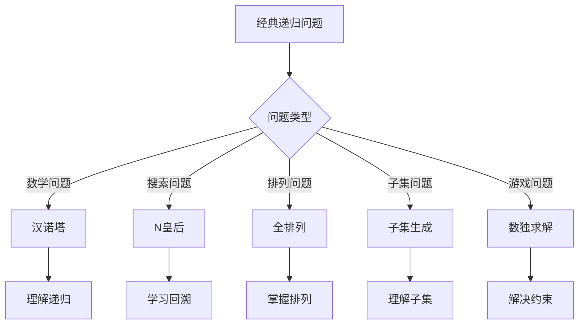

# 经典递归问题

## 🎯 核心概念

**经典递归问题**是递归算法中的经典案例，包括汉诺塔、N皇后、全排列等，是学习递归的重要素材。

## 🔍 基本问题分类

### 1. 数学问题
- **汉诺塔**：移动圆盘问题
- **斐波那契**：数列计算
- **阶乘**：数学计算
- **组合数**：数学组合

### 2. 搜索问题
- **N皇后**：棋盘放置问题
- **全排列**：元素排列
- **子集生成**：集合子集
- **数独求解**：数独游戏

### 3. 树问题
- **树遍历**：前中后序遍历
- **树搜索**：节点查找
- **树路径**：路径问题
- **树构建**：树构建

## 📊 经典问题实现

### 1. 汉诺塔问题
```python
def hanoi(n, source, destination, auxiliary):
    """汉诺塔问题 - O(2^n)"""
    if n == 1:
        print(f"Move disk 1 from {source} to {destination}")
        return
    
    # 将n-1个盘子从source移动到auxiliary
    hanoi(n - 1, source, auxiliary, destination)
    
    # 将最大的盘子从source移动到destination
    print(f"Move disk {n} from {source} to {destination}")
    
    # 将n-1个盘子从auxiliary移动到destination
    hanoi(n - 1, auxiliary, destination, source)

def hanoi_count(n):
    """汉诺塔移动次数 - O(1)"""
    return 2**n - 1

def hanoi_iterative(n, source, destination, auxiliary):
    """迭代汉诺塔 - O(2^n)"""
    stack = [(n, source, destination, auxiliary)]
    
    while stack:
        n, source, destination, auxiliary = stack.pop()
        
        if n == 1:
            print(f"Move disk 1 from {source} to {destination}")
        else:
            # 注意：栈是后进先出，所以顺序要相反
            stack.append((n - 1, auxiliary, destination, source))
            stack.append((1, source, destination, auxiliary))
            stack.append((n - 1, source, auxiliary, destination))
```

### 2. N皇后问题
```python
def n_queens(n):
    """N皇后问题 - O(n!)"""
    result = []
    
    def backtrack(row, cols, diagonals1, diagonals2):
        if row == n:
            result.append(cols[:])
            return
        
        for col in range(n):
            # 检查列冲突
            if col in cols:
                continue
            
            # 检查对角线冲突
            diagonal1 = row - col
            diagonal2 = row + col
            
            if diagonal1 in diagonals1 or diagonal2 in diagonals2:
                continue
            
            # 做出选择
            cols.append(col)
            diagonals1.add(diagonal1)
            diagonals2.add(diagonal2)
            
            # 递归
            backtrack(row + 1, cols, diagonals1, diagonals2)
            
            # 撤销选择
            cols.pop()
            diagonals1.remove(diagonal1)
            diagonals2.remove(diagonal2)
    
    backtrack(0, [], set(), set())
    return result

def n_queens_count(n):
    """N皇后解的数量 - O(n!)"""
    count = 0
    
    def backtrack(row, cols, diagonals1, diagonals2):
        nonlocal count
        
        if row == n:
            count += 1
            return
        
        for col in range(n):
            if col in cols:
                continue
            
            diagonal1 = row - col
            diagonal2 = row + col
            
            if diagonal1 in diagonals1 or diagonal2 in diagonals2:
                continue
            
            cols.append(col)
            diagonals1.add(diagonal1)
            diagonals2.add(diagonal2)
            
            backtrack(row + 1, cols, diagonals1, diagonals2)
            
            cols.pop()
            diagonals1.remove(diagonal1)
            diagonals2.remove(diagonal2)
    
    backtrack(0, [], set(), set())
    return count
```

### 3. 全排列问题
```python
def permutations(nums):
    """全排列 - O(n!)"""
    result = []
    
    def backtrack(current_permutation, remaining_elements):
        if not remaining_elements:
            result.append(current_permutation[:])
            return
        
        for i, element in enumerate(remaining_elements):
            current_permutation.append(element)
            backtrack(current_permutation, remaining_elements[:i] + remaining_elements[i+1:])
            current_permutation.pop()
    
    backtrack([], nums)
    return result

def permutations_swap(nums):
    """交换法全排列 - O(n!)"""
    result = []
    
    def backtrack(start):
        if start == len(nums):
            result.append(nums[:])
            return
        
        for i in range(start, len(nums)):
            nums[start], nums[i] = nums[i], nums[start]
            backtrack(start + 1)
            nums[start], nums[i] = nums[i], nums[start]
    
    backtrack(0)
    return result

def next_permutation(nums):
    """下一个排列 - O(n)"""
    n = len(nums)
    
    # 从右往左找到第一个下降的位置
    i = n - 2
    while i >= 0 and nums[i] >= nums[i + 1]:
        i -= 1
    
    if i >= 0:
        # 从右往左找到第一个大于nums[i]的位置
        j = n - 1
        while j > i and nums[j] <= nums[i]:
            j -= 1
        
        # 交换
        nums[i], nums[j] = nums[j], nums[i]
    
    # 反转i+1到末尾
    nums[i+1:] = nums[i+1:][::-1]
    
    return nums
```

### 4. 子集生成问题
```python
def subsets(nums):
    """子集生成 - O(2^n)"""
    result = []
    
    def backtrack(start, current_subset):
        result.append(current_subset[:])
        
        for i in range(start, len(nums)):
            current_subset.append(nums[i])
            backtrack(i + 1, current_subset)
            current_subset.pop()
    
    backtrack(0, [])
    return result

def subsets_bitmask(nums):
    """位掩码子集生成 - O(2^n)"""
    result = []
    n = len(nums)
    
    for mask in range(1 << n):
        subset = []
        for i in range(n):
            if mask & (1 << i):
                subset.append(nums[i])
        result.append(subset)
    
    return result

def subsets_with_duplicates(nums):
    """包含重复元素的子集 - O(2^n)"""
    result = []
    nums.sort()  # 排序以便去重
    
    def backtrack(start, current_subset):
        result.append(current_subset[:])
        
        for i in range(start, len(nums)):
            # 跳过重复元素
            if i > start and nums[i] == nums[i - 1]:
                continue
            
            current_subset.append(nums[i])
            backtrack(i + 1, current_subset)
            current_subset.pop()
    
    backtrack(0, [])
    return result
```

### 5. 数独求解问题
```python
def solve_sudoku(board):
    """数独求解 - O(9^(n*n))"""
    def is_valid(board, row, col, num):
        # 检查行
        for c in range(9):
            if board[row][c] == num:
                return False
        
        # 检查列
        for r in range(9):
            if board[r][col] == num:
                return False
        
        # 检查3x3格子
        start_row, start_col = 3 * (row // 3), 3 * (col // 3)
        for r in range(start_row, start_row + 3):
            for c in range(start_col, start_col + 3):
                if board[r][c] == num:
                    return False
        
        return True
    
    def solve(board):
        for row in range(9):
            for col in range(9):
                if board[row][col] == '.':
                    for num in range(1, 10):
                        if is_valid(board, row, col, str(num)):
                            board[row][col] = str(num)
                            if solve(board):
                                return True
                            board[row][col] = '.'
                    return False
        return True
    
    solve(board)
    return board

def sudoku_count_solutions(board):
    """数独解的数量 - O(9^(n*n))"""
    count = 0
    
    def is_valid(board, row, col, num):
        for c in range(9):
            if board[row][c] == num:
                return False
        
        for r in range(9):
            if board[r][col] == num:
                return False
        
        start_row, start_col = 3 * (row // 3), 3 * (col // 3)
        for r in range(start_row, start_row + 3):
            for c in range(start_col, start_col + 3):
                if board[r][c] == num:
                    return False
        
        return True
    
    def solve(board):
        nonlocal count
        
        for row in range(9):
            for col in range(9):
                if board[row][col] == '.':
                    for num in range(1, 10):
                        if is_valid(board, row, col, str(num)):
                            board[row][col] = str(num)
                            solve(board)
                            board[row][col] = '.'
                    return
        
        count += 1
    
    solve(board)
    return count
```

## 🎨 高级递归问题

### 1. 组合问题
```python
def combinations(n, k):
    """组合数 - O(2^n)"""
    result = []
    
    def backtrack(start, current_combination):
        if len(current_combination) == k:
            result.append(current_combination[:])
            return
        
        for i in range(start, n + 1):
            current_combination.append(i)
            backtrack(i + 1, current_combination)
            current_combination.pop()
    
    backtrack(1, [])
    return result

def combination_sum(candidates, target):
    """组合和 - O(2^n)"""
    result = []
    candidates.sort()
    
    def backtrack(start, current_combination, remaining_target):
        if remaining_target == 0:
            result.append(current_combination[:])
            return
        
        for i in range(start, len(candidates)):
            if candidates[i] > remaining_target:
                break
            
            current_combination.append(candidates[i])
            backtrack(i, current_combination, remaining_target - candidates[i])
            current_combination.pop()
    
    backtrack(0, [], target)
    return result
```

### 2. 路径问题
```python
def unique_paths(m, n):
    """唯一路径 - O(m*n)"""
    def backtrack(row, col):
        if row == m - 1 and col == n - 1:
            return 1
        
        if row >= m or col >= n:
            return 0
        
        return backtrack(row + 1, col) + backtrack(row, col + 1)
    
    return backtrack(0, 0)

def unique_paths_with_obstacles(obstacle_grid):
    """带障碍的唯一路径 - O(m*n)"""
    m, n = len(obstacle_grid), len(obstacle_grid[0])
    
    def backtrack(row, col):
        if row >= m or col >= n or obstacle_grid[row][col] == 1:
            return 0
        
        if row == m - 1 and col == n - 1:
            return 1
        
        return backtrack(row + 1, col) + backtrack(row, col + 1)
    
    return backtrack(0, 0)

def word_search(board, word):
    """单词搜索 - O(m*n*4^k)"""
    m, n = len(board), len(board[0])
    
    def backtrack(row, col, index):
        if index == len(word):
            return True
        
        if (row < 0 or row >= m or col < 0 or col >= n or 
            board[row][col] != word[index]):
            return False
        
        # 标记已访问
        temp = board[row][col]
        board[row][col] = '#'
        
        # 四个方向搜索
        found = (backtrack(row + 1, col, index + 1) or
                 backtrack(row - 1, col, index + 1) or
                 backtrack(row, col + 1, index + 1) or
                 backtrack(row, col - 1, index + 1))
        
        # 恢复
        board[row][col] = temp
        
        return found
    
    for i in range(m):
        for j in range(n):
            if backtrack(i, j, 0):
                return True
    
    return False
```

### 3. 括号问题
```python
def generate_parentheses(n):
    """生成括号 - O(4^n)"""
    result = []
    
    def backtrack(current, open_count, close_count):
        if len(current) == 2 * n:
            result.append(current)
            return
        
        if open_count < n:
            backtrack(current + '(', open_count + 1, close_count)
        
        if close_count < open_count:
            backtrack(current + ')', open_count, close_count + 1)
    
    backtrack('', 0, 0)
    return result

def valid_parentheses(s):
    """有效括号 - O(n)"""
    def backtrack(s, index, open_count):
        if index == len(s):
            return open_count == 0
        
        if s[index] == '(':
            return backtrack(s, index + 1, open_count + 1)
        elif s[index] == ')':
            if open_count == 0:
                return False
            return backtrack(s, index + 1, open_count - 1)
        else:
            return backtrack(s, index + 1, open_count)
    
    return backtrack(s, 0, 0)

def min_add_to_make_valid(s):
    """最小添加使括号有效 - O(n)"""
    def backtrack(s, index, open_count, additions):
        if index == len(s):
            return additions + open_count
        
        if s[index] == '(':
            return backtrack(s, index + 1, open_count + 1, additions)
        elif s[index] == ')':
            if open_count > 0:
                return backtrack(s, index + 1, open_count - 1, additions)
            else:
                return backtrack(s, index + 1, open_count, additions + 1)
        else:
            return backtrack(s, index + 1, open_count, additions)
    
    return backtrack(s, 0, 0, 0)
```

## 📈 问题复杂度分析

### 时间复杂度分析
| 问题 | 时间复杂度 | 说明 |
|------|------------|------|
| 汉诺塔 | O(2^n) | 每次分裂为2个子问题 |
| N皇后 | O(n!) | 每行有n种选择 |
| 全排列 | O(n!) | n个元素的全排列 |
| 子集生成 | O(2^n) | 每个元素选或不选 |
| 数独求解 | O(9^(n*n)) | 每个空位有9种选择 |

### 空间复杂度分析
| 问题 | 空间复杂度 | 说明 |
|------|------------|------|
| 汉诺塔 | O(n) | 递归深度为n |
| N皇后 | O(n) | 递归深度为n |
| 全排列 | O(n) | 递归深度为n |
| 子集生成 | O(n) | 递归深度为n |
| 数独求解 | O(n*n) | 递归深度为n*n |

## 🎯 问题选择指南

### 选择原则
| 问题类型 | 推荐问题 | 原因 |
|----------|----------|------|
| 数学问题 | 汉诺塔 | 经典递归 |
| 搜索问题 | N皇后 | 回溯算法 |
| 排列问题 | 全排列 | 组合数学 |
| 子集问题 | 子集生成 | 集合论 |
| 游戏问题 | 数独求解 | 约束满足 |

### 学习顺序


## 🔗 相关概念

### 递归原理
- **关系**：经典递归问题基于递归原理
- **链接**：[[01-递归原理]]

### 递归模板
- **关系**：经典递归问题使用递归模板
- **链接**：[[02-递归模板]]

### 具体实现
- **关系**：经典递归问题的具体应用
- **链接**：[[03-分治策略]]、[[04-递归优化技巧]]

## 📚 学习建议

### 费曼学习法
1. **选择概念**：经典递归问题
2. **教授他人**：解释经典递归问题
3. **回顾简化**：找出理解不足
4. **重新组织**：用更简单的方式表达

### 刻意练习
1. **问题练习**：掌握各种经典递归问题
2. **算法练习**：实现经典递归算法
3. **应用练习**：解决实际问题
4. **优化练习**：优化经典递归算法

## 🔗 相关链接
- [[01-递归原理]] - 递归的基本原理
- [[02-递归模板]] - 递归的实现模板
- [[03-分治策略]] - 分治算法策略
- [[04-递归优化技巧]] - 递归优化方法
