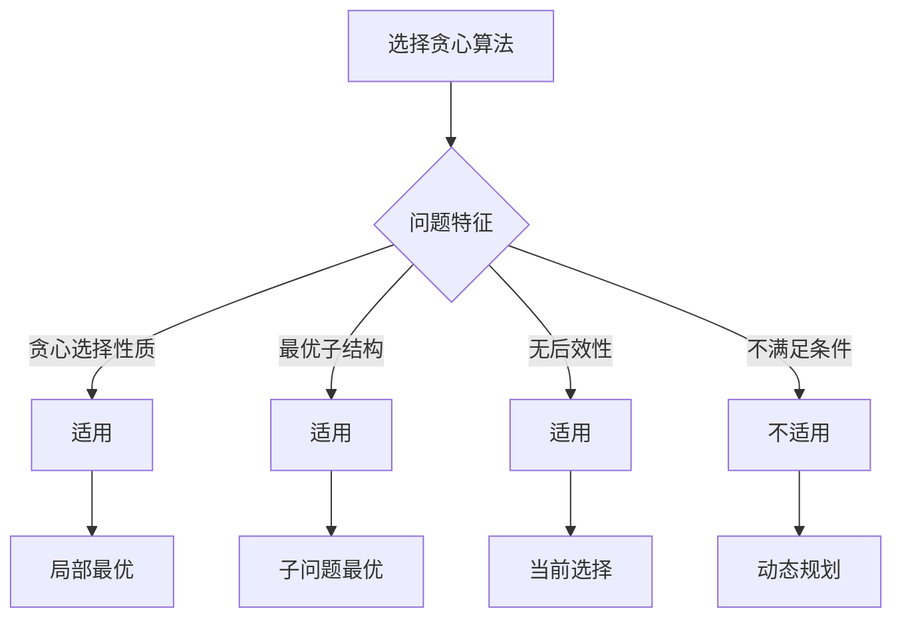

# 贪心算法原理

## 🎯 核心概念

**贪心算法**是一种在每一步都做出局部最优选择的算法设计策略，希望通过局部最优选择达到全局最优解。

## 🔍 基本定义

### 贪心算法的基本概念
- **贪心选择**：每一步都做出当前看起来最好的选择
- **最优子结构**：问题的最优解包含子问题的最优解
- **无后效性**：当前选择不会影响之前的选择
- **局部最优**：每次选择都是当前状态下的最优选择

### 贪心算法的基本要素
| 要素 | 描述 | 示例 |
|------|------|------|
| 贪心选择 | 每一步都做出最优选择 | 选择最小的边 |
| 最优子结构 | 问题可以分解为子问题 | 最小生成树 |
| 无后效性 | 当前选择不影响之前 | 活动选择 |
| 局部最优 | 每次选择都是最优的 | 最短路径 |

## 📊 贪心算法实现

### 1. 基本贪心模板
```python
def greedy_algorithm(problem):
    """贪心算法基本模板"""
    # 1. 排序或预处理
    problem.sort()
    
    # 2. 贪心选择
    result = []
    for item in problem:
        if is_valid_choice(item, result):
            result.append(item)
    
    return result

def is_valid_choice(item, current_result):
    """判断选择是否有效"""
    # 根据具体问题实现
    return True
```

### 2. 经典贪心算法
```python
def activity_selection(activities):
    """活动选择问题 - O(n log n)"""
    # 按结束时间排序
    activities.sort(key=lambda x: x[1])
    
    result = [activities[0]]
    last_end_time = activities[0][1]
    
    for i in range(1, len(activities)):
        if activities[i][0] >= last_end_time:
            result.append(activities[i])
            last_end_time = activities[i][1]
    
    return result

def fractional_knapsack(weights, values, capacity):
    """分数背包问题 - O(n log n)"""
    n = len(weights)
    items = [(values[i] / weights[i], weights[i], values[i]) for i in range(n)]
    items.sort(reverse=True)  # 按价值密度排序
    
    total_value = 0
    result = []
    
    for density, weight, value in items:
        if capacity >= weight:
            # 完全装入
            total_value += value
            capacity -= weight
            result.append((weight, value, 1.0))
        else:
            # 部分装入
            fraction = capacity / weight
            total_value += value * fraction
            result.append((capacity, value * fraction, fraction))
            break
    
    return total_value, result

def huffman_coding(frequencies):
    """霍夫曼编码 - O(n log n)"""
    import heapq
    
    # 创建优先队列
    heap = [(freq, i, None, None) for i, freq in enumerate(frequencies)]
    heapq.heapify(heap)
    
    # 构建霍夫曼树
    while len(heap) > 1:
        left = heapq.heappop(heap)
        right = heapq.heappop(heap)
        
        merged = (left[0] + right[0], len(frequencies), left, right)
        heapq.heappush(heap, merged)
    
    # 生成编码
    codes = {}
    
    def generate_codes(node, code=""):
        if node[2] is None and node[3] is None:  # 叶子节点
            codes[node[1]] = code
        else:
            if node[2] is not None:
                generate_codes(node[2], code + "0")
            if node[3] is not None:
                generate_codes(node[3], code + "1")
    
    generate_codes(heap[0])
    return codes
```

### 3. 贪心搜索算法
```python
def dijkstra_shortest_path(graph, start):
    """Dijkstra最短路径 - O((V + E) log V)"""
    import heapq
    
    distances = {node: float('inf') for node in graph}
    distances[start] = 0
    previous = {node: None for node in graph}
    
    # 优先队列：(距离, 节点)
    pq = [(0, start)]
    visited = set()
    
    while pq:
        current_distance, current_node = heapq.heappop(pq)
        
        if current_node in visited:
            continue
        
        visited.add(current_node)
        
        for neighbor, weight in graph[current_node].items():
            if neighbor in visited:
                continue
            
            new_distance = current_distance + weight
            
            if new_distance < distances[neighbor]:
                distances[neighbor] = new_distance
                previous[neighbor] = current_node
                heapq.heappush(pq, (new_distance, neighbor))
    
    return distances, previous

def prim_mst(graph):
    """Prim最小生成树 - O((V + E) log V)"""
    import heapq
    
    mst = []
    visited = set()
    start = next(iter(graph))
    
    # 优先队列：(权重, 起点, 终点)
    pq = [(0, None, start)]
    
    while pq:
        weight, from_node, to_node = heapq.heappop(pq)
        
        if to_node in visited:
            continue
        
        visited.add(to_node)
        
        if from_node is not None:
            mst.append((from_node, to_node, weight))
        
        for neighbor, edge_weight in graph[to_node].items():
            if neighbor not in visited:
                heapq.heappush(pq, (edge_weight, to_node, neighbor))
    
    return mst
```

## 🎨 贪心算法应用

### 1. 区间问题
```python
def merge_intervals(intervals):
    """合并区间 - O(n log n)"""
    if not intervals:
        return []
    
    # 按开始时间排序
    intervals.sort(key=lambda x: x[0])
    
    merged = [intervals[0]]
    
    for current in intervals[1:]:
        last = merged[-1]
        
        if current[0] <= last[1]:
            # 重叠，合并
            merged[-1] = (last[0], max(last[1], current[1]))
        else:
            # 不重叠，添加新区间
            merged.append(current)
    
    return merged

def interval_scheduling(intervals):
    """区间调度 - O(n log n)"""
    # 按结束时间排序
    intervals.sort(key=lambda x: x[1])
    
    result = [intervals[0]]
    last_end_time = intervals[0][1]
    
    for interval in intervals[1:]:
        if interval[0] >= last_end_time:
            result.append(interval)
            last_end_time = interval[1]
    
    return result

def minimum_meeting_rooms(intervals):
    """最少会议室 - O(n log n)"""
    import heapq
    
    if not intervals:
        return 0
    
    # 按开始时间排序
    intervals.sort(key=lambda x: x[0])
    
    # 优先队列存储结束时间
    heap = [intervals[0][1]]
    
    for start, end in intervals[1:]:
        if start >= heap[0]:
            # 可以复用会议室
            heapq.heappop(heap)
        
        heapq.heappush(heap, end)
    
    return len(heap)
```

### 2. 字符串问题
```python
def minimum_deletions_to_make_valid_parentheses(s):
    """最少删除使括号有效 - O(n)"""
    open_count = 0
    result = []
    
    # 第一遍：删除多余的右括号
    for char in s:
        if char == '(':
            open_count += 1
            result.append(char)
        elif char == ')':
            if open_count > 0:
                open_count -= 1
                result.append(char)
            # 否则删除这个右括号
    
    # 第二遍：删除多余的左括号
    final_result = []
    open_count = 0
    
    for char in reversed(result):
        if char == ')':
            open_count += 1
            final_result.append(char)
        elif char == '(':
            if open_count > 0:
                open_count -= 1
                final_result.append(char)
            # 否则删除这个左括号
    
    return ''.join(reversed(final_result))

def reorganize_string(s):
    """重新排列字符串 - O(n log n)"""
    from collections import Counter
    import heapq
    
    count = Counter(s)
    
    # 优先队列：(负数频率, 字符)
    heap = [(-freq, char) for char, freq in count.items()]
    heapq.heapify(heap)
    
    result = []
    prev_char = None
    prev_freq = 0
    
    while heap:
        freq, char = heapq.heappop(heap)
        
        result.append(char)
        freq += 1
        
        if prev_freq < 0:
            heapq.heappush(heap, (prev_freq, prev_char))
        
        prev_char = char
        prev_freq = freq
    
    return ''.join(result) if len(result) == len(s) else ""
```

### 3. 数组问题
```python
def jump_game(nums):
    """跳跃游戏 - O(n)"""
    max_reach = 0
    
    for i in range(len(nums)):
        if i > max_reach:
            return False
        
        max_reach = max(max_reach, i + nums[i])
        
        if max_reach >= len(nums) - 1:
            return True
    
    return True

def jump_game_ii(nums):
    """跳跃游戏II - O(n)"""
    if len(nums) <= 1:
        return 0
    
    jumps = 0
    current_end = 0
    farthest = 0
    
    for i in range(len(nums) - 1):
        farthest = max(farthest, i + nums[i])
        
        if i == current_end:
            jumps += 1
            current_end = farthest
    
    return jumps

def gas_station(gas, cost):
    """加油站 - O(n)"""
    total_tank = 0
    current_tank = 0
    start_station = 0
    
    for i in range(len(gas)):
        total_tank += gas[i] - cost[i]
        current_tank += gas[i] - cost[i]
        
        if current_tank < 0:
            start_station = i + 1
            current_tank = 0
    
    return start_station if total_tank >= 0 else -1
```

## 🔍 贪心算法分析

### 1. 正确性证明
```python
def prove_greedy_correctness():
    """贪心算法正确性证明方法"""
    # 1. 贪心选择性质：局部最优选择能导致全局最优解
    # 2. 最优子结构：问题的最优解包含子问题的最优解
    # 3. 交换论证：证明贪心选择不会使解变差
    # 4. 归纳证明：证明贪心选择在每一步都是正确的
    
    pass

def exchange_argument_example():
    """交换论证示例：活动选择问题"""
    # 假设存在一个最优解S，其中第一个活动不是最早结束的活动
    # 设S中的第一个活动是a，最早结束的活动是b
    # 我们可以用b替换a，得到一个新的解S'
    # 由于b的结束时间不晚于a，S'仍然是有效的
    # 因此，选择最早结束的活动不会使解变差
    
    pass
```

### 2. 复杂度分析
```python
def analyze_greedy_complexity():
    """贪心算法复杂度分析"""
    # 1. 排序：O(n log n)
    # 2. 贪心选择：O(n)
    # 3. 总复杂度：O(n log n)
    
    pass
```

## 📈 贪心算法性能分析

### 时间复杂度分析
| 算法 | 时间复杂度 | 说明 |
|------|------------|------|
| 活动选择 | O(n log n) | 排序 + 贪心选择 |
| 分数背包 | O(n log n) | 排序 + 贪心选择 |
| 霍夫曼编码 | O(n log n) | 优先队列 |
| Dijkstra | O((V + E) log V) | 优先队列 |
| Prim | O((V + E) log V) | 优先队列 |

### 空间复杂度分析
| 算法 | 空间复杂度 | 说明 |
|------|------------|------|
| 活动选择 | O(1) | 原地排序 |
| 分数背包 | O(n) | 存储结果 |
| 霍夫曼编码 | O(n) | 存储编码 |
| Dijkstra | O(V) | 存储距离 |
| Prim | O(V) | 存储MST |

## 🎯 贪心算法应用

### 1. 基础应用
- **活动选择**：会议安排
- **分数背包**：资源分配
- **霍夫曼编码**：数据压缩
- **最小生成树**：网络设计

### 2. 算法应用
- **最短路径**：Dijkstra算法
- **最小生成树**：Prim、Kruskal算法
- **区间调度**：任务安排
- **字符串处理**：括号匹配

### 3. 实际应用
- **网络路由**：最短路径
- **任务调度**：CPU调度
- **资源分配**：背包问题
- **数据压缩**：霍夫曼编码

## 📊 贪心算法选择指南

### 选择原则
| 问题类型 | 推荐算法 | 原因 |
|----------|----------|------|
| 区间问题 | 贪心选择 | 局部最优 |
| 优化问题 | 贪心搜索 | 高效求解 |
| 调度问题 | 贪心调度 | 简单有效 |
| 路径问题 | 贪心路径 | 快速收敛 |

### 适用条件


## 🔗 相关概念

### 递归原理
- **关系**：贪心算法可能使用递归
- **链接**：[[01-递归原理]]

### 动态规划
- **关系**：贪心算法是动态规划的特例
- **链接**：[[03-动态规划原理]]

### 具体实现
- **关系**：贪心算法的具体应用
- **链接**：[[02-贪心算法模板]]、[[04-贪心算法应用]]

## 📚 学习建议

### 费曼学习法
1. **选择概念**：贪心算法
2. **教授他人**：解释贪心算法
3. **回顾简化**：找出理解不足
4. **重新组织**：用更简单的方式表达

### 刻意练习
1. **算法练习**：掌握各种贪心算法
2. **应用练习**：解决实际问题
3. **证明练习**：证明贪心算法正确性
4. **优化练习**：优化贪心算法性能

## 🔗 相关链接
- [[01-递归原理]] - 递归的基本原理
- [[02-贪心算法模板]] - 贪心算法的实现模板
- [[03-动态规划原理]] - 动态规划算法
- [[04-贪心算法应用]] - 贪心算法的具体应用
