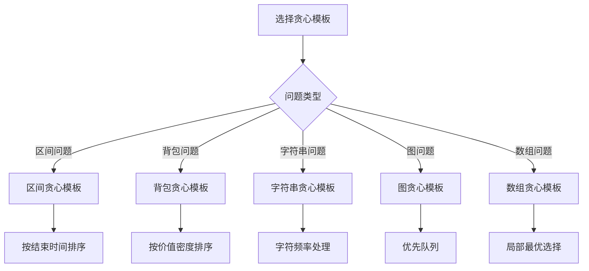

# 贪心算法模板

## 🎯 核心概念

**贪心算法模板**是解决贪心问题的标准化框架，提供通用的解题思路和代码结构。

## 🔍 基本模板

### 1. 基础贪心模板
```python
def greedy_template(problem):
    """贪心算法基础模板"""
    # 1. 排序或预处理
    problem.sort()
    
    # 2. 贪心选择
    result = []
    for item in problem:
        if is_valid_choice(item, result):
            result.append(item)
    
    return result

def is_valid_choice(item, current_result):
    """判断选择是否有效"""
    # 根据具体问题实现
    return True
```

### 2. 区间贪心模板
```python
def interval_greedy_template(intervals):
    """区间贪心模板"""
    # 1. 排序
    intervals.sort(key=lambda x: x[1])  # 按结束时间排序
    
    # 2. 贪心选择
    result = [intervals[0]]
    last_end_time = intervals[0][1]
    
    for interval in intervals[1:]:
        if interval[0] >= last_end_time:
            result.append(interval)
            last_end_time = interval[1]
    
    return result
```

### 3. 背包贪心模板
```python
def knapsack_greedy_template(weights, values, capacity):
    """背包贪心模板"""
    # 1. 计算价值密度并排序
    items = [(values[i] / weights[i], weights[i], values[i]) for i in range(len(weights))]
    items.sort(reverse=True)  # 按价值密度降序排序
    
    # 2. 贪心选择
    total_value = 0
    result = []
    
    for density, weight, value in items:
        if capacity >= weight:
            # 完全装入
            total_value += value
            capacity -= weight
            result.append((weight, value, 1.0))
        else:
            # 部分装入
            fraction = capacity / weight
            total_value += value * fraction
            result.append((capacity, value * fraction, fraction))
            break
    
    return total_value, result
```

## 📊 具体应用模板

### 1. 活动选择模板
```python
def activity_selection_template(activities):
    """活动选择模板 - O(n log n)"""
    # 按结束时间排序
    activities.sort(key=lambda x: x[1])
    
    result = [activities[0]]
    last_end_time = activities[0][1]
    
    for i in range(1, len(activities)):
        if activities[i][0] >= last_end_time:
            result.append(activities[i])
            last_end_time = activities[i][1]
    
    return result

def activity_selection_count(activities):
    """活动选择数量模板 - O(n log n)"""
    activities.sort(key=lambda x: x[1])
    
    count = 1
    last_end_time = activities[0][1]
    
    for i in range(1, len(activities)):
        if activities[i][0] >= last_end_time:
            count += 1
            last_end_time = activities[i][1]
    
    return count

def activity_selection_weighted(activities):
    """加权活动选择模板 - O(n log n)"""
    activities.sort(key=lambda x: x[1])
    
    # 使用动态规划解决加权版本
    n = len(activities)
    dp = [0] * n
    dp[0] = activities[0][2]  # 权重
    
    for i in range(1, n):
        # 不选择当前活动
        dp[i] = dp[i - 1]
        
        # 选择当前活动
        for j in range(i - 1, -1, -1):
            if activities[j][1] <= activities[i][0]:
                dp[i] = max(dp[i], dp[j] + activities[i][2])
                break
    
    return dp[n - 1]
```

### 2. 区间调度模板
```python
def interval_scheduling_template(intervals):
    """区间调度模板 - O(n log n)"""
    intervals.sort(key=lambda x: x[1])
    
    result = [intervals[0]]
    last_end_time = intervals[0][1]
    
    for interval in intervals[1:]:
        if interval[0] >= last_end_time:
            result.append(interval)
            last_end_time = interval[1]
    
    return result

def interval_merging_template(intervals):
    """区间合并模板 - O(n log n)"""
    if not intervals:
        return []
    
    intervals.sort(key=lambda x: x[0])
    
    merged = [intervals[0]]
    
    for current in intervals[1:]:
        last = merged[-1]
        
        if current[0] <= last[1]:
            # 重叠，合并
            merged[-1] = (last[0], max(last[1], current[1]))
        else:
            # 不重叠，添加新区间
            merged.append(current)
    
    return merged

def interval_insertion_template(intervals, new_interval):
    """区间插入模板 - O(n log n)"""
    intervals.append(new_interval)
    intervals.sort(key=lambda x: x[0])
    
    merged = [intervals[0]]
    
    for current in intervals[1:]:
        last = merged[-1]
        
        if current[0] <= last[1]:
            merged[-1] = (last[0], max(last[1], current[1]))
        else:
            merged.append(current)
    
    return merged
```

### 3. 字符串贪心模板
```python
def parentheses_greedy_template(s):
    """括号贪心模板 - O(n)"""
    open_count = 0
    result = []
    
    # 第一遍：删除多余的右括号
    for char in s:
        if char == '(':
            open_count += 1
            result.append(char)
        elif char == ')':
            if open_count > 0:
                open_count -= 1
                result.append(char)
            # 否则删除这个右括号
    
    # 第二遍：删除多余的左括号
    final_result = []
    open_count = 0
    
    for char in reversed(result):
        if char == ')':
            open_count += 1
            final_result.append(char)
        elif char == '(':
            if open_count > 0:
                open_count -= 1
                final_result.append(char)
            # 否则删除这个左括号
    
    return ''.join(reversed(final_result))

def string_reorganize_template(s):
    """字符串重排模板 - O(n log n)"""
    from collections import Counter
    import heapq
    
    count = Counter(s)
    
    # 优先队列：(负数频率, 字符)
    heap = [(-freq, char) for char, freq in count.items()]
    heapq.heapify(heap)
    
    result = []
    prev_char = None
    prev_freq = 0
    
    while heap:
        freq, char = heapq.heappop(heap)
        
        result.append(char)
        freq += 1
        
        if prev_freq < 0:
            heapq.heappush(heap, (prev_freq, prev_char))
        
        prev_char = char
        prev_freq = freq
    
    return ''.join(result) if len(result) == len(s) else ""

def string_partition_template(s):
    """字符串分割模板 - O(n)"""
    last_occurrence = {}
    for i, char in enumerate(s):
        last_occurrence[char] = i
    
    result = []
    start = 0
    end = 0
    
    for i, char in enumerate(s):
        end = max(end, last_occurrence[char])
        
        if i == end:
            result.append(end - start + 1)
            start = i + 1
    
    return result
```

## 🎨 高级贪心模板

### 1. 图贪心模板
```python
def dijkstra_template(graph, start):
    """Dijkstra最短路径模板 - O((V + E) log V)"""
    import heapq
    
    distances = {node: float('inf') for node in graph}
    distances[start] = 0
    previous = {node: None for node in graph}
    
    pq = [(0, start)]
    visited = set()
    
    while pq:
        current_distance, current_node = heapq.heappop(pq)
        
        if current_node in visited:
            continue
        
        visited.add(current_node)
        
        for neighbor, weight in graph[current_node].items():
            if neighbor in visited:
                continue
            
            new_distance = current_distance + weight
            
            if new_distance < distances[neighbor]:
                distances[neighbor] = new_distance
                previous[neighbor] = current_node
                heapq.heappush(pq, (new_distance, neighbor))
    
    return distances, previous

def prim_mst_template(graph):
    """Prim最小生成树模板 - O((V + E) log V)"""
    import heapq
    
    mst = []
    visited = set()
    start = next(iter(graph))
    
    pq = [(0, None, start)]
    
    while pq:
        weight, from_node, to_node = heapq.heappop(pq)
        
        if to_node in visited:
            continue
        
        visited.add(to_node)
        
        if from_node is not None:
            mst.append((from_node, to_node, weight))
        
        for neighbor, edge_weight in graph[to_node].items():
            if neighbor not in visited:
                heapq.heappush(pq, (edge_weight, to_node, neighbor))
    
    return mst

def kruskal_mst_template(edges, num_vertices):
    """Kruskal最小生成树模板 - O(E log E)"""
    def find(parent, x):
        if parent[x] != x:
            parent[x] = find(parent, parent[x])
        return parent[x]
    
    def union(parent, rank, x, y):
        root_x = find(parent, x)
        root_y = find(parent, y)
        
        if root_x == root_y:
            return False
        
        if rank[root_x] < rank[root_y]:
            parent[root_x] = root_y
        elif rank[root_x] > rank[root_y]:
            parent[root_y] = root_x
        else:
            parent[root_y] = root_x
            rank[root_x] += 1
        
        return True
    
    edges.sort(key=lambda x: x[2])  # 按权重排序
    
    parent = list(range(num_vertices))
    rank = [0] * num_vertices
    
    mst = []
    total_weight = 0
    
    for from_vertex, to_vertex, weight in edges:
        if union(parent, rank, from_vertex, to_vertex):
            mst.append((from_vertex, to_vertex, weight))
            total_weight += weight
            
            if len(mst) == num_vertices - 1:
                break
    
    return mst, total_weight
```

### 2. 数组贪心模板
```python
def jump_game_template(nums):
    """跳跃游戏模板 - O(n)"""
    max_reach = 0
    
    for i in range(len(nums)):
        if i > max_reach:
            return False
        
        max_reach = max(max_reach, i + nums[i])
        
        if max_reach >= len(nums) - 1:
            return True
    
    return True

def jump_game_ii_template(nums):
    """跳跃游戏II模板 - O(n)"""
    if len(nums) <= 1:
        return 0
    
    jumps = 0
    current_end = 0
    farthest = 0
    
    for i in range(len(nums) - 1):
        farthest = max(farthest, i + nums[i])
        
        if i == current_end:
            jumps += 1
            current_end = farthest
    
    return jumps

def gas_station_template(gas, cost):
    """加油站模板 - O(n)"""
    total_tank = 0
    current_tank = 0
    start_station = 0
    
    for i in range(len(gas)):
        total_tank += gas[i] - cost[i]
        current_tank += gas[i] - cost[i]
        
        if current_tank < 0:
            start_station = i + 1
            current_tank = 0
    
    return start_station if total_tank >= 0 else -1

def candy_distribution_template(ratings):
    """糖果分配模板 - O(n)"""
    n = len(ratings)
    candies = [1] * n
    
    # 从左到右
    for i in range(1, n):
        if ratings[i] > ratings[i - 1]:
            candies[i] = candies[i - 1] + 1
    
    # 从右到左
    for i in range(n - 2, -1, -1):
        if ratings[i] > ratings[i + 1]:
            candies[i] = max(candies[i], candies[i + 1] + 1)
    
    return sum(candies)
```

### 3. 数学贪心模板
```python
def huffman_coding_template(frequencies):
    """霍夫曼编码模板 - O(n log n)"""
    import heapq
    
    heap = [(freq, i, None, None) for i, freq in enumerate(frequencies)]
    heapq.heapify(heap)
    
    while len(heap) > 1:
        left = heapq.heappop(heap)
        right = heapq.heappop(heap)
        
        merged = (left[0] + right[0], len(frequencies), left, right)
        heapq.heappush(heap, merged)
    
    codes = {}
    
    def generate_codes(node, code=""):
        if node[2] is None and node[3] is None:
            codes[node[1]] = code
        else:
            if node[2] is not None:
                generate_codes(node[2], code + "0")
            if node[3] is not None:
                generate_codes(node[3], code + "1")
    
    generate_codes(heap[0])
    return codes

def task_scheduler_template(tasks, n):
    """任务调度模板 - O(n)"""
    from collections import Counter
    
    count = Counter(tasks)
    max_freq = max(count.values())
    max_count = sum(1 for freq in count.values() if freq == max_freq)
    
    return max(len(tasks), (max_freq - 1) * (n + 1) + max_count)

def minimum_platforms_template(arrivals, departures):
    """最少站台模板 - O(n log n)"""
    arrivals.sort()
    departures.sort()
    
    platforms = 1
    max_platforms = 1
    i = 1
    j = 0
    
    while i < len(arrivals) and j < len(departures):
        if arrivals[i] <= departures[j]:
            platforms += 1
            i += 1
        else:
            platforms -= 1
            j += 1
        
        max_platforms = max(max_platforms, platforms)
    
    return max_platforms
```

## 🔍 贪心模板应用

### 1. 经典问题模板
```python
def meeting_rooms_template(intervals):
    """会议室模板 - O(n log n)"""
    import heapq
    
    if not intervals:
        return 0
    
    intervals.sort(key=lambda x: x[0])
    
    heap = [intervals[0][1]]
    
    for start, end in intervals[1:]:
        if start >= heap[0]:
            heapq.heappop(heap)
        
        heapq.heappush(heap, end)
    
    return len(heap)

def maximum_meetings_template(intervals):
    """最大会议数模板 - O(n log n)"""
    intervals.sort(key=lambda x: x[1])
    
    count = 1
    last_end_time = intervals[0][1]
    
    for interval in intervals[1:]:
        if interval[0] >= last_end_time:
            count += 1
            last_end_time = interval[1]
    
    return count

def minimum_arrows_template(points):
    """最少箭数模板 - O(n log n)"""
    if not points:
        return 0
    
    points.sort(key=lambda x: x[1])
    
    arrows = 1
    last_end = points[0][1]
    
    for start, end in points[1:]:
        if start > last_end:
            arrows += 1
            last_end = end
    
    return arrows
```

### 2. 优化问题模板
```python
def stock_profit_template(prices):
    """股票利润模板 - O(n)"""
    if not prices:
        return 0
    
    min_price = prices[0]
    max_profit = 0
    
    for price in prices[1:]:
        max_profit = max(max_profit, price - min_price)
        min_price = min(min_price, price)
    
    return max_profit

def stock_profit_multiple_template(prices):
    """多次股票交易模板 - O(n)"""
    if not prices:
        return 0
    
    profit = 0
    
    for i in range(1, len(prices)):
        if prices[i] > prices[i - 1]:
            profit += prices[i] - prices[i - 1]
    
    return profit

def lemonade_change_template(bills):
    """柠檬水找零模板 - O(n)"""
    five = ten = 0
    
    for bill in bills:
        if bill == 5:
            five += 1
        elif bill == 10:
            if five == 0:
                return False
            five -= 1
            ten += 1
        else:  # bill == 20
            if ten > 0 and five > 0:
                ten -= 1
                five -= 1
            elif five >= 3:
                five -= 3
            else:
                return False
    
    return True
```

## 📈 模板选择指南

### 选择原则
| 问题类型 | 推荐模板 | 原因 |
|----------|----------|------|
| 区间问题 | 区间贪心模板 | 按结束时间排序 |
| 背包问题 | 背包贪心模板 | 按价值密度排序 |
| 字符串问题 | 字符串贪心模板 | 字符频率处理 |
| 图问题 | 图贪心模板 | 优先队列 |
| 数组问题 | 数组贪心模板 | 局部最优选择 |

### 性能考虑


## 🔗 相关概念

### 贪心算法原理
- **关系**：贪心模板基于贪心算法原理
- **链接**：[[01-贪心算法原理]]

### 具体实现
- **关系**：贪心模板的具体应用
- **链接**：[[03-贪心算法应用]]、[[04-贪心算法优化]]

## 📚 学习建议

### 费曼学习法
1. **选择概念**：贪心算法模板
2. **教授他人**：解释贪心算法模板
3. **回顾简化**：找出理解不足
4. **重新组织**：用更简单的方式表达

### 刻意练习
1. **模板练习**：掌握各种贪心算法模板
2. **应用练习**：用模板解决实际问题
3. **优化练习**：优化贪心算法模板性能
4. **创新练习**：创造新的贪心算法模板

## 🔗 相关链接
- [[01-贪心算法原理]] - 贪心算法的基本原理
- [[03-贪心算法应用]] - 贪心算法的具体应用
- [[04-贪心算法优化]] - 贪心算法的优化方法
- [[05-贪心算法证明]] - 贪心算法的正确性证明
