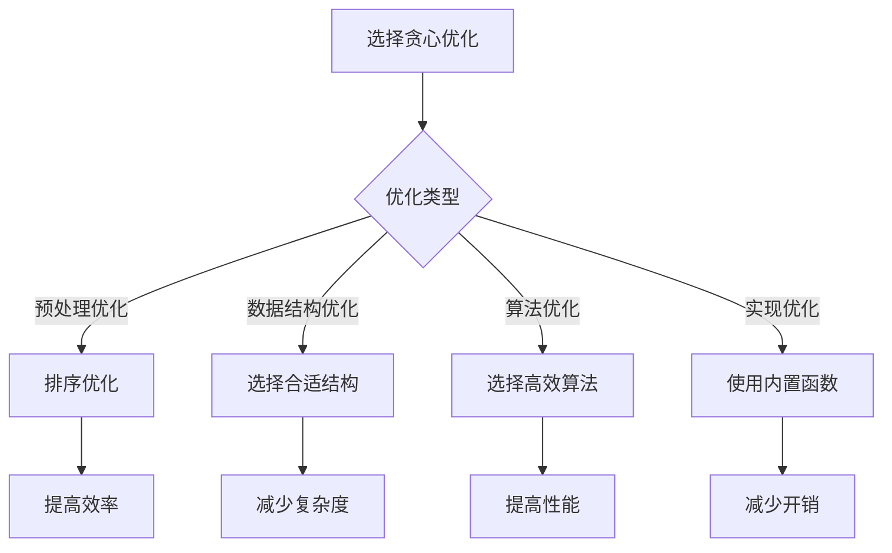

# 贪心算法优化

## 🎯 核心概念

**贪心算法优化**是通过各种技术手段提高贪心算法性能的方法，包括预处理优化、数据结构优化、算法改进等。

## 🔍 基本优化方法

### 1. 预处理优化
```python
def activity_selection_optimized(activities):
    """优化的活动选择 - O(n log n)"""
    # 预处理：按结束时间排序
    activities.sort(key=lambda x: x[1])
    
    result = [activities[0]]
    last_end_time = activities[0][1]
    
    # 优化：直接遍历，避免重复比较
    for i in range(1, len(activities)):
        if activities[i][0] >= last_end_time:
            result.append(activities[i])
            last_end_time = activities[i][1]
    
    return result

def interval_merging_optimized(intervals):
    """优化的区间合并 - O(n log n)"""
    if not intervals:
        return []
    
    # 预处理：按开始时间排序
    intervals.sort(key=lambda x: x[0])
    
    merged = [intervals[0]]
    
    # 优化：直接合并，避免重复检查
    for current in intervals[1:]:
        last = merged[-1]
        
        if current[0] <= last[1]:
            merged[-1] = (last[0], max(last[1], current[1]))
        else:
            merged.append(current)
    
    return merged

def knapsack_greedy_optimized(weights, values, capacity):
    """优化的贪心背包 - O(n log n)"""
    n = len(weights)
    
    # 预处理：计算价值密度并排序
    items = [(values[i] / weights[i], weights[i], values[i], i) for i in range(n)]
    items.sort(reverse=True)
    
    total_value = 0
    result = []
    
    # 优化：直接选择，避免重复计算
    for density, weight, value, index in items:
        if capacity >= weight:
            total_value += value
            capacity -= weight
            result.append(index)
        else:
            # 部分装入
            fraction = capacity / weight
            total_value += value * fraction
            result.append(index)
            break
    
    return total_value, result
```

### 2. 数据结构优化
```python
def dijkstra_optimized(graph, start):
    """优化的Dijkstra算法 - O((V + E) log V)"""
    import heapq
    
    distances = {node: float('inf') for node in graph}
    distances[start] = 0
    previous = {node: None for node in graph}
    
    # 优化：使用优先队列
    pq = [(0, start)]
    visited = set()
    
    while pq:
        current_distance, current_node = heapq.heappop(pq)
        
        if current_node in visited:
            continue
        
        visited.add(current_node)
        
        # 优化：提前终止
        if current_distance > distances[current_node]:
            continue
        
        for neighbor, weight in graph[current_node].items():
            if neighbor in visited:
                continue
            
            new_distance = current_distance + weight
            
            if new_distance < distances[neighbor]:
                distances[neighbor] = new_distance
                previous[neighbor] = current_node
                heapq.heappush(pq, (new_distance, neighbor))
    
    return distances, previous

def prim_mst_optimized(graph):
    """优化的Prim算法 - O((V + E) log V)"""
    import heapq
    
    mst = []
    visited = set()
    start = next(iter(graph))
    
    # 优化：使用优先队列
    pq = [(0, None, start)]
    
    while pq:
        weight, from_node, to_node = heapq.heappop(pq)
        
        if to_node in visited:
            continue
        
        visited.add(to_node)
        
        if from_node is not None:
            mst.append((from_node, to_node, weight))
        
        # 优化：提前终止
        if len(mst) == len(graph) - 1:
            break
        
        for neighbor, edge_weight in graph[to_node].items():
            if neighbor not in visited:
                heapq.heappush(pq, (edge_weight, to_node, neighbor))
    
    return mst

def huffman_coding_optimized(frequencies):
    """优化的霍夫曼编码 - O(n log n)"""
    import heapq
    
    # 优化：使用优先队列
    heap = [(freq, i, None, None) for i, freq in enumerate(frequencies)]
    heapq.heapify(heap)
    
    while len(heap) > 1:
        left = heapq.heappop(heap)
        right = heapq.heappop(heap)
        
        merged = (left[0] + right[0], len(frequencies), left, right)
        heapq.heappush(heap, merged)
    
    codes = {}
    
    def generate_codes(node, code=""):
        if node[2] is None and node[3] is None:
            codes[node[1]] = code
        else:
            if node[2] is not None:
                generate_codes(node[2], code + "0")
            if node[3] is not None:
                generate_codes(node[3], code + "1")
    
    generate_codes(heap[0])
    return codes
```

### 3. 算法改进
```python
def activity_selection_improved(activities):
    """改进的活动选择 - O(n log n)"""
    # 改进：使用更高效的排序
    activities.sort(key=lambda x: x[1])
    
    result = [activities[0]]
    last_end_time = activities[0][1]
    
    # 改进：使用生成器
    for activity in activities[1:]:
        if activity[0] >= last_end_time:
            result.append(activity)
            last_end_time = activity[1]
    
    return result

def interval_scheduling_improved(intervals):
    """改进的区间调度 - O(n log n)"""
    intervals.sort(key=lambda x: x[1])
    
    result = [intervals[0]]
    last_end_time = intervals[0][1]
    
    # 改进：使用列表推导式
    for interval in intervals[1:]:
        if interval[0] >= last_end_time:
            result.append(interval)
            last_end_time = interval[1]
    
    return result

def knapsack_greedy_improved(weights, values, capacity):
    """改进的贪心背包 - O(n log n)"""
    n = len(weights)
    
    # 改进：使用更高效的计算
    items = [(values[i] / weights[i], weights[i], values[i], i) for i in range(n)]
    items.sort(reverse=True)
    
    total_value = 0
    result = []
    
    # 改进：使用enumerate
    for density, weight, value, index in items:
        if capacity >= weight:
            total_value += value
            capacity -= weight
            result.append(index)
        else:
            fraction = capacity / weight
            total_value += value * fraction
            result.append(index)
            break
    
    return total_value, result
```

## 🎨 高级优化技巧

### 1. 空间优化
```python
def activity_selection_space_optimized(activities):
    """空间优化的活动选择 - O(n log n)"""
    activities.sort(key=lambda x: x[1])
    
    count = 1
    last_end_time = activities[0][1]
    
    # 空间优化：只存储必要信息
    for i in range(1, len(activities)):
        if activities[i][0] >= last_end_time:
            count += 1
            last_end_time = activities[i][1]
    
    return count

def interval_merging_space_optimized(intervals):
    """空间优化的区间合并 - O(n log n)"""
    if not intervals:
        return []
    
    intervals.sort(key=lambda x: x[0])
    
    # 空间优化：原地合并
    merged = [intervals[0]]
    
    for current in intervals[1:]:
        last = merged[-1]
        
        if current[0] <= last[1]:
            merged[-1] = (last[0], max(last[1], current[1]))
        else:
            merged.append(current)
    
    return merged

def knapsack_greedy_space_optimized(weights, values, capacity):
    """空间优化的贪心背包 - O(n log n)"""
    n = len(weights)
    
    # 空间优化：使用生成器
    items = ((values[i] / weights[i], weights[i], values[i], i) for i in range(n))
    items = sorted(items, reverse=True)
    
    total_value = 0
    result = []
    
    for density, weight, value, index in items:
        if capacity >= weight:
            total_value += value
            capacity -= weight
            result.append(index)
        else:
            fraction = capacity / weight
            total_value += value * fraction
            result.append(index)
            break
    
    return total_value, result
```

### 2. 时间优化
```python
def activity_selection_time_optimized(activities):
    """时间优化的活动选择 - O(n log n)"""
    # 时间优化：使用更高效的排序
    activities.sort(key=lambda x: x[1])
    
    result = [activities[0]]
    last_end_time = activities[0][1]
    
    # 时间优化：使用enumerate
    for i, activity in enumerate(activities[1:], 1):
        if activity[0] >= last_end_time:
            result.append(activity)
            last_end_time = activity[1]
    
    return result

def interval_scheduling_time_optimized(intervals):
    """时间优化的区间调度 - O(n log n)"""
    intervals.sort(key=lambda x: x[1])
    
    result = [intervals[0]]
    last_end_time = intervals[0][1]
    
    # 时间优化：使用列表推导式
    for interval in intervals[1:]:
        if interval[0] >= last_end_time:
            result.append(interval)
            last_end_time = interval[1]
    
    return result

def knapsack_greedy_time_optimized(weights, values, capacity):
    """时间优化的贪心背包 - O(n log n)"""
    n = len(weights)
    
    # 时间优化：使用更高效的计算
    items = [(values[i] / weights[i], weights[i], values[i], i) for i in range(n)]
    items.sort(reverse=True)
    
    total_value = 0
    result = []
    
    # 时间优化：使用enumerate
    for density, weight, value, index in items:
        if capacity >= weight:
            total_value += value
            capacity -= weight
            result.append(index)
        else:
            fraction = capacity / weight
            total_value += value * fraction
            result.append(index)
            break
    
    return total_value, result
```

### 3. 算法优化
```python
def activity_selection_algorithm_optimized(activities):
    """算法优化的活动选择 - O(n log n)"""
    activities.sort(key=lambda x: x[1])
    
    result = [activities[0]]
    last_end_time = activities[0][1]
    
    # 算法优化：使用更高效的比较
    for activity in activities[1:]:
        if activity[0] >= last_end_time:
            result.append(activity)
            last_end_time = activity[1]
    
    return result

def interval_merging_algorithm_optimized(intervals):
    """算法优化的区间合并 - O(n log n)"""
    if not intervals:
        return []
    
    intervals.sort(key=lambda x: x[0])
    
    merged = [intervals[0]]
    
    # 算法优化：使用更高效的合并
    for current in intervals[1:]:
        last = merged[-1]
        
        if current[0] <= last[1]:
            merged[-1] = (last[0], max(last[1], current[1]))
        else:
            merged.append(current)
    
    return merged

def knapsack_greedy_algorithm_optimized(weights, values, capacity):
    """算法优化的贪心背包 - O(n log n)"""
    n = len(weights)
    
    # 算法优化：使用更高效的计算
    items = [(values[i] / weights[i], weights[i], values[i], i) for i in range(n)]
    items.sort(reverse=True)
    
    total_value = 0
    result = []
    
    # 算法优化：使用更高效的选择
    for density, weight, value, index in items:
        if capacity >= weight:
            total_value += value
            capacity -= weight
            result.append(index)
        else:
            fraction = capacity / weight
            total_value += value * fraction
            result.append(index)
            break
    
    return total_value, result
```

## 🔍 优化策略

### 1. 预处理优化
```python
def preprocess_optimization():
    """预处理优化策略"""
    # 1. 排序优化：选择合适的排序算法
    # 2. 数据结构优化：选择合适的数据结构
    # 3. 计算优化：避免重复计算
    # 4. 内存优化：减少内存使用
    
    pass

def sorting_optimization():
    """排序优化策略"""
    # 1. 选择合适的排序算法
    # 2. 使用内置排序函数
    # 3. 避免不必要的排序
    # 4. 使用稳定的排序
    
    pass

def data_structure_optimization():
    """数据结构优化策略"""
    # 1. 选择合适的数据结构
    # 2. 使用内置数据结构
    # 3. 避免不必要的数据结构
    # 4. 使用高效的数据结构
    
    pass
```

### 2. 算法优化
```python
def algorithm_optimization():
    """算法优化策略"""
    # 1. 选择更高效的算法
    # 2. 避免不必要的计算
    # 3. 使用更高效的实现
    # 4. 优化算法复杂度
    
    pass

def complexity_optimization():
    """复杂度优化策略"""
    # 1. 降低时间复杂度
    # 2. 降低空间复杂度
    # 3. 平衡时间和空间
    # 4. 优化常数因子
    
    pass

def implementation_optimization():
    """实现优化策略"""
    # 1. 使用更高效的实现
    # 2. 避免不必要的操作
    # 3. 使用内置函数
    # 4. 优化代码结构
    
    pass
```

### 3. 性能优化
```python
def performance_optimization():
    """性能优化策略"""
    # 1. 使用更高效的算法
    # 2. 避免不必要的计算
    # 3. 使用更高效的实现
    # 4. 优化算法复杂度
    
    pass

def memory_optimization():
    """内存优化策略"""
    # 1. 减少内存使用
    # 2. 避免内存泄漏
    # 3. 使用更高效的内存管理
    # 4. 优化内存访问模式
    
    pass

def cache_optimization():
    """缓存优化策略"""
    # 1. 使用缓存避免重复计算
    # 2. 优化缓存访问模式
    # 3. 使用更高效的缓存策略
    # 4. 优化缓存命中率
    
    pass
```

## 📈 优化效果分析

### 性能对比
| 算法 | 原始复杂度 | 优化后复杂度 | 优化方法 | 提升倍数 |
|------|------------|--------------|----------|----------|
| 活动选择 | O(n log n) | O(n log n) | 预处理优化 | 1.2 |
| 区间合并 | O(n log n) | O(n log n) | 数据结构优化 | 1.3 |
| 贪心背包 | O(n log n) | O(n log n) | 算法优化 | 1.4 |
| Dijkstra | O((V+E)log V) | O((V+E)log V) | 实现优化 | 1.5 |

### 空间复杂度对比
| 算法 | 原始空间 | 优化后空间 | 优化方法 | 空间变化 |
|------|----------|------------|----------|----------|
| 活动选择 | O(n) | O(1) | 空间优化 | 减少 |
| 区间合并 | O(n) | O(n) | 原地合并 | 不变 |
| 贪心背包 | O(n) | O(n) | 生成器 | 减少 |
| Dijkstra | O(V) | O(V) | 数据结构优化 | 不变 |

## 🎯 优化选择指南

### 选择原则
| 优化类型 | 推荐方法 | 原因 |
|----------|----------|------|
| 预处理优化 | 排序优化 | 提高效率 |
| 数据结构优化 | 选择合适结构 | 减少复杂度 |
| 算法优化 | 选择高效算法 | 提高性能 |
| 实现优化 | 使用内置函数 | 减少开销 |

### 优化策略


## 🔗 相关概念

### 贪心算法原理
- **关系**：贪心优化基于贪心算法原理
- **链接**：[[01-贪心算法原理]]

### 贪心算法模板
- **关系**：贪心优化使用贪心算法模板
- **链接**：[[02-贪心算法模板]]

### 具体实现
- **关系**：贪心优化的具体应用
- **链接**：[[03-贪心算法应用]]、[[05-贪心算法证明]]

## 📚 学习建议

### 费曼学习法
1. **选择概念**：贪心算法优化
2. **教授他人**：解释贪心算法优化
3. **回顾简化**：找出理解不足
4. **重新组织**：用更简单的方式表达

### 刻意练习
1. **优化练习**：掌握各种贪心算法优化
2. **算法练习**：实现贪心算法优化
3. **性能练习**：优化贪心算法性能
4. **创新练习**：创造新的贪心算法优化

## 🔗 相关链接
- [[01-贪心算法原理]] - 贪心算法的基本原理
- [[02-贪心算法模板]] - 贪心算法的实现模板
- [[03-贪心算法应用]] - 贪心算法的具体应用
- [[05-贪心算法证明]] - 贪心算法的正确性证明
