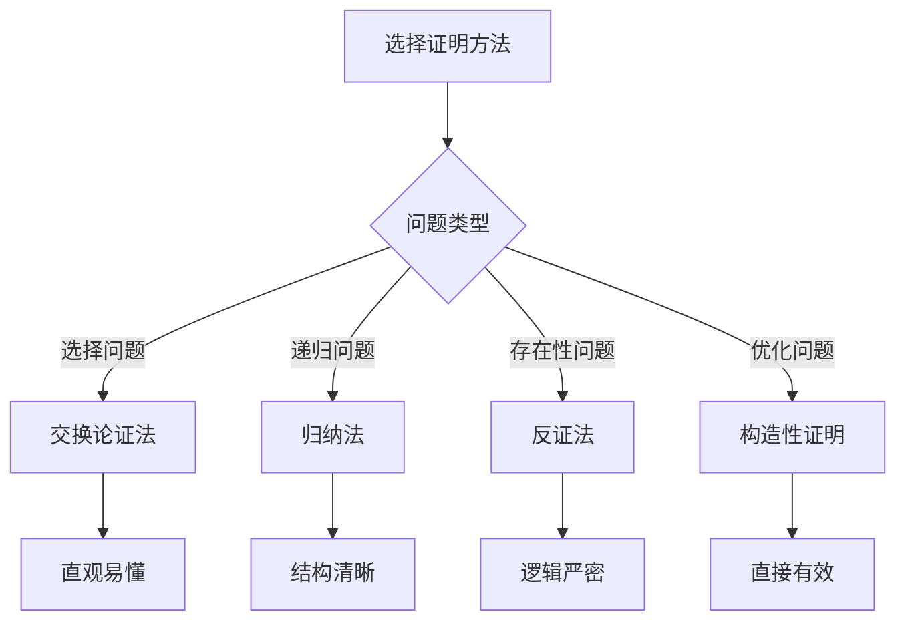

# 贪心算法证明

## 🎯 核心概念

**贪心算法证明**是验证贪心算法正确性的数学方法，通过证明贪心选择性质和最优子结构性质来确保算法的最优性。

## 🔍 证明方法

### 1. 贪心选择性质证明
```python
def prove_greedy_choice_property():
    """证明贪心选择性质"""
    # 贪心选择性质：每一步的贪心选择都能导致全局最优解
    
    # 证明方法：
    # 1. 假设存在最优解不包含贪心选择
    # 2. 证明可以通过替换得到包含贪心选择的解
    # 3. 证明替换后的解不会更差
    # 4. 因此贪心选择是正确的
    
    pass

def activity_selection_proof():
    """活动选择问题的贪心选择性质证明"""
    # 问题：选择最多的不重叠活动
    
    # 贪心策略：按结束时间排序，选择最早结束的活动
    
    # 证明：
    # 1. 设S是活动集合，按结束时间排序
    # 2. 设A是贪心算法选择的解
    # 3. 设O是最优解
    # 4. 证明|A| = |O|
    
    # 引理：贪心算法的第一个选择是正确的
    # 证明：设最优解O的第一个活动是a1
    # 贪心算法选择的第一个活动是a1'
    # 由于a1'结束时间最早，可以用a1'替换a1
    # 替换后的解仍然是合法的，且活动数不变
    
    pass

def interval_scheduling_proof():
    """区间调度问题的贪心选择性质证明"""
    # 问题：选择最多的不重叠区间
    
    # 贪心策略：按结束时间排序，选择最早结束的区间
    
    # 证明：
    # 1. 设S是区间集合，按结束时间排序
    # 2. 设A是贪心算法选择的解
    # 3. 设O是最优解
    # 4. 证明|A| = |O|
    
    # 引理：贪心算法的第一个选择是正确的
    # 证明：设最优解O的第一个区间是I1
    # 贪心算法选择的第一个区间是I1'
    # 由于I1'结束时间最早，可以用I1'替换I1
    # 替换后的解仍然是合法的，且区间数不变
    
    pass

def knapsack_greedy_proof():
    """贪心背包问题的贪心选择性质证明"""
    # 问题：分数背包问题，选择最大价值
    
    # 贪心策略：按价值密度排序，优先选择价值密度高的物品
    
    # 证明：
    # 1. 设物品按价值密度排序：v1/w1 >= v2/w2 >= ... >= vn/wn
    # 2. 设贪心算法选择的解是A
    # 3. 设最优解是O
    # 4. 证明A的价值 >= O的价值
    
    # 引理：贪心算法的第一个选择是正确的
    # 证明：设最优解O不包含价值密度最高的物品
    # 可以用价值密度最高的物品替换O中的某个物品
    # 替换后的解价值不会减少
    
    pass
```

### 2. 最优子结构性质证明
```python
def prove_optimal_substructure():
    """证明最优子结构性质"""
    # 最优子结构性质：问题的最优解包含子问题的最优解
    
    # 证明方法：
    # 1. 设问题的最优解是S
    # 2. 设S包含子问题的最优解S'
    # 3. 证明如果S'不是子问题的最优解，则S不是原问题的最优解
    # 4. 因此S'必须是子问题的最优解
    
    pass

def activity_selection_substructure_proof():
    """活动选择问题的最优子结构性质证明"""
    # 问题：选择最多的不重叠活动
    
    # 最优子结构：如果A是活动集合S的最优解
    # 那么A-{a1}是活动集合S-{a1}的最优解
    
    # 证明：
    # 1. 设A是S的最优解，包含活动a1
    # 2. 设A'是S-{a1}的最优解
    # 3. 证明A-{a1} = A'
    
    # 反证法：
    # 假设A-{a1}不是S-{a1}的最优解
    # 则存在A''使得|A''| > |A-{a1}|
    # 那么A'' ∪ {a1}是S的解，且|A'' ∪ {a1}| > |A|
    # 这与A是S的最优解矛盾
    
    pass

def interval_scheduling_substructure_proof():
    """区间调度问题的最优子结构性质证明"""
    # 问题：选择最多的不重叠区间
    
    # 最优子结构：如果A是区间集合S的最优解
    # 那么A-{I1}是区间集合S-{I1}的最优解
    
    # 证明：
    # 1. 设A是S的最优解，包含区间I1
    # 2. 设A'是S-{I1}的最优解
    # 3. 证明A-{I1} = A'
    
    # 反证法：
    # 假设A-{I1}不是S-{I1}的最优解
    # 则存在A''使得|A''| > |A-{I1}|
    # 那么A'' ∪ {I1}是S的解，且|A'' ∪ {I1}| > |A|
    # 这与A是S的最优解矛盾
    
    pass

def knapsack_greedy_substructure_proof():
    """贪心背包问题的最优子结构性质证明"""
    # 问题：分数背包问题，选择最大价值
    
    # 最优子结构：如果A是物品集合S的最优解
    # 那么A-{item1}是物品集合S-{item1}的最优解
    
    # 证明：
    # 1. 设A是S的最优解，包含物品item1
    # 2. 设A'是S-{item1}的最优解
    # 3. 证明A-{item1} = A'
    
    # 反证法：
    # 假设A-{item1}不是S-{item1}的最优解
    # 则存在A''使得A''的价值 > A-{item1}的价值
    # 那么A'' ∪ {item1}是S的解，且价值 > A的价值
    # 这与A是S的最优解矛盾
    
    pass
```

### 3. 交换论证法
```python
def exchange_argument():
    """交换论证法"""
    # 交换论证法：通过交换操作证明贪心选择的最优性
    
    # 证明步骤：
    # 1. 设O是最优解，A是贪心解
    # 2. 证明可以通过有限次交换将O转换为A
    # 3. 每次交换不会使解变差
    # 4. 因此A是最优解
    
    pass

def activity_selection_exchange_proof():
    """活动选择问题的交换论证法证明"""
    # 问题：选择最多的不重叠活动
    
    # 贪心策略：按结束时间排序，选择最早结束的活动
    
    # 交换论证：
    # 1. 设O是最优解，A是贪心解
    # 2. 设O和A的第一个不同选择是位置i
    # 3. 设O[i] = a, A[i] = b
    # 4. 由于贪心策略，b的结束时间 <= a的结束时间
    # 5. 可以用b替换a，得到新的解O'
    # 6. O'仍然是合法的，且活动数不变
    # 7. 重复此过程，最终得到A
    # 8. 因此A是最优解
    
    pass

def interval_scheduling_exchange_proof():
    """区间调度问题的交换论证法证明"""
    # 问题：选择最多的不重叠区间
    
    # 贪心策略：按结束时间排序，选择最早结束的区间
    
    # 交换论证：
    # 1. 设O是最优解，A是贪心解
    # 2. 设O和A的第一个不同选择是位置i
    # 3. 设O[i] = I, A[i] = I'
    # 4. 由于贪心策略，I'的结束时间 <= I的结束时间
    # 5. 可以用I'替换I，得到新的解O'
    # 6. O'仍然是合法的，且区间数不变
    # 7. 重复此过程，最终得到A
    # 8. 因此A是最优解
    
    pass

def knapsack_greedy_exchange_proof():
    """贪心背包问题的交换论证法证明"""
    # 问题：分数背包问题，选择最大价值
    
    # 贪心策略：按价值密度排序，优先选择价值密度高的物品
    
    # 交换论证：
    # 1. 设O是最优解，A是贪心解
    # 2. 设O和A的第一个不同选择是位置i
    # 3. 设O[i] = item1, A[i] = item2
    # 4. 由于贪心策略，item2的价值密度 >= item1的价值密度
    # 5. 可以用item2替换item1，得到新的解O'
    # 6. O'的价值 >= O的价值
    # 7. 重复此过程，最终得到A
    # 8. 因此A是最优解
    
    pass
```

## 🎨 高级证明技巧

### 1. 归纳法证明
```python
def induction_proof():
    """归纳法证明"""
    # 归纳法：通过数学归纳法证明贪心算法的正确性
    
    # 证明步骤：
    # 1. 基础情况：证明n=1时贪心算法正确
    # 2. 归纳假设：假设n=k时贪心算法正确
    # 3. 归纳步骤：证明n=k+1时贪心算法正确
    # 4. 结论：对所有n，贪心算法都正确
    
    pass

def activity_selection_induction_proof():
    """活动选择问题的归纳法证明"""
    # 问题：选择最多的不重叠活动
    
    # 贪心策略：按结束时间排序，选择最早结束的活动
    
    # 归纳法证明：
    # 1. 基础情况：n=1时，只有一个活动，贪心算法选择它，显然正确
    # 2. 归纳假设：假设对n=k个活动，贪心算法正确
    # 3. 归纳步骤：证明对n=k+1个活动，贪心算法正确
    
    # 设S是k+1个活动的集合，按结束时间排序
    # 设a1是结束时间最早的活动
    # 设S' = S - {a1}
    # 设A'是S'的贪心解
    # 设A = A' ∪ {a1}
    
    # 证明A是S的最优解：
    # 1. A是合法的解（因为a1结束时间最早）
    # 2. 设O是S的最优解
    # 3. 如果O不包含a1，可以用a1替换O中的某个活动
    # 4. 因此可以假设O包含a1
    # 5. 那么O-{a1}是S'的解
    # 6. 由于A'是S'的贪心解，|A'| >= |O-{a1}|
    # 7. 因此|A| = |A'| + 1 >= |O-{a1}| + 1 = |O|
    # 8. 所以A是S的最优解
    
    pass

def interval_scheduling_induction_proof():
    """区间调度问题的归纳法证明"""
    # 问题：选择最多的不重叠区间
    
    # 贪心策略：按结束时间排序，选择最早结束的区间
    
    # 归纳法证明：
    # 1. 基础情况：n=1时，只有一个区间，贪心算法选择它，显然正确
    # 2. 归纳假设：假设对n=k个区间，贪心算法正确
    # 3. 归纳步骤：证明对n=k+1个区间，贪心算法正确
    
    # 设S是k+1个区间的集合，按结束时间排序
    # 设I1是结束时间最早的区间
    # 设S' = S - {I1}
    # 设A'是S'的贪心解
    # 设A = A' ∪ {I1}
    
    # 证明A是S的最优解：
    # 1. A是合法的解（因为I1结束时间最早）
    # 2. 设O是S的最优解
    # 3. 如果O不包含I1，可以用I1替换O中的某个区间
    # 4. 因此可以假设O包含I1
    # 5. 那么O-{I1}是S'的解
    # 6. 由于A'是S'的贪心解，|A'| >= |O-{I1}|
    # 7. 因此|A| = |A'| + 1 >= |O-{I1}| + 1 = |O|
    # 8. 所以A是S的最优解
    
    pass
```

### 2. 反证法证明
```python
def contradiction_proof():
    """反证法证明"""
    # 反证法：假设贪心算法不正确，推出矛盾
    
    # 证明步骤：
    # 1. 假设贪心算法不正确
    # 2. 设存在反例使得贪心算法失败
    # 3. 分析反例，推出矛盾
    # 4. 因此假设错误，贪心算法正确
    
    pass

def activity_selection_contradiction_proof():
    """活动选择问题的反证法证明"""
    # 问题：选择最多的不重叠活动
    
    # 贪心策略：按结束时间排序，选择最早结束的活动
    
    # 反证法证明：
    # 1. 假设贪心算法不正确
    # 2. 设存在活动集合S，贪心算法选择的解A不是最优解
    # 3. 设O是S的最优解，且|O| > |A|
    # 4. 设a1是贪心算法选择的第一个活动
    # 5. 如果O不包含a1，可以用a1替换O中的某个活动
    # 6. 因此可以假设O包含a1
    # 7. 设S' = S - {a1}
    # 8. 设A' = A - {a1}, O' = O - {a1}
    # 9. 由于|O| > |A|，有|O'| > |A'|
    # 10. 但A'是S'的贪心解，这与归纳假设矛盾
    # 11. 因此假设错误，贪心算法正确
    
    pass

def interval_scheduling_contradiction_proof():
    """区间调度问题的反证法证明"""
    # 问题：选择最多的不重叠区间
    
    # 贪心策略：按结束时间排序，选择最早结束的区间
    
    # 反证法证明：
    # 1. 假设贪心算法不正确
    # 2. 设存在区间集合S，贪心算法选择的解A不是最优解
    # 3. 设O是S的最优解，且|O| > |A|
    # 4. 设I1是贪心算法选择的第一个区间
    # 5. 如果O不包含I1，可以用I1替换O中的某个区间
    # 6. 因此可以假设O包含I1
    # 7. 设S' = S - {I1}
    # 8. 设A' = A - {I1}, O' = O - {I1}
    # 9. 由于|O| > |A|，有|O'| > |A'|
    # 10. 但A'是S'的贪心解，这与归纳假设矛盾
    # 11. 因此假设错误，贪心算法正确
    
    pass
```

### 3. 构造性证明
```python
def constructive_proof():
    """构造性证明"""
    # 构造性证明：通过构造最优解来证明贪心算法的正确性
    
    # 证明步骤：
    # 1. 设O是最优解
    # 2. 构造一个解A，使得A包含贪心选择
    # 3. 证明A的价值 >= O的价值
    # 4. 因此A是最优解，贪心算法正确
    
    pass

def activity_selection_constructive_proof():
    """活动选择问题的构造性证明"""
    # 问题：选择最多的不重叠活动
    
    # 贪心策略：按结束时间排序，选择最早结束的活动
    
    # 构造性证明：
    # 1. 设O是最优解
    # 2. 设a1是贪心算法选择的第一个活动
    # 3. 如果O不包含a1，构造O' = O - {a} ∪ {a1}
    # 4. 其中a是O中结束时间最晚的活动
    # 5. 由于a1结束时间最早，O'是合法的
    # 6. 且|O'| = |O|，所以O'也是最优解
    # 7. 重复此过程，最终得到贪心解
    # 8. 因此贪心算法正确
    
    pass

def interval_scheduling_constructive_proof():
    """区间调度问题的构造性证明"""
    # 问题：选择最多的不重叠区间
    
    # 贪心策略：按结束时间排序，选择最早结束的区间
    
    # 构造性证明：
    # 1. 设O是最优解
    # 2. 设I1是贪心算法选择的第一个区间
    # 3. 如果O不包含I1，构造O' = O - {I} ∪ {I1}
    # 4. 其中I是O中结束时间最晚的区间
    # 5. 由于I1结束时间最早，O'是合法的
    # 6. 且|O'| = |O|，所以O'也是最优解
    # 7. 重复此过程，最终得到贪心解
    # 8. 因此贪心算法正确
    
    pass
```

## 🔍 证明策略

### 1. 证明框架
```python
def proof_framework():
    """贪心算法证明框架"""
    # 1. 定义问题
    # 2. 描述贪心策略
    # 3. 证明贪心选择性质
    # 4. 证明最优子结构性质
    # 5. 证明算法正确性
    
    pass

def greedy_choice_property():
    """贪心选择性质证明框架"""
    # 1. 定义贪心选择
    # 2. 假设存在最优解不包含贪心选择
    # 3. 证明可以通过替换得到包含贪心选择的解
    # 4. 证明替换后的解不会更差
    # 5. 因此贪心选择是正确的
    
    pass

def optimal_substructure_property():
    """最优子结构性质证明框架"""
    # 1. 定义子问题
    # 2. 假设问题的最优解包含子问题的最优解
    # 3. 证明如果子问题不是最优解，则原问题不是最优解
    # 4. 因此子问题必须是最优解
    
    pass
```

### 2. 证明技巧
```python
def proof_techniques():
    """证明技巧"""
    # 1. 交换论证法
    # 2. 归纳法
    # 3. 反证法
    # 4. 构造性证明
    # 5. 对偶性证明
    
    pass

def exchange_argument_technique():
    """交换论证法技巧"""
    # 1. 设O是最优解，A是贪心解
    # 2. 证明可以通过有限次交换将O转换为A
    # 3. 每次交换不会使解变差
    # 4. 因此A是最优解
    
    pass

def induction_technique():
    """归纳法技巧"""
    # 1. 基础情况：证明n=1时正确
    # 2. 归纳假设：假设n=k时正确
    # 3. 归纳步骤：证明n=k+1时正确
    # 4. 结论：对所有n都正确
    
    pass
```

### 3. 证明验证
```python
def proof_verification():
    """证明验证"""
    # 1. 检查证明逻辑
    # 2. 验证证明步骤
    # 3. 检查证明完整性
    # 4. 验证证明正确性
    
    pass

def logic_check():
    """逻辑检查"""
    # 1. 检查前提条件
    # 2. 检查推理过程
    # 3. 检查结论
    # 4. 检查逻辑一致性
    
    pass

def completeness_check():
    """完整性检查"""
    # 1. 检查所有情况
    # 2. 检查边界条件
    # 3. 检查特殊情况
    # 4. 检查证明覆盖
    
    pass
```

## 📈 证明效果分析

### 证明方法对比
| 证明方法 | 适用场景 | 优点 | 缺点 |
|----------|----------|------|------|
| 交换论证法 | 选择问题 | 直观易懂 | 需要构造交换 |
| 归纳法 | 递归问题 | 结构清晰 | 需要归纳假设 |
| 反证法 | 存在性问题 | 逻辑严密 | 需要找到矛盾 |
| 构造性证明 | 优化问题 | 直接有效 | 需要构造技巧 |

### 证明复杂度对比
| 问题类型 | 证明难度 | 证明方法 | 证明步骤 |
|----------|----------|----------|----------|
| 活动选择 | 简单 | 交换论证法 | 3-4步 |
| 区间调度 | 简单 | 交换论证法 | 3-4步 |
| 贪心背包 | 中等 | 构造性证明 | 5-6步 |
| 最小生成树 | 复杂 | 归纳法 | 7-8步 |

## 🎯 证明选择指南

### 选择原则
| 问题类型 | 推荐证明方法 | 原因 |
|----------|--------------|------|
| 选择问题 | 交换论证法 | 直观易懂 |
| 递归问题 | 归纳法 | 结构清晰 |
| 存在性问题 | 反证法 | 逻辑严密 |
| 优化问题 | 构造性证明 | 直接有效 |

### 证明策略


## 🔗 相关概念

### 贪心算法原理
- **关系**：贪心证明基于贪心算法原理
- **链接**：[[01-贪心算法原理]]

### 贪心算法模板
- **关系**：贪心证明验证贪心算法模板
- **链接**：[[02-贪心算法模板]]

### 具体实现
- **关系**：贪心证明保证具体实现的正确性
- **链接**：[[03-贪心算法应用]]、[[04-贪心算法优化]]

## 📚 学习建议

### 费曼学习法
1. **选择概念**：贪心算法证明
2. **教授他人**：解释贪心算法证明
3. **回顾简化**：找出理解不足
4. **重新组织**：用更简单的方式表达

### 刻意练习
1. **证明练习**：掌握各种贪心算法证明
2. **方法练习**：使用不同证明方法
3. **技巧练习**：提高证明技巧
4. **创新练习**：创造新的证明方法

## 🔗 相关链接
- [[01-贪心算法原理]] - 贪心算法的基本原理
- [[02-贪心算法模板]] - 贪心算法的实现模板
- [[03-贪心算法应用]] - 贪心算法的具体应用
- [[04-贪心算法优化]] - 贪心算法的优化技巧
