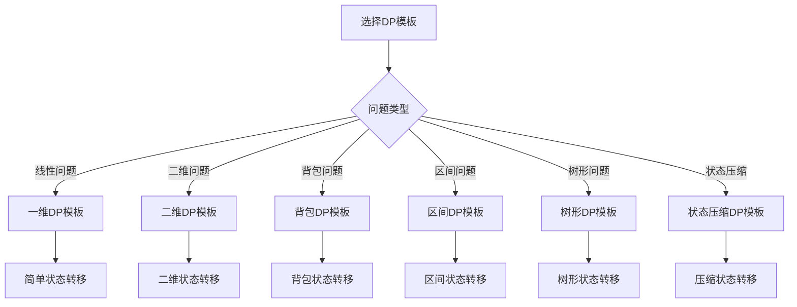

# 动态规划模板

## 🎯 核心概念

**动态规划模板**是解决动态规划问题的标准化框架，包括状态定义、状态转移方程、初始化和边界条件等关键步骤。

## 🔍 基本模板

### 1. 一维DP模板
```python
def one_dimensional_dp_template():
    """一维动态规划模板"""
    # 1. 状态定义：dp[i] 表示...
    # 2. 状态转移方程：dp[i] = f(dp[i-1], dp[i-2], ...)
    # 3. 初始化：dp[0] = ..., dp[1] = ...
    # 4. 边界条件：处理特殊情况
    # 5. 返回结果：dp[n] 或 max(dp)
    
    pass

def fibonacci_template(n):
    """斐波那契数列模板 - O(n)"""
    if n <= 1:
        return n
    
    # 状态定义：dp[i] 表示第i个斐波那契数
    dp = [0] * (n + 1)
    
    # 初始化
    dp[0] = 0
    dp[1] = 1
    
    # 状态转移
    for i in range(2, n + 1):
        dp[i] = dp[i-1] + dp[i-2]
    
    return dp[n]

def climb_stairs_template(n):
    """爬楼梯模板 - O(n)"""
    if n <= 2:
        return n
    
    # 状态定义：dp[i] 表示到达第i阶的方法数
    dp = [0] * (n + 1)
    
    # 初始化
    dp[1] = 1
    dp[2] = 2
    
    # 状态转移
    for i in range(3, n + 1):
        dp[i] = dp[i-1] + dp[i-2]
    
    return dp[n]

def house_robber_template(nums):
    """打家劫舍模板 - O(n)"""
    if not nums:
        return 0
    if len(nums) == 1:
        return nums[0]
    
    # 状态定义：dp[i] 表示前i个房屋能偷到的最大金额
    dp = [0] * len(nums)
    
    # 初始化
    dp[0] = nums[0]
    dp[1] = max(nums[0], nums[1])
    
    # 状态转移
    for i in range(2, len(nums)):
        dp[i] = max(dp[i-1], dp[i-2] + nums[i])
    
    return dp[-1]
```

### 2. 二维DP模板
```python
def two_dimensional_dp_template():
    """二维动态规划模板"""
    # 1. 状态定义：dp[i][j] 表示...
    # 2. 状态转移方程：dp[i][j] = f(dp[i-1][j], dp[i][j-1], dp[i-1][j-1])
    # 3. 初始化：第一行和第一列
    # 4. 边界条件：处理特殊情况
    # 5. 返回结果：dp[m][n] 或 max(dp)
    
    pass

def unique_paths_template(m, n):
    """不同路径模板 - O(m*n)"""
    # 状态定义：dp[i][j] 表示从(0,0)到(i,j)的路径数
    dp = [[0] * n for _ in range(m)]
    
    # 初始化第一行和第一列
    for i in range(m):
        dp[i][0] = 1
    for j in range(n):
        dp[0][j] = 1
    
    # 状态转移
    for i in range(1, m):
        for j in range(1, n):
            dp[i][j] = dp[i-1][j] + dp[i][j-1]
    
    return dp[m-1][n-1]

def min_path_sum_template(grid):
    """最小路径和模板 - O(m*n)"""
    m, n = len(grid), len(grid[0])
    
    # 状态定义：dp[i][j] 表示从(0,0)到(i,j)的最小路径和
    dp = [[0] * n for _ in range(m)]
    
    # 初始化
    dp[0][0] = grid[0][0]
    
    # 初始化第一行
    for j in range(1, n):
        dp[0][j] = dp[0][j-1] + grid[0][j]
    
    # 初始化第一列
    for i in range(1, m):
        dp[i][0] = dp[i-1][0] + grid[i][0]
    
    # 状态转移
    for i in range(1, m):
        for j in range(1, n):
            dp[i][j] = min(dp[i-1][j], dp[i][j-1]) + grid[i][j]
    
    return dp[m-1][n-1]

def longest_common_subsequence_template(text1, text2):
    """最长公共子序列模板 - O(m*n)"""
    m, n = len(text1), len(text2)
    
    # 状态定义：dp[i][j] 表示text1[0:i]和text2[0:j]的LCS长度
    dp = [[0] * (n + 1) for _ in range(m + 1)]
    
    # 状态转移
    for i in range(1, m + 1):
        for j in range(1, n + 1):
            if text1[i-1] == text2[j-1]:
                dp[i][j] = dp[i-1][j-1] + 1
            else:
                dp[i][j] = max(dp[i-1][j], dp[i][j-1])
    
    return dp[m][n]
```

### 3. 背包DP模板
```python
def knapsack_dp_template():
    """背包动态规划模板"""
    # 1. 状态定义：dp[i][j] 表示前i个物品在容量为j的背包中的最大价值
    # 2. 状态转移方程：dp[i][j] = max(dp[i-1][j], dp[i-1][j-w[i]] + v[i])
    # 3. 初始化：dp[0][j] = 0
    # 4. 边界条件：j < w[i] 时，dp[i][j] = dp[i-1][j]
    # 5. 返回结果：dp[n][W]
    
    pass

def zero_one_knapsack_template(weights, values, capacity):
    """0-1背包模板 - O(n*W)"""
    n = len(weights)
    
    # 状态定义：dp[i][j] 表示前i个物品在容量为j的背包中的最大价值
    dp = [[0] * (capacity + 1) for _ in range(n + 1)]
    
    # 状态转移
    for i in range(1, n + 1):
        for j in range(capacity + 1):
            if j < weights[i-1]:
                dp[i][j] = dp[i-1][j]
            else:
                dp[i][j] = max(dp[i-1][j], dp[i-1][j-weights[i-1]] + values[i-1])
    
    return dp[n][capacity]

def unbounded_knapsack_template(weights, values, capacity):
    """完全背包模板 - O(n*W)"""
    n = len(weights)
    
    # 状态定义：dp[i][j] 表示前i个物品在容量为j的背包中的最大价值
    dp = [[0] * (capacity + 1) for _ in range(n + 1)]
    
    # 状态转移
    for i in range(1, n + 1):
        for j in range(capacity + 1):
            if j < weights[i-1]:
                dp[i][j] = dp[i-1][j]
            else:
                dp[i][j] = max(dp[i-1][j], dp[i][j-weights[i-1]] + values[i-1])
    
    return dp[n][capacity]

def coin_change_template(coins, amount):
    """硬币找零模板 - O(n*amount)"""
    # 状态定义：dp[i] 表示凑成金额i的最少硬币数
    dp = [float('inf')] * (amount + 1)
    
    # 初始化
    dp[0] = 0
    
    # 状态转移
    for coin in coins:
        for i in range(coin, amount + 1):
            dp[i] = min(dp[i], dp[i-coin] + 1)
    
    return dp[amount] if dp[amount] != float('inf') else -1
```

## 🎨 高级模板

### 1. 区间DP模板
```python
def interval_dp_template():
    """区间动态规划模板"""
    # 1. 状态定义：dp[i][j] 表示区间[i,j]的最优解
    # 2. 状态转移方程：dp[i][j] = f(dp[i][k], dp[k+1][j]) for k in [i, j)
    # 3. 初始化：dp[i][i] = ...
    # 4. 边界条件：处理特殊情况
    # 5. 返回结果：dp[0][n-1]
    
    pass

def matrix_chain_multiplication_template(p):
    """矩阵链乘法模板 - O(n^3)"""
    n = len(p) - 1
    
    # 状态定义：dp[i][j] 表示矩阵链A[i]...A[j]的最小乘法次数
    dp = [[0] * n for _ in range(n)]
    
    # 状态转移
    for length in range(2, n + 1):
        for i in range(n - length + 1):
            j = i + length - 1
            dp[i][j] = float('inf')
            
            for k in range(i, j):
                cost = dp[i][k] + dp[k+1][j] + p[i] * p[k+1] * p[j+1]
                dp[i][j] = min(dp[i][j], cost)
    
    return dp[0][n-1]

def palindrome_substring_template(s):
    """回文子串模板 - O(n^2)"""
    n = len(s)
    
    # 状态定义：dp[i][j] 表示s[i:j+1]是否为回文
    dp = [[False] * n for _ in range(n)]
    count = 0
    
    # 单个字符都是回文
    for i in range(n):
        dp[i][i] = True
        count += 1
    
    # 两个字符的情况
    for i in range(n - 1):
        if s[i] == s[i + 1]:
            dp[i][i + 1] = True
            count += 1
    
    # 三个或更多字符的情况
    for length in range(3, n + 1):
        for i in range(n - length + 1):
            j = i + length - 1
            if s[i] == s[j] and dp[i + 1][j - 1]:
                dp[i][j] = True
                count += 1
    
    return count
```

### 2. 树形DP模板
```python
def tree_dp_template():
    """树形动态规划模板"""
    # 1. 状态定义：dp[node] 表示以node为根的子树的最优解
    # 2. 状态转移方程：dp[node] = f(dp[child1], dp[child2], ...)
    # 3. 初始化：叶子节点的值
    # 4. 边界条件：处理特殊情况
    # 5. 返回结果：dp[root]
    
    pass

class TreeNode:
    def __init__(self, val=0, left=None, right=None):
        self.val = val
        self.left = left
        self.right = right

def binary_tree_max_path_sum_template(root):
    """二叉树最大路径和模板 - O(n)"""
    def dfs(node):
        if not node:
            return 0
        
        # 递归计算左右子树的最大路径和
        left_sum = max(0, dfs(node.left))
        right_sum = max(0, dfs(node.right))
        
        # 更新全局最大值
        nonlocal max_sum
        max_sum = max(max_sum, node.val + left_sum + right_sum)
        
        # 返回当前节点的最大路径和
        return node.val + max(left_sum, right_sum)
    
    max_sum = float('-inf')
    dfs(root)
    return max_sum

def house_robber_iii_template(root):
    """打家劫舍III模板 - O(n)"""
    def dfs(node):
        if not node:
            return (0, 0)  # (偷, 不偷)
        
        left_rob, left_not_rob = dfs(node.left)
        right_rob, right_not_rob = dfs(node.right)
        
        # 偷当前节点
        rob = node.val + left_not_rob + right_not_rob
        
        # 不偷当前节点
        not_rob = max(left_rob, left_not_rob) + max(right_rob, right_not_rob)
        
        return (rob, not_rob)
    
    rob, not_rob = dfs(root)
    return max(rob, not_rob)
```

### 3. 状态压缩DP模板
```python
def state_compression_dp_template():
    """状态压缩动态规划模板"""
    # 1. 状态定义：dp[mask] 表示状态mask的最优解
    # 2. 状态转移方程：dp[mask] = f(dp[mask'], ...)
    # 3. 初始化：dp[0] = ...
    # 4. 边界条件：处理特殊情况
    # 5. 返回结果：dp[target_mask]
    
    pass

def traveling_salesman_template(graph):
    """旅行商问题模板 - O(n^2 * 2^n)"""
    n = len(graph)
    
    # 状态定义：dp[mask][i] 表示访问了mask中的城市，当前在城市i的最短路径
    dp = [[float('inf')] * n for _ in range(1 << n)]
    
    # 初始化
    dp[1][0] = 0
    
    # 状态转移
    for mask in range(1 << n):
        for i in range(n):
            if not (mask & (1 << i)):
                continue
            
            for j in range(n):
                if mask & (1 << j):
                    continue
                
                dp[mask | (1 << j)][j] = min(
                    dp[mask | (1 << j)][j],
                    dp[mask][i] + graph[i][j]
                )
    
    # 返回结果
    result = float('inf')
    for i in range(1, n):
        result = min(result, dp[(1 << n) - 1][i] + graph[i][0])
    
    return result

def subset_sum_template(nums, target):
    """子集和问题模板 - O(n * target)"""
    n = len(nums)
    
    # 状态定义：dp[i][j] 表示前i个数字能否组成和为j
    dp = [[False] * (target + 1) for _ in range(n + 1)]
    
    # 初始化
    dp[0][0] = True
    
    # 状态转移
    for i in range(1, n + 1):
        for j in range(target + 1):
            dp[i][j] = dp[i-1][j]
            if j >= nums[i-1]:
                dp[i][j] = dp[i][j] or dp[i-1][j-nums[i-1]]
    
    return dp[n][target]
```

## 🔍 模板选择指南

### 选择原则
| 问题类型 | 推荐模板 | 原因 |
|----------|----------|------|
| 线性问题 | 一维DP模板 | 状态转移简单 |
| 二维问题 | 二维DP模板 | 需要二维状态 |
| 背包问题 | 背包DP模板 | 专门针对背包问题 |
| 区间问题 | 区间DP模板 | 需要区间状态 |
| 树形问题 | 树形DP模板 | 需要树形结构 |
| 状态压缩 | 状态压缩DP模板 | 需要状态压缩 |

### 模板应用


## 📈 模板优化

### 空间优化
```python
def space_optimization_template():
    """空间优化模板"""
    # 1. 滚动数组：只保留必要的状态
    # 2. 状态压缩：使用位运算压缩状态
    # 3. 原地DP：在原数组上进行DP
    # 4. 降维：将多维DP降为一维
    
    pass

def fibonacci_space_optimized(n):
    """斐波那契数列空间优化 - O(1)空间"""
    if n <= 1:
        return n
    
    prev2 = 0
    prev1 = 1
    
    for i in range(2, n + 1):
        current = prev1 + prev2
        prev2 = prev1
        prev1 = current
    
    return prev1

def unique_paths_space_optimized(m, n):
    """不同路径空间优化 - O(n)空间"""
    dp = [1] * n
    
    for i in range(1, m):
        for j in range(1, n):
            dp[j] += dp[j-1]
    
    return dp[n-1]

def knapsack_space_optimized(weights, values, capacity):
    """背包问题空间优化 - O(W)空间"""
    n = len(weights)
    dp = [0] * (capacity + 1)
    
    for i in range(n):
        for j in range(capacity, weights[i] - 1, -1):
            dp[j] = max(dp[j], dp[j-weights[i]] + values[i])
    
    return dp[capacity]
```

### 时间优化
```python
def time_optimization_template():
    """时间优化模板"""
    # 1. 预处理：预先计算必要信息
    # 2. 剪枝：提前终止不必要的计算
    # 3. 记忆化：避免重复计算
    # 4. 并行化：使用并行计算
    
    pass

def longest_increasing_subsequence_optimized(nums):
    """最长递增子序列时间优化 - O(n log n)"""
    if not nums:
        return 0
    
    tails = []
    
    for num in nums:
        left, right = 0, len(tails)
        while left < right:
            mid = (left + right) // 2
            if tails[mid] < num:
                left = mid + 1
            else:
                right = mid
        
        if left == len(tails):
            tails.append(num)
        else:
            tails[left] = num
    
    return len(tails)

def coin_change_optimized(coins, amount):
    """硬币找零时间优化 - O(n * amount)"""
    dp = [float('inf')] * (amount + 1)
    dp[0] = 0
    
    for coin in coins:
        for i in range(coin, amount + 1):
            dp[i] = min(dp[i], dp[i-coin] + 1)
    
    return dp[amount] if dp[amount] != float('inf') else -1
```

## 🔗 相关概念

### 动态规划原理
- **关系**：动态规划模板基于动态规划原理
- **链接**：[[01-动态规划原理]]

### 具体应用
- **关系**：动态规划模板的具体应用
- **链接**：[[03-动态规划应用]]、[[04-动态规划优化]]

### 算法证明
- **关系**：动态规划模板的正确性证明
- **链接**：[[05-动态规划证明]]

## 📚 学习建议

### 费曼学习法
1. **选择概念**：动态规划模板
2. **教授他人**：解释动态规划模板
3. **回顾简化**：找出理解不足
4. **重新组织**：用更简单的方式表达

### 刻意练习
1. **模板练习**：掌握各种动态规划模板
2. **应用练习**：使用模板解决实际问题
3. **优化练习**：优化模板的空间和时间复杂度
4. **创新练习**：创造新的动态规划模板

## 🔗 相关链接
- [[01-动态规划原理]] - 动态规划的基本原理
- [[03-动态规划应用]] - 动态规划的具体应用
- [[04-动态规划优化]] - 动态规划的优化技巧
- [[05-动态规划证明]] - 动态规划的正确性证明
